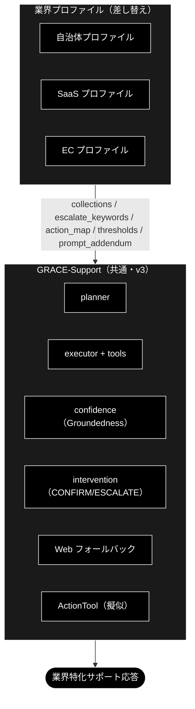

# GRACE-Support 業界特化 設計書（自治体 / SaaS / EC）

**Version 1.5（3 業種 KPI 再計測完了: gov 7/7・saas 8/8・ec 9/9＝decision_accuracy 1.000。#11/#12 の効果確認）** | 最終更新: 2026-07-11

> 🔍 **仕様レビュー**: 本設計・実装の横断レビューと改善提案は
> [`docs/vertical_spec_review.md`](../../docs/vertical_spec_review.md) を参照
> （残タスク 1・2 は既存コアフックでほぼ実現可能という再見積もりを含む）。

> ✅ **実装状況**: `VerticalProfile` と `--vertical {gov|saas|ec}` は **`agent_support_example.py` に実装済み**（PR #106）。しきい値上書き・エスカレ語（二段判定）・アクション対応（二段判定）・本人確認に加え、`collections`（`allowed_collections` による検索範囲の実限定）と `prompt_addendum`（reasoning プロンプトへの注入）も**フル配線済み**。KPI 評価は `eval/vertical/`（§9）、テスト用コレクションの一括登録は `eval/vertical/register_test_collections.py`（§8）を参照。

> **参考ドキュメント**
> - [`grace/doc/agent_support_example.md`](./agent_support_example.md) — GRACE-Support 本体の設計書（v1〜v3）
> - [`docs/migration_and_update.md`](../../docs/migration_and_update.md) — 需要分析・全体ロードマップ（本書はその「業界特化」フェーズの詳細）
> - [`grace/doc/grace_core_flow.md`](./grace_core_flow.md) — 5 段階設計・8 コアモジュール

---

## 目次

- [概要](#概要)
- [1. 業界プロファイル（差し替えの共通枠）](#1-業界プロファイル差し替えの共通枠)
- [2. 業界プロファイルの GRACE-Support への適用](#2-業界プロファイルの-grace-support-への適用)
- [3. 自治体（Local Government）](#3-自治体local-government)
- [4. SaaS](#4-saas)
- [5. EC（Eコマース）](#5-eceコマース)
- [6. 実装への落とし込み（VerticalProfile 案）](#6-実装への落とし込みverticalprofile-案)
- [7. 実行例（コマンド）](#7-実行例コマンド)
- [8. テスト用データ](#8-テスト用データ)
- [9. テスト（KPI 評価・単体テスト・コスト）](#9-テストkpi-評価単体テストコスト)
- [10. 残タスク（次工程候補）](#10-残タスク次工程候補)
- [11. 変更履歴](#11-変更履歴)

---

## 概要

### 主な責務

業界特化レイヤー（`VerticalProfile` ＋ `eval/vertical/`）が GRACE-Support 共通エンジンの上で担う責務は次の 5 つ。

1. **検索範囲の限定** — 業界の専用コレクションだけを回答根拠にする（`allowed_collections`。フォールバック連鎖も業界外へ漏らさない）
2. **判断基準の切替** — 「答える / 人に渡す」の閾値・強制エスカレ語・アクション語彙を業界の業務設計に合わせる
3. **安全装置の業界適合** — 本人確認（EC）・断定回避（gov）・「情報なし回答」の検知（④'）など、**間違え方の業界差**を吸収する
4. **語り口の注入** — `prompt_addendum` により回答方針（用語・禁則・トーン）を業界化する
5. **業界別の品質保証** — 期待ラベル付きテストケースと KPI で「良いサポート」の定義ごと評価する（テスト用データの整備を含む）

### 各責務対応のモジュール

| 責務 | 実装（`agent_support_example.py` / `grace/`） | テスト・データ資産 |
|---|---|---|
| 検索範囲の限定 | `PROFILES[v].collections` → `config.qdrant.allowed_collections` → `RAGSearchTool._apply_allowed_collections` | `tests/grace/test_vertical_scope.py` |
| 判断基準の切替 | `_answer_gate()`（閾値）/ `_should_force_escalate()`（エスカレ語×意図分類）/ `_decide_action()`（アクション語彙） | `tests/test_agent_support_vertical.py` |
| 安全装置の業界適合 | `_perform_action()`（本人確認）/ `_detect_no_info_answer()`＋`create_no_info_judge()`（④'） | `tests/test_agent_support_vertical.py` |
| 語り口の注入 | `PROFILES[v].prompt_addendum` → `config.llm.prompt_addendum` → `ReasoningTool._build_prompt()` | —（reasoning 出力に反映） |
| 業界別の品質保証 | `eval/vertical/run.py`・`metrics.py`・`cases/*.jsonl`・`register_test_collections.py`・`data/*.csv` | `tests/eval/test_register_test_collections.py` |

### 主要機能一覧

| 機能 | 概要 | 参照 |
|---|---|---|
| `--vertical gov / saas / ec` | プロファイル一括切替 CLI（閾値・エスカレ語・アクション・本人確認・検索範囲・方針） | §7 |
| 二段判定（エスカレ語・アクション語） | キーワード候補一致 → 軽量 LLM 意図分類で FAQ 質問の誤検知を抑止 | §6 |
| ④' 情報なし回答検知 | 「見つかりませんでした」型回答を実質回答判定（answered/no_info）で escalate へ | §6・§10 |
| テストコレクション一括登録 | 合成 Q&A（6 CSV）を専用コレクションへ 1 コマンドで登録 | §8 |
| KPI 自動計測 | 5 カテゴリ×8 指標で業界別品質を数値化 | §9 |

### 定義: 何をもって「業界特化」と呼ぶか

**「業界特化」＝共通エンジン（GRACE-Support）は 1 つのまま、業界ごとに差し替わる 7 つの機構（VerticalProfile）で挙動を変えること。**
エンジン本体（Plan → 内部 RAG → 根拠検証 → 回答ゲート → Web 裏取り → アクション＋HITL）は
gov / saas / ec で完全に共通であり、業界性はすべて**プロファイルの差分として注入**される。

言い換えると、業界特化の実体は次の 6 軸を業界別に定義したものである:
**「①何を知識源とし、②どこまで自信があれば答え、③何を人間に渡し、④何を実行し、⑤どう語り、⑥何で測るか」**。

### 業界特化を構成する 7 つの機構

| # | 機構 | 何が業界ごとに変わるか | 例 | 実装位置 |
|---|---|---|---|---|
| 1 | **検索スコープ**（`collections` → `config.qdrant.allowed_collections`） | 回答の根拠にしてよいナレッジの範囲。フォールバック連鎖も業界外へ漏れない | gov=FAQ・法令系のみ / ec=規定・注文 FAQ のみ | `RAGSearchTool._apply_allowed_collections` |
| 2 | **回答の厳しさ**（`notify_th` / `confirm_th`） | 「どこまで確信があれば答えてよいか」の基準 | gov は 0.8/0.5（既定 0.7/0.4 より厳格）＝「間違えるくらいなら窓口へ」 | `_answer_gate()` |
| 3 | **強制エスカレ基準**（`escalate_keywords`＋意図分類） | 機械に答えさせてはいけない話題の定義（二段判定で FAQ 質問の誤検知は抑止） | gov=法的判断・減免・個別事情 / saas=障害・課金 / ec=決済・破損 | `_should_force_escalate()` |
| 4 | **アクション語彙**（`action_map`） | 「対応」と見なす意図と、その処理先 | ec「返品したい」→起票 / gov「様式がほしい」→案内返信（申請自体は人間） | `_decide_action()` |
| 5 | **本人確認**（`require_identity`) | 副作用操作の前に本人確認を要するか | EC のみ True（注文情報の操作） | `_perform_action()` |
| 6 | **業務方針**（`prompt_addendum` → `config.llm.prompt_addendum`） | 回答の語り口・禁則 | gov「断定回避・担当課明示・個人情報を尋ねない」/ saas「バージョン明示・再現手順」 | `ReasoningTool._build_prompt()` |
| 7 | **評価基準**（KPI・期待ラベル付きテスト質問） | 何をもって良いサポートとするか | gov「根拠なし回答=0」/ ec「本人確認遵守率=100%」 | `eval/vertical/`（`cases/*.jsonl`・`metrics.py`） |

### 成熟度: 現時点で「特化」と呼べる度合い（正直な評価）

- **厚い部分（実質的な差別化）**: 機構 3・4・5。同種の依頼でも EC では「本人確認 → CONFIRM → 起票」、
  gov では「有人窓口へ」と、**業界の業務設計（誰が何をしてよいか）の違いをコードが実際に分岐**している。
- **薄い部分（まだ枠のみ）**:
  - 機構 1 のナレッジは**合成テストデータで登録可能になった**段階（PR #117・§8）。
    `eval/vertical/data/*.csv`（各 10 Q&A）を `register_test_collections.py` で専用コレクションへ
    1 コマンド登録でき、KPI 計測と keyword-trap の安定化には十分。ただしこれは**評価用の疑似データ**であり、
    実運用ナレッジ（実 FAQ・実規約・e-Gov 等）の投入は引き続き将来課題。gov は暫定代替 `wikipedia_ja` も併用。
  - 機構 2・6 は数値 2 つと日本語 1 文であり、「特化」というより業界別チューニングの置き場。
  - 業界固有ワークフロー（実返品 API・申請システム連携）、業界用語辞書、制度改正追随は**未実装**。
    ActionTool は擬似（ドライラン）。

### 設計理由（トレードオフ）

「業界ごとに別アプリを作る」のではなく「プロファイル差し替え」にしたのは、回答エンジン・出典検証・
HITL という難しい共通部分を 1 回だけ作り、**業界追加を設定の追加に落とす**ため。その代償として、
現段階の「特化」の深さは上記パラメータの深さ＝**投入されたデータの質**に依存する。
次の一手は機能追加ではなく**データ登録と再計測**（`register_test_collections --recreate` → `eval/vertical/` で KPI 再計測。§8・§9）、
その先に実運用データの投入がある。

---

## 1. 業界プロファイル（差し替えの共通枠）

| 差し替え項目 | 説明 | GRACE-Support 上の反映先 |
|---|---|---|
| `collections` | 検索対象コレクションの許可リスト | planner の `collection` 指定 / tools の検索範囲 |
| `sample_queries` | 代表想定質問（評価・回帰用） | KPI 計測・チューニング |
| `escalate_keywords` | 強制エスカレの語（例: 障害・決済・法的判断） | 回答ゲート前の割り込み判定 |
| `require_identity` | 本人確認が必要な操作か | アクション前 HITL（CONFIRM）強化 |
| `action_map` | 意図 → アクション種別の対応 | `_decide_action()` |
| `thresholds` | notify/confirm の上書き（厳しめ/緩め） | `_answer_gate()` |
| `prompt_addendum` | 業界固有の注意（用語・断定回避 等） | reasoning プロンプトへ追記 |
| `kpi` | 運用指標 | 評価 |

---

## 2. 業界プロファイルの GRACE-Support への適用



---

## 3. 自治体（Local Government）

| 項目 | 内容 |
|------|------|
| **主な責務** | **「誤案内ゼロ」**。出典（条例名・案内ページ）を示せる範囲でのみ答え、法的判断・個別事情は必ず窓口へ渡す |
| **対象コレクション** | `条例・要綱`、`手続き案内`、`窓口FAQ`（住民向け） |
| **専用コレクション（テストデータ）** | `gov_faq_anthropic` / `gov_laws_anthropic`（＋暫定代替 `wikipedia_ja`）← `eval/vertical/data/gov_faq.csv` / `gov_laws.csv`（§8） |
| **代表想定質問** | 「住民票の写しの取り方は？」「国民健康保険の加入手続きは？」「粗大ごみの出し方は？」「保育園の申込期限は？」 |
| **エスカレ基準** | 法的判断・個別事情・出典なしは**必ず有人**。断定を避け、根拠（条例名・案内ページ）を必須にする |
| **アクション** | `send_reply`（担当課・必要書類・窓口時間の案内）。申請受付そのものは人間（`escalate_to_human`） |
| **KPI** | 出典付与率 ≈ 100% / 根拠なし回答 = 0 / 一次解決率 / **誤案内 = 0** |
| **特有の注意** | 正確性最優先・**断定回避**、個人情報を聞かない、高齢者にも平易な表現、最新の制度改正への追随 |

> 自治体は「間違えない・出典を示す・迷ったら窓口へ」を最重視。`thresholds` は厳しめ（confirm/notify を上げる）に設定し、少しでも根拠が弱ければエスカレへ倒す。

---

## 4. SaaS

| 項目 | 内容 |
|------|------|
| **主な責務** | **「速い自己解決と正しい振り分け」**。ドキュメント根拠で即答し、障害・課金・セキュリティは即時に起票／有人へ |
| **対象コレクション** | `製品ドキュメント`、`APIリファレンス`、`リリースノート`、`既知の不具合` |
| **専用コレクション（テストデータ）** | `saas_docs_anthropic` / `saas_api_anthropic` ← `eval/vertical/data/saas_docs.csv` / `saas_api.csv`（§8） |
| **代表想定質問** | 「API のレート制限は？」「Webhook の設定方法は？」「このエラーコードの意味は？」「v2 への移行手順は？」 |
| **エスカレ基準** | 障害・課金・セキュリティ、再現不能、バージョン不一致は `create_ticket`／`escalate_to_human` |
| **アクション** | `create_ticket`（障害・不具合）、`send_reply`（ドキュメントリンク・ステータスページ案内） |
| **KPI** | 自己解決率（deflection）/ 一次応答時間 / チケット適正振り分け率 / 再現手順取得率 |
| **特有の注意** | **バージョン差の明示**、出典にドキュメント URL、コード例の正確性、Web フォールバックは公式ドキュメント優先 |

> SaaS は「速く・正確に・再現手順つき」。`escalate_keywords` に「障害」「ダウン」「課金」「情報漏えい」等を入れ、即エスカレ。

---

## 5. EC（Eコマース）

| 項目 | 内容 |
|------|------|
| **主な責務** | **「安全な実行」**。返品・キャンセル等の副作用操作を本人確認 → CONFIRM の二段で守りながら完遂させる |
| **対象コレクション** | `商品情報`、`返品・交換規定`、`配送・送料`、`注文FAQ` |
| **専用コレクション（テストデータ）** | `ec_policy_anthropic` / `ec_faq_anthropic` ← `eval/vertical/data/ec_policy.csv` / `ec_faq.csv`（§8） |
| **代表想定質問** | 「返品したい」「配送状況を知りたい」「サイズ交換できる？」「注文をキャンセルしたい」 |
| **エスカレ基準** | 個人注文情報の照会・変更（**本人確認必須**）、決済トラブルは有人／本人確認フロー |
| **アクション** | `create_ticket`（返品受付・要 CONFIRM＋本人確認）、`send_reply`（規定・返信テンプレ）。注文照会は注文 ID 必須 |
| **KPI** | 自己解決率 / 返品処理時間 / **誤操作 = 0（本人確認必須）** / CS 満足度 |
| **特有の注意** | **個人情報・注文権限の確認を必須**（`require_identity=True` → アクション前 HITL を強化）、規定の版管理 |

> EC は「行動（返品・キャンセル）に直結」するため、v3 のアクション＋HITL が本領。副作用のある操作は本人確認 → CONFIRM の二段で守る。

---

## 6. 実装への落とし込み（VerticalProfile 案）

共通コードは変えず、**プロファイルを渡すだけ**で切り替える設計。

```text
VerticalProfile（dataclass 案）
  - name: str                      # "gov" | "saas" | "ec"
  - collections: list[str]         # 検索許可コレクション
  - escalate_keywords: list[str]   # 強制エスカレ語
  - require_identity: bool         # アクション前に本人確認を必須化
  - action_map: dict[str, str]     # 意図キーワード → action_type
  - notify_th / confirm_th: float  # 閾値の上書き（未指定なら config 既定）
  - prompt_addendum: str           # reasoning への業界注意書き
  - sample_queries: list[str]      # 評価用
  - kpi: list[str]
```

**適用ポイント（GRACE-Support への差し込み）**:

| プロファイル項目 | 差し込み先（既存関数) | 状態 |
|---|---|---|
| `escalate_keywords` | **二段判定**: キーワード候補一致（`_match_keyword`）→ 軽量 LLM 意図分類（`create_intent_classifier`・question/request/incident）。question（FAQ質問）は誤検知とみなし通常フロー継続、それ以外・分類失敗は即 `escalate`（Web もスキップ） | ✅ 実装済み（`_should_force_escalate`） |
| `notify_th`/`confirm_th` | `_answer_gate()` のしきい値を上書き | ✅ 実装済み |
| `action_map` | `_decide_action()`（二段判定: キーワード候補 → 意図分類。question は起票せず回答のみ） | ✅ 実装済み |
| `require_identity` | `_perform_action()`（本人確認ステップを前置。起動有無は `SupportResult.identity_checked` に記録） | ✅ 実装済み |
| `collections` | `config.qdrant.allowed_collections` 経由で `RAGSearchTool` の検索候補（明示指定・フォールバック連鎖を含む）を許可リストで限定。実コレクション名（`gov_faq_anthropic` 等）を割り当て済み。未登録なら制限を適用せず従来動作（警告ログ） | ✅ 実装済み（`RAGSearchTool._apply_allowed_collections`） |
| `prompt_addendum` | `config.llm.prompt_addendum` 経由で `ReasoningTool._build_prompt()` のシステム指示直後に「業務方針（遵守）」として注入。executor 経由・Web フォールバック経由の両 reasoning に効く | ✅ 実装済み |
| `sample_queries` / `kpi` | 期待ラベル付きテストケースは `eval/vertical/cases/<vertical>.jsonl` に外部化（dataclass には持たせない）。KPI は `eval/vertical/run.py` で自動計測 | ✅ 実装済み（評価ランナー） |

**CLI**: `python agent_support_example.py --vertical gov "住民票の取り方は？"`（プロファイルを選択）。**実装済み**。

**実装状況**: `VerticalProfile` 導入と gov/saas/ec の 3 プロファイルは実装済み（PR #106）。設計時の実装順（自治体 → SaaS → EC）どおり 3 業界を同時に組み込み済みで、上表のとおり全項目が配線済み。残件は §10 を参照。

---

## 7. 実行例（コマンド）

業界別アプリの実行例を示す。`--vertical` フラグは**実装済み**（PR #106）であり、次の 2 段構えで示す。

- **7.1**: 共通コマンド（GRACE-Support v3・プロファイル未適用）で、業界の代表シナリオを試す
- **7.2**: `--vertical` でプロファイルを切り替えて実行する（推奨）

共通の前提: `.env` に `ANTHROPIC_API_KEY` / `GOOGLE_API_KEY`、Qdrant 起動済み＋対象コレクション登録済み
（専用コレクションは `uv run python -m eval.vertical.register_test_collections --recreate` で一括登録できる。§8）。
uv 管理環境では `python …` を `uv run python …` に読み替える。

### 7.1 現時点（v3 共通コマンドで業界シナリオを試す）

共通 CLI は `agent_support_example.py`（引数: `query` / `-v` / `--no-web` / `--no-action` / `--dry-run`）。`--vertical` を付けない場合は業界チューニング（エスカレ語・しきい値・アクション対応）が適用されないため、共通挙動の確認用。

**自治体（正確性・出典最優先）**
```bash
python agent_support_example.py "住民票の写しの取り方は？"
python agent_support_example.py -v "国民健康保険の加入手続きは？"   # 支持率の内訳を表示
```

**SaaS（速く・正確・再現手順）**
```bash
python agent_support_example.py "API のレート制限は？"
python agent_support_example.py -v "サービスが落ちています"        # 障害系 → escalate 想定
```

**EC（行動＝返品/キャンセルは HITL）**
```bash
python agent_support_example.py "返品したい"                       # アクション(create_ticket)・CONFIRM＋ドライラン
python agent_support_example.py --no-dry-run "解約したい"          # 擬似実行（実API連携は将来）
python agent_support_example.py --no-web "配送状況を知りたい"      # 内部ナレッジのみ
```

### 7.2 業界プロファイル（VerticalProfile・実装済み）

`--vertical {gov|saas|ec}` でプロファイル（エスカレ語・アクション対応・本人確認・閾値、および表示メタの対象コレクション・方針）を一括切替する。**実装済み**（PR #106）。

**自治体**
```bash
python agent_support_example.py --vertical gov "住民票の写しの取り方は？"
```

**SaaS**
```bash
python agent_support_example.py --vertical saas -v "Webhook の設定方法は？"
```

**EC**
```bash
python agent_support_example.py --vertical ec "返品したい"              # 本人確認 → CONFIRM → ドライラン
python agent_support_example.py --vertical ec --no-dry-run "返品したい"  # 擬似実行
```

> ✅ `--vertical` は実装済みで、`escalate_keywords`/しきい値/`action_map`/`require_identity` に加え、
> `collections`（`allowed_collections` による実検索限定）と `prompt_addendum`（reasoning への注入）も**フル配線済み**（§6 参照）。
> 専用コレクション未登録時は警告ログのうえ無制限検索となる（§8.4）。

---

## 8. テスト用データ

KPI 評価（§9）の in-scope / keyword-trap 精度を計測するには、各業界の専用コレクションに
「社内根拠」が登録されている必要がある。PR #117 で**合成テストデータ（6 CSV）と一括登録スクリプト**を整備した。
データ選定の考え方・実データ候補（e-Gov 等）は [`docs/vertical_test_data.md`](../../docs/vertical_test_data.md) を参照。

### 8.1 データ設計の条件

`docs/vertical_test_data.md` §2 の 5 条件に準拠する。要点は次の 2 つ。

- **in-scope / keyword-trap 質問に社内根拠を与える**: `eval/vertical/cases/*.jsonl` の回答可能ケース
  （返品規定・返金ポリシー・解約手続き / API レート制限・課金プラン・SLA / 住民票・減免制度の概要 等）が
  RAG で内部根拠を引けるようにする。
- **out-of-scope 用の「穴」を意図的に残す**: 入荷予定日（ec）・来期売上見込み（saas）・税制改正予測（gov）は
  **あえてカバーしない**。escalate 分岐が常に検証可能であることを
  `tests/eval/test_register_test_collections.py` がガードする（穴が合成データで埋まると CI で検知）。

### 8.2 業界×コレクション×データ対応

| 業界 | コレクション | データ CSV（各 10 Q&A・列 `question,answer,topic`） |
|---|---|---|
| gov | `gov_faq_anthropic` / `gov_laws_anthropic` | `eval/vertical/data/gov_faq.csv` / `gov_laws.csv` |
| saas | `saas_docs_anthropic` / `saas_api_anthropic` | `saas_docs.csv` / `saas_api.csv` |
| ec | `ec_policy_anthropic` / `ec_faq_anthropic` | `ec_policy.csv` / `ec_faq.csv` |

コレクション名は `PROFILES[vertical].collections` と一致していることをテストで保証する（プロファイル改名時に検知）。

### 8.3 登録手順

```bash
# 全業界（6 コレクション）を一括登録（既存は再作成）
uv run python -m eval.vertical.register_test_collections --recreate

# 業界単位
uv run python -m eval.vertical.register_test_collections --vertical ec --recreate
```

前提: Qdrant 起動済み・`.env` に `GOOGLE_API_KEY`（Gemini embedding 用）。
登録経路は既存の `qa_qdrant/register_to_qdrant.py` を再利用する（Gemini `gemini-embedding-001` 3072 次元・
内容ハッシュベースのべき等 ID）。**新規の登録経路は作らない**。

### 8.4 未登録時の挙動（重要）

専用コレクションが未登録の場合、`allowed_collections` は警告ログを出して制限を適用せず、従来動作（無制限検索）になる。
このとき keyword-trap 質問（「返金ポリシーを教えて」等）は**社内根拠ゼロ → Web 頼み**となり、
reasoning が他社情報の提示を控えると ④' 情報なし検知で escalate に倒れ得る（安全側だが実行ごとに揺れる）。
**登録後に再計測すること**（`cases/ec.jsonl` の該当ケースにも同旨のノートあり）。
なお 2026-07-03 に全 6 コレクションの登録と 3 業種再計測を実施済み（結果は §9.1）。keyword-trap の揺れは解消された。

---

## 9. テスト（KPI 評価・単体テスト・コスト）

### 9.1 KPI 評価（`eval/vertical/`）

```bash
uv run python -m eval.vertical.run --vertical ec --report logs/vertical_ec.json
# オプション: --limit N（先頭 N 件のスモーク）/ --no-web（⑤ Web フォールバック無効）/ --cases <jsonl>
```

テストケースは `cases/<vertical>.jsonl`（期待ラベル付き。ec=9 / saas=8 / gov=7 ケース）で、5 カテゴリで構成する:

| カテゴリ | 検証内容 | 期待 |
|---|---|---|
| in-scope | ナレッジ内の FAQ 質問に答えられるか | answer |
| out-of-scope | ナレッジ外の質問を人に渡せるか（④' 含む） | escalate |
| action | 依頼を起票などのアクションに繋げられるか | answer＋action |
| escalate-keyword | 障害・決済等の強制エスカレ語で即時エスカレするか | escalate |
| keyword-trap | エスカレ語・アクション語を含む**質問**で誤検知しないか | answer（起票なし） |

KPI 8 指標（`metrics.py`。カテゴリ別の decision/action accuracy も同時出力）:

| 指標 | 定義 | 目標 |
|---|---|---|
| decision_accuracy | `decision == expected_decision` の割合 | 1.0 |
| false_escalate_rate | in-scope＋keyword-trap のうち escalate になった割合 | 0 |
| forced_escalate_misfire_rate | 強制エスカレの誤検知率 | 0 |
| escalate_recall | out-of-scope＋escalate-keyword のうち escalate になった割合 | 1.0 |
| citation_rate | answer のうち出典 1 件以上の割合 | 1.0 |
| ungrounded_answer_rate | answer のうち支持率 < confirm_th の割合（根拠なし回答） | 0 |
| action_accuracy | `action_type == expected_action` の割合（None 同士の一致を含む） | 1.0 |
| identity_check_rate | 本人確認を期待するケースで確認ステップが起動した割合 | 1.0 |

**計測履歴**:

| 時点 | ec | saas | gov | 備考 |
|---|---|---|---|---|
| ベースライン（v0.9） | 0.889 | 0.875 | 0.857 | 専用コレクション未登録。keyword-trap が実行ごとに揺れる |
| ④' few-shot 改善後（PR #116） | **1.000**（9/9） | — | — | 判定基準の具体化で誤 escalate 解消（単発計測） |
| **コレクション登録後（2026-07-03・§8 実施済み）** | 0.889 | 0.875 | 0.857 | 下記の質的変化を参照 |
| **#10 実装後（2026-07-03・vertical_ec6/gov3）** | **1.000**（9/9） | — | **1.000**（7/7） | **escalate_recall も ec/gov とも 1.000 に回復** |
| **#11〜#14 実装後（2026-07-11・vertical_gov4／saas・ec 同日再計測）** | **1.000**（9/9） | **1.000**（8/8） | **1.000**（7/7） | **3 業種そろって decision_accuracy 1.000。#12 の効果確認で saas も到達** |

登録後計測（vertical_ec5 / saas4 / gov2）の要点:

- ✅ **keyword-trap 6/6 が RAG 根拠つきで安定して answer**（返金ポリシー・解約手続き・課金プラン・SLA・減免概要・行政不服審査）。`検索範囲を限定: ['ec_policy_anthropic', ...]` ログも確認され、**#117 の狙い（揺れの解消）を達成**
- ✅ **false_escalate_rate = 0.000 / forced_escalate_misfire_rate = 0.000 を 3 業種すべてで達成**（誤エスカレ全滅）。citation_rate 1.000・identity_check_rate 1.000（ec）も維持
- ✅ ステップ確信度評価の haiku 化（PR #118）が全ケースで動作（`initialized with model: claude-haiku-4-5-20251001`）。既存の安全弁（Heuristic 比較・検索スコア上書き）も期待どおり発動し、**mean_latency は約 65〜75 秒 → 40〜44 秒/ケースに短縮**
- ⚠️ 残る不一致は 3 件で、いずれも**「out-of-scope／障害系質問 × 動的 Web 検索」の同一パターン**: 社内根拠ゼロ→Web の一般情報で「情報なし＋一般的な確認方法の案内」型の実質回答が生成され、④' が answered と判定して answer 通過（ec 入荷予定日・gov 税制改正予測）。saas「500 エラー報告」は web_search の 15 秒タイムアウトも重なり情報なし回答→ ④' が escalate（期待は answer＋起票）。escalate_recall が ec 0.667 / gov 0.500 に低下した主因（§10 次工程候補①）
- ⚠️ **ungrounded_answer_rate（0.83〜1.00）は指標の過大計上**: Q&A 形式ソースに対する Groundedness 検証が「neutral (0 decided)」となりがちで support_rate=0 に落ちるため。回答自体は citation 1.000・出典明示つき（計測方法の既知課題・§10 次工程候補①）

#10（escalate_recall 回復）実装後の再計測（vertical_ec6 / gov3）の要点:

- ✅ **ec 9/9・gov 7/7（decision/action とも 1.000）、escalate_recall ec 0.667→1.000 / gov 0.500→1.000**
- ✅ ec 入荷予定日: 「見当たりませんでした＋確認方法の案内」型回答を ④' が no_info と判定して escalate（判定基準の精密化が機能）
- ✅ gov 税制改正予測: 候補句を含まない実質回答型だが、**出典が Web のみのため `force_judge` で ④' が起動**し「将来予測質問×非確定情報」基準で no_info → escalate（2 本柱の両方が機能）
- ✅ 誤検知なし: Web-only でも実質回答の gov「行政不服審査制度」は answer を維持（保護 few-shot が機能）。keyword-trap 6/6・false_escalate_rate 0.000 も維持
- mean_latency: ec 38.0 秒 / gov 41.0 秒（前回からさらに短縮）

#11〜#14 実装後の 3 業種再計測（2026-07-11・vertical_gov4／saas・ec 同日）の要点:

- ✅ **gov 7/7・saas 8/8・ec 9/9（decision_accuracy すべて 1.000）**。escalate_recall 1.000・
  false_escalate_rate 0.000・forced_escalate_misfire_rate 0.000・citation_rate 1.000・action_accuracy 1.000 を
  3 業種すべてで達成（カテゴリ別 decision/action もすべて 1.00）
- ✅ **#12（web_search リトライ設定化＋fallback_backend）の効果確認**: 前回唯一の不一致だった saas action
  「500 エラーが出る不具合を報告したい」が、RAG ヒット → 意味関連性 NO → 動的 Web 検索（step 101・SerpAPI 正常応答）→
  answer＋create_ticket（intent=incident）で期待どおり通過し **saas 8/8 到達**
- ✅ **#11（ungrounded_answer_rate 計測是正）の効果確認**: ungrounded_answer_rate は saas/ec とも **0.000**
  （従来 0.83〜1.00 の過大計上が解消）。判定不能ぶんは新指標 **groundedness_neutral_rate**（saas 0.600 / ec 0.667）に
  分離して可視化され、citation_rate 1.000 との整合が取れた
- ✅ identity_check_rate: ec 1.000（saas は該当ケースなしのため「-」）。
  mean_latency: gov 42.9 秒 / saas 42.4 秒 / ec 38.6 秒/ケース
- 📌 **耐障害性の副次知見**: 同日、Qdrant 全断状態（コンテナ停止・全 RAG 検索が接続拒否）での参考実行でも、
  rag_search → replan（fallback）→ web_search の連鎖で saas/ec 全 17 ケースが **errors=0** で完走した。
  また専用コレクション未登録状態では CollectionNotFoundError → Web のみグラウンディング → 社内規定系質問は
  escalate という**安全側の縮退動作**を確認（いずれも計測値は記録対象外の参考実行。§8.4 の設計どおり）

### 9.2 単体テスト（実 API・実 Qdrant 不要）

| テスト | 対象 |
|---|---|
| `tests/test_agent_support_vertical.py` | 二段判定（エスカレ語・アクション語の誤検知抑止）・④' ゲート（スタブジャッジ利用で LLM 不要） |
| `tests/grace/test_vertical_scope.py` | `allowed_collections` による検索範囲限定（フォールバック連鎖・未登録時の警告を含む） |
| `tests/eval/test_register_test_collections.py` | テストデータの整合（CSV 存在・question/answer 非空・重複なし・`PROFILES` との一致・「穴」の維持） |

実行: `uv run --extra dev pytest tests/ -q`（実 API キー無しの環境では統合テストが自動 skip される）。

### 9.3 実行コスト

eval 1 ケースの Anthropic 呼び出しは約 7〜10 回（reasoning・ステップ毎の確信度評価・`evaluate_final`・
groundedness 検証・⑤ 再検証・haiku 判定 2 種）。実測ログからの目安:

- **1 ケース ≈ 9 円 → ec 1 run（9 ケース）≈ 80 円**（claude-sonnet-4-6 $3/$15・claude-haiku-4-5 $1/$5 per MTok）
- 最大費目はステップ毎の確信度評価 `evaluate_with_factors`（約 34%）。PR #118 で
  `claude-haiku-4-5-20251001`（`config.llm.light_model`）へ切替済みで **約 −23%/ケース（1 run ≈ 62 円）**
- 費用が嵩む主因は**全件再実行の繰り返し**。節約策: `--limit N`（スモーク）・`--no-web`（⑤ と SerpAPI を回避）・
  業界単位の実行・`--cases` で失敗ケースだけの JSONL を渡す

---

## 10. 残タスク（次工程候補）

`VerticalProfile`（`--vertical`）は実装済み（PR #106）。その後の進捗は次のとおり。

| # | 残タスク | 内容 | 状態 |
|---|---------|------|------|
| 1 | `collections` の実検索限定 | プロファイルの対象コレクション（実名 `gov_faq_anthropic` 等）で RAG 検索範囲をスコープ制限。フォールバック連鎖にも適用。未登録コレクションのみなら制限なしで従来動作（警告） | ✅ **実装済み**（`config.qdrant.allowed_collections`＋`RAGSearchTool._apply_allowed_collections`・テスト `tests/grace/test_vertical_scope.py`） |
| 2 | `prompt_addendum` のプロンプト注入 | reasoning プロンプトのシステム指示直後へ業界方針（断定回避・出典必須・本人確認等）を「業務方針（遵守）」として追記 | ✅ **実装済み**（`config.llm.prompt_addendum`＋`ReasoningTool._build_prompt`） |
| 3 | KPI 評価スクリプト | 分岐一致率・誤エスカレ率・**強制エスカレ誤検知率（0 目標）**・出典付与率・**根拠なし回答率（0 目標）**・アクション適合率・本人確認遵守率を自動計測 | ✅ **実装済み**（`eval/vertical/run.py`・`eval/vertical/metrics.py`・`cases/{gov,saas,ec}.jsonl` 5 カテゴリ） |
| 4 | 二段判定（キーワード誤検知抑止） | エスカレ語・アクション語の部分一致を候補検出に格下げし、一致時のみ軽量 LLM（`claude-haiku-4-5-20251001`）で意図分類（question/request/incident）。question は強制エスカレ・起票を抑止 | ✅ **実装済み**（`_should_force_escalate` / `_decide_action`・単体テスト `tests/test_agent_support_vertical.py`） |
| 5 | 「情報なし回答」検知ゲート（④'） | 「見つかりませんでした」型の誠実な回答が出典・支持率を伴い answer で通過する問題（3 業種の out-of-scope で顕在化）への対処。定型句の候補検出＋軽量 LLM の実質回答判定（answered/no_info）の二段判定で、情報なしなら escalate に倒す。判定失敗は安全側（escalate） | ✅ **実装済み**（`_detect_no_info_answer` / `create_no_info_judge`） |
| 6 | Web 重複実行の排除（⑤） | executor が動的 Web 検索済みなら、⑤ フォールバックは回答再生成（reasoning）と相互検証を省略し、内部回答を本文スニペットで再検証のみ実施（1 ケースあたり十数秒〜短縮）。出典は URL 包含で重複排除（`_merge_citations`） | ✅ **実装済み** |
| 7 | ④' 判定プロンプトの few-shot 改善 | 「弊社固有の規定は見当たりませんでした」等の断り書きに haiku ジャッジが反応し、実質回答まで no_info と誤判定する over-strict を、判定基準の具体化＋few-shot 判定例で是正 | ✅ **実装済み**（PR #116。ec 9/9 に回復） |
| 8 | テスト用コレクションの整備 | 合成 Q&A（6 CSV・各 10 件）＋一括登録スクリプト `eval/vertical/register_test_collections.py`。out-of-scope 検証用の「穴」はガードテストで維持 | ✅ **実装済み**（PR #117・§8） |
| 9 | ステップ確信度評価の軽量化 | `evaluate_with_factors` を `claude-haiku-4-5-20251001`（`config.llm.light_model`）で実行し、eval コストを約 23%/ケース削減。reasoning・groundedness・evaluate_final は sonnet を維持 | ✅ **実装済み**（PR #118・§9.3） |
| 10 | out-of-scope × 動的 Web の answer 化対策（escalate_recall 回復） | ①④' 判定基準を精密化: 「質問された事柄そのもの」と「確認方法の案内」を区別し案内のみは no_info、将来予測質問への非確定情報（要望・検討段階）の紹介も no_info。一般知識質問への Web 根拠つき実質回答は answered として保護する few-shot を併記。②出典が Web のみ（社内根拠ゼロ）の answer は候補句がなくても ④' 判定を必須化（`_detect_no_info_answer` の `force_judge`）。追加コストは Web-only 回答 1 件あたり haiku 1 呼び出し | ✅ **実装済み・効果確認済み**（`create_no_info_judge` / `_detect_no_info_answer`。再計測 vertical_ec6/gov3 で ec 9/9・gov 7/7＝escalate_recall 1.000 回復。saas 500 エラーは #12） |
| 11 | ungrounded_answer_rate の計測是正（次工程候補①） | `SupportResult`/`CaseResult` に判定できた主張数 `groundedness_decided` を伝搬し、「判定可能（decided>0）かつ支持率 < confirm_th」のみを根拠なしに計上。判定不能（Q&A 形式ソースで全 neutral）は新指標 `groundedness_neutral_rate` で可視化。根本対策として Groundedness プロンプトに Q&A 形式ソースの扱いを明記 | ✅ **実装済み・効果確認済み**（PR #126。2026-07-11 再計測で ungrounded 0.000／neutral_rate saas 0.600・ec 0.667。§9.1） |
| 12 | web_search のタイムアウト耐性強化（次工程候補②） | タイムアウト→検索0件→情報なし回答→誤エスカレの連鎖（saas「500エラー報告」）を遮断。リトライを設定化（`max_retries`/`retry_backoff_seconds`・対象を Timeout/ConnectionError/5xx に拡大）＋主バックエンド失敗/0件時の `fallback_backend`（既定 duckduckgo・キー不要）を追加 | ✅ **実装済み・効果確認済み**（PR #127。2026-07-11 再計測で saas 8/8 到達＝「500 エラー報告」通過。§9.1） |
| 13 | 実運用ナレッジの取得整備（次工程候補③） | `eval/vertical/fetch_real_knowledge.py`: gov=e-Gov 法令 API（条単位 text CSV）/ saas=OSS 公式ドキュメント（セクション単位 text CSV）を 1 コマンドで取得・整形。ec は合成 or 自社 CSV を同一手順で登録（詳細: [`docs/vertical_test_data.md`](../../docs/vertical_test_data.md) §5） | ✅ **実装済み**（PR #128。取得・登録の実行はユーザー環境） |
| 14 | 実 ActionTool 連携と本人確認フロー（次工程候補④） | `support_actions.py`: ActionBackend 抽象（dry-run / **Webhook 実連携**（JSON POST・Bearer 任意）/ pseudo）＋本人確認（dry-run=デモ照合、実モード=顧客台帳 CSV 照合・台帳未設定は安全側で未確認→有人へ）。⑥ Action を「本人確認→CONFIRM→バックエンド実行」に再配線。CLI `--identity KEY=VALUE` 追加 | ✅ **実装済み**（PR #129。実連携は `SUPPORT_ACTION_WEBHOOK_URL` 等で有効化） |

> テスト用コレクションは #8 で整備済みで、**登録後の 3 業種 KPI 再計測も完了**（2026-07-03・結果は §9.1）。
> 再計測で判明した escalate_recall 低下（ec 0.667 / gov 0.500）への対処は **#10 として実装済み・効果確認済み**（vertical_ec6/gov3 で ec/gov とも 1.000 に回復。§9.1）。
> **次工程候補①〜④は #11〜#14 としてすべて実装済み**（上表参照・2026-07-03）。
> **3 業種 KPI 再計測も完了**（2026-07-11・gov 7/7 / saas 8/8 / ec 9/9＝decision_accuracy すべて 1.000。§9.1）。
> #12 の web_search 耐性（saas「500 エラー報告」通過）と #11 の指標是正（ungrounded 0.000）の効果を確認済み。
> 残るライブ作業はユーザー環境での実データ取得・登録（#13 のコマンド）と #14 本人確認フローの実運用検証。

---

## 11. 変更履歴

| バージョン | 変更内容 |
|-----------|---------|
| 0.1 | 初版作成（設計フェーズ）。業界プロファイルの共通枠、GRACE-Support への適用図、自治体/SaaS/EC の対象コレクション・想定質問・エスカレ基準・アクション・KPI・注意点、VerticalProfile 実装案と差し込みポイントを定義 |
| 0.2 | §2 適用図を縦並び（`flowchart TB`）に変更。§7「実行例（コマンド）」を追加（7.1 現時点の共通コマンド／7.2 `--vertical` 実装後の想定）。変更履歴を §8 に繰り下げ |
| 0.3 | `VerticalProfile` と `--vertical {gov|saas|ec}` の実装完了（PR #106）に合わせて更新。§6 の適用ポイントに実装状況（escalate_keywords/しきい値/action_map/require_identity=実装済み、collections/prompt_addendum=表示のみ）を追記、§7.2 を「実装済み」へ、ヘッダに実装状況注記を追加 |
| 0.4 | §8「残タスク（次工程候補）」を追加（collections の実検索限定・prompt_addendum のプロンプト注入・KPI 評価スクリプト）。変更履歴を §9 に繰り下げ |
| 0.5 | §7 冒頭・§7.1 に残っていた「`--vertical` 未実装」の旧文言を実装済み前提に修正。ヘッダに仕様レビュー（`docs/vertical_spec_review.md`）への参照を追加 |
| 0.6 | **二段判定（誤検知抑止）**と **KPI 評価ランナー**の実装を反映。§6 適用ポイント表を更新（escalate_keywords/action_map は「キーワード候補検出 → 意図分類」へ、sample_queries/kpi は `eval/vertical/` に外部化）。§8 を進捗表に改め、#3 KPI 評価・#4 二段判定を実装済みに |
| 0.7 | **フル配線完了**: #1 `collections` 実検索限定（`allowed_collections` 許可リスト・実コレクション名 `gov_faq_anthropic` 等を割り当て）と #2 `prompt_addendum` 注入（`config.llm.prompt_addendum` → reasoning システム指示）を実装済みに更新 |
| 0.8 | 概要を全面改訂: **「業界特化」の定義**（共通エンジン×プロファイル差し替え・6 軸）、**構成する 7 つの機構**（実装位置つき）、**成熟度の正直な評価**（厚い部分=エスカレ/アクション/本人確認、薄い部分=ナレッジ未登録・擬似 ActionTool）、**設計理由（トレードオフ）**を明文化。旧「設計フェーズ（未実装）」注記を削除 |
| 0.9 | §8 に #5「情報なし回答」検知ゲート（④'・二段判定）と #6 Web 重複実行の排除（⑤ の再利用モード）を実装済みとして追加。3 業種ベースライン（gov 0.857 / saas 0.875 / ec 0.889）で共通だった out-of-scope→answer と重複 Web 検索への対処 |
| 1.0 | **主な責務・テスト章の新設**: 概要に「主な責務／各責務対応のモジュール／主要機能一覧」（doc 規約の 3 点セット）を追加、§3〜5 に業界別の「主な責務」「専用コレクション（テストデータ）」行を追加。**§8「テスト用データ」**（設計条件・意図的な「穴」・業界×コレクション×CSV 対応・登録手順・未登録時の挙動）と**§9「テスト」**（KPI 8 指標・5 カテゴリ・計測履歴・単体テスト一覧・実行コスト）を新設し、旧 §8/§9 を §10/§11 へ繰り下げ。PR #116（④' few-shot）/#117（テストコレクション整備）/#118（確信度評価の haiku 化）を残タスク表へ反映し、成熟度の「ナレッジ未登録」・§7.2 の「collections/prompt_addendum は表示のみ」等の陳腐化記述を更新。ヘッダ版数の不整合（0.8/0.9）を解消 |
| 1.1 | **登録後再計測の反映**: `register_test_collections --recreate` 実施＋3 業種再計測（vertical_ec5/saas4/gov2）の結果を §9.1 計測履歴に記録。keyword-trap 6/6 の安定 answer・全業種 false_escalate=0・haiku 化の動作確認とレイテンシ短縮（→40〜44 秒/ケース）を確認。残課題として「out-of-scope × 動的 Web の answer 化」「ungrounded_answer_rate の過大計上」「web_search タイムアウト」を §10 次工程候補に整理 |
| 1.2 | **#10 escalate_recall 回復を実装**: ④' 判定基準の精密化（「事柄そのもの」と「確認方法の案内」の区別・将来予測質問への非確定情報は no_info・一般知識質問の保護例）＋出典 Web のみの answer への ④' 必須化（`force_judge`）。§10 残タスク表に #10 追加、次工程候補を再番号付け。あわせて PR #120/#121 由来のテストバグ（judge 引数への `classify_as` 誤用）を修正 |
| 1.4 | **次工程候補①〜④を #11〜#14 としてすべて実装**: ① ungrounded_answer_rate の過大計上是正（`groundedness_decided` 伝搬・判定不能は `groundedness_neutral_rate` へ分離・Groundedness プロンプトの Q&A ソース対応。PR #126）② web_search 耐性強化（リトライ設定化＋Timeout/5xx 対象拡大＋`fallback_backend`。PR #127）③ 実運用ナレッジ取得の 1 コマンド化（`fetch_real_knowledge.py`: e-Gov 法令／OSS docs → text CSV。PR #128）④ 実 ActionTool（Webhook 連携）＋本人確認フロー（台帳照合・未確認は安全側で有人へ。`support_actions.py`。PR #129）。§10 の残タスク表・次工程候補ブロックを更新。残るライブ作業は実データ登録と 3 業種 KPI 再計測（ユーザー環境） |
| 1.3 | **#10 実装後の再計測結果を反映**: vertical_ec6（9/9・全指標 1.000）／vertical_gov3（7/7・decision_accuracy 1.000）を §9.1 計測履歴に追記。escalate_recall は ec 0.667→**1.000**・gov 0.500→**1.000** に回復し、2 つの是正機構（④' 判定基準精密化＝ec 入荷予定日、`force_judge`＋将来予測基準＝gov 税制改正）の動作をログで確認。keyword-trap 6/6・false_escalate 0.000 の維持（誤検知なし）と mean_latency（ec 38.0s／gov 41.0s）も記録。§10 の #10 を「効果確認済み」に更新 |
| 1.5 | **3 業種 KPI 再計測完了（2026-07-11）**: §9.1 計測履歴に #11〜#14 実装後の行を追加 — gov **7/7**（vertical_gov4）/ saas **8/8** / ec **9/9**（decision_accuracy すべて 1.000）。#12 の効果確認（saas「500 エラー報告」が動的 Web 検索経由で answer＋create_ticket）と #11 の効果確認（ungrounded 0.000・groundedness_neutral_rate へ分離）を記録し、§10 の #11/#12 を「効果確認済み」へ更新。耐障害性の副次知見（Qdrant 全断でもフォールバック連鎖で全 17 ケース errors=0 完走・未登録時は安全側 escalate）を §9.1 に追記 |
