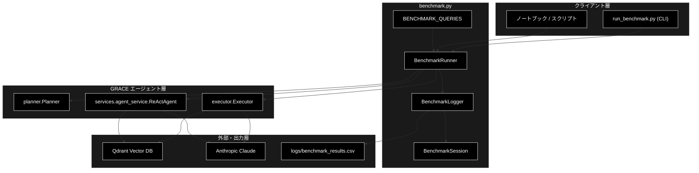
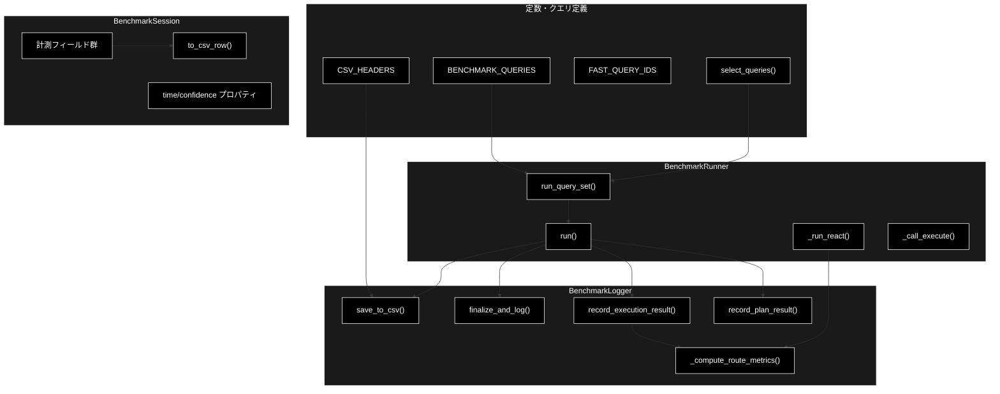
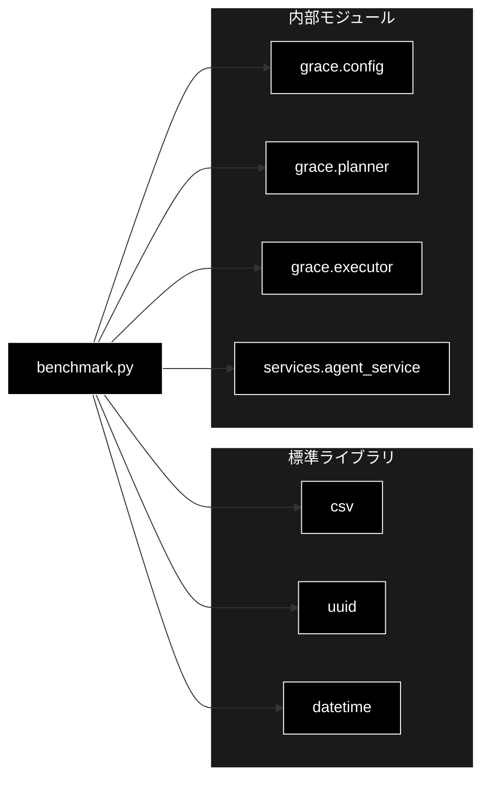

# benchmark.py - GRACE ベンチマーク計測 ドキュメント

**Version 1.5** | 最終更新: 2026-06-27

---

## ベンチマーク実行の様子（FAST モード / 5クエリ）

`uv run python run_benchmark.py --fast --collection cc_news_2per_anthropic` の実行ログから、
実際に画面に出た**表示行（検索イベント + `[BENCHMARK]` 集計）**を時系列で抜き出すと、次の流れになっています。

### ⏱ 実行タイムライン（表示行の抜粋）

```text
─── Q01 [Case A | Easy 事実検索] ───────────────────────────
🔍 Searching collection: cc_news_2per_anthropic
   [RAG SEARCH IPO: OUTPUT]  score 0.8549 (Amazon 在宅勤務職) ← 命中
[BENCHMARK] Plan: 0.00s / 複雑度0.50 / 2step      ← ルールベース計画（LLM呼出なし）
[BENCHMARK] Execute: 34.30s / tool2 / RAG1 / source1
[BENCHMARK] Confidence 0.805 → Intervention NOTIFY
[BENCHMARK] Routing: Case A | RAG最高0.8549 命中True web False 経路一致True

─── Q03 [Case B | Medium 推論・比較] ────────────────────────
🔍 Searching collection: cc_news_2per_anthropic   (49ers GM) score 0.7755
🔍 Searching collection: cc_news_2per_anthropic   (49ers)    score 0.7516  ← 再検索
🔍 Searching collection: cc_news_2per_anthropic   (49ers)    score 0.7342  ← 再検索
   [WEB SEARCH IPO: OUTPUT] serpapi "…49ers GM John Lynch…fired 2024 2025" ← web併用
[BENCHMARK] Plan: 11.37s / 複雑度0.70 / 2step     ← LLM計画
[BENCHMARK] Execute: 122.88s / tool5 / RAG3 / source11
[BENCHMARK] Confidence 0.616 → Intervention CONFIRM
[BENCHMARK] Routing: Case B | RAG最高0.7755 命中True web True 経路一致True

─── Q10 [Case E | Easy 曖昧] ───────────────────────────────
（検索なし — ask_user 単一ステップ）
[BENCHMARK] Plan: 0.00s / 複雑度0.20 / 1step / 要確認True  ← 曖昧クエリ→確認計画
[BENCHMARK] Execute: 5.59s / tool1 / RAG0 / source0
[BENCHMARK] Confidence 0.300 → Intervention ESCALATE      ← 人間へ橋渡し
[BENCHMARK] Routing: Case E | RAG最高0.0000 命中False web False 経路一致True

─── Q11 [Case C | Hard Web・回復] ──────────────────────────
   [WEB SEARCH IPO: OUTPUT] serpapi "2025年 ビットコイン 暗号資産 市場…" ← RAG不一致→web
[BENCHMARK] Plan: 9.91s / 複雑度0.60 / 2step
[BENCHMARK] Execute: 62.65s / tool2 / RAG0 / source9
[BENCHMARK] Confidence 0.617 → Intervention CONFIRM
[BENCHMARK] Routing: Case C | RAG最高0.0000 命中False web True 経路一致True

─── Q13 [Case D | Hard Web・回復（強制リプラン）] ──────────────
🔍 Searching collection: __grace_bench_missing_collection__  ← 欠損コレクション=結果ゼロ
   [WEB SEARCH IPO: OUTPUT] serpapi "…2027年のG7サミット開催地…" ← replan後 web で回復
[BENCHMARK] Plan: 0.00s / 複雑度0.50 / 2step
[BENCHMARK] Execute: 58.12s / tool2 / RAG0 / source9
[BENCHMARK] Confidence 0.898 → Intervention NOTIFY
[BENCHMARK] Replan: 1 / status success                     ← リプラン1回で収束
[BENCHMARK] Routing: Case D | RAG最高0.0000 命中False web True 経路一致True

════════════════════════════════════════════════════════════
経路一致率(route_correct): 5/5 = 100.0%
完了[FAST|mode=grace]: 5 セッション -> logs/benchmark_results.csv
```

### 📖 各クエリで何が起きたか

| 区分 | クエリ | 実行の様子 |
|---|---|---|
| **A 高スコア命中** | Q01 | `🔍 Searching` 1回で **score 0.855** がヒット。RAG だけで完結（web 不要）。計画は LLM を使わない**ルールベース2ステップ**（生成 0.00 秒）。信頼度 0.805 → `NOTIFY` で自動進行。 |
| **B 中スコア境界** | Q03 | RAG を **3回**呼び出し（0.776→0.752→0.734 と関連チャンクを収集）、さらに **web 検索も併用**して計 **11 ソース**を統合（tool 5回）。比較・推論タスクで最も重く 122.9 秒。信頼度 0.616 → `CONFIRM`。 |
| **E 曖昧** | Q10 | **検索を一切行わず**、曖昧クエリ検知で `ask_user` 単一ステップ（要確認 True）。信頼度 0.300 → `ESCALATE` で人間へ。最速 5.6 秒・トークン 0。 |
| **C 低スコア不一致** | Q11 | コレクション内に該当なし（RAG最高 0.0）→ **web へ動的フォールバック**（ビットコイン最新情報を 9 ソース取得）。信頼度 0.617 → `CONFIRM`。 |
| **D 要リプラン** | Q13 | 初回 RAG を**存在しないコレクション** `__grace_bench_missing_collection__` へ向けて**結果ゼロ → ステップ失敗 → リプラン発火**。回復プランで **web から G7 情報を 9 ソース**取得し収束。**replan 1 回**で最終信頼度 0.898 → `NOTIFY`。 |

### 🔎 読み取れること

1. **信頼度しきい値どおりの段階的介入**: 全体信頼度を `silent 0.9 / notify 0.7 / confirm 0.4` に当てた結果が表示どおり（0.805→NOTIFY、0.616/0.617→CONFIRM、0.898→NOTIFY、0.300→ESCALATE）。今回は B・C が confirm 帯に着地しています。
2. **検索経路の出し分けが全ケース期待どおり**: RAG完結（A）／複数RAG＋web（B）／web動的フォールバック（C）／強制リプラン→web回復（D）／検索せず確認（E）。`🔍 Searching` と `[WEB SEARCH IPO]` の表示行がそのまま経路の証跡になっています。
3. **強制リプラン設計が機能（D）**: `__grace_bench_missing_collection__` という欠損コレクション指定で初回検索を確実に空振りさせ、リプラン→回復の経路を毎回再現できています。
4. **結果**: 経路一致率 5/5 = 100%。介入レベルは前 run（B=SILENT / C=NOTIFY）から本 run（CONFIRM）へ揺れていますが、`route_correct` は介入レベルと独立に**経路**で採点されるため全件一致を維持しています。

> 📎 上記タイムラインの元になった生ログ全文はリポジトリ直下の `temp.txt` に保存しています。

---

## 実行結果サンプル（FAST モード）

> 下表は `python run_benchmark.py --fast` を実行したときの代表結果（`logs/benchmark_results.csv` から抜粋）です。
> 検索ハンドリングの 5 ケース（A: 高スコア命中 / B: 中スコア境界 / C: 低スコア不一致 / D: 要リプラン / E: 曖昧）を 1 本ずつ通過させ、
> **期待した分岐（経路）どおりに動いたか（`route_correct`）** を自動採点します。

**実行環境**

| 項目 | 値 |
|---|---|
| Model | `claude-sonnet-4-6` |
| Provider | `anthropic` |
| Qdrant コレクション | `cc_news_2per_anthropic` |
| モード | `--fast`（代表5クエリ × 1回 / 単一コレクション固定 / リプラン上限1） |
| 計測日 | 2026-06-27 |

**① 検索ハンドリング結果（5ケース A〜E）**

| ID | ケース | 経路（path） | 介入レベル | replan | status | RAG最高スコア | web切替 | route一致 |
|---|:--:|---|---|:--:|---|:--:|:--:|:--:|
| Q01 | **A** 高スコア命中 | `rule_plan+rag_hit` | NOTIFY | 0 | success | 0.855 | – | ✅ |
| Q03 | **B** 中スコア境界 | `llm_plan+multi_rag` | CONFIRM | 0 | success | 0.776 | ✅ | ✅ |
| Q11 | **C** 低スコア不一致 | `llm_plan+web_fallback` | CONFIRM | 0 | success | – | ✅ | ✅ |
| Q13 | **D** 要リプラン | `forced_replan+recovery` | NOTIFY | 1 | success | – | ✅ | ✅ |
| Q10 | **E** 曖昧 | `ask_user+intervention` | ESCALATE | 0 | success | – | – | ✅ |

> **経路一致率（route_correct）: 5 / 5 = 100%**
> ― 高スコア時は RAG で完結（A）、中スコアは複数ソースを統合し必要に応じ web も併用（B）、
> コレクション外・情報不足では web へ動的フォールバック（C/D）、曖昧クエリは人間へエスカレーション（E）と、
> **信頼度に応じた分岐が全ケースで期待どおり**に働いていることを示します。
> 介入レベルは `route_correct`（経路採点）とは独立で、各 case の `expected.intervention` 許容集合内に収まれば正解扱いです。
> このため本 run では中スコアの B・C が `CONFIRM`（信頼度 0.616 / 0.617 ≒ confirm 帯 0.4〜0.7）に着地しても経路は全件一致しています。

**② 性能（時間・信頼度・トークン）**

| ID | ケース | 全体信頼度 | 合計時間(秒) | tool呼出 | Input/Output tokens |
|---|:--:|:--:|--:|:--:|---|
| Q01 | A | 0.805 | 34.3 | 2 | 730 / 379 |
| Q03 | B | 0.616 | 122.9 | 5 | 2,662 / 960 |
| Q11 | C | 0.617 | 62.7 | 2 | 1,642 / 724 |
| Q13 | D | 0.898 | 58.1 | 2 | 1,692 / 694 |
| Q10 | E | 0.300 | 5.6 | 1 | 0 / 0 |

> 📝 介入レベルは全体信頼度を `ConfidenceThresholds`（silent 0.9 / notify 0.7 / confirm 0.4）に当てて決まります。
> 本 run では A=0.805→`NOTIFY`、B/C=0.616/0.617→`CONFIRM`、D=0.898→`NOTIFY`（0.9 直下）、E=0.300→`ESCALATE` と、
> **しきい値どおりに段階的な介入**が選択されています。D は欠損コレクションで初回検索が空振り →
> **replan 1 回で web 経由に回復し収束**（最終回答の信頼度は 0.898 まで上昇）。
> 数値は1回分の実測値で、ネットワークや LLM 応答揺らぎにより run ごとに変動します
> （特に閾値近傍では介入レベルが `NOTIFY`↔`CONFIRM` 等で揺れ、前 run の B=SILENT / C=NOTIFY から本 run では CONFIRM へ動いています）。

**再現方法**

```bash
# 代表5クエリ（A〜E 各1本）を高速実行 → logs/benchmark_results.csv に追記
python run_benchmark.py --fast --collection cc_news_2per_anthropic

# クエリ一覧（★=fast対象）を確認
python run_benchmark.py --list
```

---

## 目次

1. [ベンチマーク実行の様子](#ベンチマーク実行の様子fast-モード--5クエリ)
2. [実行結果サンプル](#実行結果サンプルfast-モード)
3. [概要](#概要)
4. [アーキテクチャ構成図](#1-アーキテクチャ構成図)
5. [モジュール構成図](#2-モジュール構成図)
6. [クラス・関数一覧表](#3-クラス関数一覧表)
7. [クラス・関数 IPO詳細](#4-クラス関数-ipo詳細)
8. [設定・定数](#5-設定定数)
9. [使用例](#6-使用例)
10. [エクスポート](#7-エクスポート)
11. [変更履歴](#8-変更履歴)
12. [付録: 依存関係図](#付録-依存関係図)

---

## 概要

`benchmark.py` は、GRACE エージェントの各フェーズ（Plan / Execute / Confidence /
Intervention / Replan）の性能指標を計測・記録・CSV出力するモジュールです。
評価軸は「ドメイン網羅」ではなく **検索結果スコアに応じた分岐ハンドリングの正しさ**
に置かれ、2つの主機能（GRACE Plan+Executor / ReAct+Reflection）を別々に計測・比較できます。

### 主な責務

- 標準クエリセット（A〜E ケース・期待挙動付き）の定義と絞り込み
- 1クエリ／クエリセット全体のフルパイプライン実行と各指標の計測
- 検索結果ハンドリング指標（rag_top_score / route_correct 等）の自動採点
- 計測結果の整形ログ出力と CSV 追記
- 2エージェント方式（grace_dynamic / react）の切替・横並び比較

### 各責務対応のモジュール

| # | 責務 | 対応モジュール | 説明 |
|---|------|--------------|------|
| 1 | 標準クエリセットの定義・絞り込み | `benchmark.py` | `BENCHMARK_QUERIES` / `select_queries()` |
| 2 | フルパイプライン実行・計測 | `benchmark.py` | `BenchmarkRunner` が `planner.py`/`executor.py` を駆動 |
| 3 | 検索ハンドリング指標の自動採点 | `benchmark.py` | `BenchmarkLogger._compute_route_metrics()` |
| 4 | ログ出力・CSV追記 | `benchmark.py` | `BenchmarkLogger.finalize_and_log()` / `save_to_csv()` |
| 5 | 2エージェント方式の切替 | `benchmark.py` | `BenchmarkRunner.run_query_set(mode=...)` / `_run_react()` |

### 主要機能一覧

| 機能 | 説明 |
|------|------|
| `BENCHMARK_QUERIES` | 標準12クエリ（case A〜E・expected 付き）の定義 |
| `FAST_QUERY_IDS` | 高速モード対象の代表クエリID（A〜E 各1本） |
| `select_queries()` | 実行対象クエリの絞り込みヘルパー |
| `BenchmarkSession` | 1実行分の計測データを保持するデータクラス |
| `BenchmarkSession.to_csv_row()` | CSV 1行分の辞書を返す |
| `BenchmarkLogger` | 整形ログ出力・CSV追記・指標算出を担うクラス |
| `BenchmarkLogger.record_plan_result()` | Plan フェーズ指標を記録 |
| `BenchmarkLogger.record_execution_result()` | Execute/Confidence/Replan 指標と検索指標を記録 |
| `BenchmarkLogger._compute_route_metrics()` | 期待挙動と実結果を突き合わせ route_correct を算定 |
| `BenchmarkRunner` | パイプライン全体をラップする実行クラス |
| `BenchmarkRunner.run()` | 1クエリをフル実行して計測 |
| `BenchmarkRunner._run_react()` | ReAct+Reflection 方式で1クエリを計測 |
| `BenchmarkRunner.run_query_set()` | クエリセットを一括実行 |

---

## 1. アーキテクチャ構成図

### 1.1 システム全体構成



### 1.2 データフロー

1. CLI／スクリプトが `BenchmarkRunner` を生成し、`run_query_set()` を呼ぶ
2. `select_queries()` で実行対象クエリ（A〜E ケース）を絞り込む
3. 各クエリを `mode`（grace_dynamic / react）ごとに `run()` で実行
4. grace_dynamic は `Planner` → `Executor`（Qdrant検索・Claude推論）を駆動
5. `BenchmarkLogger` が各フェーズ指標と検索ハンドリング指標を `BenchmarkSession` に記録
6. `_compute_route_metrics()` が期待挙動と突き合わせ `route_correct` を算定
7. 整形ログを出力し、`logs/benchmark_results.csv` に1行追記

---

## 2. モジュール構成図

### 2.1 内部モジュール構成



### 2.2 外部依存関係

| ライブラリ | バージョン | 用途 |
|-----------|-----------|------|
| `csv`（標準） | - | CSV 追記出力 |
| `uuid`（標準） | - | セッションID生成 |
| `datetime`（標準） | - | タイムスタンプ生成 |

### 2.3 内部依存モジュール

| モジュール | 用途 |
|-----------|------|
| `grace.config` | `get_config()` による設定取得（埋め込み次元・閾値・リプラン上限） |
| `grace.planner` | `Planner.create_plan()` で実行計画を生成 |
| `grace.executor` | `Executor.execute()` でプラン実行・指標生成 |
| `services.agent_service` | `ReActAgent`（react モード時のみ遅延 import） |

---

## 3. クラス・関数一覧表

### 3.1 クラス一覧

#### BenchmarkSession

| メソッド | 概要 |
|---------|------|
| `plan_time_sec` (property) | 計画生成フェーズ所要時間（秒） |
| `execute_time_sec` (property) | 実行フェーズ所要時間（秒） |
| `total_time_sec` (property) | Plan+Execute 合計時間（秒） |
| `min_step_confidence` (property) | ステップ信頼度の最小値 |
| `max_step_confidence` (property) | ステップ信頼度の最大値 |
| `to_csv_row()` | CSV 1行分の辞書を返す |

#### BenchmarkLogger

| メソッド | 概要 |
|---------|------|
| `__init__(csv_path, config)` | CSVパス・設定参照を保持しヘッダーを用意 |
| `record_plan_result(session, plan)` | Plan フェーズ指標を記録 |
| `record_execution_result(session, result)` | 実行・信頼度・検索指標を記録 |
| `_compute_route_metrics(session, web_fired)` | 期待挙動と突き合わせ route_correct を算定 |
| `_score_to_intervention(score)` | 信頼度→介入レベル変換 |
| `finalize_and_log(session)` | 整形ログ出力 |
| `save_to_csv(session)` | CSV 追記 |

#### BenchmarkRunner

| メソッド | 概要 |
|---------|------|
| `__init__(model_name, provider, config, csv_path, qdrant_collection)` | 設定・モデル・ロガーを初期化 |
| `run(query_id, query_text, ...)` | 1クエリをフル実行 |
| `_run_react(session)` | ReAct+Reflection 方式で計測 |
| `_call_execute(executor, plan)` | Executor 実行（generator/batch両対応） |
| `run_query_set(...)` | クエリセット一括実行 |

### 3.2 関数一覧（カテゴリ別）

#### クエリ選択

| 関数名 | 概要 |
|-------|------|
| `select_queries(query_ids, limit, fast, queries)` | 実行対象クエリを絞り込む |

---

## 4. クラス・関数 IPO詳細

### 4.1 `select_queries` 関数

#### `select_queries`

**概要**: 実行対象クエリを `query_ids` / `fast` / `limit` で絞り込むヘルパー。

```python
def select_queries(
    query_ids: Optional[List[str]] = None,
    limit: Optional[int] = None,
    fast: bool = False,
    queries: Optional[List[Dict[str, str]]] = None,
) -> List[Dict[str, str]]
```

| パラメータ | 型 | デフォルト | 説明 |
|------------|------|-----------|------|
| `query_ids` | Optional[List[str]] | None | 実行するID（最優先。例: `["Q01","Q03"]`） |
| `limit` | Optional[int] | None | 先頭から実行する件数 |
| `fast` | bool | False | True で `FAST_QUERY_IDS` のみ |
| `queries` | Optional[List[Dict]] | None | 元クエリリスト（省略時 `BENCHMARK_QUERIES`） |

| 項目 | 内容 |
|------|------|
| **Input** | `query_ids`, `limit`, `fast`, `queries` |
| **Process** | 1. `query_ids` 指定時はそれを抽出<br>2. それ以外で `fast` なら `FAST_QUERY_IDS` を抽出<br>3. `limit` で先頭から件数を絞る |
| **Output** | `List[Dict]`: 定義順を保持した絞り込み後クエリ |

**戻り値例**:
```python
[
    {"id": "Q01", "level": "Easy", "category": "事実検索",
     "case": "A", "text": "Amazon...", "expected": {...}},
]
```

```python
# 使用例
from grace.benchmark import select_queries
qs = select_queries(query_ids=["Q01", "Q11"])
print([q["id"] for q in qs])
# ['Q01', 'Q11']
```

### 4.2 `BenchmarkSession` クラス

1回の実行セッションのベンチマークデータを保持するデータクラス。タイミングは
`time.monotonic()` で計測し、所要時間は property で計算します。

#### メソッド: `to_csv_row`

**概要**: セッションの全指標を `CSV_HEADERS` に対応する辞書へ変換する。

```python
def to_csv_row(self) -> Dict[str, Any]
```

| 項目 | 内容 |
|------|------|
| **Input** | なし（selfのみ） |
| **Process** | 1. identity/フェーズ/信頼度/検索指標/コストを収集<br>2. property（時間・信頼度）を評価<br>3. スコアを丸めて辞書化 |
| **Output** | `Dict[str, Any]`: `CSV_HEADERS` の全キーを持つ1行分の辞書 |

**戻り値例**:
```python
{
    "query_id": "Q01", "expected_case": "A", "agent_mode": "grace_dynamic",
    "rag_top_score": 0.8421, "rag_hit_in_target": True,
    "web_fallback_fired": False, "route_correct": True, "replan_converged": True,
}
```

```python
# 使用例
session = BenchmarkSession(query_id="Q01", expected_case="A")
row = session.to_csv_row()
print(row["agent_mode"])
# grace_dynamic
```

### 4.3 `BenchmarkLogger` クラス

`BenchmarkSession` の内容を整形ログと CSV の両形式で出力し、検索ハンドリング
指標を算出するクラス。

#### コンストラクタ: `__init__`

**概要**: CSVパスと route 指標算出用の設定参照を保持し、CSV ヘッダーを用意する。

```python
BenchmarkLogger(csv_path: Optional[Path] = None, config: Any = None)
```

| パラメータ | 型 | デフォルト | 説明 |
|------------|------|-----------|------|
| `csv_path` | Optional[Path] | None | 出力先（省略時 `logs/benchmark_results.csv`） |
| `config` | Any | None | route 指標算出に使う設定（Runnerから注入） |

| 項目 | 内容 |
|------|------|
| **Input** | `csv_path`, `config` |
| **Process** | 1. パス・設定参照を保持<br>2. ログディレクトリ作成<br>3. CSV未作成ならヘッダー書込 |
| **Output** | `BenchmarkLogger` インスタンス |

#### メソッド: `record_execution_result`

**概要**: `Executor.execute()` の `ExecutionResult` から実行・信頼度・検索指標を記録する。

```python
def record_execution_result(self, session: BenchmarkSession, result: Any) -> None
```

| パラメータ | 型 | デフォルト | 説明 |
|------------|------|-----------|------|
| `session` | BenchmarkSession | - | 記録対象セッション |
| `result` | Any | - | `grace.schemas.ExecutionResult` |

| 項目 | 内容 |
|------|------|
| **Input** | `session`, `result` |
| **Process** | 1. 信頼度・リプラン回数・ステータス・トークン・コストを記録<br>2. 各ステップを走査し `rag_top_score`（output内score最大）と web切替（URLソース）を抽出<br>3. 信頼度→介入レベルを算定<br>4. `_compute_route_metrics()` を呼ぶ |
| **Output** | `None`（session を破壊的に更新） |

```python
# 使用例
logger = BenchmarkLogger(config=cfg)
logger.record_execution_result(session, execution_result)
print(session.route_correct, session.rag_top_score)
# True 0.8421
```

#### メソッド: `_compute_route_metrics`

**概要**: 期待挙動（`session.expected`）と実結果を突き合わせ、検索ハンドリング
4指標（rag_hit_in_target / web_fallback_fired / route_correct / replan_converged）を算定する。

```python
def _compute_route_metrics(self, session: BenchmarkSession, web_fired: bool) -> None
```

| パラメータ | 型 | デフォルト | 説明 |
|------------|------|-----------|------|
| `session` | BenchmarkSession | - | 記録対象セッション |
| `web_fired` | bool | - | URLソース検出による web 切替フラグ |

| 項目 | 内容 |
|------|------|
| **Input** | `session`, `web_fired` |
| **Process** | 1. 設定から `rag_sufficient_score` / `max_replans` を取得<br>2. `rag_hit_in_target`（スコア閾値）・`web_fallback_fired`（web_firedまたはリプラン）・`replan_converged`（上限内・非failed）を算定<br>3. `expected` の intervention/web/min_rag_score/replan を順に検証し `route_correct` を決定 |
| **Output** | `None`（session を破壊的に更新） |

**戻り値例**:
```python
# session に設定される値（case A の例）
session.rag_hit_in_target  = True
session.web_fallback_fired = False
session.replan_converged   = True
session.route_correct      = True
```

```python
# 使用例
logger._compute_route_metrics(session, web_fired=False)
print(session.route_correct)
# True  （期待介入=SILENT/NOTIFY と一致し、web/スコア条件も満たす場合）
```

### 4.4 `BenchmarkRunner` クラス

GRACEパイプライン全体をラップし、1クエリまたはクエリセットのベンチマークを実行するクラス。

#### コンストラクタ: `__init__`

**概要**: 設定・モデル名・プロバイダーを解決し、設定注入済みの `BenchmarkLogger` を生成する。

```python
BenchmarkRunner(
    model_name: Optional[str] = None,
    provider: Optional[str] = None,
    config: Any = None,
    csv_path: Optional[Path] = None,
    qdrant_collection: Optional[str] = None,
)
```

| パラメータ | 型 | デフォルト | 説明 |
|------------|------|-----------|------|
| `model_name` | Optional[str] | None | LLMモデル名（省略時 `config.llm.model`） |
| `provider` | Optional[str] | None | プロバイダー（省略時 `config.llm.provider`） |
| `config` | Any | None | 設定（省略時 `get_config()`） |
| `csv_path` | Optional[Path] | None | CSV出力先 |
| `qdrant_collection` | Optional[str] | None | 検索対象コレクション名（指定時 `collection_name` を上書き） |

| 項目 | 内容 |
|------|------|
| **Input** | `model_name`, `provider`, `config`, `csv_path`, `qdrant_collection` |
| **Process** | 1. 設定・モデル・プロバイダーを解決<br>2. 設定注入で `BenchmarkLogger` 生成<br>3. コレクション指定時は `config.qdrant.collection_name` を上書き |
| **Output** | `BenchmarkRunner` インスタンス |

#### メソッド: `run`

**概要**: 1クエリを Plan→Execute のフルパイプライン（または react 方式）で実行し計測する。

```python
def run(
    self,
    query_id: str,
    query_text: str,
    run_number: int = 1,
    level: str = "",
    category: str = "",
    agent_path: str = "",
    expected_case: str = "",
    expected: Optional[Dict[str, Any]] = None,
    agent_mode: str = "grace_dynamic",
) -> BenchmarkSession
```

| パラメータ | 型 | デフォルト | 説明 |
|------------|------|-----------|------|
| `query_id` | str | - | クエリID（例: `"Q01"`） |
| `query_text` | str | - | クエリ本文 |
| `run_number` | int | 1 | 同一クエリ内の試行番号 |
| `level` / `category` / `agent_path` | str | "" | ラベル群 |
| `expected_case` | str | "" | 検索ハンドリングケース A〜E |
| `expected` | Optional[Dict] | None | 期待挙動 dict |
| `agent_mode` | str | "grace_dynamic" | `"grace_dynamic"` または `"react"` |

| 項目 | 内容 |
|------|------|
| **Input** | `query_id`, `query_text`, ラベル群, `expected_case`, `expected`, `agent_mode` |
| **Process** | 1. `BenchmarkSession` 生成<br>2. `agent_mode=="react"` なら `_run_react()` へ委譲<br>3. それ以外は `Planner.create_plan()` → `Executor.execute()` を計測<br>4. 各フェーズ指標を記録<br>5. finally でログ出力・CSV追記 |
| **Output** | `BenchmarkSession`: 計測結果 |

```python
# 使用例
runner = BenchmarkRunner(qdrant_collection="cc_news_2per_anthropic")
session = runner.run(
    query_id="Q01", query_text="Amazonの新規職は何件？",
    expected_case="A", expected={"intervention": ["SILENT", "NOTIFY"], "web": False},
)
print(session.route_correct)
# True
```

#### メソッド: `run_query_set`

**概要**: 複数クエリを `runs_per_query` 回ずつ、指定モード（grace/react/both）で実行する。

```python
def run_query_set(
    self,
    queries: Optional[List[Dict[str, str]]] = None,
    runs_per_query: int = 3,
    fast: bool = False,
    query_ids: Optional[List[str]] = None,
    limit: Optional[int] = None,
    max_replans: Optional[int] = None,
    restrict_collection: Optional[bool] = None,
    mode: str = "grace",
) -> List[BenchmarkSession]
```

| パラメータ | 型 | デフォルト | 説明 |
|------------|------|-----------|------|
| `queries` | Optional[List[Dict]] | None | クエリリスト（省略時 `BENCHMARK_QUERIES`） |
| `runs_per_query` | int | 3 | 各クエリの試行回数 |
| `fast` | bool | False | 高速モード（代表クエリ・1回・最小アクセス） |
| `query_ids` | Optional[List[str]] | None | 実行するIDの明示指定 |
| `limit` | Optional[int] | None | 先頭からの件数 |
| `max_replans` | Optional[int] | None | リプラン上限の上書き（fast時は既定1） |
| `restrict_collection` | Optional[bool] | None | 単一コレクション固定（fast時は既定True） |
| `mode` | str | "grace" | `"grace"` / `"react"` / `"both"` |

| 項目 | 内容 |
|------|------|
| **Input** | 上記パラメータ群 |
| **Process** | 1. `mode` を agent_mode リストへ変換<br>2. fast時は試行回数1・max_replans=1・単一コレクション固定を既定適用<br>3. `select_queries()` で対象抽出<br>4. クエリ×agent_mode×試行で `run()` を反復 |
| **Output** | `List[BenchmarkSession]`: 全セッション結果 |

```python
# 使用例
runner = BenchmarkRunner(qdrant_collection="cc_news_2per_anthropic")
sessions = runner.run_query_set(fast=True, mode="both")
print(len(sessions))
# 10  （代表5クエリ × 2方式 × 1回）
```

---

## 5. 設定・定数

### 5.1 CSV_HEADERS

CSV 出力の列定義。`expected_case` / `agent_mode` と検索ハンドリング5指標を含みます。

```python
CSV_HEADERS = [
    "timestamp", "session_id", "query_id", "query_text_short",
    "level", "category", "agent_path", "expected_case", "agent_mode",
    "model", "provider", "run_number",
    # ... Plan / Execute / Confidence / Intervention / Replan ...
    "rag_top_score", "rag_hit_in_target", "web_fallback_fired",
    "route_correct", "replan_converged",
    "input_tokens", "output_tokens", "cost_usd",
    "accuracy_score", "completeness_score",
]
```

### 5.2 BENCHMARK_QUERIES / FAST_QUERY_IDS

標準クエリは Qdrant コレクション `cc_news_2per_anthropic` の実データに対応し、
検索ハンドリングの5ケースを通過するよう設計されています。

| キー | 説明 |
|-----|------|
| `case` | 検索ハンドリングケース（A:高スコア命中 / B:中スコア境界 / C:低スコア不一致 / D:要リプラン / E:曖昧） |
| `expected.intervention` | 許容する介入レベル集合（`None`=不問） |
| `expected.web` | web_fallback を期待するか（True/False/None） |
| `expected.replan` | リプラン発火＋収束を期待するか（True/False/None） |
| `expected.min_rag_score` | 期待する RAG 最高スコア下限（`None`=不問） |
| `force_collection` | （任意）初回プランの全 rag_search の検索先を指定コレクションへ固定。存在しない名前を与えると結果ゼロ → ステップ failed → リプランを確定発火させる（Case D 用） |

Case D は 2 本構成です。

- **Q12**: RAG が低スコア（非空）で命中せず、動的 web フォールバックで回復する経路。
  この経路は `replan_count` を増やさない（成功扱いの低スコア → web 動的挿入）ため、
  期待は「web で回復」（`replan=None`）。
- **Q13**: `force_collection` で初回 RAG を存在しないコレクションへ向け、結果ゼロ →
  ステップ failed → `_should_trigger_replan` が必ず発火 → 回復プランへ差し替え。
  期待は「リプラン発火＋上限内収束」（`replan=True`）。真に replan を強制する設計。

`FAST_QUERY_IDS = ["Q01", "Q03", "Q11", "Q13", "Q10"]`（A〜E 各1本。D 枠は真の replan を測る Q13）。

---

## 6. 使用例

### 6.0 CLI からの実行（`run_benchmark.py` / `run_benchmark.sh`）

**(a) シェルラッパー `run_benchmark.sh`（Anthropic 専用・推奨）**

Anthropic 設定（モデル・プロバイダー・コレクション）を固定済みのワンショット実行スクリプト。
`uv run` で全クエリ × 3回を実行し、経路一致率を表示します。

```bash
chmod +x run_benchmark.sh
./run_benchmark.sh
```

スクリプト内の既定値（Anthropic 専用）:

| 変数 | 値 |
|---|---|
| `PROVIDER` | `anthropic` |
| `MODEL` | `claude-sonnet-4-6` |
| `COLLECTION` | `cc_news_2per_anthropic` |

`BenchmarkRunner(model_name=MODEL, provider=PROVIDER, qdrant_collection=COLLECTION)` を
明示指定して実行するため、`config.llm` の既定に依存せず確実に Anthropic で計測されます。

**(b) Python CLI `run_benchmark.py`（細かい制御向け）**

```bash
# フルベンチマーク（全クエリ × 3回）
python run_benchmark.py

# 高速完了モード（代表5クエリ A〜E × 1回）
python run_benchmark.py --fast

# コレクション・試行回数を指定
python run_benchmark.py --collection cc_news_2per_anthropic --runs 2

# 特定クエリだけ / 先頭N件 / 一覧表示
python run_benchmark.py --query-id Q01 --query-id Q11
python run_benchmark.py --limit 3
python run_benchmark.py --list

# GRACE と ReAct+Reflection を横並び比較
python run_benchmark.py --fast --mode both
```

実行後、いずれも経路一致率（route_correct）を集計して標準出力へ表示し、
全セッションを `logs/benchmark_results.csv` に追記します（[実行結果サンプル](#実行結果サンプルfast-モード)参照）。

> **前提条件**
> - Qdrant 起動済み（`localhost:6333`）／対象コレクション（`cc_news_2per_anthropic`）が embedding 済み
> - **`ANTHROPIC_API_KEY`**: LLM（Plan / Execute / Confidence / Replan / ReAct）に必須
> - **`GOOGLE_API_KEY`**: 既定の Embedding は Gemini（`gemini-embedding-001` / 3072次元）のため、
>   RAG 検索のクエリ埋め込みに必要（`grace/config.py` の `EmbeddingConfig` 参照）

### 6.1 基本的なワークフロー

```python
from grace.benchmark import BenchmarkRunner

# 1. ランナー生成（コレクションを明示指定）
runner = BenchmarkRunner(qdrant_collection="cc_news_2per_anthropic")

# 2. 高速モードで全ケース A〜E を1本ずつ実行（単一コレクション固定・リプラン最小）
sessions = runner.run_query_set(fast=True)

# 3. 経路一致率を集計
scored = [s for s in sessions if s.route_correct is not None]
correct = sum(1 for s in scored if s.route_correct)
print(f"route_correct: {correct}/{len(scored)}")
```

### 6.2 2方式の横並び比較

```python
# GRACE Plan+Executor と ReAct+Reflection を同一クエリで比較
runner = BenchmarkRunner(qdrant_collection="cc_news_2per_anthropic")
sessions = runner.run_query_set(fast=True, mode="both")

for s in sessions:
    print(s.query_id, s.agent_mode, s.route_correct, round(s.rag_top_score, 3))
```

> 📝 **注意**: reasoning / plan / confidence 経路の計測には `anthropic` パッケージの
> 導入が前提です。未導入時は全ステップが失敗し route が測れません。

---

## 7. エクスポート

```python
__all__ = [
    "BENCHMARK_QUERIES",
    "FAST_QUERY_IDS",
    "select_queries",
    "CSV_HEADERS",
    "BENCHMARK_CSV_PATH",
    "BenchmarkSession",
    "BenchmarkLogger",
    "BenchmarkRunner",
]
```

---

## 8. 変更履歴

| バージョン | 変更内容 |
|-----------|---------|
| 1.5 | 冒頭に「ベンチマーク実行の様子（FAST モード / 5クエリ）」セクションを追加。実行ログの表示行（`🔍 Searching` / `[WEB SEARCH IPO]` / `[BENCHMARK]`）を時系列タイムラインとして抜粋し、ケース別解説（A〜E）・読み取り（しきい値介入・経路出し分け・強制リプラン・route_correct 独立採点）を記述。生ログ全文は `temp.txt` に保存。目次を更新 |
| 1.4 | 「実行結果サンプル」①②表を `--fast --collection cc_news_2per_anthropic` の最新実行（2026-06-27）の実測値へ差し替え。介入は A=NOTIFY / B=CONFIRM(0.616) / C=CONFIRM(0.617) / D=NOTIFY(0.898・replan1で収束) / E=ESCALATE(0.300)。介入レベルが信頼度しきい値（silent 0.9 / notify 0.7 / confirm 0.4）に従う点と、route_correct が介入レベルと独立に経路で採点される点を注記。経路一致率は 5/5=100% を維持 |
| 1.3 | 「実行結果サンプル」の①②表を最新 FAST 実行（2026-06-26）の実測値へ差し替え（B=SILENT/conf0.915、C/D=NOTIFY、D=replan1で収束、E=ESCALATE）。計測日を更新 |
| 1.2 | `run_benchmark.sh` の Anthropic 専用化（`cc_news_2per_anthropic` / `claude-sonnet-4-6` / `anthropic`）を反映。シェルラッパー実行例（6.0節 a）を追加。前提条件に `ANTHROPIC_API_KEY`（LLM）＋ `GOOGLE_API_KEY`（Gemini Embedding）の二本立てを明記 |
| 1.1 | 冒頭に「実行結果サンプル（FAST モード）」を追加（実 CSV からの代表5ケース A〜E・経路一致率・性能表）。CLI 実行例（`run_benchmark.py --fast` / `--list`）を追記。目次・更新日を更新 |
| 1.0 | 初版作成（検索ハンドリング評価への再設計・2エージェント別計測・新メトリクス5列に対応） |

---

## 付録: 依存関係図


