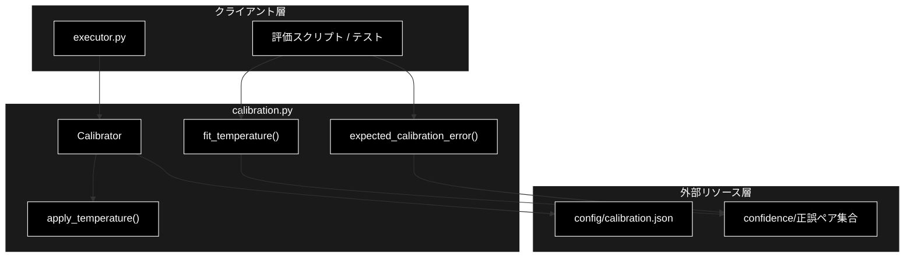
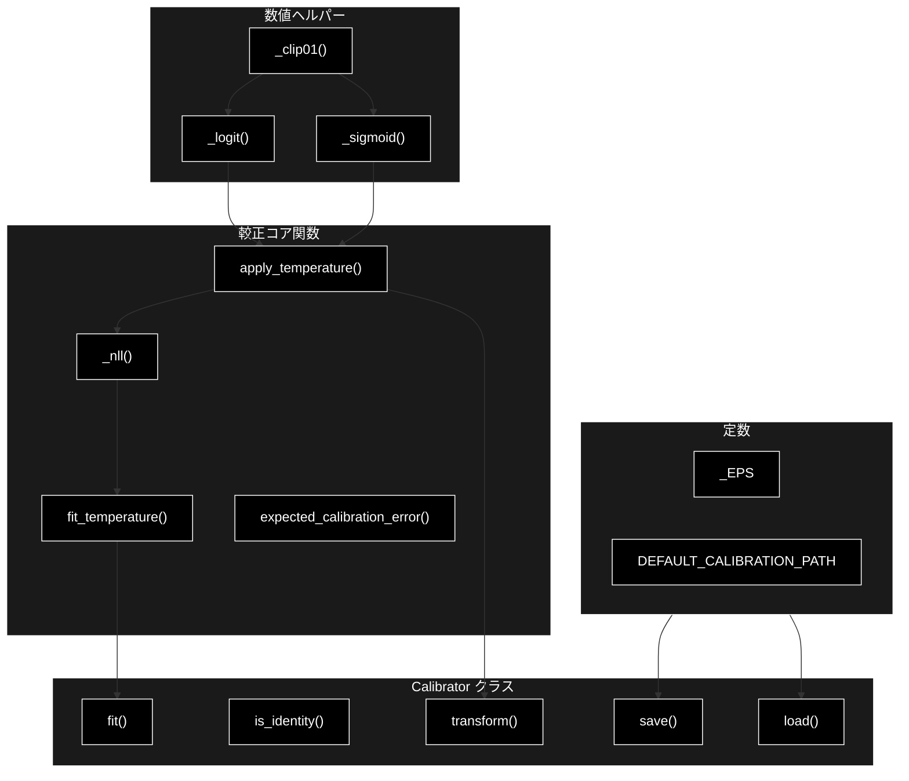
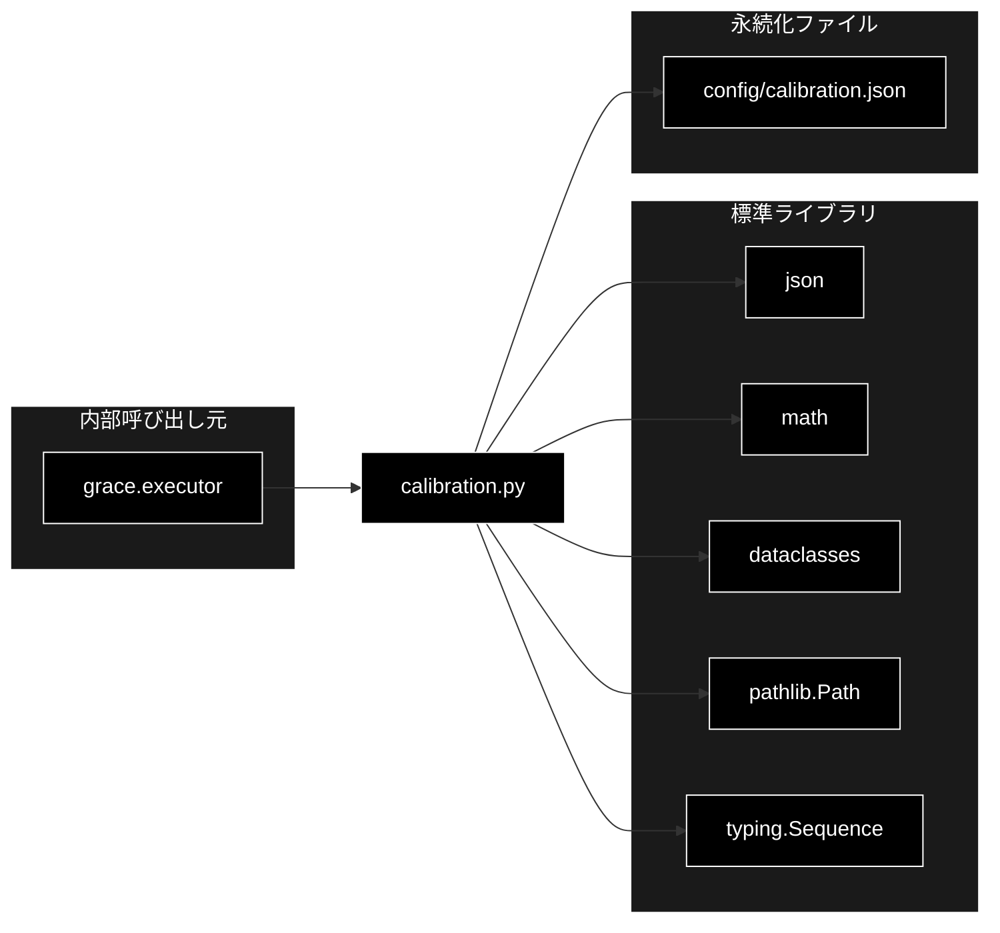

# calibration.py - GRACE Confidence 較正（Calibration） ドキュメント

**Version 1.0** | 最終更新: 2026-06-16

---

## 目次

1. [概要](#概要)
2. [アーキテクチャ構成図](#1-アーキテクチャ構成図)
3. [モジュール構成図](#2-モジュール構成図)
4. [クラス・関数一覧表](#3-クラス関数一覧表)
5. [クラス・関数 IPO詳細](#4-クラス関数-ipo詳細)
6. [設定・定数](#5-設定定数)
7. [使用例](#6-使用例)
8. [エクスポート](#7-エクスポート)
9. [変更履歴](#8-変更履歴)
10. [付録: 依存関係図](#付録-依存関係図)

---

## 概要

`calibration.py`は、GRACE が算出する confidence（自己申告の信頼度）と実正解率のズレ（ECE: Expected Calibration Error）を、事後較正で縮小するモジュールです。**温度スケーリング（Temperature Scaling）** を採用します。

```
z  = logit(p) = ln(p / (1 - p))
p' = sigmoid(z / T)
```

- `T = 1.0`: 無変換（恒等）
- `T > 1.0`: 自信過剰を緩和（高すぎる confidence を引き下げる）
- `T < 1.0`: 自信不足を補正（低すぎる confidence を引き上げる）

温度 T は (confidence, 正誤) のペア集合に対して二値 NLL（負対数尤度）を最小化して推定します。scipy 非依存の 1 次元探索で実装され、較正パラメータは JSON（既定 `config/calibration.json`）に保存／読込でき、GRACE 本体（executor）が実行時に overall_confidence へ適用します。

### 主な責務

- confidence への温度スケーリング適用（logit → /T → sigmoid）
- (confidence, 正誤) からの最適温度 T の推定（二値 NLL 最小化・1次元探索）
- ECE（等幅ビン）の計算による較正品質の評価
- 較正器（Calibrator）の状態を JSON へ保存・JSON から読込
- 退化データ（全問正解/全問不正解/件数0）に対する恒等較正（T=1.0）フォールバック

### 各責務対応のモジュール

| # | 責務 | 対応モジュール | 説明 |
|---|------|--------------|------|
| 1 | 温度スケーリングの適用 | `calibration.py` | `apply_temperature()` が logit/sigmoid 変換を実行 |
| 2 | 最適温度 T の推定 | `calibration.py` | `fit_temperature()` が 2 段グリッド探索で NLL を最小化 |
| 3 | ECE の計算 | `calibration.py` | `expected_calibration_error()` が等幅ビンで誤差を集計 |
| 4 | 較正器の永続化 | `calibration.py` | `Calibrator.save()` / `Calibrator.load()` |
| 5 | 恒等較正フォールバック | `calibration.py` | データ退化・ファイル欠損時に T=1.0 を返す |

### 主要機能一覧

| 機能 | 説明 |
|------|------|
| `Calibrator` | 温度スケーリングによる confidence 較正器（dataclass） |
| `Calibrator.transform()` | confidence に温度を適用して較正値を返す |
| `Calibrator.is_identity()` | 恒等較正器（T≈1.0）か判定 |
| `Calibrator.save()` | 較正パラメータを JSON へ保存 |
| `Calibrator.load()` | JSON から較正器を読込（欠損時は T=1.0） |
| `Calibrator.fit()` | (confidence, 正誤) から較正器を生成 |
| `apply_temperature()` | confidence p に温度 T を適用 |
| `fit_temperature()` | NLL 最小の温度 T を 1 次元探索で推定 |
| `expected_calibration_error()` | ECE（等幅ビン）を計算 |

---

## 1. アーキテクチャ構成図

### 1.1 システム全体構成



### 1.2 データフロー

1. 評価フェーズで (confidence, 正誤) ペア集合を収集する
2. `fit_temperature()`（または `Calibrator.fit()`）で NLL 最小の温度 T を推定する
3. `Calibrator.save()` で T を `config/calibration.json` へ保存する
4. 実行時、executor が `Calibrator.load()` で較正器を読み込む
5. `Calibrator.transform()` が overall_confidence に温度を適用し較正値を返す
6. `expected_calibration_error()` で較正前後の ECE を比較し改善を検証する

---

## 2. モジュール構成図

### 2.1 内部モジュール構成



### 2.2 外部依存関係

| ライブラリ | バージョン | 用途 |
|-----------|-----------|------|
| `json`（標準） | - | 較正パラメータの JSON 保存・読込 |
| `math`（標準） | - | log / exp による logit・sigmoid 計算 |
| `dataclasses`（標準） | - | `Calibrator` を dataclass として定義 |
| `pathlib`（標準） | - | 較正ファイルのパス操作 |
| `typing`（標準） | - | `Sequence` 型注釈 |

### 2.3 内部依存モジュール

| モジュール | 用途 |
|-----------|------|
| `grace.executor` | `Calibrator.load()` で較正器を読み込み overall_confidence に適用（呼び出し元） |

---

## 3. クラス・関数一覧表

### 3.1 クラス一覧

#### Calibrator

| メソッド | 概要 |
|---------|------|
| `transform(p)` | confidence に温度を適用して較正値を返す |
| `is_identity()` | 恒等較正器（T≈1.0）か判定 |
| `save(path=DEFAULT_CALIBRATION_PATH)` | 較正パラメータを JSON へ保存 |
| `load(path=DEFAULT_CALIBRATION_PATH)` | JSON から較正器を読込（classmethod） |
| `fit(confidences, correctness)` | (confidence, 正誤) から較正器を生成（classmethod） |

### 3.2 関数一覧（カテゴリ別）

#### 較正コア関数

| 関数名 | 概要 |
|-------|------|
| `apply_temperature(p, temperature)` | confidence p に温度 T を適用 |
| `fit_temperature(confidences, correctness, t_min=0.05, t_max=10.0)` | NLL 最小の温度 T を推定 |
| `expected_calibration_error(confidences, correctness, n_bins=10)` | ECE（等幅ビン）を計算 |

#### 内部ヘルパー関数

| 関数名 | 概要 |
|-------|------|
| `_clip01(p)` | p を `[_EPS, 1-_EPS]` にクリップ |
| `_logit(p)` | ln(p/(1-p)) |
| `_sigmoid(z)` | 数値安定なシグモイド |
| `_nll(confidences, correctness, t)` | 温度 t における平均二値 NLL |

---

## 4. クラス・関数 IPO詳細

### 4.1 較正コア関数

#### `apply_temperature`

**概要**: confidence p に温度 T を適用して較正後の確率を返す。T<=0 は 1.0 に矯正する。

```python
def apply_temperature(p: float, temperature: float) -> float
```

| パラメータ | 型 | デフォルト | 説明 |
|------------|------|-----------|------|
| `p` | float | - | 較正対象の confidence（0〜1） |
| `temperature` | float | - | 温度 T |

| 項目 | 内容 |
|------|------|
| **Input** | `p: float`, `temperature: float` |
| **Process** | 1. T を float 化し、T<=0 なら T=1.0<br>2. `_sigmoid(_logit(p) / T)` を計算 |
| **Output** | `float`: 較正後の確率 |

**戻り値例**:
```python
0.732  # apply_temperature(0.9, 2.0) の例
```

```python
# 使用例
from grace.calibration import apply_temperature

calibrated = apply_temperature(0.95, temperature=2.0)
print(round(calibrated, 3))  # 自信過剰が緩和され 0.95 より低い値
```

#### `fit_temperature`

**概要**: (confidence, 正誤) から二値 NLL を最小化する温度 T を 1 次元探索（粗グリッド→近傍細分化の 2 段）で推定する。退化データでは T=1.0 を返す。

```python
def fit_temperature(
    confidences: Sequence[float],
    correctness: Sequence[bool],
    t_min: float = 0.05,
    t_max: float = 10.0,
) -> float
```

| パラメータ | 型 | デフォルト | 説明 |
|------------|------|-----------|------|
| `confidences` | Sequence[float] | - | confidence 列 |
| `correctness` | Sequence[bool] | - | 各 confidence に対応する正誤（True=正解） |
| `t_min` | float | 0.05 | 探索する温度の下限 |
| `t_max` | float | 10.0 | 探索する温度の上限 |

| 項目 | 内容 |
|------|------|
| **Input** | `confidences: Sequence[float]`, `correctness: Sequence[bool]`, `t_min: float = 0.05`, `t_max: float = 10.0` |
| **Process** | 1. 件数0なら 1.0 を返す<br>2. 全問正解/全問不正解（退化）なら 1.0 を返す<br>3. `[t_min, t_max]` を 200 分割で粗探索し最小 NLL の温度を得る<br>4. その近傍（±span）を 200 分割で細探索<br>5. 結果を小数 4 桁に丸めて返す |
| **Output** | `float`: 推定温度 T |

**戻り値例**:
```python
2.1374  # NLL 最小の推定温度
```

```python
# 使用例
from grace.calibration import fit_temperature

confidences = [0.9, 0.8, 0.95, 0.6, 0.7]
correctness = [True, False, True, False, True]
T = fit_temperature(confidences, correctness)
print(T)  # 例: 1.83
```

#### `expected_calibration_error`

**概要**: 等幅ビンによる ECE を計算する。`eval/metrics.py` と整合する定義。

```python
def expected_calibration_error(
    confidences: Sequence[float],
    correctness: Sequence[bool],
    n_bins: int = 10,
) -> float
```

| パラメータ | 型 | デフォルト | 説明 |
|------------|------|-----------|------|
| `confidences` | Sequence[float] | - | confidence 列 |
| `correctness` | Sequence[bool] | - | 各 confidence に対応する正誤 |
| `n_bins` | int | 10 | 等幅ビン数 |

| 項目 | 内容 |
|------|------|
| **Input** | `confidences: Sequence[float]`, `correctness: Sequence[bool]`, `n_bins: int = 10` |
| **Process** | 1. 件数0なら 0.0<br>2. 各ビンへ confidence を割り当て（境界条件を考慮）<br>3. ビンごとに平均 confidence・平均正解率を計算<br>4. 件数加重で `|acc - conf|` を合計 |
| **Output** | `float`: ECE 値（0 に近いほど良好） |

**戻り値例**:
```python
0.084  # 較正前 ECE の例
```

```python
# 使用例
from grace.calibration import expected_calibration_error

ece = expected_calibration_error(confidences, correctness, n_bins=10)
print(f"ECE: {ece:.3f}")
```

### 4.2 Calibrator クラス

温度スケーリングによる confidence 較正器（dataclass）。フィールド `temperature: float = 1.0` を持つ。

#### メソッド: `transform`

**概要**: confidence p に保持中の温度を適用して較正値を返す。

```python
def transform(self, p: float) -> float
```

| パラメータ | 型 | デフォルト | 説明 |
|------------|------|-----------|------|
| `p` | float | - | 較正対象の confidence |

| 項目 | 内容 |
|------|------|
| **Input** | `p: float` |
| **Process** | `apply_temperature(p, self.temperature)` を返す |
| **Output** | `float`: 較正後の confidence |

**戻り値例**:
```python
0.812
```

```python
# 使用例
from grace.calibration import Calibrator

calib = Calibrator(temperature=2.0)
print(calib.transform(0.95))  # 較正後の値
```

#### メソッド: `is_identity`

**概要**: 温度が 1.0 に十分近い（恒等較正器）か判定する。

```python
def is_identity(self) -> bool
```

| パラメータ | 型 | デフォルト | 説明 |
|------------|------|-----------|------|
| なし | - | - | self のみ |

| 項目 | 内容 |
|------|------|
| **Input** | なし（selfのみ） |
| **Process** | `abs(self.temperature - 1.0) < 1e-9` を返す |
| **Output** | `bool`: 恒等較正器なら True |

**戻り値例**:
```python
True  # temperature=1.0 の場合
```

```python
# 使用例
calib = Calibrator(temperature=1.0)
print(calib.is_identity())  # True
```

#### メソッド: `save`

**概要**: 較正方式と温度を JSON ファイルへ保存する（親ディレクトリは自動作成）。

```python
def save(self, path: str = DEFAULT_CALIBRATION_PATH) -> None
```

| パラメータ | 型 | デフォルト | 説明 |
|------------|------|-----------|------|
| `path` | str | "config/calibration.json" | 保存先パス |

| 項目 | 内容 |
|------|------|
| **Input** | `path: str = DEFAULT_CALIBRATION_PATH` |
| **Process** | 1. 親ディレクトリを作成<br>2. `{"method": "temperature_scaling", "temperature": ...}` を JSON 書き込み（indent=2, ensure_ascii=False） |
| **Output** | `None` |

**戻り値例**:
```python
# config/calibration.json に書き込まれる内容
{
    "method": "temperature_scaling",
    "temperature": 2.1374
}
```

```python
# 使用例
calib = Calibrator(temperature=2.1374)
calib.save("config/calibration.json")
```

#### メソッド: `load`

**概要**: 較正ファイルを読み込んで Calibrator を生成する。存在しない/読込失敗/T<=0 の場合は恒等較正器（T=1.0）を返す。

```python
@classmethod
def load(cls, path: str = DEFAULT_CALIBRATION_PATH) -> "Calibrator"
```

| パラメータ | 型 | デフォルト | 説明 |
|------------|------|-----------|------|
| `path` | str | "config/calibration.json" | 読込元パス |

| 項目 | 内容 |
|------|------|
| **Input** | `path: str = DEFAULT_CALIBRATION_PATH` |
| **Process** | 1. ファイルが無ければ `Calibrator(temperature=1.0)`<br>2. JSON を読み `temperature` を取得（既定 1.0）<br>3. T>0 ならその値、そうでなければ 1.0<br>4. 例外時は T=1.0 を返す |
| **Output** | `Calibrator`: 読込した（または恒等）較正器 |

**戻り値例**:
```python
# Calibrator(temperature=2.1374)
```

```python
# 使用例
calib = Calibrator.load("config/calibration.json")
print(calib.temperature)
```

#### メソッド: `fit`

**概要**: (confidence, 正誤) から温度を推定して Calibrator を生成する classmethod。

```python
@classmethod
def fit(cls, confidences: Sequence[float], correctness: Sequence[bool]) -> "Calibrator"
```

| パラメータ | 型 | デフォルト | 説明 |
|------------|------|-----------|------|
| `confidences` | Sequence[float] | - | confidence 列 |
| `correctness` | Sequence[bool] | - | 各 confidence に対応する正誤 |

| 項目 | 内容 |
|------|------|
| **Input** | `confidences: Sequence[float]`, `correctness: Sequence[bool]` |
| **Process** | `fit_temperature(confidences, correctness)` で温度を推定し Calibrator を生成 |
| **Output** | `Calibrator`: 推定温度を持つ較正器 |

**戻り値例**:
```python
# Calibrator(temperature=1.83)
```

```python
# 使用例
calib = Calibrator.fit(confidences, correctness)
calib.save()  # 推定結果を config/calibration.json へ保存
```

### 4.3 内部ヘルパー関数

#### `_clip01`

**概要**: p を `[_EPS, 1-_EPS]` の範囲にクリップし、log の発散を防ぐ。

```python
def _clip01(p: float) -> float
```

| パラメータ | 型 | デフォルト | 説明 |
|------------|------|-----------|------|
| `p` | float | - | クリップ対象の値 |

| 項目 | 内容 |
|------|------|
| **Input** | `p: float` |
| **Process** | `min(1.0 - _EPS, max(_EPS, float(p)))` |
| **Output** | `float`: クリップ後の値 |

**戻り値例**:
```python
0.999999  # _clip01(1.0) の例
```

```python
# 使用例
print(_clip01(1.0))  # 0.999999
```

#### `_logit`

**概要**: クリップ後の p に対し ln(p/(1-p)) を返す。

```python
def _logit(p: float) -> float
```

| パラメータ | 型 | デフォルト | 説明 |
|------------|------|-----------|------|
| `p` | float | - | 確率値 |

| 項目 | 内容 |
|------|------|
| **Input** | `p: float` |
| **Process** | `_clip01(p)` 後に `math.log(p/(1-p))` |
| **Output** | `float`: logit 値 |

**戻り値例**:
```python
2.197  # _logit(0.9) の例
```

```python
# 使用例
print(round(_logit(0.9), 3))  # 2.197
```

#### `_sigmoid`

**概要**: オーバーフローを避ける数値安定なシグモイドを返す。

```python
def _sigmoid(z: float) -> float
```

| パラメータ | 型 | デフォルト | 説明 |
|------------|------|-----------|------|
| `z` | float | - | logit 値 |

| 項目 | 内容 |
|------|------|
| **Input** | `z: float` |
| **Process** | z>=0 と z<0 で式を分け、exp のオーバーフローを回避 |
| **Output** | `float`: 0〜1 の確率 |

**戻り値例**:
```python
0.9  # _sigmoid(2.197) の例
```

```python
# 使用例
print(round(_sigmoid(2.197), 3))  # 0.9
```

#### `_nll`

**概要**: 温度 t における二値負対数尤度（平均）を計算する。

```python
def _nll(confidences: Sequence[float], correctness: Sequence[bool], t: float) -> float
```

| パラメータ | 型 | デフォルト | 説明 |
|------------|------|-----------|------|
| `confidences` | Sequence[float] | - | confidence 列 |
| `correctness` | Sequence[bool] | - | 各 confidence の正誤 |
| `t` | float | - | 温度 |

| 項目 | 内容 |
|------|------|
| **Input** | `confidences: Sequence[float]`, `correctness: Sequence[bool]`, `t: float` |
| **Process** | 1. 各ペアで `q = _clip01(apply_temperature(p, t))`<br>2. 正解は `-log(q)`、不正解は `-log(1-q)` を加算<br>3. 件数で割って平均を返す（件数0は 0.0） |
| **Output** | `float`: 平均 NLL |

**戻り値例**:
```python
0.512  # ある温度 t での平均 NLL
```

```python
# 使用例
val = _nll([0.9, 0.6], [True, False], t=1.5)
print(round(val, 3))
```

---

## 5. 設定・定数

### 5.1 _EPS

数値計算の安定化に用いる微小量。log / sigmoid の発散・オーバーフローを防ぐクリップ境界に使用する。

```python
_EPS = 1e-6
```

| 定数名 | 値 | 説明 |
|-------|-----|------|
| `_EPS` | `1e-6` | confidence のクリップ境界（`[_EPS, 1-_EPS]`） |

### 5.2 DEFAULT_CALIBRATION_PATH

較正パラメータの既定保存／読込先パス。

```python
DEFAULT_CALIBRATION_PATH = "config/calibration.json"
```

| 定数名 | 値 | 説明 |
|-------|-----|------|
| `DEFAULT_CALIBRATION_PATH` | `"config/calibration.json"` | `Calibrator.save()` / `Calibrator.load()` の既定パス |

### 5.3 保存される JSON 形式

```python
{
    "method": "temperature_scaling",
    "temperature": 2.1374
}
```

| キー | 型 | 説明 |
|-----|-----|------|
| `method` | str | 較正方式（常に `"temperature_scaling"`） |
| `temperature` | float | 推定温度 T |

---

## 6. 使用例

### 6.1 基本的なワークフロー（推定 → 保存 → 適用）

```python
from grace.calibration import Calibrator, expected_calibration_error

# 1. 評価で収集した (confidence, 正誤) ペア
confidences = [0.9, 0.85, 0.95, 0.6, 0.7, 0.8]
correctness = [True, False, True, False, True, True]

# 2. 較正前 ECE
ece_before = expected_calibration_error(confidences, correctness)

# 3. 温度を推定して較正器を生成
calib = Calibrator.fit(confidences, correctness)

# 4. JSON へ保存
calib.save("config/calibration.json")

# 5. 較正後 ECE で改善を確認
calibrated = [calib.transform(c) for c in confidences]
ece_after = expected_calibration_error(calibrated, correctness)
print(f"ECE: {ece_before:.3f} -> {ece_after:.3f}")
```

### 6.2 応用的なワークフロー（実行時の適用）

```python
from grace.calibration import Calibrator

# executor 起動時に較正器を読み込む（ファイル欠損時は恒等較正器）
calibrator = Calibrator.load("config/calibration.json")

# overall_confidence に較正を適用
final_conf = 0.92
calibrated = calibrator.transform(final_conf)
if not calibrator.is_identity():
    print(f"Calibrated: {final_conf:.3f} -> {calibrated:.3f} (T={calibrator.temperature})")
```

---

## 7. エクスポート

`calibration.py` には `__all__` 定義はありません。GRACE 本体は各サブモジュールから直接 import します。

```python
# 呼び出し元（executor.py）での import 例
from .calibration import Calibrator

# 公開的に利用される主な要素
# - Calibrator                   （較正器クラス）
# - apply_temperature            （温度適用関数）
# - fit_temperature              （温度推定関数）
# - expected_calibration_error   （ECE 計算関数）
# - DEFAULT_CALIBRATION_PATH     （既定パス定数）
```

> 📝 **注意**: `_clip01` / `_logit` / `_sigmoid` / `_nll` および `_EPS` は内部実装であり、外部からの直接利用は想定していません。

---

## 8. 変更履歴

| バージョン | 変更内容 |
|-----------|---------|
| 1.0 | 初版作成（calibration.py のソースに基づくドキュメント化、温度スケーリング S1） |

---

## 付録: 依存関係図


