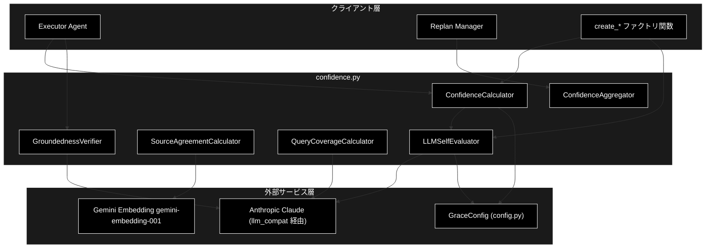
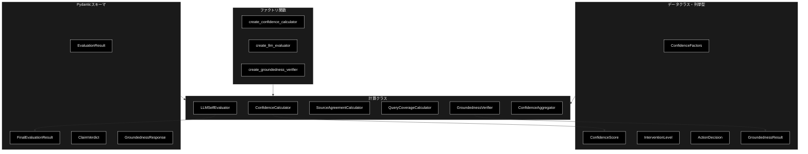
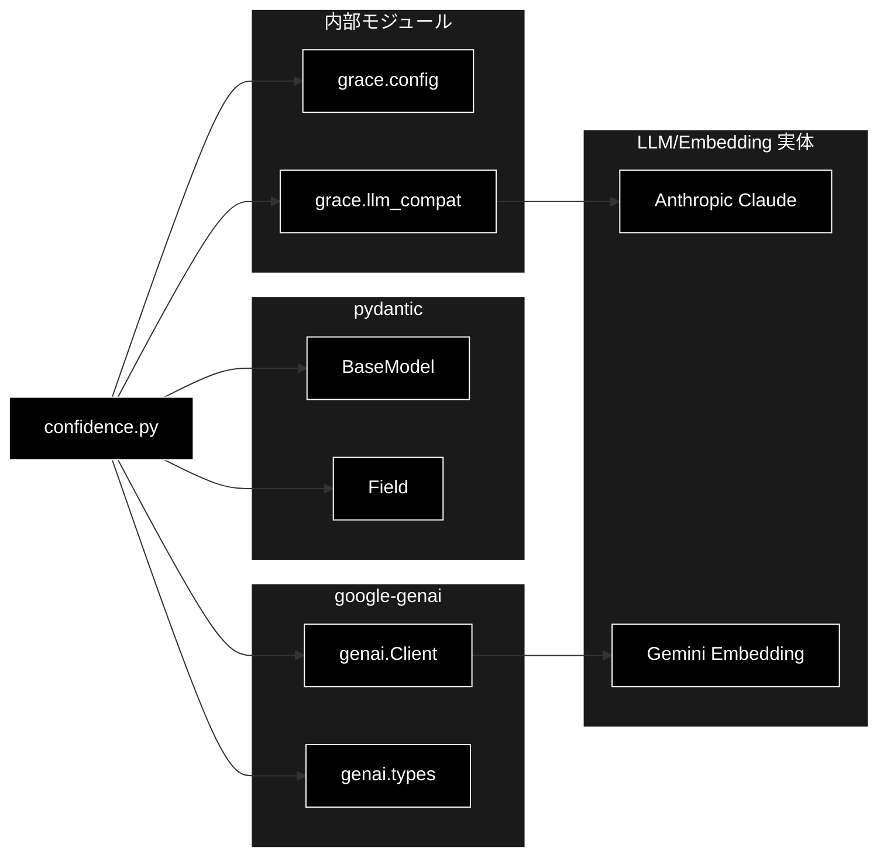

# confidence.py - 信頼度計算システム ドキュメント

**Version 2.1** | 最終更新: 2026-06-16

---

## 目次

1. [概要](#概要)
2. [アーキテクチャ構成図](#1-アーキテクチャ構成図)
3. [モジュール構成図](#2-モジュール構成図)
4. [クラス・関数一覧表](#3-クラス関数一覧表)
5. [クラス・関数 IPO詳細](#4-クラス関数-ipo詳細)
6. [設定・定数](#5-設定定数)
7. [使用例](#6-使用例)
8. [エクスポート](#7-エクスポート)
9. [変更履歴](#8-変更履歴)
10. [付録: 依存関係図](#付録-依存関係図)

---

## 概要

`confidence.py` は、GRACE（Guided Reasoning with Adaptive Confidence Execution）における信頼度計算システムを実装するモジュールです。ハイブリッド方式（重み付き平均 + LLM 自己評価 + 根拠妥当性検証）による多軸の信頼度算出と、その結果に基づく介入レベル（自動進行〜ユーザー入力要求）の判定を担います。

LLM 呼び出しは `llm_compat.create_chat_client()` が返す genai 互換クライアント経由で行われ、本プロジェクトでは Anthropic Claude（既定 `claude-sonnet-4-6`）が実体となります。一方、ソース一致度計算の Embedding は Gemini（`gemini-embedding-001`、3072次元）を継続利用します。

### 主な責務

- RAG 検索品質・ツール成功率などの要素から多軸信頼度を計算する
- LLM 自己評価により回答の確信度・網羅度を取得する
- 複数ソース間の意味的一致度を計算する
- 最終回答の各主張が引用ソースに支持されるか（groundedness）を検証する
- 信頼度スコアに基づいて介入レベル（アクション）を決定する
- 複数ステップの信頼度を集計する

### 各責務対応のモジュール

| # | 責務 | 対応モジュール | 説明 |
|---|------|--------------|------|
| 1 | 多軸信頼度の計算 | `confidence.py` | `ConfidenceCalculator` が検索品質・ツール成功率等を統合 |
| 2 | LLM 自己評価 | `confidence.py` | `LLMSelfEvaluator` が確信度・網羅度を LLM で評価 |
| 3 | 複数ソース一致度 | `confidence.py` | `SourceAgreementCalculator` が Gemini Embedding で類似度算出 |
| 4 | 根拠妥当性検証 | `confidence.py` | `GroundednessVerifier` が主張ごとの支持/矛盾を判定 |
| 5 | 介入レベル決定 | `confidence.py` | `ConfidenceCalculator.decide_action()` が閾値で判定 |
| 6 | 複数ステップ集計 | `confidence.py` | `ConfidenceAggregator` が mean/min/weighted で集計 |
| 7 | LLM クライアント生成 | `llm_compat.py` | `create_chat_client()` が Anthropic 互換クライアントを返却 |
| 8 | 設定・閾値の提供 | `config.py` | `GraceConfig.confidence` が重み・閾値を保持 |

### 主要機能一覧

| 機能 | 説明 |
|------|------|
| `ConfidenceFactors` | 信頼度を構成する各要素を保持するデータクラス |
| `ConfidenceScore` | 信頼度スコアと内訳・ペナルティを保持するデータクラス |
| `ConfidenceScore.level` | スコアから信頼度レベル文字列を導出するプロパティ |
| `InterventionLevel` | 介入レベルの列挙型（silent/notify/confirm/escalate） |
| `ActionDecision` | 信頼度に基づくアクション決定を保持するデータクラス |
| `ConfidenceCalculator` | ハイブリッド方式の信頼度計算クラス |
| `ConfidenceCalculator.calculate()` | 要素から信頼度スコアを算出 |
| `ConfidenceCalculator.llm_calculate()` | LLM を用いた信頼度計算 |
| `ConfidenceCalculator.decide_action()` | スコアから介入レベルを決定 |
| `LLMSelfEvaluator` | LLM による自己評価クラス |
| `LLMSelfEvaluator.evaluate()` | 確信度を単一スコアで評価 |
| `LLMSelfEvaluator.evaluate_final()` | 確信度＋網羅度を1回の呼び出しで統合評価 |
| `LLMSelfEvaluator.evaluate_with_factors()` | Factors を考慮した総合評価 |
| `SourceAgreementCalculator` | 複数ソース間一致度計算クラス |
| `SourceAgreementCalculator.calculate()` | 回答群の平均コサイン類似度を算出 |
| `QueryCoverageCalculator` | クエリ網羅度計算クラス |
| `QueryCoverageCalculator.calculate()` | 質問要素のカバー度を評価 |
| `GroundednessVerifier` | 根拠妥当性（S1）検証クラス |
| `GroundednessVerifier.verify()` | 主張ごとの支持率を検証 |
| `ConfidenceAggregator` | 複数ステップの信頼度集計クラス |
| `ConfidenceAggregator.aggregate()` | mean/min/weighted で集計 |
| `ConfidenceAggregator.aggregate_with_critical_check()` | 致命的失敗を考慮した集計 |
| `create_confidence_calculator()` | `ConfidenceCalculator` のファクトリ関数 |
| `create_llm_evaluator()` | `LLMSelfEvaluator` のファクトリ関数 |
| `create_source_agreement_calculator()` | `SourceAgreementCalculator` のファクトリ関数 |
| `create_query_coverage_calculator()` | `QueryCoverageCalculator` のファクトリ関数 |
| `create_confidence_aggregator()` | `ConfidenceAggregator` のファクトリ関数 |
| `create_groundedness_verifier()` | `GroundednessVerifier` のファクトリ関数 |

---

## 1. アーキテクチャ構成図

### 1.1 システム全体構成



### 1.2 データフロー

1. クライアント層（Executor / Replan Manager）が `ConfidenceFactors` を構築する
2. `ConfidenceCalculator.calculate()` または `llm_calculate()` が信頼度スコアを算出する
3. LLM 評価（`LLMSelfEvaluator` / `QueryCoverageCalculator` / `GroundednessVerifier`）は `llm_compat` 経由で Anthropic Claude を呼び出す
4. ソース一致度（`SourceAgreementCalculator`）は Gemini Embedding でベクトル化しコサイン類似度を計算する
5. `ConfidenceScore` を `decide_action()` に渡し `InterventionLevel` を決定する
6. 複数ステップは `ConfidenceAggregator` で集計され、最終的な信頼度として返却される

---

## 2. モジュール構成図

### 2.1 内部モジュール構成



### 2.2 外部依存関係

| ライブラリ | バージョン | 用途 |
|-----------|-----------|------|
| `google-genai` | - | Gemini Embedding（`genai.Client` / `types`） |
| `anthropic` | - | LLM テキスト生成（`llm_compat` 経由で遅延 import） |
| `pydantic` | - | 構造化出力スキーマ（`BaseModel` / `Field`） |

### 2.3 内部依存モジュール

| モジュール | 用途 |
|-----------|------|
| `grace.config` | `get_config` / `GraceConfig`（重み・閾値・モデル名） |
| `grace.llm_compat` | `create_chat_client`（genai 互換 Anthropic クライアント） |

---

## 3. クラス・関数一覧表

### 3.1 クラス一覧

#### EvaluationResult

| メソッド | 概要 |
|---------|------|
| （フィールドのみ） | `score: float`, `reason: str` — LLM 信頼度評価の応答スキーマ |

#### ConfidenceFactors

| メソッド | 概要 |
|---------|------|
| （データクラス） | 信頼度を構成する各要素（検索・ソース・ツール・クエリ等） |

#### ConfidenceScore

| メソッド | 概要 |
|---------|------|
| `level` | スコアから信頼度レベル文字列を返すプロパティ |

#### InterventionLevel

| メソッド | 概要 |
|---------|------|
| （列挙型） | `SILENT` / `NOTIFY` / `CONFIRM` / `ESCALATE` |

#### ActionDecision

| メソッド | 概要 |
|---------|------|
| `should_proceed` | 自動進行可能かを返すプロパティ |
| `needs_confirmation` | 確認が必要かを返すプロパティ |
| `needs_user_input` | ユーザー入力が必要かを返すプロパティ |

#### ConfidenceCalculator

| メソッド | 概要 |
|---------|------|
| `__init__(config=None)` | コンストラクタ（設定・重みの読込と検証） |
| `_validate_weights()` | 重みの合計が 1.0 であることを検証 |
| `calculate(factors)` | ハイブリッド方式で信頼度スコアを算出 |
| `llm_calculate(factors, step_description, tool_output)` | LLM を用いた信頼度計算 |
| `_calc_search_quality(factors)` | RAG 検索品質をスコア化 |
| `_calc_tool_success(factors)` | ツール成功率を計算 |
| `_apply_penalties(base_score, factors)` | 特定条件でペナルティを適用 |
| `decide_action(score)` | スコアから介入レベルを決定 |

#### FinalEvaluationResult

| メソッド | 概要 |
|---------|------|
| （フィールドのみ） | `self_eval_score`, `coverage_score`, `reason` |

#### LLMSelfEvaluator

| メソッド | 概要 |
|---------|------|
| `__init__(config=None, model_name=None)` | コンストラクタ（クライアント生成） |
| `evaluate(query, answer, sources=None)` | 確信度を単一スコアで評価 |
| `evaluate_final(query, answer, sources=None)` | 確信度＋網羅度を1回で統合評価 |
| `evaluate_with_factors(description, output, factors)` | Factors を考慮した総合評価 |

#### SourceAgreementCalculator

| メソッド | 概要 |
|---------|------|
| `__init__(config=None)` | コンストラクタ（Gemini クライアント生成） |
| `calculate(answers)` | 回答群の平均コサイン類似度を算出 |
| `_cosine_similarity(vec1, vec2)` | コサイン類似度（静的メソッド） |

#### QueryCoverageCalculator

| メソッド | 概要 |
|---------|------|
| `__init__(config=None, model_name=None)` | コンストラクタ（クライアント生成） |
| `calculate(query, answer)` | クエリ網羅度を評価 |

#### ClaimVerdict

| メソッド | 概要 |
|---------|------|
| （フィールドのみ） | `claim: str`, `verdict: Literal[...]` |

#### GroundednessResponse

| メソッド | 概要 |
|---------|------|
| （フィールドのみ） | `claims: List[ClaimVerdict]`, `reason: str` |

#### GroundednessResult

| メソッド | 概要 |
|---------|------|
| （データクラス） | 支持率・支持数・矛盾数・検証可否を保持 |

#### GroundednessVerifier

| メソッド | 概要 |
|---------|------|
| `__init__(config=None, model_name=None)` | コンストラクタ（クライアント生成） |
| `verify(query, answer, sources=None)` | 主張ごとの支持率を検証 |

#### ConfidenceAggregator

| メソッド | 概要 |
|---------|------|
| `__init__(config=None)` | コンストラクタ |
| `aggregate(scores, method="mean")` | mean/min/weighted で集計 |
| `aggregate_with_critical_check(scores, critical_threshold=0.3)` | 致命的失敗を考慮した集計 |

### 3.2 関数一覧（カテゴリ別）

#### ファクトリ関数

| 関数名 | 概要 |
|-------|------|
| `create_confidence_calculator(config=None)` | `ConfidenceCalculator` を生成 |
| `create_llm_evaluator(config=None, model_name=None)` | `LLMSelfEvaluator` を生成 |
| `create_source_agreement_calculator(config=None)` | `SourceAgreementCalculator` を生成 |
| `create_query_coverage_calculator(config=None, model_name=None)` | `QueryCoverageCalculator` を生成 |
| `create_confidence_aggregator(config=None)` | `ConfidenceAggregator` を生成 |
| `create_groundedness_verifier(config=None, model_name=None)` | `GroundednessVerifier` を生成 |

---

## 4. クラス・関数 IPO詳細

### 4.1 ConfidenceFactors クラス

信頼度を構成する各要素を保持するデータクラス。検索・ソース・LLM 自己評価・ツール・クエリの各指標を集約する。

**概要**: 信頼度計算の入力となる全要素を1つに束ねるデータクラス。

```python
@dataclass
class ConfidenceFactors:
    search_result_count: int = 0
    search_avg_score: float = 0.0
    search_max_score: float = 0.0
    search_score_variance: float = 1.0
    source_agreement: float = 0.0
    source_count: int = 0
    llm_self_confidence: float = 0.5
    groundedness: float = 0.0
    tool_success_rate: float = 1.0
    tool_execution_count: int = 0
    tool_success_count: int = 0
    query_coverage: float = 0.0
    is_search_step: bool = False
```

| パラメータ | 型 | デフォルト | 説明 |
|------------|------|-----------|------|
| `search_result_count` | int | 0 | 検索結果数 |
| `search_avg_score` | float | 0.0 | 平均類似度スコア |
| `search_max_score` | float | 0.0 | 最高類似度スコア |
| `search_score_variance` | float | 1.0 | スコアの分散（低いほど一貫性あり） |
| `source_agreement` | float | 0.0 | 情報源間の一致度 (0-1) |
| `source_count` | int | 0 | 引用ソース数 |
| `llm_self_confidence` | float | 0.5 | LLM の自己評価 (0-1) |
| `groundedness` | float | 0.0 | 根拠支持率 (0-1)。0 は未検証を含む |
| `tool_success_rate` | float | 1.0 | ツール成功率 |
| `tool_execution_count` | int | 0 | 実行ツール数 |
| `tool_success_count` | int | 0 | 成功ツール数 |
| `query_coverage` | float | 0.0 | クエリへの回答網羅度 |
| `is_search_step` | bool | False | 検索ステップかどうか |

| 項目 | 内容 |
|------|------|
| **Input** | 上記フィールド（すべて任意・デフォルト値あり） |
| **Process** | dataclass として値を保持 |
| **Output** | `ConfidenceFactors` インスタンス |

**戻り値例**:
```python
ConfidenceFactors(
    search_result_count=5,
    search_max_score=0.82,
    search_avg_score=0.71,
    is_search_step=True
)
```

```python
# 使用例
from grace.confidence import ConfidenceFactors

factors = ConfidenceFactors(search_max_score=0.82, search_result_count=5, is_search_step=True)
print(factors.search_max_score)
# 0.82
```

### 4.2 ConfidenceScore クラス

信頼度スコアと内訳・適用ペナルティを保持するデータクラス。

**概要**: 最終スコア・内訳・ペナルティ・理由を保持し、`level` プロパティでレベル文字列を導出する。

```python
@dataclass
class ConfidenceScore:
    score: float
    factors: ConfidenceFactors
    breakdown: Dict[str, float] = field(default_factory=dict)
    penalties_applied: List[str] = field(default_factory=list)
    reason: str = ""
```

| パラメータ | 型 | デフォルト | 説明 |
|------------|------|-----------|------|
| `score` | float | - | 最終スコア (0.0-1.0) |
| `factors` | ConfidenceFactors | - | 計算に使用した要素 |
| `breakdown` | Dict[str, float] | `{}` | 各要素のスコア内訳 |
| `penalties_applied` | List[str] | `[]` | 適用されたペナルティ |
| `reason` | str | "" | 信頼度スコアの理由 |

| 項目 | 内容 |
|------|------|
| **Input** | `score`, `factors`, `breakdown`, `penalties_applied`, `reason` |
| **Process** | 値を保持。`level` プロパティで 0.9/0.7/0.4 を境にレベル判定 |
| **Output** | `ConfidenceScore` インスタンス |

**戻り値例**:
```python
{
    "score": 0.82,
    "breakdown": {"search_quality": 0.82, "tool_success": 1.0},
    "penalties_applied": [],
    "reason": ""
}
```

```python
# 使用例
score = ConfidenceScore(score=0.82, factors=factors)
print(score.level)
# medium
```

#### プロパティ: `level`

**概要**: スコアに応じて信頼度レベル文字列を返す。

```python
@property
def level(self) -> str
```

| 項目 | 内容 |
|------|------|
| **Input** | なし（self のみ） |
| **Process** | `>=0.9 → high` / `>=0.7 → medium` / `>=0.4 → low` / それ以外 `very_low` |
| **Output** | `str`: 信頼度レベル |

**戻り値例**:
```python
"medium"
```

```python
# 使用例
print(ConfidenceScore(score=0.95, factors=factors).level)
# high
```

### 4.3 InterventionLevel 列挙型

介入レベルを表す文字列列挙型。

**概要**: 自動進行から人間介入までの4段階を定義する `str, Enum`。

```python
class InterventionLevel(str, Enum):
    SILENT = "silent"
    NOTIFY = "notify"
    CONFIRM = "confirm"
    ESCALATE = "escalate"
```

| 項目 | 内容 |
|------|------|
| **Input** | なし |
| **Process** | 列挙メンバーの定義 |
| **Output** | `InterventionLevel` メンバー |

**戻り値例**:
```python
InterventionLevel.SILENT  # "silent"
```

```python
# 使用例
from grace.confidence import InterventionLevel
print(InterventionLevel.CONFIRM.value)
# confirm
```

### 4.4 ActionDecision クラス

信頼度に基づくアクション決定を保持するデータクラス。

**概要**: 介入レベル・スコア・理由・推奨アクションを保持し、判定用プロパティを提供する。

```python
@dataclass
class ActionDecision:
    level: InterventionLevel
    confidence_score: float
    reason: str
    suggested_action: Optional[str] = None
```

| パラメータ | 型 | デフォルト | 説明 |
|------------|------|-----------|------|
| `level` | InterventionLevel | - | 介入レベル |
| `confidence_score` | float | - | 信頼度スコア |
| `reason` | str | - | 判定理由 |
| `suggested_action` | Optional[str] | None | 推奨アクション |

| 項目 | 内容 |
|------|------|
| **Input** | `level`, `confidence_score`, `reason`, `suggested_action` |
| **Process** | 値を保持。`should_proceed` / `needs_confirmation` / `needs_user_input` で判定 |
| **Output** | `ActionDecision` インスタンス |

**戻り値例**:
```python
{
    "level": "silent",
    "confidence_score": 0.92,
    "reason": "高い信頼度: 自動進行",
    "suggested_action": "proceed"
}
```

```python
# 使用例
decision = ActionDecision(level=InterventionLevel.SILENT, confidence_score=0.92, reason="高い信頼度")
print(decision.should_proceed)
# True
```

### 4.5 ConfidenceCalculator クラス

ハイブリッド方式による信頼度計算クラス。

#### コンストラクタ: `__init__`

**概要**: 設定と重みを読み込み、重みの整合性を検証する。

```python
def __init__(self, config: Optional[GraceConfig] = None)
```

| パラメータ | 型 | デフォルト | 説明 |
|------------|------|-----------|------|
| `config` | Optional[GraceConfig] | None | 設定。未指定時は `get_config()` |

| 項目 | 内容 |
|------|------|
| **Input** | `config: Optional[GraceConfig] = None` |
| **Process** | 1. config 解決<br>2. `confidence.weights` を取得<br>3. `_validate_weights()` で合計1.0を検証 |
| **Output** | `ConfidenceCalculator` インスタンス |

**戻り値例**:
```python
ConfidenceCalculator(config=None)
```

```python
# 使用例
from grace.confidence import ConfidenceCalculator
calc = ConfidenceCalculator()
```

#### メソッド: `calculate`

**概要**: 要素から信頼度スコアを算出する（検索ステップと非検索ステップで分岐）。

```python
def calculate(self, factors: ConfidenceFactors) -> ConfidenceScore
```

| パラメータ | 型 | デフォルト | 説明 |
|------------|------|-----------|------|
| `factors` | ConfidenceFactors | - | 計算対象の要素 |

| 項目 | 内容 |
|------|------|
| **Input** | `factors: ConfidenceFactors` |
| **Process** | 1. 検索品質・ツール成功率等を算出<br>2. 検索ステップは検索品質を基準、非検索は有効重みで加重平均<br>3. `_apply_penalties()` でペナルティ適用<br>4. 0.0〜1.0 にクリップし小数3桁に丸め |
| **Output** | `ConfidenceScore`: スコアと内訳 |

**戻り値例**:
```python
{
    "score": 0.82,
    "breakdown": {
        "search_quality": 0.82,
        "source_agreement": 0.0,
        "llm_self_eval": 0.0,
        "tool_success": 1.0,
        "query_coverage": 0.0
    },
    "penalties_applied": []
}
```

```python
# 使用例
factors = ConfidenceFactors(search_max_score=0.82, search_result_count=5, is_search_step=True)
score = calc.calculate(factors)
print(score.score, score.level)
# 0.82 medium
```

#### メソッド: `llm_calculate`

**概要**: LLM 評価器を用いて信頼度を計算し、検索スコアが高い検索ステップでは検索スコアを優先する。

```python
def llm_calculate(
    self,
    factors: ConfidenceFactors,
    step_description: str = "",
    tool_output: str = ""
) -> ConfidenceScore
```

| パラメータ | 型 | デフォルト | 説明 |
|------------|------|-----------|------|
| `factors` | ConfidenceFactors | - | 計算対象の要素 |
| `step_description` | str | "" | ステップの目的説明 |
| `tool_output` | str | "" | ツール出力（評価対象） |

| 項目 | 内容 |
|------|------|
| **Input** | `factors`, `step_description: str = ""`, `tool_output: str = ""` |
| **Process** | 1. `create_llm_evaluator()` で評価器生成<br>2. `evaluate_with_factors()` でスコアと理由を取得<br>3. 検索ステップで `search_max_score>0.7` かつ上回る場合は検索スコアを優先 |
| **Output** | `ConfidenceScore`: LLM スコアと理由 |

**戻り値例**:
```python
{
    "score": 0.78,
    "breakdown": {"llm_score": 0.78, "reason": 1.0},
    "reason": "主要な情報は得られている",
    "penalties_applied": []
}
```

```python
# 使用例
score = calc.llm_calculate(factors, step_description="製品仕様を検索", tool_output="...")
print(score.score, score.reason)
```

#### メソッド: `decide_action`

**概要**: 信頼度スコアと設定閾値から介入レベルを決定する。

```python
def decide_action(self, score: ConfidenceScore) -> ActionDecision
```

| パラメータ | 型 | デフォルト | 説明 |
|------------|------|-----------|------|
| `score` | ConfidenceScore | - | 判定対象のスコア |

| 項目 | 内容 |
|------|------|
| **Input** | `score: ConfidenceScore` |
| **Process** | `thresholds.silent`(0.9)/`notify`(0.7)/`confirm`(0.4) と比較し4段階のいずれかを返す |
| **Output** | `ActionDecision`: 介入レベルと推奨アクション |

**戻り値例**:
```python
(
    "notify",
    0.78,
    "中程度の信頼度: ステータス表示しながら進行",
    "proceed_with_status"
)
```

```python
# 使用例
decision = calc.decide_action(score)
print(decision.level, decision.suggested_action)
# InterventionLevel.NOTIFY proceed_with_status
```

### 4.6 LLMSelfEvaluator クラス

LLM による自己評価クラス。`llm_compat` 経由で Anthropic Claude を呼び出す。

#### コンストラクタ: `__init__`

**概要**: 設定とモデル名を解決し、genai 互換チャットクライアントを生成する。

```python
def __init__(
    self,
    config: Optional[GraceConfig] = None,
    model_name: Optional[str] = None
)
```

| パラメータ | 型 | デフォルト | 説明 |
|------------|------|-----------|------|
| `config` | Optional[GraceConfig] | None | 設定。未指定時は `get_config()` |
| `model_name` | Optional[str] | None | モデル名。未指定時は `config.llm.model` |

| 項目 | 内容 |
|------|------|
| **Input** | `config`, `model_name` |
| **Process** | 1. config 解決<br>2. model_name 解決（既定 `claude-sonnet-4-6`）<br>3. `create_chat_client(config)` でクライアント生成 |
| **Output** | `LLMSelfEvaluator` インスタンス |

**戻り値例**:
```python
LLMSelfEvaluator(config=None, model_name="claude-sonnet-4-6")
```

```python
# 使用例
from grace.confidence import LLMSelfEvaluator
evaluator = LLMSelfEvaluator()
```

#### メソッド: `evaluate`

**概要**: 質問・回答・情報源から確信度を単一スコア（0.0-1.0）で評価する。

```python
def evaluate(
    self,
    query: str,
    answer: str,
    sources: Optional[List[str]] = None
) -> float
```

| パラメータ | 型 | デフォルト | 説明 |
|------------|------|-----------|------|
| `query` | str | - | 元の質問 |
| `answer` | str | - | 生成された回答 |
| `sources` | Optional[List[str]] | None | 使用した情報源 |

| 項目 | 内容 |
|------|------|
| **Input** | `query`, `answer`, `sources=None` |
| **Process** | 1. `EVAL_PROMPT` を整形<br>2. `generate_content`（temperature=0.0, max_output_tokens=512）<br>3. テキストを float 化し 0.0〜1.0 にクリップ<br>4. 失敗時は 0.5 |
| **Output** | `float`: 確信度 (0.0-1.0) |

**戻り値例**:
```python
0.8
```

```python
# 使用例
conf = evaluator.evaluate(query="保証期間は？", answer="1年間です。", sources=["保証規定"])
print(conf)
# 0.8
```

#### メソッド: `evaluate_final`

**概要**: 確信度と網羅度を1回の LLM 呼び出しで統合評価する（構造化出力）。

```python
def evaluate_final(
    self,
    query: str,
    answer: str,
    sources: Optional[List[str]] = None
) -> FinalEvaluationResult
```

| パラメータ | 型 | デフォルト | 説明 |
|------------|------|-----------|------|
| `query` | str | - | 元の質問 |
| `answer` | str | - | 生成された回答 |
| `sources` | Optional[List[str]] | None | 使用した情報源 |

| 項目 | 内容 |
|------|------|
| **Input** | `query`, `answer`, `sources=None` |
| **Process** | 1. `FINAL_EVAL_PROMPT` を整形<br>2. JSON 構造化出力で `generate_content`（max_output_tokens=1024）<br>3. `FinalEvaluationResult.model_validate_json()` で検証 |
| **Output** | `FinalEvaluationResult`: `self_eval_score` / `coverage_score` / `reason` |

> 📝 **注意**: LLM 呼び出し失敗時は例外を送出する（呼び出し元でフォールバック）。

**戻り値例**:
```python
{
    "self_eval_score": 0.85,
    "coverage_score": 0.9,
    "reason": "主要要素を網羅し正確"
}
```

```python
# 使用例
result = evaluator.evaluate_final(query="保証は？", answer="1年です。", sources=["規定"])
print(result.self_eval_score, result.coverage_score)
# 0.85 0.9
```

#### メソッド: `evaluate_with_factors`

**概要**: ステップ目的・ツール出力・Factors を考慮し総合スコアと理由を返す。

```python
def evaluate_with_factors(
    self,
    description: str,
    output: str,
    factors: ConfidenceFactors
) -> Dict[str, Any]
```

| パラメータ | 型 | デフォルト | 説明 |
|------------|------|-----------|------|
| `description` | str | - | ステップの目的 |
| `output` | str | - | ツール出力（先頭2000文字を使用） |
| `factors` | ConfidenceFactors | - | 統計データ |

| 項目 | 内容 |
|------|------|
| **Input** | `description`, `output`, `factors` |
| **Process** | 1. Factors を埋め込んだプロンプト生成<br>2. JSON モードで `generate_content`（max_output_tokens=1024）<br>3. `response.parsed` → 手動 JSON パースの順で抽出<br>4. 失敗時は `search_max_score` か 0.5 にフォールバック |
| **Output** | `Dict[str, Any]`: `{"score": float, "reason": str}` |

**戻り値例**:
```python
{
    "score": 0.78,
    "reason": "主要な情報は得られており、信頼できる"
}
```

```python
# 使用例
res = evaluator.evaluate_with_factors(description="仕様検索", output="...", factors=factors)
print(res["score"], res["reason"])
```

### 4.7 SourceAgreementCalculator クラス

複数ソース間の意味的一致度を Gemini Embedding で計算するクラス。

#### コンストラクタ: `__init__`

**概要**: Gemini クライアントと Embedding モデル名を初期化する。

```python
def __init__(self, config: Optional[GraceConfig] = None)
```

| パラメータ | 型 | デフォルト | 説明 |
|------------|------|-----------|------|
| `config` | Optional[GraceConfig] | None | 設定。未指定時は `get_config()` |

| 項目 | 内容 |
|------|------|
| **Input** | `config: Optional[GraceConfig] = None` |
| **Process** | 1. config 解決<br>2. `genai.Client()` を生成<br>3. `config.embedding.model`（`gemini-embedding-001`）を保持 |
| **Output** | `SourceAgreementCalculator` インスタンス |

**戻り値例**:
```python
SourceAgreementCalculator(config=None)
```

```python
# 使用例
from grace.confidence import SourceAgreementCalculator
src = SourceAgreementCalculator()
```

#### メソッド: `calculate`

**概要**: 複数回答をベクトル化し、全ペアの平均コサイン類似度を一致度として返す。

```python
def calculate(self, answers: List[str]) -> float
```

| パラメータ | 型 | デフォルト | 説明 |
|------------|------|-----------|------|
| `answers` | List[str] | - | 比較対象の回答群 |

| 項目 | 内容 |
|------|------|
| **Input** | `answers: List[str]` |
| **Process** | 1. 要素2未満なら 1.0<br>2. 各回答を Gemini Embedding でベクトル化<br>3. 全ペアのコサイン類似度を平均<br>4. 失敗時は 0.5 |
| **Output** | `float`: 一致度 (0.0-1.0) |

**戻り値例**:
```python
0.873
```

```python
# 使用例
agreement = src.calculate(["保証は1年です", "保証期間は1年間"])
print(agreement)
# 0.873
```

### 4.8 QueryCoverageCalculator クラス

クエリ網羅度を LLM で評価するクラス。

#### コンストラクタ: `__init__`

**概要**: 設定・モデル名を解決し、チャットクライアントを生成する。

```python
def __init__(
    self,
    config: Optional[GraceConfig] = None,
    model_name: Optional[str] = None
)
```

| パラメータ | 型 | デフォルト | 説明 |
|------------|------|-----------|------|
| `config` | Optional[GraceConfig] | None | 設定 |
| `model_name` | Optional[str] | None | モデル名（既定は `config.llm.model`） |

| 項目 | 内容 |
|------|------|
| **Input** | `config`, `model_name` |
| **Process** | config / model_name 解決後、`create_chat_client(config)` でクライアント生成 |
| **Output** | `QueryCoverageCalculator` インスタンス |

**戻り値例**:
```python
QueryCoverageCalculator(config=None, model_name="claude-sonnet-4-6")
```

```python
# 使用例
from grace.confidence import QueryCoverageCalculator
cov = QueryCoverageCalculator()
```

#### メソッド: `calculate`

**概要**: 質問のすべての要素を回答がカバーしているかを 0.0-1.0 で評価する。

```python
def calculate(self, query: str, answer: str) -> float
```

| パラメータ | 型 | デフォルト | 説明 |
|------------|------|-----------|------|
| `query` | str | - | 元の質問 |
| `answer` | str | - | 生成された回答 |

| 項目 | 内容 |
|------|------|
| **Input** | `query`, `answer` |
| **Process** | 1. `COVERAGE_PROMPT` 整形<br>2. `generate_content`（temperature=0.0, max_output_tokens=512）<br>3. float 化＋クリップ<br>4. 非空回答で 0.0 の異常値は floor 0.4 を適用<br>5. 失敗時は 0.5 |
| **Output** | `float`: 網羅度 (0.0-1.0) |

**戻り値例**:
```python
0.8
```

```python
# 使用例
coverage = cov.calculate(query="価格と保証は？", answer="価格は1万円です。")
print(coverage)
# 0.6
```

### 4.9 GroundednessVerifier クラス

最終回答の各主張が引用ソースに支持されるか（entailment）を LLM 判定する S1 の中核クラス。

#### コンストラクタ: `__init__`

**概要**: 設定・モデル名を解決し、チャットクライアントを生成する。

```python
def __init__(
    self,
    config: Optional[GraceConfig] = None,
    model_name: Optional[str] = None
)
```

| パラメータ | 型 | デフォルト | 説明 |
|------------|------|-----------|------|
| `config` | Optional[GraceConfig] | None | 設定 |
| `model_name` | Optional[str] | None | モデル名（既定は `config.llm.model`） |

| 項目 | 内容 |
|------|------|
| **Input** | `config`, `model_name` |
| **Process** | config / model_name 解決後、`create_chat_client(config)` でクライアント生成 |
| **Output** | `GroundednessVerifier` インスタンス |

**戻り値例**:
```python
GroundednessVerifier(config=None, model_name="claude-sonnet-4-6")
```

```python
# 使用例
from grace.confidence import GroundednessVerifier
verifier = GroundednessVerifier()
```

#### メソッド: `verify`

**概要**: 回答を主張に分解し、各主張が情報源に支持/矛盾/無関係のいずれかを判定して支持率を返す。

```python
def verify(
    self,
    query: str,
    answer: str,
    sources: Optional[List[str]] = None
) -> GroundednessResult
```

| パラメータ | 型 | デフォルト | 説明 |
|------------|------|-----------|------|
| `query` | str | - | 元の質問 |
| `answer` | str | - | 検証対象の回答 |
| `sources` | Optional[List[str]] | None | 引用ソース |

| 項目 | 内容 |
|------|------|
| **Input** | `query`, `answer`, `sources=None` |
| **Process** | 1. 回答空 or ソース無なら `verified=False`<br>2. JSON 構造化出力で `generate_content`（max_output_tokens=1024）<br>3. supported/contradicted を集計し `support_rate = supported / (supported+contradicted)`<br>4. 例外時は未検証で返却 |
| **Output** | `GroundednessResult`: 支持率・支持数・矛盾数・検証可否 |

**戻り値例**:
```python
(
    0.8333,   # support_rate
    5,        # supported
    1,        # contradicted
    7,        # total
    True,     # has_contradiction
    True      # verified
)
```

```python
# 使用例
result = verifier.verify(query="保証は？", answer="保証は1年です。", sources=["保証規定: 1年"])
print(result.support_rate, result.verified)
# 1.0 True
```

### 4.10 ConfidenceAggregator クラス

複数ステップの信頼度を集計するクラス。

#### コンストラクタ: `__init__`

**概要**: 設定を解決して初期化する。

```python
def __init__(self, config: Optional[GraceConfig] = None)
```

| パラメータ | 型 | デフォルト | 説明 |
|------------|------|-----------|------|
| `config` | Optional[GraceConfig] | None | 設定 |

| 項目 | 内容 |
|------|------|
| **Input** | `config: Optional[GraceConfig] = None` |
| **Process** | config を解決して保持 |
| **Output** | `ConfidenceAggregator` インスタンス |

**戻り値例**:
```python
ConfidenceAggregator(config=None)
```

```python
# 使用例
from grace.confidence import ConfidenceAggregator
agg = ConfidenceAggregator()
```

#### メソッド: `aggregate`

**概要**: 複数の信頼度スコアを mean/min/weighted で集計する。

```python
def aggregate(
    self,
    scores: List[ConfidenceScore],
    method: Literal["mean", "min", "weighted"] = "mean"
) -> float
```

| パラメータ | 型 | デフォルト | 説明 |
|------------|------|-----------|------|
| `scores` | List[ConfidenceScore] | - | 集計対象スコア群 |
| `method` | Literal["mean","min","weighted"] | "mean" | 集計方式 |

| 項目 | 内容 |
|------|------|
| **Input** | `scores`, `method="mean"` |
| **Process** | 1. 空なら 0.0<br>2. mean=平均 / min=最小 / weighted=後段ほど重い加重平均<br>3. 未知 method は ValueError |
| **Output** | `float`: 集計信頼度 |

**戻り値例**:
```python
0.785
```

```python
# 使用例
total = agg.aggregate([s1, s2, s3], method="weighted")
print(total)
# 0.785
```

#### メソッド: `aggregate_with_critical_check`

**概要**: 致命的に低いスコアが含まれる場合に平均をペナルティ補正して返す。

```python
def aggregate_with_critical_check(
    self,
    scores: List[ConfidenceScore],
    critical_threshold: float = 0.3
) -> tuple[float, bool]
```

| パラメータ | 型 | デフォルト | 説明 |
|------------|------|-----------|------|
| `scores` | List[ConfidenceScore] | - | 集計対象スコア群 |
| `critical_threshold` | float | 0.3 | 致命的失敗とみなす閾値 |

| 項目 | 内容 |
|------|------|
| **Input** | `scores`, `critical_threshold=0.3` |
| **Process** | 1. 空なら `(0.0, False)`<br>2. 平均を算出<br>3. 閾値未満が1つでもあれば平均×0.7 と `True` を返す |
| **Output** | `Tuple[float, bool]`<br>- float: 集計スコア<br>- bool: 致命的失敗の有無 |

**戻り値例**:
```python
(
    0.49,
    True
)
```

```python
# 使用例
score, has_failure = agg.aggregate_with_critical_check([s1, s2])
print(score, has_failure)
# 0.49 True
```

### 4.11 ファクトリ関数

#### `create_confidence_calculator`

**概要**: `ConfidenceCalculator` インスタンスを生成するファクトリ関数。

```python
def create_confidence_calculator(config: Optional[GraceConfig] = None) -> ConfidenceCalculator
```

| パラメータ | 型 | デフォルト | 説明 |
|------------|------|-----------|------|
| `config` | Optional[GraceConfig] | None | 設定 |

| 項目 | 内容 |
|------|------|
| **Input** | `config: Optional[GraceConfig] = None` |
| **Process** | `ConfidenceCalculator(config=config)` を生成 |
| **Output** | `ConfidenceCalculator` |

**戻り値例**:
```python
ConfidenceCalculator(config=None)
```

```python
# 使用例
from grace.confidence import create_confidence_calculator
calc = create_confidence_calculator()
```

#### `create_llm_evaluator`

**概要**: `LLMSelfEvaluator` インスタンスを生成するファクトリ関数。

```python
def create_llm_evaluator(
    config: Optional[GraceConfig] = None,
    model_name: Optional[str] = None
) -> LLMSelfEvaluator
```

| パラメータ | 型 | デフォルト | 説明 |
|------------|------|-----------|------|
| `config` | Optional[GraceConfig] | None | 設定 |
| `model_name` | Optional[str] | None | モデル名 |

| 項目 | 内容 |
|------|------|
| **Input** | `config`, `model_name` |
| **Process** | `LLMSelfEvaluator(config=config, model_name=model_name)` を生成 |
| **Output** | `LLMSelfEvaluator` |

**戻り値例**:
```python
LLMSelfEvaluator(config=None, model_name=None)
```

```python
# 使用例
from grace.confidence import create_llm_evaluator
evaluator = create_llm_evaluator()
```

#### `create_source_agreement_calculator`

**概要**: `SourceAgreementCalculator` インスタンスを生成するファクトリ関数。

```python
def create_source_agreement_calculator(config: Optional[GraceConfig] = None) -> SourceAgreementCalculator
```

| パラメータ | 型 | デフォルト | 説明 |
|------------|------|-----------|------|
| `config` | Optional[GraceConfig] | None | 設定 |

| 項目 | 内容 |
|------|------|
| **Input** | `config: Optional[GraceConfig] = None` |
| **Process** | `SourceAgreementCalculator(config=config)` を生成 |
| **Output** | `SourceAgreementCalculator` |

**戻り値例**:
```python
SourceAgreementCalculator(config=None)
```

```python
# 使用例
from grace.confidence import create_source_agreement_calculator
src = create_source_agreement_calculator()
```

#### `create_query_coverage_calculator`

**概要**: `QueryCoverageCalculator` インスタンスを生成するファクトリ関数。

```python
def create_query_coverage_calculator(
    config: Optional[GraceConfig] = None,
    model_name: Optional[str] = None
) -> QueryCoverageCalculator
```

| パラメータ | 型 | デフォルト | 説明 |
|------------|------|-----------|------|
| `config` | Optional[GraceConfig] | None | 設定 |
| `model_name` | Optional[str] | None | モデル名 |

| 項目 | 内容 |
|------|------|
| **Input** | `config`, `model_name` |
| **Process** | `QueryCoverageCalculator(config=config, model_name=model_name)` を生成 |
| **Output** | `QueryCoverageCalculator` |

**戻り値例**:
```python
QueryCoverageCalculator(config=None, model_name=None)
```

```python
# 使用例
from grace.confidence import create_query_coverage_calculator
cov = create_query_coverage_calculator()
```

#### `create_confidence_aggregator`

**概要**: `ConfidenceAggregator` インスタンスを生成するファクトリ関数。

```python
def create_confidence_aggregator(config: Optional[GraceConfig] = None) -> ConfidenceAggregator
```

| パラメータ | 型 | デフォルト | 説明 |
|------------|------|-----------|------|
| `config` | Optional[GraceConfig] | None | 設定 |

| 項目 | 内容 |
|------|------|
| **Input** | `config: Optional[GraceConfig] = None` |
| **Process** | `ConfidenceAggregator(config=config)` を生成 |
| **Output** | `ConfidenceAggregator` |

**戻り値例**:
```python
ConfidenceAggregator(config=None)
```

```python
# 使用例
from grace.confidence import create_confidence_aggregator
agg = create_confidence_aggregator()
```

#### `create_groundedness_verifier`

**概要**: `GroundednessVerifier` インスタンスを生成するファクトリ関数。

```python
def create_groundedness_verifier(
    config: Optional[GraceConfig] = None,
    model_name: Optional[str] = None
) -> GroundednessVerifier
```

| パラメータ | 型 | デフォルト | 説明 |
|------------|------|-----------|------|
| `config` | Optional[GraceConfig] | None | 設定 |
| `model_name` | Optional[str] | None | モデル名 |

| 項目 | 内容 |
|------|------|
| **Input** | `config`, `model_name` |
| **Process** | `GroundednessVerifier(config=config, model_name=model_name)` を生成 |
| **Output** | `GroundednessVerifier` |

**戻り値例**:
```python
GroundednessVerifier(config=None, model_name=None)
```

```python
# 使用例
from grace.confidence import create_groundedness_verifier
verifier = create_groundedness_verifier()
```

---

## 5. 設定・定数

### 5.1 ConfidenceWeights（`config.py`）

`ConfidenceCalculator` が参照する重み設定。`calculate()` は要素の有無に応じた動的重みを使うが、`_validate_weights()` で合計が 1.0 であることを起動時に検証する。

```python
class ConfidenceWeights(BaseModel):
    search_quality: float = 0.25
    source_agreement: float = 0.20
    llm_self_eval: float = 0.25
    tool_success: float = 0.15
    query_coverage: float = 0.15
```

| キー | デフォルト値 | 説明 |
|-----|-------------|------|
| `search_quality` | 0.25 | RAG 検索品質の重み |
| `source_agreement` | 0.20 | ソース一致度の重み |
| `llm_self_eval` | 0.25 | LLM 自己評価の重み |
| `tool_success` | 0.15 | ツール成功率の重み |
| `query_coverage` | 0.15 | クエリ網羅度の重み |

### 5.2 ConfidenceThresholds（`config.py`）

`decide_action()` が介入レベル判定に用いる閾値。

```python
class ConfidenceThresholds(BaseModel):
    silent: float = 0.9
    notify: float = 0.7
    confirm: float = 0.4
```

| キー | デフォルト値 | 説明 |
|-----|-------------|------|
| `silent` | 0.9 | 以上なら自動進行（SILENT） |
| `notify` | 0.7 | 以上ならステータス表示（NOTIFY） |
| `confirm` | 0.4 | 以上なら確認要求（CONFIRM）、未満は ESCALATE |

### 5.3 プロンプト定数（`confidence.py`）

| 定数 | 所属クラス | 用途 |
|-----|-----------|------|
| `FINAL_EVAL_PROMPT` | `LLMSelfEvaluator` | 確信度＋網羅度の統合評価プロンプト |
| `EVAL_PROMPT` | `LLMSelfEvaluator` | 確信度の単一評価プロンプト |
| `COVERAGE_PROMPT` | `QueryCoverageCalculator` | クエリ網羅度評価プロンプト |
| `PROMPT` | `GroundednessVerifier` | 根拠妥当性検証プロンプト |

### 5.4 LLM/Embedding 設定（参考）

| 設定 | 既定値 | 説明 |
|-----|-------|------|
| `LLMConfig.provider` | `"anthropic"` | LLM プロバイダー |
| `LLMConfig.model` | `"claude-sonnet-4-6"` | 既定 LLM モデル |
| `EmbeddingConfig.model` | `"gemini-embedding-001"` | Embedding モデル（3072次元） |

> 📝 **注意**: LLM 用 API キーは `ANTHROPIC_API_KEY`、設定クラスは `ModelConfig`/`LLMConfig` 系で管理されます。LLM 呼び出しは `llm_compat.create_chat_client()` の genai 互換アダプター経由で Anthropic を呼び出します。Embedding のみ Gemini を継続利用します。

---

## 6. 使用例

### 6.1 基本的なワークフロー

```python
from grace.confidence import (
    ConfidenceFactors,
    create_confidence_calculator,
)

# 1. 計算器を初期化
calc = create_confidence_calculator()

# 2. 検索結果から要素を構築
factors = ConfidenceFactors(
    search_result_count=5,
    search_max_score=0.82,
    search_avg_score=0.71,
    is_search_step=True,
)

# 3. 信頼度を計算
score = calc.calculate(factors)

# 4. 介入レベルを決定
decision = calc.decide_action(score)
print(f"信頼度: {score.score} ({score.level}) -> {decision.level}")
# 信頼度: 0.82 (medium) -> InterventionLevel.NOTIFY
```

### 6.2 応用ワークフロー（最終回答の検証と集計）

```python
from grace.confidence import (
    create_llm_evaluator,
    create_groundedness_verifier,
    create_confidence_aggregator,
)

query = "保証期間は？"
answer = "保証期間は1年間です。"
sources = ["保証規定: 製品保証は購入から1年間"]

# 統合評価（確信度＋網羅度を1回で）
evaluator = create_llm_evaluator()
final = evaluator.evaluate_final(query, answer, sources)

# 根拠妥当性（S1）検証
verifier = create_groundedness_verifier()
grounded = verifier.verify(query, answer, sources)
print(f"support_rate={grounded.support_rate}, verified={grounded.verified}")

# 複数ステップの集計
aggregator = create_confidence_aggregator()
total, has_failure = aggregator.aggregate_with_critical_check(step_scores)
print(f"total={total}, critical_failure={has_failure}")
```

---

## 7. エクスポート

`grace.confidence` の `__all__` でエクスポートされる要素：

```python
__all__ = [
    # データクラス・列挙型
    "ConfidenceFactors",
    "ConfidenceScore",
    "ActionDecision",
    "InterventionLevel",
    # 計算クラス
    "ConfidenceCalculator",
    "LLMSelfEvaluator",
    "SourceAgreementCalculator",
    "QueryCoverageCalculator",
    "ConfidenceAggregator",
    "GroundednessVerifier",
    # groundedness 関連
    "GroundednessResult",
    "GroundednessResponse",
    "ClaimVerdict",
    # ファクトリ関数
    "create_confidence_calculator",
    "create_llm_evaluator",
    "create_source_agreement_calculator",
    "create_query_coverage_calculator",
    "create_confidence_aggregator",
    "create_groundedness_verifier",
]
```

> 📝 **注意**: `EvaluationResult` と `FinalEvaluationResult` は内部スキーマであり `__all__` には含まれません。

---

## 8. 変更履歴

| バージョン | 変更内容 |
|-----------|---------|
| 1.0 | 初版作成 |
| 2.0 | groundedness（S1）検証・統合評価（evaluate_final）の追加に対応 |
| 2.1 | 実ソースに整合（2026-06-16）。LLM 呼び出しを `llm_compat`（Anthropic 互換）経由として明記、Embedding を Gemini に統一、全 Mermaid 図を黒背景・白文字スタイルに更新、IPO 詳細・設定値・`__all__` を最新化 |

---

## 付録: 依存関係図


