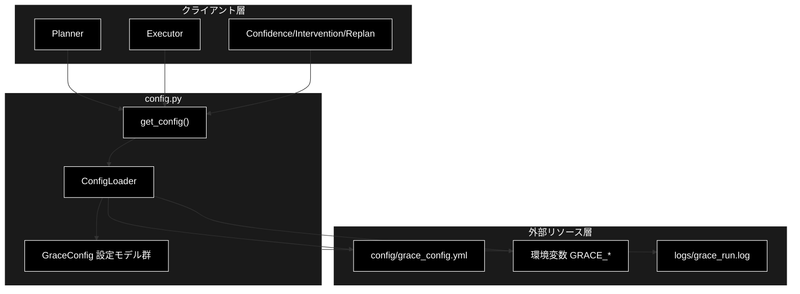
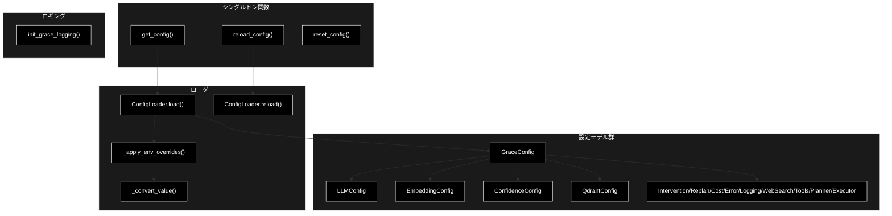
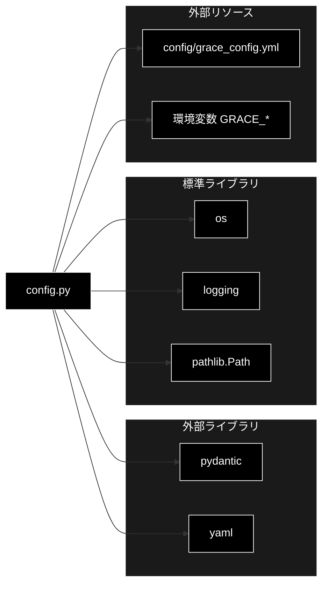

# config.py - GRACE 設定管理 ドキュメント

**Version 1.0** | 最終更新: 2026-06-16

---

## 目次

1. [概要](#概要)
2. [アーキテクチャ構成図](#1-アーキテクチャ構成図)
3. [モジュール構成図](#2-モジュール構成図)
4. [クラス・関数一覧表](#3-クラス関数一覧表)
5. [クラス・関数 IPO詳細](#4-クラス関数-ipo詳細)
6. [設定・定数](#5-設定定数)
7. [使用例](#6-使用例)
8. [エクスポート](#7-エクスポート)
9. [変更履歴](#8-変更履歴)
10. [付録: 依存関係図](#付録-依存関係図)

---

## 概要

`config.py`は、GRACE Agent の全設定を Pydantic モデルとして定義し、YAMLファイルと環境変数から階層的に読み込む設定管理モジュールです。LLM（Anthropic Claude）・Embedding（Gemini）・信頼度計算・介入・リプラン・コスト・エラー・Qdrant・Web検索・ツール・Planner・Executor の各設定を一元管理します。

### 主な責務

- GRACEパッケージ用ロギングの初期化
- LLM・Embedding 等のドメイン別設定モデルの定義（Pydantic）
- YAMLファイルからの設定読み込み
- 環境変数（`GRACE_` プレフィックス）による設定の上書き
- 設定インスタンスのシングルトン管理（取得・再読み込み・リセット）

### 各責務対応のモジュール

| # | 責務 | 対応モジュール | 説明 |
|---|------|--------------|------|
| 1 | GRACEパッケージ用ロギングの初期化 | `config.py` | `init_grace_logging()` がファイル/標準出力ハンドラを設定 |
| 2 | ドメイン別設定モデルの定義 | `config.py` | `LLMConfig` 等の Pydantic `BaseModel` 群 |
| 3 | YAMLファイルからの設定読み込み | `config.py` | `ConfigLoader.load()` が `config/grace_config.yml` を読込 |
| 4 | 環境変数による設定の上書き | `config.py` | `ConfigLoader._apply_env_overrides()` が `GRACE_` 変数を反映 |
| 5 | 設定インスタンスのシングルトン管理 | `config.py` | `get_config()` / `reload_config()` / `reset_config()` |

### 主要機能一覧

| 機能 | 説明 |
|------|------|
| `GraceConfig` | 全設定を統合するトップレベル設定モデル |
| `LLMConfig` | LLM（Anthropic Claude）設定モデル |
| `EmbeddingConfig` | Embedding（Gemini）設定モデル |
| `ConfidenceConfig` | 信頼度計算設定（重み・閾値・根拠妥当性） |
| `ConfidenceWeights` | 信頼度要素別の重み設定 |
| `ConfidenceThresholds` | 信頼度の介入閾値設定 |
| `InterventionConfig` | 介入（Human-in-the-loop）設定 |
| `ReplanConfig` | リプラン設定 |
| `CostConfig` | コスト管理設定 |
| `ErrorConfig` | エラーハンドリング設定 |
| `LoggingConfig` | ログ設定 |
| `QdrantConfig` | Qdrant接続・検索設定 |
| `WebSearchConfig` | Web検索設定 |
| `ToolsConfig` | ツール有効/無効設定 |
| `PlannerConfig` | Planner（二層計画生成）設定 |
| `ExecutorConfig` | Executor（並列実行・フォールバック）設定 |
| `ConfigLoader` | YAML・環境変数からの設定ローダー |
| `init_grace_logging()` | GRACEロギングの初期化 |
| `get_config()` | 設定取得（シングルトン） |
| `reload_config()` | 設定の再読み込み |
| `reset_config()` | 設定のリセット（テスト用） |

---

## 1. アーキテクチャ構成図

### 1.1 システム全体構成



### 1.2 データフロー

1. クライアント（Planner/Executor等）が `get_config()` を呼び出す
2. シングルトンの `ConfigLoader` が初期化され `load()` を実行
3. `config/grace_config.yml` が存在すれば YAML を読み込み（なければデフォルト）
4. `GRACE_` プレフィックスの環境変数で該当セクションを上書き
5. `GraceConfig(**config_dict)` で Pydantic 検証し、確定した設定を返却

---

## 2. モジュール構成図

### 2.1 内部モジュール構成



### 2.2 外部依存関係

| ライブラリ | バージョン | 用途 |
|-----------|-----------|------|
| `pydantic` | 2.x | 設定モデルの定義・検証 |
| `pyyaml` | 6.x | YAML設定ファイルの読み込み |

### 2.3 内部依存モジュール

| モジュール | 用途 |
|-----------|------|
| `os` | 環境変数の取得 |
| `logging` | ロギング初期化 |
| `pathlib.Path` | 設定ファイル・ログディレクトリのパス操作 |

---

## 3. クラス・関数一覧表

### 3.1 クラス一覧

#### GraceConfig

| メソッド/フィールド | 概要 |
|---------|------|
| `version`, `llm`, `embedding`, ... | 各ドメイン設定をネストしたトップレベルモデル |

#### ConfigLoader

| メソッド | 概要 |
|---------|------|
| `__init__(config_path)` | 設定ファイルパスを保持して初期化 |
| `load()` | YAML+環境変数から `GraceConfig` を構築 |
| `_apply_env_overrides(config_dict)` | 環境変数による上書きを適用 |
| `_convert_value(value)` | 文字列を適切な型へ変換 |
| `reload()` | キャッシュを破棄して再読み込み |

### 3.2 関数一覧（カテゴリ別）

#### ロギング

| 関数名 | 概要 |
|-------|------|
| `init_grace_logging()` | GRACEパッケージ用ロギングを初期化 |

#### シングルトン管理

| 関数名 | 概要 |
|-------|------|
| `get_config(config_path)` | 設定を取得（シングルトン） |
| `reload_config()` | 設定を再読み込み |
| `reset_config()` | 設定をリセット（テスト用） |

---

## 4. クラス・関数 IPO詳細

### 4.1 GraceConfig クラス

GRACE Agent の全設定を統合するトップレベルの Pydantic モデル。各ドメイン設定を `Field(default_factory=...)` でネストして保持する。

**概要**: 全ドメイン設定を1つに束ねる統合設定モデル。

| フィールド | 型 | デフォルト | 説明 |
|------------|------|-----------|------|
| `version` | str | `"1.0"` | 設定スキーマのバージョン |
| `llm` | LLMConfig | `LLMConfig()` | LLM（Anthropic Claude）設定 |
| `embedding` | EmbeddingConfig | `EmbeddingConfig()` | Embedding（Gemini）設定 |
| `confidence` | ConfidenceConfig | `ConfidenceConfig()` | 信頼度計算設定 |
| `intervention` | InterventionConfig | `InterventionConfig()` | 介入設定 |
| `replan` | ReplanConfig | `ReplanConfig()` | リプラン設定 |
| `cost` | CostConfig | `CostConfig()` | コスト管理設定 |
| `error` | ErrorConfig | `ErrorConfig()` | エラーハンドリング設定 |
| `logging` | LoggingConfig | `LoggingConfig()` | ログ設定 |
| `qdrant` | QdrantConfig | `QdrantConfig()` | Qdrant設定 |
| `web_search` | WebSearchConfig | `WebSearchConfig()` | Web検索設定 |
| `tools` | ToolsConfig | `ToolsConfig()` | ツール設定 |
| `planner` | PlannerConfig | `PlannerConfig()` | Planner設定 |
| `executor` | ExecutorConfig | `ExecutorConfig()` | Executor設定 |

| 項目 | 内容 |
|------|------|
| **Input** | 各ドメイン設定の dict（省略時はデフォルト生成） |
| **Process** | 1. ネストされた各設定モデルを検証<br>2. 未指定フィールドは `default_factory` で生成 |
| **Output** | `GraceConfig` インスタンス |

**戻り値例**:
```python
{
    "version": "1.0",
    "llm": {"provider": "anthropic", "model": "claude-sonnet-4-6", "temperature": 0.7, "max_tokens": 4096, "timeout": 30},
    "embedding": {"provider": "gemini", "model": "gemini-embedding-001", "dimensions": 3072},
    "qdrant": {"url": "http://localhost:6333", "collection_name": "customer_support_faq"}
}
```

```python
# 使用例
from grace.config import GraceConfig

config = GraceConfig()
print(config.llm.model)
# claude-sonnet-4-6
```

### 4.2 ConfigLoader クラス

YAMLファイルと環境変数から `GraceConfig` を構築する設定ローダー。読み込んだ設定をインスタンス内にキャッシュする。

#### コンストラクタ: `__init__`

**概要**: 設定ファイルパスを保持してローダーを初期化する。

```python
ConfigLoader(config_path: Optional[str] = None)
```

| パラメータ | 型 | デフォルト | 説明 |
|------------|------|-----------|------|
| `config_path` | Optional[str] | None | 設定ファイルパス（None時は `config/grace_config.yml`） |

| 項目 | 内容 |
|------|------|
| **Input** | `config_path: Optional[str] = None` |
| **Process** | 1. `config_path` または `DEFAULT_CONFIG_PATH` を保持<br>2. キャッシュ `_config` を None で初期化 |
| **Output** | `ConfigLoader` インスタンス |

#### メソッド: `load`

**概要**: YAML設定と環境変数を統合して `GraceConfig` を構築・キャッシュする。

```python
def load(self) -> GraceConfig
```

| 項目 | 内容 |
|------|------|
| **Input** | なし（selfのみ） |
| **Process** | 1. キャッシュ済みなら即返却<br>2. YAMLファイルを読み込み（存在時）<br>3. `_apply_env_overrides()` で環境変数を上書き<br>4. `GraceConfig(**config_dict)` で検証 |
| **Output** | `GraceConfig`: 確定した設定インスタンス |

**戻り値例**:
```python
GraceConfig(version="1.0", llm=LLMConfig(model="claude-sonnet-4-6"), ...)
```

```python
# 使用例
from grace.config import ConfigLoader

loader = ConfigLoader("config/grace_config.yml")
config = loader.load()
print(config.qdrant.collection_name)
# customer_support_faq
```

#### メソッド: `_apply_env_overrides`

**概要**: `GRACE_` プレフィックスの環境変数を該当セクションに反映する。

```python
def _apply_env_overrides(self, config_dict: Dict[str, Any]) -> Dict[str, Any]
```

| パラメータ | 型 | デフォルト | 説明 |
|------------|------|-----------|------|
| `config_dict` | Dict[str, Any] | - | YAML由来の設定辞書 |

| 項目 | 内容 |
|------|------|
| **Input** | `config_dict: Dict[str, Any]` |
| **Process** | 1. `GRACE_` 始まりの環境変数を走査<br>2. `GRACE_LLM_MODEL` → `llm.model` のようにセクション/サブキーに分解<br>3. `_convert_value()` で型変換して上書き |
| **Output** | `Dict[str, Any]`: 上書き後の設定辞書 |

**戻り値例**:
```python
{"llm": {"model": "claude-haiku-4-5-20251001"}, "qdrant": {"search_limit": 10}}
```

```python
# 使用例
import os
os.environ["GRACE_LLM_MODEL"] = "claude-haiku-4-5-20251001"
# loader.load() 内で llm.model が上書きされる
```

#### メソッド: `_convert_value`

**概要**: 環境変数の文字列値を bool/int/float/list/str へ変換する。

```python
def _convert_value(self, value: str) -> Any
```

| パラメータ | 型 | デフォルト | 説明 |
|------------|------|-----------|------|
| `value` | str | - | 環境変数の文字列値 |

| 項目 | 内容 |
|------|------|
| **Input** | `value: str` |
| **Process** | 1. `"true"/"false"` を bool に<br>2. int → float の順で数値変換を試行<br>3. カンマ含みは list に分割<br>4. いずれも不可なら str のまま |
| **Output** | `Any`: 変換後の値 |

**戻り値例**:
```python
True  # "true" -> bool
5     # "5" -> int
["a", "b"]  # "a,b" -> list
```

```python
# 使用例
loader = ConfigLoader()
print(loader._convert_value("3.14"))
# 3.14
```

#### メソッド: `reload`

**概要**: キャッシュを破棄し設定を再読み込みする。

```python
def reload(self) -> GraceConfig
```

| 項目 | 内容 |
|------|------|
| **Input** | なし（selfのみ） |
| **Process** | 1. `_config` を None にリセット<br>2. `load()` を再実行 |
| **Output** | `GraceConfig`: 再読み込みした設定 |

**戻り値例**:
```python
GraceConfig(version="1.0", ...)
```

```python
# 使用例
loader = ConfigLoader()
loader.load()
config = loader.reload()
```

### 4.3 ロギング関数

#### `init_grace_logging`

**概要**: `logs/grace_run.log` への出力を含む GRACEパッケージ用ロギングを初期化する。モジュール読み込み時に自動実行される。

```python
def init_grace_logging()
```

| 項目 | 内容 |
|------|------|
| **Input** | なし |
| **Process** | 1. `logs/` ディレクトリを作成<br>2. ルートロガー未設定なら `basicConfig` でファイル+標準出力ハンドラを設定<br>3. 設定済みなら `grace` ロガーにファイルハンドラを追加 |
| **Output** | `None` |

**戻り値例**:
```python
None
```

```python
# 使用例
from grace.config import init_grace_logging
init_grace_logging()
```

### 4.4 シングルトン管理関数

#### `get_config`

**概要**: シングルトンの `ConfigLoader` 経由で `GraceConfig` を取得する。

```python
def get_config(config_path: Optional[str] = None) -> GraceConfig
```

| パラメータ | 型 | デフォルト | 説明 |
|------------|------|-----------|------|
| `config_path` | Optional[str] | None | 初回呼び出し時の設定ファイルパス |

| 項目 | 内容 |
|------|------|
| **Input** | `config_path: Optional[str] = None` |
| **Process** | 1. グローバルローダー未生成なら `ConfigLoader` を生成<br>2. `load()` を実行して返却 |
| **Output** | `GraceConfig`: 設定インスタンス |

**戻り値例**:
```python
GraceConfig(version="1.0", llm=LLMConfig(model="claude-sonnet-4-6"), ...)
```

```python
# 使用例
from grace.config import get_config

config = get_config()
print(config.replan.max_replans)
# 3
```

#### `reload_config`

**概要**: 既存ローダーがあればキャッシュを破棄して再読み込みする。

```python
def reload_config() -> GraceConfig
```

| 項目 | 内容 |
|------|------|
| **Input** | なし |
| **Process** | 1. グローバルローダーがあれば `reload()`<br>2. なければ `get_config()` |
| **Output** | `GraceConfig`: 設定インスタンス |

**戻り値例**:
```python
GraceConfig(version="1.0", ...)
```

```python
# 使用例
from grace.config import reload_config
config = reload_config()
```

#### `reset_config`

**概要**: グローバルローダーを None にリセットする（主にテスト用）。

```python
def reset_config()
```

| 項目 | 内容 |
|------|------|
| **Input** | なし |
| **Process** | グローバル `_config_loader` を None に設定 |
| **Output** | `None` |

**戻り値例**:
```python
None
```

```python
# 使用例
from grace.config import reset_config
reset_config()
```

---

## 5. 設定・定数

各設定は Pydantic `BaseModel` のフィールドとして定義され、デフォルト値を持ちます。以下に各設定モデルのフィールドを示します。

### 5.1 LLMConfig

LLM（本プロジェクトは Anthropic Claude を使用）の設定。

| キー | 型 | デフォルト値 | 説明 |
|-----|------|-------------|------|
| `provider` | str | `"anthropic"` | LLMプロバイダー |
| `model` | str | `"claude-sonnet-4-6"` | 既定の LLM モデル |
| `temperature` | float | `0.7` | 生成温度 |
| `max_tokens` | int | `4096` | 最大出力トークン数 |
| `timeout` | int | `30` | タイムアウト秒数 |

> 📝 **注意**: 既定 LLM は `claude-sonnet-4-6`。軽量用途では `claude-haiku-4-5-20251001` を環境変数 `GRACE_LLM_MODEL` で指定できます。APIキーは `ANTHROPIC_API_KEY`。

### 5.2 EmbeddingConfig

Embedding（Gemini）の設定。

| キー | 型 | デフォルト値 | 説明 |
|-----|------|-------------|------|
| `provider` | str | `"gemini"` | Embeddingプロバイダー |
| `model` | str | `"gemini-embedding-001"` | Embeddingモデル |
| `dimensions` | int | `3072` | 埋め込み次元数 |

### 5.3 ConfidenceWeights

信頼度要素別の重み。

| キー | 型 | デフォルト値 | 説明 |
|-----|------|-------------|------|
| `search_quality` | float | `0.25` | 検索品質の重み |
| `source_agreement` | float | `0.20` | ソース一致度の重み |
| `llm_self_eval` | float | `0.25` | LLM自己評価の重み |
| `tool_success` | float | `0.15` | ツール成功度の重み |
| `query_coverage` | float | `0.15` | クエリ網羅度の重み |

### 5.4 ConfidenceThresholds

信頼度に応じた介入閾値。

| キー | 型 | デフォルト値 | 説明 |
|-----|------|-------------|------|
| `silent` | float | `0.9` | サイレント実行の閾値 |
| `notify` | float | `0.7` | 通知の閾値 |
| `confirm` | float | `0.4` | 確認要求の閾値 |

### 5.5 ConfidenceConfig

信頼度計算全体の設定。

| キー | 型 | デフォルト値 | 説明 |
|-----|------|-------------|------|
| `weights` | ConfidenceWeights | `ConfidenceWeights()` | 要素別重み |
| `thresholds` | ConfidenceThresholds | `ConfidenceThresholds()` | 介入閾値 |
| `groundedness_enabled` | bool | `True` | 根拠妥当性を主成分にするか |
| `groundedness_weight` | float | `0.6` | 支持率（主成分）の重み |
| `self_eval_weight` | float | `0.25` | 自己評価（従）の重み |
| `coverage_weight` | float | `0.15` | 網羅度（従）の重み |
| `search_aux_weight` | float | `0.2` | 検索ベース集約値（補助）の重み |
| `calibration_path` | str | `"config/calibration.json"` | 較正パラメータの保存先 |

### 5.6 InterventionConfig

| キー | 型 | デフォルト値 | 説明 |
|-----|------|-------------|------|
| `default_timeout` | int | `300` | 介入のデフォルトタイムアウト秒（5分） |
| `auto_proceed_on_timeout` | bool | `False` | タイムアウト時に自動続行するか |
| `max_clarification_rounds` | int | `3` | 確認ラウンドの最大数 |

### 5.7 ReplanConfig

| キー | 型 | デフォルト値 | 説明 |
|-----|------|-------------|------|
| `max_replans` | int | `3` | 最大リプラン回数 |
| `confidence_threshold` | float | `0.4` | リプラン発動の信頼度閾値 |
| `partial_replan_threshold` | float | `0.6` | 部分リプランの閾値 |
| `cooldown_seconds` | int | `5` | リプラン間のクールダウン秒 |

### 5.8 CostConfig

| キー | 型 | デフォルト値 | 説明 |
|-----|------|-------------|------|
| `daily_limit_usd` | float | `10.0` | 1日あたりのコスト上限 |
| `hourly_limit_usd` | float | `2.0` | 1時間あたりのコスト上限 |
| `per_query_limit_usd` | float | `0.50` | クエリあたりのコスト上限 |
| `warning_threshold` | float | `0.8` | 警告を出す上限到達率 |

### 5.9 ErrorConfig

| キー | 型 | デフォルト値 | 説明 |
|-----|------|-------------|------|
| `max_retries` | int | `3` | 最大リトライ回数 |
| `retry_delay_base` | float | `1.0` | リトライ待機の基準秒 |
| `retry_delay_max` | float | `30.0` | リトライ待機の最大秒 |
| `exponential_backoff` | bool | `True` | 指数バックオフを使うか |

### 5.10 LoggingConfig

| キー | 型 | デフォルト値 | 説明 |
|-----|------|-------------|------|
| `level` | str | `"INFO"` | ログレベル |
| `format` | str | `"%(asctime)s - %(name)s - %(levelname)s - %(message)s"` | ログフォーマット |
| `file` | str | `"logs/grace.log"` | ログ出力ファイル |
| `max_size_mb` | int | `100` | ログファイルの最大サイズ（MB） |
| `backup_count` | int | `5` | ローテーション保持数 |

### 5.11 QdrantConfig

| キー | 型 | デフォルト値 | 説明 |
|-----|------|-------------|------|
| `url` | str | `"http://localhost:6333"` | Qdrant接続URL |
| `collection_name` | str | `"customer_support_faq"` | デフォルトコレクション名 |
| `search_limit` | int | `5` | 検索結果の取得件数 |
| `score_threshold` | float | `0.35` | 検索スコア下限 |
| `rag_sufficient_score` | float | `0.7` | RAG結果が十分と判断するスコア（未満ならweb_search動的実行） |
| `search_priority` | list | `["wikipedia_ja", "livedoor", "cc_news", "japanese_text"]` | 検索優先コレクション順 |

### 5.12 WebSearchConfig

| キー | 型 | デフォルト値 | 説明 |
|-----|------|-------------|------|
| `backend` | str | `"serpapi"` | 検索バックエンド（duckduckgo/google_cse/serpapi） |
| `num_results` | int | `5` | 取得件数 |
| `language` | str | `"ja"` | 検索言語 |
| `timeout` | int | `30` | タイムアウト秒 |
| `google_cse_api_key` | str | `""` | Google CSE APIキー（新規受付停止） |
| `google_cse_engine_id` | str | `""` | Google CSE エンジンID |
| `serpapi_api_key` | str | `""` | SerpAPI APIキー |

### 5.13 ToolsConfig

| キー | 型 | デフォルト値 | 説明 |
|-----|------|-------------|------|
| `enabled` | list | `["rag_search", "web_search", "reasoning", "ask_user"]` | 有効ツール一覧 |
| `disabled` | list | `[]` | 恒久的に禁止するツール一覧 |

### 5.14 PlannerConfig

| キー | 型 | デフォルト値 | 説明 |
|-----|------|-------------|------|
| `llm_plan_complexity_threshold` | float | `0.7` | この複雑度未満はルールベース計画で即時生成 |
| `force_llm_plan` | bool | `False` | 常にLLM計画生成を使うか |

### 5.15 ExecutorConfig

| キー | 型 | デフォルト値 | 説明 |
|-----|------|-------------|------|
| `fallback_chain` | Dict[str, str] | `{"rag_search": "web_search", "web_search": "ask_user"}` | フォールバック連鎖 |
| `parallel_search` | bool | `True` | 依存なし検索ステップを並列実行するか |
| `max_parallel_steps` | int | `4` | 並列実行ステップ数の上限 |

### 5.16 ConfigLoader クラス定数

| 定数名 | デフォルト値 | 説明 |
|-------|-------------|------|
| `DEFAULT_CONFIG_PATH` | `"config/grace_config.yml"` | デフォルト設定ファイルパス |
| `ENV_PREFIX` | `"GRACE_"` | 環境変数上書きのプレフィックス |

---

## 6. 使用例

### 6.1 基本的なワークフロー

```python
from grace.config import get_config

# 1. 設定取得（シングルトン）
config = get_config()

# 2. LLM/Embedding 設定の参照
print(config.llm.model)          # claude-sonnet-4-6
print(config.embedding.model)    # gemini-embedding-001

# 3. Qdrant設定の参照
print(config.qdrant.url)         # http://localhost:6333
print(config.qdrant.search_limit)  # 5
```

### 6.2 応用的なワークフロー

```python
import os
from grace.config import get_config, reset_config, reload_config

# 環境変数で軽量モデルに切り替え
os.environ["GRACE_LLM_MODEL"] = "claude-haiku-4-5-20251001"
os.environ["GRACE_QDRANT_SEARCH_LIMIT"] = "10"

# 既存シングルトンをリセットして再構築
reset_config()
config = get_config()
print(config.llm.model)          # claude-haiku-4-5-20251001
print(config.qdrant.search_limit)  # 10

# 設定ファイル変更後に再読み込み
config = reload_config()
```

---

## 7. エクスポート

`config.py` の `__all__`：

```python
__all__ = [
    # Config models
    "LLMConfig",
    "EmbeddingConfig",
    "ConfidenceWeights",
    "ConfidenceThresholds",
    "ConfidenceConfig",
    "InterventionConfig",
    "ReplanConfig",
    "CostConfig",
    "ErrorConfig",
    "LoggingConfig",
    "QdrantConfig",
    "WebSearchConfig",
    "ToolsConfig",
    "GraceConfig",

    # Loader
    "ConfigLoader",

    # Functions
    "get_config",
    "reload_config",
    "reset_config",
]
```

> 📝 **注意**: `grace/__init__.py` からは `GraceConfig`・`get_config`・`reload_config` がパッケージレベルで再エクスポートされます。

---

## 8. 変更履歴

| バージョン | 日付 | 変更内容 |
|-----------|------|---------|
| 1.0 | 2026-06-16 | 初版作成（`config.py` の実装に基づく全設定モデル・ローダー・シングルトン関数を文書化） |

---

## 付録: 依存関係図


