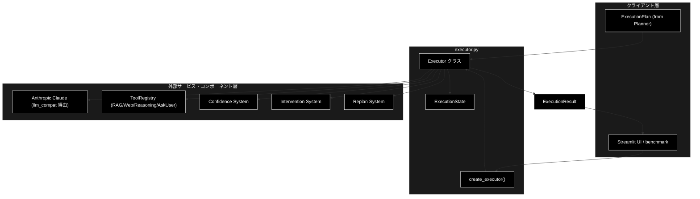
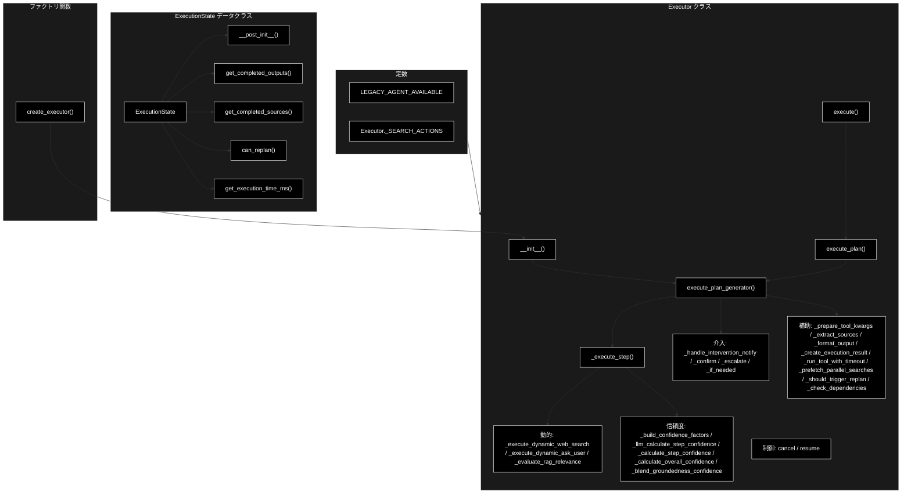
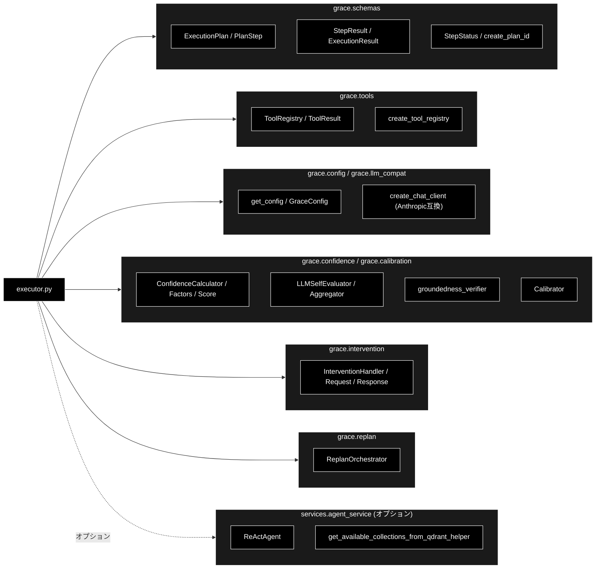
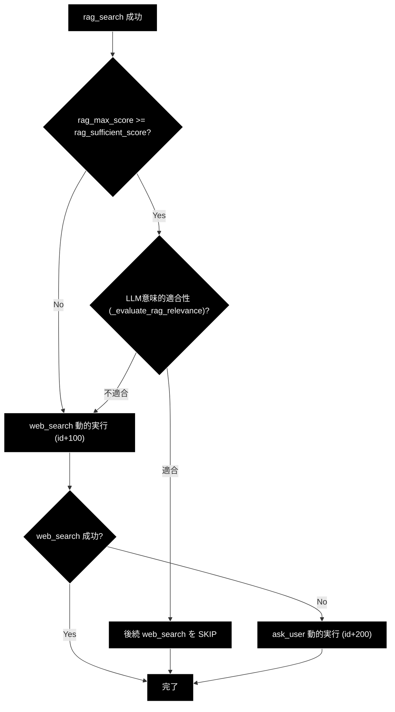
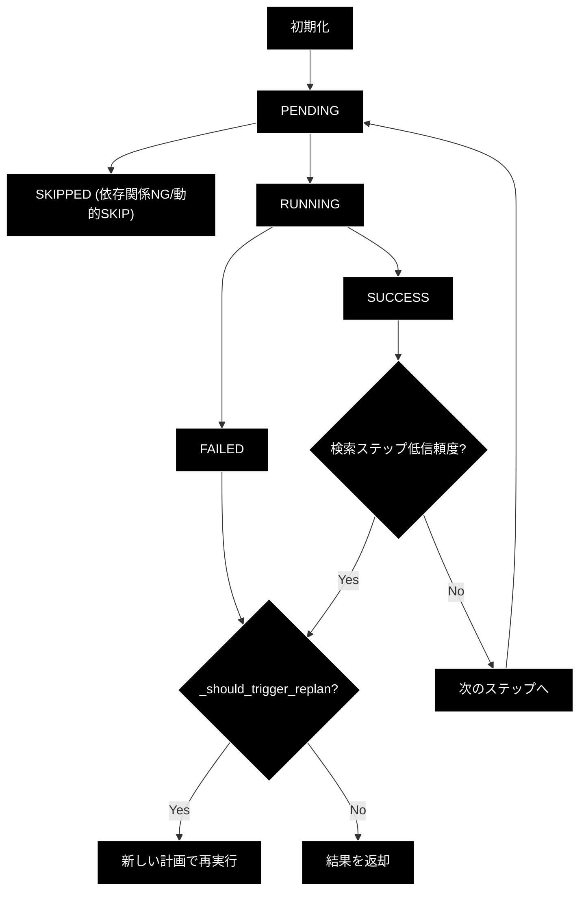

# executor.py - GRACE計画実行エージェント ドキュメント

**Version 4.0** | 最終更新: 2026-06-16

---

## 目次

1. [概要](#概要)
   - [主な責務](#主な責務)
   - [各責務対応のモジュール](#各責務対応のモジュール)
   - [主要機能一覧](#主要機能一覧)
2. [アーキテクチャ構成図](#1-アーキテクチャ構成図)
   - [システム全体構成](#11-システム全体構成)
   - [データフロー](#12-データフロー)
3. [モジュール構成図](#2-モジュール構成図)
   - [内部モジュール構成](#21-内部モジュール構成)
   - [外部依存関係](#22-外部依存関係)
   - [内部依存モジュール](#23-内部依存モジュール)
4. [クラス・関数一覧表](#3-クラス関数一覧表)
   - [クラス一覧](#31-クラス一覧)
   - [関数一覧（カテゴリ別）](#32-関数一覧カテゴリ別)
5. [クラス・関数 IPO詳細](#4-クラス関数-ipo詳細)
   - [ExecutionState データクラス](#41-executionstate-データクラス)
   - [Executor クラス](#42-executor-クラス)
   - [ファクトリ関数](#43-ファクトリ関数)
6. [設定・定数](#5-設定定数)
   - [モジュールレベル定数](#51-モジュールレベル定数)
   - [GraceConfigから使用される設定](#52-graceconfigから使用される設定)
7. [使用例](#6-使用例)
   - [基本的なワークフロー](#61-基本的なワークフロー)
   - [コールバック付きの使用](#62-コールバック付きの使用)
   - [ジェネレータ版の使用](#63-ジェネレータ版の使用)
8. [エクスポート](#7-エクスポート)
9. [変更履歴](#8-変更履歴)
10. [付録: 依存関係図](#付録-依存関係図)
11. [付録: 動的フォールバック連鎖](#付録-動的フォールバック連鎖)
12. [付録: ステータス遷移図](#付録-ステータス遷移図)

---

## 概要

`executor.py`は、GRACE（Guided Reasoning with Adaptive Confidence Execution）エージェントの計画実行コンポーネントです。Plannerが生成した`ExecutionPlan`を受け取り、各ステップを順次実行して結果を管理します。LLM呼び出しは`grace/llm_compat.py`の互換クライアント（`create_chat_client`）経由で Anthropic Claude（デフォルト `claude-sonnet-4-6`）に委譲され、Embedding は Gemini（`gemini-embedding-001`、3072次元）を継続利用します。

### 主な責務

- 計画の順次実行（ブロッキング版／ジェネレータ版）
- ステップ間の依存関係管理と検索ステップの並列プリフェッチ
- ツールの呼び出しと結果管理（ToolRegistry経由、timeout制御付き）
- RAG検索結果に基づく動的フォールバック連鎖（web_search／ask_user の動的挿入）
- 信頼度（Confidence）の計算と評価（LLM版／Heuristic版／groundedness較正）
- Human-in-the-Loop（HITL）介入処理（NOTIFY／CONFIRM／ESCALATE）
- 失敗時・低信頼度時のリプラン連携（ReplanOrchestrator）
- 実行状態の追跡とコールバック通知

### 各責務対応のモジュール

| # | 責務 | 対応モジュール | 説明 |
|---|------|--------------|------|
| 1 | 計画の順次実行 | `executor.py` | ブロッキング版（`execute_plan`）とジェネレータ版（`execute_plan_generator`）の2モード |
| 2 | ステップ間の依存関係管理と並列プリフェッチ | `executor.py` | `_check_dependencies`で依存確認、`_prefetch_parallel_searches`で同一ウェーブの検索を並列化 |
| 3 | ツールの呼び出しと結果管理 | `grace.tools` | ToolRegistryから取得したツールを`_execute_step`で実行（`_run_tool_with_timeout`でtimeout制御） |
| 4 | 動的フォールバック連鎖 | `executor.py` | `_evaluate_rag_relevance`／`_execute_dynamic_web_search`／`_execute_dynamic_ask_user` |
| 5 | 信頼度の計算と評価 | `grace.confidence` / `grace.calibration` | LLM版（`_llm_calculate_step_confidence`）・Heuristic版・groundedness ブレンド＋温度較正 |
| 6 | HITL介入処理 | `grace.intervention` | InterventionHandlerを通じてNOTIFY/CONFIRM/ESCALATEレベルの介入を処理 |
| 7 | 失敗時・低信頼度時のリプラン連携 | `grace.replan` | `_should_trigger_replan`の判定でReplanOrchestratorを起動 |
| 8 | 実行状態の追跡 | `executor.py` | ExecutionStateデータクラスで状態を管理、コールバックでUIに通知 |

### 主要機能一覧

| 機能 | 説明 |
|------|------|
| `ExecutionState` | 実行状態管理データクラス |
| `ExecutionState.__post_init__()` | 全ステップをPENDINGで初期化 |
| `ExecutionState.get_completed_outputs()` | 成功したステップの出力を取得 |
| `ExecutionState.get_completed_sources()` | 成功したステップのソースを取得 |
| `ExecutionState.can_replan()` | リプラン可能か判定 |
| `ExecutionState.get_execution_time_ms()` | 実行時間（ミリ秒）を取得 |
| `Executor` | 計画実行エージェントクラス |
| `Executor.__init__()` | コンストラクタ（各種コンポーネントの初期化） |
| `Executor.execute_plan_generator()` | 計画をジェネレータで実行（UI連携用） |
| `Executor.execute_plan()` | 計画を同期実行（ブロッキング版、ジェネレータをドレイン） |
| `Executor.execute()` | `execute_plan()` の統一エントリーポイント（benchmark互換） |
| `Executor._handle_ask_user_response()` | ask_user 出力をUIへ渡しユーザー応答を反映 |
| `Executor._run_tool_with_timeout()` | ツールを timeout_seconds 制限付きで実行 |
| `Executor._prefetch_parallel_searches()` | 依存関係のない後続検索ステップを並列プリフェッチ |
| `Executor._should_trigger_replan()` | リプランを発火すべきか判定 |
| `Executor._check_dependencies()` | ステップの依存関係を確認 |
| `Executor._execute_step()` | 個別ステップの実行（ジェネレータ対応） |
| `Executor._execute_legacy_agent_step()` | Legacy ReActAgentを使用したステップ実行 |
| `Executor._prepare_tool_kwargs()` | ツール実行引数の準備 |
| `Executor._evaluate_rag_relevance()` | LLMでRAG結果の意味的適合性を判定 |
| `Executor._execute_dynamic_web_search()` | web_search を動的挿入実行 |
| `Executor._execute_dynamic_ask_user()` | ask_user を動的挿入実行 |
| `Executor._execute_fallback()` | フォールバックアクションの実行 |
| `Executor._build_confidence_factors()` | ConfidenceFactors を構築（共通部） |
| `Executor._llm_calculate_step_confidence()` | LLMを使用したステップ信頼度計算 |
| `Executor._calculate_step_confidence()` | Heuristicベースのステップ信頼度計算 |
| `Executor._extract_sources()` | ツール結果からソースを抽出 |
| `Executor._format_output()` | 出力を文字列にフォーマット |
| `Executor._calculate_overall_confidence()` | 全体信頼度の計算（groundedness ブレンド＋較正） |
| `Executor._blend_groundedness_confidence()` | groundedness を主成分に最終 confidence を合成 |
| `Executor._create_execution_result()` | ExecutionResultを生成 |
| `Executor.cancel()` | 実行をキャンセル |
| `Executor.resume()` | 実行を再開 |
| `Executor._handle_intervention_notify()` | NOTIFYレベルの介入処理 |
| `Executor._handle_intervention_confirm()` | CONFIRMレベルの介入処理 |
| `Executor._handle_intervention_escalate()` | ESCALATEレベルの介入処理 |
| `Executor._handle_intervention_if_needed()` | 介入が必要か判定して処理 |
| `create_executor()` | Executorインスタンスを作成するファクトリ関数 |

---

## 1. アーキテクチャ構成図

### 1.1 システム全体構成



### 1.2 データフロー

1. Plannerから`ExecutionPlan`を受信
2. `ExecutionState`を初期化し、全ステップをPENDINGに設定（プリフェッチキャッシュもクリア）
3. 未完了ステップを順次実行（キャンセル／SKIP／依存関係を確認）
4. 検索系ステップは依存関係のない後続検索を並列プリフェッチ
5. ツールを呼び出し（timeout制御）、中間結果をyieldでUI通知
6. `rag_search`成功時はスコアとLLMの意味的適合性判定に基づき、必要なら`web_search`→`ask_user`を動的挿入
7. LLM版信頼度を計算（低スコア検索ステップはHeuristicと比較して高い方を採用）、必要に応じて介入を処理
8. ステップ失敗または検索ステップの低信頼度でリプランを実行（最大`replan.max_replans`回）
9. 全体信頼度を計算（groundedness を主成分にブレンド→温度較正）
10. `ExecutionResult`を生成して返却

---

## 2. モジュール構成図

### 2.1 内部モジュール構成



### 2.2 外部依存関係

| ライブラリ | バージョン | 用途 |
|-----------|-----------|------|
| `ast` | 標準ライブラリ | ask_user／reasoning出力の安全なパース（`literal_eval`） |
| `logging` | 標準ライブラリ | ログ出力 |
| `time` | 標準ライブラリ | 実行時間計測 |
| `dataclasses` | 標準ライブラリ | データクラス定義 |
| `enum` | 標準ライブラリ | 列挙型（Enum） |
| `concurrent.futures` | 標準ライブラリ | ツールtimeout制御・検索の並列プリフェッチ |

### 2.3 内部依存モジュール

| モジュール | 用途 |
|-----------|------|
| `grace.schemas` | ExecutionPlan, PlanStep, StepResult, ExecutionResult, StepStatus, create_plan_id |
| `grace.tools` | ToolRegistry, ToolResult, create_tool_registry |
| `grace.config` | get_config, GraceConfig（設定管理） |
| `grace.llm_compat` | create_chat_client（genai互換 Anthropic クライアント生成） |
| `grace.confidence` | ConfidenceCalculator, ConfidenceFactors, ConfidenceScore, LLMSelfEvaluator, ConfidenceAggregator, ActionDecision, InterventionLevel, および各 create_* ファクトリ（create_groundedness_verifier 等） |
| `grace.calibration` | Calibrator（confidence 温度較正） |
| `grace.intervention` | InterventionHandler, InterventionRequest, InterventionResponse, InterventionAction, create_intervention_handler |
| `grace.replan` | ReplanOrchestrator, create_replan_orchestrator |
| `services.agent_service` | ReActAgent, get_available_collections_from_qdrant_helper（オプション、Legacy Agent用） |

---

## 3. クラス・関数一覧表

### 3.1 クラス一覧

#### ExecutionState

| メソッド | 概要 |
|---------|------|
| `__post_init__()` | 全ステップをPENDINGで初期化 |
| `get_completed_outputs()` | 成功したステップの出力を取得 |
| `get_completed_sources()` | 成功したステップのソースを取得 |
| `can_replan()` | リプラン可能か判定 |
| `get_execution_time_ms()` | 実行時間（ミリ秒）を取得 |

#### Executor

| メソッド | 概要 |
|---------|------|
| `__init__(config, tool_registry, ...)` | コンストラクタ（各種コンポーネントの初期化） |
| `execute_plan_generator(plan, state)` | 計画をジェネレータで実行（UI連携用） |
| `execute_plan(plan)` | 計画を同期実行（ジェネレータをドレイン） |
| `execute(plan)` | `execute_plan()` の統一エントリーポイント |
| `_handle_ask_user_response(step, result, state)` | ask_user 応答をUI経由で反映 |
| `_run_tool_with_timeout(tool, kwargs, step)` | timeout_seconds 制限付きツール実行 |
| `_prefetch_parallel_searches(current_step, steps_to_execute, state)` | 後続検索の並列プリフェッチ |
| `_should_trigger_replan(step, result, state)` | リプラン発火判定 |
| `_check_dependencies(step, state)` | ステップの依存関係を確認 |
| `_execute_step(step, state)` | 個別ステップの実行（ジェネレータ対応） |
| `_execute_legacy_agent_step(step, state, start_time)` | Legacy ReActAgentを使用したステップ実行 |
| `_prepare_tool_kwargs(step, state)` | ツール実行引数の準備 |
| `_evaluate_rag_relevance(query, rag_output)` | LLMでRAG結果の意味的適合性を判定 |
| `_execute_dynamic_web_search(rag_step, state)` | web_search を動的挿入実行 |
| `_execute_dynamic_ask_user(rag_step, state)` | ask_user を動的挿入実行 |
| `_execute_fallback(step, state)` | フォールバックアクションの実行 |
| `_build_confidence_factors(tool_result, step, state)` | ConfidenceFactors の共通構築 |
| `_llm_calculate_step_confidence(tool_result, step, state)` | ステップ信頼度の計算（LLM版） |
| `_calculate_step_confidence(tool_result, step, state)` | ステップ信頼度の計算（Heuristic版） |
| `_extract_sources(tool_result)` | ツール結果からソースを抽出 |
| `_format_output(output)` | 出力を文字列にフォーマット |
| `_calculate_overall_confidence(state)` | 全体信頼度の計算 |
| `_blend_groundedness_confidence(query, final_answer, self_eval, coverage, aggregated, sources)` | groundedness を主成分に最終 confidence を合成 |
| `_create_execution_result(state)` | ExecutionResultを生成 |
| `cancel(state)` | 実行をキャンセル |
| `resume(state)` | 実行を再開 |
| `_handle_intervention_notify(message)` | NOTIFYレベルの介入処理 |
| `_handle_intervention_confirm(request)` | CONFIRMレベルの介入処理 |
| `_handle_intervention_escalate(request)` | ESCALATEレベルの介入処理 |
| `_handle_intervention_if_needed(action_decision, step, state)` | 介入が必要か判定して処理 |

### 3.2 関数一覧（カテゴリ別）

#### ファクトリ関数

| 関数名 | 概要 |
|-------|------|
| `create_executor(config, tool_registry, **kwargs)` | Executorインスタンスを作成 |

---

## 4. クラス・関数 IPO詳細

### 4.1 ExecutionState データクラス

**概要**: 実行状態管理データクラス。計画の実行状態、ステップ結果、信頼度、制御フラグなどを保持します。

#### フィールド一覧

| フィールド | 型 | デフォルト | 説明 |
|-----------|------|-----------|------|
| `plan` | ExecutionPlan | - | 実行中の計画 |
| `current_step_id` | int | 0 | 現在実行中のステップID |
| `step_results` | Dict[int, StepResult] | {} | ステップID → 結果のマッピング |
| `step_statuses` | Dict[int, StepStatus] | {} | ステップID → ステータスのマッピング |
| `overall_confidence` | float | 0.0 | 全体の信頼度スコア (0.0-1.0) |
| `is_cancelled` | bool | False | キャンセルフラグ |
| `is_paused` | bool | False | 一時停止フラグ |
| `intervention_request` | Optional[Any] | None | 保留中の介入リクエスト（InterventionRequest） |
| `replan_count` | int | 0 | リプラン実行回数 |
| `max_replans` | int | 3 | 最大リプラン回数 |
| `start_time` | Optional[float] | None | 実行開始時刻 |
| `end_time` | Optional[float] | None | 実行終了時刻 |

---

#### メソッド: `__post_init__`

**概要**: データクラス初期化後の処理。全ステップのステータスをPENDINGで初期化します。

```python
def __post_init__(self) -> None
```

| 項目 | 内容 |
|------|------|
| **Input** | なし（selfのみ） |
| **Process** | 計画内の全ステップのステータスを`StepStatus.PENDING`で初期化 |
| **Output** | なし（`self.step_statuses`が初期化された状態） |

**戻り値例**:
```python
None  # 副作用として self.step_statuses = {1: StepStatus.PENDING, ...}
```

```python
# 使用例
from grace.executor import ExecutionState
state = ExecutionState(plan=plan)  # __post_init__ が自動実行される
print(state.step_statuses)
# {1: <StepStatus.PENDING>, 2: <StepStatus.PENDING>}
```

---

#### メソッド: `get_completed_outputs`

**概要**: 成功したステップの出力を取得します。

```python
def get_completed_outputs(self) -> Dict[int, str]
```

| 項目 | 内容 |
|------|------|
| **Input** | なし（selfのみ） |
| **Process** | statusが"success"のステップの出力を抽出 |
| **Output** | `Dict[int, str]`: ステップID → 出力のマッピング |

**戻り値例**:
```python
{
    1: "検索結果: 『金色夜叉』は尾崎紅葉の作品です...",
    2: "尾崎紅葉は明治時代の小説家で..."
}
```

```python
# 使用例
outputs = state.get_completed_outputs()
for step_id, text in outputs.items():
    print(f"Step {step_id}: {text[:30]}")
```

---

#### メソッド: `get_completed_sources`

**概要**: 成功したステップのソースを取得します。

```python
def get_completed_sources(self) -> List[str]
```

| 項目 | 内容 |
|------|------|
| **Input** | なし（selfのみ） |
| **Process** | statusが"success"でsourcesが存在するステップからソースを収集 |
| **Output** | `List[str]`: ソースURLや参照のリスト |

**戻り値例**:
```python
["wikipedia_ja:尾崎紅葉", "wikipedia_ja:金色夜叉"]
```

```python
# 使用例
sources = state.get_completed_sources()
print(f"参照ソース数: {len(sources)}")
```

---

#### メソッド: `can_replan`

**概要**: リプラン可能か判定します。

```python
def can_replan(self) -> bool
```

| 項目 | 内容 |
|------|------|
| **Input** | なし（selfのみ） |
| **Process** | リプラン回数が上限未満（`replan_count < max_replans`）かつキャンセルされていないか確認 |
| **Output** | `bool`: リプラン可能ならTrue |

**戻り値例**:
```python
True
```

```python
# 使用例
if state.can_replan():
    print("リプラン可能")
```

---

#### メソッド: `get_execution_time_ms`

**概要**: 実行時間をミリ秒で取得します。

```python
def get_execution_time_ms(self) -> Optional[int]
```

| 項目 | 内容 |
|------|------|
| **Input** | なし（selfのみ） |
| **Process** | start_timeからend_time（またはcurrent time）までの経過時間を計算 |
| **Output** | `Optional[int]`: 実行時間（ミリ秒）、start_timeがNoneの場合はNone |

**戻り値例**:
```python
1234  # 1.234秒
```

```python
# 使用例
ms = state.get_execution_time_ms()
print(f"実行時間: {ms}ms" if ms is not None else "未開始")
```

---

### 4.2 Executor クラス

**概要**: 計画実行エージェント（GRACEネイティブ実装）。ToolRegistry、Confidence／Calibration、Intervention、Replanの各システムを統合して計画を実行します。

#### コンストラクタ: `__init__`

**概要**: Executorインスタンスを初期化します。設定、ToolRegistry、各種Confidenceコンポーネント（groundedness検証器・Calibratorを含む）、コールバック、InterventionHandler、ReplanOrchestratorを設定します。

```python
def __init__(
    self,
    config: Optional[GraceConfig] = None,
    tool_registry: Optional[ToolRegistry] = None,
    on_step_start: Optional[Callable[[PlanStep], None]] = None,
    on_step_complete: Optional[Callable[[StepResult], None]] = None,
    on_intervention_required: Optional[Callable[[str, Dict], Any]] = None,
    on_confidence_update: Optional[Callable[[ConfidenceScore, ActionDecision], None]] = None,
    on_replan: Optional[Callable[[str, int], None]] = None,
    replan_orchestrator: Optional[ReplanOrchestrator] = None,
    enable_replan: bool = True,
)
```

| パラメータ | 型 | デフォルト | 説明 |
|------------|------|-----------|------|
| `config` | Optional[GraceConfig] | None | GRACE設定（Noneの場合は`get_config()`） |
| `tool_registry` | Optional[ToolRegistry] | None | ツールレジストリ（Noneの場合はデフォルト作成） |
| `on_step_start` | Optional[Callable[[PlanStep], None]] | None | ステップ開始時コールバック |
| `on_step_complete` | Optional[Callable[[StepResult], None]] | None | ステップ完了時コールバック |
| `on_intervention_required` | Optional[Callable[[str, Dict], Any]] | None | 介入要求時コールバック |
| `on_confidence_update` | Optional[Callable[[ConfidenceScore, ActionDecision], None]] | None | 信頼度更新時コールバック |
| `on_replan` | Optional[Callable[[str, int], None]] | None | リプラン発生時コールバック |
| `replan_orchestrator` | Optional[ReplanOrchestrator] | None | リプランオーケストレーター（明示指定） |
| `enable_replan` | bool | True | リプラン機能の有効/無効 |

| 項目 | 内容 |
|------|------|
| **Input** | 上記パラメータ |
| **Process** | 1. 設定の取得（`config or get_config()`）<br>2. ToolRegistryの初期化（`create_tool_registry`）<br>3. Confidenceコンポーネント初期化（calculator/llm_evaluator/query_coverage/aggregator/groundedness_verifier）<br>4. Calibratorをcalibration_pathからロード（無ければ恒等T=1.0）<br>5. コールバック5種を設定<br>6. InterventionHandler初期化（notify/confirm/escalateコールバック付き）<br>7. ReplanOrchestrator初期化（指定／enable_replan時に自動生成／無効の3パターン）<br>8. `step_confidence_scores`・`_prefetched_tool_results`辞書を初期化 |
| **Output** | Executorインスタンス |

**戻り値例**:
```python
<grace.executor.Executor object at 0x...>
```

```python
# 使用例
from grace.executor import Executor
from grace.config import get_config

executor = Executor()                       # デフォルト設定
config = get_config("config/custom.yml")
executor = Executor(config=config, enable_replan=False)  # リプラン無効
```

---

#### メソッド: `execute_plan_generator`

**概要**: 計画をジェネレータで実行します（UI連携用）。各ステップ完了後に状態をyieldし、リアルタイム表示を可能にします。CONFIRM/ESCALATE介入時は一時停止状態をyieldして`ExecutionResult`をreturnします。

```python
def execute_plan_generator(
    self,
    plan: ExecutionPlan,
    state: Optional[ExecutionState] = None
) -> Generator[ExecutionState, None, ExecutionResult]
```

| パラメータ | 型 | デフォルト | 説明 |
|------------|------|-----------|------|
| `plan` | ExecutionPlan | - | 実行する計画 |
| `state` | Optional[ExecutionState] | None | 既存の状態（再開時に指定） |

| 項目 | 内容 |
|------|------|
| **Input** | `plan: ExecutionPlan`, `state: Optional[ExecutionState] = None` |
| **Process** | 1. 計画内容をログ出力<br>2. ExecutionState初期化（未指定時、プリフェッチキャッシュもクリア）<br>3. 未完了ステップのリストを取得<br>4. 各ステップを順次実行（キャンセル／SKIP／依存関係チェック → 並列プリフェッチ → `_execute_step`）<br>5. Generatorの場合は`yield from`で中間イベントを中継<br>6. `rag_search`成功時はスコアと`_evaluate_rag_relevance`で動的にweb_search/ask_userを挿入、十分なら後続web_searchをSKIP<br>7. CONFIRM/ESCALATE介入時はInterventionRequestを作成し、一時停止状態をyield後にreturn<br>8. `_should_trigger_replan`判定でReplanOrchestratorを起動し再帰的にyield from<br>9. 全体信頼度を計算しExecutionResultをreturn<br>10. 例外時はoverall_status="failed"の結果をreturn |
| **Output** | `Generator[ExecutionState, None, ExecutionResult]`<br>- Yields: 各ステップ完了後の`ExecutionState`<br>- Returns: 最終`ExecutionResult` |

**戻り値例**:
```python
# yield される値
ExecutionState(current_step_id=2, step_results={1: StepResult(...)}, ...)
# StopIteration.value として返る最終値
ExecutionResult(plan_id="plan_...", overall_status="success", overall_confidence=0.85, ...)
```

```python
# 使用例
generator = executor.execute_plan_generator(plan)
try:
    while True:
        state = next(generator)
        print(f"現在のステップ: {state.current_step_id}")
        if state.is_paused and state.intervention_request:
            handle_intervention(state.intervention_request)
            state.is_paused = False
except StopIteration as e:
    result = e.value
    print(f"完了: {result.overall_status}")
```

---

#### メソッド: `execute_plan`

**概要**: 計画を同期実行します（ブロッキング版）。`execute_plan_generator()`をドレインする薄いラッパーで、動的web_search・フォールバック連鎖・介入・SKIP処理を含めジェネレータ版と完全に同一のロジックで実行されます。

```python
def execute_plan(self, plan: ExecutionPlan) -> ExecutionResult
```

| パラメータ | 型 | デフォルト | 説明 |
|------------|------|-----------|------|
| `plan` | ExecutionPlan | - | 実行する計画 |

| 項目 | 内容 |
|------|------|
| **Input** | `plan: ExecutionPlan` |
| **Process** | 1. `execute_plan_generator(plan)`を取得<br>2. `next()`でドレイン（中間logイベントはログ出力のみ）<br>3. `StopIteration.value`から最終結果を取得 |
| **Output** | `ExecutionResult`: 実行結果 |

**戻り値例**:
```python
ExecutionResult(
    plan_id="plan_20260616_123456_abc123",
    original_query="『金色夜叉』の作者は誰ですか？",
    final_answer="『金色夜叉』の作者は尾崎紅葉です。",
    step_results=[...],
    overall_confidence=0.85,
    overall_status="success",
    replan_count=0,
    total_execution_time_ms=1234,
)
```

```python
# 使用例
from grace.executor import create_executor
executor = create_executor()
result = executor.execute_plan(plan)
print(f"{result.overall_status}: {result.final_answer}")
```

---

#### メソッド: `execute`

**概要**: `execute_plan()`の統一エントリーポイント（benchmark.py 互換）。

```python
def execute(self, plan: ExecutionPlan) -> ExecutionResult
```

| パラメータ | 型 | デフォルト | 説明 |
|------------|------|-----------|------|
| `plan` | ExecutionPlan | - | 実行する計画 |

| 項目 | 内容 |
|------|------|
| **Input** | `plan: ExecutionPlan` |
| **Process** | `execute_plan(plan)`に委譲 |
| **Output** | `ExecutionResult`: 実行結果 |

**戻り値例**:
```python
ExecutionResult(plan_id="plan_...", overall_status="success", ...)
```

```python
# 使用例
result = executor.execute(plan)  # execute_plan と同義
```

---

#### メソッド: `_handle_ask_user_response`

**概要**: ask_userステップの出力をUIコールバックへ渡し、ユーザー応答を結果へ反映します。旧実装の`eval()`を排し`ast.literal_eval`で安全にパースします。

```python
def _handle_ask_user_response(
    self, step: PlanStep, result: StepResult, state: ExecutionState
) -> None
```

| パラメータ | 型 | デフォルト | 説明 |
|------------|------|-----------|------|
| `step` | PlanStep | - | ask_userステップ |
| `result` | StepResult | - | ステップ結果 |
| `state` | ExecutionState | - | 現在の実行状態 |

| 項目 | 内容 |
|------|------|
| **Input** | `step: PlanStep`, `result: StepResult`, `state: ExecutionState` |
| **Process** | 1. `on_intervention_required`が無ければ即return<br>2. 出力をdict/str/その他に応じて`ast.literal_eval`で安全にパース<br>3. `on_intervention_required("ask_user", data)`でユーザー応答取得<br>4. 応答があれば`result.output`を更新し`state.step_results`へ反映 |
| **Output** | なし（`state`を更新） |

**戻り値例**:
```python
None  # 副作用: result.output = "ユーザー応答: ..."
```

```python
# 使用例（内部呼び出し）
self._handle_ask_user_response(step, result, state)
```

---

#### メソッド: `_run_tool_with_timeout`

**概要**: ツールを`timeout_seconds`制限付きで実行します。タイムアウト時は`TimeoutError`を送出します（実行中スレッドは中断できずバックグラウンドで放置）。

```python
def _run_tool_with_timeout(
    self, tool: Any, kwargs: Dict[str, Any], step: PlanStep
) -> ToolResult
```

| パラメータ | 型 | デフォルト | 説明 |
|------------|------|-----------|------|
| `tool` | Any | - | 実行するツール |
| `kwargs` | Dict[str, Any] | - | ツール実行引数 |
| `step` | PlanStep | - | 実行ステップ（timeout_secondsを参照） |

| 項目 | 内容 |
|------|------|
| **Input** | `tool: Any`, `kwargs: Dict[str, Any]`, `step: PlanStep` |
| **Process** | 1. `step.timeout_seconds`が無ければ`tool.execute(**kwargs)`を直接実行<br>2. ある場合は`ThreadPoolExecutor`でsubmitし`future.result(timeout=...)`で待機<br>3. タイムアウト時は`TimeoutError`を送出 |
| **Output** | `ToolResult`: ツール実行結果 |

**戻り値例**:
```python
ToolResult(success=True, output=[...], confidence_factors={...})
```

```python
# 使用例（内部呼び出し）
tool_result = self._run_tool_with_timeout(tool, kwargs, step)
```

---

#### メソッド: `_prefetch_parallel_searches`

**概要**: 現在のステップと依存関係のない後続検索ステップ（同一ウェーブ）を並列に先行実行し、結果を`_prefetched_tool_results`にキャッシュします。例外もキャッシュされ消費時に再送出されます。

```python
def _prefetch_parallel_searches(
    self,
    current_step: PlanStep,
    steps_to_execute: List[PlanStep],
    state: ExecutionState
) -> None
```

| パラメータ | 型 | デフォルト | 説明 |
|------------|------|-----------|------|
| `current_step` | PlanStep | - | 現在のステップ |
| `steps_to_execute` | List[PlanStep] | - | 実行待ちステップのリスト |
| `state` | ExecutionState | - | 現在の実行状態 |

| 項目 | 内容 |
|------|------|
| **Input** | `current_step: PlanStep`, `steps_to_execute: List[PlanStep]`, `state: ExecutionState` |
| **Process** | 1. `config.executor.parallel_search`が無効、または検索系アクションでない、または既プリフェッチ済みなら何もしない<br>2. 同一ウェーブの検索ステップ（依存が未完了でない）を`max_parallel_steps`まで収集<br>3. バッチが2未満なら何もしない<br>4. `ThreadPoolExecutor`で各ツールを並列submit<br>5. 結果（または例外）を`_prefetched_tool_results[step_id]`へ格納 |
| **Output** | なし（`_prefetched_tool_results`を更新） |

**戻り値例**:
```python
None  # 副作用: self._prefetched_tool_results = {3: ToolResult(...), ...}
```

```python
# 使用例（内部呼び出し）
self._prefetch_parallel_searches(step, steps_to_execute, state)
```

---

#### メソッド: `_should_trigger_replan`

**概要**: リプランを発火すべきか判定します。ステップ失敗時は常に対象、低信頼度は検索系ステップのみ対象、上限超過時は発火しません。

```python
def _should_trigger_replan(
    self, step: PlanStep, result: StepResult, state: ExecutionState
) -> bool
```

| パラメータ | 型 | デフォルト | 説明 |
|------------|------|-----------|------|
| `step` | PlanStep | - | 実行ステップ |
| `result` | StepResult | - | ステップ結果 |
| `state` | ExecutionState | - | 現在の実行状態 |

| 項目 | 内容 |
|------|------|
| **Input** | `step: PlanStep`, `result: StepResult`, `state: ExecutionState` |
| **Process** | 1. `replan_orchestrator`が無い／`state.can_replan()`がFalseならFalse<br>2. `result.status == "failed"`ならTrue<br>3. 検索系ステップ（rag_search/web_search）かつ`result.confidence < config.replan.confidence_threshold`ならTrue |
| **Output** | `bool`: リプランを発火すべきならTrue |

**戻り値例**:
```python
True
```

```python
# 使用例（内部呼び出し）
if self._should_trigger_replan(step, result, state):
    ...
```

---

#### メソッド: `_check_dependencies`

**概要**: ステップの依存関係を確認します。依存するステップが全て完了し、失敗していないことを確認します。

```python
def _check_dependencies(self, step: PlanStep, state: ExecutionState) -> bool
```

| パラメータ | 型 | デフォルト | 説明 |
|------------|------|-----------|------|
| `step` | PlanStep | - | 確認するステップ |
| `state` | ExecutionState | - | 現在の実行状態 |

| 項目 | 内容 |
|------|------|
| **Input** | `step: PlanStep`, `state: ExecutionState` |
| **Process** | `depends_on`の各ステップIDが`step_results`に存在し、statusが"failed"でないことを確認 |
| **Output** | `bool`: 依存関係が満たされていればTrue |

**戻り値例**:
```python
True
```

```python
# 使用例（内部呼び出し）
if not self._check_dependencies(step, state):
    state.step_statuses[step.step_id] = StepStatus.SKIPPED
```

---

#### メソッド: `_execute_step`

**概要**: 個別ステップを実行します。ツールを取得し、引数を準備して（プリフェッチ結果があれば消費、無ければtimeout付き）実行、中間結果をyieldで通知した後、信頼度を計算してStepResultを返します。`run_legacy_agent`は`_execute_legacy_agent_step`に委譲します。

```python
def _execute_step(self, step: PlanStep, state: ExecutionState) -> Any
```

| パラメータ | 型 | デフォルト | 説明 |
|------------|------|-----------|------|
| `step` | PlanStep | - | 実行するステップ |
| `state` | ExecutionState | - | 現在の実行状態 |

| 項目 | 内容 |
|------|------|
| **Input** | `step: PlanStep`, `state: ExecutionState` |
| **Process** | 1. ToolRegistryからツールを取得<br>2. ツール無し＋`run_legacy_agent`なら`_execute_legacy_agent_step`に委譲<br>3. ツール無しなら`ValueError`<br>4. `_prepare_tool_kwargs`で引数準備<br>5. プリフェッチ結果を消費（例外は再送出）、無ければ`_run_tool_with_timeout`で実行<br>6. 成功時は中間結果をyieldで通知（IPO風ラベル）<br>7. `_llm_calculate_step_confidence`で信頼度計算<br>8. `_extract_sources`でソース抽出<br>9. StepResultを構築してreturn<br>10. 例外時は`step.fallback`があれば`_execute_fallback`、失敗結果をreturn |
| **Output** | `Any`: `StepResult` または `Generator[Any, None, StepResult]` |

**戻り値例**:
```python
StepResult(step_id=1, status="success", output="...", confidence=0.82, sources=[...])
```

```python
# 使用例（内部呼び出し）
step_execution = self._execute_step(step, state)
result = (yield from step_execution) if isinstance(step_execution, Generator) else step_execution
```

---

#### メソッド: `_execute_legacy_agent_step`

**概要**: Legacy ReActAgentを使用したステップ実行（ジェネレータ版）。コレクション準備、Agent初期化、ストリーミング実行を行い結果を構築します。

```python
def _execute_legacy_agent_step(
    self, step: PlanStep, state: ExecutionState, start_time: float
) -> Generator[Any, None, StepResult]
```

| パラメータ | 型 | デフォルト | 説明 |
|------------|------|-----------|------|
| `step` | PlanStep | - | 実行するステップ |
| `state` | ExecutionState | - | 現在の実行状態 |
| `start_time` | float | - | ステップ開始時刻 |

| 項目 | 内容 |
|------|------|
| **Input** | `step: PlanStep`, `state: ExecutionState`, `start_time: float` |
| **Process** | 1. `LEGACY_AGENT_AVAILABLE`が偽なら`ImportError`<br>2. Qdrantからコレクション取得（失敗時は`config.qdrant.search_priority`）<br>3. ReActAgentを`config.llm.model`で初期化<br>4. `execute_turn`でストリーミング実行し各イベントをyield中継、"Source:"パターンでソース抽出<br>5. 簡易Confidence計算（回答あり=0.8／謝罪含む=0.3）<br>6. ConfidenceScoreを保存しコールバック通知<br>7. StepResultを構築してreturn |
| **Output** | `Generator[Any, None, StepResult]` |

**戻り値例**:
```python
StepResult(step_id=1, status="success", output="...", confidence=0.8, sources=["faq.csv"])
```

```python
# 使用例（内部呼び出し）
result = yield from self._execute_legacy_agent_step(step, state, start_time)
```

---

#### メソッド: `_prepare_tool_kwargs`

**概要**: ツール実行引数を準備します。アクションタイプに応じてRAG検索のcollection、web_searchのnum_results/language、reasoningのcontext/sources、ask_userの質問構成を行います。

```python
def _prepare_tool_kwargs(self, step: PlanStep, state: ExecutionState) -> Dict[str, Any]
```

| パラメータ | 型 | デフォルト | 説明 |
|------------|------|-----------|------|
| `step` | PlanStep | - | 実行するステップ |
| `state` | ExecutionState | - | 現在の実行状態 |

| 項目 | 内容 |
|------|------|
| **Input** | `step: PlanStep`, `state: ExecutionState` |
| **Process** | 1. 基本引数`query`を設定<br>2. `rag_search`: collection追加<br>3. `web_search`: num_results/language追加（config.web_searchから）<br>4. `reasoning`: 全成功ステップの結果をパースしcontext/sourcesとして追加<br>5. `ask_user`: question/reason/urgency追加 |
| **Output** | `Dict[str, Any]`: ツール実行引数 |

**戻り値例**:
```python
{"query": "金色夜叉の作者", "collection": "wikipedia_ja"}
```

```python
# 使用例（内部呼び出し）
kwargs = self._prepare_tool_kwargs(step, state)
```

---

#### メソッド: `_evaluate_rag_relevance`

**概要**: LLM（`llm_compat`経由の Anthropic Claude）を使用してRAG検索結果がユーザーの質問に意味的に適合しているかを判定します。コサイン類似度では捉えられない主題のズレを検出します。

```python
def _evaluate_rag_relevance(self, query: str, rag_output: str) -> bool
```

| パラメータ | 型 | デフォルト | 説明 |
|------------|------|-----------|------|
| `query` | str | - | ユーザーの元の質問文 |
| `rag_output` | str | - | RAG検索結果の出力文字列 |

| 項目 | 内容 |
|------|------|
| **Input** | `query: str`, `rag_output: str` |
| **Process** | 1. 適合性判定プロンプトを構築（検索結果は先頭500文字）<br>2. `create_chat_client(config)`でクライアント生成<br>3. `client.models.generate_content`でLLM応答取得（temperature=0.0, max_output_tokens=256）<br>4. 応答に"YES"が含まれればTrue<br>5. 空応答・例外時はTrue（既存動作維持） |
| **Output** | `bool`: 適合していればTrue |

**戻り値例**:
```python
True
```

```python
# 使用例（内部呼び出し）
is_relevant = self._evaluate_rag_relevance(query=step.query, rag_output=result.output)
```

---

#### メソッド: `_execute_dynamic_web_search`

**概要**: RAGスコア不足または意味的不適合時に`web_search`を動的に実行します（step_id+100で挿入、timeout短め）。

```python
def _execute_dynamic_web_search(self, rag_step: PlanStep, state: ExecutionState) -> Generator
```

| パラメータ | 型 | デフォルト | 説明 |
|------------|------|-----------|------|
| `rag_step` | PlanStep | - | 直前のrag_searchステップ |
| `state` | ExecutionState | - | 現在の実行状態 |

| 項目 | 内容 |
|------|------|
| **Input** | `rag_step: PlanStep`, `state: ExecutionState` |
| **Process** | 1. step_id+100の動的web_searchステップを生成（timeout_seconds=15）<br>2. ステータスをRUNNINGにしコールバック通知<br>3. `_execute_step`で実行（Generatorはyield from中継）<br>4. 結果を保存しstateをyield<br>5. 例外時は失敗StepResultを保存 |
| **Output** | `Generator`（return値は `StepResult` または `None`） |

**戻り値例**:
```python
StepResult(step_id=103, status="success", output="Web検索結果...", confidence=0.7)
```

```python
# 使用例（内部呼び出し）
web_result = yield from self._execute_dynamic_web_search(step, state)
```

---

#### メソッド: `_execute_dynamic_ask_user`

**概要**: RAG・Web検索の両方が不十分な場合に`ask_user`を動的に実行します（step_id+200で挿入）。

```python
def _execute_dynamic_ask_user(self, rag_step: PlanStep, state: ExecutionState) -> Generator
```

| パラメータ | 型 | デフォルト | 説明 |
|------------|------|-----------|------|
| `rag_step` | PlanStep | - | 元のrag_searchステップ |
| `state` | ExecutionState | - | 現在の実行状態 |

| 項目 | 内容 |
|------|------|
| **Input** | `rag_step: PlanStep`, `state: ExecutionState` |
| **Process** | 1. step_id+200の動的ask_userステップを生成（確認文を構築）<br>2. ステータスをRUNNINGにしコールバック通知<br>3. `_execute_step`で実行（Generatorはyield from中継）<br>4. 結果を保存しstateをyield<br>5. 例外時もstateをyield |
| **Output** | `Generator`（return値なし） |

**戻り値例**:
```python
# yield される値
ExecutionState(current_step_id=203, ...)
```

```python
# 使用例（内部呼び出し）
yield from self._execute_dynamic_ask_user(step, state)
```

---

#### メソッド: `_execute_fallback`

**概要**: フォールバックアクションを実行します。元のステップの`fallback`で指定されたアクションで代替ステップを作成し実行します（二重フォールバックは無効）。

```python
def _execute_fallback(self, step: PlanStep, state: ExecutionState) -> StepResult
```

| パラメータ | 型 | デフォルト | 説明 |
|------------|------|-----------|------|
| `step` | PlanStep | - | 失敗した元のステップ |
| `state` | ExecutionState | - | 現在の実行状態 |

| 項目 | 内容 |
|------|------|
| **Input** | `step: PlanStep`, `state: ExecutionState` |
| **Process** | 1. `step.fallback`をアクションとするPlanStepを作成（fallback=None）<br>2. `_execute_step`で実行（Generatorは最後まで消費しreturn値を取得） |
| **Output** | `StepResult`: フォールバック実行結果 |

**戻り値例**:
```python
StepResult(step_id=2, status="success", output="...", confidence=0.6)
```

```python
# 使用例（内部呼び出し）
fallback_result = self._execute_fallback(step, state)
```

---

#### メソッド: `_build_confidence_factors`

**概要**: ツール結果とステップ情報から`ConfidenceFactors`を構築する共通ヘルパー。source_count／source_agreementの算出、非検索ステップでの依存元スコア継承を含みます。

```python
def _build_confidence_factors(
    self, tool_result: ToolResult, step: PlanStep, state: ExecutionState
) -> ConfidenceFactors
```

| パラメータ | 型 | デフォルト | 説明 |
|------------|------|-----------|------|
| `tool_result` | ToolResult | - | ツール実行結果 |
| `step` | PlanStep | - | 実行ステップ |
| `state` | ExecutionState | - | 現在の実行状態 |

| 項目 | 内容 |
|------|------|
| **Input** | `tool_result: ToolResult`, `step: PlanStep`, `state: ExecutionState` |
| **Process** | 1. source_count決定（ツール明示値優先）<br>2. 2ソース以上ならSourceAgreementCalculatorでsource_agreement算出（失敗時0.5）<br>3. 非検索ステップかつresult_count=0なら依存元の最大confidenceを継承<br>4. ConfidenceFactorsを構築して返却 |
| **Output** | `ConfidenceFactors`: 構築された信頼度ファクター |

**戻り値例**:
```python
ConfidenceFactors(search_result_count=5, search_max_score=0.82, source_count=3,
                  source_agreement=0.9, tool_success_rate=1.0, is_search_step=True)
```

```python
# 使用例（内部呼び出し）
factors = self._build_confidence_factors(tool_result, step, state)
```

---

#### メソッド: `_llm_calculate_step_confidence`

**概要**: LLMを使用したステップ信頼度の計算。`_build_confidence_factors`でファクターを構築し`ConfidenceCalculator.llm_calculate`で評価、低スコア検索ステップはHeuristicと比較して高い方を採用します。

```python
def _llm_calculate_step_confidence(
    self, tool_result: ToolResult, step: PlanStep, state: ExecutionState
) -> float
```

| パラメータ | 型 | デフォルト | 説明 |
|------------|------|-----------|------|
| `tool_result` | ToolResult | - | ツール実行結果 |
| `step` | PlanStep | - | 実行したステップ |
| `state` | ExecutionState | - | 現在の実行状態 |

| 項目 | 内容 |
|------|------|
| **Input** | `tool_result: ToolResult`, `step: PlanStep`, `state: ExecutionState` |
| **Process** | 1. 失敗時は0.0<br>2. `_build_confidence_factors`でファクター構築<br>3. `confidence_calculator.llm_calculate`でLLM評価<br>4. スコア<0.6かつ検索ステップなら`calculate`（Heuristic）と比較し高い方を採用<br>5. 例外時はHeuristicにフォールバック<br>6. ConfidenceScoreを保存しActionDecisionをコールバック通知 |
| **Output** | `float`: 信頼度スコア (0.0-1.0) |

**戻り値例**:
```python
0.82
```

```python
# 使用例（内部呼び出し）
confidence = self._llm_calculate_step_confidence(tool_result, step, state)
```

---

#### メソッド: `_calculate_step_confidence`

**概要**: Heuristicベースのステップ信頼度計算。`_llm_calculate_step_confidence`のフォールバック相当版。ConfidenceFactorsを構築し`ConfidenceCalculator.calculate`で評価します。

```python
def _calculate_step_confidence(
    self, tool_result: ToolResult, step: PlanStep, state: ExecutionState
) -> float
```

| パラメータ | 型 | デフォルト | 説明 |
|------------|------|-----------|------|
| `tool_result` | ToolResult | - | ツール実行結果 |
| `step` | PlanStep | - | 実行したステップ |
| `state` | ExecutionState | - | 現在の実行状態 |

| 項目 | 内容 |
|------|------|
| **Input** | `tool_result: ToolResult`, `step: PlanStep`, `state: ExecutionState` |
| **Process** | source_count/source_agreement算出、依存元スコア継承を行いConfidenceFactorsを構築後、`confidence_calculator.calculate`（Heuristic版）で計算しConfidenceScoreを保存・通知 |
| **Output** | `float`: 信頼度スコア (0.0-1.0) |

**戻り値例**:
```python
0.75
```

```python
# 使用例（内部呼び出し）
confidence = self._calculate_step_confidence(tool_result, step, state)
```

---

#### メソッド: `_extract_sources`

**概要**: ツール結果からソースを抽出します。

```python
def _extract_sources(self, tool_result: ToolResult) -> List[str]
```

| パラメータ | 型 | デフォルト | 説明 |
|------------|------|-----------|------|
| `tool_result` | ToolResult | - | ツール実行結果 |

| 項目 | 内容 |
|------|------|
| **Input** | `tool_result: ToolResult` |
| **Process** | outputがlistの場合、各itemの`payload.source`を抽出（重複排除） |
| **Output** | `List[str]`: ソース名のリスト |

**戻り値例**:
```python
["wikipedia_ja:尾崎紅葉", "wikipedia_ja:金色夜叉"]
```

```python
# 使用例（内部呼び出し）
sources = self._extract_sources(tool_result)
```

---

#### メソッド: `_format_output`

**概要**: 出力を文字列にフォーマットします。

```python
def _format_output(self, output: Any) -> Optional[str]
```

| パラメータ | 型 | デフォルト | 説明 |
|------------|------|-----------|------|
| `output` | Any | - | フォーマットする出力 |

| 項目 | 内容 |
|------|------|
| **Input** | `output: Any` |
| **Process** | None→None、str→そのまま、dict→str()、list→dict要素はstr()/それ以外はjoin |
| **Output** | `Optional[str]`: フォーマットされた文字列 |

**戻り値例**:
```python
"[{'payload': {...}}, {'payload': {...}}]"
```

```python
# 使用例（内部呼び出し）
text = self._format_output(tool_result.output)
```

---

#### メソッド: `_calculate_overall_confidence`

**概要**: 全体の信頼度を計算します。各ステップのConfidenceScoreと最終回答のLLM自己評価＋クエリ網羅度（`evaluate_final`で統合）を集約し、groundednessブレンドと温度較正を適用します。

```python
def _calculate_overall_confidence(self, state: ExecutionState) -> float
```

| パラメータ | 型 | デフォルト | 説明 |
|------------|------|-----------|------|
| `state` | ExecutionState | - | 最終実行状態 |

| 項目 | 内容 |
|------|------|
| **Input** | `state: ExecutionState` |
| **Process** | 1. 各ステップのConfidenceScoreを収集<br>2. 最終回答（最後のreasoning/run_legacy_agent成功出力）を取得<br>3. `llm_evaluator.evaluate_final`で自己評価＋網羅度を1回で評価しbreakdownに反映<br>4. ConfidenceAggregatorで重み付き集約（補助スコア）<br>5. `_blend_groundedness_confidence`でgroundednessを主成分にブレンド<br>6. Calibratorで温度較正し0.0-1.0にクリップ・丸め |
| **Output** | `float`: 全体信頼度スコア (0.0-1.0) |

**戻り値例**:
```python
0.85
```

```python
# 使用例（内部呼び出し）
state.overall_confidence = self._calculate_overall_confidence(state)
```

---

#### メソッド: `_blend_groundedness_confidence`

**概要**: groundedness（支持率）を主成分に最終confidenceを合成します。未検証時は self_eval/coverage/aggregated の従来ブレンドにフォールバックし、矛盾検出時は強く減点します。

```python
def _blend_groundedness_confidence(
    self,
    query: str,
    final_answer: Optional[str],
    self_eval: Optional[float],
    coverage: Optional[float],
    aggregated: float,
    sources: List[str],
) -> float
```

| パラメータ | 型 | デフォルト | 説明 |
|------------|------|-----------|------|
| `query` | str | - | 元のユーザークエリ |
| `final_answer` | Optional[str] | - | 最終回答 |
| `self_eval` | Optional[float] | - | 自己評価スコア |
| `coverage` | Optional[float] | - | クエリ網羅度スコア |
| `aggregated` | float | - | 検索ベース集約スコア（補助項） |
| `sources` | List[str] | - | 完了ソースのリスト |

| 項目 | 内容 |
|------|------|
| **Input** | `query`, `final_answer`, `self_eval`, `coverage`, `aggregated`, `sources` |
| **Process** | 1. groundedness無効/回答無しなら`aggregated`を返却<br>2. `groundedness_verifier.verify`で検証<br>3. 未検証時は self_eval/coverage/aggregated の重み付きブレンド（ソース皆無は×0.85減点）<br>4. 検証成功時は support_rate を主成分に self_eval/coverage を従でブレンド<br>5. 矛盾検出時は0.3を上限に減点<br>6. 補助項(aggregated)を`search_aux_weight`で合成して返却 |
| **Output** | `float`: ブレンド後の信頼度 |

**戻り値例**:
```python
0.83
```

```python
# 使用例（内部呼び出し）
final_conf = self._blend_groundedness_confidence(
    query=q, final_answer=ans, self_eval=0.8, coverage=0.7, aggregated=0.75, sources=srcs
)
```

---

#### メソッド: `_create_execution_result`

**概要**: 実行結果を生成します。全体ステータスの判定と最終回答の取得を行います。

```python
def _create_execution_result(self, state: ExecutionState) -> ExecutionResult
```

| パラメータ | 型 | デフォルト | 説明 |
|------------|------|-----------|------|
| `state` | ExecutionState | - | 実行状態 |

| 項目 | 内容 |
|------|------|
| **Input** | `state: ExecutionState` |
| **Process** | 1. 全体ステータス判定（cancelled/success/partial/failed）<br>2. 最終回答取得（最後のreasoning/run_legacy_agent成功出力）<br>3. ExecutionResultを構築 |
| **Output** | `ExecutionResult`: 実行結果 |

**戻り値例**:
```python
ExecutionResult(plan_id="plan_...", overall_status="success", overall_confidence=0.85, ...)
```

```python
# 使用例（内部呼び出し）
return self._create_execution_result(state)
```

---

#### メソッド: `cancel`

**概要**: 実行をキャンセルします。

```python
def cancel(self, state: ExecutionState)
```

| パラメータ | 型 | デフォルト | 説明 |
|------------|------|-----------|------|
| `state` | ExecutionState | - | キャンセルする実行状態 |

| 項目 | 内容 |
|------|------|
| **Input** | `state: ExecutionState` |
| **Process** | `state.is_cancelled = True`を設定しログ出力 |
| **Output** | なし |

**戻り値例**:
```python
None  # 副作用: state.is_cancelled = True
```

```python
# 使用例
executor.cancel(state)
```

---

#### メソッド: `resume`

**概要**: 実行を再開します。

```python
def resume(self, state: ExecutionState)
```

| パラメータ | 型 | デフォルト | 説明 |
|------------|------|-----------|------|
| `state` | ExecutionState | - | 再開する実行状態 |

| 項目 | 内容 |
|------|------|
| **Input** | `state: ExecutionState` |
| **Process** | `state.is_paused = False`を設定しログ出力 |
| **Output** | なし |

**戻り値例**:
```python
None  # 副作用: state.is_paused = False
```

```python
# 使用例
executor.resume(state)
```

---

#### メソッド: `_handle_intervention_notify`

**概要**: NOTIFYレベルの介入処理。ログ出力と、オプションでUI通知を行います。

```python
def _handle_intervention_notify(self, message: str) -> None
```

| パラメータ | 型 | デフォルト | 説明 |
|------------|------|-----------|------|
| `message` | str | - | 通知メッセージ |

| 項目 | 内容 |
|------|------|
| **Input** | `message: str` |
| **Process** | 1. INFOログ出力<br>2. `on_intervention_required`で"notify"通知 |
| **Output** | なし |

**戻り値例**:
```python
None
```

```python
# 使用例（InterventionHandlerコールバックとして登録）
self._handle_intervention_notify("信頼度が低下しました")
```

---

#### メソッド: `_handle_intervention_confirm`

**概要**: CONFIRMレベルの介入処理。UIにユーザー確認を要求し、応答に基づいてInterventionResponseを返します。

```python
def _handle_intervention_confirm(self, request: InterventionRequest) -> InterventionResponse
```

| パラメータ | 型 | デフォルト | 説明 |
|------------|------|-----------|------|
| `request` | InterventionRequest | - | 介入リクエスト |

| 項目 | 内容 |
|------|------|
| **Input** | `request: InterventionRequest` |
| **Process** | 1. `on_intervention_required`で"confirm"確認を送信<br>2. 応答を解析（proceed/modify/cancel/input）<br>3. コールバック無しならデフォルトでPROCEED |
| **Output** | `InterventionResponse`: 介入応答 |

**戻り値例**:
```python
InterventionResponse(action=InterventionAction.PROCEED)
```

```python
# 使用例（InterventionHandlerコールバックとして登録）
response = self._handle_intervention_confirm(request)
```

---

#### メソッド: `_handle_intervention_escalate`

**概要**: ESCALATEレベルの介入処理。UIにユーザー入力を要求します。

```python
def _handle_intervention_escalate(self, request: InterventionRequest) -> InterventionResponse
```

| パラメータ | 型 | デフォルト | 説明 |
|------------|------|-----------|------|
| `request` | InterventionRequest | - | 介入リクエスト |

| 項目 | 内容 |
|------|------|
| **Input** | `request: InterventionRequest` |
| **Process** | 1. `on_intervention_required`で"escalate"入力要求を送信<br>2. 応答があればINPUTアクションで返却<br>3. コールバック無しならタイムアウト扱いでPROCEED |
| **Output** | `InterventionResponse`: 介入応答 |

**戻り値例**:
```python
InterventionResponse(action=InterventionAction.INPUT, user_input="追加情報...")
```

```python
# 使用例（InterventionHandlerコールバックとして登録）
response = self._handle_intervention_escalate(request)
```

---

#### メソッド: `_handle_intervention_if_needed`

**概要**: 必要に応じて介入を処理します。ActionDecisionのレベルに応じて適切な処理を実行します。

```python
def _handle_intervention_if_needed(
    self, action_decision: ActionDecision, step: PlanStep, state: ExecutionState
) -> Optional[InterventionResponse]
```

| パラメータ | 型 | デフォルト | 説明 |
|------------|------|-----------|------|
| `action_decision` | ActionDecision | - | 信頼度に基づくアクション決定 |
| `step` | PlanStep | - | 現在のステップ |
| `state` | ExecutionState | - | 実行状態 |

| 項目 | 内容 |
|------|------|
| **Input** | `action_decision: ActionDecision`, `step: PlanStep`, `state: ExecutionState` |
| **Process** | 1. SILENT/NOTIFYは自動続行（NOTIFYはInterventionHandler経由通知）<br>2. CONFIRM/ESCALATEは`InterventionHandler.handle`で処理<br>3. CANCEL応答なら`state.is_cancelled = True` |
| **Output** | `Optional[InterventionResponse]`: 介入レスポンス（SILENT/NOTIFY時はNone） |

**戻り値例**:
```python
None  # SILENT/NOTIFY の場合
```

```python
# 使用例（内部呼び出し）
self._handle_intervention_if_needed(action_decision, step, state)
```

---

### 4.3 ファクトリ関数

#### `create_executor`

**概要**: Executorインスタンスを作成するファクトリ関数です。

```python
def create_executor(
    config: Optional[GraceConfig] = None,
    tool_registry: Optional[ToolRegistry] = None,
    **kwargs
) -> Executor
```

| パラメータ | 型 | デフォルト | 説明 |
|------------|------|-----------|------|
| `config` | Optional[GraceConfig] | None | GRACE設定 |
| `tool_registry` | Optional[ToolRegistry] | None | ツールレジストリ |
| `**kwargs` | Any | - | 各種コールバック等（on_step_start, on_step_complete, enable_replan等） |

| 項目 | 内容 |
|------|------|
| **Input** | `config: Optional[GraceConfig] = None`, `tool_registry: Optional[ToolRegistry] = None`, `**kwargs` |
| **Process** | Executorコンストラクタを呼び出してインスタンスを生成 |
| **Output** | `Executor`: Executorインスタンス |

**戻り値例**:
```python
<grace.executor.Executor object at 0x...>
```

```python
# 使用例
from grace.executor import create_executor

executor = create_executor()

def on_step_complete(result):
    print(f"ステップ {result.step_id} 完了")

executor = create_executor(on_step_complete=on_step_complete)
```

---

## 5. 設定・定数

### 5.1 モジュールレベル定数

| 定数 | 型 | 値 | 説明 |
|------|-----|-----|------|
| `LEGACY_AGENT_AVAILABLE` | bool | `services.agent_service`のインポート成否 | Legacy Agent（ReActAgent）の利用可否フラグ |
| `Executor._SEARCH_ACTIONS` | tuple | `("rag_search", "web_search")` | 並列プリフェッチ対象とする検索系アクション |

```python
LEGACY_AGENT_AVAILABLE: bool  # import 成功時 True
```

### 5.2 GraceConfigから使用される設定

| 設定パス | 型 | デフォルト | 説明 |
|---------|-----|----------|------|
| `llm.provider` | str | `"anthropic"` | LLMプロバイダー（llm_compatのクライアント分岐に使用） |
| `llm.model` | str | `"claude-sonnet-4-6"` | LLMモデル名（Legacy Agent初期化・各LLM呼び出しで使用） |
| `executor.parallel_search` | bool | True | 検索ステップの並列プリフェッチ有効化 |
| `executor.max_parallel_steps` | int | 4 | 並列プリフェッチの最大ステップ数 |
| `qdrant.search_priority` | list | `["wikipedia_ja", "livedoor", "cc_news", "japanese_text"]` | コレクション取得失敗時のフォールバック |
| `qdrant.rag_sufficient_score` | float | 0.7 | RAG結果が十分と判断するスコア閾値（未満でweb_search動的実行） |
| `web_search.num_results` | int | 5 | Web検索の取得件数（`_prepare_tool_kwargs`で使用） |
| `web_search.language` | str | `"ja"` | Web検索の言語（`_prepare_tool_kwargs`で使用） |
| `replan.confidence_threshold` | float | 0.4 | 検索ステップのリプラン発火閾値（`_should_trigger_replan`） |
| `replan.max_replans` | int | 3 | 最大リプラン回数（`ExecutionState.can_replan`） |
| `confidence.groundedness_enabled` | bool | True | groundedness ブレンドの有効化 |
| `confidence.groundedness_weight` | float | 0.6 | 支持率（主成分）の重み |
| `confidence.self_eval_weight` | float | 0.25 | 自己評価（従）の重み |
| `confidence.coverage_weight` | float | 0.15 | 網羅度（従）の重み |
| `confidence.search_aux_weight` | float | 0.2 | 検索ベース集約値（補助）の重み |
| `confidence.calibration_path` | str | `"config/calibration.json"` | 温度較正パラメータの保存先 |

---

## 6. 使用例

### 6.1 基本的なワークフロー

```python
from grace.executor import create_executor
from grace.planner import create_planner

# 1. Plannerインスタンスを作成
planner = create_planner()

# 2. 計画を生成
query = "『金色夜叉』の作者は誰ですか？"
plan = planner.create_plan(query)

# 3. Executorインスタンスを作成
executor = create_executor()

# 4. 計画を実行
result = executor.execute_plan(plan)

# 5. 結果を確認
print(f"ステータス: {result.overall_status}")
print(f"信頼度: {result.overall_confidence:.2f}")
print(f"回答: {result.final_answer}")
print(f"実行時間: {result.total_execution_time_ms}ms")

# 出力例:
# ステータス: success
# 信頼度: 0.85
# 回答: 『金色夜叉』の作者は尾崎紅葉です。
# 実行時間: 1234ms
```

### 6.2 コールバック付きの使用

```python
from grace.executor import create_executor

def on_step_start(step):
    print(f"▶ ステップ {step.step_id} 開始: {step.description}")

def on_step_complete(result):
    status = "✓" if result.status == "success" else "✗"
    print(f"{status} ステップ {result.step_id} 完了: 信頼度={result.confidence:.2f}")

def on_intervention(kind, data):
    if kind == "confirm":
        return input(f"確認: {data['message']} (proceed/cancel): ")
    elif kind == "escalate":
        return input(f"入力が必要: {data['message']}: ")
    return None

def on_confidence_update(score, decision):
    print(f"  信頼度更新: {score.score:.2f} -> {decision.level.value}")

executor = create_executor(
    on_step_start=on_step_start,
    on_step_complete=on_step_complete,
    on_intervention_required=on_intervention,
    on_confidence_update=on_confidence_update,
)

result = executor.execute_plan(plan)
```

### 6.3 ジェネレータ版の使用

```python
from grace.executor import create_executor

executor = create_executor()
generator = executor.execute_plan_generator(plan)

try:
    while True:
        state = next(generator)
        completed = len(state.step_results)
        total = len(state.plan.steps)
        print(f"進捗: {completed}/{total} ステップ完了")

        if state.is_paused and state.intervention_request:
            req = state.intervention_request
            print(f"介入要求: {req.message}")
            _ = input("応答: ")
            state.is_paused = False

except StopIteration as e:
    result = e.value
    print(f"\n完了: {result.overall_status}")
    print(f"最終信頼度: {result.overall_confidence:.2f}")
```

---

## 7. エクスポート

`executor.py`でエクスポートされる要素：

```python
__all__ = [
    "ExecutionState",   # 実行状態管理データクラス
    "Executor",         # 計画実行エージェントクラス
    "create_executor",  # ファクトリ関数
]
```

---

## 8. 変更履歴

| バージョン | 変更内容 |
|-----------|---------|
| 0.1.0 | 初版作成 |
| 1.0 | ドキュメント改修: フォーマット v1.2準拠、主な責務・主要機能一覧・IPO詳細に「**概要**:」ラベルを追加 |
| 2.0 | フォーマット v1.4準拠: ASCII図をMermaid v9に全面変更、「各責務対応のモジュール」テーブル追加、補助メソッドのIPO詳細を追加 |
| 3.0 | web_search対応: アーキテクチャ図にWebSearch Tool追加、`_prepare_tool_kwargs`にweb_search引数追加、内部依存にcreate_source_agreement_calculator追加 |
| 4.0 | フォーマット v1.5準拠（黒背景Mermaid必須化）。技術スタック表記を Anthropic Claude（`claude-sonnet-4-6`、`llm_compat`経由）/ Gemini Embedding に統一。新規メソッドを実ソースから追記（`execute`／`_handle_ask_user_response`／`_run_tool_with_timeout`／`_prefetch_parallel_searches`／`_should_trigger_replan`／`_evaluate_rag_relevance`／`_execute_dynamic_web_search`／`_execute_dynamic_ask_user`／`_build_confidence_factors`／`_blend_groundedness_confidence`）。`_calculate_overall_confidence`を groundedness ブレンド＋温度較正に更新。`_SEARCH_ACTIONS`定数とexecutor/groundedness/replan関連の設定を5章に追加。各IPO項目に戻り値例・使用例を補完。 |

---

## 付録: 依存関係図



---

## 付録: 動的フォールバック連鎖

`rag_search`成功後の分岐ロジック（`execute_plan_generator`内）。



---

## 付録: ステータス遷移図


