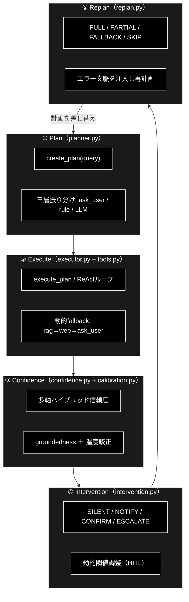

# GRACE 自律型エージェント アーキテクチャ概説書

> **本書の位置づけ（前振り）**
>
> 本書は、特定の関数や API を引くための「リファレンス」でも、動かし方を示す
> 「操作手順書」でもない。GRACE 自律型エージェントが **なぜ今の形になっているのか**、
> そして **全体としてどう成り立っているのか** を伝える、
> **設計思想・アーキテクチャ概説書（Design Concept / Architecture Overview）** である。
>
> 言い換えれば、`grace/doc/` 配下に並ぶ各モジュール単位の説明書
> （`confidence.md` / `executor.md` / `planner.md` など）の **上位に立ち、それらを束ねる
> 「入口（傘）となる概説書」** にあたる。個別仕様はそれらリファレンスへ、
> 全体像と設計の文脈は本書へ、という役割分担になっている。

### 本書を一言で表すと

> **「ReAct → Reflection → GRACE：自律型エージェント設計の経緯と5段階アーキテクチャの全体像」**

| 文書タイプ | 主な問い | 担当 |
|---|---|---|
| **設計思想・アーキテクチャ概説書** | **なぜ／全体としてどう成り立つか** | ✅ 本書（`grace.md`） |
| API/クラス リファレンス | この関数の引数・戻り値は？ | `confidence.md` / `executor.md` ほか |
| 操作手順書（How-to / Usage） | どう動かすか | `readme_usage_tools.md` |

### 概要 — (A) → (B) → (C) の改善サマリ

自律型エージェントを **(A) → (B) → (C)** の順で改善・開発してきた。
3 世代は別物ではなく、前を内包して発展する **積み上げ** の関係にある。

> **その場しのぎ(A) → 経験から学ぶ(B) → 組織的に運用する(C)**

| 世代 | 名称 | 中核ループ／工程 |
|---|---|---|
| **(A)** | ReAct | `Thought → Action → Observation`（考える → 動く → 見る）の **ReAct-Loop** |
| **(B)** | ReAct + Reflection | ReAct-Loop ＋ **Reflection（考察／反省）**：① Evaluator（評価）→ ② Self-Reflection（反省）→ ③ Next Trial（再挑戦） |
| **(C)** | GRACE（5段階） | ① Plan（計画策定）→ ② Execute（逐次実行）→ ③ Confidence（信頼度を自己評価）→ ④ Intervention（自信がなければ人間が介入＝HITL）→ ⑤ Replan（失敗したら計画を立て直す） |

**(C) の5段階は一方通行ではなく循環する**（⑤ Replan から ① Plan へ戻る）。

```
① Plan → ② Execute → ③ Confidence → ④ Intervention → ⑤ Replan
  ↑________________________________________________________|
```

**(B) と (C) の対応**（B のどれが C のどこになったか）：

> (B) Evaluator / Self-Reflection ＝ (C) **③ Confidence**、
> (B) Next Trial ＝ (C) **⑤ Replan**。
> そこに (C) は **① Plan**（計画の独立工程化）と **④ Intervention**（HITL）を新設した。

---

### 本書の読みどころ

- **第1部** … (A) ReAct → (B) ReAct+Reflection → (C) GRACE 5段階設計 という改善の **経緯と動機**
- **第2部** … `grace/` 全11ファイルを「1行のコード（公開エントリポイント）」へ凝縮した **構成早見**
- **第3部** … 5段階（Plan/Execute/Confidence/Intervention/Replan）への **モジュール対応一覧＋フロー図**
- **第4部** … 各段階の **意味づけ**（A→B→C の改善がどこに宿ったか）

---

# 第0部. ReAct → Reflection → 5段階設計（本論）

本ドキュメントは、エージェントの推論方式が
**(A) ReAct → (B) ReAct + Reflection → (C) GRACE 5段階設計**
へと改善されてきた過程と、その 5 段階設計が `grace/` パッケージの各モジュールへ
どのように対応づけられているかをまとめる。

---

## 第1部. ReAct → Reflection → GRACE 改善の時系列

### 全体像（1行サマリ）

| 世代 | 名称 | 一言で言うと | 足された核 |
|---|---|---|---|
| (A) | **ReAct** | その場で「考える→動く→見る」を回す | 思考・行動・観察のループ |
| (B) | **ReAct + Reflection** | 失敗を**言語化して記憶**し、次回に活かす | 評価・反省・再挑戦 |
| (C) | **GRACE 5段階** | 反省に加え、**計画と人間介入**を正式な工程に | Plan / HITL / Replan の制度化 |

改善の向き：**「その場しのぎ」→「経験から学ぶ」→「組織的に運用する」**

---

### (A) ReAct ― 出発点

人間が問題を解くのと同じ 3 ステップを繰り返す。

```
Thought（思考）  : 次に何をすべきか考える
   ↓
Action（行動）   : 検索・計算など外部ツールを実行
   ↓
Observation（観察）: 行動の結果を確認する
   ↺（答えが出るまでループ）
```

**良い点**：ツールを使って動的に問題を解ける。
**限界（次の改善の動機）**：

- 視野が狭い。失敗しても「なぜ失敗したか」を振り返らない。
- 同じ的外れな行動を繰り返し、**無限ループ／手詰まり**に陥る。
- 諦めて間違った答えを出してしまう。

> 🍳 例：ナンプラーを入れすぎて塩辛い → 原因を分析せず醤油を足す → **泥沼化**

---

### (B) ReAct + Reflection ― 「失敗から学ぶ」を追加

ReAct のループは残しつつ、タスクが失敗／終了した段階で**事後評価と反省**を行う
3 工程を追加した。

```
   ┌─────────── ReActループ（A） ───────────┐
   │  Thought → Action → Observation        │
   └────────────────┬───────────────────────┘
                    ↓ 失敗・終了
   ① Evaluator（評価）     : 結果はゴールを満たすか厳しくチェック
   ② Self-Reflection（反省）: 「どこで誤ったか」「どのツールが間違いか」を
                             言語化し『反省メモリ』に保存
   ③ Next Trial（再挑戦）   : 反省メモリをプロンプト最優先で読み込み再実行
```

**変わったこと**：

- **同じ間違いを繰り返さない**（「このキーワードは無駄」「この式は誤り」を記憶）。
- **軌道修正（Replan）の精度が劇的に向上**。
- 無駄なループが減り、**トークン・時間・コストを節約**。

> 🍳 例：1回目は失敗 → 反省メモリに「ナンプラーは塩分が強い。次は大さじ1以下、
> コクは砂糖やレモンで補う」と記録 → **2回目は最初から調整して成功**

**位置づけ**：Reflection は「結果が NO だったとき、何がダメかを分析して
**再計画へ繋ぐ接着剤**」。鍵は **過去の失敗履歴をどう次へ渡すか（記憶の持たせ方）**。

---

### (C) GRACE 5段階設計 ― 工程として制度化

(B) で得た「評価・反省・再計画」を、暗黙のループから**5 つの明示的フェーズ**へ昇格。
さらに実務向けに **人間介入（HITL）** を正式工程として組み込んだ。

```
① Plan（計画策定）       … ゴールまでの道筋を立てる   ← ReActのThoughtを独立工程化
② Execute（逐次実行）     … ツールを動かし結果を得る   ← ReActのAction＋Observation
③ Confidence（信頼度評価）… 結果が正しいか検証する     ← (B)のSelf-Reflection由来
④ Intervention（人間介入）… AIの暴走を防ぐHITL         ← ★GRACEの新規拡張
⑤ Replan（計画再策定）    … 失敗を踏まえ手を練り直す   ← ReActの神髄／(B)の反省を活用
        ↺（①へ戻る）
```

| フェーズ | ルーツ | 役割 |
|---|---|---|
| ① Plan | ReAct: Thought の一部 | 最初に道筋を設計 |
| ② Execute | ReAct: Action + Observation | ツール実行と結果取得 |
| ③ Confidence | (B) Reflection（自己反省） | 正しさ・ゴール達成を検証 |
| ④ Intervention | **GRACE 新規** | Human-in-the-Loop で暴走防止 |
| ⑤ Replan | ReAct の神髄 + (B) 反省 | Thought に戻り次の手を再設計 |

**(B) からの進化点**：

1. **反省が「事後の一工程」から、③ Confidence という常設ゲートへ**。
2. **④ Intervention（HITL）を新設** ― AI の暴走を人間が止められる、実務で最重要の安全弁。
3. **⑤ Replan を独立フェーズ化** ― ③で NO → ④で人間が判断 → ⑤で立て直す、
   という制御フローが明確化。

---

### 改善ストーリーの要点

1. **(A)→(B)**：ループに**記憶（反省メモリ）**を足し、「その場しのぎ」から
   「経験から学ぶ」へ。失敗の言語化が肝。
2. **(B)→(C)**：学びを**工程として制度化**し、さらに**人間の介入（HITL）**を加えて
   「安全に運用できる自律エージェント」へ。
3. 一貫した狙いは **同じ失敗の回避 ＋ 軌道修正力の向上 ＋ コスト削減**、
   そこに **暴走防止（安全性）** を上乗せした流れ。

---

## 第2部. `grace/` 各ファイル → 1行のコードに凝縮

各モジュールの本質は「1 つのファクトリ＋1 つの主メソッド」に集約できる。
11 ファイルを 1 行ずつ並べると、GRACE の処理パイプライン全体になる。

```python
cfg     = get_config()                                              # config.py     : 全設定（LLM/閾値/重み/介入/replan/memory）を一元管理
client  = create_chat_client(cfg)                                  # llm_compat.py : genai互換I/FのままAnthropicを呼ぶアダプタ（.models.generate_content）
plan    = create_planner(cfg).create_plan(query)                   # planner.py    : 質問→ExecutionPlan（曖昧→ask_user / 単純→ルール / 複雑→LLM）
#         ExecutionPlan / PlanStep / StepResult / Scratchpad ...    # schemas.py    : 計画・結果・ReAct観測のPydantic型定義（データ契約）
mem     = create_execution_memory(cfg.memory.path)                # memory.py     : 過去実績から「当たりやすいコレクション」を学習し計画へ反映（P4）
tools   = create_tool_registry(cfg)                               # tools.py      : rag_search/web_search/reasoning/ask_user/code_execute の実体
result  = Executor(cfg).execute_plan(plan)                        # executor.py   : 計画を逐次/ReActループ実行＋動的fallback＋介入＋replan統括
factors = create_confidence_calculator(cfg).calculate(factors)    # confidence.py : 多軸ハイブリッド信頼度＋groundedness（根拠妥当性）算出
conf    = Calibrator.load(cfg.confidence.calibration_path).transform(p)  # calibration.py: 温度スケーリングで自己申告confidenceを実正解率へ較正
action  = create_intervention_handler(cfg).handle(decision)       # intervention.py: 信頼度→SILENT/NOTIFY/CONFIRM/ESCALATEのHITL振り分け＋動的閾値
newplan = create_replan_orchestrator(cfg).handle_step_failure(...)# replan.py     : 失敗/低信頼を検知し FULL/PARTIAL/FALLBACK/SKIP で計画再生成
```

1 行に凝縮した「役割サマリ」だけ抜き出すと：

| # | ファイル | 1行サマリ |
|---|---|---|
| 1 | `config.py` | 全コンポーネントの設定を Pydantic で一元管理（YAML＋環境変数） |
| 2 | `llm_compat.py` | google-genai 互換のまま Anthropic を呼ぶ薄いアダプタ |
| 3 | `schemas.py` | Plan/Step/Result/Scratchpad/Thought のデータ契約（型定義） |
| 4 | `planner.py` | 質問を分析し ExecutionPlan を生成（三層振り分け） |
| 5 | `memory.py` | 実行履歴を学習しコレクション事前分布を計画へ還元 |
| 6 | `tools.py` | エージェントの「手足」＝各ツールとレジストリ |
| 7 | `executor.py` | 計画を実行する司令塔（Plan-Execute／ReActループ） |
| 8 | `confidence.py` | 多軸＋根拠妥当性で「どれだけ信じられるか」を採点 |
| 9 | `calibration.py` | 採点の「甘辛」を実正解率へ較正（温度スケーリング） |
| 10 | `intervention.py` | 信頼度に応じて人間に渡す/止める（HITL） |
| 11 | `replan.py` | 失敗・低信頼から計画を立て直す |

---

## 第3部. GRACE 5段階設計への繰り込み（一覧表）

5 段階の各フェーズに、**主担当モジュール**と**補助モジュール**を割り当てると以下になる。
`config / schemas / llm_compat` は全段を貫く**横断基盤**である。

| 段階 | 役割 | 主担当ファイル | 主メソッド | 補助ファイル |
|---|---|---|---|---|
| **① Plan**（計画策定） | 質問→実行計画 | `planner.py` | `create_plan(query)` | `memory.py`（事前分布）, `schemas.py`（ExecutionPlan） |
| **② Execute**（逐次実行） | ツールを動かし観測を得る | `executor.py` ＋ `tools.py` | `execute_plan(plan)` / `tool.execute()` | `llm_compat.py`, `schemas.py`（StepResult/Scratchpad） |
| **③ Confidence**（信頼度評価） | 結果は正しいか採点 | `confidence.py` ＋ `calibration.py` | `calculate()` / `verify()` / `transform()` | `schemas.py`, `config`（weights/thresholds） |
| **④ Intervention**（人間介入/HITL） | 暴走を止め人へ渡す | `intervention.py` | `decide_action()`→`handle()` | `confidence.py`（InterventionLevel/ActionDecision） |
| **⑤ Replan**（計画再策定） | 失敗から立て直す | `replan.py` | `handle_step_failure()` | `planner.py`（再生成）, `memory.py`（学習） |
| **横断基盤** | 設定・型・LLM接続 | `config.py` / `schemas.py` / `llm_compat.py` | `get_config()` / 各Model / `create_chat_client()` | — |

### 5段階フロー図



---

## 第4部. 各段階の説明（A→B→C の改善がどこに宿ったか）

### ① Plan — `planner.py`（+ `memory.py`）

従来 ReAct の「Thought」を独立工程に昇格。`create_plan()` は質問を**三層に振り分ける**のが要点。

- 曖昧クエリ（「あの件について」）→ `ask_user` 計画へ（無駄検索を回避）
- 単純クエリ → ルールベース 2 ステップ（LLM 呼び出しなし＝低コスト）
- 複雑クエリ → LLM 計画生成

さらに `memory.best_collection()` が**過去の成功実績**から検索先を事前に絞る
＝(B) の「反省メモリ」が計画段に効く形。

### ② Execute — `executor.py` ＋ `tools.py`

ReAct の「Action＋Observation」。`tools.py` が手足（RAG/Web/推論/ask_user/サンドボックス実行）、
`executor.py` が司令塔。

- `complexity >= 0.7` なら **ReAct ループ**（Reason→Act→Observe→Confidence→Controller）、
  未満は静的 Plan-Execute に degrade（移行リスク低減）
- RAG スコア不足→`web_search`→さらに不足→`ask_user` の**動的フォールバック連鎖**を実行時に挿入
- 観測は `Scratchpad` に積み、次の Reason の足場にする＝(A) の「思考→行動→観察」ループの実体

### ③ Confidence — `confidence.py` ＋ `calibration.py`

(B) Reflection の「Evaluator（評価）」に相当。単なる検索スコアではなく**多軸ハイブリッド**で採点：

- 検索品質・ツール成功率・ソース一致度・自己評価・網羅度の重み付き集約
- `GroundednessVerifier` が**回答の各主張が引用ソースに支持されるか**を判定（捏造検出＝S1の核心）
- `calibration.py` が「自信過剰/不足」を**温度スケーリングで実正解率へ較正**し、ECE を縮小

→ ③でNOが出たら④/⑤へ繋ぐ「接着剤」。

### ④ Intervention — `intervention.py`

GRACE が ReAct/Reflection に**新規追加**した実務工程（HITL）。③の点数を `decide_action()` が
4 レベルに変換：

- `SILENT/NOTIFY` → 自動進行、`CONFIRM` → 確認、`ESCALATE` → ユーザー入力必須
- `DynamicThresholdAdjuster` が偽陽性/偽陰性のフィードバックで**閾値を自己調整**
  ＝(B) の「経験から学ぶ」を介入境界にも適用。

### ⑤ Replan — `replan.py`（+ `planner.py`）

ReAct の神髄＝Thought へ戻る工程を制度化。`should_replan()`（失敗 or 低信頼）→
`determine_strategy()` で戦略選択：

- `FALLBACK`（代替ツール）/ `PARTIAL`（失敗以降だけ）/ `FULL`（序盤失敗は全体）/ `SKIP` / `ABORT`
- 全体再計画では**エラー文脈をクエリに注入**して `planner.create_plan()` を再呼び出し
  ＝(B)「反省メモリをプロンプト最優先で読み込む」の実装。

### 横断基盤 — `config.py` / `schemas.py` / `llm_compat.py`

5 段階すべてが共有する土台。`schemas.py` の `ExecutionPlan / StepResult / Scratchpad / AgentThought`
が**段間のデータ契約**となり、`config.py` が閾値・重み・回数上限を集中管理、
`llm_compat.py` が「genai 互換 I/F のまま Anthropic を使う」差し替え点を提供する。

---

## まとめ（A→B→C 対応）

| ReAct(A) | +Reflection(B) | GRACE 5段階(C) — 担当ファイル |
|---|---|---|
| Thought | （計画は暗黙） | **① Plan** = `planner.py` + `memory.py` |
| Action/Observation | （ループ継続） | **② Execute** = `executor.py` + `tools.py` |
| —（評価が弱い） | Evaluator/Self-Reflection | **③ Confidence** = `confidence.py` + `calibration.py` |
| —（無し） | —（無し） | **④ Intervention** = `intervention.py`（★GRACE新規） |
| Thoughtへ戻る | Next Trial（反省を注入） | **⑤ Replan** = `replan.py` + `planner.py` |

(A) の 3 要素ループを、(B) で「評価・反省・再計画」を足し、(C) で**各工程をモジュールへ分離
＋HITL を正式追加**して制度化した、という対応関係になっている。
