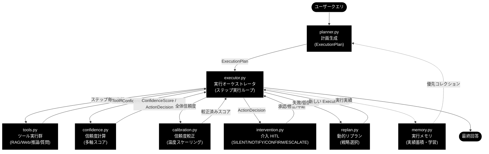
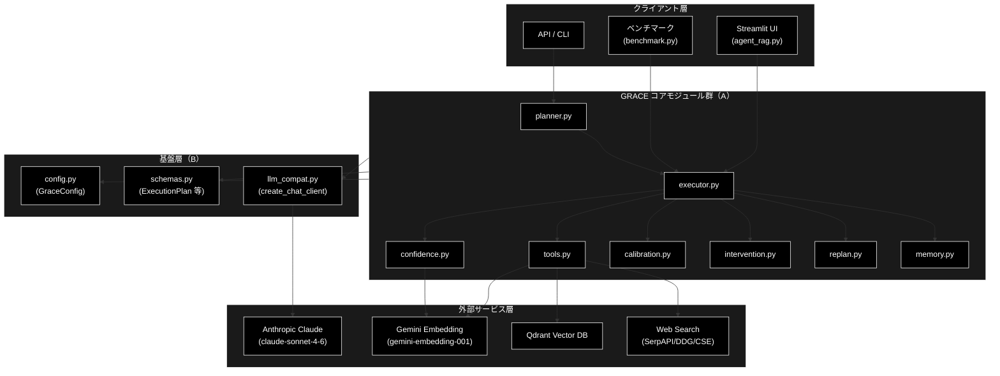
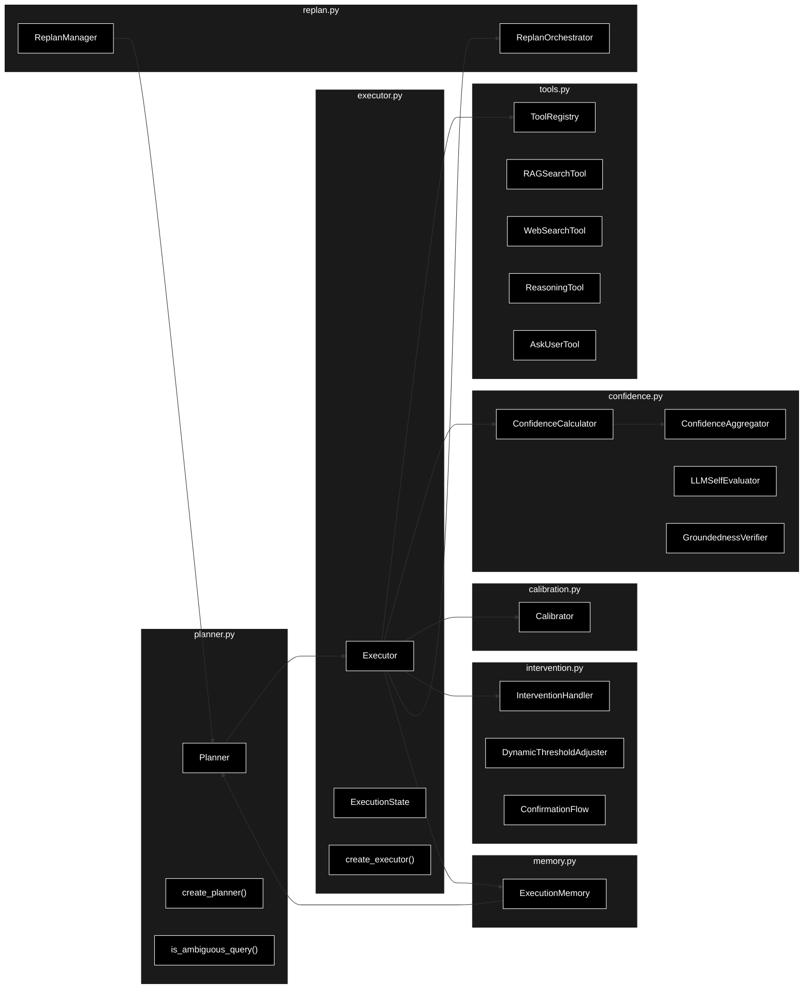
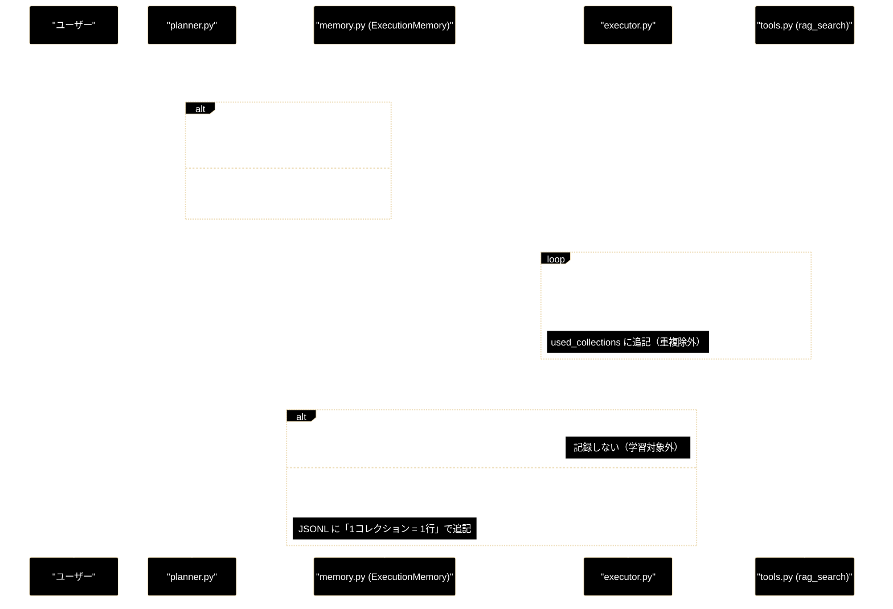
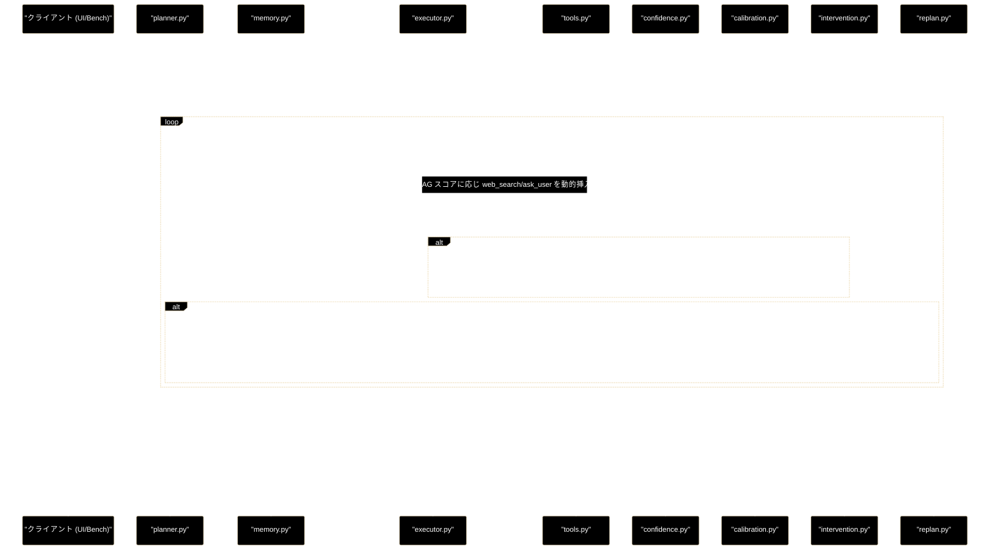
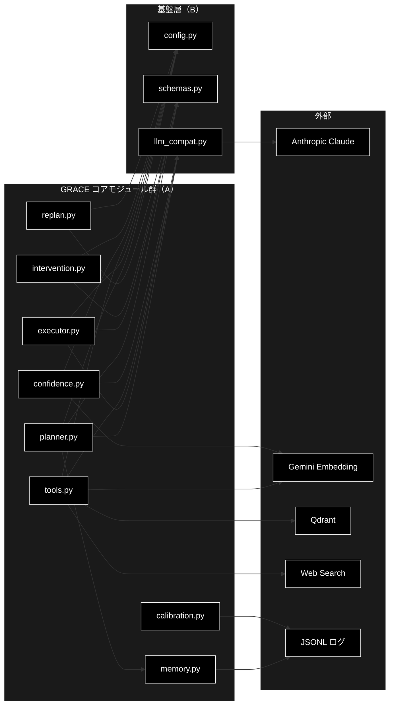

# grace_a.md - GRACE コアモジュール群（Planner 系）アーキテクチャ ドキュメント

**Version 1.1** | 最終更新: 2026-06-28

---

## 目次

- [概要](#概要)
- [1. アーキテクチャ構成図](#1-アーキテクチャ構成図)
  - [1.0 モジュール・ブロック図（全体処理フロー）](#10-モジュールブロック図全体処理フロー)
  - [1.1 システム全体構成（3層）](#11-システム全体構成3層)
  - [1.2 データフロー](#12-データフロー)
- [2. モジュール構成図](#2-モジュール構成図)
- [3. モジュール別サマリー（クラス・関数一覧）](#3-モジュール別サマリークラス関数一覧)
  - [3.1 planner.py](#31-plannerpy--計画生成)
  - [3.2 executor.py](#32-executorpy--実行オーケストレータ)
  - [3.3 confidence.py](#33-confidencepy--信頼度計算)
  - [3.4 calibration.py](#34-calibrationpy--信頼度較正)
  - [3.5 memory.py](#35-memorypy--実行メモリ)
  - [3.6 intervention.py](#36-interventionpy--介入hitl)
  - [3.7 replan.py](#37-replanpy--動的リプラン)
  - [3.8 tools.py](#38-toolspy--ツール群)
- [4. 実行メモリが貯まるまで（planner → executor → memory）](#4-実行メモリが貯まるまでplanner--executor--memory)
  - [4.1 登場人物（全体像とシーケンス図）](#41-登場人物全体像とシーケンス図)
  - [4.2 例データの設定](#42-例データの設定)
  - [4.3 planner.py：計画前にメモリへ相談](#43-plannerpy計画前にメモリへ相談)
  - [4.4 executor.py：使用コレクションの収集](#44-executorpy使用コレクションの収集)
  - [4.5 executor.py：_record_memory による格納](#45-executorpy_record_memory-による格納)
  - [4.6 memory.py：JSONL への格納とキーワード抽出](#46-memorypyjsonl-への格納とキーワード抽出)
  - [4.7 蓄積で planner が賢くなる例](#47-蓄積で-planner-が賢くなる例)
  - [4.8 読み戻しの場合分け](#48-読み戻しの場合分け)
  - [4.9 まとめ：場合分け早見表](#49-まとめ場合分け早見表)
- [5. 処理シーケンス（GRACE ループ）](#5-処理シーケンスgrace-ループ)
- [6. 設定・定数（横断）](#6-設定定数横断)
- [7. 使用例（ワークフロー）](#7-使用例ワークフロー)
- [8. エクスポート](#8-エクスポート)
- [9. 変更履歴](#9-変更履歴)
- [付録: 依存関係図](#付録-依存関係図)

---

## 概要

本ドキュメントは GRACE（**G**uided **R**easoning with **A**daptive **C**onfidence **E**xecution）自律エージェントの**コアモジュール群（A グループ）**を横断的に俯瞰するためのまとめドキュメントである。8 つのプログラムが「計画生成 → ステップ実行 → 信頼度評価 → 較正 → 介入（HITL）→ 動的リプラン」というループを構成し、`executor.py` をオーケストレータとして連携する。

各モジュールの IPO 詳細（シグネチャ・戻り値例・使用例）は個別ドキュメントに委ね、本書は **全体アーキテクチャ・データフロー・モジュール間連携・リンク集**に徹する。

> 📝 **技術スタック**: LLM 用途はすべて **Anthropic Claude**（既定 `claude-sonnet-4-6`、軽量 `claude-haiku-4-5-20251001`、鍵 `ANTHROPIC_API_KEY`）。検索の Embedding のみ **Gemini** `gemini-embedding-001`（3072 次元、鍵 `GOOGLE_API_KEY`）を継続利用。LLM クライアントは `grace.llm_compat.create_chat_client()` を経由する。

### 主な責務

- ユーザークエリから実行計画（`ExecutionPlan`）を生成する（複雑度推定・曖昧クエリ検知・二層方式）
- 計画を順次実行し、ツール呼び出し・依存解決・動的フォールバックを管理する
- ステップ毎・全体の多軸信頼度を計算する（検索品質・LLM 自己評価・ソース一致・根拠妥当性）
- 生の信頼度を経験的正答率へ温度スケーリングで較正する
- 過去実行の実績を蓄積し、コレクション優先度を学習する
- 信頼度に基づき人間介入（HITL）を段階的にゲートする
- 失敗・低信頼度時に戦略を選んで計画を動的に修正する（リプラン）
- RAG 検索・Web 検索・LLM 推論・ユーザー質問のツールを統一インターフェースで提供する

### 各責務対応のモジュール

| # | 責務 | 対応モジュール | 説明 |
|---|------|--------------|------|
| 1 | 実行計画の生成 | `planner.py` | 複雑度推定・二層方式（ルール/LLM）・曖昧クエリ検知で `ExecutionPlan` を生成 |
| 2 | 計画の順次実行・統括 | `executor.py` | ステップ実行ループ・動的フォールバック・全コンポーネント連携の中枢 |
| 3 | 多軸信頼度の計算 | `confidence.py` | 検索品質/LLM 自己評価/ソース一致/根拠妥当性を統合し介入レベルを決定 |
| 4 | 信頼度の較正 | `calibration.py` | 温度スケーリングで生スコアを経験的正答率に近づける |
| 5 | 実行メモリの蓄積・学習 | `memory.py` | JSONL に実績を蓄積し、クエリ別コレクション事前分布を提供 |
| 6 | 人間介入（HITL） | `intervention.py` | SILENT/NOTIFY/CONFIRM/ESCALATE のゲートと動的閾値学習 |
| 7 | 動的リプラン | `replan.py` | 失敗・低信頼度・フィードバックを契機に戦略選択で再計画 |
| 8 | ツール実行 | `tools.py` | RAG 検索・Web 検索・推論・ask_user を `ToolRegistry` で統一提供 |

### 主要機能一覧

| 機能 | 説明 |
|------|------|
| `Planner` / `create_planner()` | 実行計画生成エージェントとそのファクトリ |
| `Executor` / `ExecutionState` / `create_executor()` | 実行オーケストレータ・実行状態・ファクトリ |
| `ConfidenceCalculator` / `ConfidenceAggregator` | ステップ信頼度算出・全体集計 |
| `LLMSelfEvaluator` / `SourceAgreementCalculator` / `QueryCoverageCalculator` / `GroundednessVerifier` | 信頼度の各軸評価器 |
| `Calibrator` / `fit_temperature()` | 温度スケーリングによる信頼度較正 |
| `ExecutionMemory` / `create_execution_memory()` | 実行メモリ層（実績蓄積・優先コレクション学習） |
| `InterventionHandler` / `DynamicThresholdAdjuster` / `ConfirmationFlow` | 介入処理・動的閾値調整・確認フロー |
| `ReplanManager` / `ReplanOrchestrator` | リプラン判定・戦略決定・Executor 統合 |
| `ToolRegistry` / `RAGSearchTool` / `WebSearchTool` / `ReasoningTool` / `AskUserTool` | ツールレジストリと各ツール |

---

## 1. アーキテクチャ構成図

### 1.0 モジュール・ブロック図（全体処理フロー）

A グループの 8 プログラムをそれぞれ 1 ブロックとして表し、ユーザークエリから最終回答までの全体処理フローを示す。`executor.py` が中枢となり、各モジュールと往復しながらループを駆動する。



### 1.1 システム全体構成（3層）



### 1.2 データフロー

1. クライアント層（UI / ベンチマーク / API）が `query` を入力する。
2. `planner.py` が複雑度を推定し、曖昧クエリなら確認計画（`ask_user`）、それ以外はルールベースまたは LLM 計画として `ExecutionPlan` を生成する（`memory.py` の事前分布で優先コレクションを反映）。
3. `executor.py` が計画を受け取り、依存解決しながらステップを順次実行する。各ステップは `tools.py` の `ToolRegistry.execute()` でツールを呼び出す。
4. RAG 検索のスコアと適合性に応じて、`executor.py` が `web_search` → `ask_user` を**動的に挿入/スキップ**する。
5. 各ステップ後、`confidence.py` が `ConfidenceFactors` から `ConfidenceScore` を算出し、`ActionDecision`（介入レベル）を決定する。
6. 全体信頼度を `ConfidenceAggregator` で集計し、`calibration.py` の `Calibrator.transform()` で温度較正する。
7. `intervention.py` が介入レベルに応じて自動進行/通知/確認/エスカレーションをゲートする。フィードバックは `DynamicThresholdAdjuster` が閾値学習に反映する。
8. ステップ失敗や低信頼度時は `replan.py` が戦略（FULL/PARTIAL/FALLBACK/SKIP/ABORT）を選び、`planner.py` へ委譲して新計画を生成、`executor.py` が再帰実行する。
9. `executor.py` が実行実績（使用コレクション・成否・信頼度）を `memory.py` に記録し、最終的に `ExecutionResult` を返却する。

---

## 2. モジュール構成図

A グループ内部の主要クラスと連携を示す。



### 2.1 モジュール間依存関係テーブル

| モジュール | 主に呼び出す相手 | 主に呼ばれる相手 |
|-----------|----------------|----------------|
| `planner.py` | `memory`（事前分布）, `llm_compat`, `schemas`, `services.qdrant_service` | `executor`, `replan`, UI |
| `executor.py` | `tools`, `confidence`, `calibration`, `intervention`, `replan`, `memory` | UI, `benchmark` |
| `tools.py` | Qdrant, Gemini Embedding, Web 検索, `llm_compat` | `executor` |
| `confidence.py` | `llm_compat`（Anthropic）, Gemini Embedding | `executor` |
| `calibration.py` | （stdlib のみ） | `executor`, 評価スクリプト |
| `memory.py` | （stdlib のみ・JSONL） | `executor`（書込）, `planner`（読込） |
| `intervention.py` | `confidence`（`InterventionLevel`/`ActionDecision`） | `executor` |
| `replan.py` | `planner`（`create_plan`/委譲） | `executor` |

---

## 3. モジュール別サマリー（クラス・関数一覧）

各モジュールの責務・主要クラス・関数を要約する。IPO 詳細は各「個別ドキュメント」を参照。

### 3.1 planner.py — 計画生成

**個別ドキュメント**: [`planner.md`](./planner.md)

ユーザーの質問から `ExecutionPlan` を生成する。二層方式（複雑度 `< 0.7` でルールベース、`≥ 0.7` または Web 検索マーカーで LLM 計画）と曖昧クエリ検知を備える。

| 要素 | 概要 |
|------|------|
| `Planner` | 計画生成エージェント本体 |
| `Planner.create_plan(query)` | 質問から `ExecutionPlan` を生成（二層方式） |
| `Planner.estimate_complexity(query)` | キーワードベースで複雑度を 0.0–1.0 推定 |
| `Planner.estimate_complexity_with_llm(query)` | LLM で複雑度を推定 |
| `Planner.refine_plan(plan, feedback)` | フィードバックに基づき計画を修正 |
| `is_ambiguous_query(query)` | 指示語のみで対象不明な曖昧クエリを判定 |
| `create_planner(config, model_name)` | `Planner` ファクトリ |

**主な定数**: `PLAN_GENERATION_PROMPT`, `COMPLEXITY_ESTIMATION_PROMPT`, `_COMPLEXITY_FACTORS`, `_AMBIGUOUS_REFERENT_PATTERNS`, `_LLM_PLAN_MARKERS`。閾値 `llm_plan_complexity_threshold=0.7`。

### 3.2 executor.py — 実行オーケストレータ

**個別ドキュメント**: [`executor.md`](./executor.md)

生成された `ExecutionPlan` を順次実行する中枢。ツール実行・動的フォールバック・信頼度計算・較正・HITL 介入・リプラン連携を統括し、最終回答を生成する。

| 要素 | 概要 |
|------|------|
| `Executor` | 計画実行エージェント（GRACE ネイティブ実装） |
| `Executor.execute_plan(plan)` | ブロッキング実行で `ExecutionResult` を返す |
| `Executor.execute_plan_generator(plan, state)` | UI 連携用ジェネレータ版（中間イベントを `yield`） |
| `Executor.execute(plan)` | 統一エントリーポイント（benchmark 互換） |
| `Executor.cancel(state)` / `resume(state)` | 実行の制御 |
| `ExecutionState` | 実行状態（計画・ステップ結果・信頼度・制御フラグ） |
| `create_executor(config, tool_registry, ...)` | `Executor` ファクトリ |

**主な設定**: `parallel_search`, `max_parallel_steps=3`, `react_enabled`, `rag_sufficient_score=0.7`, `max_replans=3`, `calibration_path`。`_SEARCH_ACTIONS = ("rag_search", "web_search")`。

### 3.3 confidence.py — 信頼度計算

**個別ドキュメント**: [`confidence.md`](./confidence.md)

検索品質・LLM 自己評価・ソース一致・根拠妥当性（groundedness）の多軸を統合し、信頼度スコアと介入レベル（SILENT/NOTIFY/CONFIRM/ESCALATE）を決定する。

| 要素 | 概要 |
|------|------|
| `ConfidenceCalculator` | ハイブリッド方式でスコア算出・`decide_action()` で介入レベル決定 |
| `LLMSelfEvaluator` | LLM による確信度・網羅度・Factors 統合評価 |
| `SourceAgreementCalculator` | Gemini Embedding でソース間のコサイン一致度を算出 |
| `QueryCoverageCalculator` | クエリ網羅度を LLM で 0.0–1.0 評価 |
| `GroundednessVerifier` | 各主張の引用支持/矛盾を判定し支持率を返す（S1 中核） |
| `ConfidenceAggregator` | 複数ステップを mean/min/weighted で集計 |
| `ConfidenceFactors` / `ConfidenceScore` / `ActionDecision` / `InterventionLevel` | 入力要素・スコア・介入決定・レベル列挙 |

**主な閾値**: `silent=0.9`, `notify=0.7`, `confirm=0.4`。重み合計 1.0（`search_quality=0.25` ほか）。

### 3.4 calibration.py — 信頼度較正

**個別ドキュメント**: [`calibration.md`](./calibration.md)

生の信頼度と経験的正答率の乖離（ECE）を温度スケーリング（logit → /T → sigmoid）で縮小する。SciPy 非依存の 1 次元探索で温度 T を推定し、JSON に永続化する。

| 要素 | 概要 |
|------|------|
| `Calibrator` | 温度スケーリング較正器（dataclass） |
| `Calibrator.transform(p)` | 単一信頼度に較正を適用 |
| `Calibrator.fit(confidences, correctness)` | (信頼度, 正誤) から T を推定して生成 |
| `Calibrator.save(path)` / `load(path)` | JSON 永続化・読込 |
| `apply_temperature(p, temperature)` | 温度 T を適用 |
| `fit_temperature(confidences, correctness)` | 二段グリッド探索で二値 NLL 最小化 |
| `expected_calibration_error(...)` | 等幅ビンで ECE を算出 |

**主な定数**: `DEFAULT_CALIBRATION_PATH="config/calibration.json"`, `_EPS=1e-6`。退化データは恒等較正（T=1.0）にフォールバック。

### 3.5 memory.py — 実行メモリ

**個別ドキュメント**: （新規・本書で初出）

実行レコードを JSONL に蓄積し、コレクション別の成功率・平均信頼度（Laplace 平滑化）を集計して、クエリキーワードに基づく**コレクション事前分布**を `planner.py` に提供する（エピソード記憶）。

| 要素 | 概要 |
|------|------|
| `ExecutionMemory` | JSONL ストレージと優先度計算の主 API |
| `ExecutionMemory.record(query, collection, success, confidence)` | 1 件の実績を追記 |
| `ExecutionMemory.collection_priors(query)` | クエリ別の優先コレクション統計を返す |
| `ExecutionMemory.best_collection(query)` | 十分な実績を持つ最良コレクションを推奨 |
| `MemoryRecord` / `CollectionStat` | レコード／集計統計の dataclass |
| `extract_keywords(text)` | 形態素解析なしの軽量キーワード抽出 |
| `create_execution_memory(path)` | `ExecutionMemory` ファクトリ |

**主な定数**: `DEFAULT_MEMORY_PATH="logs/grace_memory.jsonl"`。stdlib のみ・ネットワーク非依存。

### 3.6 intervention.py — 介入（HITL）

**個別ドキュメント**: [`intervention.md`](./intervention.md)

`confidence.py` の `ActionDecision` を受け、4 段階（SILENT/NOTIFY/CONFIRM/ESCALATE）で実行をゲートする Human-in-the-Loop 層。ユーザーフィードバックで閾値を動的学習する。

| 要素 | 概要 |
|------|------|
| `InterventionHandler` | 介入レベルに応じてリクエストを生成・ディスパッチ |
| `InterventionHandler.handle(decision, step, plan)` | 介入を処理し `InterventionResponse` を返す |
| `DynamicThresholdAdjuster` | FP/FN 率を監視して閾値を動的調整 |
| `DynamicThresholdAdjuster.record_feedback(confidence, was_correct)` | フィードバックを記録し閾値学習 |
| `ConfirmationFlow` | 確認→修正→再確認ループを最大回数まで管理 |
| `InterventionRequest` / `InterventionResponse` / `InterventionAction` / `FeedbackRecord` | リクエスト・応答・アクション列挙・フィードバック記録 |
| `create_intervention_handler()` / `create_threshold_adjuster()` / `create_confirmation_flow()` | 各ファクトリ |

**主な定数**: `timeout_seconds=300`, `learning_rate=0.05`, `min_samples=10`。FP/FN 率 `> 30%` で閾値調整。

### 3.7 replan.py — 動的リプラン

**個別ドキュメント**: [`replan.md`](./replan.md)

ステップ失敗・低信頼度・ユーザーフィードバックを契機に、戦略（FULL/PARTIAL/FALLBACK/SKIP/ABORT）を選択して計画を動的に修正する。新計画生成は `planner.py` へ委譲する。

| 要素 | 概要 |
|------|------|
| `ReplanOrchestrator` | Executor と `ReplanManager` を統合し自動リプランフローを管理 |
| `ReplanOrchestrator.handle_step_failure(...)` | ステップ失敗時のリプラン処理 |
| `ReplanOrchestrator.handle_user_feedback(...)` | フィードバックによるリプラン処理 |
| `ReplanManager` | リプラン要否判定・戦略決定・新計画生成 |
| `ReplanManager.should_replan(step_result, replan_count)` | ステップ結果から要否・トリガー判定 |
| `ReplanManager.determine_strategy(context, plan)` | 戦略を決定 |
| `ReplanTrigger` / `ReplanStrategy` / `ReplanContext` / `ReplanResult` | トリガー/戦略の列挙とコンテキスト/結果 |
| `create_replan_manager()` / `create_replan_orchestrator()` | 各ファクトリ |

**主な定数**: `max_replans=3`, `confidence_threshold=0.4`, `partial_replan_threshold=0.6`, `_SEARCH_FALLBACK_CHAIN={"rag_search":"web_search","web_search":"rag_search"}`。

### 3.8 tools.py — ツール群

**個別ドキュメント**: [`tools.md`](./tools.md)

GRACE エージェントの統一ツールシステム。RAG 検索（Gemini Embedding + Qdrant）・Web 検索・LLM 推論（Anthropic Claude）・ask_user（HITL）を `ToolRegistry` で名前ベースに実行する。

| 要素 | 概要 | ActionType |
|------|------|-----------|
| `ToolRegistry` | ツール登録・取得・実行ディスパッチ | — |
| `ToolRegistry.execute(name, **kwargs)` | 名前指定でツールを実行 | — |
| `BaseTool` | 全ツールの抽象基底（`execute()`） | — |
| `RAGSearchTool` | Qdrant から RAG 検索（動的コレクション・閾値調整） | `rag_search` |
| `WebSearchTool` | SerpAPI/DDG/Google CSE で Web 検索 | `web_search` |
| `ReasoningTool` | Anthropic Claude で回答生成 | `reasoning` |
| `AskUserTool` | HITL で質問を構造化して返却 | `ask_user` |
| `ToolResult` | 成功・出力・信頼度・エラー・実行時間の統一結果 | — |
| `create_tool_registry(config)` | `ToolRegistry` ファクトリ |  — |

**主な定数**: 推論 LLM `claude-sonnet-4-6`、Embedding `gemini-embedding-001`（3072 次元）、Qdrant `http://localhost:6333`、有効ツール `["rag_search","web_search","reasoning","ask_user"]`。

---

## 4. 実行メモリが貯まるまで（planner → executor → memory）

本章では、`planner.py` から始まって `executor.py` の実行結果が `memory.py` の `ExecutionMemory` に格納される様子を、**例データ**と**場合分け**つきでやさしく解説する。要点は **「メモリは executor が書き、planner が読む」** という一方通行の学習ループで、今回の実行結果が次回以降の計画づくりに効いてくる点にある。

### 4.1 登場人物（全体像とシーケンス図）



処理の骨格は次の通り。

```
ユーザーの質問
   │
   ▼
[planner.py] 計画を作る
   │  ・memory.py に「この質問で当たりやすいコレクションある？」と相談
   │    └ _prioritized_collection() → memory.best_collection()
   ▼
ExecutionPlan（rag_search → reasoning など）
   │
   ▼
[executor.py] 計画を1ステップずつ実行
   │  ・rag_search が当たったコレクション名を used_collections に貯める
   │  ・最後に _record_memory() を呼ぶ
   ▼
[memory.py] ExecutionMemory.record_many()
   │  ・1行 = 1レコードで JSONL に追記
   ▼
logs/grace_memory.jsonl  ← ★ここに格納される
```

### 4.2 例データの設定

- Qdrant のコレクション候補: `wikipedia_ja`, `livedoor`, `cc_news`, `japanese_text`
- ユーザーは「Python の◯◯」という質問を何度か繰り返す、とする。
- メモリファイル `logs/grace_memory.jsonl` は **最初は空** とする。

### 4.3 planner.py：計画前にメモリへ相談

`planner.py:232` の `_prioritized_collection()` が memory に問い合わせる。

```python
# grace/planner.py:232
def _prioritized_collection(self, query: str) -> Optional[str]:
    if self._memory is None:
        return None                      # ← 場合分け①
    best = self._memory.best_collection( # ← memory.py に委譲
        query=query,
        min_count=mc.min_count,          # 既定 3
        min_score=mc.min_score,          # 既定 0.6
    )
    return best                          # コレクション名 or None
```

🔀 **場合分け①：planner がコレクションを絞れるか**

| 状況 | `_prioritized_collection()` の戻り値 | 計画の rag_search |
|---|---|---|
| **メモリ無効**（`config.memory.enabled=false`） | `None` | 全コレクション検索 |
| **実績はあるが不十分**（件数 < 3 か スコア < 0.6） | `None` | 全コレクション検索 |
| **実績が十分**（件数 ≥ 3 かつ スコア ≥ 0.6） | 例：`"wikipedia_ja"` | そのコレクションに限定して検索 |

> 📝 最初はメモリが空なので必ず `None`（＝全コレクション検索）になる。「最初の数回は手探り、貯まってきたら賢くなる」という設計。

### 4.4 executor.py：使用コレクションの収集

計画を実行する途中、`rag_search` が成功するたびに当たったコレクション名を `state.used_collections` に貯める。

```python
# grace/executor.py:991
# P4: 使用した RAG コレクションを実行メモリ用に記録
if step.action == "rag_search" and isinstance(tool_result.confidence_factors, dict):
    uc = tool_result.confidence_factors.get("used_collection")
    if uc and uc not in state.used_collections:   # 重複は足さない
        state.used_collections.append(uc)
```

例：1回目の質問「Python の歴史を教えて」で `wikipedia_ja` が当たれば、

```python
state.used_collections == ["wikipedia_ja"]
state.overall_confidence == 0.85   # ← calibration.py で較正済みの最終信頼度
```

### 4.5 executor.py：_record_memory による格納

全ステップ終了後（`executor.py:432` / `:698`）に呼ばれる。

```python
# grace/executor.py:1891
def _record_memory(self, state: ExecutionState) -> None:
    if self._memory is None:
        return                                            # ← 場合分け②
    statuses = [r.status for r in state.step_results.values()]
    success = bool(statuses) and all(s == "success" for s in statuses)  # ← 場合分け③
    collections = list(state.used_collections)
    if not collections:
        return                                            # ← 場合分け④（web のみ等は記録しない）
    self._memory.record_many(
        query=state.plan.original_query,
        collections=collections,
        success=success,
        confidence=state.overall_confidence,
    )
```

🔀 **executor 側の場合分け（格納するか・どう格納するか）**

| # | 条件 | 挙動 |
|---|---|---|
| ② | メモリ無効（`self._memory is None`） | **記録しない**（何もせず return） |
| ③ | 全ステップ success か？ | `success=True/False` を決める。**失敗でも記録する** |
| ④ | `used_collections` が空（Web 検索のみ・ask_user のみ等） | **記録しない**（RAG 未使用は学習対象外） |

> ③が重要：**失敗した実行も `success=false` として記録される。**「このコレクションはこの質問では外しやすい」という情報も貯めて、スコアを下げるのに使う。

### 4.6 memory.py：JSONL への格納とキーワード抽出

`record_many()` は、使ったコレクションごとに `record()` を呼んで JSONL に追記する（`memory.py:119`）。

```python
# grace/memory.py:119
def record_many(self, query, collections, success, confidence, keywords=None):
    kw = keywords if keywords is not None else extract_keywords(query or "")
    seen = set()
    for c in collections:
        if c in seen:        # 同じコレクションは1回だけ
            continue
        seen.add(c)
        self.record(query, c, success, confidence, keywords=kw)
```

**キーワード抽出（`extract_keywords`, `memory.py:33`）** は正規表現 `[A-Za-z0-9]{2,}` または `[漢字/かな/カナ]{2,}` の連続を拾う。**形態素解析はしない**ため、日本語は「区切り文字（スペース・記号・英数）が来るまでの連続」が丸ごと 1 キーワードになる。

```python
extract_keywords("Python の歴史を教えて")
# → ["python", "の歴史を教えて"]
#    └ "Python" は英字なので独立 / 残りの日本語連続は丸ごと1語
```

> 📝 つまり日本語部分は細かく分かれない。**英語・カタカナ語・型番など「独立した語」が共通している質問どうし**でだけ、後述のキーワード一致が効く（例：「Python」が共通）。

**格納される JSONL（1回目の実行後）** — `logs/grace_memory.jsonl` に1行追記される。

```json
{"query": "Python の歴史を教えて", "keywords": ["python", "の歴史を教えて"], "collection": "wikipedia_ja", "success": true, "confidence": 0.85, "timestamp": 1750000000.0}
```

> 書き込みは **best-effort**（`memory.py:112`）。失敗しても `logger.warning` を出すだけで**実行は止めない**。

### 4.7 蓄積で planner が賢くなる例

「Python の◯◯」を 4 回質問し、毎回 `wikipedia_ja` が当たって成功したとする。

| 実行 | query | 格納された行（要点） |
|---|---|---|
| 1回目 | Python の歴史を教えて | collection=`wikipedia_ja`, success=true, conf=0.85 |
| 2回目 | Python の標準ライブラリについて | collection=`wikipedia_ja`, success=true, conf=0.88 |
| 3回目 | Python の例外処理とは | collection=`wikipedia_ja`, success=true, conf=0.80 |
| 4回目 | Python の内包表記とは | ← この計画づくりで初めて「絞り込み」が効く |

4回目の計画づくりで `best_collection("Python の内包表記とは")` が呼ばれると、memory はこう計算する（`memory.py:147` `collection_priors` → `score`）。

- キーワード `"python"` を含む過去レコードだけを対象 → 3件（すべて `wikipedia_ja`）
- `count=3`, `success_count=3`, `mean_confidence=(0.85+0.88+0.80)/3 ≈ 0.843`
- スコア（Laplace 平滑化付き）:

```
score = (success_count + 1) / (count + 2) × mean_confidence
      = (3 + 1) / (3 + 2) × 0.843
      = 0.8 × 0.843 ≈ 0.674
```

判定（`best_collection`, `memory.py:192`）:

```
count(3) >= min_count(3)  ✓   かつ   score(0.674) >= min_score(0.6)  ✓
→ "wikipedia_ja" を返す
```

これで 4 回目の rag_search は **最初から `wikipedia_ja` に限定**され、無駄な全コレクション検索をしなくなる。3 回目までは件数不足（< 3）で `None`＝全検索だったのが、4 回目で切り替わる、という場合分けである。

### 4.8 読み戻しの場合分け

planner が読むとき、memory 側（`collection_priors`, `memory.py:147`）でもう一段の場合分けがある。

| 状況 | 挙動 |
|---|---|
| **クエリのキーワードに一致する過去レコードがある** | そのレコードだけで集計（＝「この種の質問の」分布） |
| **一致レコードが 0 件**（`memory.py:168`） | 全レコードで集計に**フォールバック**（全体傾向で代用） |
| **`collection` が空のレコード** | 集計対象から除外 |

> 例：初めて「半導体の動向」を聞いた場合、「python」を含む過去レコードとはキーワードが一致しないので、全体集計にフォールバックする。

### 4.9 まとめ：場合分け早見表

| 段階 | 場所 | 場合分け | 結果 |
|---|---|---|---|
| 計画前の相談 | `planner._prioritized_collection` | メモリ無効 / 実績不足 / 実績十分 | `None`（全検索）/ `None` / コレクション限定 |
| 実行中 | `executor` rag_search 後 | 当たったコレクションを収集 | `used_collections` に追記（重複除外） |
| 格納判定 | `executor._record_memory` | ②メモリ無効 / ③全ステップ成否 / ④RAG未使用 | 記録しない / success フラグ決定 / 記録しない |
| 格納 | `memory.record_many` | コレクション重複除外 | 使ったコレクション数だけ JSONL 追記 |
| 読み戻し | `memory.collection_priors` | キーワード一致あり / 0件 | 該当のみ集計 / 全体へフォールバック |
| 推奨判定 | `memory.best_collection` | 件数≥3 かつ スコア≥0.6 | コレクション名 / `None` |

一言でいうと——**「executor が “どのコレクションで・成功したか・どれくらい自信があったか” を JSONL に1行ずつ貯め、planner が次回 “この質問なら毎回当たってる `wikipedia_ja` に絞ろう” と賢くなる」** 学習ループである。最初は手探り（全検索）、3件以上の好成績が貯まった時点で絞り込みに切り替わる。

---

## 5. 処理シーケンス（GRACE ループ）

`executor.py` を中心とした 1 クエリの実行シーケンス。



---

## 6. 設定・定数（横断）

主要な設定は `grace.config.GraceConfig`（`config.py`）に集約される。A グループで参照する代表値を抜粋する。

| 設定キー | 既定値 | 参照モジュール | 説明 |
|---------|-------|--------------|------|
| `llm.provider` | `"anthropic"` | 全 LLM 用途 | LLM プロバイダ |
| `llm.model` | `claude-sonnet-4-6` | planner / executor / confidence / tools | 既定 LLM モデル |
| `planner.llm_plan_complexity_threshold` | `0.7` | planner | ルールベース計画採用の上限複雑度 |
| `confidence.thresholds` | `silent=0.9 / notify=0.7 / confirm=0.4` | confidence / intervention | 介入レベル判定閾値 |
| `confidence.calibration_path` | `config/calibration.json` | executor / calibration | 較正パラメータの保存先 |
| `executor.rag_sufficient_score` | `0.7` | executor | RAG スコア十分判定の閾値 |
| `executor.max_parallel_steps` | `3` | executor | 並列実行の最大ステップ数 |
| `replan.max_replans` | `3` | executor / replan | 最大リプラン回数 |
| `replan.confidence_threshold` | `0.4` | replan | 低信頼度トリガー閾値 |
| `memory.path` | `logs/grace_memory.jsonl` | memory | 実行メモリの保存先 |
| Embedding | `gemini-embedding-001`（3072 次元） | tools / confidence | 検索用 Embedding（Gemini を継続利用） |

---

## 7. 使用例（ワークフロー）

```python
from grace import (
    create_planner,
    create_executor,
    create_tool_registry,
    get_config,
)

# 1. 設定の取得
config = get_config()

# 2. ツールレジストリと各エージェントの初期化
tool_registry = create_tool_registry(config)
planner = create_planner(config)
executor = create_executor(config, tool_registry)  # confidence/calibration/intervention/replan/memory を内部初期化

# 3. 計画の生成（planner.py）
plan = planner.create_plan("日本の再生可能エネルギー政策の最新動向を教えて")

# 4. 計画の実行（executor.py が全コンポーネントを統括）
result = executor.execute(plan)

# 5. 結果の確認
print(f"最終回答: {result.final_answer}")
print(f"全体信頼度（較正済み）: {result.overall_confidence:.2f}")
print(f"ステータス: {result.overall_status}")
```

UI 連携ではブロッキング版の代わりにジェネレータ版を使い、中間イベント（`log` / `tool_call` / `tool_result` / `final_answer`）を逐次表示する。

```python
# UI 連携（ジェネレータ版）
for state in executor.execute_plan_generator(plan):
    # state を逐次描画（進捗・ステップ結果・信頼度）
    ...
```

---

## 8. エクスポート

A グループの主要要素は `grace/__init__.py` でパッケージレベルにエクスポートされる（抜粋）。

```python
__all__ = [
    # Planner
    "Planner", "create_planner",
    # Tools
    "ToolResult", "BaseTool", "RAGSearchTool", "WebSearchTool",
    "ReasoningTool", "AskUserTool", "ToolRegistry", "create_tool_registry",
    # Executor
    "ExecutionState", "Executor", "create_executor",
    # Confidence (Phase 2)
    "ConfidenceFactors", "ConfidenceScore", "ActionDecision", "InterventionLevel",
    "ConfidenceCalculator", "LLMSelfEvaluator", "SourceAgreementCalculator",
    "QueryCoverageCalculator", "ConfidenceAggregator",
    "create_confidence_calculator", "create_llm_evaluator",
    "create_source_agreement_calculator", "create_query_coverage_calculator",
    "create_confidence_aggregator",
    # Intervention (Phase 3)
    "InterventionRequest", "InterventionResponse", "InterventionAction", "FeedbackRecord",
    "InterventionHandler", "DynamicThresholdAdjuster", "ConfirmationFlow",
    "create_intervention_handler", "create_threshold_adjuster", "create_confirmation_flow",
    # Replan (Phase 4)
    "ReplanTrigger", "ReplanStrategy", "ReplanContext", "ReplanResult",
    "ReplanManager", "ReplanOrchestrator",
    "create_replan_manager", "create_replan_orchestrator",
]
```

> 📝 `calibration.py`（`Calibrator` 等）と `memory.py`（`ExecutionMemory` 等）はパッケージ `__all__` には未掲載で、`grace.calibration` / `grace.memory` から直接インポートして利用する。

---

## 9. 変更履歴

| バージョン | 変更内容 |
|-----------|---------|
| 1.0 | 初版作成（A グループ 8 モジュールの横断まとめ。先頭にモジュール・ブロック図、3 層構成図、モジュール構成図、処理シーケンス、横断設定表を整備） |
| 1.1 | 目次・本文の採番を整理（モジュール別サマリーのサブ番号 3.1–3.8 を本文番号と一致させ、目次を明示番号付き箇条書きに変更）。新章「4. 実行メモリが貯まるまで（planner → executor → memory）」を例データ・場合分け・黒背景シーケンス図つきで追加し、以降の章を 5〜9 に繰り下げ |

---

## 付録: 依存関係図

A グループから基盤層（B）・外部サービスへの依存関係。


