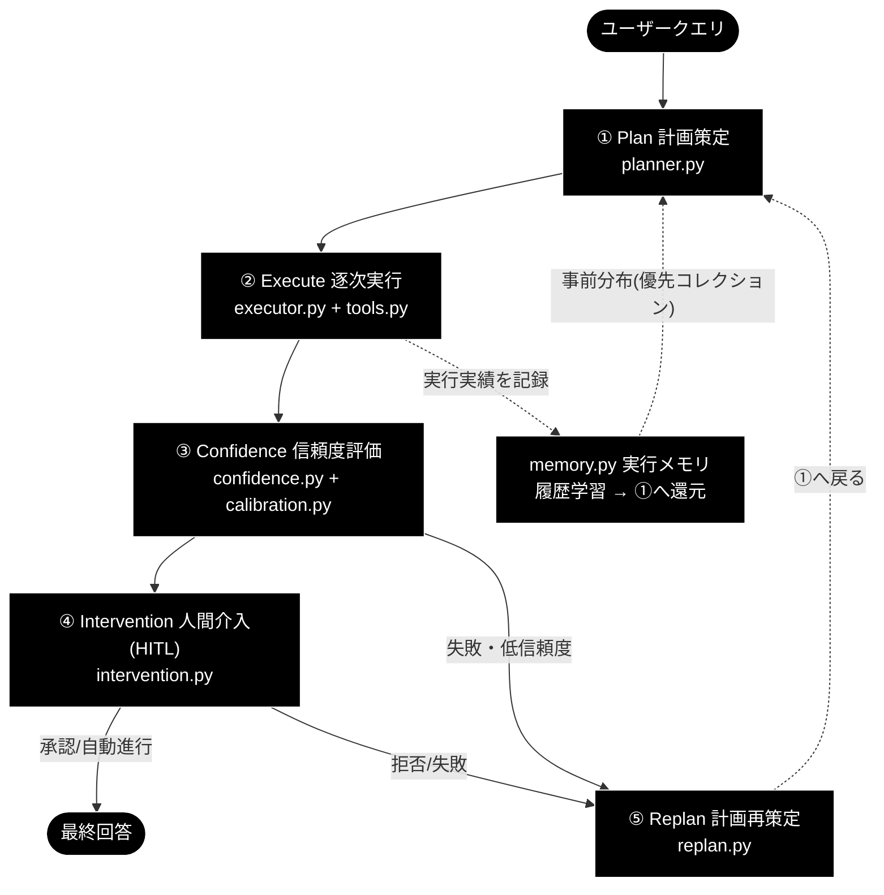
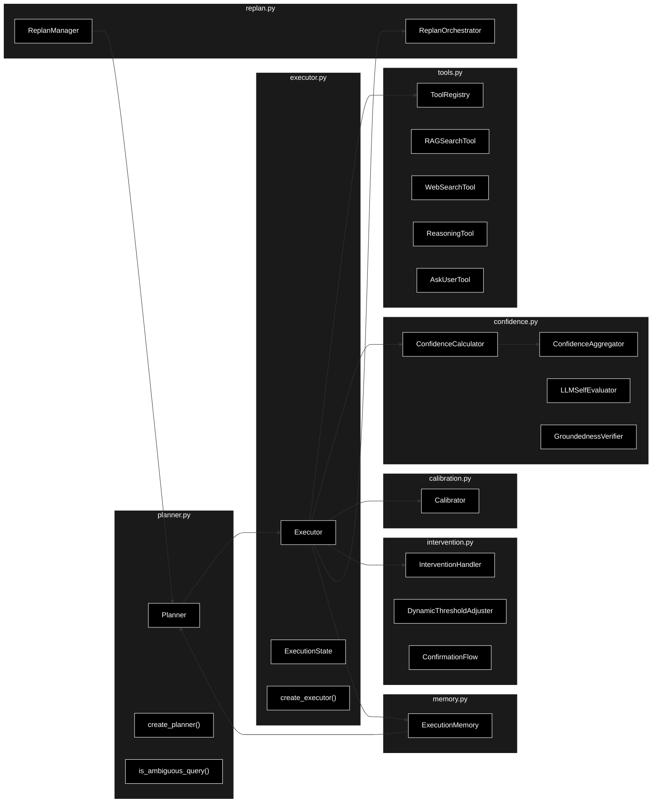
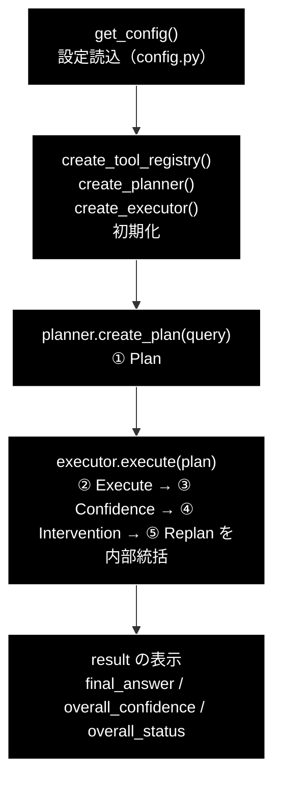
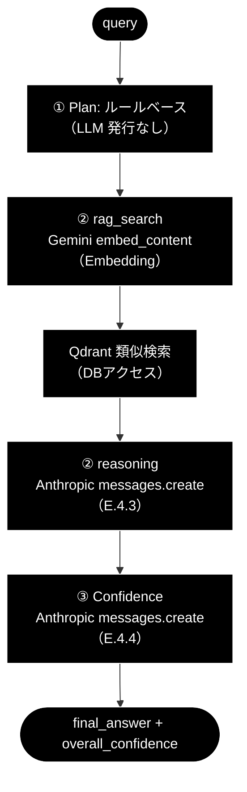

# grace_core_flow.md - GRACE コアの 5 段階設計と最小実行サンプル

**Version 1.1** | 最終更新: 2026-06-28

> **参考ドキュメント**
> - [`grace/doc/grace_core.md`](./grace_core.md) — コアモジュール群（8 モジュール）の横断アーキテクチャ（構成図・データフロー・IPO リンク集）
> - [`grace/doc/grace.md`](./grace.md) — GRACE 自律型エージェントのアーキテクチャ概説（思想・ReAct との関係）

---

## 目次

- [概要](#概要)
- [A. コアの基本構成：自律型 Agent の 5 段階設計](#a-コアの基本構成自律型-agent-の-5-段階設計)
- [B. 実装のコアモジュール構成（8 コアモジュール）](#b-実装のコアモジュール構成8-コアモジュール)
  - [B.1 モジュール構成図](#b1-モジュール構成図)
  - [B.2 モジュール間依存関係テーブル](#b2-モジュール間依存関係テーブル)
- [C. 役割サマリー](#c-役割サマリー)
- [D. 最小実行サンプル agent_example.py](#d-最小実行サンプル-agent_examplepy)
  - [D.1 プログラム全文](#d1-プログラム全文)
  - [D.2 実行フロー（5 段階との対応）](#d2-実行フロー5-段階との対応)
  - [D.3 行ごとの解説](#d3-行ごとの解説)
  - [D.4 実行方法・前提](#d4-実行方法前提)
- [E. プロンプトと API 発行部](#e-プロンプトと-api-発行部)
  - [E.1 発行される API の一覧](#e1-発行される-api-の一覧)
  - [E.2 LLM API の発行部（Anthropic）](#e2-llm-api-の発行部anthropic)
  - [E.3 Embedding API の発行部（Gemini）](#e3-embedding-api-の発行部gemini)
  - [E.4 利用プロンプト全文](#e4-利用プロンプト全文)
  - [E.5 既定クエリで実際に飛ぶ API](#e5-既定クエリで実際に飛ぶ-api)
- [F. 理解のための補足説明](#f-理解のための補足説明)
- [変更履歴](#変更履歴)

---

## 概要

`anthropic_grace_agent_v2` の**自律型エージェント**は、`grace/` パッケージの **8 つのコアモジュール**で構成される。

```
grace/planner.py      grace/executor.py    grace/confidence.py   grace/calibration.py
grace/memory.py       grace/intervention.py grace/replan.py      grace/tools.py
```

本書は、これらコアの **設計思想（5 段階設計）→ 実装構成（モジュール連携）→ 役割サマリー** を俯瞰したうえで、最小実行サンプル `agent_example.py` を題材に「実際にどう動くか」を解説する。各モジュールの IPO 詳細は `grace_core.md` と各個別ドキュメント（`planner.md` 等）に委ねる。

> 📝 **技術スタック**: LLM 用途はすべて **Anthropic Claude**（既定 `claude-sonnet-4-6`、軽量 `claude-haiku-4-5-20251001`、鍵 `ANTHROPIC_API_KEY`）。検索の Embedding のみ **Gemini** `gemini-embedding-001`（3072 次元、鍵 `GOOGLE_API_KEY`）を継続利用する。

---

## A. コアの基本構成：自律型 Agent の 5 段階設計

GRACE は ReAct（Reasoning + Acting）の暗黙的なループを **5 つの明示的フェーズ**へ昇格し、さらに実務向けに **人間介入（HITL）** を正式工程として組み込んだ。

```
① Plan（計画策定）       … ゴールまでの道筋を立てる   ← ReAct の Thought を独立工程化
② Execute（逐次実行）     … ツールを動かし結果を得る   ← ReAct の Action ＋ Observation
③ Confidence（信頼度評価）… 結果が正しいか検証する     ← Self-Reflection 由来
④ Intervention（人間介入）… AI の暴走を防ぐ HITL        ← ★GRACE の新規拡張
⑤ Replan（計画再策定）    … 失敗を踏まえ手を練り直す   ← ReAct の神髄／反省を活用
        ↺（①へ戻る）
```

| フェーズ | ルーツ | 役割 | 主担当モジュール |
|---|---|---|---|
| ① Plan | ReAct: Thought の一部 | 最初に道筋を設計 | `planner.py` |
| ② Execute | ReAct: Action + Observation | ツール実行と結果取得 | `executor.py` + `tools.py` |
| ③ Confidence | Reflection（自己反省） | 正しさ・ゴール達成を検証 | `confidence.py` + `calibration.py` |
| ④ Intervention | **GRACE 新規** | Human-in-the-Loop で暴走防止 | `intervention.py` |
| ⑤ Replan | ReAct の神髄 + 反省 | Thought に戻り次の手を再設計 | `replan.py` |

この 5 段階を 1 枚に表すと次の通り（`memory.py` は履歴を学習して①へ事前分布を還元する横串）。



---

## B. 実装のコアモジュール構成（8 コアモジュール）

5 段階設計は、実装では次の 8 モジュールに対応する。`executor.py` が司令塔となり、各モジュールと往復しながらループを駆動する。

### B.1 モジュール構成図



### B.2 モジュール間依存関係テーブル

| モジュール | 主に呼び出す相手 | 主に呼ばれる相手 |
|-----------|----------------|----------------|
| `planner.py` | `memory`（事前分布）, `llm_compat`, `schemas`, `services.qdrant_service` | `executor`, `replan`, UI |
| `executor.py` | `tools`, `confidence`, `calibration`, `intervention`, `replan`, `memory` | UI, `benchmark` |
| `tools.py` | Qdrant, Gemini Embedding, Web 検索, `llm_compat` | `executor` |
| `confidence.py` | `llm_compat`（Anthropic）, Gemini Embedding | `executor` |
| `calibration.py` | （stdlib のみ） | `executor`, 評価スクリプト |
| `memory.py` | （stdlib のみ・JSONL） | `executor`（書込）, `planner`（読込） |
| `intervention.py` | `confidence`（`InterventionLevel`/`ActionDecision`） | `executor` |
| `replan.py` | `planner`（`create_plan`/委譲） | `executor` |

---

## C. 役割サマリー

自律エージェントを構成する全モジュールの「役割サマリ」を一覧する。**#4〜#11 が 5 段階設計を担う 8 コアモジュール**、**#1〜#3 はそれを下支えする基盤モジュール**（設定・互換層・型契約）である。

| # | ファイル | 1 行サマリ | 区分 |
|---|---|---|---|
| 1 | `config.py` | 全コンポーネントの設定を Pydantic で一元管理（YAML＋環境変数） | 基盤 |
| 2 | `llm_compat.py` | google-genai 互換のまま Anthropic を呼ぶ薄いアダプタ | 基盤 |
| 3 | `schemas.py` | Plan/Step/Result/Scratchpad/Thought のデータ契約（型定義） | 基盤 |
| 4 | `planner.py` | 質問を分析し ExecutionPlan を生成（三層振り分け） | ① Plan |
| 5 | `memory.py` | 実行履歴を学習しコレクション事前分布を計画へ還元 | 横串（①へ還元） |
| 6 | `tools.py` | エージェントの「手足」＝各ツールとレジストリ | ② Execute |
| 7 | `executor.py` | 計画を実行する司令塔（Plan-Execute／ReAct ループ） | ② Execute |
| 8 | `confidence.py` | 多軸＋根拠妥当性で「どれだけ信じられるか」を採点 | ③ Confidence |
| 9 | `calibration.py` | 採点の「甘辛」を実正解率へ較正（温度スケーリング） | ③ Confidence |
| 10 | `intervention.py` | 信頼度に応じて人間に渡す／止める（HITL） | ④ Intervention |
| 11 | `replan.py` | 失敗・低信頼から計画を立て直す | ⑤ Replan |

> 📝 `planner.py` は複雑度・曖昧性に応じて「曖昧クエリの確認（ask_user）／ルールベース 2 ステップ計画／LLM 計画」へ振り分ける（**三層振り分け**）。`memory.py` は 5 段階のいずれにも属さないが、過去実績を①の計画へ還元する**横串の学習機構**である。

---

## D. 最小実行サンプル agent_example.py

上記アーキテクチャを、もっとも簡略化した形で体験できるのがリポジトリ直下の `agent_example.py` である。`planner.create_plan()`（① Plan）と `executor.execute()`（②〜⑤を内部統括）を呼ぶだけで、コア一式が動く。

### D.1 プログラム全文

```python
# agent_example.py
"""GRACE エージェントの最小実行サンプル。

planner（計画生成）→ executor（confidence/calibration/intervention/replan/memory を
内部統括）の一連の流れを 1 クエリで実行する。

前提:
- `.env` に ANTHROPIC_API_KEY（LLM 用）と GOOGLE_API_KEY（Embedding 用）を設定
- Qdrant が起動済み（既定 http://localhost:6333）で RAG コレクションが登録済み

使い方::

    python agent_example.py
    python agent_example.py "東京タワーの高さは？"
"""
from __future__ import annotations

import argparse
import os
import sys

from grace import (
    create_executor,
    create_planner,
    create_tool_registry,
    get_config,
)

# .env から ANTHROPIC_API_KEY / GOOGLE_API_KEY 等を読み込む（未導入でも続行）
try:
    from dotenv import load_dotenv

    load_dotenv()
except ImportError:
    pass

DEFAULT_QUERY = "日本の再生可能エネルギー政策の最新動向を教えて"


def run_agent(query: str = DEFAULT_QUERY):
    # 0. APIキーの存在チェック（未設定だと LLM 呼び出しで失敗する）
    if not os.getenv("ANTHROPIC_API_KEY"):
        print("⚠️ ANTHROPIC_API_KEY が未設定です。.env に設定してください。", file=sys.stderr)
        return None

    # 1. 設定の取得
    config = get_config()

    # 2. ツールレジストリと各エージェントの初期化
    tool_registry = create_tool_registry(config)
    planner = create_planner(config)
    executor = create_executor(config, tool_registry)  # confidence/calibration/intervention/replan/memory を内部初期化

    # 3. 計画の生成（planner.py）
    print(f"❓ 質問: {query}")
    plan = planner.create_plan(query)
    print(f"📋 計画: {len(plan.steps)} ステップ (complexity={plan.complexity:.2f})")

    # 4. 計画の実行（executor.py が全コンポーネントを統括）
    result = executor.execute(plan)

    # 5. 結果の確認
    print("-" * 60)
    print(f"最終回答: {result.final_answer}")
    print(f"全体信頼度（較正済み）: {result.overall_confidence:.2f}")
    print(f"ステータス: {result.overall_status}")
    return result


def main():
    parser = argparse.ArgumentParser(description="GRACE エージェントの最小実行サンプル")
    parser.add_argument(
        "query", nargs="?", default=DEFAULT_QUERY,
        help="エージェントに尋ねる質問（省略時は既定の質問を使用）",
    )
    args = parser.parse_args()

    try:
        run_agent(args.query)
    except Exception as e:  # サービス未起動・鍵未設定などを分かりやすく表示
        print(f"❌ 実行に失敗しました: {type(e).__name__}: {e}", file=sys.stderr)
        print(
            "  ヒント: Qdrant の起動（docker-compose -f docker-compose/docker-compose.yml up -d）"
            "と .env の API キーを確認してください。",
            file=sys.stderr,
        )
        sys.exit(1)


if __name__ == "__main__":
    main()
```

### D.2 実行フロー（5 段階との対応）

このサンプルが呼ぶのは**たった 2 つの公開 API**（`planner.create_plan()` と `executor.execute()`）だが、`executor.execute()` の内部で 5 段階設計の②〜⑤がすべて回る。



| サンプルの処理 | 呼び出す API | 対応するフェーズ |
|---|---|---|
| 1. 設定取得 | `get_config()` | 基盤（`config.py`） |
| 2. 初期化 | `create_tool_registry()` / `create_planner()` / `create_executor()` | 基盤（②の道具立て） |
| 3. 計画生成 | `planner.create_plan(query)` | **① Plan** |
| 4. 計画実行 | `executor.execute(plan)` | **② Execute / ③ Confidence / ④ Intervention / ⑤ Replan** |
| 5. 結果表示 | `result.final_answer` ほか | 出力 |

> 💡 `create_executor()` は引数に `tool_registry` を渡すだけだが、内部で `confidence` / `calibration` / `intervention` / `replan` / `memory` を初期化する（`executor.py` 内）。だからサンプルは 2 API だけでコア全体を動かせる。

### D.3 行ごとの解説

| 箇所 | 内容 | 補足 |
|---|---|---|
| docstring（2–15 行） | 目的・前提・使い方 | 前提は **API キー 2 種**＋**Qdrant 起動＋RAG コレクション登録済み** |
| `from grace import (...)`（22–27 行） | コアのファクトリ関数を取得 | `create_executor` / `create_planner` / `create_tool_registry` / `get_config`（`grace/__init__.py` でエクスポート） |
| `try: load_dotenv()`（30–35 行） | `.env` を読み込み環境変数化 | `python-dotenv` 未導入でも `ImportError` を握りつぶして続行（堅牢化） |
| `DEFAULT_QUERY`（37 行） | 既定の質問文 | CLI 引数省略時に使用 |
| `run_agent()` 0.（41–44 行） | `ANTHROPIC_API_KEY` の存在チェック | 未設定なら LLM 呼び出し前に明示メッセージで早期 return |
| 1.（47 行） | `get_config()` | `config.py` が YAML＋環境変数から `GraceConfig` を構築 |
| 2.（50–52 行） | レジストリ・各エージェント初期化 | `executor` が confidence/calibration/intervention/replan/memory を内包 |
| 3.（55–57 行） | `create_plan(query)` で **① Plan** | `plan.steps`（PlanStep 列）と `plan.complexity` を表示 |
| 4.（60 行） | `executor.execute(plan)` で **②〜⑤** | ブロッキング実行し `ExecutionResult` を返す |
| 5.（63–67 行） | 結果表示 | `final_answer`（Optional[str]）/ `overall_confidence`（較正済み 0.0–1.0）/ `overall_status`（success/partial/failed/cancelled） |
| `main()`（70–87 行） | CLI 化＋例外ハンドリング | 質問は位置引数（任意）。サービス未起動・鍵未設定は `type(e).__name__: e` とヒントを stderr へ |
| `if __name__ == "__main__"`（90–91 行） | エントリーポイント | これが無いと `run_agent()` が呼ばれず「実行しても何も起きない」 |

### D.4 実行方法・前提

```bash
# 1) Qdrant を起動（RAG 検索のため）
docker-compose -f docker-compose/docker-compose.yml up -d

# 2) .env に API キーを設定
#   ANTHROPIC_API_KEY=...   ← LLM（計画・推論・信頼度評価）
#   GOOGLE_API_KEY=...      ← Embedding（RAG 検索のベクトル化）

# 3) 実行（既定の質問 / 任意の質問）
python agent_example.py
python agent_example.py "東京タワーの高さは？"
```

**出力例（イメージ）**:

```
❓ 質問: 日本の再生可能エネルギー政策の最新動向を教えて
📋 計画: 2 ステップ (complexity=0.65)
------------------------------------------------------------
最終回答: 日本の再生可能エネルギー政策は……（以下、生成された回答）
全体信頼度（較正済み）: 0.83
ステータス: success
```

> ⚠️ Qdrant 未起動や API キー未設定の場合は、生のスタックトレースではなく `❌ 実行に失敗しました: ...` とヒントが表示される（`main()` の例外ハンドリング）。

---

## E. プロンプトと API 発行部

`agent_example.py` を実行したときに、内部で**実際にどの API が発行され、どんなプロンプトが送られるか**を実コードとともに示す。GRACE 本体は google-genai 形式の `client.models.generate_content(...)` のまま書かれており、`grace/llm_compat.py` がそれを Anthropic の `messages.create(...)` に変換している点が要となる。

### E.1 発行される API の一覧

| API | プロバイダ | 発行場所（実コード） | 用途 | 鍵 |
|---|---|---|---|---|
| **LLM テキスト生成** | Anthropic Claude | `grace/llm_compat.py` `messages.create(**kwargs)` | 計画生成・推論・信頼度評価 | `ANTHROPIC_API_KEY` |
| **Embedding** | Gemini | `helper/helper_embedding.py` `embed_content(**kwargs)` | RAG 検索クエリのベクトル化 | `GOOGLE_API_KEY` |
| **ベクトル検索** | Qdrant（DB） | `qdrant_client_wrapper` 経由 | 類似チャンク取得（LLM ではない） | - |

### E.2 LLM API の発行部（Anthropic）

GRACE 内のすべての LLM 呼び出しは、最終的にこの 1 箇所（`messages.create`）に集約される。

```python
# grace/llm_compat.py（_AnthropicModels.generate_content）
def generate_content(self, model=None, contents=None, config=None, **_kwargs):
    cfg = _extract_config(config)                 # temperature / max_output_tokens / json 指定を取り出す
    prompt = contents if isinstance(contents, str) else str(contents)

    # JSON 出力要求（計画生成など）なら、厳密 JSON を強制するシステム指示を付与
    want_json = bool(cfg.get("response_mime_type") == "application/json"
                     or cfg.get("response_schema") is not None)
    system_parts = []
    if want_json:
        system_parts.append(
            "あなたは厳密な JSON ジェネレーターです。"
            "出力は有効な JSON オブジェクト 1 個のみとし、"
            "Markdown のコードブロックや説明文を一切含めないでください。"
        )
        hint = _schema_hint(cfg.get("response_schema"))   # Pydantic の JSON Schema
        if hint:
            system_parts.append(f"出力は次の JSON Schema に厳密に従ってください:\n{hint}")
    system_prompt = "\n\n".join(system_parts) if system_parts else None

    max_tokens = cfg.get("max_output_tokens") or 2048     # Anthropic は max_tokens 必須
    kwargs = {
        "model": model_name,                              # 既定 claude-sonnet-4-6
        "max_tokens": int(max_tokens),
        "messages": [{"role": "user", "content": prompt}],
    }
    if system_prompt:           kwargs["system"] = system_prompt
    if temperature is not None: kwargs["temperature"] = float(temperature)

    message = self._get_client().messages.create(**kwargs)   # ★ここが実際の Anthropic API 発行
```

**解説**:
- `generate_content(model, contents, config)`（genai 形式）→ `anthropic.Anthropic().messages.create(model, max_tokens, messages, system, temperature)` に変換される。
- クライアントは遅延生成で、鍵は環境変数 `ANTHROPIC_API_KEY` から解決する。
- JSON を要求する呼び出し（＝計画生成）では、上記の「厳密な JSON ジェネレーター」システム指示と Pydantic スキーマを自動付与し、戻り値から `_strip_to_json()` で純粋な JSON 本体だけを取り出す。

クライアント生成はプロバイダで分岐する。

```python
# grace/llm_compat.py（create_chat_client）
provider = (config.llm.provider or "anthropic").lower()
if provider in {"gemini", "google", "google-genai", "genai"}:
    from google import genai
    return genai.Client()                  # Embedding 用など
return AnthropicGenaiClient(default_model=model)   # ← 既定はこちら（Anthropic）
```

### E.3 Embedding API の発行部（Gemini）

RAG 検索（`rag_search`）でクエリをベクトル化する際に Gemini Embedding が発行される。LLM が Anthropic でも、**検索の Embedding だけは Gemini を継続利用**する（プロジェクトの恒久ルール）。

```python
# helper/helper_embedding.py（embed_text）
def embed_text(self, text, task_type=None):
    config = {"output_dimensionality": self._dims}        # 3072 次元
    kwargs = {"model": self.model,                         # gemini-embedding-001
              "contents": text,
              "config": config}
    response = self.client.models.embed_content(**kwargs)  # ★ここが実際の Gemini API 発行
    return response.embeddings[0].values
```

得たベクトルで Qdrant を類似検索し、上位チャンクを `reasoning` プロンプトの【参照情報】に渡す。

### E.4 利用プロンプト全文

`agent_example.py` の流れで使われるプロンプトの**全文**を以下に示す（プレースホルダ `{...}` は実行時に埋め込まれる）。

#### E.4.1 計画生成プロンプト（① Plan・LLM 計画経路）

`PLAN_GENERATION_PROMPT`（`grace/planner.py`）。末尾の `{SEARCH_QUERY_INSTRUCTION}` は別ファイルの定数が展開される（後掲）。

```text
あなたは計画策定の専門家です。ユーザーの質問を分析し、回答を生成するための実行計画を作成してください。

【利用可能なアクション】
- rag_search: ベクトルDB（Qdrant）から関連情報を検索（社内ドキュメント・FAQ向け）
- web_search: Web検索で最新情報や一般的な情報を取得（最新ニュース・外部情報向け）
- reasoning: 収集した情報を分析・統合して回答を生成
- ask_user: ユーザーに追加情報や確認を求める

【利用可能なコレクション (rag_search用)】
{available_collections}

【コレクション選択のルール (重要)】
- `rag_search` の `collection` 引数は、原則として指定しないでください（`null` または省略）。
   * 特定のコレクション（例: wikipedia_ja）に限定せず、利用可能なすべてのコレクションから網羅的に検索を行うためです。
   * システム側で自動的に最適なコレクション順序で検索を実行します。
- 例外: ユーザーが明示的に「livedoorニュースから検索して」のように指定した場合のみ、そのコレクション名を指定してください。

【検索クエリの作成ルール】
- `rag_search` の `query` 引数は、ユーザーの質問文を極力そのまま使用してください。
   * 単語の羅列（例: "金色夜叉 尾崎紅葉"）に変換せず、自然言語の文脈
   （例:"〜の構成者は誰ですか？"）を維持することで、ベクトル検索の精度が向上します。

【計画作成のルール (厳守)】
1. 検索アクション（rag_search）は、可能な限り「1つのステップ」にまとめてください。
    * 質問を分解して複数の検索ステップを作らないでください。
2. `rag_search` の `query` は、ユーザーの元の質問文を「完全一致でコピー」してください。
    * 要約、キーワード化、分割は一切禁止です。
    * 悪い例: "金色夜叉 構成者"
    * 良い例: "『金色夜叉:尾崎紅葉不如帰:徳富蘆花』の構成者は誰ですか？"
3. 依存関係を正しく設定してください（depends_onは先行ステップのIDのみ）。
4. 失敗時の代替手段（fallback）を検討してください。
5. 最後のステップは必ず "reasoning" で回答を生成してください
6. rag_search と web_search の使い分け:
    * 計画には web_search ステップを含めないでください
    * web_search は、rag_search の結果が不十分な場合に executor が自動的に実行します
    * 計画は常に rag_search → reasoning の2ステップ構成としてください
    * rag_search の fallback には "web_search" を指定してください
    * 例外: ユーザーが明示的に「最新ニュースを検索して」等と指示した場合のみ、
      web_search 単体のステップを計画に含めてよい

{SEARCH_QUERY_INSTRUCTION}

【計画の複雑度(complexity)の目安】
- 0.0-0.3: 単純な質問（1-2ステップ）
- 0.4-0.6: 中程度の質問（2-3ステップ）
- 0.7-1.0: 複雑な質問（4ステップ以上）

【requires_confirmationをtrueにする条件】
- 質問が曖昧で複数の解釈が可能な場合
- 実行に時間がかかる可能性がある場合
- 外部リソースへのアクセスが必要な場合

ユーザーの質問: {query}

JSON形式で実行計画を出力してください。
```

埋め込まれる `SEARCH_QUERY_INSTRUCTION`（`services/prompts.py`）の全文:

```text
**重要: 検索クエリ作成のルール（最高精度を出すためのガイドライン）**
- 検索クエリは、質問文から「いつ」「誰」「何」などの具体的な要素を抽出し、それらをスペースで区切ったキーワードのリストとして作成してください。
- 助詞や助動詞（〜の、〜は、〜ですか？）は極力省き、重要な名詞と動詞のみを残してください。
- ユーザーの質問に含まれる具体的な文脈（「初めて」「受賞」など）を決して省略しないでください。

**良い例 (検索スコア 0.8333 を達成したクエリ):**
質問: 「浦沢直樹が初めて受賞したのはいつ、何の賞ですか？」
クエリ: 「浦沢直樹 初めて受賞 いつ 何の賞」

**悪い例:**
- 「浦沢直樹 初受賞」（要素が削られすぎてマッチング精度が低下）
- 「浦沢直樹が初めて受賞したのはいつですか？」（助詞が多く検索ノイズになる）
```

このプロンプトを送る発行部（JSON 強制つき）:

```python
# grace/planner.py（_generate_plan_with_retry）
config = {
    "response_mime_type": "application/json",   # ← JSON 強制（llm_compat が system 指示＋スキーマを付与）
    "response_schema": ExecutionPlan,           # Pydantic スキーマ
    "temperature": self.config.llm.temperature,
}
response = self.client.models.generate_content(
    model=self.model_name, contents=prompt, config=config,
)
```

> ⚠️ **重要**: 既定クエリ「日本の再生可能エネルギー政策の最新動向を教えて」のように、複雑度が閾値（0.7）未満かつ Web 検索マーカー（"最新ニュース" 等）を含まない質問では、planner は **LLM を使わずルールベースで 2 ステップ計画**（`rag_search → reasoning`）を組む。この場合 E.4.1 の計画生成プロンプトは**発行されない**（LLM 計画経路に入ったときのみ発行）。

#### E.4.2 複雑度推定プロンプト（LLM 複雑度を使う経路）

`COMPLEXITY_ESTIMATION_PROMPT`（`grace/planner.py`）。既定の複雑度推定はキーワードベースのヒューリスティック（LLM 不使用）で、このプロンプトは LLM 複雑度推定を呼ぶ経路でのみ発行される。

```text
以下の質問の複雑度を0.0から1.0の数値で評価してください。

評価基準:
- 0.0-0.2: 非常に単純（事実確認、定義の質問）
- 0.3-0.4: 単純（1つのトピックについての説明）
- 0.5-0.6: 中程度（比較、分析が必要）
- 0.7-0.8: 複雑（複数のソースからの情報統合が必要）
- 0.9-1.0: 非常に複雑（専門知識、多段階の推論が必要）

質問: {query}

数値のみを回答してください（例: 0.5）
```

#### E.4.3 推論プロンプト（② Execute の reasoning ステップ・ほぼ必ず発行）

`ReasoningTool._build_prompt()`（`grace/tools.py`）が「システム指示＋【参照情報】＋【補足コンテキスト】＋【ユーザーの質問】＋【回答の構成ルール】」を連結する。リテラル部分の全文は次の通り（【参照情報】は RAG 結果から動的に生成）。

```text
あなたは社内ドキュメント検索システムと連携した「ハイブリッド・ナレッジ・エージェント」です。
提供された【参照情報】を元に、ユーザーの質問に対して正確で誠実な回答を生成してください。

### 【参照情報】
--- 情報源 {i} (信頼度: {score}, コレクション: {collection}) ---
Q: {question}
A: {answer}
出典: {source}
（RAG 検索でヒットした各チャンクを上記フォーマットで列挙。Q/A が無い場合は content 先頭1000字）

### 【補足コンテキスト】
{context}            ← 他ステップの出力がある場合のみ

### 【ユーザーの質問】
{query}

### 【回答の構成ルール（最重要）】
1. **正確性と誠実さ**: 参照情報にある事実のみを述べてください。情報がない場合は「提供された情報源には見当たりませんでした」と正直に回答してください。
2. **判明した事実を優先**: 質問に対する直接的な回答が見つかった場合は、それを最初に簡潔に述べてください。
3. **出典の明示**: 回答の根拠となった情報がある場合、「社内ナレッジ（出典ファイル名）によると...」の形式で出典を明示してください。
4. **丁寧な日本語**: です・ます調で、読みやすく構造化（箇条書き等）して回答してください。
5. **捏造禁止**: あなた自身の事前知識で情報を補完したり、勝手な推測で回答を作成したりしないでください。

上記のルールに従い、プロフェッショナルな回答を生成してください。
```

このプロンプトを送る発行部:

```python
# grace/tools.py（ReasoningTool.execute）
prompt = self._build_prompt(query, context, sources)
response = self.client.models.generate_content(
    model=self.model_name, contents=prompt,
    config={"temperature": self.config.llm.temperature,
            "max_output_tokens": self.config.llm.max_tokens},
)
answer = response.text
```

#### E.4.4 信頼度評価プロンプト群（③ Confidence・複数発行）

`executor.execute()` は最終回答後、信頼度を LLM で採点する（`grace/confidence.py`）。いずれも E.2 と同じ `generate_content → messages.create` 経路で Anthropic に発行される。実際に使われる全文を示す。

**(1) 最終評価（確信度＋網羅度）`LLMSelfEvaluator.FINAL_EVAL_PROMPT`** — `evaluate_final()` で 1 回にまとめて評価:

```text
以下の【質問】に対する【回答】を2つの観点で評価し、JSON形式で出力してください。

【観点1: 確信度 (self_eval_score)】
- 正確性: 回答は提供された情報源に基づいているか？捏造はないか？
- 適切性: 質問に直接的かつ明確に答えているか？
- スタイル: 丁寧で読みやすい日本語（です・ます調）か？
スコア目安: 1.0=完全に正確・適切 / 0.6=やや確信あり / 0.4=不確実 / 0.0=不適切

【観点2: 網羅度 (coverage_score)】
- 質問のすべての要素をカバーしているか？
スコア目安: 1.0=すべての要素に回答 / 0.6=主要な要素に回答 / 0.2=ほとんど回答できていない

質問: {query}
回答: {answer}
使用した情報源: {sources}
```

**(2) 単一確信度評価 `LLMSelfEvaluator.EVAL_PROMPT`** — `evaluate()`（個別評価）で使用:

```text
以下の基準に基づいて、回答の確信度を0.0から1.0の数値で評価してください。

【評価基準】
1. 正確性 (Accuracy):
   - 回答は提供された情報源（検索結果）に基づいているか？
   - 情報源にない情報を捏造していないか？
2. 適切性 (Relevance):
   - ユーザーの質問に直接的かつ明確に答えているか？
   - 質問の意図を正しく理解しているか？
3. スタイル (Style):
   - 親しみやすく、丁寧な日本語（です・ます調）か？
   - 読みやすい構成か？

【スコアの目安】
- 1.0: 完全に正確で、適切かつスタイルも完璧（複数の信頼できる情報源で確認済み）
- 0.8: ほぼ確実（信頼できる情報源あり、回答も適切）
- 0.6: やや確信あり（関連情報はあるが、完全ではない、またはスタイルに改善の余地あり）
- 0.4: 不確実（情報が限定的、または質問への回答として不十分）
- 0.2: 推測に近い（根拠が弱い）
- 0.0: 全く分からない、または不適切な回答

質問: {query}
回答: {answer}
使用した情報源: {sources}

確信度（0.0-1.0の数値のみ回答）:
```

**(3) クエリ網羅度 `QueryCoverageCalculator.COVERAGE_PROMPT`**:

```text
以下の質問に対する回答が、質問のすべての要素をカバーしているか評価してください。

質問: {query}
回答: {answer}

網羅度（0.0-1.0の数値のみ回答）:
- 1.0: すべての質問要素に完全に回答
- 0.8: ほぼすべての要素に回答
- 0.6: 主要な要素に回答
- 0.4: 一部の要素のみに回答
- 0.2: ほとんど回答できていない
- 0.0: 全く回答できていない

数値のみ回答:
```

**(4) 根拠妥当性（groundedness）`GroundednessVerifier.PROMPT`** — 回答の各主張が引用ソースに支持されるかを判定（S1 中核）:

```text
あなたは厳密なファクトチェッカーです。
【回答】を短い主張（claim）に分解し、各主張が【情報源】によって
支持されるか判定してください。判定は次の3値のみです。

- supported   : 情報源の記述から主張が読み取れる（含意される）
- contradicted: 情報源と主張が矛盾する
- neutral     : 情報源に関連記述がなく判断できない

あなた自身の事前知識は使わず、提示された【情報源】のみを根拠にしてください。

# 質問
{query}

# 回答
{answer}

# 情報源
{sources}
```

### E.5 既定クエリで実際に飛ぶ API

「日本の再生可能エネルギー政策の最新動向を教えて」（ルールベース計画になる典型例）の場合、発行される API は次の順になる。



| 順 | フェーズ | 発行 API | 使うプロンプト |
|---|---|---|---|
| 1 | ① Plan | （LLM 発行なし＝ルールベース） | - |
| 2 | ② Execute / rag_search | Gemini `embed_content` → Qdrant 検索 | （プロンプトなし・ベクトル化） |
| 3 | ② Execute / reasoning | Anthropic `messages.create` | E.4.3 推論プロンプト |
| 4 | ③ Confidence | Anthropic `messages.create`（複数） | E.4.4（最終評価・groundedness 等） |

> 複雑な質問・Web 検索マーカー付きの質問では、これに加えて **E.4.1 計画生成プロンプト**が Anthropic に 1 回発行される（LLM 計画経路）。

---

## F. 理解のための補足説明

サンプルを読み解くうえで押さえておきたい概念を補足する。

- **ExecutionPlan / PlanStep / StepResult**（`schemas.py`）: 計画は `ExecutionPlan`、その中の 1 手が `PlanStep`、実行結果が `StepResult`。`PlanStep.action` は `ActionType`（`rag_search` / `web_search` / `reasoning` / `ask_user`）を取る。サンプルの `plan.steps` はこの `PlanStep` の並び。
- **① Plan の三層振り分け**（`planner.py`）: ①曖昧クエリは確認（`ask_user`）計画、②複雑度 `< 0.7` はルールベース 2 ステップ計画（`rag_search → reasoning`）、③複雑度 `≥ 0.7` または Web 検索マーカーで LLM 計画。
- **② Execute と動的フォールバック**（`executor.py` + `tools.py`）: ステップを順に実行し、RAG 検索のスコア・適合性に応じて `web_search` → `ask_user` を**動的に挿入／スキップ**する。各ツールは `ToolRegistry.execute(name)` で呼ばれ、結果は `ToolResult` に統一される。
- **③ Confidence（多軸＋較正）**（`confidence.py` + `calibration.py`）: 検索品質・LLM 自己評価・ソース一致・根拠妥当性（groundedness）を統合してスコア化し、`Calibrator` の温度スケーリングで「甘辛」を実正解率へ較正する。閾値は `silent=0.9 / notify=0.7 / confirm=0.4`。サンプルの `overall_confidence` はこの**較正済み**値。
- **④ Intervention（HITL）**（`intervention.py`）: 信頼度に応じて SILENT（自動進行）／NOTIFY（通知）／CONFIRM（確認）／ESCALATE（要ユーザー入力）にゲートする。`agent_example.py` は非対話のブロッキング実行のため、CONFIRM 相当でも自動進行する（UI 連携時は `execute_plan_generator()` を使い逐次イベントを描画する）。
- **⑤ Replan**（`replan.py`）: ステップ失敗・低信頼度・ユーザーフィードバックを契機に、戦略（FULL/PARTIAL/FALLBACK/SKIP/ABORT）を選び `planner.create_plan()` へ委譲して計画を立て直す（既定 `max_replans=3`）。
- **memory（横串の学習）**（`memory.py`）: `executor` が「どのコレクションで・成功したか・どれだけ自信があったか」を JSONL に記録し、`planner` が次回 `best_collection()` で優先コレクションを絞り込む（件数 ≥ 3 かつ score ≥ 0.6 で発火）。詳細は `grace_core.md` の「実行メモリが貯まるまで」章を参照。
- **基盤（config / llm_compat / schemas）**: `get_config()` は `config.py` が YAML＋環境変数から `GraceConfig` を構築。LLM 呼び出しは `llm_compat.create_chat_client()` が **google-genai 互換 IF のまま Anthropic** を呼ぶ。型契約は `schemas.py`。
- **ブロッキング実行とジェネレータ実行**: `executor.execute(plan)` は完了まで待つブロッキング版。Streamlit UI（`agent_rag.py`）では `execute_plan_generator(plan)` を使い、`log` / `tool_call` / `tool_result` / `final_answer` などの中間イベントを逐次表示する。

---

## 変更履歴

| バージョン | 変更内容 |
|-----------|---------|
| 1.0 | 初版作成。参考ドキュメント（`grace_core.md` / `grace.md`）の明示、A: 5 段階設計、B: 8 コアモジュール構成（構成図＋依存テーブル）、C: 役割サマリー、D: `agent_example.py` の全文・実行フロー・行解説・実行方法、E: 補足説明を整備 |
| 1.1 | D の直後に「E. プロンプトと API 発行部」を追加（API 発行部の実コード、利用プロンプト全文＝計画生成／複雑度推定／推論／信頼度評価群、既定クエリの API 発行順フロー図）。旧 E「理解のための補足説明」を F に繰り下げ |
