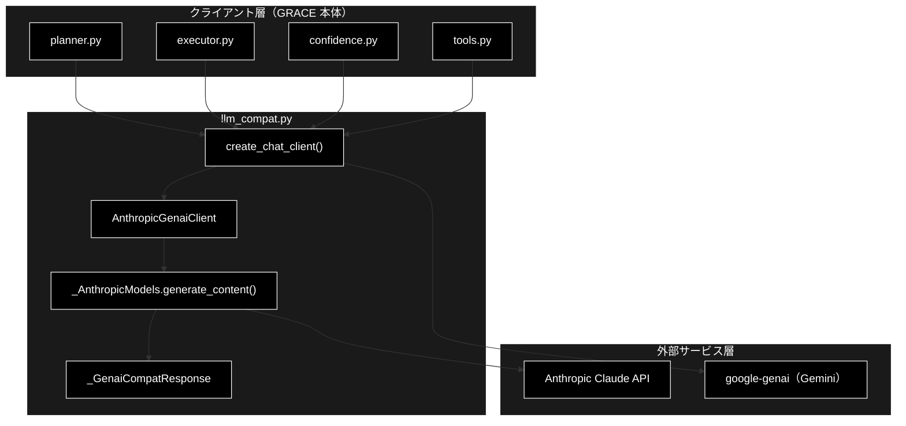
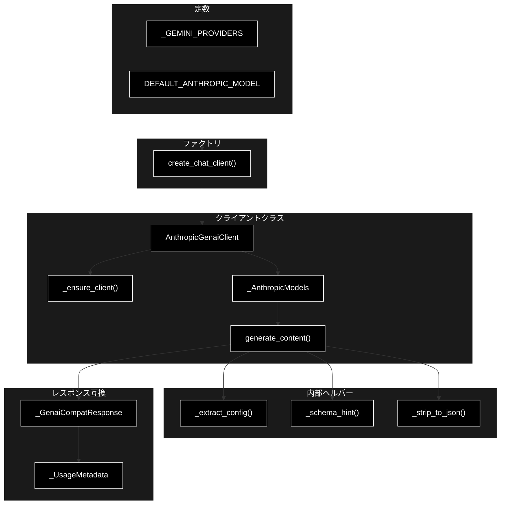
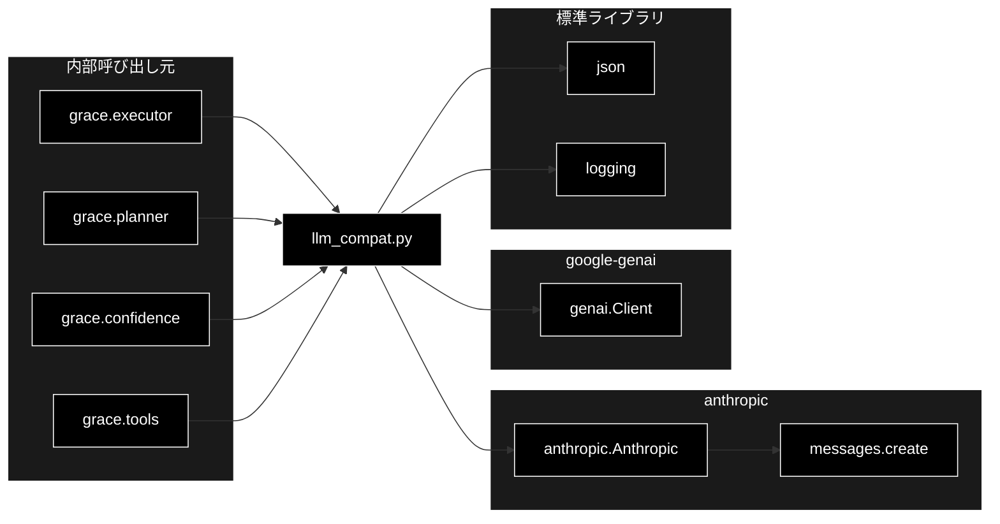

# llm_compat.py - GRACE LLM 互換クライアント ドキュメント

**Version 1.0** | 最終更新: 2026-06-16

---

## 目次

1. [概要](#概要)
2. [アーキテクチャ構成図](#1-アーキテクチャ構成図)
3. [モジュール構成図](#2-モジュール構成図)
4. [クラス・関数一覧表](#3-クラス関数一覧表)
5. [クラス・関数 IPO詳細](#4-クラス関数-ipo詳細)
6. [設定・定数](#5-設定定数)
7. [使用例](#6-使用例)
8. [エクスポート](#7-エクスポート)
9. [変更履歴](#8-変更履歴)
10. [付録: 依存関係図](#付録-依存関係図)

---

## 概要

`llm_compat.py`は、GRACE 本体（planner / executor / confidence / tools）が当初 google-genai の `client.models.generate_content(...)` 形式で実装されていたインターフェースを保ったまま、LLM プロバイダーとして **Anthropic Claude** を呼び出すためのアダプター層です。

各呼び出しサイトのコードは以下の形を維持できます（クライアント生成のみ `create_chat_client(config)` に置き換える）。

```python
response = client.models.generate_content(
    model=...,
    contents="...",
    config=types.GenerateContentConfig(...),
)
text = response.text
```

Embedding（`client.models.embed_content`）は Gemini（`gemini-embedding-001`・3072次元）を継続利用するため、本アダプターは LLM テキスト生成（generate_content）のみを対象とします。

### 主な責務

- genai 互換インターフェース（`.models.generate_content`）を保ったまま Anthropic Claude へ橋渡しする
- `types.GenerateContentConfig` から temperature / max_output_tokens / response_mime_type / response_schema を抽出し Anthropic API パラメータへ変換する
- JSON 出力要求時にシステム指示・スキーマヒントを付与し、応答から純粋な JSON 本体を抽出する
- genai 互換のレスポンスオブジェクト（`.text` / `.parsed` / `.usage_metadata`）を構築する
- config のプロバイダー設定に応じて Gemini クライアントと Anthropic 互換クライアントを切り替えるファクトリを提供する

### 各責務対応のモジュール

| # | 責務 | 対応モジュール | 説明 |
|---|------|--------------|------|
| 1 | genai 互換インターフェースの提供 | `llm_compat.py` | `AnthropicGenaiClient` / `_AnthropicModels` が `.models.generate_content` を実装 |
| 2 | 設定変換（config → Anthropic パラメータ） | `llm_compat.py` | `_extract_config()` が必要キーを抽出 |
| 3 | JSON 出力の補助 | `llm_compat.py` | `_schema_hint()` / `_strip_to_json()` がスキーマ提示と JSON 抽出を担当 |
| 4 | genai 互換レスポンスの構築 | `llm_compat.py` | `_GenaiCompatResponse` / `_UsageMetadata` |
| 5 | プロバイダー切り替えファクトリ | `llm_compat.py` | `create_chat_client()` が Gemini / Anthropic を分岐 |

### 主要機能一覧

| 機能 | 説明 |
|------|------|
| `AnthropicGenaiClient` | genai.Client 互換の Anthropic クライアント |
| `AnthropicGenaiClient.__init__()` | コンストラクタ（既定モデル・APIキー指定、クライアントは遅延生成） |
| `AnthropicGenaiClient._ensure_client()` | anthropic SDK を遅延 import し Anthropic クライアントを生成 |
| `_AnthropicModels` | `client.models` 互換ラッパー（generate_content のみ） |
| `_AnthropicModels.generate_content()` | genai 互換シグネチャで Anthropic `messages.create` を呼ぶ |
| `_GenaiCompatResponse` | genai レスポンス互換オブジェクト（`.text` / `.parsed` / `.usage_metadata`） |
| `_UsageMetadata` | genai usage_metadata 互換オブジェクト |
| `create_chat_client()` | config に応じて Gemini / Anthropic 互換クライアントを返すファクトリ |
| `_extract_config()` | GenerateContentConfig から設定を抽出 |
| `_schema_hint()` | response_schema から JSON Schema ヒントを生成 |
| `_strip_to_json()` | Markdown フェンス等を除去し JSON 本体を抽出 |

---

## 1. アーキテクチャ構成図

### 1.1 システム全体構成



### 1.2 データフロー

1. GRACE 本体が `create_chat_client(config)` でクライアントを取得する
2. config.llm.provider に応じて Gemini クライアントまたは `AnthropicGenaiClient` が返る
3. 呼び出しサイトが `client.models.generate_content(model, contents, config)` を実行する
4. `_AnthropicModels` が `config` を抽出し、JSON 要求時はシステム指示を付与して Anthropic `messages.create` を呼ぶ
5. Anthropic 応答の text ブロックを連結し、JSON モード時は JSON 本体を抽出する
6. `.text` / `.usage_metadata` を持つ genai 互換レスポンスを返却する

---

## 2. モジュール構成図

### 2.1 内部モジュール構成



### 2.2 外部依存関係

| ライブラリ | バージョン | 用途 |
|-----------|-----------|------|
| `anthropic` | - | Anthropic Claude API クライアント（遅延 import） |
| `google-genai` | - | Gemini プロバイダー利用時のクライアント（遅延 import） |
| `json`（標準） | - | JSON Schema 生成・JSON 本体抽出 |
| `logging`（標準） | - | ロガー取得 |

### 2.3 内部依存モジュール

| モジュール | 用途 |
|-----------|------|
| `grace.executor` | `create_chat_client` を利用（呼び出し元） |
| `grace.planner` | `create_chat_client` を利用（呼び出し元） |
| `grace.confidence` | `create_chat_client` を利用（呼び出し元） |
| `grace.tools` | `create_chat_client` を利用（呼び出し元） |

---

## 3. クラス・関数一覧表

### 3.1 クラス一覧

#### AnthropicGenaiClient

| メソッド | 概要 |
|---------|------|
| `__init__(default_model, api_key=None)` | コンストラクタ（既定モデル・APIキー指定、SDK は遅延生成） |
| `_ensure_client()` | anthropic SDK を遅延 import し Anthropic クライアントを生成 |

#### _AnthropicModels

| メソッド | 概要 |
|---------|------|
| `__init__(client_getter, default_model)` | クライアント遅延取得 callable と既定モデルを保持 |
| `generate_content(model=None, contents=None, config=None, **_kwargs)` | genai 互換シグネチャで Anthropic を呼ぶ |

#### _GenaiCompatResponse

| メソッド | 概要 |
|---------|------|
| `__init__(text, usage=None)` | `.text` / `.parsed` / `.usage_metadata` を保持 |

#### _UsageMetadata

| メソッド | 概要 |
|---------|------|
| `__init__(prompt_token_count=0, candidates_token_count=0)` | トークン使用量を保持 |

### 3.2 関数一覧（カテゴリ別）

#### ファクトリ関数

| 関数名 | 概要 |
|-------|------|
| `create_chat_client(config=None)` | config に応じて Gemini / Anthropic 互換クライアントを返す |

#### 内部ヘルパー関数

| 関数名 | 概要 |
|-------|------|
| `_extract_config(config)` | GenerateContentConfig から設定キーを抽出 |
| `_schema_hint(response_schema)` | response_schema から JSON Schema ヒント文字列を生成 |
| `_strip_to_json(text)` | Markdown フェンス・散文を除去し JSON 本体を抽出 |

---

## 4. クラス・関数 IPO詳細

### 4.1 AnthropicGenaiClient クラス

`genai.Client` 互換の Anthropic クライアント。`.models.generate_content(...)` のみをサポートする。

#### コンストラクタ: `__init__`

**概要**: 既定モデルと API キーを保持し、`.models` に `_AnthropicModels` を割り当てる。SDK import や API キー検証は行わず、最初の generate_content 呼び出し時に遅延生成する。

```python
AnthropicGenaiClient(default_model: str, api_key: Optional[str] = None)
```

| パラメータ | 型 | デフォルト | 説明 |
|------------|------|-----------|------|
| `default_model` | str | - | 既定モデル名（model 未指定時に使用） |
| `api_key` | Optional[str] | None | API キー。None の場合は環境変数から解決 |

| 項目 | 内容 |
|------|------|
| **Input** | `default_model: str`, `api_key: Optional[str] = None` |
| **Process** | 1. 既定モデル・APIキーを保持<br>2. `_client` を None に初期化（遅延生成）<br>3. `self.models = _AnthropicModels(self._ensure_client, default_model)` |
| **Output** | `AnthropicGenaiClient` インスタンス |

**戻り値例**:
```python
# AnthropicGenaiClient インスタンス（.models 属性を持つ）
client.models  # -> _AnthropicModels
```

```python
# 使用例
from grace.llm_compat import AnthropicGenaiClient

client = AnthropicGenaiClient(default_model="claude-sonnet-4-6")
# 構築時点では anthropic SDK は import されない
```

#### メソッド: `_ensure_client`

**概要**: anthropic パッケージを遅延 import し、Anthropic クライアントを 1 度だけ生成して返す。

```python
def _ensure_client(self) -> Any
```

| パラメータ | 型 | デフォルト | 説明 |
|------------|------|-----------|------|
| なし | - | - | self のみ |

| 項目 | 内容 |
|------|------|
| **Input** | なし（selfのみ） |
| **Process** | 1. `_client` が None なら `import anthropic`（失敗時 ImportError）<br>2. `api_key` 指定時は `anthropic.Anthropic(api_key=...)`、未指定時は `anthropic.Anthropic()`<br>3. 生成済みクライアントを返す |
| **Output** | `anthropic.Anthropic`: Anthropic クライアント |

**戻り値例**:
```python
# anthropic.Anthropic インスタンス
# APIキー・ベースURLは ANTHROPIC_API_KEY / ANTHROPIC_BASE_URL から解決
```

```python
# 使用例（内部呼び出し）
anthropic_client = client._ensure_client()
message = anthropic_client.messages.create(model="claude-sonnet-4-6", max_tokens=1024, messages=[...])
```

### 4.2 _AnthropicModels クラス

genai の `client.models` 互換ラッパー（generate_content のみ）。

#### コンストラクタ: `__init__`

**概要**: クライアントを遅延生成する callable と既定モデル名を保持する。

```python
_AnthropicModels(client_getter: Any, default_model: str)
```

| パラメータ | 型 | デフォルト | 説明 |
|------------|------|-----------|------|
| `client_getter` | Any | - | 呼び出し時に Anthropic クライアントを返す callable |
| `default_model` | str | - | model 未指定時に使う既定モデル名 |

| 項目 | 内容 |
|------|------|
| **Input** | `client_getter: Any`, `default_model: str` |
| **Process** | client_getter と default_model を内部に保持 |
| **Output** | `_AnthropicModels` インスタンス |

**戻り値例**:
```python
# _AnthropicModels インスタンス（generate_content を提供）
```

```python
# 使用例（AnthropicGenaiClient 内部で生成される）
models = _AnthropicModels(client._ensure_client, "claude-sonnet-4-6")
```

#### メソッド: `generate_content`

**概要**: genai 互換シグネチャで呼び出され、config を Anthropic パラメータに変換して `messages.create` を実行し、genai 互換レスポンスを返す。

```python
def generate_content(
    self,
    model: Optional[str] = None,
    contents: Any = None,
    config: Any = None,
    **_kwargs: Any,
) -> _GenaiCompatResponse
```

| パラメータ | 型 | デフォルト | 説明 |
|------------|------|-----------|------|
| `model` | Optional[str] | None | モデル名。None なら既定モデル |
| `contents` | Any | None | プロンプト本文（GRACE 本体では常に str） |
| `config` | Any | None | `types.GenerateContentConfig` 相当の設定オブジェクト |
| `**_kwargs` | Any | - | 互換のため受け取るが未使用 |

| 項目 | 内容 |
|------|------|
| **Input** | `model: Optional[str] = None`, `contents: Any = None`, `config: Any = None`, `**_kwargs` |
| **Process** | 1. `_extract_config(config)` で設定抽出、model 未指定なら既定モデル<br>2. contents を文字列化<br>3. response_mime_type=="application/json" または response_schema 有で JSON 要求と判定し system 指示・スキーマヒントを付与<br>4. max_tokens（未指定時 2048）・temperature を組み立て `messages.create` を呼ぶ<br>5. content の text ブロックを連結<br>6. JSON 要求時は `_strip_to_json` で JSON 本体を抽出<br>7. usage から `_UsageMetadata` を構築 |
| **Output** | `_GenaiCompatResponse`: `.text` / `.parsed`(None) / `.usage_metadata` |

**戻り値例**:
```python
# _GenaiCompatResponse
response.text             # "生成されたテキスト"
response.parsed           # None
response.usage_metadata.prompt_token_count      # 120
response.usage_metadata.candidates_token_count  # 340
```

```python
# 使用例
response = client.models.generate_content(
    model="claude-sonnet-4-6",
    contents="日本の首都はどこですか？",
    config=None,
)
print(response.text)
# 東京です。
```

### 4.3 _GenaiCompatResponse クラス

genai の generate_content レスポンス互換オブジェクト。呼び出しサイトが参照する属性のみを提供する。

#### コンストラクタ: `__init__`

**概要**: 生成テキスト・parsed（常に None）・usage_metadata を保持する。

```python
_GenaiCompatResponse(text: str, usage: Optional[_UsageMetadata] = None)
```

| パラメータ | 型 | デフォルト | 説明 |
|------------|------|-----------|------|
| `text` | str | - | 生成テキスト |
| `usage` | Optional[_UsageMetadata] | None | トークン使用量。None なら空の `_UsageMetadata` |

| 項目 | 内容 |
|------|------|
| **Input** | `text: str`, `usage: Optional[_UsageMetadata] = None` |
| **Process** | 1. `self.text = text`<br>2. `self.parsed = None`<br>3. `self.usage_metadata = usage or _UsageMetadata()` |
| **Output** | `_GenaiCompatResponse` インスタンス |

**戻り値例**:
```python
{
    "text": "生成テキスト",
    "parsed": None,
    "usage_metadata": "_UsageMetadata インスタンス"
}
```

```python
# 使用例
resp = _GenaiCompatResponse(text="hello")
print(resp.text)    # hello
print(resp.parsed)  # None
```

### 4.4 _UsageMetadata クラス

genai の usage_metadata 互換オブジェクト。

#### コンストラクタ: `__init__`

**概要**: 入力・出力トークン数を保持する。

```python
_UsageMetadata(prompt_token_count: int = 0, candidates_token_count: int = 0)
```

| パラメータ | 型 | デフォルト | 説明 |
|------------|------|-----------|------|
| `prompt_token_count` | int | 0 | 入力トークン数 |
| `candidates_token_count` | int | 0 | 出力トークン数 |

| 項目 | 内容 |
|------|------|
| **Input** | `prompt_token_count: int = 0`, `candidates_token_count: int = 0` |
| **Process** | 両トークン数を属性として保持 |
| **Output** | `_UsageMetadata` インスタンス |

**戻り値例**:
```python
{
    "prompt_token_count": 120,
    "candidates_token_count": 340
}
```

```python
# 使用例
usage = _UsageMetadata(prompt_token_count=120, candidates_token_count=340)
print(usage.prompt_token_count)  # 120
```

### 4.5 ファクトリ関数

#### `create_chat_client`

**概要**: config.llm.provider に応じて Gemini クライアント（google-genai）または Anthropic 互換クライアント（`AnthropicGenaiClient`）を返す。いずれも `client.models.generate_content(...)` を提供する。

```python
def create_chat_client(config: Any = None) -> Any
```

| パラメータ | 型 | デフォルト | 説明 |
|------------|------|-----------|------|
| `config` | Any | None | `config.llm`（provider / model）を参照する設定オブジェクト |

| 項目 | 内容 |
|------|------|
| **Input** | `config: Any = None` |
| **Process** | 1. provider="anthropic"・model=DEFAULT_ANTHROPIC_MODEL を初期値とする<br>2. `config.llm` があれば provider（小文字化）・model を上書き<br>3. provider が `_GEMINI_PROVIDERS` に含まれれば `genai.Client()` を返す<br>4. それ以外は `AnthropicGenaiClient(default_model=model)` を返す |
| **Output** | `Any`: genai.Client または AnthropicGenaiClient |

**戻り値例**:
```python
# provider="anthropic"（既定）の場合
# -> AnthropicGenaiClient(default_model="claude-sonnet-4-6")

# provider="gemini" の場合
# -> genai.Client()
```

```python
# 使用例
from grace.llm_compat import create_chat_client

client = create_chat_client(config)  # config.llm.provider に従う
response = client.models.generate_content(
    model="claude-sonnet-4-6",
    contents="要約してください: ...",
)
print(response.text)
```

### 4.6 内部ヘルパー関数

#### `_extract_config`

**概要**: `types.GenerateContentConfig` から temperature / max_output_tokens / response_mime_type / response_schema を辞書に取り出す。

```python
def _extract_config(config: Any) -> dict[str, Any]
```

| パラメータ | 型 | デフォルト | 説明 |
|------------|------|-----------|------|
| `config` | Any | - | GenerateContentConfig 相当のオブジェクト（None 可） |

| 項目 | 内容 |
|------|------|
| **Input** | `config: Any` |
| **Process** | 1. config が None なら空辞書を返す<br>2. 4 つのキーを `getattr(config, key, None)` で抽出 |
| **Output** | `dict[str, Any]`: 抽出した設定 |

**戻り値例**:
```python
{
    "temperature": 0.0,
    "max_output_tokens": 1024,
    "response_mime_type": "application/json",
    "response_schema": None
}
```

```python
# 使用例
cfg = _extract_config(config)
max_tokens = cfg.get("max_output_tokens") or 2048
```

#### `_schema_hint`

**概要**: response_schema が Pydantic モデルクラスの場合、その JSON Schema を文字列化して返す。

```python
def _schema_hint(response_schema: Any) -> str
```

| パラメータ | 型 | デフォルト | 説明 |
|------------|------|-----------|------|
| `response_schema` | Any | - | Pydantic モデルクラス等（None 可） |

| 項目 | 内容 |
|------|------|
| **Input** | `response_schema: Any` |
| **Process** | 1. None なら空文字列<br>2. `model_json_schema` が callable なら `json.dumps(...)`<br>3. 失敗時・非対応時は空文字列 |
| **Output** | `str`: JSON Schema 文字列、または空文字列 |

**戻り値例**:
```python
'{"properties": {"answer": {"type": "string"}}, "required": ["answer"], "type": "object"}'
```

```python
# 使用例
hint = _schema_hint(MyPydanticModel)
if hint:
    system_parts.append(f"出力は次の JSON Schema に厳密に従ってください:\n{hint}")
```

#### `_strip_to_json`

**概要**: Markdown コードフェンスや前後の散文を除去し、JSON 本体（`{...}` または `[...]`）を抽出する。

```python
def _strip_to_json(text: str) -> str
```

| パラメータ | 型 | デフォルト | 説明 |
|------------|------|-----------|------|
| `text` | str | - | LLM の生応答テキスト |

| 項目 | 内容 |
|------|------|
| **Input** | `text: str` |
| **Process** | 1. trim 後、先頭が ``` ならフェンスを剥がす<br>2. `{` と `[` のうち先に出現する位置を開始点に<br>3. 最後の `}` または `]` の次を終端に<br>4. JSON 本体を切り出して返す（候補無しなら入力をそのまま返す） |
| **Output** | `str`: 抽出した JSON 本体 |

**戻り値例**:
```python
'{"answer": "東京", "confidence": 0.9}'
```

```python
# 使用例
raw = "```json\n{\"answer\": \"東京\"}\n```"
body = _strip_to_json(raw)
# '{"answer": "東京"}'
```

---

## 5. 設定・定数

### 5.1 _GEMINI_PROVIDERS

Gemini（google-genai）をそのまま使う場合のプロバイダー名集合。`create_chat_client` の分岐に使用する。

```python
_GEMINI_PROVIDERS = {"gemini", "google", "google-genai", "genai"}
```

| 値 | 説明 |
|-----|------|
| `"gemini"` | Gemini を指定 |
| `"google"` | Gemini を指定（別名） |
| `"google-genai"` | Gemini を指定（別名） |
| `"genai"` | Gemini を指定（別名） |

### 5.2 DEFAULT_ANTHROPIC_MODEL

config 未指定時にフォールバックする Anthropic デフォルトモデル名。

```python
DEFAULT_ANTHROPIC_MODEL = "claude-sonnet-4-6"
```

| 定数名 | 値 | 説明 |
|-------|-----|------|
| `DEFAULT_ANTHROPIC_MODEL` | `"claude-sonnet-4-6"` | provider=anthropic かつ model 未指定時の既定モデル |

### 5.3 関連環境変数

| 環境変数 | 用途 |
|----------|------|
| `ANTHROPIC_API_KEY` | Anthropic API キー（`_ensure_client` で解決） |
| `ANTHROPIC_BASE_URL` | Anthropic ベース URL（任意） |

---

## 6. 使用例

### 6.1 基本的なワークフロー

```python
from grace.llm_compat import create_chat_client

# 1. config に基づきクライアントを生成（provider 未指定なら Anthropic）
client = create_chat_client(config)

# 2. genai 互換インターフェースで生成
response = client.models.generate_content(
    model="claude-sonnet-4-6",
    contents="次の文章を1行で要約してください: ...",
)

# 3. 結果とトークン使用量を確認
print(response.text)
print(response.usage_metadata.prompt_token_count)
print(response.usage_metadata.candidates_token_count)
```

### 6.2 応用的なワークフロー（JSON 構造化出力）

```python
from google.genai import types  # GenerateContentConfig 互換
from pydantic import BaseModel

class Answer(BaseModel):
    answer: str
    confidence: float

config = types.GenerateContentConfig(
    temperature=0.0,
    max_output_tokens=512,
    response_mime_type="application/json",
    response_schema=Answer,
)

client = create_chat_client(grace_config)
response = client.models.generate_content(
    model="claude-sonnet-4-6",
    contents="日本の首都を JSON で答えてください。",
    config=config,
)

# response.text は Markdown フェンスが除去された純粋な JSON 本体
parsed = Answer.model_validate_json(response.text)
print(parsed.answer, parsed.confidence)
```

---

## 7. エクスポート

`llm_compat.py` には `__all__` 定義はありません。GRACE 本体は各サブモジュールから直接 import します。

```python
# 各呼び出しサイトでの import 例
from .llm_compat import create_chat_client

# 公開的に利用される主な要素
# - create_chat_client      （ファクトリ関数）
# - AnthropicGenaiClient    （genai 互換 Anthropic クライアント）
# - DEFAULT_ANTHROPIC_MODEL （既定モデル定数）
```

> 📝 **注意**: `_AnthropicModels` / `_GenaiCompatResponse` / `_UsageMetadata` および `_`接頭辞のヘルパー関数は内部実装であり、外部からの直接利用は想定していません。

---

## 8. 変更履歴

| バージョン | 変更内容 |
|-----------|---------|
| 1.0 | 初版作成（llm_compat.py のソースに基づくドキュメント化） |

---

## 付録: 依存関係図


