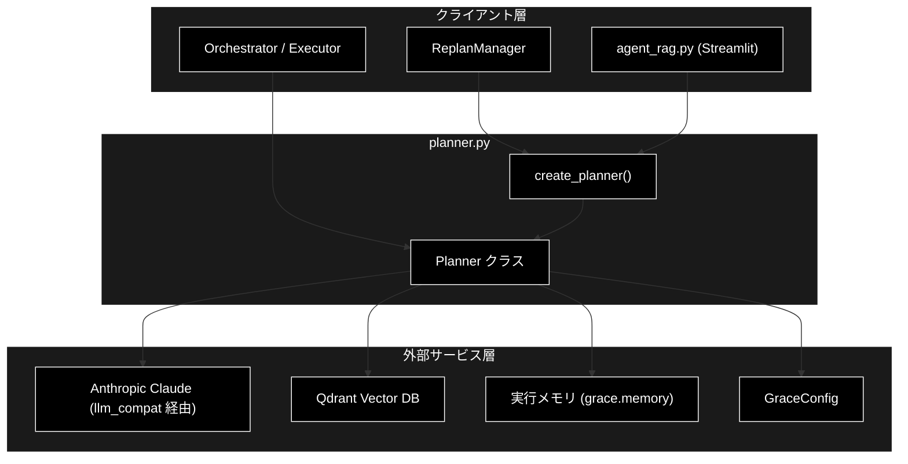
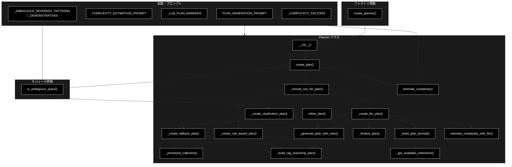
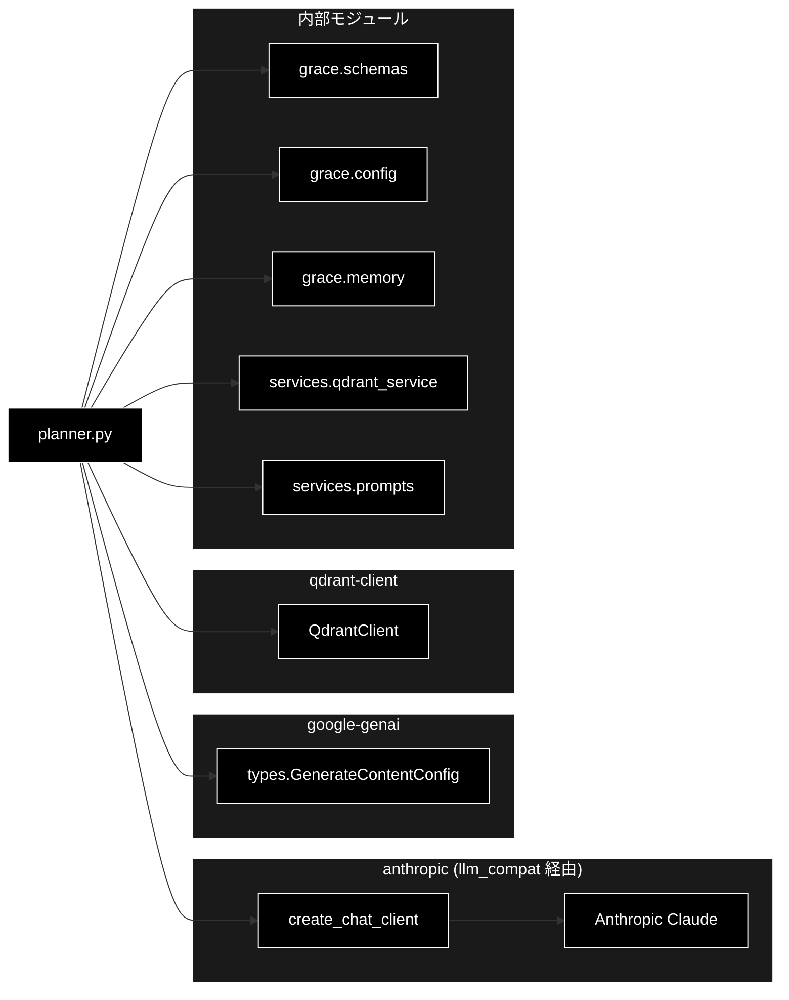

# planner.py - GRACE 計画生成エージェント ドキュメント

**Version 3.3** | 最終更新: 2026-06-27

---

## 目次

1. [概要](#概要)
2. [1. アーキテクチャ構成図](#1-アーキテクチャ構成図)
3. [2. モジュール構成図](#2-モジュール構成図)
4. [3. クラス・関数一覧表](#3-クラス関数一覧表)
5. [4. クラス・関数 IPO詳細](#4-クラス関数-ipo詳細)
6. [5. 設定・定数](#5-設定定数)
7. [6. 使用例](#6-使用例)
8. [7. エクスポート](#7-エクスポート)
9. [8. 変更履歴](#8-変更履歴)
10. [付録: 依存関係図](#付録-依存関係図)

---

## 概要

`planner.py`は、GRACE自律エージェントの「計画生成（Plan）」層を担うモジュールです。ユーザーの質問を分析し、`rag_search` → `reasoning` を中心とした実行計画（`ExecutionPlan`）を生成します。計画生成は二層方式を採用しており、単純なクエリはルールベースで即時に計画を作り（LLM呼び出しなし）、複雑なクエリや明示的なWeb検索指示のあるクエリのみ LLM（Anthropic Claude）で計画を生成します。

加えて、計画生成の入口で**曖昧クエリ**（「あの件について教えて」のように指示語のみで対象が特定できない質問）を検知し、検索を行わずユーザーに明確化を求める `ask_user` 計画へ振り分けます。さらに **P4 実行メモリ層**（`grace/memory.py`）と連携し、過去の実行実績から「この質問で当たりやすいコレクション」を学習している場合は、`rag_search` の対象コレクションをその最良コレクションに固定します（十分な実績が無ければ全コレクション検索）。

LLM 呼び出しは `grace/llm_compat.py` の `create_chat_client()` で生成したクライアント経由で行います。このクライアントは google-genai 互換の `client.models.generate_content(...)` インターフェースを保ったまま、内部では Anthropic Claude（既定 `claude-sonnet-4-6`、軽量用途 `claude-haiku-4-5-20251001`）を呼び出すアダプターです。Embedding（検索）は別途 Gemini `gemini-embedding-001`（3072次元）を使用します。

### 主な責務

- ユーザークエリの複雑度推定（キーワードベース / LLMベース）
- 曖昧クエリの検知と確認（ask_user）計画への振り分け
- 二層方式による実行計画の生成（ルールベース計画 / LLM計画の振り分け）
- LLM（Anthropic Claude）を用いた実行計画の自動生成
- 利用可能なコレクション（Qdrant）の動的取得・実行メモリによる優先コレクションの反映
- フィードバックに基づく計画の修正（リファインメント）
- LLMエラー時のフォールバック計画の提供

### 各責務対応のモジュール

| # | 責務 | 対応モジュール | 説明 |
|---|------|--------------|------|
| 1 | ユーザークエリの複雑度推定 | `planner.py` | `estimate_complexity()` / `estimate_complexity_with_llm()` |
| 2 | 曖昧クエリの検知と確認計画への振り分け | `planner.py` | `is_ambiguous_query()` / `_create_clarification_plan()` |
| 3 | 二層方式による計画振り分け | `planner.py` | `create_plan()` / `_should_use_llm_plan()` |
| 4 | LLMを用いた実行計画の自動生成 | `planner.py` | `_create_llm_plan()` が `_build_plan_prompt()` / `_generate_plan_with_retry()` / `_finalize_plan()` を組み合わせて Anthropic Claude を compat 経由で呼び出し |
| 5 | 利用可能なコレクションの動的取得・優先反映 | `services.qdrant_service` / `grace.memory` | `get_all_collections()` を `_get_available_collections()` から、実績は `_prioritized_collection()` から参照 |
| 6 | フィードバックに基づく計画の修正 | `planner.py` | `refine_plan()` |
| 7 | フォールバック計画の提供 | `planner.py` | `_create_fallback_plan()` / `_create_rule_based_plan()`（いずれも `_build_rag_reasoning_plan()` に委譲） |

### 主要機能一覧

| 機能 | 説明 |
|------|------|
| `Planner` | 計画生成エージェントクラス |
| `Planner.__init__()` | コンストラクタ（設定・モデル名・LLMクライアント・実行メモリの初期化） |
| `Planner.create_plan()` | 曖昧判定 → 二層方式で実行計画を生成（ルールベース / LLM の振り分け） |
| `Planner.estimate_complexity()` | キーワードベース（`_COMPLEXITY_FACTORS` 参照）で複雑度を推定 |
| `Planner.estimate_complexity_with_llm()` | LLM（Anthropic Claude）で複雑度を推定（温度・トークン数は config 由来） |
| `Planner.refine_plan()` | フィードバックに基づき計画を修正（`_generate_plan_with_retry` でリトライ・空/JSONガードを獲得） |
| `Planner._should_use_llm_plan()` | LLM計画生成を使用すべきか判定 |
| `Planner._prioritized_collection()` | 実行メモリの事前分布から優先コレクションを取得 |
| `Planner._build_rag_reasoning_plan()` | rag_search → reasoning の標準2ステップ計画を組み立てる共通ビルダー |
| `Planner._create_rule_based_plan()` | ルールベースの標準2ステップ計画を生成（`_build_rag_reasoning_plan` に委譲） |
| `Planner._build_plan_prompt()` | 利用可能コレクションを埋め込んだLLM計画生成プロンプトを構築 |
| `Planner._generate_plan_with_retry()` | structured-output(JSON) で計画を生成する共通ヘルパー（リトライ・空/JSONガード） |
| `Planner._finalize_plan()` | LLM生成計画に複雑度・plan_id を適用し依存関係を検証・ログ |
| `Planner._create_llm_plan()` | LLMによる実行計画を生成（プロンプト構築 → リトライ生成 → 確定の委譲構成） |
| `Planner._create_clarification_plan()` | 曖昧クエリに対する確認（ask_user）計画を生成 |
| `Planner._create_fallback_plan()` | LLMエラー時の安全な代替計画を生成（`_build_rag_reasoning_plan` に委譲） |
| `Planner._get_available_collections()` | 利用可能なQdrantコレクションを取得 |
| `is_ambiguous_query()` | 指示語のみで対象が特定できない曖昧クエリかを判定 |
| `create_planner()` | Plannerインスタンスを作成するファクトリ関数 |
| `PLAN_GENERATION_PROMPT` | LLM計画生成用プロンプトテンプレート |
| `COMPLEXITY_ESTIMATION_PROMPT` | LLM複雑度推定用プロンプトテンプレート |

---

## 1. アーキテクチャ構成図

### 1.1 システム全体構成



### 1.2 データフロー

1. クライアント層（Executor / ReplanManager / UI）が `create_plan(query)` を呼び出す
2. `is_ambiguous_query()` で曖昧クエリを判定。該当する場合は `_create_clarification_plan()` で `ask_user` 計画を即時返却
3. `estimate_complexity()` でヒューリスティック複雑度を算出し、`_should_use_llm_plan()` で二層判定を行う
4. 単純クエリは `_create_rule_based_plan()` でLLM呼び出しなしの2ステップ計画を即時生成（`_build_rag_reasoning_plan()` に委譲し、`_prioritized_collection()` で優先コレクションを反映）
5. 複雑クエリ・Web検索指示クエリは `_create_llm_plan()` でAnthropic Claudeに計画生成を依頼
6. `_create_llm_plan()` は `_build_plan_prompt()`（`_get_available_collections()` で利用可能コレクションを取得しプロンプトに埋め込む）→ `_generate_plan_with_retry()`（structured-output JSON でリトライ生成）→ `_finalize_plan()`（複雑度・plan_id 適用と依存関係検証）の順に委譲する
7. `_generate_plan_with_retry()` がレスポンスのJSONを `ExecutionPlan` にパースし、空レスポンス・不完全JSONは `PlannerConfig.llm_plan_max_attempts` 回までリトライ
8. 失敗時は `_create_fallback_plan()` が安全な代替計画（同じく `_build_rag_reasoning_plan()` 経由）を返す

---

## 2. モジュール構成図

### 2.1 内部モジュール構成



### 2.2 外部依存関係

| ライブラリ | バージョン | 用途 |
|-----------|-----------|------|
| `anthropic` | - | LLM計画生成（`llm_compat` 経由で Claude を呼び出し） |
| `google-genai` | - | `types.GenerateContentConfig` の構築（呼び出しインターフェース互換） |
| `qdrant-client` | >=1.15.1 | 利用可能コレクションの取得 |
| `pydantic` | >=2.0 | `ExecutionPlan` / `PlanStep` のバリデーション |

### 2.3 内部依存モジュール

| モジュール | 用途 |
|-----------|------|
| `grace.schemas` | `ExecutionPlan` / `PlanStep` / `create_plan_id` / `validate_plan_dependencies` |
| `grace.config` | `GraceConfig` / `get_config` |
| `grace.llm_compat` | `create_chat_client`（Anthropic Claude の genai互換クライアント生成） |
| `grace.memory` | `create_execution_memory`（P4 実行メモリ層・優先コレクションの学習） |
| `services.qdrant_service` | `get_all_collections`（コレクション一覧取得） |
| `services.prompts` | `SEARCH_QUERY_INSTRUCTION`（検索クエリ作成指示） |

---

## 3. クラス・関数一覧表

### 3.1 クラス一覧

#### Planner

| メソッド | 概要 |
|---------|------|
| `__init__(config, model_name)` | 設定・モデル名・LLMクライアント・実行メモリを初期化 |
| `create_plan(query)` | 曖昧判定 → 二層方式で実行計画を生成 |
| `estimate_complexity(query)` | キーワードベース（`_COMPLEXITY_FACTORS`）で複雑度を推定 |
| `estimate_complexity_with_llm(query)` | LLMで複雑度を推定（温度・トークン数は config 由来） |
| `refine_plan(plan, feedback)` | フィードバックに基づき計画を修正（リトライ・空/JSONガード付き） |
| `_should_use_llm_plan(query, heuristic_complexity)` | LLM計画生成の要否を判定 |
| `_prioritized_collection(query)` | 実行メモリの事前分布から優先コレクションを取得 |
| `_build_rag_reasoning_plan(query, *, complexity, collection, rag_description)` | rag_search → reasoning の標準2ステップ計画を組み立てる共通ビルダー |
| `_create_rule_based_plan(query, complexity)` | ルールベース2ステップ計画を生成（`_build_rag_reasoning_plan` に委譲） |
| `_build_plan_prompt(query)` | 利用可能コレクションを埋め込んだLLM計画生成プロンプトを構築 |
| `_generate_plan_with_retry(prompt, *, label, max_output_tokens, log_output)` | structured-output(JSON) で計画を生成する共通ヘルパー（リトライ・空/JSONガード） |
| `_finalize_plan(plan, complexity)` | 複雑度・plan_id を適用し依存関係を検証・ログ |
| `_create_llm_plan(query)` | LLMによる計画を生成（プロンプト構築 → リトライ生成 → 確定の委譲構成） |
| `_create_clarification_plan(query)` | 曖昧クエリに対する確認（ask_user）計画を生成 |
| `_create_fallback_plan(query)` | フォールバック計画を生成（`_build_rag_reasoning_plan` に委譲） |
| `_get_available_collections()` | Qdrantコレクション一覧を取得 |

### 3.2 関数一覧（カテゴリ別）

#### 判定関数

| 関数名 | 概要 |
|-------|------|
| `is_ambiguous_query(query)` | 指示語のみで対象が特定できない曖昧クエリかを判定 |

#### ファクトリ関数

| 関数名 | 概要 |
|-------|------|
| `create_planner(config, model_name)` | Plannerインスタンスを生成 |

---

## 4. クラス・関数 IPO詳細

### 4.1 Planner クラス

ユーザーの質問を分析し、実行計画（`ExecutionPlan`）を生成する計画生成エージェント。二層方式（ルールベース / LLM）を採用する。

#### コンストラクタ: `__init__`

**概要**: 設定・モデル名・LLMクライアント・実行メモリ層を初期化する。

```python
Planner(
    config: Optional[GraceConfig] = None,
    model_name: Optional[str] = None
)
```

| パラメータ | 型 | デフォルト | 説明 |
|------------|------|-----------|------|
| `config` | Optional[GraceConfig] | None | GRACE設定（Noneの場合は `get_config()` を使用） |
| `model_name` | Optional[str] | None | 使用するモデル名（Noneの場合は `config.llm.model`） |

| 項目 | 内容 |
|------|------|
| **Input** | `config: Optional[GraceConfig] = None`, `model_name: Optional[str] = None` |
| **Process** | 1. `config` を解決（未指定なら `get_config()`）<br>2. `model_name` を解決（未指定なら `config.llm.model`）<br>3. `create_chat_client(config)` でLLMクライアントを生成<br>4. `config.memory.enabled` が真なら `create_execution_memory(config.memory.path)` で実行メモリ層を初期化（無効時は `None`） |
| **Output** | Plannerインスタンス |

**戻り値例**:
```python
# Planner インスタンス（主な属性）
{
    "config": "<GraceConfig>",
    "model_name": "claude-sonnet-4-6",
    "client": "<AnthropicGenaiClient>",
    "_memory": "<ExecutionMemory or None>"
}
```

```python
# 使用例
from grace.planner import Planner

planner = Planner()
print(planner.model_name)
# 出力: claude-sonnet-4-6
```

#### メソッド: `create_plan`

**概要**: 質問から実行計画を生成する（二層方式）。単純クエリはルールベース、複雑クエリ・Web検索指示はLLMで生成する。

```python
def create_plan(self, query: str) -> ExecutionPlan
```

| パラメータ | 型 | デフォルト | 説明 |
|------------|------|-----------|------|
| `query` | str | - | ユーザーの質問 |

| 項目 | 内容 |
|------|------|
| **Input** | `query: str` |
| **Process** | 1. `is_ambiguous_query(query)` が真なら `_create_clarification_plan()`（ask_user 計画）を即時返却<br>2. `estimate_complexity(query)` でヒューリスティック複雑度を算出<br>3. `_should_use_llm_plan()` で二層判定<br>4. 非LLM経路: `_create_rule_based_plan()` を即時返却<br>5. LLM経路: `_create_llm_plan()` を実行 |
| **Output** | `ExecutionPlan`: 生成された実行計画 |

**戻り値例**:
```python
{
    "original_query": "RAGとは何ですか？",
    "complexity": 0.5,
    "estimated_steps": 2,
    "requires_confirmation": False,
    "steps": [
        {"step_id": 1, "action": "rag_search", "fallback": "web_search"},
        {"step_id": 2, "action": "reasoning", "depends_on": [1]}
    ],
    "success_criteria": "ユーザーの質問に適切に回答できている",
    "plan_id": "plan_xxxxxxxx"
}
```

```python
# 使用例
planner = Planner()
plan = planner.create_plan("RAGとは何ですか？")
print(f"ステップ数: {len(plan.steps)}, 複雑度: {plan.complexity}")
# 出力: ステップ数: 2, 複雑度: 0.5
```

#### メソッド: `estimate_complexity`

**概要**: キーワードと質問長に基づき複雑度を簡易推定する（LLM呼び出しなし）。

```python
def estimate_complexity(self, query: str) -> float
```

| パラメータ | 型 | デフォルト | 説明 |
|------------|------|-----------|------|
| `query` | str | - | ユーザーの質問 |

| 項目 | 内容 |
|------|------|
| **Input** | `query: str` |
| **Process** | 1. ベーススコア 0.5 から開始<br>2. モジュール定数 `_COMPLEXITY_FACTORS`（「比較」「違い」「複数」等のキーワード→加点重み）を走査し、出現キーワードの重みを加算<br>3. 質問長が100/200文字超で加点<br>4. 上限を1.0にクリップ |
| **Output** | `float`: 複雑度スコア（0.0-1.0） |

**戻り値例**:
```python
0.65
```

```python
# 使用例
planner = Planner()
score = planner.estimate_complexity("AとBの違いを複数の観点で比較してください")
print(score)
# 出力: 1.0
```

#### メソッド: `estimate_complexity_with_llm`

**概要**: LLM（Anthropic Claude）を使用して質問の複雑度を推定する。温度・最大出力トークン数は `PlannerConfig`（`complexity_temperature` / `complexity_max_output_tokens`）由来。失敗・空レスポンス時はキーワードベース推定にフォールバックする。

```python
def estimate_complexity_with_llm(self, query: str) -> float
```

| パラメータ | 型 | デフォルト | 説明 |
|------------|------|-----------|------|
| `query` | str | - | ユーザーの質問 |

| 項目 | 内容 |
|------|------|
| **Input** | `query: str` |
| **Process** | 1. `COMPLEXITY_ESTIMATION_PROMPT` を構築<br>2. `client.models.generate_content()` で複雑度を取得（`temperature=config.planner.complexity_temperature`（既定 0.1）, `max_output_tokens=config.planner.complexity_max_output_tokens`（既定 10））<br>3. 空レスポンス時は `estimate_complexity()` にフォールバック<br>4. 数値をパースし0.0-1.0にクリップ |
| **Output** | `float`: 複雑度スコア（0.0-1.0） |

**戻り値例**:
```python
0.7
```

```python
# 使用例
planner = Planner()
score = planner.estimate_complexity_with_llm("量子コンピュータの誤り訂正手法を比較して")
print(score)
# 出力: 0.8
```

#### メソッド: `refine_plan`

**概要**: ユーザーフィードバックに基づき既存の計画をLLMで修正する。`_generate_plan_with_retry`（label="refine_plan LLM"）を再利用し、`_create_llm_plan` と同等のリトライ・空レスポンス/不完全JSONガードを獲得した。失敗時は元の計画を返す。

```python
def refine_plan(self, plan: ExecutionPlan, feedback: str) -> ExecutionPlan
```

| パラメータ | 型 | デフォルト | 説明 |
|------------|------|-----------|------|
| `plan` | ExecutionPlan | - | 元の計画 |
| `feedback` | str | - | ユーザーからのフィードバック |

| 項目 | 内容 |
|------|------|
| **Input** | `plan: ExecutionPlan`, `feedback: str` |
| **Process** | 1. 元計画とフィードバックから修正用プロンプトを構築<br>2. `_generate_plan_with_retry(prompt, label="refine_plan LLM")` で計画を生成（空レスポンス・不完全JSONは `llm_plan_max_attempts` 回までリトライ）<br>3. 新しい `plan_id` を採番<br>4. 例外時（全リトライ失敗等）は元の計画を返却 |
| **Output** | `ExecutionPlan`: 修正された計画（失敗時は元の計画） |

**戻り値例**:
```python
{
    "original_query": "RAGとは何ですか？",
    "complexity": 0.5,
    "estimated_steps": 3,
    "requires_confirmation": False,
    "steps": ["..."],
    "plan_id": "plan_yyyyyyyy"
}
```

```python
# 使用例
planner = Planner()
plan = planner.create_plan("RAGとは何ですか？")
refined = planner.refine_plan(plan, "もっと詳しく、最新事例も含めてください")
print(refined.plan_id != plan.plan_id)
# 出力: True
```

#### メソッド: `_should_use_llm_plan`

**概要**: LLM計画生成を使用すべきか判定する（強制フラグ・Web検索マーカー・複雑度閾値）。

```python
def _should_use_llm_plan(self, query: str, heuristic_complexity: float) -> bool
```

| パラメータ | 型 | デフォルト | 説明 |
|------------|------|-----------|------|
| `query` | str | - | ユーザーの質問 |
| `heuristic_complexity` | float | - | ヒューリスティック複雑度 |

| 項目 | 内容 |
|------|------|
| **Input** | `query: str`, `heuristic_complexity: float` |
| **Process** | 1. `config.planner.force_llm_plan` が真なら True<br>2. `_LLM_PLAN_MARKERS` のいずれかを含めば True<br>3. `heuristic_complexity >= config.planner.llm_plan_complexity_threshold` を返却 |
| **Output** | `bool`: LLM計画生成を使うべきか |

**戻り値例**:
```python
True
```

```python
# 使用例
planner = Planner()
use_llm = planner._should_use_llm_plan("最新ニュースを検索して", 0.3)
print(use_llm)
# 出力: True
```

#### メソッド: `_prioritized_collection`

**概要**: P4 実行メモリの事前分布から、この質問で当たりやすいコレクションを返す。十分な実績が無ければ `None`（=全コレクション検索）。

```python
def _prioritized_collection(self, query: str) -> Optional[str]
```

| パラメータ | 型 | デフォルト | 説明 |
|------------|------|-----------|------|
| `query` | str | - | ユーザーの質問 |

| 項目 | 内容 |
|------|------|
| **Input** | `query: str` |
| **Process** | 1. `_memory` が `None`（メモリ無効）なら `None` を返却<br>2. `memory.best_collection(query, min_count, min_score)` を呼び出し<br>3. 採用条件を満たすコレクション名、または `None` を返却<br>4. 例外時は警告ログを出して `None` |
| **Output** | `Optional[str]`: 優先コレクション名（無ければ `None`） |

**戻り値例**:
```python
"wikipedia_ja"  # 実績が薄い場合は None
```

```python
# 使用例
planner = Planner()
col = planner._prioritized_collection("金色夜叉の構成者は誰ですか？")
print(col)
# 出力: None  # 実績が蓄積されると "livedoor" 等が返る
```

#### メソッド: `_build_rag_reasoning_plan`

**概要**: `rag_search` → `reasoning` の標準2ステップ計画を組み立てる共通ビルダー。ルールベース計画（`_create_rule_based_plan`）とフォールバック計画（`_create_fallback_plan`）が共有する。rag_search は `collection`（優先コレクション or None=全コレクション検索）と `fallback="web_search"` を持ち、各 PlanStep のタイムアウトは `PlannerConfig.step_timeout_seconds`（既定 30 秒）を使用する。

```python
def _build_rag_reasoning_plan(
    self,
    query: str,
    *,
    complexity: float,
    collection: Optional[str],
    rag_description: str = "関連情報を検索",
) -> ExecutionPlan
```

| パラメータ | 型 | デフォルト | 説明 |
|------------|------|-----------|------|
| `query` | str | - | ユーザーの質問 |
| `complexity` | float | - | 計画に記録する複雑度 |
| `collection` | Optional[str] | - | rag_search の対象コレクション（None=全コレクション検索） |
| `rag_description` | str | "関連情報を検索" | rag_search ステップの description |

| 項目 | 内容 |
|------|------|
| **Input** | `query: str`, `*`, `complexity: float`, `collection: Optional[str]`, `rag_description: str = "関連情報を検索"` |
| **Process** | 1. `config.planner.step_timeout_seconds` を取得<br>2. step1=rag_search（`query`, `collection`, `fallback="web_search"`, `timeout_seconds=step_timeout`, `description=rag_description`）を作成<br>3. step2=reasoning（`depends_on=[1]`, `timeout_seconds=step_timeout`）を作成<br>4. `estimated_steps=2`, `requires_confirmation=False` で `ExecutionPlan` を構築し `plan_id` を採番 |
| **Output** | `ExecutionPlan`: 標準2ステップ計画 |

**戻り値例**:
```python
{
    "complexity": 0.5,
    "estimated_steps": 2,
    "requires_confirmation": False,
    "steps": [
        {"step_id": 1, "action": "rag_search", "collection": None, "fallback": "web_search", "timeout_seconds": 30},
        {"step_id": 2, "action": "reasoning", "depends_on": [1], "timeout_seconds": 30}
    ],
    "plan_id": "plan_xxxxxxxx"
}
```

```python
# 使用例（内部利用）
planner = Planner()
plan = planner._build_rag_reasoning_plan("RAGとは？", complexity=0.5, collection=None)
print(plan.steps[0].action, plan.steps[1].action)
# 出力: rag_search reasoning
```

#### メソッド: `_create_rule_based_plan`

**概要**: LLM呼び出しなしで標準2ステップ計画（rag_search → reasoning）を生成する。計画構築は共通ビルダー `_build_rag_reasoning_plan()` に委譲する。実行メモリに十分な実績があれば rag_search の対象コレクションを優先コレクションに固定する。

```python
def _create_rule_based_plan(self, query: str, complexity: float) -> ExecutionPlan
```

| パラメータ | 型 | デフォルト | 説明 |
|------------|------|-----------|------|
| `query` | str | - | ユーザーの質問 |
| `complexity` | float | - | ヒューリスティック複雑度 |

| 項目 | 内容 |
|------|------|
| **Input** | `query: str`, `complexity: float` |
| **Process** | 1. `_prioritized_collection(query)` で優先コレクションを取得（無ければ `None`）<br>2. `_build_rag_reasoning_plan(query, complexity=complexity, collection=優先 or None)` に委譲して標準2ステップ計画を構築・返却 |
| **Output** | `ExecutionPlan`: 標準2ステップ計画 |

**戻り値例**:
```python
{
    "estimated_steps": 2,
    "requires_confirmation": False,
    "steps": [
        {"step_id": 1, "action": "rag_search", "collection": None, "fallback": "web_search"},
        {"step_id": 2, "action": "reasoning", "depends_on": [1]}
    ]
}
```

```python
# 使用例
planner = Planner()
plan = planner._create_rule_based_plan("RAGとは？", 0.5)
print(plan.steps[0].action, plan.steps[1].action)
# 出力: rag_search reasoning
```

#### メソッド: `_create_llm_plan`

**概要**: LLM（Anthropic Claude）を使用して計画を生成する。複雑度推定 → プロンプト構築（`_build_plan_prompt`）→ リトライ生成（`_generate_plan_with_retry`）→ 確定（`_finalize_plan`）の委譲構成に簡素化された。各段の詳細はそれぞれのヘルパーが担う。失敗時はフォールバック計画を返す。

```python
def _create_llm_plan(self, query: str) -> ExecutionPlan
```

| パラメータ | 型 | デフォルト | 説明 |
|------------|------|-----------|------|
| `query` | str | - | ユーザーの質問 |

| 項目 | 内容 |
|------|------|
| **Input** | `query: str` |
| **Process** | 1. `estimate_complexity_with_llm()` で複雑度を推定<br>2. `_build_plan_prompt(query)` でプロンプトを構築<br>3. `_generate_plan_with_retry(prompt, label="create_plan LLM", max_output_tokens=config.planner.plan_max_output_tokens, log_output=True)` で計画を生成（空/JSON不完全をリトライ）<br>4. `_finalize_plan(plan, estimated_complexity)` で複雑度・plan_id を適用し依存関係を検証<br>5. 例外時は `_create_fallback_plan()` |
| **Output** | `ExecutionPlan`: LLM生成計画（失敗時はフォールバック計画） |

**戻り値例**:
```python
{
    "original_query": "量子コンピュータと従来型の違いを複数観点で詳しく",
    "complexity": 0.85,
    "estimated_steps": 2,
    "steps": ["..."],
    "plan_id": "plan_zzzzzzzz"
}
```

```python
# 使用例
planner = Planner()
plan = planner._create_llm_plan("最新ニュースを検索して教えて")
print(plan.complexity)
# 出力: 0.6
```

#### メソッド: `_build_plan_prompt`

**概要**: LLM計画生成用のプロンプトを構築する。利用可能なコレクション（`_get_available_collections()`）を `PLAN_GENERATION_PROMPT` に埋め込み、末尾にJSON完全性を促す指示を付加する。

```python
def _build_plan_prompt(self, query: str) -> str
```

| パラメータ | 型 | デフォルト | 説明 |
|------------|------|-----------|------|
| `query` | str | - | ユーザーの質問 |

| 項目 | 内容 |
|------|------|
| **Input** | `query: str` |
| **Process** | 1. `_get_available_collections()` でコレクション一覧を取得<br>2. カンマ区切り文字列化（空なら "(コレクションなし)"）<br>3. `PLAN_GENERATION_PROMPT.format(available_collections=..., query=query)` を構築<br>4. 末尾に "IMPORTANT: Ensure the output is a valid, complete JSON object..." を付加 |
| **Output** | `str`: 構築済みプロンプト文字列 |

**戻り値例**:
```python
"あなたは計画策定の専門家です。...（中略）...\n\nIMPORTANT: Ensure the output is a valid, complete JSON object. Do not truncate the response."
```

```python
# 使用例（内部利用）
planner = Planner()
prompt = planner._build_plan_prompt("RAGとは何ですか？")
print(prompt.endswith("Do not truncate the response."))
# 出力: True
```

#### メソッド: `_generate_plan_with_retry`

**概要**: structured-output（JSON）で `ExecutionPlan` を生成する共通ヘルパー。空レスポンス・不完全JSONを検知して `PlannerConfig.llm_plan_max_attempts`（既定 2）回までリトライし、全試行失敗時は最後に発生した例外を送出する。`_create_llm_plan`（計画生成）と `refine_plan`（計画修正）の双方が共有し、リトライ・ガードの挙動を揃える。

```python
def _generate_plan_with_retry(
    self,
    prompt: str,
    *,
    label: str,
    max_output_tokens: Optional[int] = None,
    log_output: bool = False,
) -> ExecutionPlan
```

| パラメータ | 型 | デフォルト | 説明 |
|------------|------|-----------|------|
| `prompt` | str | - | LLMへ渡すプロンプト |
| `label` | str | - | ログ用ラベル（例 "create_plan LLM"） |
| `max_output_tokens` | Optional[int] | None | 最大出力トークン数（None の場合は指定しない） |
| `log_output` | bool | False | True の場合、各試行のレスポンス本文をIPOログ出力する |

| 項目 | 内容 |
|------|------|
| **Input** | `prompt: str`, `*`, `label: str`, `max_output_tokens: Optional[int] = None`, `log_output: bool = False` |
| **Process** | 1. `response_mime_type="application/json"`, `response_schema=ExecutionPlan`, `temperature=config.llm.temperature` で config を構築（`max_output_tokens` 指定時は追加）<br>2. `config.planner.llm_plan_max_attempts` 回ループ<br>3. `client.models.generate_content()` を呼び出し<br>4. 空レスポンスガード（空なら次試行へ）<br>5. `json.loads()` でJSON完全性チェック（不完全なら次試行へ）<br>6. `ExecutionPlan.model_validate_json()` でパースして返却<br>7. 全試行失敗時は最後の例外を送出 |
| **Output** | `ExecutionPlan`: パース済みの実行計画 |

**戻り値例**:
```python
{
    "original_query": "...",
    "estimated_steps": 2,
    "steps": ["..."],
    "plan_id": "plan_xxxxxxxx"
}
```

```python
# 使用例（内部利用）
planner = Planner()
prompt = planner._build_plan_prompt("生成AIの最新動向を詳しく比較して")
plan = planner._generate_plan_with_retry(
    prompt, label="create_plan LLM",
    max_output_tokens=planner.config.planner.plan_max_output_tokens,
)
print(len(plan.steps))
# 出力: 2
```

#### メソッド: `_finalize_plan`

**概要**: LLM生成計画に複雑度・`plan_id` を適用し、`validate_plan_dependencies()` で依存関係を検証してログ出力する。検証エラーがあってもフォールバックせず警告のみとする。

```python
def _finalize_plan(self, plan: ExecutionPlan, complexity: float) -> ExecutionPlan
```

| パラメータ | 型 | デフォルト | 説明 |
|------------|------|-----------|------|
| `plan` | ExecutionPlan | - | LLMが生成した計画 |
| `complexity` | float | - | 適用する複雑度 |

| 項目 | 内容 |
|------|------|
| **Input** | `plan: ExecutionPlan`, `complexity: float` |
| **Process** | 1. `plan.complexity` に事前計算した複雑度を適用<br>2. `plan.plan_id` を採番<br>3. `validate_plan_dependencies(plan)` で検証（エラー時は警告ログのみ）<br>4. ステップ数・複雑度・確認要否・計画JSONをログ出力 |
| **Output** | `ExecutionPlan`: 確定済みの計画 |

**戻り値例**:
```python
{
    "complexity": 0.85,
    "estimated_steps": 2,
    "steps": ["..."],
    "plan_id": "plan_zzzzzzzz"
}
```

```python
# 使用例（内部利用）
planner = Planner()
prompt = planner._build_plan_prompt("量子コンピュータの違いを詳しく")
plan = planner._generate_plan_with_retry(prompt, label="create_plan LLM")
final = planner._finalize_plan(plan, 0.85)
print(final.complexity)
# 出力: 0.85
```

#### メソッド: `_create_clarification_plan`

**概要**: 曖昧クエリに対する確認（ask_user）計画を生成する。検索・推論は行わず、ユーザーに対象の明確化を求める単一 ask_user ステップで構成し、`requires_confirmation=True` とする。

```python
def _create_clarification_plan(self, query: str) -> ExecutionPlan
```

| パラメータ | 型 | デフォルト | 説明 |
|------------|------|-----------|------|
| `query` | str | - | ユーザーの曖昧な質問 |

| 項目 | 内容 |
|------|------|
| **Input** | `query: str` |
| **Process** | 1. step1=ask_user（明確化を促す質問文・`collection=None`）を作成<br>2. `complexity=0.2`, `estimated_steps=1`, `requires_confirmation=True` で `ExecutionPlan` を構築<br>3. `plan_id` を採番 |
| **Output** | `ExecutionPlan`: 確認（ask_user）単一ステップ計画 |

**戻り値例**:
```python
{
    "complexity": 0.2,
    "estimated_steps": 1,
    "requires_confirmation": True,
    "steps": [
        {"step_id": 1, "action": "ask_user", "query": "ご質問の対象が特定できませんでした。..."}
    ]
}
```

```python
# 使用例
planner = Planner()
plan = planner._create_clarification_plan("あの件について教えて")
print(plan.steps[0].action, plan.requires_confirmation)
# 出力: ask_user True
```

#### メソッド: `_create_fallback_plan`

**概要**: LLMエラー時の安全な代替2ステップ計画を生成する。計画構築は共通ビルダー `_build_rag_reasoning_plan()` に委譲する。実行メモリの優先コレクションを最優先し、無ければ wikipedia 系コレクションを使用する。

```python
def _create_fallback_plan(self, query: str) -> ExecutionPlan
```

| パラメータ | 型 | デフォルト | 説明 |
|------------|------|-----------|------|
| `query` | str | - | ユーザーの質問 |

| 項目 | 内容 |
|------|------|
| **Input** | `query: str` |
| **Process** | 1. `_prioritized_collection(query)` で優先コレクションを取得<br>2. 無ければ `_get_available_collections()` から wikipedia 系コレクションを選択（さらに無ければ None）<br>3. `_build_rag_reasoning_plan(query, complexity=0.5, collection=..., rag_description="全コレクションから関連情報を検索")` に委譲して2ステップ計画を構築 |
| **Output** | `ExecutionPlan`: フォールバック2ステップ計画 |

**戻り値例**:
```python
{
    "complexity": 0.5,
    "estimated_steps": 2,
    "steps": [
        {"step_id": 1, "action": "rag_search", "collection": "wikipedia_ja", "fallback": "web_search"},
        {"step_id": 2, "action": "reasoning", "depends_on": [1]}
    ]
}
```

```python
# 使用例
planner = Planner()
plan = planner._create_fallback_plan("RAGとは？")
print(plan.complexity)
# 出力: 0.5
```

#### メソッド: `_get_available_collections`

**概要**: Qdrantから利用可能なコレクション名リストを取得する。失敗時は `config.qdrant.search_priority` を返す。

```python
def _get_available_collections(self) -> list
```

| パラメータ | 型 | デフォルト | 説明 |
|------------|------|-----------|------|
| なし（selfのみ） | - | - | - |

| 項目 | 内容 |
|------|------|
| **Input** | なし（selfのみ） |
| **Process** | 1. `QdrantClient(url=config.qdrant.url)` を生成<br>2. `get_all_collections(client)` を呼び出し<br>3. 各要素の `name` を抽出<br>4. 例外時は `config.qdrant.search_priority` を返却 |
| **Output** | `list`: コレクション名のリスト |

**戻り値例**:
```python
["wikipedia_ja", "livedoor", "cc_news", "japanese_text"]
```

```python
# 使用例
planner = Planner()
cols = planner._get_available_collections()
print(cols)
# 出力: ["wikipedia_ja", "livedoor", ...]
```

### 4.2 判定関数

#### `is_ambiguous_query`

**概要**: 指示語のみで対象が特定できない「曖昧クエリ」かどうかを判定するモジュール関数。固有名詞・数字・カタカナ語などの具体的手がかりを含むクエリは曖昧とみなさない。

```python
def is_ambiguous_query(query: str) -> bool
```

| パラメータ | 型 | デフォルト | 説明 |
|------------|------|-----------|------|
| `query` | str | - | ユーザーの質問 |

| 項目 | 内容 |
|------|------|
| **Input** | `query: str` |
| **Process** | 1. 空文字なら `True`<br>2. `_AMBIGUOUS_REFERENT_PATTERNS`（「あの件」「その話」等）を含めば `True`<br>3. `_DEMONSTRATIVES`（指示語）を含み、かつ英数字や3文字以上のカタカナ語が無く、30文字以内なら `True`<br>4. それ以外は `False` |
| **Output** | `bool`: 曖昧クエリなら `True` |

**戻り値例**:
```python
True   # 「あの件について教えて」
False  # 「金色夜叉の構成者は誰ですか？」
```

```python
# 使用例
from grace.planner import is_ambiguous_query

print(is_ambiguous_query("あの件について詳しく教えて"))
# 出力: True
print(is_ambiguous_query("RAGの仕組みを教えて"))
# 出力: False
```

### 4.3 ファクトリ関数

#### `create_planner`

**概要**: Plannerインスタンスを生成するファクトリ関数。

```python
def create_planner(
    config: Optional[GraceConfig] = None,
    model_name: Optional[str] = None
) -> Planner
```

| パラメータ | 型 | デフォルト | 説明 |
|------------|------|-----------|------|
| `config` | Optional[GraceConfig] | None | GRACE設定 |
| `model_name` | Optional[str] | None | 使用するモデル名 |

| 項目 | 内容 |
|------|------|
| **Input** | `config: Optional[GraceConfig] = None`, `model_name: Optional[str] = None` |
| **Process** | `Planner(config=config, model_name=model_name)` を生成して返す |
| **Output** | `Planner`: Plannerインスタンス |

**戻り値例**:
```python
# <grace.planner.Planner object at 0x...>
```

```python
# 使用例
from grace.planner import create_planner

planner = create_planner(model_name="claude-sonnet-4-6")
plan = planner.create_plan("RAGとは何ですか？")
print(len(plan.steps))
# 出力: 2
```

---

## 5. 設定・定数

### 5.1 PlannerConfig（grace.config）

二層計画生成の振り分けを制御する設定。

```python
class PlannerConfig(BaseModel):
    llm_plan_complexity_threshold: float = 0.7
    force_llm_plan: bool = False
    step_timeout_seconds: int = 30
    llm_plan_max_attempts: int = 2
    plan_max_output_tokens: int = 8192
    complexity_temperature: float = 0.1
    complexity_max_output_tokens: int = 10
```

| キー | デフォルト値 | 説明 |
|-----|-------------|------|
| `llm_plan_complexity_threshold` | 0.7 | この複雑度未満はルールベース計画で即時生成 |
| `force_llm_plan` | False | True の場合、複雑度に関わらず常にLLM計画生成を使用 |
| `step_timeout_seconds` | 30 | 生成する PlanStep の実行タイムアウト秒（`_build_rag_reasoning_plan` / `_create_clarification_plan` の PlanStep が使用） |
| `llm_plan_max_attempts` | 2 | LLM計画生成のリトライ回数（空レスポンス・不完全JSON時に再試行） |
| `plan_max_output_tokens` | 8192 | LLM計画生成の最大出力トークン数（計画JSONが途中で切れないよう大きめ） |
| `complexity_temperature` | 0.1 | LLM複雑度推定の温度（`estimate_complexity_with_llm` が使用） |
| `complexity_max_output_tokens` | 10 | LLM複雑度推定の最大出力トークン数（数値のみを返すため小さく） |

### 5.2 LLM関連設定（grace.config の LLMConfig）

| キー | デフォルト値 | 説明 |
|-----|-------------|------|
| `provider` | "anthropic" | LLMプロバイダー |
| `model` | "claude-sonnet-4-6" | 既定モデル（軽量用途は `claude-haiku-4-5-20251001`） |
| `temperature` | 0.7 | 計画生成時の温度 |
| `max_tokens` | 4096 | 最大トークン数 |

### 5.3 MemoryConfig（grace.config）

P4 実行メモリ層の設定。実行ログから (質問キーワード, コレクション, 成否, confidence) を蓄積し、優先コレクションに反映する。

```python
class MemoryConfig(BaseModel):
    enabled: bool = True
    path: str = "logs/grace_memory.jsonl"
    min_count: int = 3
    min_score: float = 0.6
```

| キー | デフォルト値 | 説明 |
|-----|-------------|------|
| `enabled` | True | 実行メモリ層の有効/無効。False の場合 `_prioritized_collection()` は常に `None` |
| `path` | "logs/grace_memory.jsonl" | 実行メモリの永続化パス |
| `min_count` | 3 | `best_collection` 採用に必要な最小実績件数 |
| `min_score` | 0.6 | 採用に必要なスコア下限（success_rate（平滑化）× mean_confidence） |

### 5.4 プロンプト・マーカー・判定定数

| 定数名 | 説明 |
|-------|------|
| `PLAN_GENERATION_PROMPT` | LLM計画生成用テンプレート。`available_collections` / `query` を埋め込み、`SEARCH_QUERY_INSTRUCTION` を含む |
| `COMPLEXITY_ESTIMATION_PROMPT` | LLM複雑度推定用テンプレート（0.0-1.0の数値のみを要求） |
| `Planner._LLM_PLAN_MARKERS` | LLM計画生成を強制するマーカー（"最新ニュース", "ニュースを検索", "web検索", "ウェブ検索", "webで検索"） |
| `_COMPLEXITY_FACTORS` | ヒューリスティック複雑度推定（`estimate_complexity`）のキーワード別加点表。`(キーワード, 重み)` のタプル列（"比較" 0.15, "違い" 0.15, "複数" 0.2, "最新" 0.1, "理由" 0.1, "方法" 0.1, "詳しく" 0.15, "ステップ" 0.1, "手順" 0.1, "なぜ" 0.1, "どのように" 0.15）。ベース 0.5 に出現キーワードの重みを加算 |
| `_AMBIGUOUS_REFERENT_PATTERNS` | 未解決の指示対象を表すパターン（"あの件", "その件", "例の話" 等）。含めば曖昧と判定 |
| `_DEMONSTRATIVES` | 対象が曖昧になりやすい指示語（"あの", "その", "あれ", "それ", "例の", "先日の", "この間の"）。具体的手がかりが無い場合のみ曖昧と判定 |

---

## 6. 使用例

### 6.1 基本的なワークフロー

```python
from grace.planner import create_planner

# 1. Planner を生成
planner = create_planner()

# 2. 実行計画を生成
plan = planner.create_plan("日本の人口について教えて")

# 3. 計画内容を確認
print(f"複雑度: {plan.complexity}")
for step in plan.steps:
    print(f"  step{step.step_id}: {step.action} - {step.description}")

# 4. 必要なら複雑度をLLMで推定
score = planner.estimate_complexity_with_llm("複数の事象を比較して")
print(f"LLM複雑度: {score}")
```

### 6.2 応用ワークフロー（リファインメント）

```python
from grace.config import get_config
from grace.planner import create_planner

config = get_config()
config.planner.force_llm_plan = True  # 常にLLM計画を使用

planner = create_planner(config=config)
plan = planner.create_plan("生成AIの最新動向を詳しく")

# フィードバックに基づき計画を修正
refined = planner.refine_plan(plan, "もっとステップを分けて、最新事例を含めて")
print(f"修正後ステップ数: {len(refined.steps)}")
```

---

## 7. エクスポート

`planner.py` の `__all__`:

```python
__all__ = [
    # クラス
    "Planner",
    # 関数
    "create_planner",
    # 定数
    "PLAN_GENERATION_PROMPT",
]
```

`grace/__init__.py` 経由でも `Planner` / `create_planner` がエクスポートされます。

---

## 8. 変更履歴

| バージョン | 変更内容 |
|-----------|---------|
| 1.0 | 初版作成（LLM計画生成のみ） |
| 2.0 | 二層方式（ルールベース / LLM）の振り分け、フォールバック計画を追加 |
| 3.0 | IPO形式に全面再構成 |
| 3.1 | 2026-06-16: 実装に合わせて改訂。LLMを Anthropic Claude（`llm_compat.create_chat_client` 経由）に統一、`_should_use_llm_plan` / `_create_rule_based_plan` / `_create_llm_plan` / `_get_available_collections` を反映、Mermaid を黒背景・白文字スタイルに統一 |
| 3.2 | 2026-06-27: 曖昧クエリ検知（`is_ambiguous_query` / `_create_clarification_plan`）と P4 実行メモリ層（`_prioritized_collection` / `grace.memory` 連携・`MemoryConfig`）を追加反映。`create_plan` / `__init__` / `_create_rule_based_plan` / `_create_fallback_plan` のフローを更新、図・一覧表・定数を最新化 |
| 3.3 | 2026-06-27: PR-1/PR-2 のリファクタを反映。KeywordExtractor 撤去、_build_rag_reasoning_plan による計画構築の共通化、_create_llm_plan の _build_plan_prompt/_generate_plan_with_retry/_finalize_plan への分割、refine_plan のリトライ共通化、PlannerConfig へのマジックナンバー外出し（step_timeout_seconds 等）、_COMPLEXITY_FACTORS 定数化を文書化 |

---

## 付録: 依存関係図


