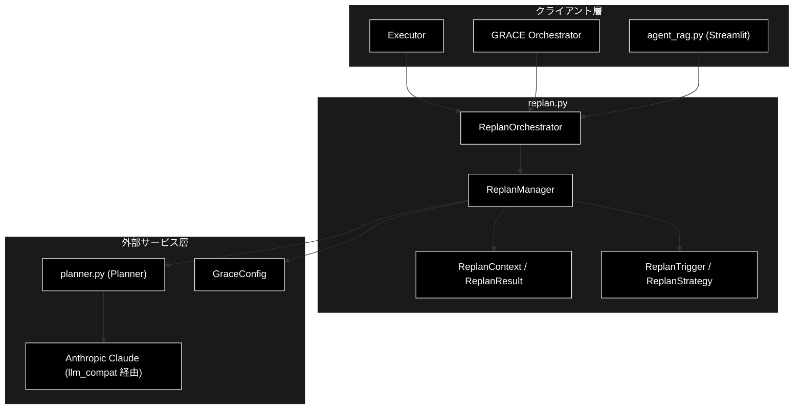
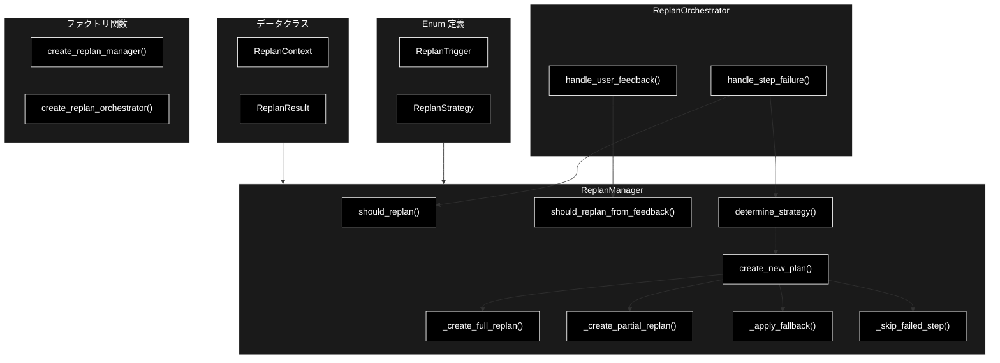
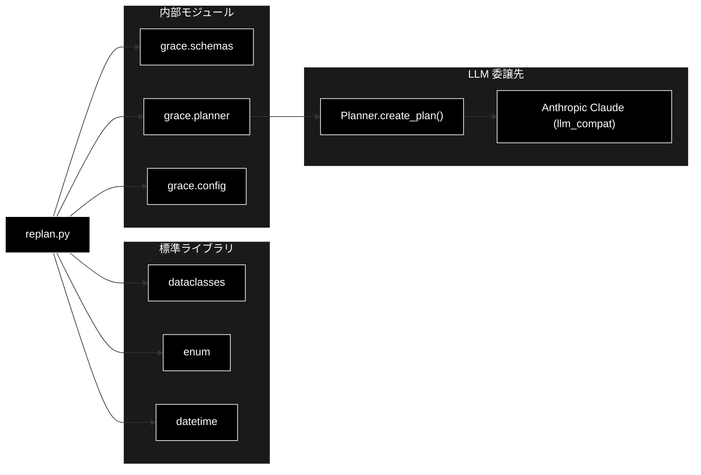

# replan.py - GRACE 動的リプランニングシステム ドキュメント

**Version 1.5** | 最終更新: 2026-06-16

---

## 目次

1. [概要](#概要)
2. [1. アーキテクチャ構成図](#1-アーキテクチャ構成図)
3. [2. モジュール構成図](#2-モジュール構成図)
4. [3. クラス・関数一覧表](#3-クラス関数一覧表)
5. [4. クラス・関数 IPO詳細](#4-クラス関数-ipo詳細)
6. [5. 設定・定数](#5-設定定数)
7. [6. 使用例](#6-使用例)
8. [7. エクスポート](#7-エクスポート)
9. [8. 変更履歴](#8-変更履歴)
10. [付録: 依存関係図](#付録-依存関係図)

---

## 概要

`replan.py`は、GRACE自律エージェントの「動的リプランニング（Replan）」層を担うモジュールです。ステップ実行の失敗・低信頼度・ユーザーフィードバック等のトリガーを検知し、状況に応じた戦略（全体再計画・部分再計画・フォールバック・スキップ・中断）で計画（`ExecutionPlan`）を動的に修正します。再計画の実体は `Planner.create_plan()` に委譲するため、LLM（Anthropic Claude、既定 `claude-sonnet-4-6`）の呼び出しは `planner.py` を経由します。

本モジュールは、リプラントリガー/戦略を表す `Enum`、リプラン時の状態を保持するデータクラス、判定・戦略決定・計画再生成を行う `ReplanManager`、Executor と統合して自動リプランフローを管理する `ReplanOrchestrator` から構成されます。

### 主な責務

- リプラントリガー（失敗・低信頼度・フィードバック・新情報・タイムアウト）の定義
- リプラン戦略（全体・部分・フォールバック・スキップ・中断）の定義と選択
- ステップ結果・ユーザーフィードバックからのリプラン要否判定
- 戦略に応じた新しい実行計画の生成（Plannerへの委譲を含む）
- フォールバックチェーン（rag_search ↔ web_search）の適用
- Executor と統合した自動リプランフローの管理

### 各責務対応のモジュール

| # | 責務 | 対応モジュール | 説明 |
|---|------|--------------|------|
| 1 | リプラントリガーの定義 | `replan.py` | `ReplanTrigger` Enum |
| 2 | リプラン戦略の定義・選択 | `replan.py` | `ReplanStrategy` Enum / `ReplanManager.determine_strategy()` |
| 3 | リプラン要否判定 | `replan.py` | `ReplanManager.should_replan()` / `should_replan_from_feedback()` |
| 4 | 新しい計画の生成 | `replan.py` + `planner.py` | `ReplanManager.create_new_plan()`（Planner.create_plan に委譲） |
| 5 | フォールバックチェーンの適用 | `replan.py` | `ReplanManager._apply_fallback()` / `_SEARCH_FALLBACK_CHAIN` |
| 6 | 自動リプランフローの管理 | `replan.py` | `ReplanOrchestrator` |

### 主要機能一覧

| 機能 | 説明 |
|------|------|
| `ReplanTrigger` | リプランのトリガー条件を表す文字列Enum |
| `ReplanStrategy` | リプラン戦略を表す文字列Enum |
| `ReplanContext` | リプラン時のコンテキストを保持するデータクラス |
| `ReplanResult` | リプラン結果を表すデータクラス |
| `ReplanManager` | 動的リプランニング管理クラス |
| `ReplanManager.should_replan()` | ステップ結果からリプラン要否を判定 |
| `ReplanManager.should_replan_from_feedback()` | フィードバックからリプラン要否を判定 |
| `ReplanManager.determine_strategy()` | リプラン戦略を決定 |
| `ReplanManager.create_new_plan()` | 戦略に応じて新計画を生成 |
| `ReplanOrchestrator` | Executor と統合した自動リプランオーケストレーター |
| `ReplanOrchestrator.handle_step_failure()` | ステップ失敗時のリプラン処理 |
| `ReplanOrchestrator.handle_user_feedback()` | フィードバックによるリプラン処理 |
| `create_replan_manager()` | ReplanManagerを生成するファクトリ関数 |
| `create_replan_orchestrator()` | ReplanOrchestratorを生成するファクトリ関数 |

---

## 1. アーキテクチャ構成図

### 1.1 システム全体構成



### 1.2 データフロー

1. Executor がステップ実行結果（`StepResult`）またはユーザーフィードバックを `ReplanOrchestrator` に渡す
2. `should_replan()` / `should_replan_from_feedback()` でリプラン要否とトリガーを判定
3. リプランが必要な場合、`ReplanContext` を構築
4. `determine_strategy()` でトリガー・失敗位置・フィードバック内容から戦略を決定
5. `create_new_plan()` が戦略に応じて再計画（全体は `Planner.create_plan()` に委譲）
6. フォールバック戦略では `_apply_fallback()` がフォールバックチェーンを適用
7. 結果を `ReplanResult` として返却し、`ReplanManager.history` に記録

---

## 2. モジュール構成図

### 2.1 内部モジュール構成



### 2.2 外部依存関係

| ライブラリ | バージョン | 用途 |
|-----------|-----------|------|
| `pydantic` | >=2.0 | `ExecutionPlan` / `PlanStep` / `StepResult` のスキーマ（schemas経由） |
| （標準）`dataclasses` | - | `ReplanContext` / `ReplanResult` の定義 |
| （標準）`enum` | - | `ReplanTrigger` / `ReplanStrategy` の定義 |
| （標準）`datetime` | - | コンテキスト・結果の作成日時 |

### 2.3 内部依存モジュール

| モジュール | 用途 |
|-----------|------|
| `grace.schemas` | `ExecutionPlan` / `PlanStep` / `StepResult` |
| `grace.planner` | `Planner` / `create_planner`（再計画の委譲先） |
| `grace.config` | `GraceConfig` / `get_config` |

---

## 3. クラス・関数一覧表

### 3.1 クラス一覧

#### ReplanTrigger（Enum）

| メンバー | 値 | 概要 |
|---------|-----|------|
| `STEP_FAILED` | "step_failed" | ステップ実行失敗 |
| `LOW_CONFIDENCE` | "low_confidence" | 信頼度が閾値未満 |
| `USER_FEEDBACK` | "user_feedback" | ユーザーからの修正要求 |
| `NEW_INFORMATION` | "new_information" | 新しい情報の発見 |
| `TIMEOUT` | "timeout" | タイムアウト |

#### ReplanStrategy（Enum）

| メンバー | 値 | 概要 |
|---------|-----|------|
| `PARTIAL` | "partial" | 失敗ステップ以降のみ再計画 |
| `FULL` | "full" | 全体を再計画 |
| `FALLBACK` | "fallback" | 代替アクションへ切り替え |
| `SKIP` | "skip" | 失敗ステップをスキップ |
| `ABORT` | "abort" | 実行中断 |

#### ReplanContext（dataclass）

| フィールド/プロパティ | 概要 |
|---------|------|
| `trigger`, `original_query`, `failed_step_id`, `error_message`, `completed_results`, `user_feedback`, `new_information`, `replan_count`, `created_at` | リプラン時の状態 |
| `has_completed_steps` | 完了済みステップがあるか（プロパティ） |
| `completed_step_ids` | 完了済みステップIDのリスト（プロパティ） |
| `get_completed_outputs()` | 完了済みステップの出力を取得 |

#### ReplanResult（dataclass）

| フィールド | 概要 |
|---------|------|
| `success`, `strategy`, `new_plan`, `reason`, `replan_count`, `created_at` | リプラン結果 |

#### ReplanManager

| メソッド | 概要 |
|---------|------|
| `__init__(config, planner)` | 設定・Planner・リプラン制限・履歴を初期化 |
| `should_replan(step_result, replan_count)` | ステップ結果からリプラン要否を判定 |
| `should_replan_from_feedback(feedback, replan_count)` | フィードバックからリプラン要否を判定 |
| `determine_strategy(context, current_plan)` | リプラン戦略を決定 |
| `create_new_plan(context, strategy, current_plan)` | 戦略に応じて新計画を生成 |
| `can_replan(replan_count)` | リプラン可能か判定 |
| `get_history()` | リプラン履歴を取得 |
| `clear_history()` | リプラン履歴をクリア |
| `_get_planner()` | Plannerを遅延取得 |
| `_create_full_replan(context)` | 全体再計画 |
| `_create_partial_replan(context, current_plan)` | 部分再計画 |
| `_apply_fallback(context, current_plan)` | フォールバック適用 |
| `_skip_failed_step(context, current_plan)` | 失敗ステップスキップ |
| `_enhance_query_with_context(...)` | エラーコンテキストを含むクエリ生成 |
| `_create_remaining_query(...)` | 残りステップ再計画クエリ生成 |
| `_adjust_step_ids(...)` | ステップID・依存関係の調整 |
| `_find_step(plan, step_id)` | 計画からステップを検索 |

#### ReplanOrchestrator

| メソッド | 概要 |
|---------|------|
| `__init__(config, replan_manager)` | 設定・ReplanManagerを初期化 |
| `handle_step_failure(...)` | ステップ失敗時のリプラン処理 |
| `handle_user_feedback(...)` | フィードバックによるリプラン処理 |

### 3.2 関数一覧（カテゴリ別）

#### ファクトリ関数

| 関数名 | 概要 |
|-------|------|
| `create_replan_manager(config, planner)` | ReplanManagerインスタンスを生成 |
| `create_replan_orchestrator(config, replan_manager)` | ReplanOrchestratorインスタンスを生成 |

---

## 4. クラス・関数 IPO詳細

### 4.1 ReplanTrigger / ReplanStrategy（Enum）

**概要**: リプランのトリガー条件（`ReplanTrigger`）と戦略（`ReplanStrategy`）を表す文字列Enum。いずれも `str, Enum` を継承し、値は文字列。

```python
class ReplanTrigger(str, Enum):
    STEP_FAILED = "step_failed"
    LOW_CONFIDENCE = "low_confidence"
    USER_FEEDBACK = "user_feedback"
    NEW_INFORMATION = "new_information"
    TIMEOUT = "timeout"

class ReplanStrategy(str, Enum):
    PARTIAL = "partial"
    FULL = "full"
    FALLBACK = "fallback"
    SKIP = "skip"
    ABORT = "abort"
```

| 項目 | 内容 |
|------|------|
| **Input** | なし（定義） |
| **Process** | 文字列値を持つEnumメンバーを定義 |
| **Output** | `ReplanTrigger` / `ReplanStrategy` の各メンバー |

**戻り値例**:
```python
ReplanTrigger.STEP_FAILED        # "step_failed"
ReplanStrategy.FALLBACK          # "fallback"
```

```python
# 使用例
from grace.replan import ReplanTrigger, ReplanStrategy

print(ReplanTrigger.STEP_FAILED.value)
print(ReplanStrategy.FULL.value)
# 出力: step_failed
# 出力: full
```

### 4.2 ReplanContext クラス（dataclass）

リプラン時のコンテキスト（トリガー・失敗位置・完了済み結果・フィードバック等）を保持する。

#### コンストラクタ: `ReplanContext`

**概要**: リプラン時の状態を保持するデータクラス。

```python
@dataclass
class ReplanContext:
    trigger: ReplanTrigger
    original_query: str
    failed_step_id: Optional[int] = None
    error_message: Optional[str] = None
    completed_results: Dict[int, StepResult] = field(default_factory=dict)
    user_feedback: Optional[str] = None
    new_information: Optional[str] = None
    replan_count: int = 0
    created_at: datetime = field(default_factory=datetime.now)
```

| パラメータ | 型 | デフォルト | 説明 |
|------------|------|-----------|------|
| `trigger` | ReplanTrigger | - | リプラントリガー |
| `original_query` | str | - | 元のユーザー質問 |
| `failed_step_id` | Optional[int] | None | 失敗ステップID |
| `error_message` | Optional[str] | None | エラーメッセージ |
| `completed_results` | Dict[int, StepResult] | {} | 完了済みステップ結果 |
| `user_feedback` | Optional[str] | None | ユーザーフィードバック |
| `new_information` | Optional[str] | None | 新情報 |
| `replan_count` | int | 0 | 現在のリプラン回数 |
| `created_at` | datetime | now | 作成日時 |

| 項目 | 内容 |
|------|------|
| **Input** | 上記パラメータ |
| **Process** | データクラスとして属性を保持。`has_completed_steps` / `completed_step_ids` プロパティと `get_completed_outputs()` を提供 |
| **Output** | ReplanContextインスタンス |

**戻り値例**:
```python
{
    "trigger": "step_failed",
    "original_query": "RAGとは？",
    "failed_step_id": 1,
    "replan_count": 0
}
```

```python
# 使用例
from grace.replan import ReplanContext, ReplanTrigger

ctx = ReplanContext(
    trigger=ReplanTrigger.STEP_FAILED,
    original_query="RAGとは？",
    failed_step_id=1,
    error_message="timeout"
)
print(ctx.has_completed_steps)
# 出力: False
```

### 4.3 ReplanResult クラス（dataclass）

リプラン結果（成否・戦略・新計画・理由・回数）を保持する。

#### コンストラクタ: `ReplanResult`

**概要**: リプラン処理の結果を表すデータクラス。

```python
@dataclass
class ReplanResult:
    success: bool
    strategy: ReplanStrategy
    new_plan: Optional[ExecutionPlan] = None
    reason: str = ""
    replan_count: int = 0
    created_at: datetime = field(default_factory=datetime.now)
```

| パラメータ | 型 | デフォルト | 説明 |
|------------|------|-----------|------|
| `success` | bool | - | リプラン成否 |
| `strategy` | ReplanStrategy | - | 採用された戦略 |
| `new_plan` | Optional[ExecutionPlan] | None | 新しい計画 |
| `reason` | str | "" | 結果の理由 |
| `replan_count` | int | 0 | リプラン後の回数 |
| `created_at` | datetime | now | 作成日時 |

| 項目 | 内容 |
|------|------|
| **Input** | 上記パラメータ |
| **Process** | データクラスとして属性を保持 |
| **Output** | ReplanResultインスタンス |

**戻り値例**:
```python
{
    "success": True,
    "strategy": "fallback",
    "new_plan": "<ExecutionPlan>",
    "reason": "代替アクション適用",
    "replan_count": 1
}
```

```python
# 使用例
from grace.replan import ReplanResult, ReplanStrategy

result = ReplanResult(success=True, strategy=ReplanStrategy.FALLBACK, reason="代替適用")
print(result.success, result.strategy.value)
# 出力: True fallback
```

### 4.4 ReplanManager クラス

失敗やフィードバックに応じて計画を動的に修正する管理クラス。

#### コンストラクタ: `__init__`

**概要**: 設定・Planner・リプラン制限・履歴を初期化する。

```python
ReplanManager(
    config: Optional[GraceConfig] = None,
    planner: Optional[Planner] = None
)
```

| パラメータ | 型 | デフォルト | 説明 |
|------------|------|-----------|------|
| `config` | Optional[GraceConfig] | None | GRACE設定（Noneの場合は `get_config()`） |
| `planner` | Optional[Planner] | None | 計画生成用Planner（Noneの場合は遅延生成） |

| 項目 | 内容 |
|------|------|
| **Input** | `config: Optional[GraceConfig] = None`, `planner: Optional[Planner] = None` |
| **Process** | 1. `config` を解決<br>2. `max_replans` / `confidence_threshold` / `partial_replan_threshold` を設定から取得<br>3. `history` を空リストで初期化 |
| **Output** | ReplanManagerインスタンス |

**戻り値例**:
```python
{
    "max_replans": 3,
    "confidence_threshold": 0.4,
    "partial_replan_threshold": 0.6,
    "history": []
}
```

```python
# 使用例
from grace.replan import ReplanManager

mgr = ReplanManager()
print(mgr.max_replans)
# 出力: 3
```

#### メソッド: `should_replan`

**概要**: ステップ実行結果（失敗・低信頼度）からリプラン要否とトリガーを判定する。

```python
def should_replan(
    self, step_result: StepResult, replan_count: int
) -> tuple[bool, Optional[ReplanTrigger]]
```

| パラメータ | 型 | デフォルト | 説明 |
|------------|------|-----------|------|
| `step_result` | StepResult | - | ステップ実行結果 |
| `replan_count` | int | - | 現在のリプラン回数 |

| 項目 | 内容 |
|------|------|
| **Input** | `step_result: StepResult`, `replan_count: int` |
| **Process** | 1. `replan_count >= max_replans` なら (False, None)<br>2. `status == "failed"` なら (True, STEP_FAILED)<br>3. `confidence < confidence_threshold` なら (True, LOW_CONFIDENCE)<br>4. それ以外は (False, None) |
| **Output** | `tuple[bool, Optional[ReplanTrigger]]`: リプラン要否とトリガー |

**戻り値例**:
```python
(True, ReplanTrigger.STEP_FAILED)
```

```python
# 使用例
from grace.replan import ReplanManager
from grace.schemas import StepResult

mgr = ReplanManager()
sr = StepResult(step_id=1, status="failed", confidence=0.0)
print(mgr.should_replan(sr, replan_count=0))
# 出力: (True, <ReplanTrigger.STEP_FAILED: 'step_failed'>)
```

#### メソッド: `should_replan_from_feedback`

**概要**: ユーザーフィードバックに修正要求キーワードが含まれるかでリプラン要否を判定する。

```python
def should_replan_from_feedback(
    self, feedback: str, replan_count: int
) -> tuple[bool, Optional[ReplanTrigger]]
```

| パラメータ | 型 | デフォルト | 説明 |
|------------|------|-----------|------|
| `feedback` | str | - | ユーザーフィードバック |
| `replan_count` | int | - | 現在のリプラン回数 |

| 項目 | 内容 |
|------|------|
| **Input** | `feedback: str`, `replan_count: int` |
| **Process** | 1. `replan_count >= max_replans` なら (False, None)<br>2. 修正要求キーワード（"修正","変更","やり直し","違う","別の"）を含めば (True, USER_FEEDBACK)<br>3. それ以外は (False, None) |
| **Output** | `tuple[bool, Optional[ReplanTrigger]]`: リプラン要否とトリガー |

**戻り値例**:
```python
(True, ReplanTrigger.USER_FEEDBACK)
```

```python
# 使用例
mgr = ReplanManager()
print(mgr.should_replan_from_feedback("計画を修正してほしい", 0))
# 出力: (True, <ReplanTrigger.USER_FEEDBACK: 'user_feedback'>)
```

#### メソッド: `determine_strategy`

**概要**: トリガー・失敗位置・フィードバック内容に応じてリプラン戦略を決定する。

```python
def determine_strategy(
    self, context: ReplanContext, current_plan: ExecutionPlan
) -> ReplanStrategy
```

| パラメータ | 型 | デフォルト | 説明 |
|------------|------|-----------|------|
| `context` | ReplanContext | - | リプランコンテキスト |
| `current_plan` | ExecutionPlan | - | 現在の計画 |

| 項目 | 内容 |
|------|------|
| **Input** | `context: ReplanContext`, `current_plan: ExecutionPlan` |
| **Process** | 1. `replan_count >= max_replans` なら ABORT<br>2. STEP_FAILED かつ失敗ステップに `fallback` があれば FALLBACK<br>3. TIMEOUT なら FULL<br>4. USER_FEEDBACK は「最初から」を含めば FULL、それ以外 PARTIAL<br>5. 失敗位置が序盤（進捗 <= 0.34）なら FULL<br>6. それ以外は PARTIAL |
| **Output** | `ReplanStrategy`: 選択された戦略 |

**戻り値例**:
```python
ReplanStrategy.FALLBACK
```

```python
# 使用例
mgr = ReplanManager()
strategy = mgr.determine_strategy(ctx, current_plan)
print(strategy.value)
# 出力: fallback
```

#### メソッド: `create_new_plan`

**概要**: 戦略に応じて新しい計画を生成し、`ReplanResult` として返して履歴に記録する。

```python
def create_new_plan(
    self,
    context: ReplanContext,
    strategy: ReplanStrategy,
    current_plan: ExecutionPlan
) -> ReplanResult
```

| パラメータ | 型 | デフォルト | 説明 |
|------------|------|-----------|------|
| `context` | ReplanContext | - | リプランコンテキスト |
| `strategy` | ReplanStrategy | - | リプラン戦略 |
| `current_plan` | ExecutionPlan | - | 現在の計画 |

| 項目 | 内容 |
|------|------|
| **Input** | `context: ReplanContext`, `strategy: ReplanStrategy`, `current_plan: ExecutionPlan` |
| **Process** | 1. 戦略に応じて分岐<br>　- FULL: `_create_full_replan()`<br>　- PARTIAL: `_create_partial_replan()`<br>　- FALLBACK: `_apply_fallback()`<br>　- SKIP: `_skip_failed_step()`<br>　- ABORT: 中断結果<br>2. `ReplanResult` を構築<br>3. `history` に記録<br>4. 例外時は失敗結果を返却 |
| **Output** | `ReplanResult`: リプラン結果 |

**戻り値例**:
```python
{
    "success": True,
    "strategy": "partial",
    "new_plan": "<ExecutionPlan>",
    "reason": "部分再計画",
    "replan_count": 1
}
```

```python
# 使用例
mgr = ReplanManager()
result = mgr.create_new_plan(ctx, ReplanStrategy.FALLBACK, current_plan)
print(result.success, result.reason)
# 出力: True 代替アクション適用
```

#### メソッド: `can_replan`

**概要**: 現在のリプラン回数が上限未満かを判定する。

```python
def can_replan(self, replan_count: int) -> bool
```

| パラメータ | 型 | デフォルト | 説明 |
|------------|------|-----------|------|
| `replan_count` | int | - | 現在のリプラン回数 |

| 項目 | 内容 |
|------|------|
| **Input** | `replan_count: int` |
| **Process** | `replan_count < self.max_replans` を返す |
| **Output** | `bool`: リプラン可能か |

**戻り値例**:
```python
True
```

```python
# 使用例
mgr = ReplanManager()
print(mgr.can_replan(2))
# 出力: True
```

#### メソッド: `get_history` / `clear_history`

**概要**: リプラン履歴を取得（コピー）またはクリアする。

```python
def get_history(self) -> List[ReplanResult]
def clear_history(self)
```

| 項目 | 内容 |
|------|------|
| **Input** | なし（selfのみ） |
| **Process** | `get_history`: `self.history.copy()` を返す / `clear_history`: `self.history.clear()` |
| **Output** | `get_history`: `List[ReplanResult]` / `clear_history`: なし |

**戻り値例**:
```python
[]  # 履歴が空の場合
```

```python
# 使用例
mgr = ReplanManager()
history = mgr.get_history()
mgr.clear_history()
print(history)
# 出力: []
```

### 4.5 ReplanOrchestrator クラス

Executor と ReplanManager を統合し、自動リプランフローを管理する。

#### コンストラクタ: `__init__`

**概要**: 設定と ReplanManager を初期化する。

```python
ReplanOrchestrator(
    config: Optional[GraceConfig] = None,
    replan_manager: Optional[ReplanManager] = None
)
```

| パラメータ | 型 | デフォルト | 説明 |
|------------|------|-----------|------|
| `config` | Optional[GraceConfig] | None | GRACE設定 |
| `replan_manager` | Optional[ReplanManager] | None | ReplanManager（Noneの場合は自動生成） |

| 項目 | 内容 |
|------|------|
| **Input** | `config: Optional[GraceConfig] = None`, `replan_manager: Optional[ReplanManager] = None` |
| **Process** | `config` を解決し、`replan_manager` を解決（未指定なら `ReplanManager(config=self.config)`） |
| **Output** | ReplanOrchestratorインスタンス |

**戻り値例**:
```python
# <grace.replan.ReplanOrchestrator object at 0x...>
```

```python
# 使用例
from grace.replan import ReplanOrchestrator

orch = ReplanOrchestrator()
print(type(orch.replan_manager).__name__)
# 出力: ReplanManager
```

#### メソッド: `handle_step_failure`

**概要**: ステップ失敗時に、要否判定・コンテキスト構築・戦略決定・再計画を一括で行う。

```python
def handle_step_failure(
    self,
    step_result: StepResult,
    current_plan: ExecutionPlan,
    completed_results: Dict[int, StepResult],
    replan_count: int
) -> Optional[ReplanResult]
```

| パラメータ | 型 | デフォルト | 説明 |
|------------|------|-----------|------|
| `step_result` | StepResult | - | 失敗したステップの結果 |
| `current_plan` | ExecutionPlan | - | 現在の計画 |
| `completed_results` | Dict[int, StepResult] | - | 完了済み結果 |
| `replan_count` | int | - | 現在のリプラン回数 |

| 項目 | 内容 |
|------|------|
| **Input** | `step_result`, `current_plan`, `completed_results`, `replan_count` |
| **Process** | 1. `should_replan()` で要否判定（不要なら None）<br>2. `ReplanContext` を構築<br>3. `determine_strategy()` で戦略決定<br>4. `create_new_plan()` でリプラン実行 |
| **Output** | `Optional[ReplanResult]`: リプラン結果（不要時は None） |

**戻り値例**:
```python
{
    "success": True,
    "strategy": "fallback",
    "new_plan": "<ExecutionPlan>",
    "replan_count": 1
}
```

```python
# 使用例
orch = ReplanOrchestrator()
result = orch.handle_step_failure(step_result, current_plan, {}, replan_count=0)
if result:
    print(result.strategy.value)
# 出力: fallback
```

#### メソッド: `handle_user_feedback`

**概要**: ユーザーフィードバックに基づき、要否判定・コンテキスト構築・戦略決定・再計画を行う。

```python
def handle_user_feedback(
    self,
    feedback: str,
    current_plan: ExecutionPlan,
    completed_results: Dict[int, StepResult],
    replan_count: int
) -> Optional[ReplanResult]
```

| パラメータ | 型 | デフォルト | 説明 |
|------------|------|-----------|------|
| `feedback` | str | - | ユーザーフィードバック |
| `current_plan` | ExecutionPlan | - | 現在の計画 |
| `completed_results` | Dict[int, StepResult] | - | 完了済み結果 |
| `replan_count` | int | - | 現在のリプラン回数 |

| 項目 | 内容 |
|------|------|
| **Input** | `feedback`, `current_plan`, `completed_results`, `replan_count` |
| **Process** | 1. `should_replan_from_feedback()` で要否判定（不要なら None）<br>2. `ReplanContext`（USER_FEEDBACK）を構築<br>3. `determine_strategy()` で戦略決定<br>4. `create_new_plan()` でリプラン実行 |
| **Output** | `Optional[ReplanResult]`: リプラン結果（不要時は None） |

**戻り値例**:
```python
{
    "success": True,
    "strategy": "partial",
    "new_plan": "<ExecutionPlan>",
    "replan_count": 1
}
```

```python
# 使用例
orch = ReplanOrchestrator()
result = orch.handle_user_feedback("計画を変更して", current_plan, {}, 0)
if result:
    print(result.reason)
# 出力: 部分再計画
```

### 4.6 ファクトリ関数

#### `create_replan_manager`

**概要**: ReplanManagerインスタンスを生成するファクトリ関数。

```python
def create_replan_manager(
    config: Optional[GraceConfig] = None,
    planner: Optional[Planner] = None
) -> ReplanManager
```

| パラメータ | 型 | デフォルト | 説明 |
|------------|------|-----------|------|
| `config` | Optional[GraceConfig] | None | GRACE設定 |
| `planner` | Optional[Planner] | None | 計画生成用Planner |

| 項目 | 内容 |
|------|------|
| **Input** | `config: Optional[GraceConfig] = None`, `planner: Optional[Planner] = None` |
| **Process** | `ReplanManager(config=config, planner=planner)` を生成して返す |
| **Output** | `ReplanManager`: ReplanManagerインスタンス |

**戻り値例**:
```python
# <grace.replan.ReplanManager object at 0x...>
```

```python
# 使用例
from grace.replan import create_replan_manager

mgr = create_replan_manager()
print(mgr.max_replans)
# 出力: 3
```

#### `create_replan_orchestrator`

**概要**: ReplanOrchestratorインスタンスを生成するファクトリ関数。

```python
def create_replan_orchestrator(
    config: Optional[GraceConfig] = None,
    replan_manager: Optional[ReplanManager] = None
) -> ReplanOrchestrator
```

| パラメータ | 型 | デフォルト | 説明 |
|------------|------|-----------|------|
| `config` | Optional[GraceConfig] | None | GRACE設定 |
| `replan_manager` | Optional[ReplanManager] | None | リプランマネージャー |

| 項目 | 内容 |
|------|------|
| **Input** | `config: Optional[GraceConfig] = None`, `replan_manager: Optional[ReplanManager] = None` |
| **Process** | `ReplanOrchestrator(config=config, replan_manager=replan_manager)` を生成して返す |
| **Output** | `ReplanOrchestrator`: ReplanOrchestratorインスタンス |

**戻り値例**:
```python
# <grace.replan.ReplanOrchestrator object at 0x...>
```

```python
# 使用例
from grace.replan import create_replan_orchestrator

orch = create_replan_orchestrator()
print(type(orch).__name__)
# 出力: ReplanOrchestrator
```

---

## 5. 設定・定数

### 5.1 ReplanConfig（grace.config）

リプランの制限・閾値を制御する設定。`ReplanManager` が参照する。

```python
class ReplanConfig(BaseModel):
    max_replans: int = 3
    confidence_threshold: float = 0.4
    partial_replan_threshold: float = 0.6
    cooldown_seconds: int = 5
```

| キー | デフォルト値 | 説明 |
|-----|-------------|------|
| `max_replans` | 3 | 最大リプラン回数 |
| `confidence_threshold` | 0.4 | この信頼度未満で LOW_CONFIDENCE トリガー |
| `partial_replan_threshold` | 0.6 | 部分再計画の閾値（インスタンス属性に保持） |
| `cooldown_seconds` | 5 | リプラン間のクールダウン秒数 |

### 5.2 内部定数

| 定数名 | 説明 |
|-------|------|
| `ReplanManager._SEARCH_FALLBACK_CHAIN` | 検索系アクションのフォールバック優先順位 `{"rag_search": "web_search", "web_search": "rag_search"}`。`_apply_fallback()` で fallback が `reasoning` の場合に検索系へ昇格する際に使用 |

---

## 6. 使用例

### 6.1 基本的なワークフロー（ステップ失敗時の自動リプラン）

```python
from grace.replan import create_replan_orchestrator
from grace.schemas import StepResult

# 1. オーケストレーターを生成
orchestrator = create_replan_orchestrator()

# 2. ステップ失敗結果を受け取る
failed = StepResult(step_id=1, status="failed", confidence=0.0, error="timeout")

# 3. 自動リプラン処理
result = orchestrator.handle_step_failure(
    step_result=failed,
    current_plan=current_plan,
    completed_results={},
    replan_count=0
)

# 4. 結果を確認
if result and result.success:
    print(f"戦略: {result.strategy.value}, 新計画ステップ数: {len(result.new_plan.steps)}")
else:
    print("リプラン不要、または中断")
```

### 6.2 応用ワークフロー（ReplanManager を直接利用）

```python
from grace.replan import (
    create_replan_manager,
    ReplanContext,
    ReplanTrigger,
)

mgr = create_replan_manager()

# コンテキストを構築
ctx = ReplanContext(
    trigger=ReplanTrigger.STEP_FAILED,
    original_query="量子コンピュータとは？",
    failed_step_id=1,
    error_message="RAG search timeout",
    replan_count=0,
)

# 戦略を決定し、新計画を生成
strategy = mgr.determine_strategy(ctx, current_plan)
result = mgr.create_new_plan(ctx, strategy, current_plan)
print(f"理由: {result.reason}")

# 履歴を確認
print(f"履歴件数: {len(mgr.get_history())}")
```

---

## 7. エクスポート

`replan.py` の `__all__`:

```python
__all__ = [
    # Enums
    "ReplanTrigger",
    "ReplanStrategy",
    # Data classes
    "ReplanContext",
    "ReplanResult",
    # Managers
    "ReplanManager",
    "ReplanOrchestrator",
    # Factory functions
    "create_replan_manager",
    "create_replan_orchestrator",
]
```

`grace/__init__.py` 経由でも上記すべてがエクスポートされます。

---

## 8. 変更履歴

| バージョン | 変更内容 |
|-----------|---------|
| 1.0 | 初版作成（リプラントリガー・戦略・ReplanManager） |
| 1.2 | ReplanOrchestrator を追加、自動リプランフローを整理 |
| 1.3 | フォールバックチェーン（`_SEARCH_FALLBACK_CHAIN`）を追加 |
| 1.4 | IPO形式に再構成 |
| 1.5 | 2026-06-16: 実装に合わせて改訂。LLM経由（Planner→Anthropic Claude/`llm_compat`）の委譲関係を明記、全メソッドのIPO・シグネチャ・デフォルト値を反映、Mermaid を黒背景・白文字スタイルに統一 |

---

## 付録: 依存関係図


