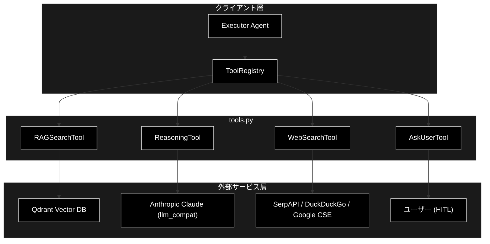
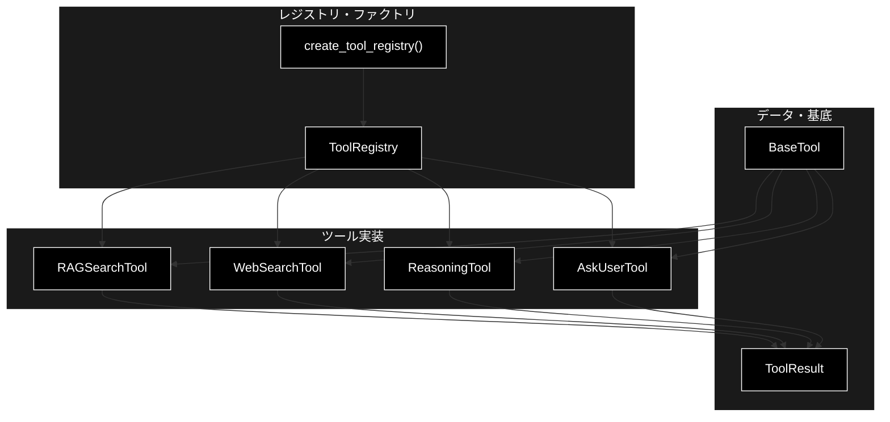
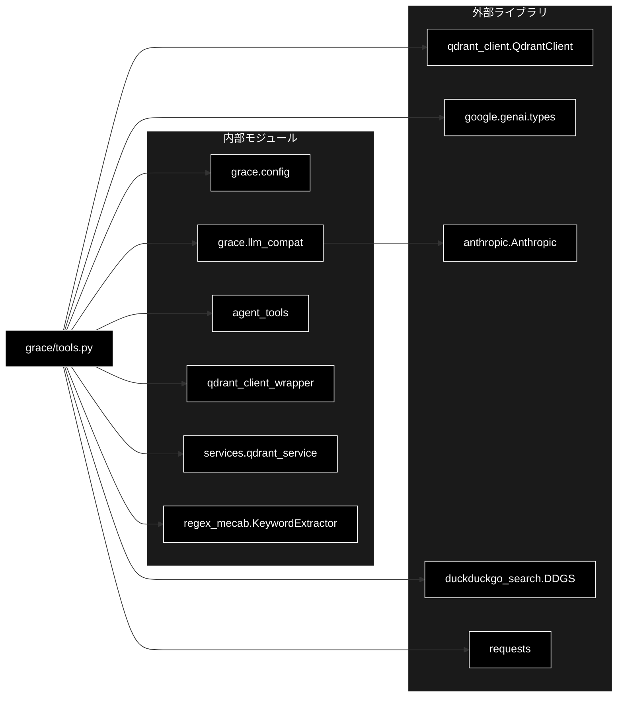

# tools.py - ツール定義モジュール ドキュメント

**Version 2.1** | 最終更新: 2026-06-16

---

## 目次

1. [概要](#概要)
   - [主な責務](#主な責務)
   - [各責務対応のモジュール](#各責務対応のモジュール)
   - [主要機能一覧](#主要機能一覧)
2. [アーキテクチャ構成図](#1-アーキテクチャ構成図)
   - [システム全体構成](#11-システム全体構成)
   - [データフロー](#12-データフロー)
3. [モジュール構成図](#2-モジュール構成図)
   - [内部モジュール構成](#21-内部モジュール構成)
   - [外部依存関係](#22-外部依存関係)
   - [内部依存モジュール](#23-内部依存モジュール)
4. [クラス・関数一覧表](#3-クラス関数一覧表)
   - [データクラス一覧](#31-データクラス一覧)
   - [クラス一覧](#32-クラス一覧)
   - [ファクトリ関数一覧](#33-ファクトリ関数一覧)
5. [クラス・関数 IPO詳細](#4-クラス関数-ipo詳細)
   - [ToolResult データクラス](#41-toolresult-データクラス)
   - [BaseTool クラス（抽象基底）](#42-basetool-クラス抽象基底)
   - [RAGSearchTool クラス](#43-ragsearchtool-クラス)
   - [ReasoningTool クラス](#44-reasoningtool-クラス)
   - [AskUserTool クラス](#45-askusertool-クラス)
   - [WebSearchTool クラス](#46-websearchtool-クラス)
   - [ToolRegistry クラス](#47-toolregistry-クラス)
   - [ファクトリ関数](#48-ファクトリ関数)
6. [設定・定数](#5-設定定数)
7. [使用例](#6-使用例)
8. [エクスポート](#7-エクスポート)
9. [変更履歴](#8-変更履歴)
10. [付録: 依存関係図](#付録-依存関係図)

---

## 概要

`tools.py` は、GRACE エージェントが実行計画の各ステップで呼び出す **ツール群** を定義するモジュールです。RAG 検索・Web 検索・LLM 推論・ユーザーへの問い合わせ（HITL）という4種のツールを統一インターフェース（`BaseTool` / `ToolResult`）の下に実装し、`ToolRegistry` を通じて名前ベースで呼び出せるようにします。

LLM 推論は Anthropic Claude（既定 `claude-sonnet-4-6`）を使用しますが、GRACE 本体は当初 google-genai 形式（`client.models.generate_content(...)`）で実装されているため、`grace/llm_compat.py` の互換アダプター（`create_chat_client`）を介して Anthropic API を呼び出します。Embedding（Qdrant 検索）は Gemini `gemini-embedding-001`（3072次元）を継続利用します。

### 主な責務

- ツール実行結果の統一表現（`ToolResult`）と統一インターフェース（`BaseTool`）の提供
- Qdrant ベクトルDBからの RAG 検索（動的コレクションフォールバック・動的閾値調整付き）
- 外部 Web 検索（SerpAPI / DuckDuckGo / Google CSE の切り替え）
- 収集情報を統合した LLM 推論による回答生成
- ユーザーへの追加情報要求（Human-in-the-Loop）
- ツールのレジストリ管理と名前ベースの実行ディスパッチ

### 各責務対応のモジュール

| # | 責務 | 対応モジュール | 説明 |
|---|------|--------------|------|
| 1 | ツール結果・基底IFの提供 | `grace/tools.py` | `ToolResult` データクラスと `BaseTool` 抽象基底クラス |
| 2 | Qdrant RAG 検索 | `grace/tools.py` | `RAGSearchTool` が `agent_tools.search_rag_knowledge_base_structured` へ委譲 |
| 3 | 外部 Web 検索 | `grace/tools.py` | `WebSearchTool` が SerpAPI/DDG/Google CSE を切替 |
| 4 | LLM 推論による回答生成 | `grace/tools.py` | `ReasoningTool` が `grace/llm_compat.create_chat_client`（Anthropic 互換）を使用 |
| 5 | ユーザーへの追加情報要求 | `grace/tools.py` | `AskUserTool`（HITL、Function Calling 定義付き） |
| 6 | レジストリ管理・実行ディスパッチ | `grace/tools.py` | `ToolRegistry` と `create_tool_registry()` |

### 主要機能一覧

| 機能 | 説明 |
|------|------|
| `ToolResult` | ツール実行結果を表すデータクラス |
| `BaseTool` | 全ツールの抽象基底クラス（`execute()` を定義） |
| `RAGSearchTool` | Qdrant ベクトルDB検索ツール |
| `RAGSearchTool.execute()` | RAG 検索の実行（コレクションフォールバック付き） |
| `RAGSearchTool._get_all_collections_dynamic()` | Qdrantから全コレクションを動的取得し優先順位付け |
| `RAGSearchTool._calculate_confidence_factors()` | スコア統計（件数・平均・分散など）を算出 |
| `ReasoningTool` | LLM 推論ツール（Anthropic Claude） |
| `ReasoningTool.execute()` | 参照情報を統合して回答を生成 |
| `ReasoningTool._build_prompt()` | 推論用プロンプトを構築 |
| `AskUserTool` | ユーザーへの追加情報要求ツール（HITL） |
| `AskUserTool.execute()` | 質問情報を `ToolResult` として返す |
| `WebSearchTool` | Web 検索ツール（複数バックエンド対応） |
| `WebSearchTool.execute()` | Web 検索の実行と RAG 互換変換 |
| `ToolRegistry` | ツールレジストリ |
| `ToolRegistry.execute()` | 名前指定でツールを実行 |
| `create_tool_registry()` | `ToolRegistry` を生成するファクトリ関数 |

---

## 1. アーキテクチャ構成図

### 1.1 システム全体構成



### 1.2 データフロー

1. Executor が `ToolRegistry.execute(name, **kwargs)` でツールを名前指定実行する
2. レジストリが該当 `BaseTool` の `execute()` を呼び出す
3. 各ツールが外部サービス（Qdrant / Claude / Web 検索 API / ユーザー）へアクセスする
4. 各ツールはスコア統計などを `confidence_factors` に格納する
5. 結果を `ToolResult`（`success` / `output` / `confidence_factors` / `error` / `execution_time_ms`）として返却する

---

## 2. モジュール構成図

### 2.1 内部モジュール構成



### 2.2 外部依存関係

| ライブラリ | バージョン | 用途 |
|-----------|-----------|------|
| `qdrant-client` | 1.15.x | Qdrant への接続・コレクション一覧取得 |
| `google-genai` | - | `types.GenerateContentConfig`（生成設定の構造体） |
| `anthropic` | - | LLM 呼び出し（`llm_compat` 経由で遅延 import） |
| `duckduckgo-search` | - | DuckDuckGo バックエンド（遅延 import） |
| `requests` | - | SerpAPI / Google CSE への HTTP リクエスト（遅延 import） |

### 2.3 内部依存モジュール

| モジュール | 用途 |
|-----------|------|
| `grace.config` | `get_config` / `GraceConfig`（設定取得） |
| `grace.llm_compat` | `create_chat_client`（Anthropic を genai 互換で呼び出す） |
| `agent_tools` | `search_rag_knowledge_base_structured`（RAG 検索本体・遅延 import） |
| `qdrant_client_wrapper` | `search_collection` / `embed_query_unified` / `embed_sparse_query_unified` |
| `services.qdrant_service` | `get_collection_embedding_params` |
| `regex_mecab` | `KeywordExtractor`（キーワード抽出） |

---

## 3. クラス・関数一覧表

### 3.1 データクラス一覧

#### ToolResult

| フィールド | 概要 |
|---------|------|
| `success: bool` | 実行成功フラグ |
| `output: Any` | ツールの出力（検索結果リスト・回答文字列・質問dict等） |
| `confidence_factors: Dict[str, Any]` | Confidence 計算用の統計情報（既定 `{}`） |
| `error: Optional[str]` | エラーメッセージ（既定 `None`） |
| `execution_time_ms: Optional[int]` | 実行時間（ミリ秒、既定 `None`） |

### 3.2 クラス一覧

#### BaseTool（抽象基底）

| メソッド | 概要 |
|---------|------|
| `execute(**kwargs)` | 抽象メソッド。ツールを実行し `ToolResult` を返す |

#### RAGSearchTool

| メソッド | 概要 |
|---------|------|
| `__init__(config, qdrant_url)` | コンストラクタ。KeywordExtractor を初期化 |
| `client` (property) | Qdrant クライアントの遅延初期化 |
| `execute(query, collection, limit, score_threshold, **kwargs)` | RAG 検索の実行 |
| `_get_all_collections_dynamic()` | 全コレクションを動的取得し優先順位付け |
| `_calculate_confidence_factors(scores)` | スコア統計を算出 |

#### ReasoningTool

| メソッド | 概要 |
|---------|------|
| `__init__(config, model_name)` | コンストラクタ。Anthropic 互換クライアントを生成 |
| `execute(query, context, sources, **kwargs)` | LLM 推論で回答生成 |
| `_build_prompt(query, context, sources)` | 推論用プロンプトを構築 |

#### AskUserTool

| メソッド | 概要 |
|---------|------|
| `execute(question, reason, urgency, options, **kwargs)` | 質問情報を `ToolResult` として返す |

#### WebSearchTool

| メソッド | 概要 |
|---------|------|
| `__init__(config)` | コンストラクタ。バックエンド・件数・言語を設定 |
| `execute(query, num_results, language, **kwargs)` | Web 検索の実行 |
| `_search_ddg(query, num_results, language)` | DuckDuckGo バックエンド |
| `_search_google(query, num_results, language)` | Google CSE バックエンド |
| `_search_serpapi(query, num_results, language)` | SerpAPI バックエンド（リトライ付き） |
| `_parse_to_rag_format(raw_results, num_results)` | RAG 互換フォーマットへ変換 |
| `_calculate_confidence_factors(scores)` | スコア統計を算出 |

#### ToolRegistry

| メソッド | 概要 |
|---------|------|
| `__init__(config)` | コンストラクタ。デフォルトツールを登録 |
| `_register_default_tools()` | 有効ツールを登録 |
| `register(tool)` | ツールを登録 |
| `get(name)` | ツールを取得 |
| `list_tools()` | 登録済みツール名のリスト |
| `execute(name, **kwargs)` | 名前指定でツールを実行 |

### 3.3 ファクトリ関数一覧

| 関数名 | 概要 |
|-------|------|
| `create_tool_registry(config)` | `ToolRegistry` インスタンスを生成 |

---

## 4. クラス・関数 IPO詳細

### 4.1 ToolResult データクラス

ツール実行結果を統一表現するデータクラス。全ツールの `execute()` はこの型を返します。

#### コンストラクタ: `ToolResult`

**概要**: ツール実行結果を保持するデータクラス。

```python
@dataclass
class ToolResult:
    success: bool
    output: Any
    confidence_factors: Dict[str, Any] = field(default_factory=dict)
    error: Optional[str] = None
    execution_time_ms: Optional[int] = None
```

| パラメータ | 型 | デフォルト | 説明 |
|------------|------|-----------|------|
| `success` | bool | - | 実行成功フラグ |
| `output` | Any | - | ツールの出力 |
| `confidence_factors` | Dict[str, Any] | `{}` | Confidence 計算用の統計情報 |
| `error` | Optional[str] | None | エラーメッセージ |
| `execution_time_ms` | Optional[int] | None | 実行時間（ミリ秒） |

| 項目 | 内容 |
|------|------|
| **Input** | `success: bool`, `output: Any`, `confidence_factors: Dict = {}`, `error: Optional[str] = None`, `execution_time_ms: Optional[int] = None` |
| **Process** | フィールドを保持する |
| **Output** | `ToolResult` インスタンス |

**戻り値例**:
```python
{
    "success": True,
    "output": ["result1", "result2"],
    "confidence_factors": {"result_count": 2, "avg_score": 0.85},
    "error": None,
    "execution_time_ms": 142
}
```

```python
# 使用例
result = ToolResult(success=True, output=["doc1"], execution_time_ms=120)
print(result.success)
# True
```

---

### 4.2 BaseTool クラス（抽象基底）

全ツールの抽象基底クラス。クラス属性 `name`・`description` と抽象メソッド `execute()` を定義します。

#### メソッド: `execute`

**概要**: ツールを実行する抽象メソッド（サブクラスで実装必須）。

```python
@abstractmethod
def execute(self, **kwargs) -> ToolResult
```

| パラメータ | 型 | デフォルト | 説明 |
|------------|------|-----------|------|
| `**kwargs` | Any | - | ツール固有の引数 |

| 項目 | 内容 |
|------|------|
| **Input** | `**kwargs`（ツール固有） |
| **Process** | サブクラスで具体的な処理を実装 |
| **Output** | `ToolResult` |

**戻り値例**:
```python
ToolResult(success=True, output="...", confidence_factors={})
```

```python
# 使用例
class MyTool(BaseTool):
    name = "my_tool"
    def execute(self, **kwargs) -> ToolResult:
        return ToolResult(success=True, output="ok")
```

---

### 4.3 RAGSearchTool クラス

Qdrant ベクトルDBから関連情報を検索するツール。`agent_tools.search_rag_knowledge_base_structured` に委譲し、コレクションの動的フォールバックと動的閾値調整を行います。

#### コンストラクタ: `__init__`

**概要**: 設定と Qdrant URL を保持し、KeywordExtractor を初期化する。

```python
def __init__(
    self,
    config: Optional[GraceConfig] = None,
    qdrant_url: Optional[str] = None
)
```

| パラメータ | 型 | デフォルト | 説明 |
|------------|------|-----------|------|
| `config` | Optional[GraceConfig] | None | GRACE 設定（None なら `get_config()`） |
| `qdrant_url` | Optional[str] | None | Qdrant URL（None なら `config.qdrant.url`） |

| 項目 | 内容 |
|------|------|
| **Input** | `config: Optional[GraceConfig] = None`, `qdrant_url: Optional[str] = None` |
| **Process** | 1. config / qdrant_url を解決<br>2. Qdrant クライアントは遅延初期化（None で保持）<br>3. `KeywordExtractor(prefer_mecab=True)` を初期化（失敗時は None） |
| **Output** | `RAGSearchTool` インスタンス |

**戻り値例**:
```python
RAGSearchTool(config=<GraceConfig>, qdrant_url="http://localhost:6333")
```

```python
# 使用例
tool = RAGSearchTool()
print(tool.name)
# rag_search
```

#### メソッド: `execute`

**概要**: RAG 検索を実行する。コレクションを優先順位順に試行し、結果が出た時点で採用する。

```python
def execute(
    self,
    query: str,
    collection: Optional[str] = None,
    limit: Optional[int] = None,
    score_threshold: Optional[float] = None,
    **kwargs
) -> ToolResult
```

| パラメータ | 型 | デフォルト | 説明 |
|------------|------|-----------|------|
| `query` | str | - | 検索クエリ |
| `collection` | Optional[str] | None | 検索対象コレクション（指定時は最優先で試行） |
| `limit` | Optional[int] | None | 取得件数上限 |
| `score_threshold` | Optional[float] | None | スコア閾値 |
| `**kwargs` | Any | - | 追加引数 |

| 項目 | 内容 |
|------|------|
| **Input** | `query: str`, `collection: Optional[str] = None`, `limit: Optional[int] = None`, `score_threshold: Optional[float] = None` |
| **Process** | 1. 検索候補コレクションを決定（指定 + `_get_all_collections_dynamic()`）<br>2. 候補を順次 `search_rag_knowledge_base_structured` で検索<br>3. 結果が出たコレクションを採用しループ終了<br>4. 動的閾値調整（1位が 0.98 以上なら上位1件のみ残す）<br>5. スコア統計を算出し `used_collection` を記録 |
| **Output** | `ToolResult`: 検索結果リスト（成功時）/ 空リスト（結果なし時は `success=False`） |

**戻り値例**:
```python
ToolResult(
    success=True,
    output=[
        {"score": 0.92, "payload": {"question": "...", "answer": "..."}, "collection": "wikipedia_ja"}
    ],
    confidence_factors={
        "result_count": 1,
        "avg_score": 0.92,
        "score_variance": 0.0,
        "max_score": 0.92,
        "min_score": 0.92,
        "used_collection": "wikipedia_ja"
    },
    execution_time_ms=210
)
```

```python
# 使用例
tool = RAGSearchTool()
result = tool.execute(query="退職手続きについて教えて")
if result.success:
    print(f"{len(result.output)}件ヒット（{result.confidence_factors['used_collection']}）")
```

#### メソッド: `_get_all_collections_dynamic`

**概要**: Qdrant から全コレクション一覧を動的取得し、設定の優先順位に従って並べ替える。

```python
def _get_all_collections_dynamic(self) -> List[str]
```

| パラメータ | 型 | デフォルト | 説明 |
|------------|------|-----------|------|
| なし（selfのみ） | - | - | - |

| 項目 | 内容 |
|------|------|
| **Input** | なし（selfのみ） |
| **Process** | 1. `client.get_collections()` で全コレクション取得<br>2. `config.qdrant.search_priority` を先頭に配置<br>3. 残りを後ろに追加<br>4. 失敗時は `search_priority` をそのまま返す |
| **Output** | `List[str]`: 優先順位付きコレクション名リスト |

**戻り値例**:
```python
["wikipedia_ja", "livedoor", "cc_news", "japanese_text"]
```

```python
# 使用例
tool = RAGSearchTool()
collections = tool._get_all_collections_dynamic()
print(collections[0])
# wikipedia_ja
```

#### メソッド: `_calculate_confidence_factors`

**概要**: スコアのリストから件数・平均・分散・最大・最小を算出する。

```python
def _calculate_confidence_factors(self, scores: List[float]) -> Dict[str, Any]
```

| パラメータ | 型 | デフォルト | 説明 |
|------------|------|-----------|------|
| `scores` | List[float] | - | スコアのリスト |

| 項目 | 内容 |
|------|------|
| **Input** | `scores: List[float]` |
| **Process** | 1. 空なら全ゼロの統計を返す<br>2. 平均を算出<br>3. 件数2以上なら分散を算出<br>4. 件数・平均・分散・最大・最小を返す |
| **Output** | `Dict[str, Any]`: `{result_count, avg_score, score_variance, max_score, min_score}` |

**戻り値例**:
```python
{
    "result_count": 3,
    "avg_score": 0.81,
    "score_variance": 0.004,
    "max_score": 0.92,
    "min_score": 0.71
}
```

```python
# 使用例
tool = RAGSearchTool()
stats = tool._calculate_confidence_factors([0.92, 0.80, 0.71])
print(stats["avg_score"])
# 0.81
```

---

### 4.4 ReasoningTool クラス

収集した情報を統合して回答を生成する LLM 推論ツール。`grace/llm_compat.create_chat_client` 経由で Anthropic Claude（既定 `claude-sonnet-4-6`）を genai 互換インターフェースで呼び出します。

#### コンストラクタ: `__init__`

**概要**: 設定とモデル名を保持し、Anthropic 互換クライアントを生成する。

```python
def __init__(
    self,
    config: Optional[GraceConfig] = None,
    model_name: Optional[str] = None
)
```

| パラメータ | 型 | デフォルト | 説明 |
|------------|------|-----------|------|
| `config` | Optional[GraceConfig] | None | GRACE 設定（None なら `get_config()`） |
| `model_name` | Optional[str] | None | モデル名（None なら `config.llm.model`） |

| 項目 | 内容 |
|------|------|
| **Input** | `config: Optional[GraceConfig] = None`, `model_name: Optional[str] = None` |
| **Process** | 1. config / model_name を解決<br>2. `create_chat_client(config)` でクライアント生成 |
| **Output** | `ReasoningTool` インスタンス |

**戻り値例**:
```python
ReasoningTool(config=<GraceConfig>, model_name="claude-sonnet-4-6")
```

```python
# 使用例
tool = ReasoningTool()
print(tool.model_name)
# claude-sonnet-4-6
```

#### メソッド: `execute`

**概要**: クエリ・コンテキスト・参照ソースからプロンプトを構築し、Claude で回答を生成する。

```python
def execute(
    self,
    query: str,
    context: Optional[str] = None,
    sources: Optional[List[Dict]] = None,
    **kwargs
) -> ToolResult
```

| パラメータ | 型 | デフォルト | 説明 |
|------------|------|-----------|------|
| `query` | str | - | 元のクエリ |
| `context` | Optional[str] | None | 追加コンテキスト |
| `sources` | Optional[List[Dict]] | None | 参照ソース（RAG 検索結果など） |
| `**kwargs` | Any | - | 追加引数 |

| 項目 | 内容 |
|------|------|
| **Input** | `query: str`, `context: Optional[str] = None`, `sources: Optional[List[Dict]] = None` |
| **Process** | 1. `_build_prompt()` でプロンプト構築<br>2. `client.models.generate_content()`（互換層 → Anthropic）で生成<br>3. `response.text` を回答とし、`usage_metadata` からトークン使用量を取得<br>4. 失敗時は `success=False` を返す |
| **Output** | `ToolResult`: 生成された回答文字列（成功時） |

**戻り値例**:
```python
ToolResult(
    success=True,
    output="社内ナレッジ（faq.csv）によると、退職手続きは...",
    confidence_factors={
        "has_sources": True,
        "source_count": 2,
        "answer_length": 312,
        "token_usage": {"input_tokens": 850, "output_tokens": 210}
    },
    execution_time_ms=1840
)
```

```python
# 使用例
tool = ReasoningTool()
result = tool.execute(query="退職手続きは？", sources=rag_results)
print(result.output)
```

#### メソッド: `_build_prompt`

**概要**: システム指示・参照情報・補足コンテキスト・質問・回答ルールを連結した推論用プロンプトを構築する。

```python
def _build_prompt(
    self,
    query: str,
    context: Optional[str],
    sources: Optional[List[Dict]]
) -> str
```

| パラメータ | 型 | デフォルト | 説明 |
|------------|------|-----------|------|
| `query` | str | - | ユーザーの質問 |
| `context` | Optional[str] | - | 補足コンテキスト |
| `sources` | Optional[List[Dict]] | - | 参照情報（payload に question/answer/content/source） |

| 項目 | 内容 |
|------|------|
| **Input** | `query: str`, `context: Optional[str]`, `sources: Optional[List[Dict]]` |
| **Process** | 1. システム指示を追加<br>2. ソースを「情報源 i」として列挙（信頼度・コレクション・Q/A・出典）<br>3. 補足コンテキストを追加<br>4. 質問と回答ルール（正確性・出典明示・捏造禁止など）を追加 |
| **Output** | `str`: 構築済みプロンプト |

**戻り値例**:
```python
"あなたは社内ドキュメント検索システムと連携した...\n### 【参照情報】\n--- 情報源 1 ..."
```

```python
# 使用例
tool = ReasoningTool()
prompt = tool._build_prompt("退職手続きは？", None, rag_results)
print(prompt[:30])
```

---

### 4.5 AskUserTool クラス

ユーザーに追加情報や確認を求める HITL ツール。クラス属性 `FUNCTION_DECLARATION` に Function Calling 用の関数定義（`ask_user_for_clarification`）を持ちます。

#### メソッド: `execute`

**概要**: 質問情報を `ToolResult` として返す（実際の UI 連携は Executor が担当）。

```python
def execute(
    self,
    question: str,
    reason: str,
    urgency: str = "blocking",
    options: Optional[List[str]] = None,
    **kwargs
) -> ToolResult
```

| パラメータ | 型 | デフォルト | 説明 |
|------------|------|-----------|------|
| `question` | str | - | ユーザーへの質問 |
| `reason` | str | - | 質問の理由 |
| `urgency` | str | "blocking" | 緊急度（blocking / optional） |
| `options` | Optional[List[str]] | None | 選択肢リスト |
| `**kwargs` | Any | - | 追加引数 |

| 項目 | 内容 |
|------|------|
| **Input** | `question: str`, `reason: str`, `urgency: str = "blocking"`, `options: Optional[List[str]] = None` |
| **Process** | 1. 質問内容をログ出力<br>2. 質問情報を dict にまとめ `awaiting_response=True` を付与 |
| **Output** | `ToolResult`: 質問情報 dict（`success=True`） |

**戻り値例**:
```python
ToolResult(
    success=True,
    output={
        "question": "対象の年度はいつですか？",
        "reason": "複数年度の情報が存在するため",
        "urgency": "blocking",
        "options": ["2024年度", "2025年度"],
        "awaiting_response": True
    },
    confidence_factors={"requires_user_input": True, "urgency": "blocking"}
)
```

```python
# 使用例
tool = AskUserTool()
result = tool.execute(question="対象年度は？", reason="複数年度あり", urgency="blocking")
print(result.output["awaiting_response"])
# True
```

---

### 4.6 WebSearchTool クラス

Web 検索で最新情報を取得するツール。SerpAPI / DuckDuckGo / Google CSE のバックエンドを設定で切り替え、結果を rag_search 互換フォーマットに変換します。

#### コンストラクタ: `__init__`

**概要**: 設定からバックエンド・件数・言語・タイムアウトを読み込む。

```python
def __init__(self, config: Optional[GraceConfig] = None)
```

| パラメータ | 型 | デフォルト | 説明 |
|------------|------|-----------|------|
| `config` | Optional[GraceConfig] | None | GRACE 設定（None なら `get_config()`） |

| 項目 | 内容 |
|------|------|
| **Input** | `config: Optional[GraceConfig] = None` |
| **Process** | `config.web_search` から `backend` / `num_results` / `language` / `timeout` を取得 |
| **Output** | `WebSearchTool` インスタンス |

**戻り値例**:
```python
WebSearchTool(config=<GraceConfig>)  # backend="serpapi", num_results=5
```

```python
# 使用例
tool = WebSearchTool()
print(tool.backend)
# serpapi
```

#### メソッド: `execute`

**概要**: 設定バックエンドで Web 検索を実行し、rag_search 互換形式に変換して返す。

```python
def execute(
    self,
    query: str,
    num_results: Optional[int] = None,
    language: Optional[str] = None,
    **kwargs
) -> ToolResult
```

| パラメータ | 型 | デフォルト | 説明 |
|------------|------|-----------|------|
| `query` | str | - | 検索クエリ |
| `num_results` | Optional[int] | None | 取得件数（None なら config 値） |
| `language` | Optional[str] | None | 検索言語（None なら config 値） |
| `**kwargs` | Any | - | 追加引数 |

| 項目 | 内容 |
|------|------|
| **Input** | `query: str`, `num_results: Optional[int] = None`, `language: Optional[str] = None` |
| **Process** | 1. backend に応じて `_search_ddg` / `_search_google` / `_search_serpapi` を呼ぶ<br>2. `_parse_to_rag_format()` で rag_search 互換に変換<br>3. 結果なしなら `success=False`<br>4. スコア統計を算出 |
| **Output** | `ToolResult`: rag_search 互換の検索結果リスト |

**戻り値例**:
```python
ToolResult(
    success=True,
    output=[
        {"score": 1.0, "payload": {"answer": "...", "source": "https://...", "title": "..."}, "collection": "web_search"}
    ],
    confidence_factors={"result_count": 5, "avg_score": 0.8, "top_score": 1.0, "score_spread": 0.4, "search_engine": "serpapi"},
    execution_time_ms=920
)
```

```python
# 使用例
tool = WebSearchTool()
result = tool.execute(query="2026年 日本の祝日")
print(result.confidence_factors["search_engine"])
# serpapi
```

---

### 4.7 ToolRegistry クラス

ツールを名前で登録・取得・実行するレジストリ。設定の `tools.enabled` に基づきデフォルトツールを自動登録します。

#### コンストラクタ: `__init__`

**概要**: 設定を保持し、有効ツールを登録する。

```python
def __init__(self, config: Optional[GraceConfig] = None)
```

| パラメータ | 型 | デフォルト | 説明 |
|------------|------|-----------|------|
| `config` | Optional[GraceConfig] | None | GRACE 設定（None なら `get_config()`） |

| 項目 | 内容 |
|------|------|
| **Input** | `config: Optional[GraceConfig] = None` |
| **Process** | 1. config を解決<br>2. `_register_default_tools()` で `tools.enabled` に含まれるツールを登録 |
| **Output** | `ToolRegistry` インスタンス |

**戻り値例**:
```python
ToolRegistry(config=<GraceConfig>)  # rag_search, web_search, reasoning, ask_user を登録
```

```python
# 使用例
registry = ToolRegistry()
print(registry.list_tools())
# ['rag_search', 'web_search', 'reasoning', 'ask_user']
```

#### メソッド: `execute`

**概要**: 名前指定でツールを取得し、`execute()` を呼び出す。

```python
def execute(self, name: str, **kwargs) -> ToolResult
```

| パラメータ | 型 | デフォルト | 説明 |
|------------|------|-----------|------|
| `name` | str | - | 実行するツール名 |
| `**kwargs` | Any | - | ツールへ渡す引数 |

| 項目 | 内容 |
|------|------|
| **Input** | `name: str`, `**kwargs` |
| **Process** | 1. `get(name)` でツール取得<br>2. 未登録なら `success=False`<br>3. 登録済みなら `tool.execute(**kwargs)` を呼ぶ |
| **Output** | `ToolResult` |

**戻り値例**:
```python
ToolResult(success=True, output=[...], confidence_factors={...})
```

```python
# 使用例
registry = ToolRegistry()
result = registry.execute("rag_search", query="退職手続きについて")
print(result.success)
```

---

### 4.8 ファクトリ関数

#### `create_tool_registry`

**概要**: `ToolRegistry` インスタンスを生成するファクトリ関数。

```python
def create_tool_registry(config: Optional[GraceConfig] = None) -> ToolRegistry
```

| パラメータ | 型 | デフォルト | 説明 |
|------------|------|-----------|------|
| `config` | Optional[GraceConfig] | None | GRACE 設定（None なら `get_config()`） |

| 項目 | 内容 |
|------|------|
| **Input** | `config: Optional[GraceConfig] = None` |
| **Process** | `ToolRegistry(config=config)` を生成して返す |
| **Output** | `ToolRegistry` インスタンス |

**戻り値例**:
```python
ToolRegistry(config=<GraceConfig>)
```

```python
# 使用例
registry = create_tool_registry()
result = registry.execute("reasoning", query="...", sources=[...])
```

---

## 5. 設定・定数

ツール群は `GraceConfig`（`grace/config.py`）の各セクションを参照します。

### 5.1 ツール関連設定

| 設定キー | デフォルト値 | 説明 |
|---------|-------------|------|
| `tools.enabled` | `["rag_search", "web_search", "reasoning", "ask_user"]` | レジストリが自動登録するツール |
| `tools.disabled` | `[]` | 恒久的に禁止するツール |
| `llm.provider` | `"anthropic"` | LLM プロバイダー |
| `llm.model` | `"claude-sonnet-4-6"` | ReasoningTool が使用するモデル |
| `llm.temperature` | `0.7` | 生成温度 |
| `llm.max_tokens` | `4096` | 最大出力トークン |
| `qdrant.url` | `"http://localhost:6333"` | Qdrant 接続先 |
| `qdrant.search_priority` | `["wikipedia_ja", "livedoor", "cc_news", "japanese_text"]` | コレクション探索の優先順位 |
| `web_search.backend` | `"serpapi"` | Web 検索バックエンド（serpapi / duckduckgo / google_cse） |
| `web_search.num_results` | `5` | 取得件数 |
| `web_search.language` | `"ja"` | 検索言語 |
| `web_search.timeout` | `30` | リクエストタイムアウト（秒） |

### 5.2 クラス定数

| 定数 | 所属クラス | 説明 |
|------|-----------|------|
| `name` / `description` | 各 `BaseTool` サブクラス | ツール名・説明（`rag_search` / `web_search` / `reasoning` / `ask_user`） |
| `FUNCTION_DECLARATION` | `AskUserTool` | Function Calling 用の関数定義（`ask_user_for_clarification`） |

### 5.3 動的閾値（RAGSearchTool）

| 項目 | 値 | 説明 |
|------|----|------|
| Dynamic Thresholding | `top_score >= 0.98` | 1位スコアが 0.98 以上かつ複数件のとき、上位1件のみ残す |

---

## 6. 使用例

### 6.1 基本的なワークフロー

```python
from grace.tools import create_tool_registry

# 1. レジストリ生成（デフォルトツールを自動登録）
registry = create_tool_registry()

# 2. RAG 検索
rag_result = registry.execute("rag_search", query="退職手続きについて教えて")

# 3. 検索結果を使って推論
if rag_result.success:
    answer = registry.execute(
        "reasoning",
        query="退職手続きについて教えて",
        sources=rag_result.output,
    )
    print(answer.output)
```

### 6.2 応用的なワークフロー（フォールバック）

```python
from grace.tools import create_tool_registry

registry = create_tool_registry()

# RAG が不十分なら Web 検索へフォールバック
rag = registry.execute("rag_search", query="最新の為替レート")
if not rag.success or rag.confidence_factors.get("avg_score", 0) < 0.7:
    web = registry.execute("web_search", query="最新の為替レート")
    sources = web.output
else:
    sources = rag.output

# それでも曖昧ならユーザーに確認（HITL）
if not sources:
    ask = registry.execute(
        "ask_user",
        question="どの通貨ペアの為替レートですか？",
        reason="検索結果が見つからなかったため",
        urgency="blocking",
        options=["USD/JPY", "EUR/JPY"],
    )
```

---

## 7. エクスポート

`grace/tools.py` の `__all__`：

```python
__all__ = [
    # Data classes
    "ToolResult",

    # Base class
    "BaseTool",

    # Tools
    "RAGSearchTool",
    "WebSearchTool",
    "ReasoningTool",
    "AskUserTool",

    # Registry
    "ToolRegistry",
    "create_tool_registry",
]
```

`grace/__init__.py` からも上記すべて（`ToolResult`, `BaseTool`, `RAGSearchTool`, `WebSearchTool`, `ReasoningTool`, `AskUserTool`, `ToolRegistry`, `create_tool_registry`）が再エクスポートされます。

---

## 8. 変更履歴

| バージョン | 変更内容 |
|-----------|---------|
| 1.0 | 初版作成 |
| 2.0 | WebSearchTool 追加、動的コレクションフォールバック・動的閾値の反映 |
| 2.1 | 実ソース（v2）に整合（2026-06-16）。LLM を Anthropic Claude（`llm_compat` 経由）として正確化、`ReasoningTool`/`RAGSearchTool` の挙動・パラメータ・`confidence_factors` を実装に一致、Mermaid 図を黒背景・白文字スタイルに統一、設定・定数を `GraceConfig` 実値で更新 |

---

## 付録: 依存関係図


