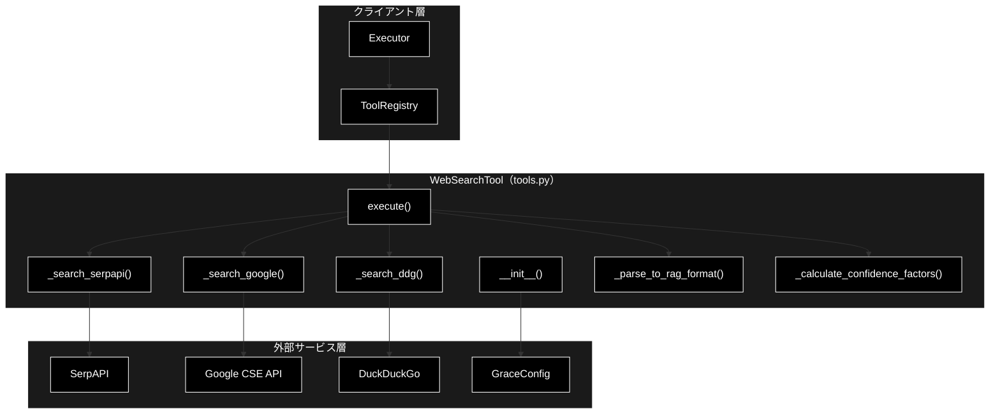
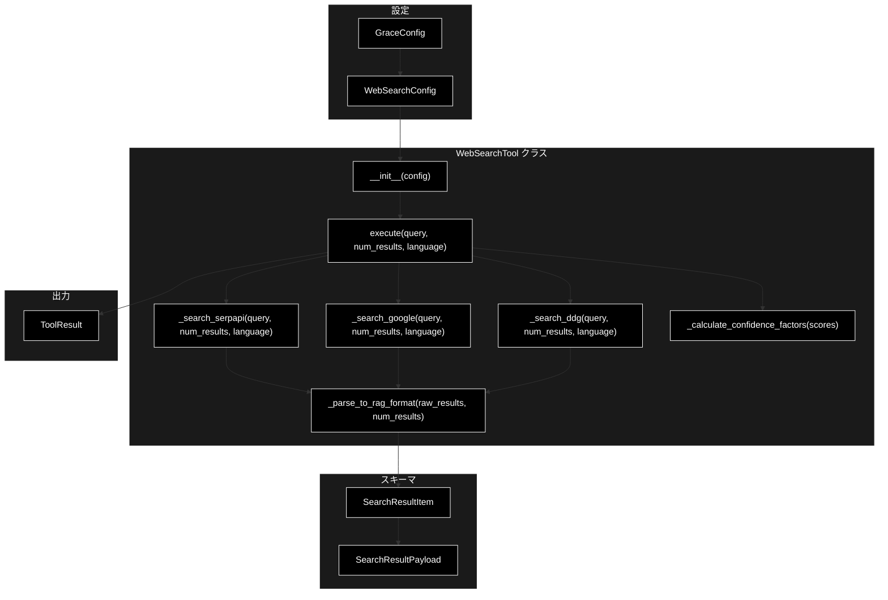
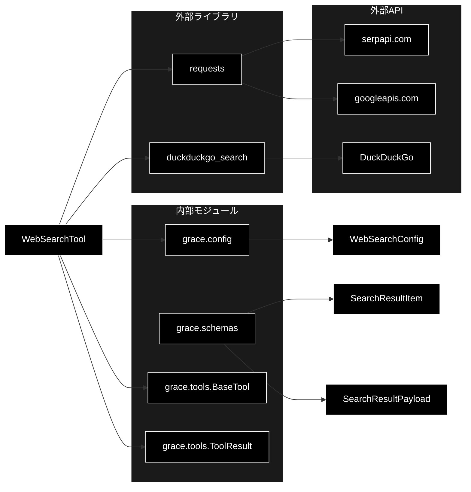

# WebSearchTool (tools.py) - Web検索ツール ドキュメント

**Version 1.1** | 最終更新: 2026-06-16

---

## 目次

1. [概要](#概要)
   - [主な責務](#主な責務)
   - [各責務対応のモジュール](#各責務対応のモジュール)
   - [主要機能一覧](#主要機能一覧)
2. [アーキテクチャ構成図](#1-アーキテクチャ構成図)
   - [システム全体構成](#11-システム全体構成)
   - [データフロー](#12-データフロー)
3. [モジュール構成図](#2-モジュール構成図)
   - [内部モジュール構成](#21-内部モジュール構成)
   - [外部依存関係](#22-外部依存関係)
   - [内部依存モジュール](#23-内部依存モジュール)
4. [クラス・関数一覧表](#3-クラス関数一覧表)
   - [クラス一覧](#31-クラス一覧)
   - [関数一覧（カテゴリ別）](#32-関数一覧カテゴリ別)
5. [クラス・関数 IPO詳細](#4-クラス関数-ipo詳細)
   - [WebSearchTool クラス](#41-websearchtool-クラス)
   - [関連データクラス](#42-関連データクラス)
   - [関連設定クラス](#43-関連設定クラス)
   - [関連スキーマクラス](#44-関連スキーマクラス)
   - [レジストリ・ファクトリ関数](#45-レジストリファクトリ関数)
6. [設定・定数](#5-設定定数)
   - [WebSearchConfig: web_search セクション](#51-websearchconfig-web_search-セクション)
   - [バックエンド別設定](#52-バックエンド別設定)
7. [使用例](#6-使用例)
   - [基本的なワークフロー](#61-基本的なワークフロー)
   - [ToolRegistry経由の実行](#62-toolregistry経由の実行)
   - [RAG検索 → Web検索フォールバック](#63-rag検索--web検索フォールバック)
8. [エクスポート](#7-エクスポート)
9. [変更履歴](#8-変更履歴)
10. [付録: 依存関係図](#付録-依存関係図)

---

## 概要

`WebSearchTool` は、`grace/tools.py` 内に定義されたWeb検索ツールクラスです（`grace/web_search.py` というファイルは存在しません）。GRACE Agentのツールシステム（`BaseTool` パターン）に準拠し、SerpAPI / Google CSE / DuckDuckGo の3つの外部検索バックエンドを設定で切り替えて使用できます。検索結果は `rag_search` 互換フォーマット（`SearchResultItem` 構造の `dict`）で返却されるため、後続の `ReasoningTool` が無変換でそのまま `sources` として消費できます。

`WebSearchTool` 自体はLLM（Anthropic Claude `claude-sonnet-4-6` 等）を呼び出しません。外部の検索API（SerpAPI / Google CSE）への HTTP リクエスト、または `duckduckgo_search` ライブラリ経由の検索のみを行います。

### 主な責務

- 設定（`WebSearchConfig`）に基づく検索バックエンドの選択と初期化
- 外部検索API（SerpAPI / Google CSE / DuckDuckGo）への問い合わせ実行
- 検索結果の `rag_search` 互換フォーマットへの変換
- 検索順位ベースの正規化スコア算出
- Confidence統計情報（result_count, avg_score, top_score, score_spread）の算出

### 各責務対応のモジュール

| # | 責務 | 対応モジュール | 説明 |
|---|------|--------------|------|
| 1 | 検索バックエンドの選択と初期化 | `config.py` / `tools.py` | `WebSearchConfig.backend` を読み、`WebSearchTool.__init__()` で設定 |
| 2 | 外部検索APIへの問い合わせ | `tools.py` | `_search_serpapi()` / `_search_google()` / `_search_ddg()` |
| 3 | rag_search互換フォーマット変換 | `tools.py` / `schemas.py` | `_parse_to_rag_format()` で `SearchResultItem` 構造の `dict` に変換 |
| 4 | 正規化スコア算出 | `tools.py` | `_parse_to_rag_format()` 内で順位ベーススコアを計算 |
| 5 | Confidence統計情報の算出 | `tools.py` | `_calculate_confidence_factors()` で統計値を生成 |

### 主要機能一覧

| 機能 | 説明 |
|------|------|
| `WebSearchTool` | Web検索ツールクラス（SerpAPI / Google CSE / DuckDuckGo 切り替え対応） |
| `WebSearchTool.__init__()` | コンストラクタ（設定から backend / num_results / language / timeout を初期化） |
| `WebSearchTool.execute()` | Web検索を実行し、rag_search互換形式の `ToolResult` を返す |
| `WebSearchTool._search_ddg()` | DuckDuckGo検索バックエンド（APIキー不要） |
| `WebSearchTool._search_google()` | Google CSE検索バックエンド（⚠️ 新規受付停止） |
| `WebSearchTool._search_serpapi()` | SerpAPI検索バックエンド（ReadTimeout時に最大1回リトライ） |
| `WebSearchTool._parse_to_rag_format()` | 各バックエンドの生結果をrag_search互換フォーマットに変換 |
| `WebSearchTool._calculate_confidence_factors()` | 検索結果のConfidence統計情報を算出 |
| `ToolRegistry` | ツールレジストリ（`config.tools.enabled` に基づき自動登録） |
| `create_tool_registry()` | `ToolRegistry` インスタンスを作成するファクトリ関数 |
| `ToolResult` | 全ツール共通の実行結果データクラス（`tools.py`） |
| `WebSearchConfig` | Web検索設定モデル（`config.py`） |
| `SearchResultItem` / `SearchResultPayload` | 検索結果の型定義（`schemas.py`、RAG/Web共通） |

---

## 1. アーキテクチャ構成図

### 1.1 システム全体構成



### 1.2 データフロー

1. `Executor` が `PlanStep(action="web_search")` から kwargs を構築
2. `ToolRegistry.execute("web_search", **kwargs)` → `WebSearchTool.execute()` を呼び出し
3. `execute()` が `num_results` / `language` を config デフォルト値で補完
4. `self.backend` に基づき検索メソッドを選択（`duckduckgo` / `google_cse` / `serpapi`、未知の値は `ValueError`）
5. 検索バックエンドが生の検索結果（list）を返却
6. `_parse_to_rag_format()` が生結果を `rag_search` 互換フォーマットに変換（順位ベーススコア付与）
7. `_calculate_confidence_factors()` がスコア統計情報を算出
8. `ToolResult` として返却 → `Executor` が後続の `ReasoningTool` の `sources` として消費

---

## 2. モジュール構成図

### 2.1 内部モジュール構成



### 2.2 外部依存関係

| ライブラリ | バージョン | 用途 |
|-----------|-----------|------|
| `requests` | 2.x | SerpAPI / Google CSE への HTTP GET リクエスト（`_search_serpapi` / `_search_google` 内で遅延 import） |
| `duckduckgo_search` | 6.x | DuckDuckGo 検索バックエンド（`_search_ddg` 内で `DDGS` を遅延 import） |

### 2.3 内部依存モジュール

| モジュール | 用途 |
|-----------|------|
| `grace.config` | `get_config()`, `GraceConfig`, `WebSearchConfig` の取得 |
| `grace.schemas` | `SearchResultItem`, `SearchResultPayload`（RAG/Web共通の型定義） |
| `grace.tools.BaseTool` | ツール抽象基底クラス（`WebSearchTool` の親） |
| `grace.tools.ToolResult` | ツール実行結果データクラス（`execute()` の戻り値） |

---

## 3. クラス・関数一覧表

### 3.1 クラス一覧

#### WebSearchTool

| メソッド | 概要 |
|---------|------|
| `__init__(config)` | コンストラクタ。設定から backend / num_results / language / timeout を初期化 |
| `execute(query, num_results, language, **kwargs)` | Web検索を実行し、rag_search互換形式の `ToolResult` を返す |
| `_search_ddg(query, num_results, language)` | DuckDuckGo検索バックエンド（APIキー不要） |
| `_search_google(query, num_results, language)` | Google CSE検索バックエンド（⚠️ 新規受付停止） |
| `_search_serpapi(query, num_results, language)` | SerpAPI検索バックエンド（ReadTimeout時に最大1回リトライ） |
| `_parse_to_rag_format(raw_results, num_results)` | 各バックエンドの生結果をrag_search互換フォーマットに変換 |
| `_calculate_confidence_factors(scores)` | 検索結果のConfidence統計情報を算出 |

#### 関連クラス（他モジュール定義）

| クラス | 定義場所 | 概要 |
|--------|---------|------|
| `BaseTool` | `tools.py` | ツール抽象基底クラス（`WebSearchTool` の親） |
| `ToolResult` | `tools.py` | ツール実行結果データクラス |
| `ToolRegistry` | `tools.py` | ツールレジストリ |
| `WebSearchConfig` | `config.py` | Web検索設定モデル |
| `SearchResultItem` | `schemas.py` | 検索結果1件（RAG/Web共通フォーマット） |
| `SearchResultPayload` | `schemas.py` | 検索結果ペイロード（RAG/Web共通） |

### 3.2 関数一覧（カテゴリ別）

#### レジストリ・ファクトリ

| 関数名 | 概要 |
|-------|------|
| `ToolRegistry._register_default_tools()` | `config.tools.enabled` に `"web_search"` があれば `WebSearchTool` を自動登録 |
| `ToolRegistry.execute(name, **kwargs)` | 登録済みツールを名前で実行 |
| `create_tool_registry(config)` | `ToolRegistry` インスタンスを作成するファクトリ関数 |

---

## 4. クラス・関数 IPO詳細

### 4.1 WebSearchTool クラス

Web検索ツール。SerpAPI / Google CSE / DuckDuckGo の3つの検索バックエンドを設定で切り替え可能。検索結果は `rag_search` 互換フォーマット（`SearchResultItem` 構造の `dict`）で返却し、後続の `ReasoningTool` がそのまま消費できる。クラス属性 `name = "web_search"`、`description = "Web検索で最新情報を取得"`。

#### コンストラクタ: `__init__`

**概要**: 設定から検索バックエンドの種類、取得件数、言語、タイムアウトを読み込んで初期化する。

```python
def __init__(self, config: Optional[GraceConfig] = None)
```

| パラメータ | 型 | デフォルト | 説明 |
|------------|------|-----------|------|
| `config` | `Optional[GraceConfig]` | `None` | GRACE設定オブジェクト。`None` の場合 `get_config()` で取得 |

| 項目 | 内容 |
|------|------|
| **Input** | `config: Optional[GraceConfig] = None` |
| **Process** | 1. `config` が `None` なら `get_config()` でシングルトン設定を取得<br>2. `config.web_search.backend` を `self.backend` に設定<br>3. `config.web_search.num_results` を `self.num_results` に設定<br>4. `config.web_search.language` を `self.language` に設定<br>5. `config.web_search.timeout` を `self.timeout` に設定<br>6. 初期化ログ（backend名）を出力 |
| **Output** | `WebSearchTool` インスタンス |

**インスタンス属性**:

| 属性 | 型 | 説明 |
|------|------|------|
| `config` | `GraceConfig` | 設定オブジェクト |
| `backend` | `str` | 検索バックエンド名（`"serpapi"` / `"google_cse"` / `"duckduckgo"`） |
| `num_results` | `int` | デフォルト取得件数 |
| `language` | `str` | デフォルト検索言語 |
| `timeout` | `int` | HTTPリクエストタイムアウト（秒） |

**戻り値例**:
```python
# WebSearchTool インスタンス（属性例）
tool.backend       # "serpapi"
tool.num_results   # 5
tool.language      # "ja"
tool.timeout       # 30
```

```python
# 使用例
from grace.tools import WebSearchTool
from grace.config import get_config

# デフォルト設定で初期化
tool = WebSearchTool()

# カスタム設定で初期化
config = get_config()
tool = WebSearchTool(config=config)
print(tool.backend)  # 出力: serpapi
```

---

#### メソッド: `execute`

**概要**: Web検索を実行し、rag_search互換形式の `ToolResult` を返す。設定されたバックエンドに応じて適切な検索メソッドにディスパッチし、結果を統一フォーマットに変換する。

```python
def execute(
    self,
    query: str,
    num_results: Optional[int] = None,
    language: Optional[str] = None,
    **kwargs
) -> ToolResult
```

| パラメータ | 型 | デフォルト | 説明 |
|------------|------|-----------|------|
| `query` | `str` | - | 検索クエリ |
| `num_results` | `Optional[int]` | `None` | 取得件数（`None` の場合 `self.num_results` を使用） |
| `language` | `Optional[str]` | `None` | 検索言語（`None` の場合 `self.language` を使用） |

| 項目 | 内容 |
|------|------|
| **Input** | `query: str`, `num_results: Optional[int] = None`, `language: Optional[str] = None` |
| **Process** | 1. `num = num_results or self.num_results`、`lang = language or self.language` で補完<br>2. `self.backend` に基づきバックエンドを選択（`duckduckgo` / `google_cse` / `serpapi`、未知の値は `ValueError`）<br>3. 選択したバックエンドメソッドで生結果を取得<br>4. `_parse_to_rag_format()` で rag_search 互換フォーマットに変換<br>5. 変換結果が空なら `success=False`・`output=[]`・`error` メッセージ付きで返却<br>6. スコアリストから `_calculate_confidence_factors()` で統計を算出<br>7. IPOログ（OUTPUT）を出力<br>8. 成功時 `ToolResult(success=True, output=formatted, ...)` を返却<br>9. 例外時は `success=False`・`output=None`・`error="Web検索エラー (...)"` で返却 |
| **Output** | `ToolResult`: 検索結果（`output` は `List[Dict]` の rag_search 互換形式） |

**戻り値例（成功時）**:
```python
ToolResult(
    success=True,
    output=[
        {
            "score": 1.0,
            "payload": {
                "question": "",
                "answer": "Python 3.13の新機能には...",
                "content": "",
                "source": "https://docs.python.org/ja/3.13/whatsnew/",
                "title": "Python 3.13 の新機能"
            },
            "collection": "web_search"
        }
    ],
    confidence_factors={
        "result_count": 5,
        "avg_score": 0.8,
        "top_score": 1.0,
        "score_spread": 0.4,
        "search_engine": "serpapi"
    },
    error=None,
    execution_time_ms=1200
)
```

**戻り値例（結果なし）**:
```python
ToolResult(
    success=False,
    output=[],
    error="Web検索結果が見つかりませんでした: 'xyzabc123'",
    confidence_factors={"result_count": 0, "search_engine": "serpapi"},
    execution_time_ms=800
)
```

**戻り値例（エラー時）**:
```python
ToolResult(
    success=False,
    output=None,
    error="Web検索エラー (serpapi): 429 Too Many Requests",
    execution_time_ms=5000
)
```

```python
# 使用例
from grace.tools import WebSearchTool

tool = WebSearchTool()
result = tool.execute(query="Python 最新バージョン", num_results=5, language="ja")

if result.success:
    for item in result.output:
        print(f"[{item['score']:.2f}] {item['payload']['title']}")
        print(f"  URL: {item['payload']['source']}")
else:
    print(f"検索失敗: {result.error}")
# 出力: [1.00] Python 3.13 の新機能 ...
```

---

#### メソッド: `_search_ddg`

**概要**: DuckDuckGo検索バックエンドを使用してWeb検索を実行する。APIキー不要。

```python
def _search_ddg(self, query: str, num_results: int, language: str) -> list
```

| パラメータ | 型 | デフォルト | 説明 |
|------------|------|-----------|------|
| `query` | `str` | - | 検索クエリ |
| `num_results` | `int` | - | 取得件数（`max_results`） |
| `language` | `str` | - | 検索言語（`"ja"` → リージョン `"jp-jp"`、その他 → `"wt-wt"`） |

| 項目 | 内容 |
|------|------|
| **Input** | `query: str`, `num_results: int`, `language: str` |
| **Process** | 1. `from duckduckgo_search import DDGS` を遅延 import<br>2. `language` をリージョンコードに変換（`"ja"` → `"jp-jp"`、その他 → `"wt-wt"`）<br>3. `with DDGS() as ddgs:` 内で `ddgs.text(query, region=region, max_results=num_results)` を実行<br>4. 結果を `list` 化して返却 |
| **Output** | `list`: DuckDuckGo の検索結果配列（各要素に `title`, `href`, `body` を含む） |

**戻り値例**:
```python
[
    {"title": "Python tutorial", "href": "https://example.com", "body": "..."},
    {"title": "Learn Python", "href": "https://example.org", "body": "..."}
]
```

```python
# 使用例（内部メソッドのため通常は直接呼び出さない）
raw_results = tool._search_ddg("Python tutorial", 5, "ja")
# raw_results: [{"title": "...", "href": "...", "body": "..."}, ...]
```

---

#### メソッド: `_search_google`

> ⚠️ **非推奨**: Google Custom Search Engine は新規受付停止のため非推奨です。`serpapi` または `duckduckgo` バックエンドを使用してください。

**概要**: Google Custom Search Engine (CSE) API を使用してWeb検索を実行する。

```python
def _search_google(self, query: str, num_results: int, language: str) -> list
```

| パラメータ | 型 | デフォルト | 説明 |
|------------|------|-----------|------|
| `query` | `str` | - | 検索クエリ |
| `num_results` | `int` | - | 取得件数（`num` パラメータ） |
| `language` | `str` | - | 検索言語（`lr` パラメータに `"lang_"` を付与） |

| 項目 | 内容 |
|------|------|
| **Input** | `query: str`, `num_results: int`, `language: str` |
| **Process** | 1. `os`, `requests` を遅延 import<br>2. 環境変数 `GOOGLE_CSE_API_KEY` / `GOOGLE_CSE_ENGINE_ID` または `config.web_search.google_cse_api_key` / `.google_cse_engine_id` から認証情報を取得<br>3. いずれか未設定の場合は `ValueError` を送出<br>4. `https://www.googleapis.com/customsearch/v1` へ GET（params: `key`, `cx`, `q`, `lr=lang_{language}`, `num`、`timeout=self.timeout`）<br>5. `resp.raise_for_status()` 後、レスポンスJSON の `items` を返却 |
| **Output** | `list`: Google CSE の `items` 配列（各要素に `title`, `link`, `snippet` 等を含む） |

**環境変数**:

| 変数名 | 必須 | 説明 |
|--------|:----:|------|
| `GOOGLE_CSE_API_KEY` | ✅ | Google API キー |
| `GOOGLE_CSE_ENGINE_ID` | ✅ | Programmable Search Engine ID（`cx`） |

**戻り値例**:
```python
[
    {"title": "Python.org", "link": "https://www.python.org", "snippet": "..."},
    {"title": "Python Docs", "link": "https://docs.python.org", "snippet": "..."}
]
```

```python
# 使用例（内部メソッドのため通常は直接呼び出さない）
raw_results = tool._search_google("Python tutorial", 5, "ja")
# raw_results: [{"title": "...", "link": "...", "snippet": "..."}, ...]
```

---

#### メソッド: `_search_serpapi`

**概要**: SerpAPI検索バックエンドを使用してWeb検索を実行する。タイムアウト対策として ReadTimeout 発生時に最大1回リトライする（合計最大2回試行）。

```python
def _search_serpapi(self, query: str, num_results: int, language: str) -> list
```

| パラメータ | 型 | デフォルト | 説明 |
|------------|------|-----------|------|
| `query` | `str` | - | 検索クエリ |
| `num_results` | `int` | - | 取得件数（`num` パラメータ） |
| `language` | `str` | - | 検索言語（`hl` パラメータ。`gl` は `"ja"` → `"jp"`、その他 → `"us"`） |

| 項目 | 内容 |
|------|------|
| **Input** | `query: str`, `num_results: int`, `language: str` |
| **Process** | 1. `os`, `time`, `requests` を遅延 import<br>2. 環境変数 `SERPAPI_KEY` または `config.web_search.serpapi_api_key` から API キーを取得<br>3. API キー未設定の場合は `ValueError` を送出<br>4. params を構築（`api_key`, `q`, `hl=language`, `gl`（ja→jp/else→us）, `num`）<br>5. `max_retries=2` のループで `https://serpapi.com/search.json` へ GET（`timeout=self.timeout`）<br>6. `requests.exceptions.ReadTimeout` 時は最終試行以外で `2 * (attempt + 1)` 秒（2秒, 4秒）スリープしてリトライ、最終試行では再送出<br>7. レスポンスJSON の `organic_results` を返却 |
| **Output** | `list`: SerpAPI の `organic_results` 配列（各要素に `title`, `link`, `snippet` 等を含む） |

**環境変数**:

| 変数名 | 必須 | 説明 |
|--------|:----:|------|
| `SERPAPI_KEY` | ✅ | SerpAPI の API キー（または `config.web_search.serpapi_api_key`） |

**戻り値例**:
```python
[
    {"title": "Python Release 3.13", "link": "https://www.python.org/...", "snippet": "..."},
    {"title": "What's New In Python", "link": "https://docs.python.org/...", "snippet": "..."}
]
```

```python
# 使用例（内部メソッドのため通常は直接呼び出さない）
raw_results = tool._search_serpapi("Python tutorial", 5, "ja")
# raw_results: [{"title": "...", "link": "...", "snippet": "..."}, ...]
```

---

#### メソッド: `_parse_to_rag_format`

**概要**: 各検索バックエンドの生結果を rag_search 互換フォーマット（`SearchResultItem` 構造の `dict`）に変換する。検索順位から正規化スコアを生成する。

```python
def _parse_to_rag_format(self, raw_results: list, num_results: int) -> list
```

| パラメータ | 型 | デフォルト | 説明 |
|------------|------|-----------|------|
| `raw_results` | `list` | - | バックエンドの生検索結果リスト |
| `num_results` | `int` | - | 取得件数（スコア正規化に使用） |

| 項目 | 内容 |
|------|------|
| **Input** | `raw_results: list`, `num_results: int` |
| **Process** | 1. 各結果を順位 `i` 付きでイテレート<br>2. 順位ベースの正規化スコアを算出: `score = round(1.0 - (i / max(num_results, 1)) * 0.5, 2)`<br>3. `self.backend == "duckduckgo"` なら `body`/`href`、それ以外（serpapi / google_cse）は `snippet`/`link` をマッピング（下表参照）<br>4. `collection` を `"web_search"` 固定で設定<br>5. フォーマット済みリストを返却 |
| **Output** | `list`: rag_search 互換フォーマットの `dict` リスト（`SearchResultItem` 構造） |

**バックエンド別フィールドマッピング**:

| payload フィールド | DuckDuckGo | SerpAPI / Google CSE |
|-------------------|------------|---------------------|
| `question` | `""` | `""` |
| `answer` | `item["body"]` | `item["snippet"]` |
| `content` | `""` | `""` |
| `source` | `item["href"]` | `item["link"]` |
| `title` | `item["title"]` | `item["title"]` |

**スコア算出ロジック（num_results=5 の場合）**:

| 順位（0始まり） | スコア |
|:---:|:---:|
| 0 | 1.00 |
| 1 | 0.90 |
| 2 | 0.80 |
| 3 | 0.70 |
| 4 | 0.60 |

**戻り値例**:
```python
[
    {
        "score": 1.0,
        "payload": {
            "question": "",
            "answer": "Python 3.13の新機能には...",
            "content": "",
            "source": "https://docs.python.org/ja/3.13/whatsnew/",
            "title": "Python 3.13 の新機能"
        },
        "collection": "web_search"
    },
    {
        "score": 0.9,
        "payload": {
            "question": "",
            "answer": "Python 3.13は2024年10月に...",
            "content": "",
            "source": "https://example.com/python-313",
            "title": "Python 3.13 リリース情報"
        },
        "collection": "web_search"
    }
]
```

```python
# 使用例（内部メソッドのため通常は直接呼び出さない）
raw = [{"title": "T", "link": "https://e.com", "snippet": "S"}]
formatted = tool._parse_to_rag_format(raw, 5)
print(formatted[0]["score"])        # 1.0
print(formatted[0]["collection"])   # web_search
```

---

#### メソッド: `_calculate_confidence_factors`

**概要**: 検索結果のスコアリストからConfidence統計情報を算出する。

```python
def _calculate_confidence_factors(self, scores: list) -> dict
```

| パラメータ | 型 | デフォルト | 説明 |
|------------|------|-----------|------|
| `scores` | `list` | - | 検索結果のスコアリスト（`List[float]`） |

| 項目 | 内容 |
|------|------|
| **Input** | `scores: list` |
| **Process** | 1. `scores` が空ならゼロ値の辞書（`search_engine` は `self.backend`）を返却<br>2. `result_count` = `len(scores)`<br>3. `avg_score` = 平均（`round(..., 2)`）<br>4. `top_score` = `max(scores)`<br>5. `score_spread` = `round(max - min, 2)`<br>6. `search_engine` = `self.backend` |
| **Output** | `dict`: Confidence統計情報 |

**戻り値例（結果あり）**:
```python
{
    "result_count": 5,
    "avg_score": 0.8,
    "top_score": 1.0,
    "score_spread": 0.4,
    "search_engine": "serpapi"
}
```

**戻り値例（結果なし）**:
```python
{
    "result_count": 0,
    "avg_score": 0.0,
    "top_score": 0.0,
    "score_spread": 0.0,
    "search_engine": "serpapi"
}
```

```python
# 使用例（内部メソッドのため通常は直接呼び出さない）
factors = tool._calculate_confidence_factors([1.0, 0.9, 0.8])
print(factors["avg_score"])   # 0.9
print(factors["top_score"])   # 1.0
```

---

### 4.2 関連データクラス

#### ToolResult データクラス

**概要**: 全ツール共通の実行結果データクラス。`WebSearchTool.execute()` の戻り値（`tools.py` 定義）。

```python
@dataclass
class ToolResult:
    success: bool
    output: Any
    confidence_factors: Dict[str, Any] = field(default_factory=dict)
    error: Optional[str] = None
    execution_time_ms: Optional[int] = None
```

| フィールド | 型 | デフォルト | 説明 |
|-----------|------|-----------|------|
| `success` | `bool` | - | 実行成功フラグ |
| `output` | `Any` | - | 実行結果（Web検索の場合は `List[Dict]`、エラー時は `None`） |
| `confidence_factors` | `Dict[str, Any]` | `{}` | Confidence計算用の統計情報 |
| `error` | `Optional[str]` | `None` | エラーメッセージ（失敗時） |
| `execution_time_ms` | `Optional[int]` | `None` | 実行時間（ミリ秒） |

| 項目 | 内容 |
|------|------|
| **Input** | `success: bool`, `output: Any`, `confidence_factors: Dict = {}`, `error: Optional[str] = None`, `execution_time_ms: Optional[int] = None` |
| **Process** | dataclass フィールドへ値を格納 |
| **Output** | `ToolResult` インスタンス |

**戻り値例**:
```python
ToolResult(success=True, output=[...], confidence_factors={...}, error=None, execution_time_ms=1200)
```

```python
# 使用例
from grace.tools import ToolResult

result = ToolResult(success=True, output=[], confidence_factors={"result_count": 0})
print(result.success)  # True
```

---

### 4.3 関連設定クラス

#### WebSearchConfig

**概要**: Web検索の設定モデル（`config.py` 定義、`pydantic.BaseModel`）。`GraceConfig.web_search` フィールドに格納される。

```python
class WebSearchConfig(BaseModel):
    backend: str = "serpapi"
    num_results: int = 5
    language: str = "ja"
    timeout: int = 30
    google_cse_api_key: str = ""
    google_cse_engine_id: str = ""
    serpapi_api_key: str = ""
```

| フィールド | 型 | デフォルト | 説明 |
|-----------|------|-----------|------|
| `backend` | `str` | `"serpapi"` | 検索バックエンド（`"serpapi"` / `"google_cse"` / `"duckduckgo"`） |
| `num_results` | `int` | `5` | デフォルト取得件数 |
| `language` | `str` | `"ja"` | デフォルト検索言語 |
| `timeout` | `int` | `30` | HTTPリクエストタイムアウト（秒） |
| `google_cse_api_key` | `str` | `""` | Google CSE API キー（⚠️ 新規受付停止） |
| `google_cse_engine_id` | `str` | `""` | Google CSE Engine ID（⚠️ 新規受付停止） |
| `serpapi_api_key` | `str` | `""` | SerpAPI APIキー（環境変数 `SERPAPI_KEY` 推奨） |

| 項目 | 内容 |
|------|------|
| **Input** | 上記フィールド（全てデフォルト値あり） |
| **Process** | pydantic がフィールドを検証・格納 |
| **Output** | `WebSearchConfig` インスタンス |

**戻り値例**:
```python
WebSearchConfig(backend="serpapi", num_results=5, language="ja", timeout=30, ...)
```

```python
# 使用例
from grace.config import WebSearchConfig

cfg = WebSearchConfig(backend="duckduckgo", num_results=3)
print(cfg.backend)  # duckduckgo
```

---

### 4.4 関連スキーマクラス

#### SearchResultPayload

**概要**: 検索結果ペイロード（RAG/Web共通）。`schemas.py` 定義（`pydantic.BaseModel`）。

```python
class SearchResultPayload(BaseModel):
    question: str = ""
    answer: str = ""
    content: str = ""
    source: str = ""
    title: str = ""
```

| フィールド | 型 | デフォルト | RAG検索での用途 | Web検索での用途 |
|-----------|------|-----------|---------------|---------------|
| `question` | `str` | `""` | Q/Aペアの質問文 | 空文字 |
| `answer` | `str` | `""` | Q/Aペアの回答 | 検索スニペット（body/snippet） |
| `content` | `str` | `""` | チャンク本文 | 空文字 |
| `source` | `str` | `""` | ファイル名 | URL（href/link） |
| `title` | `str` | `""` | ドキュメント名 | ページタイトル |

| 項目 | 内容 |
|------|------|
| **Input** | `question`, `answer`, `content`, `source`, `title`（全て `str = ""`） |
| **Process** | pydantic がフィールドを格納 |
| **Output** | `SearchResultPayload` インスタンス |

**戻り値例**:
```python
SearchResultPayload(question="", answer="Python 3.13...", content="", source="https://...", title="...")
```

```python
# 使用例
from grace.schemas import SearchResultPayload

p = SearchResultPayload(answer="スニペット", source="https://example.com", title="ページ")
print(p.model_dump())
```

#### SearchResultItem

**概要**: 検索結果1件（RAG/Web共通フォーマット）。`schemas.py` 定義。`score` は `0.0-1.0` に制約される。

```python
class SearchResultItem(BaseModel):
    score: float = Field(..., ge=0.0, le=1.0)
    payload: SearchResultPayload = Field(default_factory=SearchResultPayload)
    collection: str = ""
```

| フィールド | 型 | デフォルト | RAG検索での例 | Web検索での例 |
|-----------|------|-----------|-------------|-------------|
| `score` | `float` (0.0-1.0) | - (必須) | ベクトル類似度 | 順位ベース正規化スコア |
| `payload` | `SearchResultPayload` | `SearchResultPayload()` | Q/A + ソース | スニペット + URL |
| `collection` | `str` | `""` | `"wikipedia_ja"` 等 | `"web_search"` 固定 |

| 項目 | 内容 |
|------|------|
| **Input** | `score: float (必須)`, `payload: SearchResultPayload`, `collection: str = ""` |
| **Process** | pydantic がフィールドを検証（`score` の範囲チェック含む） |
| **Output** | `SearchResultItem` インスタンス |

**戻り値例**:
```python
SearchResultItem(score=1.0, payload=SearchResultPayload(...), collection="web_search")
```

```python
# 使用例
from grace.schemas import SearchResultItem, SearchResultPayload

item = SearchResultItem(
    score=1.0,
    payload=SearchResultPayload(answer="...", source="https://...", title="..."),
    collection="web_search",
)
print(item.model_dump())
```

> 📝 **注意**: 現時点では `WebSearchTool._parse_to_rag_format()` は `dict` を返します。`SearchResultItem` / `SearchResultPayload` は型安全化のための定義であり、構造は `_parse_to_rag_format()` の出力と一致します。既存コードとの互換性は `SearchResultItem.model_dump()` で保たれます。

---

### 4.5 レジストリ・ファクトリ関数

#### `ToolRegistry._register_default_tools`

**概要**: `config.tools.enabled` を参照し、有効なツールを `ToolRegistry` に登録する。`"web_search"` が含まれていれば `WebSearchTool(config=self.config)` を登録する。

```python
def _register_default_tools(self) -> None
```

| 項目 | 内容 |
|------|------|
| **Input** | なし（selfのみ） |
| **Process** | 1. `enabled = self.config.tools.enabled` を取得<br>2. `"rag_search"` があれば `RAGSearchTool` を登録<br>3. `"web_search"` があれば `WebSearchTool` を登録<br>4. `"reasoning"` があれば `ReasoningTool` を登録<br>5. `"ask_user"` があれば `AskUserTool` を登録<br>6. 登録結果をログ出力 |
| **Output** | `None`（`self._tools` に登録） |

**戻り値例**:
```python
# self._tools のキー例
["rag_search", "web_search", "reasoning", "ask_user"]
```

```python
# 使用例（通常は ToolRegistry 初期化時に自動実行）
from grace.tools import ToolRegistry

registry = ToolRegistry()
print(registry.list_tools())
# 出力: ['rag_search', 'web_search', 'reasoning', 'ask_user']
```

#### `create_tool_registry`

**概要**: `ToolRegistry` インスタンスを作成するファクトリ関数。

```python
def create_tool_registry(config: Optional[GraceConfig] = None) -> ToolRegistry
```

| パラメータ | 型 | デフォルト | 説明 |
|------------|------|-----------|------|
| `config` | `Optional[GraceConfig]` | `None` | GRACE設定。`None` の場合 `ToolRegistry` 内で `get_config()` を使用 |

| 項目 | 内容 |
|------|------|
| **Input** | `config: Optional[GraceConfig] = None` |
| **Process** | `ToolRegistry(config=config)` を生成して返却 |
| **Output** | `ToolRegistry`: 既定ツール登録済みのレジストリ |

**戻り値例**:
```python
# ToolRegistry インスタンス
registry.list_tools()  # ['rag_search', 'web_search', 'reasoning', 'ask_user']
```

```python
# 使用例
from grace.tools import create_tool_registry

registry = create_tool_registry()
result = registry.execute("web_search", query="最新のAIニュース", num_results=3)
print(result.success)
```

---

## 5. 設定・定数

### 5.1 WebSearchConfig: web_search セクション

`grace_config.yml` の `web_search` セクションが `WebSearchConfig` にマッピングされます。

```yaml
web_search:
  backend: "serpapi"               # "serpapi" / "google_cse"(新規受付停止) / "duckduckgo"
  num_results: 5
  language: "ja"
  timeout: 30
  # SerpAPI用（backendが"serpapi"の場合に使用）
  # serpapi_api_key: ""            # 環境変数 SERPAPI_KEY 推奨
  # Google CSE用（※新規受付停止）
  # google_cse_api_key: ""         # 環境変数 GOOGLE_CSE_API_KEY
  # google_cse_engine_id: ""       # 環境変数 GOOGLE_CSE_ENGINE_ID
```

| キー | デフォルト値 | 説明 |
|-----|-------------|------|
| `backend` | `"serpapi"` | 検索バックエンド種別（`serpapi` / `google_cse` / `duckduckgo`） |
| `num_results` | `5` | デフォルト取得件数 |
| `language` | `"ja"` | デフォルト検索言語 |
| `timeout` | `30` | HTTPタイムアウト（秒） |
| `google_cse_api_key` | `""` | Google CSE API キー（⚠️ 新規受付停止） |
| `google_cse_engine_id` | `""` | Google CSE Engine ID（⚠️ 新規受付停止） |
| `serpapi_api_key` | `""` | SerpAPI APIキー（環境変数 `SERPAPI_KEY` 推奨） |

### 5.2 バックエンド別設定

| バックエンド | 検索手段 | 認証 | 状態 |
|-------------|---------|------|------|
| `serpapi` | `GET https://serpapi.com/search.json`（`requests`、`organic_results`） | `SERPAPI_KEY` または `serpapi_api_key` | ✅ 推奨（デフォルト） |
| `duckduckgo` | `duckduckgo_search.DDGS().text()` | 不要 | ✅ 利用可 |
| `google_cse` | `GET https://www.googleapis.com/customsearch/v1`（`requests`、`items`） | `GOOGLE_CSE_API_KEY` + `GOOGLE_CSE_ENGINE_ID` | ⚠️ 新規受付停止 |

**環境変数一覧**:

| 変数名 | 必須条件 | 説明 |
|--------|---------|------|
| `SERPAPI_KEY` | backend=serpapi | SerpAPI の API キー（`serpapi_api_key` でも可） |
| `GOOGLE_CSE_API_KEY` | backend=google_cse | Google API キー（⚠️ 新規受付停止） |
| `GOOGLE_CSE_ENGINE_ID` | backend=google_cse | CSE Engine ID（⚠️ 新規受付停止） |

**SerpAPI リトライ定数**:

| 定数 | 値 | 説明 |
|------|----|------|
| `max_retries` | `2` | 試行回数の上限（リトライは最大1回） |
| バックオフ秒数 | `2 * (attempt + 1)` | ReadTimeout 時のスリープ秒数（2秒, 4秒） |

---

## 6. 使用例

### 6.1 基本的なワークフロー

```python
from grace.tools import WebSearchTool

# 1. 初期化
tool = WebSearchTool()

# 2. 検索実行
result = tool.execute(query="Python 3.13 新機能", num_results=5)

# 3. 結果確認
if result.success:
    print(f"検索成功: {result.confidence_factors['result_count']}件")
    for item in result.output:
        print(f"  [{item['score']:.2f}] {item['payload']['title']}")
        print(f"    URL: {item['payload']['source']}")
else:
    print(f"検索失敗: {result.error}")
```

### 6.2 ToolRegistry経由の実行

```python
from grace.tools import create_tool_registry

# 1. レジストリ作成（config.tools.enabled に基づき自動登録）
registry = create_tool_registry()

# 2. 登録済みツール確認
print(registry.list_tools())
# 出力: ['rag_search', 'web_search', 'reasoning', 'ask_user']

# 3. Web検索実行
result = registry.execute("web_search", query="最新のAIニュース", num_results=3)

if result.success:
    for item in result.output:
        print(f"[{item['score']:.2f}] {item['payload']['title']}")
```

### 6.3 RAG検索 → Web検索フォールバック

```python
from grace.tools import create_tool_registry

registry = create_tool_registry()
query = "2026年の東京の天気予報"

# 1. まずRAG検索を試行
rag_result = registry.execute("rag_search", query=query)

# 2. RAG検索で結果が得られなければWeb検索にフォールバック
if not rag_result.success or not rag_result.output:
    print("RAG検索で結果なし → Web検索にフォールバック")
    web_result = registry.execute("web_search", query=query)

    if web_result.success:
        # 3. Web検索結果をReasoningToolのsourcesとして使用
        reasoning_result = registry.execute(
            "reasoning",
            query=query,
            sources=web_result.output,
        )
        print(reasoning_result.output)
```

---

## 7. エクスポート

`grace/__init__.py` でエクスポートされる要素（抜粋）：

```python
__all__ = [
    # Tools（tools.py）
    "WebSearchTool",
    "create_tool_registry",
    # Schemas（schemas.py）
    "SearchResultPayload",
    "SearchResultItem",
]
```

`grace/tools.py` の `__all__`:

```python
__all__ = [
    # Data classes
    "ToolResult",
    # Base class
    "BaseTool",
    # Tools
    "RAGSearchTool",
    "WebSearchTool",
    "ReasoningTool",
    "AskUserTool",
    # Registry
    "ToolRegistry",
    "create_tool_registry",
]
```

---

## 8. 変更履歴

| バージョン | 変更内容 |
|-----------|---------|
| 1.0 | 初版作成。WebSearchTool の全メソッド IPO 詳細、SearchResultItem / SearchResultPayload スキーマ定義、バックエンド別設定を記載 |
| 1.1 | 実ソース（grace/tools.py・config.py・schemas.py）に整合。SerpAPI のリトライをループ最大2回・線形バックオフ（2秒/4秒）に修正、`gl` パラメータを追記。Google CSE を「新規受付停止」表記に統一。スコア式に `round(..., 2)` を反映。Mermaid を黒背景・白文字スタイル（§16.5）に準拠。WebSearchTool 非LLMの旨を明記。レジストリ・ファクトリ関数の IPO 詳細を追加 |

---

## 付録: 依存関係図



---

## 関連ドキュメント

| ドキュメント | 説明 |
|-------------|------|
| `grace/doc/tools.md` | tools.py 全体のドキュメント（全ツール網羅） |
| `grace/doc/executor.md` | Executor ドキュメント（Web検索ステップの実行フローを含む） |
| `grace/doc/schemas.md` | スキーマ定義ドキュメント |
