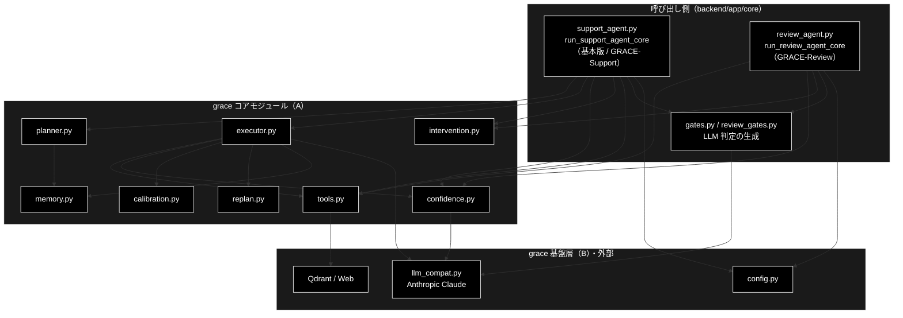

# grace/docs 棚卸し

**Version 1.15** | 最終更新: 2026-10-08

`grace/` パッケージのドキュメント一覧と、実装への追随状況・残タスク・検証手順をまとめる。
新しく文書を書く／直す前に、まずここを見る。
冒頭の[概要](#概要)に、**GRACE-Support と GRACE-Review が grace のどのモジュールをどのステップで使うか**（両者の比較を含む）を置いている。

> ⚠️ **本リポジトリは Anthropic 版。** LLM は `claude-sonnet-5-5`（軽量 `claude-haiku-5-5`）、
> Embedding のみ Gemini `gemini-embedding-001`（3072 次元）。
> 姉妹リポジトリ `grace_v2_local` は Ollama 版で、**プロバイダ表記はあちらと逆**である。
> 「Anthropic と書いてあるから誤記」ではない。CLAUDE.md §3 を参照。

---

## 目次

- [概要](#概要)
  - [GRACE-Support（基本版も同じ）の流れと grace モジュール](#grace-support基本版も同じの流れと-grace-モジュール)
  - [GRACE-Review の流れと grace モジュール](#grace-review-の流れと-grace-モジュール)
  - [GRACE-Support と GRACE-Review の比較](#grace-support-と-grace-review-の比較)
- [1. 現在わかっている問題](#1-現在わかっている問題)
- [2. 文書一覧](#2-文書一覧)
  - [2.1 A. コアモジュール（8）](#21-a-コアモジュール8-1-周を回す能力)
  - [2.2 B. 基盤層（3）](#22-b-基盤層3-a-が共通に依存する土台)
  - [2.3 C. 横断・アーキテクチャ文書（4）](#23-c-横断アーキテクチャ文書4)
  - [2.4 A / B の線引きの根拠](#24-a--b-の線引きの根拠実測2026-09-14)
  - [2.5 このディレクトリに置かない文書](#25-このディレクトリに置かない文書)
  - [2.6 横断文書の重複禁止ルール](#26-横断文書の重複禁止ルール)
  - [2.7 重複の検出](#27-重複の検出)
- [3. 実装追随状況](#3-実装追随状況)
- [4. 検証手順](#4-検証手順)
- [5. 残タスク](#5-残タスク)
- [6. 凡例と grep の落とし穴](#6-凡例と-grep-の落とし穴)
- [7. 変更履歴](#7-変更履歴)

---

## 概要

`grace/` は **2 つのエージェントが共用する自律エージェント基盤**である。
**GRACE-Support**（問い合わせ → 回答。基本版タブも同じコア）と **GRACE-Review**（文書 → 指摘）は、
どちらも `backend/app/core/` のコア関数から `grace/` の部品を呼ぶ。ただし**使う部品の範囲が大きく違う**。

- **GRACE-Support** は grace の**計画→実行ループ**（`planner` → `executor`）をまるごと使う。
  `tools` / `replan` / `memory` / `calibration` / 多軸信頼度は `executor` の内側で動く
- **GRACE-Review** は `planner` / `executor` を**通らない**。必要な部品
  （`tools` の検索・`confidence` の根拠検証・`intervention` の承認・`llm_compat` の LLM 呼び出し）を
  コア関数が**直接**呼ぶ

本節は、両エージェントの**ステップごとに grace のどのモジュール（シンボル）が効くか**の正本である。
ステップの対照表と実行順の図は [`docs/pipelines.md`](../../docs/pipelines.md) §2、
ステップ内部の設計は [`backend/docs/support_flow.md`](../../backend/docs/support_flow.md) /
[`backend/docs/review_flow.md`](../../backend/docs/review_flow.md) が正本なので、ここでは繰り返さない。

### 主な責務

- GRACE-Support の各ステップに、計画・実行・検証・承認の部品を供給する
- GRACE-Review の各ステップに、検索・根拠検証・承認・LLM 呼び出しの部品を供給する
- 両エージェントで同じ根拠検証（`GroundednessVerifier`・`support_rate`）を提供する
- 両エージェントで同じ HITL 承認（`InterventionHandler` の CONFIRM）を提供する

### 各責務対応のモジュール

| # | 責務 | 対応モジュール | 説明 |
|---|------|--------------|------|
| 1 | Support への計画・実行・検証・承認の部品供給 | `backend/app/core/support_agent.py` | `run_support_agent_core` が `create_planner` / `create_executor` / `create_tool_registry` / `create_groundedness_verifier` / `create_source_agreement_calculator` / `create_intervention_handler` を生成する |
| 2 | Review への検索・根拠検証・承認・LLM の部品供給 | `backend/app/core/review_agent.py` | `run_review_agent_core` が `create_tool_registry` / `create_groundedness_verifier` / `create_intervention_handler` を生成し、LLM 判定は `backend/app/core/review_gates.py` が `llm_compat.create_chat_client` で作る |
| 3 | 共通の根拠検証 | `grace/confidence.py` | `GroundednessVerifier.verify` と `damp_support_rate`（判定できなかった主張の分だけ支持率を減衰） |
| 4 | 共通の HITL 承認 | `grace/intervention.py` | `InterventionHandler.handle`（CONFIRM）。呼び出しは両者とも `support_agent.py::_perform_action` を通る |

### アーキテクチャ構成図



**データフロー**:

1. 両コアとも `copy.deepcopy(get_config())` でリクエスト単位の設定を作り、業界プロファイル／ルールセットの検索スコープと方針を `config` へ注入する
2. Support は `planner.create_plan` → `executor.execute` で内部 RAG と回答生成を行い、`executor` の内側で `tools` / `replan` / `memory` / `calibration` / 多軸信頼度が動く
3. Review は `tools` の `rag_search` を直接呼んで規程を集め、`review_gates.py` の LLM 判定で違反候補を出す
4. 両者とも `confidence.GroundednessVerifier` で根拠を検証し、副作用のあるアクションは `intervention.InterventionHandler` の承認を経てから実行する

### GRACE-Support（基本版も同じ）の流れと grace モジュール

実行順に並べる（`support_agent.py::STEP_IDS`）。「—」は grace を使わず `backend/app/core/` の純関数だけで判定するステップ。

| 実行順 | ステップ | grace モジュール（シンボル） | 備考 |
|:--:|---|---|---|
| 1 | 0-(A) `analyze` 入力・質問分析 | `llm_compat.py`（`create_chat_client`）／`intervention.py`（`InterventionRequest`） | 複数質問の検知・再構成は `gates.py::create_question_analyzer` / `reconstruct_query` の LLM 判定。主質問の選択は `InterventionRequest` を Web の承認待ち（`backend/app/core/intervention_bridge.py`）へ渡す |
| 2 | 0-(B) `profile` 業界プロファイル適用 | `config.py`（`GraceConfig`） | `qdrant.allowed_collections` / `llm.prompt_addendum` へ注入。**基本版はスキップ** |
| 3 | ① `plan` | `planner.py`（`create_plan`）← `memory.py`（`best_collection`） | 実行メモリのコレクション事前分布を計画に反映 |
| 4 | ② `execute` | `executor.py`（`execute`）→ `tools.py`（`rag_search` / `reasoning`）・`replan.py`・`confidence.py`（多軸信頼度）・`calibration.py`・`memory.py`（`_record_memory`） | 全体信頼度（`overall_confidence`）はここで決まる。較正は `config/calibration.json` があるときだけ |
| 5 | ③ `confidence` | `confidence.py`（`GroundednessVerifier.verify`） | `support_rate = supported / (supported + contradicted)` |
| 6 | ④ `gate` 回答ゲート＋強制エスカレ＋救済 | — | `gates.py::_answer_gate` ほか（純関数） |
| 7 | ⑤ `web` Web フォールバック | `tools.py`（`web_search` / `reasoning`）・`confidence.py`（`GroundednessVerifier` / `SourceAgreementCalculator`） | 内部回答と Web 回答の一致度を相互検証 |
| 8 | ④' `no_info` 情報なし回答検知 | `llm_compat.py` | `gates.py::create_no_info_judge` の LLM 判定 |
| 9 | ⑥ `action` | `intervention.py`（`InterventionHandler.handle`） | 本人確認（`ec` のみ）→ CONFIRM → `support_actions.py` が実行 |

### GRACE-Review の流れと grace モジュール

実行順に並べる（`review_agent.py::REVIEW_STEP_IDS`）。番号は Support との対応を示す呼称なので、⑥ が ⑤ より先に来る。
② Retrieve 〜 ④' Suppress は**セグメントごとに並行して流れる**（4 ステップが同時に始まり、検査単位ごとに 1 周する）。

| 実行順 | ステップ | grace モジュール（シンボル） | 備考 |
|:--:|---|---|---|
| 1 | S1 `ruleset` ルールセット適用 | `config.py`（`GraceConfig`） | `qdrant.allowed_collections` / `llm.prompt_addendum` へ注入（Support の 0-(B) と同じ手順） |
| 2 | ① `segment` 文書を検査単位へ分割 | — | 決定的な分割（原文オフセット保持） |
| 3 | ② `retrieve` 規程を RAG 検索 | `tools.py`（`rag_search` を**直接** `ToolRegistry.execute`） | `planner` / `executor` を通らない |
| 4 | ③ `detect` 二段判定 | `llm_compat.py` | 第 1 段はルールのキーワード、第 2 段は `review_gates.py::create_violation_detector` の LLM 判定 |
| 5 | ④ `ground` 指摘の根拠を検証 | `confidence.py`（`GroundednessVerifier.verify` / `damp_support_rate`） | Support の ③ と同じ検証器 |
| 6 | ④' `suppress` 誤検知抑止＋救済 | `llm_compat.py` | `review_gates.py::create_vacuous_judge`（実質性なしの判定） |
| 7 | ⑥ `web` 法改正の裏取り（既定 OFF） | `tools.py`（`web_search`） | 信頼度を下げる方向にだけ使う |
| 8 | ⑤ `severity` 重大度の確定＋強制 high | `llm_compat.py` | 重大リスク語の言及の仕方を `review_gates.py::create_mention_classifier` で判定 |
| 9 | ⑦ `action` | `intervention.py`（`InterventionHandler.handle`） | high があれば `escalate_to_human`（承認不要）、なければ `create_ticket`（CONFIRM）。実行は `support_actions.py` |

### GRACE-Support と GRACE-Review の比較

| grace モジュール | 区分 | GRACE-Support（基本版も同じ） | GRACE-Review |
|---|:--:|---|---|
| `planner.py` | A | ✅ ① Plan | — |
| `executor.py` | A | ✅ ② Execute（統括） | — |
| `tools.py` | A | ✅ ② の内側・⑤ Web | ✅ ② Retrieve・⑥ Web（直接呼ぶ） |
| `confidence.py` | A | ✅ ② 多軸信頼度・③ 根拠検証・⑤ 相互検証 | ✅ ④ 根拠検証（`damp_support_rate` も） |
| `calibration.py` | A | ✅ ② の内側（較正ファイルがあるとき） | — |
| `memory.py` | A | ✅ ① で読み・② で書く | — |
| `replan.py` | A | ✅ ② の内側（失敗・低信頼時） | — |
| `intervention.py` | A | ✅ 0-(A) 主質問の選択・⑥ CONFIRM | ✅ ⑦ CONFIRM |
| `config.py` | B | ✅ リクエスト単位のコピーへ注入 | ✅ 同左 |
| `llm_compat.py` | B | ✅ 判定系（質問分析・意図・情報なし・担当範囲） | ✅ 判定系（違反検出・言及分類・実質性） |
| `schemas.py` | B | ✅ 計画・ステップ結果の型（planner / executor 経由） | —（直接は使わない） |

| 観点 | GRACE-Support | GRACE-Review |
|---|---|---|
| 入出力 | 問い合わせ → 回答 1 件 | 文書 → 指摘 N 件 |
| grace の使い方 | 計画→実行ループ（`planner` → `executor`）に任せる | 部品を直接呼ぶ（`executor` を通らない） |
| 生成の主体 | `tools.py` の `reasoning`（`executor` 経由） | `review_gates.py` の LLM 判定（`llm_compat` 経由） |
| 共用する部品 | `GroundednessVerifier`・`InterventionHandler`・`ToolRegistry`・`support_actions.py::ActionBackend` | 同左 |
| 業界定義 | `VerticalProfile`（`verticals.py`） | `RuleSet`（`rulesets.py`） |

> ⚠️ **共用部品を触るときは両方を壊さないこと。** `GroundednessVerifier` / `InterventionHandler` /
> `ToolRegistry` は両エージェントの共用である。Support のつもりで直した変更が Review を壊す
> （CLAUDE.md §1）。`backend/tests/test_review_*.py` も通すこと。

---

## 1. 現在わかっている問題

| # | 問題 | 状態 |
|---|---|---|
| 1 | `agent_example.py` を題材にした §D（`grace_core_flow.md`）— この `.py` は git 全履歴に存在しない | ✅ 解消（v2.0 で「本書内の解説用コード片」と明示） |
| 2 | `eval/vertical/` 参照 17 件と、そこでの「実測 KPI」（`support_spec.md`。現在は `backend/docs/`） | ✅ 解消（v2.0 で章ごと削除） |
| 3 | `benchmark.md` の所在が `grace/benchmark.py`（実際は `grace/step_trace/benchmark.py`）／CLI `run_benchmark.py` が存在しない | ✅ 解消（v2.0） |
| 4 | `grace_core.md` の行番号参照 13 件（ほぼ全部ズレていた） | ✅ 解消（v2.0 でシンボル名参照へ） |
| 5 | `grace_core.md` §4.5 の `_record_memory` が**修正前のコードのまま** | ✅ 解消（v2.0 で現行実装へ） |
| 6 | 単数形パス `grace/doc/`（CLAUDE.md §9.1 違反） | ✅ 解消（15 件を是正） |
| 7 | `memory.py` の文書が無い | ✅ 解消（`memory.md` v1.0 を新規作成） |
| 8 | `web_search.md`（1123 行）が `tools.py` 内のクラス 1 個だけの単独文書になっている | ✅ 解消（`tools.md` v3.0 へ統合し削除） |
| 9 | `agent_example_core8.md`（385 行）— `agent_example_core8.py` は git 全履歴に存在しない | ✅ 解消（ユーザー承認のうえ削除。参照元 `support_spec.md` も是正） |
| 10 | モジュール文書に未記載の公開シンボルが 31 件あった | ✅ 解消（**全 11 モジュールで AST 網羅 100%**。§3） |
| 11 | `benchmark.md` が `grace/docs/` にあるが対象は `grace/step_trace/benchmark.py`（CLAUDE.md §9.1 違反。#3 では本文の所在表記を直しただけでファイルは動かしていなかった） | ✅ 解消（2026-09-14 に `grace/step_trace/docs/` へ `git mv`。§2.5） |
| 12 | 文書一覧が「モジュール / 横断」の 2 区分で、A（コア）と B（基盤層）の別が読み取れない | ✅ 解消（2026-09-14 に A/B/C の 3 区分へ再編。線引きの根拠は §2.4 に実測で明示） |
| 13 | 横断文書 4 本のうち `grace.md` / `grace_core.md` / `grace_core_flow.md` が**同じ表・同じ図を重複して持っていた**（モジュール構成図 Mermaid 68 行と依存関係テーブルは `grace_core.md` と `grace_core_flow.md` で**バイト単位で一致**。11 行役割サマリー表は `grace.md` と `grace_core_flow.md` で一致。5 段階設計の ASCII 図・使用例コードも重複） | ✅ 解消（2026-09-14 に WHY/WHAT/HOW の 3 本へ統合。`grace_core_flow.md` → `grace_runtime.md` へ改称。§2.3・§2.6） |
| 14 | §2.1〜§2.3 の「行数」「Ver」列が実測から乖離していた（例: `planner.md` が 1139 行と記載、実測 1183 行） | ✅ 解消（2026-09-14 に `wc -l` と各文書の Version ヘッダーで全件を実測し直した） |
| 15 | 目次の見出しアンカーが 9 件解決しなくなっていた（節番号の繰り下げ・見出しの言い換えに目次が追随していない）。§4.3 のリンク存在チェックでは**ファイルが実在するため検出できない** | ✅ 解消（2026-09-14。`executor.md` 6 件・`backend/docs` 2 件・`docs/support_spec.md` 1 件を是正し、検査を §4.5 として追加） |
| 16 | §3.1 の「全 11 モジュールで AST 網羅 100%」が崩れていた（2026-10-06 実測で `confidence.md` 3 件・`executor.md` 1 件・`llm_compat.md` 2 件が未記載）。あわせて 11 文書が**現在の既定モデル**を `claude-sonnet-5` のまま記載していた（実装は `claude-sonnet-5-5`） | ✅ 解消（2026-10-06。既定モデルは v1.12、未記載 6 件は v1.13 で書き足した） |
| 17 | 本書が **GRACE-Support の流れしか前提にしておらず**、GRACE-Review が grace のどの部品を使うか・両者の違いがどこにも書かれていなかった | ✅ 解消（2026-10-06。冒頭の[概要](#概要)を新設） |

---

## 2. 文書一覧

`grace/docs/` は **`grace/*.py`（11 モジュール）の文書と、パッケージ横断の設計文書だけ**を持つ。
サブパッケージ（`grace/step_trace/`）の文書はそのパッケージ配下に置く（CLAUDE.md §9.1）。

区分は `grace_core.md` の依存関係図に合わせて **A（コア）/ B（基盤層）/ C（横断）** の 3 つ。
A と B の線引きは思いつきではなく、**実測した依存の向き**に基づく（§2.4）。

### 2.1 A. コアモジュール（8）— 1 周を回す能力

**種別 E**（IPO 形式・`a_class_method_md_format.md` 準拠。使用例は IPO 詳細の冒頭 `### 4.1`）。**実行順ではなく役割**で束ねている
（理由は §2.4 の注記を参照）。

| 役割 | 文書 | 対象 | 行数 | Ver | 重要度 |
|---|---|---|---:|---|---|
| 計画 | `planner.md` | `grace/planner.py` | 1187 | 3.12 | ★★★ |
| 実行 | `executor.md` | `grace/executor.py` | 2219 | 4.16 | ★★★ |
| 実行 | `tools.md` | `grace/tools.py`（`WebSearchTool` を含む全ツール） | 1687 | 3.7 | ★★★ |
| 評価 | `confidence.md` | `grace/confidence.py` | 1862 | 2.10 | ★★★ |
| 評価 | `calibration.md` | `grace/calibration.py` | 763 | 1.1 | ★★ |
| 制御 | `intervention.md` | `grace/intervention.py` | 1615 | 1.9 | ★★ |
| 制御 | `replan.md` | `grace/replan.py` | 1133 | 2.4 | ★★ |
| 学習 | `memory.md` | `grace/memory.py` | 544 | 1.2 | ★★ |

> 行数・Ver は `wc -l` と各文書の Version ヘッダーの実測値（2026-10-06。§2.2・§2.3 も同日）。

### 2.2 B. 基盤層（3）— A が共通に依存する土台

**種別 E**（IPO 形式）。いずれも **`grace` 内への依存がゼロ**で、被依存が多い。

| 文書 | 対象 | 行数 | Ver | 重要度 |
|---|---|---:|---|---|
| `config.md` | `grace/config.py` | 986 | 1.12 | ★★★ |
| `schemas.md` | `grace/schemas.py` | 1326 | 2.2 | ★★★ |
| `llm_compat.md` | `grace/llm_compat.py` | 866 | 1.9 | ★★★ |

### 2.3 C. 横断・アーキテクチャ文書（4）

**種別 A**（`a_cross_doc_md_format.md`。概要に主な責務・各責務対応のモジュール・構成図）。特定の 1 モジュールに紐づかない設計文書。**WHY / WHAT / HOW の 3 本立て**で、
同じ表・同じ図を 2 箇所に持たないことを規約とする（2026-09-14 の統合。§2.6）。

| 文書 | 問い | 内容 | 行数 | Ver | 重要度 |
|---|---|---|---:|---|---|
| `grace.md` | **WHY** | 設計思想。ReAct → Reflection → GRACE の経緯と **5 段階設計の定義（正本）** | 373 | 2.1 | ★★★ |
| `grace_core.md` | **WHAT** | 実装アーキテクチャ。**構成図・依存関係・モジュール役割サマリー（§3.0）の正本**。§4 に実行メモリの実例、§7 に最小実行サンプル | 1114 | 3.5 | ★★★ |
| `grace_runtime.md` | **HOW** | 実行時に発行される API とプロンプト全文（**正本**）。旧 `grace_core_flow.md` | 483 | 3.5 | ★★★ |
| `confidence_calibration.md` | — | `confidence.py` × `calibration.py` の処理順 | 369 | 1.5 | ★★ |

**どこに何を書くか**（迷ったらこの表を見る）:

| 書きたいもの | 置き場所 |
|---|---|
| 5 段階設計の定義・フェーズの意味・A→B→C の経緯 | `grace.md` |
| モジュール一覧表・依存関係・Mermaid 構成図・使用例コード | `grace_core.md` |
| プロンプト全文・`messages.create` / `embed_content` の発行部・API の発行順 | `grace_runtime.md` |
| 1 モジュールの IPO 詳細 | `<module>.md`（A / B 群） |

> 本書（`README.md`）は文書そのものではなく**棚卸しのメタ文書**なので、A/B/C のどれにも入れない。

### 2.4 A / B の線引きの根拠（実測・2026-09-14）

`grace/*.py` を AST で解析した依存の向き。**B は「依存ゼロ・被依存多」**で、
`tools.py` は config / llm_compat に**依存する側**なので基盤層ではなく A に入る。

| モジュール | 区分 | grace 内依存 | 被依存 |
|---|:--:|---|---:|
| `config` | B | なし | **6** |
| `schemas` | B | なし | 4 |
| `llm_compat` | B | なし | 4 |
| `confidence` | A | config, llm_compat | 2 |
| `memory` | A | なし | 2 |
| `tools` | A | config, llm_compat | 1 |
| `calibration` | A | なし | 1 |
| `intervention` | A | confidence, config, schemas | 1 |
| `replan` | A | config, **planner**, schemas | 1 |
| `planner` | A | config, llm_compat, memory, schemas | 1 |
| `executor` | A | 上記 9 個すべて（`planner` を除く） | 0 |

> ⚠️ **A を「実行順 1〜8」で並べないこと。** 実装と食い違う:
> - `memory` は 1 周の**両端**にまたがる。`planner` が読み（コレクション事前分布）、
>   `executor` が書く（`_record_memory`）。`grace_core.md` §4 の題も
>   「planner → executor → memory」である。
> - `calibration` は `confidence` の**後処理**であって独立ステップではない。
> - `executor` は **`planner` に依存していない**（計画は引数で渡る）。逆に
>   `replan` が `planner` に依存する。番号を振るとこの向きが見えなくなる。
>
> パイプラインとしての順序は `grace.md`（5 段階設計の定義・正本）が受け持つ。
> 本一覧は**文書の棚卸し**なので役割で束ねる。

### 2.5 このディレクトリに置かない文書

| 文書 | 所在 | 理由 |
|---|---|---|
| `benchmark.md` | `grace/step_trace/docs/benchmark.md` | 対象が `grace/step_trace/benchmark.py`。サブパッケージの文書はそのパッケージ配下（CLAUDE.md §9.1）。**2026-09-14 に `grace/docs/` から移動** |
| ~~`s0_arg.md`〜`s9_render.md`~~ | — | **2026-09-19 に削除**（対象の `grace/step_trace/s*.py` が CLI 削除にともない不要になったため） |
| GRACE-Support 設計 3 点 | `backend/docs/` | `backend/app/core/` の文書（2026-09-04 に移動済み・§5 タスク 4） |

### 2.6 横断文書の重複禁止ルール

C 区分の 3 本（`grace.md` / `grace_core.md` / `grace_runtime.md`）は
**同じ表・同じ Mermaid 図を 2 箇所に置かない**。正本は次のとおり。

| 資産 | 正本 | 他の文書での扱い |
|---|---|---|
| 5 段階設計の定義・フェーズ表・5 段階フロー図 | `grace.md` 第1部 (C) | リンクで参照 |
| モジュール役割サマリー（11 モジュール）・5 段階×担当モジュール表 | `grace_core.md` §3.0 | リンクで参照 |
| モジュール構成図（Mermaid）・依存関係テーブル | `grace_core.md` §2 / §2.1 | リンクで参照 |
| 最小実行サンプル・実行方法 | `grace_core.md` §7 | リンクで参照 |
| プロンプト全文・API 発行部・発行順 | `grace_runtime.md` | リンクで参照 |
| エージェント別（Support / Review）のステップ × grace モジュール対応表・両者の比較 | 本書「概要」 | リンクで参照（`docs/app_tabs_overview.md` §5 もここへリンクする） |

> ⚠️ **重複は必ず片方だけ腐る。** 2026-09-14 の統合前、`grace_core_flow.md` §B.1 の
> 構成図は `grace_core.md` §2 とバイト単位で一致していた（＝一方を直しても他方は取り残される）。
> 新しい表や図を足すときは、まずこの表の「正本」欄に該当するものが無いか確認する。

### 2.7 重複の検出

同じ Mermaid ブロックが 2 箇所に無いかを確認する（リポジトリ直下で実行）。

```bash
python3 - <<'EOF'
import re, pathlib, collections
blocks = collections.defaultdict(list)
for md in sorted(pathlib.Path('grace/docs').glob('*.md')):
    for b in re.findall(r'```mermaid\n(.*?)```', md.read_text(encoding='utf-8'), re.S):
        blocks[b.strip()].append(md.name)
for b, files in blocks.items():
    if len(files) > 1:
        print(f"重複 {len(b.splitlines())}行: {files}")
EOF
```

---

## 3. 実装追随状況

### 3.1 公開シンボルの網羅（AST 照合・2026-10-06 再実測）

**全 11 モジュールで 100%。**
2026-10-06 の再実測で 3 モジュールに計 6 件の未記載が見つかり（2026-09-04 以降の実装追加に文書が追随していなかった。§1 問題 #16）、
同日すべて実装から書き起こして追加した（§5 タスク 5）。

| 文書 | 公開シンボル | 未記載 |
|---|---:|---:|
| `calibration.md` | 15 | 0 |
| `confidence.md` | 57 | 0（2026-10-06 に 3 件を追加: `ABSENCE_CLAIM_SOURCE_WORDS` / `ABSENCE_CLAIM_MARKERS` / `damp_support_rate`） |
| `config.md` | 30 | 0 |
| `executor.md` | 58 | 0（2026-10-06 に `_prefetch_enabled` を追加） |
| `intervention.md` | 39 | 0 |
| `llm_compat.md` | 25 | 0（2026-10-06 に `_ALWAYS_THINKING_MIN_TOKENS` / `_stop_category` を追加） |
| `memory.md` | 17 | 0 |
| `planner.md` | 25 | 0 |
| `replan.md` | 31 | 0 |
| `schemas.md` | 17 | 0 |
| `tools.md` | 49 | 0 |

> 📝 **`damp_support_rate` は GRACE-Review の ④ Ground が直接呼ぶ関数**である（[概要](#grace-review-の流れと-grace-モジュール)）。
> IPO は `confidence.md` §4.15。Support 側の `executor.py::_damp_support_rate` はこれへ委譲するだけ。

2026-09-04 の点検で **31 件の未記載**が見つかり、すべて実装から書き起こして追加した。
内訳は `executor.md` 7（S3 ReAct 経路まるごと）/ `confidence.md` 6 / `intervention.md` 5 /
`schemas.md` 7（ReAct スキーマ 3 クラス＋`repair_plan_dependencies`）/ `config.md` 2 /
`replan.md` 2 / `planner.md` 1 / `tools.md` 1（別途 `CodeExecuteTool` ほか 10 件）。

### 3.2 ⚠️ 「コードの日付 > 文書の日付」は追随遅れの証拠にならない

本リポジトリの履歴は途中でまとめてインポートされている。
`grace/calibration.py` / `intervention.py` / `replan.py` は **1 コミット（`2f93674`）で
新規追加**されており、その日付（2026-08-11）は「そのとき書き換わった」ことを意味しない。

実際、この 3 件のうち `calibration.md` は日付が 2 か月古いのに **AST 網羅は 15/15 で問題なし**、
逆に日付差が小さい `planner.md` / `config.md` には未記載があった。

**日付の比較は当たりを付けるためだけに使い、判断は §4.1 のシンボル網羅と実コードの読解で行う。**

そのうえで、日付ではなく**内容**でズレていたものは次のとおり:

| 文書 | ズレていた内容 |
|---|---|
| `replan.md` | `_enhance_query_with_context` / `_create_remaining_query` を一覧に載せていたが、**この名前のメソッドは既に無い**（`1fbbc6d` で `_build_context_hints` / `_create_remaining_hints` へ改名・役割変更） |
| `planner.md` | `_prioritized_collection` の Process が `best_collection(query, min_count, min_score)` のままで、**実装が渡している `exclude=self._is_excluded` が抜けていた** |
| `tools.md` | §3.2 の `RAGSearchTool._calculate_confidence_factors` 行に **WebSearchTool 用の注記**が付いていた（前 PR の置換ミス）。§7 の再エクスポート記述も実態と違った |
| `config.md` | `GraceConfig` のフィールド表が 13 行しかなく、**実装の 15 フィールドに 2 つ足りなかった** |

---

## 4. 検証手順

文書を直したら、この 5 つを回す。

### 4.1 公開シンボルの網羅（AST）

```bash
python3 - <<'PY'
import ast, pathlib, sys
mod, doc = sys.argv[1], sys.argv[2]
tree = ast.parse(pathlib.Path(mod).read_text(encoding="utf-8"))
syms = []
for n in tree.body:
    if isinstance(n, (ast.FunctionDef, ast.AsyncFunctionDef)): syms.append(n.name)
    elif isinstance(n, ast.ClassDef):
        syms.append(n.name)
        syms += [m.name for m in n.body if isinstance(m, (ast.FunctionDef, ast.AsyncFunctionDef))]
    elif isinstance(n, ast.Assign):
        syms += [t.id for t in n.targets if isinstance(t, ast.Name) and t.id.isupper()]
text = pathlib.Path(doc).read_text(encoding="utf-8")
missing = [s for s in syms if not s.startswith("__") and s not in text]
print(f"{len(syms)} 件中 未記載 {len(missing)}: {missing}")
PY
# 使い方: 上のスクリプトに grace/memory.py grace/docs/memory.md を渡す
```

### 4.2 Mermaid 規約（CLAUDE.md §7.6）

```bash
for f in grace/docs/*.md; do
  fc=$(grep -cE '^\s*(flowchart|graph) ' "$f")
  cd_=$(grep -cE 'classDef default fill: ?#000' "$f")
  sq=$(grep -c '^sequenceDiagram' "$f"); init=$(grep -c '%%{ init' "$f")
  [ "$fc" = "$cd_" ] && [ "$sq" -le "$init" ] || echo "NG $f  fc=$fc cd=$cd_ sq=$sq init=$init"
done
```

### 4.3 リンク存在確認

```bash
python3 -c "
import re, pathlib
bad = []
for md in pathlib.Path('grace/docs').rglob('*.md'):
    t = md.read_text(encoding='utf-8')
    for x in re.findall(r'\]\(([^)#\s]+)', t):
        if x.startswith(('http', 'mailto:')) or x.endswith('.png'): continue
        if not (md.parent / x).resolve().exists(): bad.append(f'{md}: {x}')
print('リンク切れ:', len(bad), bad)"
```

### 4.4 実在しないファイルへの参照

```bash
# 文書がバッククォートで挙げている「パス形式」の .py / .sh を実在確認する。
# ⚠️ ディレクトリを含まない裸のファイル名（`planner.py` 等）は
#    `grace/planner.py` の略記なので除外する（含めると誤検出だらけになる）。
grep -rhoE '`[a-z0-9_]+(/[a-z0-9_]+)+\.(py|sh)`' grace/docs/*.md backend/docs/*.md \
  | tr -d '`' | sort -u | while read -r p; do
    # ⚠️ `core/gates.py` のような**リポジトリ相対でない略記**も混じるので、
    #    よく使う接頭辞を足して総当たりする。
    for pre in "" "backend/app/" "backend/" "grace/"; do
      [ -e "$pre$p" ] && continue 2
    done
    # 過去に存在した形跡すら無ければ「文書だけに存在するファイル」
    git log --all --full-history --oneline -- "$p" | grep -q . || echo "存在しない: $p"
  done
```

> 📝 このチェックで実際に見つかったもの: `agent_example.py` / `agent_example_core8.py` /
> `eval/vertical/run.py` / `run_benchmark.py` / `grace/benchmark.py`（実際は
> `grace/step_trace/benchmark.py`）/ `grace/web_search.py`（実際は `grace/tools.py` 内のクラス）/
> `tests/grace/test_vertical_scope.py`（実際は `backend/tests/test_vertical_scope.py`）。
> いずれも**文書の中にしか存在しなかった**。
>
> 是正後にこのチェックを流すと、残るのは
> 「存在しないと**明記している**説明文・変更履歴の中の名前」だけになる。
> 0 件にはならないので、**行を読んで判断する**（件数だけを見ない）。

### 4.5 見出しアンカーの解決確認

文書内リンクの `#` 以降（アンカー）が、実際の見出しから生成される値と一致するかを確認する。
**節番号を繰り下げたり見出しを言い換えたときに、目次だけが取り残される**のがこの検査で見つかる。

```bash
python3 - <<'PY' grace/docs backend/docs frontend/docs docs grace/step_trace/docs
import re, pathlib, sys
def slug(h):                      # GitHub の見出しアンカー生成則
    out = []
    for c in h.lower():
        if c == ' ': out.append('-')
        elif c in '-_': out.append(c)
        # 英数字と CJK は残し、記号（. : （） ・ ~~ ** → ① 等）は区切り無しで落とす
        elif c.isalnum() and (c.isascii() or c.isalpha() or c.isdecimal()): out.append(c)
    return ''.join(out)
def anchors(path):
    out, fence = set(), False
    for line in pathlib.Path(path).read_text(encoding='utf-8').splitlines():
        if line.startswith('```'): fence = not fence; continue
        if fence or not line.startswith('#'): continue
        out.add(slug(line.lstrip('#').strip()))
    return out
bad = []
for d in sys.argv[1:]:
    for md in pathlib.Path(d).glob('*.md'):
        for link in re.findall(r'\]\(([^)\s]*#[^)\s]+)\)', md.read_text(encoding='utf-8')):
            f, _, anc = link.partition('#')
            tgt = (md.parent / f).resolve() if f else md
            if tgt.exists() and anc not in anchors(tgt): bad.append(f'{md}: #{anc}')
print('アンカー不一致:', len(bad))
for b in bad: print('  ', b)
PY
```

> ⚠️ **記号は「区切り無しで」落ちる。** `①` `・` `~~` `**` `→` `（）` はいずれも
> ハイフンに変わらず**消えるだけ**である（例: `### S2. ① Plan（質問分類・計画）`
> → `#s2--plan質問分類計画`。`①` が消えて前後の空白だけがハイフン 2 個として残る）。
> 手で書くと必ず間違えるので、**このスクリプトに計算させる**こと。
>
> 📝 2026-09-14 にこの検査で **9 件**見つかった。内訳は `executor.md` 6 件
> （v4.4 で `4.1 使用例` を挿入し `### 4.N` を繰り下げたとき目次だけ旧番号のまま残った）、
> `backend/docs/README.md` 1 件・`backend/docs/support_spec.md` 1 件
> （見出しを言い換えたが目次は旧題のまま）、`docs/support_spec.md` 1 件。
> **いずれもリンク存在チェック（§4.3）では検出できない**（ファイルは実在するため）。

---

## 5. 残タスク

| # | タスク | 内容 | 状態 |
|---|---|---|---|
| 1 | ~~追随が遅れている 10 件の突き合わせ~~ | **完了**（2026-09-04）。全 11 モジュールで AST 網羅 100%。§3 参照 | ✅ |
| 2 | ~~`tools.md` の未記載シンボル 10 件~~ | **完了**（2026-09-04）。`CodeExecuteTool` を §4.7 として新設し、37/37 を確認 | ✅ |
| 3 | ~~`grace.md` のバージョン欄~~ | **完了**（2026-09-14）。`**Version 1.0** \| 最終更新: 2026-09-14` を追加し、`grace/docs/` の全 15 文書でヘッダーが揃った | ✅ |
| 4 | ~~GRACE-Support 3 点の所在~~ | **完了**（2026-09-04）。`backend/docs/` へ `git mv` し相対リンクを張り替えた。以後 `grace/docs/` は `grace/` パッケージの文書だけを持つ | ✅ |
| 5 | ~~未記載シンボル 6 件~~ | `confidence.md`（`ABSENCE_CLAIM_SOURCE_WORDS` / `ABSENCE_CLAIM_MARKERS` / `damp_support_rate`）・`executor.md`（`_prefetch_enabled`）・`llm_compat.md`（`_ALWAYS_THINKING_MIN_TOKENS` / `_stop_category`）を**実装から書き起こして**追加する（§3.1・§4.1）。**完了**（2026-10-06）。あわせて `config.md` の設定一覧に抜けていた 2 設定と、`llm_compat.md` §3.1 に抜けていた例外 2 クラスも補った | ✅ |

> ⚠️ **統合時の落とし穴（実例・2026-09-04）。** `web_search.md` は
> `_calculate_confidence_factors` を**修正前の姿**（`top_score` / `score_spread` のみ。現行は
> **正準キー `max_score` / `score_variance` を併記**する）で保存していた。そのまま写していれば
> **直ったバグを文書化するところだった**。実際、`tools.md` 側の `execute` 戻り値例も
> 旧キーしか載せておらず、Executor が実際に読むキーが見えない状態だった。
> **文書から文書へ写さず、必ず実装から書き起こす。**

---

## 6. 凡例と grep の落とし穴

同じ失敗を繰り返さないための記録。**grep の件数をそのまま信じない。**

| 落とし穴 | 中身 |
|---|---|
| **プロバイダ grep の誤検出** | 「Anthropic」で引くと、`grace_v2_local` との A/B や後方互換を説明する**正当な記述**も引っかかる。件数を数えず、行を読む |
| **本リポジトリは Anthropic 版** | `grace_v2_local`（Ollama 版）と表記が逆。あちらの文書を持ち込むときにプロバイダ記述を混ぜない |
| **Mermaid grep のスペース** | `classDef default fill: #000`（コロンの後にスペース）は **Mermaid としては正しい**が §7.6 の grep に引っかからない。検証スクリプトは `fill: ?#000` で書く（§4.2 はそうしてある） |
| **`grace/doc/` の誤検出** | 「`grace/doc/` → `grace/docs/` に訂正」という**変更履歴の記述**が 2 件ある。これは違反ではない |
| **行番号参照は必ず腐る** | `grace_core.md` の 13 件はほぼ全部ズレていた。シンボル名で参照する |
| **本 README 自体が Mermaid チェックで NG になる** | §4.2 の検証スクリプトが**自分のコードブロックの中の文字列**を拾うため、黒背景の `classDef` 指定が 1 つ多く数えられる（この注記自身にその文字列を書くとさらに増えるので書かない）。図は[概要](#アーキテクチャ構成図)の 1 枚だけなので、`fc=1 / cd=2` と出れば正常（v1.11 までは図が無く `fc=0 / cd=1`） |
| **grep で見つかる誤りは軽い方** | 深刻なのは**実装を読まないと気づかない**もの: 修正前のコードのままの記述、存在しない実行基盤の「実測値」、丸ごと抜けたパイプライン段。日付やリンクが揃っていても中身が嘘なことがある |
| **姉妹リポジトリからのコピー** | CLAUDE.md §5。`memory.py` は `best_collection(exclude=...)` が grace_v2 にだけある。文書も丸ごとコピーできない |

---

## 7. 変更履歴

| バージョン | 変更内容 |
|-----------|---------|
| 1.15 | 軽量モデルを Haiku 4.5（`claude-haiku-4-5` / `claude-haiku-4-5-20251001`）から Claude Haiku 5.5（`claude-haiku-5-5`）へ変更したのに追随（2026-10-08） |
| 1.14 | `config.md` v1.12（冒頭の行番号参照 `config.py:411` をシンボル参照へ是正）に追随して §2.2 の行数・Ver を更新（2026-10-06）。grace/docs に残っていた最後の行番号参照で、grace_v2_local の `docs_audit.md` §5.2 の再測定で見つかった |
| 1.13 | §5 タスク 5 を完了（2026-10-06）。未記載だった 6 シンボルを実装から書き起こし、`confidence.md`（§4.14 断り文の除外・§4.15 `damp_support_rate`）/ `executor.md`（`_prefetch_enabled`）/ `llm_compat.md`（§4.7 `_stop_category`・§5.3.1 `_ALWAYS_THINKING_MIN_TOKENS`）へ追加し、§3.1 の AST 網羅が全 11 モジュールで 100% に戻った。`config.md` の設定一覧の抜け 2 件と、v1.12 で同書の変更履歴に足した行の日付列の抜けも直した。§2 の行数・Ver を再実測 |
| 1.12 | **冒頭に[概要](#概要)を新設し、GRACE-Review を取り込んだ**（2026-10-06・問題 #17）。それまで本書は GRACE-Support（基本版）の流れだけを前提にしていた。両エージェントのステップごとに grace のどのモジュール（シンボル）が効くかの表と、モジュール単位・観点単位の比較表、3 層の構成図を置いた（Review は `planner` / `executor` を通らず、`tools` / `confidence` / `intervention` / `llm_compat` を直接呼ぶ）。章番号は変えていない。あわせて (1) §2 の行数・Ver を実測し直した（7 文書が古いままだった）、(2) §3.1 の AST 網羅を再実測し、未記載 6 件を §5 タスク 5 として登録（問題 #16）、(3) 冒頭と 11 文書の**現在の既定モデル**の記載を `claude-sonnet-5` から `claude-sonnet-5-5` へ是正 |
| 1.11 | Embedding を `gemini-embedding-001` に戻したのに追随（2026-09-26。同日に一度 `gemini-embedding-2` へ変えたが、既存の Qdrant コレクションと grace_v2_local（同じ Qdrant を共用）をそのまま使うため戻した。定義は `config.py::ModelConfig.EMBEDDING_MODEL`）。同じ改訂の 10 文書の行数・Ver を再実測 |
| 1.10 | 現在の Embedding の記述を `gemini-embedding-001` から `gemini-embedding-2` へ是正（2026-09-26 に変更。定義は `config.py::ModelConfig.EMBEDDING_MODEL` の 1 箇所）。あわせて同じ改訂の 8 文書の行数・Ver を再実測（`grace_runtime.md` は改訂前から v3.1 のまま取り残されていた → v3.3） |
| 1.9 | Embedding を `gemini-embedding-2` へ変えたのに追随して `config.md` v1.5 / `confidence.md` v2.6 の行数・Ver を更新（2026-09-26） |
| 1.8 | `llm_compat.md` v1.4（`create_chat_client()` が未知の `config.llm.provider` を `ValueError` にする）に追随して §2 の行数・Ver を更新（2026-09-26）。表は v1.2 のまま取り残されていた |
| 1.7 | `grace/docs/` を基本フォーマット・横断文書フォーマットへ追随させた（2026-09-24）。IPO 文書は使用例を IPO 詳細の冒頭へ移し（`config` / `llm_compat` / `schemas` / `tools`）、各責務対応のモジュールを主な責務と 1:1 に揃えた（`confidence` / `memory` / `tools` / `schemas`）。横断文書（`grace` / `grace_runtime` / `confidence_calibration`）の概要へ共通骨格を追加。現在の既定モデルの記載 `claude-sonnet-4-6` を `claude-sonnet-5` へ是正。§2 の各節へ種別を明記し、行数・Ver を実測へ更新 |
| 1.6 | **見出しアンカーの解決確認を §4.5 として追加し、壊れていた 9 件を是正**（2026-09-14・問題 #15）。`executor.md` 6 件（v4.4 で `4.1 使用例` を挿入し `### 4.N` を繰り下げた際、目次だけ旧番号のまま残った。あわせて移動前の「## 6. 使用例」配下に取り残されていた使用例 3 件を §4.1 の下へ移した）、`backend/docs/README.md` 1 件・`backend/docs/support_spec.md` 1 件（見出しを言い換えたが目次は旧題のまま）、`docs/support_spec.md` 1 件。**この種の腐りは §4.3 のリンク存在チェックでは捕まらない**（ファイルは実在し、壊れているのは `#` 以降だけ）ため、検証手順を 4 つから 5 つへ増やした |
| 1.5 | **横断文書 4 本を WHY/WHAT/HOW の 3 本へ統合**（2026-09-14・問題 #13）。`grace.md` / `grace_core.md` / `grace_core_flow.md` は**同じ表と同じ図を重複して持って**いた（構成図 Mermaid 68 行と依存関係テーブルは `grace_core.md` と `grace_core_flow.md` で**バイト単位で一致**、11 行役割サマリー表は `grace.md` と `grace_core_flow.md` で一致、5 段階設計の ASCII 図・使用例コードも重複）。正本を 1 箇所ずつ決め、**`grace.md`＝5 段階設計の定義（WHY）／ `grace_core.md`＝構成図・依存関係・役割サマリー §3.0・最小実行サンプル §7（WHAT）／ `grace_runtime.md`（旧 `grace_core_flow.md` から改称）＝プロンプトと API 発行部（HOW）** に整理した。重複禁止ルールを §2.6、検出スクリプトを §2.7 として明文化。あわせて §2.1〜§2.3 の行数・Ver を `wc -l` と Version ヘッダーで**実測し直した**（問題 #14。`planner.md` 1139→1183 等がずれていた）。外部からのリンク（`backend/docs/support_spec.md` / `support_spec.md` / `backend/docs/README.md` / `docs/doc_modernization_todo.md`）も張り替えた |
| 1.4 | **文書一覧を A/B/C の 3 区分へ再編**（2026-09-14）。従来は「モジュール単位 / 横断」の 2 区分で、コア（A）と基盤層（B）の別が読み取れなかった。`grace_core.md` の依存関係図に合わせ **A. コアモジュール 8 / B. 基盤層 3 / C. 横断 4** とし、線引きの根拠を §2.4 に**実測**で載せた（`grace/*.py` を AST 解析。B は依存ゼロ・被依存 6/4/4、`tools.py` は config / llm_compat に依存する側なので A）。あわせて **A を「実行順 1〜8」で並べない**理由を明記——`memory` は planner が読み executor が書く両端モジュール、`calibration` は confidence の後処理、`executor` は `planner` に依存しない（逆に `replan` が依存する）ため。`benchmark.md` は `grace/step_trace/docs/` へ移動（§2.5・問題 #11）。`grace.md` に Version ヘッダーを追加し残タスク #3 を解消 |
| 1.3 | **GRACE-Support 3 点を `backend/docs/` へ移設**（2026-09-04）。実装が `backend/app/core/support_agent.py` にあるため。`grace/docs/` は `grace/` パッケージの文書だけを持つ状態になった。あわせて、前版でヘッダーの版数だけ 1.1 のまま置き忘れていたのを是正 |
| 1.2 | **モジュール文書 8 件の未記載シンボル 31 件を解消**（2026-09-04）。全 11 モジュールで AST 網羅 **100%** に到達。§3 を「日付比較」から「AST 網羅＋内容でズレていた 4 件」の記録へ書き換えた。⚠️ 本リポジトリの履歴は途中でまとめてインポートされており（`2f93674` が calibration / intervention / replan を新規追加）、**「コードの日付 > 文書の日付」は追随遅れの証拠にならない**ことが分かったので、その注意も §3.2 に明記 |
| 1.1 | `web_search.md` の `tools.md` への統合と `agent_example_core8.md` の削除を反映（問題 #8 / #9 を解消）。文書は 22 → 20 件。統合の副産物として、`tools.md` に **`CodeExecuteTool` クラスごと未記載**であること（AST 照合で 37 件中 10 件が未記載）が判明したため残タスクへ追加 |
| 1.0 | 初版作成。文書 22 件（モジュール 12・横断 9・本書）の一覧、コード最終コミット日との追随比較、検証手順 4 種（AST シンボル網羅・Mermaid 規約・リンク存在・実在しないファイル参照）、残タスク 4 件、grep の落とし穴 7 件を整備 |
