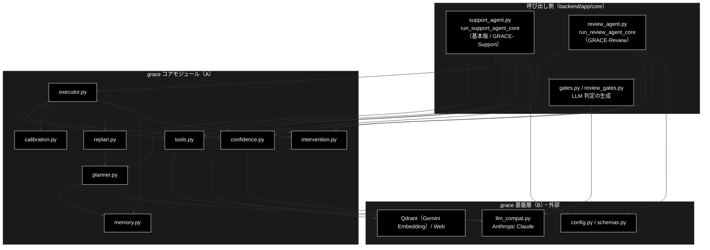
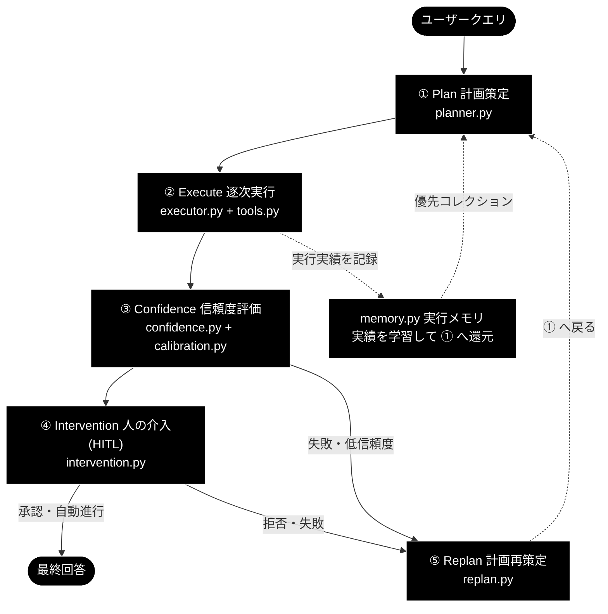

# README_grace.md - grace/ ディレクトリ概要

**Version 2.0** | 最終更新: 2026-10-10

`grace/` パッケージの入口となる文書。ディレクトリの役割・設計の考え方・モジュール索引・使い方・公開 API をまとめる。
文書を新しく書く／直す前に、まずここを見る。

> ⚠️ **本リポジトリは Anthropic 版。** LLM は `claude-sonnet-5-5`（軽量 `claude-haiku-5-5`）、
> Embedding のみ Gemini `gemini-embedding-001`（3072 次元）。
> 姉妹リポジトリ `grace_v2_local` は Ollama 版で、**プロバイダ表記はあちらと逆**である。
> 「Anthropic と書いてあるから誤記」ではない。CLAUDE.md §3 を参照。

---

## 目次

- [概要](#概要)
  - [主な責務](#主な責務)
  - [各責務対応のモジュール](#各責務対応のモジュール)
  - [アーキテクチャ構成図](#アーキテクチャ構成図)
  - [設計の考え方（ReAct → Reflection → GRACE 5 段階）](#設計の考え方react--reflection--grace-5-段階)
- [1. モジュール一覧（索引）](#1-モジュール一覧索引)
- [2. 使い方（代表的なワークフロー）](#2-使い方代表的なワークフロー)
- [3. 公開 API（__init__.py）](#3-公開-api__init__py)
- [4. 処理フロー・データフロー](#4-処理フローデータフロー)
- [5. 既知の制約・残課題](#5-既知の制約残課題)
- [6. 変更履歴](#6-変更履歴)

---

## 概要

`grace/` は **2 つのエージェントが共用する自律エージェント基盤**である
（GRACE = **G**uided **R**easoning with **A**daptive **C**onfidence **E**xecution）。
**GRACE-Support**（問い合わせ → 回答。基本版タブも同じコア）は `planner` → `executor` の**計画→実行ループ**をまるごと使い、
**GRACE-Review**（文書 → 指摘）はループを通らず `tools` / `confidence` / `intervention` / `llm_compat` を**直接**呼ぶ。
どちらも入口は `backend/app/core/` のコア関数（`run_support_agent_core` / `run_review_agent_core`）である。

### 主な責務

- 質問から実行計画（`ExecutionPlan`）を作る
- 計画をステップごとに実行し、動的フォールバック・介入・リプランを統括する
- RAG 検索・Web 検索・推論・ユーザーへの質問をツールとして提供する
- 結果の信頼度を多軸で測り、回答の根拠（支持率）を検証する
- 信頼度を経験的な正答率へ較正する
- 過去の実行実績を貯め、検索先の優先順位を学習する
- 信頼度に応じて人の確認・エスカレーション（HITL）を挟む
- 失敗・低信頼のときに計画を立て直す
- すべての部品が使う設定を一元管理する
- 計画・ステップ結果などの型（データ契約）を定める
- genai 形式の LLM 呼び出しを Anthropic Claude へ変換する

### 各責務対応のモジュール

| # | 責務 | 対応モジュール | 説明 |
|---|------|--------------|------|
| 1 | 実行計画の生成 | `planner.py` | `Planner.create_plan()`。曖昧な質問は確認、通常はルールで 2 ステップ、複雑なら LLM で計画する |
| 2 | 計画の実行と統括 | `executor.py` | `Executor.execute()`。RAG のスコア不足で Web 検索・ask_user を動的に挿入し、介入・リプラン・全体信頼度を回す |
| 3 | ツールの提供 | `tools.py` | `ToolRegistry` に `rag_search` / `web_search` / `reasoning` / `ask_user` を登録する（`code_execute` は `tools.enabled` に足したときだけ） |
| 4 | 信頼度と根拠の検証 | `confidence.py` | 多軸の `ConfidenceCalculator` と、支持率を出す `GroundednessVerifier` |
| 5 | 信頼度の較正 | `calibration.py` | `Calibrator`（温度スケーリング）。`config/calibration.json` があるときだけ効く |
| 6 | 実行実績の学習 | `memory.py` | `ExecutionMemory`（JSONL）。executor が書き、planner が読む |
| 7 | 人の介入（HITL） | `intervention.py` | `InterventionHandler`（SILENT / NOTIFY / CONFIRM / ESCALATE） |
| 8 | 計画の立て直し | `replan.py` | `ReplanOrchestrator` / `ReplanManager`（FULL / PARTIAL / FALLBACK / SKIP / ABORT） |
| 9 | 設定の一元管理 | `config.py` | `GraceConfig`。yml → 環境変数（`GRACE_`）→ pydantic の 3 段 |
| 10 | 型の定義 | `schemas.py` | `ExecutionPlan` / `PlanStep` / `StepResult` / `ExecutionResult` ほか |
| 11 | LLM 呼び出しの変換 | `llm_compat.py` | `create_chat_client()` → `AnthropicGenaiClient`（`messages.create`） |

### アーキテクチャ構成図



**データフロー**:

1. 両コアとも `copy.deepcopy(get_config())` でリクエスト単位の設定を作り、業界プロファイル／ルールセットの検索スコープと方針を `config` へ注入する
2. Support は `planner.create_plan` → `executor.execute` で内部 RAG と回答生成を行う。`executor` の内側で `tools` / `replan` / `memory` / `calibration` / 多軸信頼度が動く
3. Review は `tools` の `rag_search` を直接呼んで規程を集め、`review_gates.py` の LLM 判定で違反候補を出す
4. 両者とも `confidence.GroundednessVerifier` で根拠を検証し、副作用のあるアクションは `intervention.InterventionHandler` の承認を経てから実行する

ステップごとにどのモジュールが効くか（Support / Review の対応表と比較）は [`grace_process_flow.md` §2.3](./grace_process_flow.md#23-grace-support--grace-review-での使われ方) にある。

### 設計の考え方（ReAct → Reflection → GRACE 5 段階）

自律エージェントを **(A) → (B) → (C)** の順で改善してきた。3 世代は別物ではなく、前を内包して積み上げた関係にある
（**その場しのぎ → 経験から学ぶ → 組織的に運用する**）。

| 世代 | 名称 | 中核ループ／工程 | 足された核 |
|---|---|---|---|
| (A) | ReAct | `Thought → Action → Observation` を答えが出るまで回す | 思考・行動・観察のループ |
| (B) | ReAct + Reflection | ループに ① Evaluator（評価）→ ② Self-Reflection（反省を記憶）→ ③ Next Trial（再挑戦）を足す | 評価・反省・再挑戦 |
| (C) | GRACE 5 段階 | ① Plan → ② Execute → ③ Confidence → ④ Intervention → ⑤ Replan（⑤ から ① へ戻る） | 計画・HITL・リプランの工程化 |

- (A) は視野が狭く、失敗の理由を振り返らないので同じ的外れな行動を繰り返す。(B) は失敗を言語化して記憶し、次の試行の最優先の入力にする
- (C) は (B) の評価・反省を常設の工程（③ Confidence）にし、**人の介入（④ Intervention）を正式な工程として新設**した。⑤ Replan はエラーの文脈を添えて計画を作り直す（(B) の「反省を次へ渡す」の実装）



| 段階 | ルーツ | 主担当 | 補助 | 主なメソッド |
|---|---|---|---|---|
| ① Plan | (A) Thought を独立させた | `planner.py` | `memory.py`（優先コレクション）・`schemas.py` | `create_plan(query)` |
| ② Execute | (A) Action + Observation | `executor.py` ＋ `tools.py` | `llm_compat.py`・`schemas.py` | `execute(plan)` / `ToolRegistry.execute(name, ...)` |
| ③ Confidence | (B) Evaluator / Self-Reflection | `confidence.py` ＋ `calibration.py` | `config.py`（重み・しきい値） | `calculate()` / `verify()` / `transform()` |
| ④ Intervention | **GRACE で新設** | `intervention.py` | `confidence.py`（`InterventionLevel` / `ActionDecision`） | `decide_action()` → `handle()` |
| ⑤ Replan | (A) Thought へ戻る ＋ (B) Next Trial | `replan.py` | `planner.py`（作り直し） | `handle_step_failure()` |
| 横断 | — | `config.py` / `schemas.py` / `llm_compat.py` | — | `get_config()` / 各モデル / `create_chat_client()` |

> 📝 `memory.py` は 5 段階のどれにも属さない**横串**の学習機構である（executor が書き、planner が読む）。
> `calibration.py` も独立した段ではなく ③ の後処理。`executor.py` は `planner.py` に依存しない（計画は引数で渡る）が、
> `replan.py` は `planner.py` に依存する。このため §1 では実行順ではなく**役割**で並べる。

---

## 1. モジュール一覧（索引）

`grace/*.py`（`__init__.py` を除く 11 モジュール）と、ディレクトリの処理フロー・データフローの文書。
区分 **A（コア）** は 1 周を回す能力、**B（基盤層）** は A が共通に依存する土台（`grace` 内への依存がゼロで、被依存が多い）。

| モジュール | 文書 | 種別 | 行数 | Ver | 概要 |
|---|---|---|---:|---|---|
| `planner.py` | [`planner.md`](./planner.md) | E | 1366 | 3.16 | A・計画。質問を三層に振り分けて `ExecutionPlan` を作る |
| `executor.py` | [`executor.md`](./executor.md) | E | 2360 | 4.23 | A・実行。静的 Plan-Execute と ReAct ループ、動的フォールバック、介入・リプラン・全体信頼度 |
| `tools.py` | [`tools.md`](./tools.md) | E | 1847 | 3.9 | A・実行。`ToolRegistry` と 5 つのツール（`WebSearchTool` を含む） |
| `confidence.py` | [`confidence.md`](./confidence.md) | E | 2104 | 2.12 | A・評価。多軸の信頼度・根拠検証（支持率）・介入レベルの判定 |
| `calibration.py` | [`calibration.md`](./calibration.md) | E | 813 | 1.2 | A・評価。温度スケーリングによる較正と ECE |
| `intervention.py` | [`intervention.md`](./intervention.md) | E | 1650 | 1.10 | A・制御。HITL の振り分け・動的しきい値・確認フロー |
| `replan.py` | [`replan.md`](./replan.md) | E | 1219 | 2.5 | A・制御。リプランの要否・戦略・新計画 |
| `memory.py` | [`memory.md`](./memory.md) | E | 616 | 1.3 | A・学習。実行実績の JSONL と優先コレクション |
| `config.py` | [`config.md`](./config.md) | E | 1080 | 1.15 | B。設定の一元管理 |
| `schemas.py` | [`schemas.md`](./schemas.md) | E | 1369 | 2.4 | B。計画・結果・ReAct 観測の型 |
| `llm_compat.py` | [`llm_compat.md`](./llm_compat.md) | E | 972 | 1.11 | B。genai 形式 → Anthropic `messages.create` の変換 |
| （処理フロー） | [`grace_process_flow.md`](./grace_process_flow.md) | A | 445 | 4.0 | 1 クエリの処理の流れ・分岐・Support / Review での使われ方 |
| （データフロー） | [`grace_data_flow.md`](./grace_data_flow.md) | A | 315 | 4.0 | 外部 API に渡るデータ・プロンプトの所在・実行メモリと較正ファイル |

> 行数・Ver は `wc -l` と各文書の Version ヘッダーの実測値（2026-10-10）。

**A / B の線引きの根拠**（`grace/*.py` の import を AST で解析。2026-10-10 実測）:

| モジュール | 区分 | grace 内の依存先 | 被依存 |
|---|:--:|---|---:|
| `config` | B | なし | 6 |
| `schemas` | B | なし | 4 |
| `llm_compat` | B | なし | 4 |
| `confidence` | A | config, llm_compat | 2 |
| `memory` | A | なし | 2 |
| `tools` | A | config, llm_compat | 1 |
| `calibration` | A | なし | 1 |
| `intervention` | A | confidence, config, schemas | 1 |
| `replan` | A | config, planner, schemas | 1 |
| `planner` | A | config, llm_compat, memory, schemas | 1 |
| `executor` | A | `planner` 以外の 9 個すべて | 0 |

> `tools.py` は config / llm_compat に**依存する側**なので基盤層ではなく A に入る。

---

## 2. 使い方（代表的なワークフロー）

grace の部品の組み合わせ方は**エージェントによって 2 通り**あり、ほかに**オフラインで学習する部品を準備する**使い方がある。

| 使い方 | 組み合わせ | 向いている場面 | 例 |
|---|---|---|---|
| ループに任せる（Support 型） | `create_planner` → `create_executor` → `execute(plan)` | 質問に答える。② 〜 ⑤ は executor の内側で回る | 2.1 |
| 部品を直接呼ぶ（Review 型） | `ToolRegistry.execute("rag_search", ...)` → `GroundednessVerifier.verify` → `InterventionHandler.handle` | 計画が要らない定型の処理。検索・検証・承認だけを使う | 2.2 |
| 学習する部品を準備する | `Calibrator.fit` → `save` ／ `ExecutionMemory.record` → `best_collection` | 評価ログから較正を作る・実績を貯める | 2.3 |

> 📝 2.2・2.3 のコードは、LLM と Qdrant をスタブに差し替えて**そのまま実行し**、出力を確かめてある（2026-10-10。
> 2.2 は `rag_search` と根拠検証の LLM 応答をスタブ化、2.3 は一時ディレクトリへ書き出し）。2.1 は各モジュール文書の例を参照（同日に確認済み）。
> 出力例の値は例示で、実行ごとに変わる。

### 2.1 ループに任せる（GRACE-Support 型）

計画を作って executor に渡すだけで、② Execute 〜 ⑤ Replan と全体信頼度・較正・実行メモリへの記録が内側で回る。
コードは各モジュールの使用例にある（同じコードをここには置かない）。

| やりたいこと | 参照先 |
|---|---|
| 最小の流れ（計画 → 実行 → 結果の確認） | [`executor.md` §4.1.1](./executor.md#411-基本的なワークフロー) |
| 本番の入口と同じ組み立て方（1 つの config から全部品を作る） | [`executor.md` §4.1.2](./executor.md#412-web-api-と同じ組み立て方) |
| 進捗・信頼度・介入をその場で受け取る／一時停止から再開する | [`executor.md` §4.1.3・§4.1.4](./executor.md#413-コールバック付きの使用) |
| 計画だけを作る（三層の振り分けを確かめる） | [`planner.md` §4.1](./planner.md#41-使用例) |

> ⚠️ **config はリクエストごとにコピーしてから書き換える**（`copy.deepcopy(get_config())`）。`get_config()` は共有の設定を返すので、
> 書き換えると他のジョブへ漏れる。本番の入口 `run_support_agent_core` もそうしている。

### 2.2 部品を直接呼ぶ（GRACE-Review 型）

GRACE-Review の ② Retrieve・④ Ground・⑦ Action と同じ組み合わせ。計画も executor も使わない。

```python
import copy

from grace import (
    ActionDecision,
    InterventionLevel,
    create_intervention_handler,
    create_tool_registry,
    get_config,
)
from grace.confidence import create_groundedness_verifier, damp_support_rate
from grace.intervention import InterventionAction, InterventionResponse

# 1. リクエスト単位の設定を作り、検索スコープを注入する（共有の設定は書き換えない）
config = copy.deepcopy(get_config())
config.qdrant.allowed_collections = ["ec_ad_rules_anthropic"]

registry = create_tool_registry(config)
verifier = create_groundedness_verifier(config)
handler = create_intervention_handler(
    config,
    # 画面から使うときは承認待ちへつなぐ（Web では backend/app/core/intervention_bridge.py）
    on_confirm=lambda request: InterventionResponse(action=InterventionAction.PROCEED),
)

# 2. 規程を検索する（planner / executor を通さず、ツールを名前で直接呼ぶ）
res = registry.execute(
    "rag_search",
    query="「業界No.1」と表示してよいか",
    limit=5,
    allowed_collections=config.qdrant.allowed_collections,
)
evidence = [
    e["payload"].get("answer") or e["payload"].get("text") or ""
    for e in (res.output or []) if isinstance(e, dict)
]

# 3. 指摘の根拠を検証し、判定できなかった主張の分だけ支持率を割り引く
finding = "根拠資料なしに「業界No.1」と表示すると、優良誤認表示に当たるおそれがある"
gres = verifier.verify("次の記述は景品表示法の優良誤認に抵触するか", finding, evidence)
rate = damp_support_rate(gres, config.confidence)
print(f"supported={gres.supported} contradicted={gres.contradicted} total={gres.total} -> {rate:.2f}")

# 4. 副作用のある処理（チケット作成など）の前に、人の承認を挟む
decision = ActionDecision(
    level=InterventionLevel.CONFIRM,
    confidence_score=rate,
    reason="チケット作成前の確認",
)
response = handler.handle(decision)
print("実行する" if response.should_continue else "実行しない")

# 出力例:
# supported=1 contradicted=0 total=1 -> 1.00
# 実行する
```

> ⚠️ **`support_rate` だけを見ない。** neutral（判定できなかった主張）は分母から外れるので、supported が 1 件でもあれば 1.00 になりうる。
> `damp_support_rate` で判定率の分だけ割り引いた値を使う（Support の全体信頼度も同じ関数を通る）。
>
> 📝 `on_confirm` を渡さないと、CONFIRM は**タイムアウト扱い**になる（`InterventionHandler._handle_timeout`）。
> 既定（`config.intervention.auto_proceed_on_timeout = false`）では**中止**（`CANCEL`・`timeout_reached=True`）を返すので、
> 副作用のある処理は実行されない。

### 2.3 学習する部品を準備する（較正・実行メモリ）

どちらもオフラインで作っておくと、次の実行から executor / planner が自動で使う。

```python
from grace.calibration import Calibrator, expected_calibration_error
from grace.memory import create_execution_memory

# 1. 較正: 評価ログ（信頼度, 正誤）から温度 T を推定して保存する
confidences = [0.95, 0.9, 0.9, 0.85, 0.8, 0.8, 0.7, 0.6]
correctness = [True, True, False, True, False, True, False, False]
calib = Calibrator.fit(confidences, correctness)
before = expected_calibration_error(confidences, correctness)
after = expected_calibration_error([calib.transform(c) for c in confidences], correctness)
print(f"T={calib.temperature:.2f}  ECE {before:.3f} -> {after:.3f}")
calib.save("config/calibration.json")   # executor は起動時に読む（ファイルが無ければ恒等変換）

# 2. 実行メモリ: 実績が貯まると、planner がそのコレクションに絞って検索する
memory = create_execution_memory("logs/grace_memory.jsonl")
for q in ["API のレート制限は？", "API キーの再発行方法", "API の認証方式"]:
    memory.record(q, "saas_api_anthropic", success=True, confidence=0.85)
print(memory.best_collection("API のエラーコード一覧"))   # 3 件以上・スコア 0.6 以上なら名前、足りなければ None

# 出力例:
# T=3.68  ECE 0.325 -> 0.209
# saas_api_anthropic
```

> ⚠️ **`config/calibration.json` を書くと、以降のすべての実行の信頼度が変わる**（`config.confidence.calibration_path`）。
> 試すときは別のパスへ保存する。実行メモリ（`config.memory.path`）も同様で、ここへ書いた実績は planner の検索先選びに効く。
>
> ⚠️ planner は `qdrant.excluded_collections`（既定で `wikipedia` などを部分一致で除外）に当たるコレクションを選ばない。
> 実績を貯めても、除外対象なら計画は絞られない（[`memory.md` §4.1.2](./memory.md#412-除外述語つきで推奨を得るplanner-の呼び方)）。
>
> 📝 `best_collection()` が名前を返す条件は「キーワードが一致する実績が `min_count`（既定 3）件以上」かつ
> 「（成功数+1）/（件数+2）× 平均信頼度 が `min_score`（既定 0.6）以上」。蓄積の流れは
> [`grace_data_flow.md` §3.3](./grace_data_flow.md#33-実行メモリの蓄積と読み戻し) を参照。

---

## 3. 公開 API（__init__.py）

`grace/__init__.py` の `__all__`（59 件。下表の 58 件と `__version__`〔`"0.1.0"`〕）。`from grace import ...` で使える。

| 名前 | 定義元 | 用途 |
|---|---|---|
| `ExecutionPlan` / `PlanStep` / `StepResult` / `ExecutionResult` / `ActionType` / `StepStatus` / `SearchResultPayload` / `SearchResultItem` / `create_plan_id` / `validate_plan_dependencies` | `schemas.py` | 計画・結果の型と ID 生成・依存関係の検証 |
| `GraceConfig` / `get_config` / `reload_config` | `config.py` | 設定の取得と再読込 |
| `Planner` / `create_planner` | `planner.py` | 計画の生成 |
| `ToolResult` / `BaseTool` / `RAGSearchTool` / `WebSearchTool` / `ReasoningTool` / `AskUserTool` / `ToolRegistry` / `create_tool_registry` | `tools.py` | ツールとレジストリ |
| `ExecutionState` / `Executor` / `create_executor` | `executor.py` | 計画の実行 |
| `ConfidenceFactors` / `ConfidenceScore` / `ActionDecision` / `InterventionLevel` / `ConfidenceCalculator` / `LLMSelfEvaluator` / `SourceAgreementCalculator` / `QueryCoverageCalculator` / `ConfidenceAggregator` / `create_confidence_calculator` / `create_llm_evaluator` / `create_source_agreement_calculator` / `create_query_coverage_calculator` / `create_confidence_aggregator` | `confidence.py` | 信頼度の算出と介入レベル |
| `InterventionRequest` / `InterventionResponse` / `InterventionAction` / `FeedbackRecord` / `InterventionHandler` / `DynamicThresholdAdjuster` / `ConfirmationFlow` / `create_intervention_handler` / `create_threshold_adjuster` / `create_confirmation_flow` | `intervention.py` | 人の介入 |
| `ReplanTrigger` / `ReplanStrategy` / `ReplanContext` / `ReplanResult` / `ReplanManager` / `ReplanOrchestrator` / `create_replan_manager` / `create_replan_orchestrator` | `replan.py` | リプラン |

> 📝 **再エクスポートされていないもの**は各モジュールから直接 import する:
> `GroundednessVerifier` / `create_groundedness_verifier` / `damp_support_rate`（`grace.confidence`）、
> `Calibrator` ほか（`grace.calibration`）、`ExecutionMemory` ほか（`grace.memory`）、
> `create_chat_client`（`grace.llm_compat`）。GRACE-Support / GRACE-Review も根拠検証は `grace.confidence` から直接 import している。

---

## 4. 処理フロー・データフロー

| 文書 | 要約 |
|---|---|
| [`grace_process_flow.md`](./grace_process_flow.md) | 1 クエリの処理の流れ。計画 → ステップ実行（RAG のスコア不足で Web 検索・ask_user を動的に挿入）→ ステップ信頼度 → 介入 → リプラン → 全体信頼度（根拠検証を主成分にブレンド → 較正）→ 実行メモリへの記録。静的パスと ReAct ループの振り分け、介入レベルとしきい値、GRACE-Support / GRACE-Review のステップ × モジュール対応表もここにある |
| [`grace_data_flow.md`](./grace_data_flow.md) | データの形と行き先。外部 API（Anthropic `messages.create` / Gemini `embed_content` / Qdrant / Web）に何が渡るか、どのプロンプトがどのモジュールにあるか、実行メモリ（`logs/grace_memory.jsonl`）と較正ファイル（`config/calibration.json`）の形式 |

---

## 5. 既知の制約・残課題

| # | 内容 | 状態 |
|---|---|---|
| 1 | `Executor` の `on_replan` コールバックは引数として受け取るが、**現在の実装は呼び出さない**（保持するだけ）。リプランの発生は `ExecutionResult.replan_count` で見る | 実装どおり（`executor.md` §4.1.3） |
| 2 | `grace/__init__.py` の docstring に「planner: Plan generation using Gemini API」と移植前の記述が残っている（実際の LLM は Anthropic） | コードの docstring。文書側は実装に合わせて記述済み |
| 3 | 較正ファイル `config/calibration.json` はリポジトリに無いので、既定では較正は恒等変換（T=1.0）になる | 実装どおり。作り方は §2.3 |
| 4 | `ConfidenceCalculator.calculate()` は `config.confidence.weights` ではなく内蔵の重みで合成する（`weights` は検証用） | 実装どおり（`confidence.md`） |

### 5.1 文書を保守するときの約束

文書の書式は `.claude/skills/grace-agent-docs/` の仕様（モジュールは `a_class_method_md_format.md`、本書と処理フロー・データフローは
`a_cross_doc_md_format.md`）に従う。過去の失敗から、次の 5 つを守る。

| 約束 | 理由（実例） |
|---|---|
| **文書から文書へ写さず、必ず実装から書き起こす** | 2026-09-04、統合元の `web_search.md` は `_calculate_confidence_factors` を**修正前の姿**で保存していた。そのまま写すと直ったバグを文書化するところだった。2026-10-10 の統合でも、旧 `grace_runtime.md` のプロンプト全文が実装（根拠検証の FAQ の扱い・reason の字数指定）より古かった |
| **同じ表・同じ図を 2 か所に置かない** | 2026-09-14 まで、構成図（Mermaid 68 行）が 2 本の文書でバイト単位で一致しており、片方だけが腐る状態だった。正本は 1 か所にし、ほかはリンクする |
| **行番号で参照しない**（シンボル名で参照する） | 旧 `grace_core.md` の行番号参照 13 件は、ほぼ全部ズレていた |
| **日付の新旧で追随遅れを判断しない** | 履歴は途中でまとめてインポートされている（`2f93674` が calibration / intervention / replan を新規追加）。判断はシンボルの網羅と実コードの読解で行う |
| **姉妹リポジトリの文書を丸ごと持ち込まない** | `grace_v2_local`（Ollama 版）とは実装が違う（例: `memory.best_collection(exclude=...)` は grace_v2 にだけある）。プロバイダの記述も逆 |

**検証**（リポジトリ直下で実行）。文書を直したら、次の 3 つを回す。

1. **書式とディレクトリ構成**: `a_cross_doc_md_format.md` §10 の検証スクリプト（Version とヘッダーの一致・変更履歴の列と順序・Mermaid の黒背景。構成は `--layout`）
2. **公開シンボルの網羅**: `.py` のトップレベルの関数・クラス・メソッド・大文字の定数が、すべて文書に出てくるか（2026-10-10 は全 11 モジュールで未記載 0）

```bash
python3 - grace/memory.py grace/docs/memory.md <<'PY'
import ast, pathlib, sys
mod, doc = sys.argv[1], sys.argv[2]
tree = ast.parse(pathlib.Path(mod).read_text(encoding="utf-8"))
syms = []
for n in tree.body:
    if isinstance(n, (ast.FunctionDef, ast.AsyncFunctionDef)): syms.append(n.name)
    elif isinstance(n, ast.ClassDef):
        syms.append(n.name)
        syms += [m.name for m in n.body if isinstance(m, (ast.FunctionDef, ast.AsyncFunctionDef))]
    elif isinstance(n, ast.Assign):
        syms += [t.id for t in n.targets if isinstance(t, ast.Name) and t.id.isupper()]
text = pathlib.Path(doc).read_text(encoding="utf-8")
missing = [s for s in syms if not s.startswith("__") and s not in text]
print(f"{len(syms)} 件中 未記載 {len(missing)}: {missing}")
PY
```

3. **リンクと見出しアンカー**: 相対リンク先が実在し、`#` 以降が見出しから作られるアンカーと一致するか（コードブロックの中は除く）

```bash
python3 - grace/docs/*.md <<'PY'
import re, pathlib, sys
def slug(h):                      # GitHub の見出しアンカー生成則
    out = []
    for c in h.lower():
        if c == ' ': out.append('-')
        elif c in '-_': out.append(c)
        elif c.isalnum() and (c.isascii() or c.isalpha() or c.isdecimal()): out.append(c)
    return ''.join(out)
def anchors(path):
    out, fence = set(), False
    for line in pathlib.Path(path).read_text(encoding='utf-8').splitlines():
        if line.startswith('`' * 3): fence = not fence; continue
        if not fence and line.startswith('#'): out.add(slug(line.lstrip('#').strip()))
    return out
bad = []
for md in map(pathlib.Path, sys.argv[1:]):
    text = re.sub(r'`{3}.*?`{3}', '', md.read_text(encoding='utf-8'), flags=re.S)
    for link in re.findall(r'\]\(([^)\s]+)\)', text):
        if link.startswith(('http', 'mailto:')): continue
        f, _, anc = link.partition('#')
        tgt = (md.parent / f).resolve() if f else md.resolve()
        if not tgt.exists(): bad.append(f'{md}: リンク切れ {link}')
        elif anc and tgt.suffix == '.md' and anc not in anchors(tgt): bad.append(f'{md}: アンカー不一致 #{anc}')
print('NG', len(bad)); [print('  ', b) for b in bad]
PY
```

> ⚠️ **見出しの記号はハイフンにならず消えるだけ**（`①` `・` `（）` `→` など）。手で書かずにこのスクリプトに計算させる。
> 目次だけが古い見出しのまま残る腐り方は、リンク先のファイルが実在するので 2 の存在確認では捕まらない（2026-09-14 に 9 件見つかった）。

---

## 6. 変更履歴

| バージョン | 日付 | 変更内容 |
|---|---|---|
| 1.0 | — | 初版作成。文書 22 件（モジュール 12・横断 9・本書）の一覧、コード最終コミット日との追随比較、検証手順 4 種（AST シンボル網羅・Mermaid 規約・リンク存在・実在しないファイル参照）、残タスク 4 件、grep の落とし穴 7 件を整備 |
| 1.1 | — | `web_search.md` の `tools.md` への統合と `agent_example_core8.md` の削除を反映（問題 #8 / #9 を解消）。文書は 22 → 20 件。統合の副産物として、`tools.md` に **`CodeExecuteTool` クラスごと未記載**であること（AST 照合で 37 件中 10 件が未記載）が判明したため残タスクへ追加 |
| 1.2 | 2026-09-04 | **モジュール文書 8 件の未記載シンボル 31 件を解消**（2026-09-04）。全 11 モジュールで AST 網羅 **100%** に到達。§3 を「日付比較」から「AST 網羅＋内容でズレていた 4 件」の記録へ書き換えた。⚠️ 本リポジトリの履歴は途中でまとめてインポートされており（`2f93674` が calibration / intervention / replan を新規追加）、**「コードの日付 > 文書の日付」は追随遅れの証拠にならない**ことが分かったので、その注意も §3.2 に明記 |
| 1.3 | 2026-09-04 | **GRACE-Support 3 点を `backend/docs/` へ移設**（2026-09-04）。実装が `backend/app/core/support_agent.py` にあるため。`grace/docs/` は `grace/` パッケージの文書だけを持つ状態になった。あわせて、前版でヘッダーの版数だけ 1.1 のまま置き忘れていたのを是正 |
| 1.4 | 2026-09-14 | **文書一覧を A/B/C の 3 区分へ再編**（2026-09-14）。従来は「モジュール単位 / 横断」の 2 区分で、コア（A）と基盤層（B）の別が読み取れなかった。`grace_core.md` の依存関係図に合わせ **A. コアモジュール 8 / B. 基盤層 3 / C. 横断 4** とし、線引きの根拠を §2.4 に**実測**で載せた（`grace/*.py` を AST 解析。B は依存ゼロ・被依存 6/4/4、`tools.py` は config / llm_compat に依存する側なので A）。あわせて **A を「実行順 1〜8」で並べない**理由を明記——`memory` は planner が読み executor が書く両端モジュール、`calibration` は confidence の後処理、`executor` は `planner` に依存しない（逆に `replan` が依存する）ため。`benchmark.md` は `grace/step_trace/docs/` へ移動（§2.5・問題 #11）。`grace.md` に Version ヘッダーを追加し残タスク #3 を解消 |
| 1.5 | 2026-09-14 | **横断文書 4 本を WHY/WHAT/HOW の 3 本へ統合**（2026-09-14・問題 #13）。`grace.md` / `grace_core.md` / `grace_core_flow.md` は**同じ表と同じ図を重複して持って**いた（構成図 Mermaid 68 行と依存関係テーブルは `grace_core.md` と `grace_core_flow.md` で**バイト単位で一致**、11 行役割サマリー表は `grace.md` と `grace_core_flow.md` で一致、5 段階設計の ASCII 図・使用例コードも重複）。正本を 1 箇所ずつ決め、**`grace.md`＝5 段階設計の定義（WHY）／ `grace_core.md`＝構成図・依存関係・役割サマリー §3.0・最小実行サンプル §7（WHAT）／ `grace_runtime.md`（旧 `grace_core_flow.md` から改称）＝プロンプトと API 発行部（HOW）** に整理した。重複禁止ルールを §2.6、検出スクリプトを §2.7 として明文化。あわせて §2.1〜§2.3 の行数・Ver を `wc -l` と Version ヘッダーで**実測し直した**（問題 #14。`planner.md` 1139→1183 等がずれていた）。外部からのリンク（`backend/docs/support_spec.md` / `support_spec.md` / `backend/docs/README.md` / `docs/doc_modernization_todo.md`）も張り替えた |
| 1.6 | 2026-09-14 | **見出しアンカーの解決確認を §4.5 として追加し、壊れていた 9 件を是正**（2026-09-14・問題 #15）。`executor.md` 6 件（v4.4 で `4.1 使用例` を挿入し `### 4.N` を繰り下げた際、目次だけ旧番号のまま残った。あわせて移動前の「## 6. 使用例」配下に取り残されていた使用例 3 件を §4.1 の下へ移した）、`backend/docs/README.md` 1 件・`backend/docs/support_spec.md` 1 件（見出しを言い換えたが目次は旧題のまま）、`docs/support_spec.md` 1 件。**この種の腐りは §4.3 のリンク存在チェックでは捕まらない**（ファイルは実在し、壊れているのは `#` 以降だけ）ため、検証手順を 4 つから 5 つへ増やした |
| 1.7 | 2026-09-24 | `grace/docs/` を基本フォーマット・横断文書フォーマットへ追随させた（2026-09-24）。IPO 文書は使用例を IPO 詳細の冒頭へ移し（`config` / `llm_compat` / `schemas` / `tools`）、各責務対応のモジュールを主な責務と 1:1 に揃えた（`confidence` / `memory` / `tools` / `schemas`）。横断文書（`grace` / `grace_runtime` / `confidence_calibration`）の概要へ共通骨格を追加。現在の既定モデルの記載 `claude-sonnet-4-6` を `claude-sonnet-5` へ是正。§2 の各節へ種別を明記し、行数・Ver を実測へ更新 |
| 1.8 | 2026-09-26 | `llm_compat.md` v1.4（`create_chat_client()` が未知の `config.llm.provider` を `ValueError` にする）に追随して §2 の行数・Ver を更新（2026-09-26）。表は v1.2 のまま取り残されていた |
| 1.9 | 2026-09-26 | Embedding を `gemini-embedding-2` へ変えたのに追随して `config.md` v1.5 / `confidence.md` v2.6 の行数・Ver を更新（2026-09-26） |
| 1.10 | 2026-09-26 | 現在の Embedding の記述を `gemini-embedding-001` から `gemini-embedding-2` へ是正（2026-09-26 に変更。定義は `config.py::ModelConfig.EMBEDDING_MODEL` の 1 箇所）。あわせて同じ改訂の 8 文書の行数・Ver を再実測（`grace_runtime.md` は改訂前から v3.1 のまま取り残されていた → v3.3） |
| 1.11 | 2026-09-26 | Embedding を `gemini-embedding-001` に戻したのに追随（2026-09-26。同日に一度 `gemini-embedding-2` へ変えたが、既存の Qdrant コレクションと grace_v2_local（同じ Qdrant を共用）をそのまま使うため戻した。定義は `config.py::ModelConfig.EMBEDDING_MODEL`）。同じ改訂の 10 文書の行数・Ver を再実測 |
| 1.12 | 2026-10-06 | **冒頭に[概要](#概要)を新設し、GRACE-Review を取り込んだ**（2026-10-06・問題 #17）。それまで本書は GRACE-Support（基本版）の流れだけを前提にしていた。両エージェントのステップごとに grace のどのモジュール（シンボル）が効くかの表と、モジュール単位・観点単位の比較表、3 層の構成図を置いた（Review は `planner` / `executor` を通らず、`tools` / `confidence` / `intervention` / `llm_compat` を直接呼ぶ）。章番号は変えていない。あわせて (1) §2 の行数・Ver を実測し直した（7 文書が古いままだった）、(2) §3.1 の AST 網羅を再実測し、未記載 6 件を §5 タスク 5 として登録（問題 #16）、(3) 冒頭と 11 文書の**現在の既定モデル**の記載を `claude-sonnet-5` から `claude-sonnet-5-5` へ是正 |
| 1.13 | 2026-10-06 | §5 タスク 5 を完了（2026-10-06）。未記載だった 6 シンボルを実装から書き起こし、`confidence.md`（§4.14 断り文の除外・§4.15 `damp_support_rate`）/ `executor.md`（`_prefetch_enabled`）/ `llm_compat.md`（§4.7 `_stop_category`・§5.3.1 `_ALWAYS_THINKING_MIN_TOKENS`）へ追加し、§3.1 の AST 網羅が全 11 モジュールで 100% に戻った。`config.md` の設定一覧の抜け 2 件と、v1.12 で同書の変更履歴に足した行の日付列の抜けも直した。§2 の行数・Ver を再実測 |
| 1.14 | 2026-10-06 | `config.md` v1.12（冒頭の行番号参照 `config.py:411` をシンボル参照へ是正）に追随して §2.2 の行数・Ver を更新（2026-10-06）。grace/docs に残っていた最後の行番号参照で、grace_v2_local の `docs_audit.md` §5.2 の再測定で見つかった |
| 1.15 | 2026-10-08 | 軽量モデルを Haiku 4.5（`claude-haiku-4-5` / `claude-haiku-4-5-20251001`）から Claude Haiku 5.5（`claude-haiku-5-5`）へ変更したのに追随（2026-10-08） |
| 1.16 | 2026-10-10 | §3 の `executor.md` の行数・版を実測へ（2219 行・v4.16 → 2345 行・v4.18。§4.1 使用例の書き直しに追随） |
| 1.17 | 2026-10-10 | `grace/step_trace/`（`benchmark.py` を含む）を 2026-10-10 にディレクトリごと削除したのに追随し、現状を述べる記述から外した（過去の経緯の記述は残す）。§3 の `executor.md` の行数・版を実測へ（2346 行・v4.19） |
| 1.18 | 2026-10-10 | Legacy ReAct 経路の削除（2026-10-10）に追随し、§3 の `executor.md`（2300 行・v4.20）・`schemas.md`（v2.3）・`confidence_calibration.md`（v1.7）の行数・版と、§3.1 の `executor.md` の公開シンボル数（58 → 57）を実測へ |
| 1.19 | 2026-10-10 | テストの所在を `backend/tests/` からリポジトリ直下の `tests/` へ移したのに追随（パス・コマンド・import の表記） |
| 2.0 | 2026-10-10 | **`README.md` を `README_grace.md` へ改称し、ディレクトリ概要に作り直した**（`a_cross_doc_md_format.md` §1.2 の構成）。(1) 旧 `grace.md`（設計思想・ReAct → Reflection → GRACE の経緯・5 段階の定義）を「概要 > 設計の考え方」へ統合し、`grace.md` を削除した。(2) 旧 `grace_core.md` の概要・モジュール役割サマリー・エクスポート・最小実行サンプルを §1・§2・§3 へ統合した（同書は `grace_process_flow.md` へ改称）。(3) 旧 §1 の解決済みの問題一覧・§2 の文書一覧・§3 の実装追随状況・§5 の残タスク・§6 の落とし穴は、§1 モジュール一覧と §5.1 保守の約束に要点を残して整理した。旧 §4 の検証スクリプトは、書式・Mermaid を `a_cross_doc_md_format.md` §10 に任せ、公開シンボルの網羅とリンク・アンカーの 2 本を §5.1 に残した（`backend/docs/docs_audit.md` が参照している）。(4) GRACE-Support / GRACE-Review のステップ × モジュール対応表は `grace_process_flow.md` §2.3 へ移した。(5) §2 使い方に Review 型（部品を直接呼ぶ）と学習する部品の準備の例を新設し、スタブで実行して出力を確かめた |
