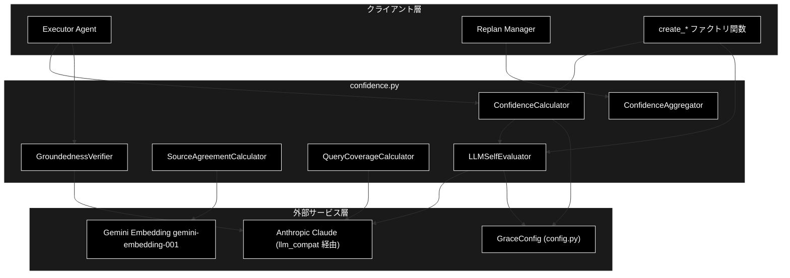
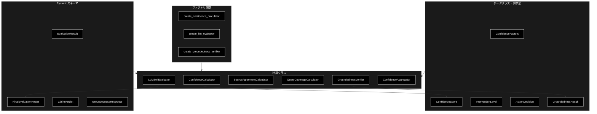
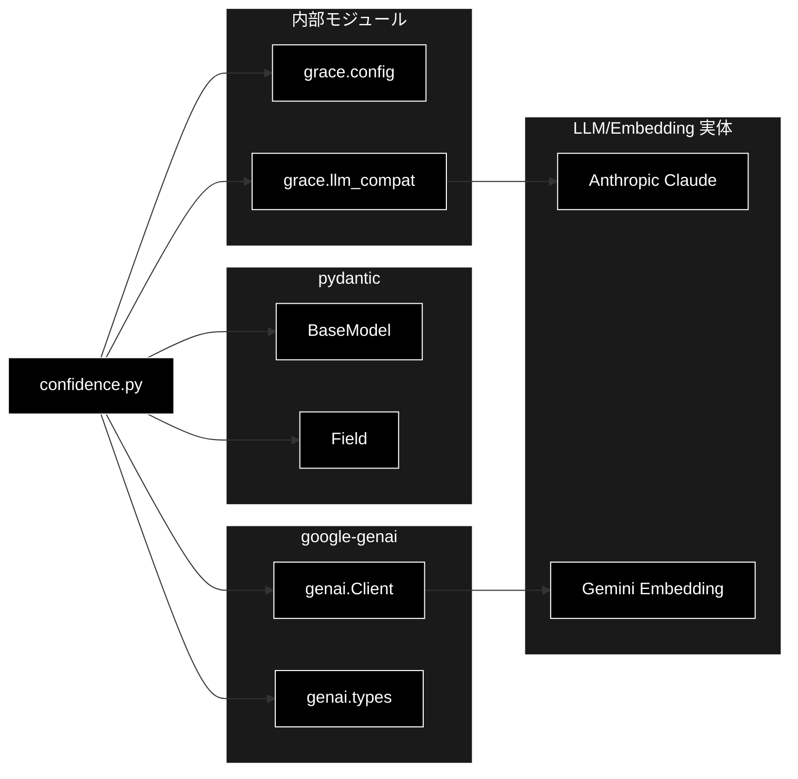

# confidence.py - 信頼度計算システム ドキュメント

**Version 2.12** | 最終更新: 2026-10-10

---

## 目次

1. [概要](#概要)
2. [アーキテクチャ構成図](#1-アーキテクチャ構成図)
3. [モジュール構成図](#2-モジュール構成図)
4. [クラス・関数一覧表](#3-クラス関数一覧表)
5. [クラス・関数 IPO詳細](#4-クラス関数-ipo詳細)
6. [設定・定数](#5-設定定数)
7. [エクスポート](#6-エクスポート)
8. [変更履歴](#7-変更履歴)
9. [付録: 依存関係図](#付録-依存関係図)

---

## 概要

`confidence.py` は、GRACE（Guided Reasoning with Adaptive Confidence Execution）における信頼度計算システムを実装するモジュールです。ハイブリッド方式（重み付き平均 + LLM 自己評価 + 根拠妥当性検証）による多軸の信頼度算出と、その結果に基づく介入レベル（自動進行〜ユーザー入力要求）の判定を担います。

LLM 呼び出しは `llm_compat.create_chat_client()` が返す genai 互換クライアント経由で行われ、本プロジェクトでは Anthropic Claude（既定 `claude-sonnet-5-5`）が実体となります。一方、ソース一致度計算の Embedding は Gemini（`gemini-embedding-001`、3072次元。定義は `config.py::ModelConfig.EMBEDDING_MODEL`）を利用します。

### 主な責務

- RAG 検索品質・ツール成功率などの要素から多軸信頼度を計算する
- LLM 自己評価により回答の確信度・網羅度を取得する
- 複数ソース間の意味的一致度を計算する
- 最終回答の各主張が引用ソースに支持されるか（groundedness）を検証する
- 信頼度スコアに基づいて介入レベル（アクション）を決定する
- 複数ステップの信頼度を集計する

### 各責務対応のモジュール

| # | 責務 | 対応モジュール | 説明 |
|---|------|--------------|------|
| 1 | 多軸信頼度の計算 | `grace/confidence.py` / `grace/config.py` | `ConfidenceCalculator` が検索品質・ツール成功率等を統合。重み・閾値は `GraceConfig.confidence` |
| 2 | LLM 自己評価 | `grace/confidence.py` / `grace/llm_compat.py` | `LLMSelfEvaluator` が確信度・網羅度を評価。クライアントは `create_chat_client()` |
| 3 | 複数ソース一致度 | `grace/confidence.py` | `SourceAgreementCalculator` が Gemini Embedding で類似度を算出 |
| 4 | 根拠妥当性の検証 | `grace/confidence.py` | `GroundednessVerifier` が主張ごとに支持 / 矛盾 / 中立を判定 |
| 5 | 介入レベルの決定 | `grace/confidence.py` | `ConfidenceCalculator.decide_action()` が閾値で判定 |
| 6 | 複数ステップの集計 | `grace/confidence.py` | `ConfidenceAggregator` が mean / min / weighted で集計 |

### 主要機能一覧

| 機能 | 説明 |
|------|------|
| `ConfidenceFactors` | 信頼度を構成する各要素を保持するデータクラス |
| `ConfidenceScore` | 信頼度スコアと内訳・ペナルティを保持するデータクラス |
| `ConfidenceScore.level` | スコアから信頼度レベル文字列を導出するプロパティ |
| `InterventionLevel` | 介入レベルの列挙型（silent/notify/confirm/escalate） |
| `ActionDecision` | 信頼度に基づくアクション決定を保持するデータクラス |
| `ConfidenceCalculator` | ハイブリッド方式の信頼度計算クラス |
| `ConfidenceCalculator.calculate()` | 要素から信頼度スコアを算出 |
| `ConfidenceCalculator.llm_calculate()` | LLM を用いた信頼度計算 |
| `ConfidenceCalculator.decide_action()` | スコアから介入レベルを決定 |
| `LLMSelfEvaluator` | LLM による自己評価クラス |
| `LLMSelfEvaluator.evaluate()` | 確信度を単一スコアで評価 |
| `LLMSelfEvaluator.evaluate_final()` | 確信度＋網羅度を1回の呼び出しで統合評価 |
| `LLMSelfEvaluator.evaluate_with_factors()` | Factors を考慮した総合評価 |
| `SourceAgreementCalculator` | 複数ソース間一致度計算クラス |
| `SourceAgreementCalculator.calculate()` | 回答群の平均コサイン類似度を算出 |
| `QueryCoverageCalculator` | クエリ網羅度計算クラス |
| `QueryCoverageCalculator.calculate()` | 質問要素のカバー度を評価 |
| `GroundednessVerifier` | 根拠妥当性（S1）検証クラス |
| `GroundednessVerifier.verify()` | 主張ごとの支持率を検証。**同一入力（query / answer / sources）は再検証せずメモを返す**（executor と ③ 根拠評価が同じ回答を検証するため。実測 2026-08-30 で 7.0 秒＝全体の 19% を無駄にしていた） |
| `ConfidenceAggregator` | 複数ステップの信頼度集計クラス |
| `ConfidenceAggregator.aggregate()` | mean/min/weighted で集計 |
| `ConfidenceAggregator.aggregate_with_critical_check()` | 致命的失敗を考慮した集計 |
| `create_confidence_calculator()` | `ConfidenceCalculator` のファクトリ関数 |
| `create_llm_evaluator()` | `LLMSelfEvaluator` のファクトリ関数 |
| `create_source_agreement_calculator()` | `SourceAgreementCalculator` のファクトリ関数 |
| `create_query_coverage_calculator()` | `QueryCoverageCalculator` のファクトリ関数 |
| `create_confidence_aggregator()` | `ConfidenceAggregator` のファクトリ関数 |
| `create_groundedness_verifier()` | `GroundednessVerifier` のファクトリ関数 |
| `is_absence_claim()` | 「情報源に記載がない」型の主張（断り文）か。支持率・判定率の母数から外す対象を見分ける |
| `ABSENCE_CLAIM_SOURCE_WORDS` / `ABSENCE_CLAIM_MARKERS` | `is_absence_claim` が使う 2 つの語群（情報源を指す語・不在を述べる語） |
| `damp_support_rate()` | 判定できた主張の割合で支持率を割り引く（M-6）。**Support（`executor`）と Review（④ Ground）の共通関数** |

---

## 1. アーキテクチャ構成図

### 1.1 システム全体構成



### 1.2 データフロー

1. クライアント層（Executor / Replan Manager）が `ConfidenceFactors` を構築する
2. `ConfidenceCalculator.calculate()` または `llm_calculate()` が信頼度スコアを算出する
3. LLM 評価（`LLMSelfEvaluator` / `QueryCoverageCalculator` / `GroundednessVerifier`）は `llm_compat` 経由で Anthropic Claude を呼び出す
4. ソース一致度（`SourceAgreementCalculator`）は Gemini Embedding でベクトル化しコサイン類似度を計算する
5. `ConfidenceScore` を `decide_action()` に渡し `InterventionLevel` を決定する
6. 複数ステップは `ConfidenceAggregator` で集計され、最終的な信頼度として返却される

---

## 2. モジュール構成図

### 2.1 内部モジュール構成



### 2.2 外部依存関係

| ライブラリ | バージョン | 用途 |
|-----------|-----------|------|
| `google-genai` | - | Gemini Embedding（`genai.Client` / `types`） |
| `anthropic` | - | LLM テキスト生成（`llm_compat` 経由で遅延 import） |
| `pydantic` | - | 構造化出力スキーマ（`BaseModel` / `Field`） |

### 2.3 内部依存モジュール

| モジュール | 用途 |
|-----------|------|
| `grace.config` | `get_config` / `GraceConfig`（重み・閾値・モデル名）/ **`resolve_heavy_model` / `heavy_thinking_budget`**（M-1 論理層モデルと拡張思考予算の解決） |
| `grace.llm_compat` | `create_chat_client`（genai 互換 Anthropic クライアント） |

---

## 3. クラス・関数一覧表

### 3.1 クラス一覧

#### EvaluationResult

| メソッド | 概要 |
|---------|------|
| （フィールドのみ） | `score: float`, `reason: str` — LLM 信頼度評価の応答スキーマ |

#### ConfidenceFactors

| メソッド | 概要 |
|---------|------|
| （データクラス） | 信頼度を構成する各要素（検索・ソース・ツール・クエリ等） |

#### ConfidenceScore

| メソッド | 概要 |
|---------|------|
| `level` | スコアから信頼度レベル文字列を返すプロパティ |

#### InterventionLevel

| メソッド | 概要 |
|---------|------|
| （列挙型） | `SILENT` / `NOTIFY` / `CONFIRM` / `ESCALATE` |

#### ActionDecision

| メソッド | 概要 |
|---------|------|
| `should_proceed` | 自動進行可能かを返すプロパティ |
| `needs_confirmation` | 確認が必要かを返すプロパティ |
| `needs_user_input` | ユーザー入力が必要かを返すプロパティ |

#### ConfidenceCalculator

| メソッド | 概要 |
|---------|------|
| `__init__(config=None)` | コンストラクタ（設定・重みの読込と検証） |
| `_validate_weights()` | 重みの合計が 1.0 であることを検証 |
| `calculate(factors)` | ハイブリッド方式で信頼度スコアを算出 |
| `llm_calculate(factors, step_description, tool_output)` | LLM を用いた信頼度計算 |
| `_calc_search_quality(factors)` | RAG 検索品質をスコア化 |
| `_calc_tool_success(factors)` | ツール成功率を計算 |
| `_apply_penalties(base_score, factors)` | 特定条件でペナルティを適用 |
| `decide_action(score)` | スコアから介入レベルを決定 |

#### FinalEvaluationResult

| メソッド | 概要 |
|---------|------|
| （フィールドのみ） | `self_eval_score`, `coverage_score`, `reason` |

#### LLMSelfEvaluator

| メソッド | 概要 |
|---------|------|
| `__init__(config=None, model_name=None)` | コンストラクタ（クライアント生成） |
| `evaluate(query, answer, sources=None)` | 確信度を単一スコアで評価 |
| `evaluate_final(query, answer, sources=None)` | 確信度＋網羅度を1回で統合評価 |
| `evaluate_with_factors(description, output, factors)` | Factors を考慮した総合評価 |

#### SourceAgreementCalculator

| メソッド | 概要 |
|---------|------|
| `__init__(config=None)` | コンストラクタ（Gemini クライアント生成） |
| `calculate(answers)` | 回答群の平均コサイン類似度を算出 |
| `_cosine_similarity(vec1, vec2)` | コサイン類似度（静的メソッド） |

#### QueryCoverageCalculator

| メソッド | 概要 |
|---------|------|
| `__init__(config=None, model_name=None)` | コンストラクタ（クライアント生成） |
| `calculate(query, answer)` | クエリ網羅度を評価 |

#### ClaimVerdict

| メソッド | 概要 |
|---------|------|
| （フィールドのみ） | `claim: str`, `verdict: Literal[...]` |

#### GroundednessResponse

| メソッド | 概要 |
|---------|------|
| （フィールドのみ） | `claims: List[ClaimVerdict]`, `reason: str` |

#### GroundednessResult

| メソッド | 概要 |
|---------|------|
| （データクラス） | 支持率・支持数・矛盾数・検証可否を保持 |

#### GroundednessVerifier

| メソッド | 概要 |
|---------|------|
| `__init__(config=None, model_name=None)` | コンストラクタ（クライアント生成） |
| `verify(query, answer, sources=None)` | 主張ごとの支持率を検証 |
| `_embed_all(answers)` | 全ソースの Embedding を **`BATCH_SIZE` ごとにまとめて**取得。件数が食い違ったら 1 件ずつへ落とす |
| `_remember(key, result)` | 判定できた結果**だけ**をキャッシュへ入れる（失敗は覚えない） |
| `_abbreviate(text, limit=120)` (staticmethod) | ログ 1 行に収まる長さへ縮める |
| `_log_claims(result)` | 判定の内訳をログへ出す。**contradicted は必ず本文つき** |

#### モジュール関数・定数（方針文の除外）

| 名前 | 概要 |
|---|---|
| `POLICY_CLAIM_MARKERS` | 方針文（担当範囲外の断り・窓口案内）に現れる語のタプル |
| `is_unsupportable_policy_claim(claim)` | 「正しく断っただけ」の主張か。**`verdict == "neutral"` のものだけ**が対象 |

#### モジュール関数・定数（断り文の除外・支持率の減衰）

| 名前 | 概要 |
|---|---|
| `ABSENCE_CLAIM_SOURCE_WORDS` | 情報源を指す語（「情報源」「抜粋」「検索結果」「出典」など）のタプル |
| `ABSENCE_CLAIM_MARKERS` | 不在を述べる語（「見当たらな」「記載がな」「確認できな」など）のタプル |
| `is_absence_claim(claim)` | 「情報源に○○は記載がない」型の主張か。**2 語群の両方**を含み、`verdict` が supported / neutral のものだけが対象（§4.14） |
| `damp_support_rate(gres, cc)` | 判定できた主張の割合で支持率を割り引く。Support / Review 共通（§4.15） |

#### ConfidenceAggregator

| メソッド | 概要 |
|---------|------|
| `__init__(config=None)` | コンストラクタ |
| `aggregate(scores, method="mean")` | mean/min/weighted で集計 |
| `aggregate_with_critical_check(scores, critical_threshold=0.3)` | 致命的失敗を考慮した集計 |

### 3.2 関数一覧（カテゴリ別）

#### ファクトリ関数

| 関数名 | 概要 |
|-------|------|
| `create_confidence_calculator(config=None)` | `ConfidenceCalculator` を生成 |
| `create_llm_evaluator(config=None, model_name=None)` | `LLMSelfEvaluator` を生成 |
| `create_source_agreement_calculator(config=None)` | `SourceAgreementCalculator` を生成 |
| `create_query_coverage_calculator(config=None, model_name=None)` | `QueryCoverageCalculator` を生成 |
| `create_confidence_aggregator(config=None)` | `ConfidenceAggregator` を生成 |
| `create_groundedness_verifier(config=None, model_name=None)` | `GroundednessVerifier` を生成 |

---

## 4. クラス・関数 IPO詳細

### 4.1 使用例

信頼度は**測る対象で使う部品が違う**。executor の内側ではステップごとに ① / ②、最後に ③ / ④ が動く（[`grace_process_flow.md` §2.2](./grace_process_flow.md#22-全体信頼度の算出)）。

| 処理パターン | 呼び方 | 向いている場面 | 例 |
|---|---|---|---|
| ステップ信頼度（ヒューリスティック） | `ConfidenceCalculator.calculate(factors)` → `decide_action(score)` | LLM を使わずに採点し、介入レベルを決める | 4.1.1 |
| ステップ信頼度（LLM） | `ConfidenceCalculator.llm_calculate(factors, step_description=..., tool_output=..., query=...)` | executor と同じ採点（軽量モデル。失敗時はヒューリスティック） | 4.1.2 |
| 最終回答の評価と根拠検証 | `LLMSelfEvaluator.evaluate_final` ＋ `GroundednessVerifier.verify` → `damp_support_rate` | 回答が情報源に裏付けられているか（GRACE-Support ③・GRACE-Review ④） | 4.1.3 |
| 集約と一致度 | `ConfidenceAggregator.aggregate` / `aggregate_with_critical_check`・`SourceAgreementCalculator.calculate` | 複数ステップをまとめる・内部回答と Web 回答の一致を見る（GRACE-Support ⑤） | 4.1.4 |

> 📝 4 本とも、LLM（自己評価・根拠検証・採点は固定の JSON を返す）と Gemini Embedding をスタブに差し替えて**そのまま実行し**、
> 出力を確かめてある（2026-10-10）。4.1.1 と 4.1.4 の集約は LLM を使わないので、出力は実際と同じ。

#### 4.1.1 基本的なワークフロー（ステップ信頼度 → 介入レベル）

```python
from grace.confidence import ConfidenceFactors, create_confidence_calculator

calc = create_confidence_calculator()

# 1. 検索ステップの要素（executor は rag_search の confidence_factors から作る）
factors = ConfidenceFactors(
    search_result_count=5,
    search_max_score=0.82,
    search_avg_score=0.71,
    is_search_step=True,
)

# 2. 信頼度を計算し、介入レベルを決める（しきい値は config.confidence.thresholds: 0.9 / 0.7 / 0.4）
score = calc.calculate(factors)
decision = calc.decide_action(score)
print(f"信頼度: {score.score:.2f} ({score.level}) -> {decision.level.value}")
print(f"自動で進めてよいか: {decision.should_proceed} / 確認が要るか: {decision.needs_confirmation}")
```

```
# 出力例:
# 信頼度: 0.82 (medium) -> notify
# 自動で進めてよいか: True / 確認が要るか: False
```

> 📝 **検索ステップの素点は検索品質そのもの**（最大スコアが 0.6 以上ならそのまま）。非検索ステップは、検索品質・ツール成功率・
> ソース一致・自己評価・網羅度のうち**有効な軸だけ**を内蔵の重みで平均する。`config.confidence.weights` は検証用で、合成には使わない。

#### 4.1.2 LLM で採点する（executor と同じ呼び方）

```python
from grace.confidence import ConfidenceFactors, create_confidence_calculator

calc = create_confidence_calculator()
factors = ConfidenceFactors(
    search_result_count=1, search_max_score=0.82, search_avg_score=0.82, is_search_step=True,
)

# 軽量モデル（config.llm.light_model）で、要素の要約・ツール出力・質問から採点する
score = calc.llm_calculate(
    factors,
    step_description="関連情報を検索",
    tool_output="『金色夜叉』は尾崎紅葉の小説である。",
    query="『金色夜叉』の作者は誰ですか？",   # 渡さないと「質問に合う根拠か」を評価できない
)
print(f"{score.score:.2f} {score.reason}")
```

```
# 出力例（LLM の採点による。検索スコアが 0.7 を超えるので検索スコアが優先される）:
# 0.82 根拠が質問に合っている (検索スコア 0.8200 を優先)
```

> 📝 検索ステップで `search_max_score` が 0.7 を超えるときは、LLM が下げすぎないよう**検索スコアを優先**する（`reason` に「検索スコア … を優先」と付く）。
>
> ⚠️ executor は、検索ステップで LLM の値が 0.6 未満のときヒューリスティック（4.1.1）でも計算し、**高い方**を採る
> （`Executor._llm_calculate_step_confidence`）。LLM が失敗したときもヒューリスティックに落ちる。

#### 4.1.3 最終回答の評価と根拠検証

```python
from grace.config import get_config
from grace.confidence import create_groundedness_verifier, create_llm_evaluator, damp_support_rate

query = "保証期間は？"
answer = "保証期間は購入から1年間です。修理は窓口で受け付けます。"
sources = ["保証規定: 製品保証は購入から1年間"]   # 識別子ではなく本文を渡す（識別子だと全主張が neutral になる）

# 1. 自己評価＋網羅度を 1 回の LLM 呼び出しで
final = create_llm_evaluator().evaluate_final(query, answer, sources)
print(f"self_eval={final.self_eval_score} coverage={final.coverage_score}")

# 2. 主張ごとに supported / contradicted / neutral を判定する
verifier = create_groundedness_verifier()
g = verifier.verify(query, answer, sources)
print(f"verified={g.verified} supported={g.supported} contradicted={g.contradicted} total={g.total}")

# 3. 判定できた割合で支持率を割り引く（neutral が多いほど下がる）
print(f"support_rate={g.support_rate:.2f} -> damped={damp_support_rate(g, get_config().confidence):.2f}")
```

```
# 出力例（判定は LLM による）:
# self_eval=0.85 coverage=0.8
# verified=True supported=2 contradicted=0 total=2
# support_rate=1.00 -> damped=1.00
```

> ⚠️ **ソースが無い・回答が空・LLM が失敗したときは `verified=False`** で返し、例外にしない。`support_rate=0` を「裏付け 0」と
> 読まないこと（executor はこのとき従来のブレンドへ落とす）。同じ入力の `verify()` は 2 回目から LLM を呼ばない（直近 4 件のキャッシュ）。

#### 4.1.4 集約と一致度

```python
from grace.confidence import (
    ConfidenceFactors,
    ConfidenceScore,
    create_confidence_aggregator,
    create_source_agreement_calculator,
)

# 1. 複数ステップの集約（executor は "weighted" ＝ 後のステップほど重い）
scores = [ConfidenceScore(score=s, factors=ConfidenceFactors()) for s in (0.9, 0.8, 0.25)]
aggregator = create_confidence_aggregator()
print(f"mean={aggregator.aggregate(scores, method='mean'):.3f} weighted={aggregator.aggregate(scores, method='weighted'):.3f}")

# 2. 1 つでも 0.3 未満があれば、平均を 0.7 倍にして知らせる
total, has_critical = aggregator.aggregate_with_critical_check(scores)
print(f"total={total:.3f} critical={has_critical}")

# 3. 回答どうしの意味の近さ（Gemini Embedding のコサイン類似度の平均。2 件未満は 1.0）
agreement = create_source_agreement_calculator().calculate([
    "保証期間は1年です。",
    "製品保証は購入から1年間です。",
])
print(f"agreement={agreement:.2f}")
```

```
# 出力例（3 行目は Embedding による）:
# mean=0.650 weighted=0.542
# total=0.455 critical=True
# agreement=1.00
```

---

### 4.2 ConfidenceFactors クラス

信頼度を構成する各要素を保持するデータクラス。検索・ソース・LLM 自己評価・ツール・クエリの各指標を集約する。

**概要**: 信頼度計算の入力となる全要素を1つに束ねるデータクラス。

```python
@dataclass
class ConfidenceFactors:
    search_result_count: int = 0
    search_avg_score: float = 0.0
    search_max_score: float = 0.0
    search_score_variance: float = 1.0
    source_agreement: float = 0.0
    source_count: int = 0
    llm_self_confidence: float = 0.5
    groundedness: float = 0.0
    tool_success_rate: float = 1.0
    tool_execution_count: int = 0
    tool_success_count: int = 0
    query_coverage: float = 0.0
    is_search_step: bool = False
```

| パラメータ | 型 | デフォルト | 説明 |
|------------|------|-----------|------|
| `search_result_count` | int | 0 | 検索結果数 |
| `search_avg_score` | float | 0.0 | 平均類似度スコア |
| `search_max_score` | float | 0.0 | 最高類似度スコア |
| `search_score_variance` | float | 1.0 | スコアの分散（低いほど一貫性あり） |
| `source_agreement` | float | 0.0 | 情報源間の一致度 (0-1) |
| `source_count` | int | 0 | 引用ソース数 |
| `llm_self_confidence` | float | 0.5 | LLM の自己評価 (0-1) |
| `groundedness` | float | 0.0 | 根拠支持率 (0-1)。0 は未検証を含む |
| `tool_success_rate` | float | 1.0 | ツール成功率 |
| `tool_execution_count` | int | 0 | 実行ツール数 |
| `tool_success_count` | int | 0 | 成功ツール数 |
| `query_coverage` | float | 0.0 | クエリへの回答網羅度 |
| `is_search_step` | bool | False | 検索ステップかどうか |

| 項目 | 内容 |
|------|------|
| **Input** | 上記フィールド（すべて任意・デフォルト値あり） |
| **Process** | dataclass として値を保持 |
| **Output** | `ConfidenceFactors` インスタンス |

**戻り値例**:
```python
ConfidenceFactors(
    search_result_count=5,
    search_max_score=0.82,
    search_avg_score=0.71,
    is_search_step=True
)
```

```python
# 使用例
from grace.confidence import ConfidenceFactors

factors = ConfidenceFactors(search_max_score=0.82, search_result_count=5, is_search_step=True)
print(factors.search_max_score)
# 0.82
```

### 4.3 ConfidenceScore クラス

信頼度スコアと内訳・適用ペナルティを保持するデータクラス。

**概要**: 最終スコア・内訳・ペナルティ・理由を保持し、`level` プロパティでレベル文字列を導出する。

```python
@dataclass
class ConfidenceScore:
    score: float
    factors: ConfidenceFactors
    breakdown: Dict[str, float] = field(default_factory=dict)
    penalties_applied: List[str] = field(default_factory=list)
    reason: str = ""
```

| パラメータ | 型 | デフォルト | 説明 |
|------------|------|-----------|------|
| `score` | float | - | 最終スコア (0.0-1.0) |
| `factors` | ConfidenceFactors | - | 計算に使用した要素 |
| `breakdown` | Dict[str, float] | `{}` | 各要素のスコア内訳 |
| `penalties_applied` | List[str] | `[]` | 適用されたペナルティ |
| `reason` | str | "" | 信頼度スコアの理由 |

| 項目 | 内容 |
|------|------|
| **Input** | `score`, `factors`, `breakdown`, `penalties_applied`, `reason` |
| **Process** | 値を保持。`level` プロパティで 0.9/0.7/0.4 を境にレベル判定 |
| **Output** | `ConfidenceScore` インスタンス |

**戻り値例**:
```python
{
    "score": 0.82,
    "breakdown": {"search_quality": 0.82, "tool_success": 1.0},
    "penalties_applied": [],
    "reason": ""
}
```

```python
# 使用例
score = ConfidenceScore(score=0.82, factors=factors)
print(score.level)
# medium
```

#### プロパティ: `level`

**概要**: スコアに応じて信頼度レベル文字列を返す。

```python
@property
def level(self) -> str
```

| 項目 | 内容 |
|------|------|
| **Input** | なし（self のみ） |
| **Process** | `>=0.9 → high` / `>=0.7 → medium` / `>=0.4 → low` / それ以外 `very_low` |
| **Output** | `str`: 信頼度レベル |

**戻り値例**:
```python
"medium"
```

```python
# 使用例
print(ConfidenceScore(score=0.95, factors=factors).level)
# high
```

### 4.4 InterventionLevel 列挙型

介入レベルを表す文字列列挙型。

**概要**: 自動進行から人間介入までの4段階を定義する `str, Enum`。

```python
class InterventionLevel(str, Enum):
    SILENT = "silent"
    NOTIFY = "notify"
    CONFIRM = "confirm"
    ESCALATE = "escalate"
```

| 項目 | 内容 |
|------|------|
| **Input** | なし |
| **Process** | 列挙メンバーの定義 |
| **Output** | `InterventionLevel` メンバー |

**戻り値例**:
```python
InterventionLevel.SILENT  # "silent"
```

```python
# 使用例
from grace.confidence import InterventionLevel
print(InterventionLevel.CONFIRM.value)
# confirm
```

### 4.5 ActionDecision クラス

信頼度に基づくアクション決定を保持するデータクラス。

**概要**: 介入レベル・スコア・理由・推奨アクションを保持し、判定用プロパティを提供する。

```python
@dataclass
class ActionDecision:
    level: InterventionLevel
    confidence_score: float
    reason: str
    suggested_action: Optional[str] = None
```

| パラメータ | 型 | デフォルト | 説明 |
|------------|------|-----------|------|
| `level` | InterventionLevel | - | 介入レベル |
| `confidence_score` | float | - | 信頼度スコア |
| `reason` | str | - | 判定理由 |
| `suggested_action` | Optional[str] | None | 推奨アクション |

| 項目 | 内容 |
|------|------|
| **Input** | `level`, `confidence_score`, `reason`, `suggested_action` |
| **Process** | 値を保持。`should_proceed` / `needs_confirmation` / `needs_user_input` で判定 |
| **Output** | `ActionDecision` インスタンス |

**戻り値例**:
```python
{
    "level": "silent",
    "confidence_score": 0.92,
    "reason": "高い信頼度: 自動進行",
    "suggested_action": "proceed"
}
```

```python
# 使用例
decision = ActionDecision(level=InterventionLevel.SILENT, confidence_score=0.92, reason="高い信頼度")
print(decision.should_proceed)
# True
```

### 4.6 ConfidenceCalculator クラス

ハイブリッド方式による信頼度計算クラス。

#### コンストラクタ: `__init__`

**概要**: 設定と重みを読み込み、重みの整合性を検証する。

```python
def __init__(self, config: Optional[GraceConfig] = None)
```

| パラメータ | 型 | デフォルト | 説明 |
|------------|------|-----------|------|
| `config` | Optional[GraceConfig] | None | 設定。未指定時は `get_config()` |

| 項目 | 内容 |
|------|------|
| **Input** | `config: Optional[GraceConfig] = None` |
| **Process** | 1. config 解決<br>2. `confidence.weights` を取得<br>3. `_validate_weights()` で合計1.0を検証 |
| **Output** | `ConfidenceCalculator` インスタンス |

**戻り値例**:
```python
ConfidenceCalculator(config=None)
```

```python
# 使用例
from grace.confidence import ConfidenceCalculator
calc = ConfidenceCalculator()
```

#### メソッド: `calculate`

**概要**: 要素から信頼度スコアを算出する（検索ステップと非検索ステップで分岐）。

```python
def calculate(self, factors: ConfidenceFactors) -> ConfidenceScore
```

| パラメータ | 型 | デフォルト | 説明 |
|------------|------|-----------|------|
| `factors` | ConfidenceFactors | - | 計算対象の要素 |

| 項目 | 内容 |
|------|------|
| **Input** | `factors: ConfidenceFactors` |
| **Process** | 1. 検索品質・ツール成功率等を算出<br>2. 検索ステップは検索品質を基準、非検索は有効重みで加重平均<br>3. `_apply_penalties()` でペナルティ適用<br>4. 0.0〜1.0 にクリップし小数3桁に丸め |
| **Output** | `ConfidenceScore`: スコアと内訳 |

**戻り値例**:
```python
{
    "score": 0.82,
    "breakdown": {
        "search_quality": 0.82,
        "source_agreement": 0.0,
        "llm_self_eval": 0.0,
        "tool_success": 1.0,
        "query_coverage": 0.0
    },
    "penalties_applied": []
}
```

```python
# 使用例
factors = ConfidenceFactors(search_max_score=0.82, search_result_count=5, is_search_step=True)
score = calc.calculate(factors)
print(score.score, score.level)
# 0.82 medium
```

#### メソッド: `llm_calculate`

**概要**: LLM 評価器を用いて信頼度を計算し、検索スコアが高い検索ステップでは検索スコアを優先する。

```python
def llm_calculate(
    self,
    factors: ConfidenceFactors,
    step_description: str = "",
    tool_output: str = ""
) -> ConfidenceScore
```

| パラメータ | 型 | デフォルト | 説明 |
|------------|------|-----------|------|
| `factors` | ConfidenceFactors | - | 計算対象の要素 |
| `step_description` | str | "" | ステップの目的説明 |
| `tool_output` | str | "" | ツール出力（評価対象） |

| 項目 | 内容 |
|------|------|
| **Input** | `factors`, `step_description: str = ""`, `tool_output: str = ""` |
| **Process** | 1. `create_llm_evaluator()` で評価器生成<br>2. `evaluate_with_factors()` でスコアと理由を取得<br>3. 検索ステップで `search_max_score>0.7` かつ上回る場合は検索スコアを優先 |
| **Output** | `ConfidenceScore`: LLM スコアと理由 |

**戻り値例**:
```python
{
    "score": 0.78,
    "breakdown": {"llm_score": 0.78, "reason": 1.0},
    "reason": "主要な情報は得られている",
    "penalties_applied": []
}
```

```python
# 使用例
score = calc.llm_calculate(factors, step_description="製品仕様を検索", tool_output="...")
print(score.score, score.reason)
```

#### メソッド: `decide_action`

**概要**: 信頼度スコアと設定閾値から介入レベルを決定する。

```python
def decide_action(self, score: ConfidenceScore) -> ActionDecision
```

| パラメータ | 型 | デフォルト | 説明 |
|------------|------|-----------|------|
| `score` | ConfidenceScore | - | 判定対象のスコア |

| 項目 | 内容 |
|------|------|
| **Input** | `score: ConfidenceScore` |
| **Process** | `thresholds.silent`(0.9)/`notify`(0.7)/`confirm`(0.4) と比較し4段階のいずれかを返す |
| **Output** | `ActionDecision`: 介入レベルと推奨アクション |

**戻り値例**:
```python
(
    "notify",
    0.78,
    "中程度の信頼度: ステータス表示しながら進行",
    "proceed_with_status"
)
```

```python
# 使用例
decision = calc.decide_action(score)
print(decision.level, decision.suggested_action)
# InterventionLevel.NOTIFY proceed_with_status
```

### 4.7 LLMSelfEvaluator クラス

LLM による自己評価クラス。`llm_compat` 経由で Anthropic Claude を呼び出す。

#### コンストラクタ: `__init__`

**概要**: 設定とモデル名を解決し、genai 互換チャットクライアントを生成する。

```python
def __init__(
    self,
    config: Optional[GraceConfig] = None,
    model_name: Optional[str] = None
)
```

| パラメータ | 型 | デフォルト | 説明 |
|------------|------|-----------|------|
| `config` | Optional[GraceConfig] | None | 設定。未指定時は `get_config()` |
| `model_name` | Optional[str] | None | モデル名。未指定時は `config.llm.model` |

| 項目 | 内容 |
|------|------|
| **Input** | `config`, `model_name` |
| **Process** | 1. config 解決<br>2. model_name 解決（既定 `claude-sonnet-5-5`）<br>3. `create_chat_client(config)` でクライアント生成 |
| **Output** | `LLMSelfEvaluator` インスタンス |

**戻り値例**:
```python
LLMSelfEvaluator(config=None, model_name=None)  # None → config.llm.model（既定 claude-sonnet-5-5）
```

```python
# 使用例
from grace.confidence import LLMSelfEvaluator
evaluator = LLMSelfEvaluator()
```

#### メソッド: `evaluate`

**概要**: 質問・回答・情報源から確信度を単一スコア（0.0-1.0）で評価する。

```python
def evaluate(
    self,
    query: str,
    answer: str,
    sources: Optional[List[str]] = None
) -> float
```

| パラメータ | 型 | デフォルト | 説明 |
|------------|------|-----------|------|
| `query` | str | - | 元の質問 |
| `answer` | str | - | 生成された回答 |
| `sources` | Optional[List[str]] | None | 使用した情報源 |

| 項目 | 内容 |
|------|------|
| **Input** | `query`, `answer`, `sources=None` |
| **Process** | 1. `EVAL_PROMPT` を整形<br>2. `generate_content`（temperature=0.0, max_output_tokens=512）<br>3. テキストを float 化し 0.0〜1.0 にクリップ<br>4. 失敗時は 0.5 |
| **Output** | `float`: 確信度 (0.0-1.0) |

**戻り値例**:
```python
0.8
```

```python
# 使用例
conf = evaluator.evaluate(query="保証期間は？", answer="1年間です。", sources=["保証規定"])
print(conf)
# 0.8
```

#### メソッド: `evaluate_final`

**概要**: 確信度と網羅度を1回の LLM 呼び出しで統合評価する（構造化出力）。

```python
def evaluate_final(
    self,
    query: str,
    answer: str,
    sources: Optional[List[str]] = None
) -> FinalEvaluationResult
```

| パラメータ | 型 | デフォルト | 説明 |
|------------|------|-----------|------|
| `query` | str | - | 元の質問 |
| `answer` | str | - | 生成された回答 |
| `sources` | Optional[List[str]] | None | 使用した情報源 |

| 項目 | 内容 |
|------|------|
| **Input** | `query`, `answer`, `sources=None` |
| **Process** | 1. `FINAL_EVAL_PROMPT` を整形<br>2. JSON 構造化出力で `generate_content`（max_output_tokens=1024）<br>3. `FinalEvaluationResult.model_validate_json()` で検証 |
| **Output** | `FinalEvaluationResult`: `self_eval_score` / `coverage_score` / `reason` |

> 📝 **注意**: LLM 呼び出し失敗時は例外を送出する（呼び出し元でフォールバック）。

**戻り値例**:
```python
{
    "self_eval_score": 0.85,
    "coverage_score": 0.9,
    "reason": "主要要素を網羅し正確"
}
```

```python
# 使用例
result = evaluator.evaluate_final(query="保証は？", answer="1年です。", sources=["規定"])
print(result.self_eval_score, result.coverage_score)
# 0.85 0.9
```

#### メソッド: `evaluate_with_factors`

**概要**: ステップ目的・ツール出力・Factors を考慮し総合スコアと理由を返す。

```python
def evaluate_with_factors(
    self,
    description: str,
    output: str,
    factors: ConfidenceFactors
) -> Dict[str, Any]
```

| パラメータ | 型 | デフォルト | 説明 |
|------------|------|-----------|------|
| `description` | str | - | ステップの目的 |
| `output` | str | - | ツール出力（先頭2000文字を使用） |
| `factors` | ConfidenceFactors | - | 統計データ |

| 項目 | 内容 |
|------|------|
| **Input** | `description`, `output`, `factors` |
| **Process** | 1. Factors を埋め込んだプロンプト生成<br>2. JSON モードで `generate_content`（max_output_tokens=1024）<br>3. `response.parsed` → 手動 JSON パースの順で抽出<br>4. 失敗時は `search_max_score` か 0.5 にフォールバック |
| **Output** | `Dict[str, Any]`: `{"score": float, "reason": str}` |

**戻り値例**:
```python
{
    "score": 0.78,
    "reason": "主要な情報は得られており、信頼できる"
}
```

```python
# 使用例
res = evaluator.evaluate_with_factors(description="仕様検索", output="...", factors=factors)
print(res["score"], res["reason"])
```

### 4.8 SourceAgreementCalculator クラス

複数ソース間の意味的一致度を Gemini Embedding で計算するクラス。

#### コンストラクタ: `__init__`

**概要**: Gemini クライアントと Embedding モデル名を初期化する。

```python
def __init__(self, config: Optional[GraceConfig] = None)
```

| パラメータ | 型 | デフォルト | 説明 |
|------------|------|-----------|------|
| `config` | Optional[GraceConfig] | None | 設定。未指定時は `get_config()` |

| 項目 | 内容 |
|------|------|
| **Input** | `config: Optional[GraceConfig] = None` |
| **Process** | 1. config 解決<br>2. `genai.Client()` を生成<br>3. `config.embedding.model`（既定 `ModelConfig.EMBEDDING_MODEL` = `gemini-embedding-001`）を保持 |
| **Output** | `SourceAgreementCalculator` インスタンス |

**戻り値例**:
```python
SourceAgreementCalculator(config=None)
```

```python
# 使用例
from grace.confidence import SourceAgreementCalculator
src = SourceAgreementCalculator()
```

#### メソッド: `calculate`

**概要**: 複数回答をベクトル化し、全ペアの平均コサイン類似度を一致度として返す。

```python
def calculate(self, answers: List[str]) -> float
```

| パラメータ | 型 | デフォルト | 説明 |
|------------|------|-----------|------|
| `answers` | List[str] | - | 比較対象の回答群 |

| 項目 | 内容 |
|------|------|
| **Input** | `answers: List[str]` |
| **Process** | 1. 要素2未満なら 1.0<br>2. 各回答を Gemini Embedding でベクトル化<br>3. 全ペアのコサイン類似度を平均<br>4. 失敗時は 0.5 |
| **Output** | `float`: 一致度 (0.0-1.0) |

**戻り値例**:
```python
0.873
```

```python
# 使用例
agreement = src.calculate(["保証は1年です", "保証期間は1年間"])
print(agreement)
# 0.873
```

### 4.9 QueryCoverageCalculator クラス

クエリ網羅度を LLM で評価するクラス。

#### コンストラクタ: `__init__`

**概要**: 設定・モデル名を解決し、チャットクライアントを生成する。

```python
def __init__(
    self,
    config: Optional[GraceConfig] = None,
    model_name: Optional[str] = None
)
```

| パラメータ | 型 | デフォルト | 説明 |
|------------|------|-----------|------|
| `config` | Optional[GraceConfig] | None | 設定 |
| `model_name` | Optional[str] | None | モデル名（既定は `config.llm.model`） |

| 項目 | 内容 |
|------|------|
| **Input** | `config`, `model_name` |
| **Process** | config / model_name 解決後、`create_chat_client(config)` でクライアント生成 |
| **Output** | `QueryCoverageCalculator` インスタンス |

**戻り値例**:
```python
QueryCoverageCalculator(config=None, model_name=None)  # None → config.llm.model（既定 claude-sonnet-5-5）
```

```python
# 使用例
from grace.confidence import QueryCoverageCalculator
cov = QueryCoverageCalculator()
```

#### メソッド: `calculate`

**概要**: 質問のすべての要素を回答がカバーしているかを 0.0-1.0 で評価する。

```python
def calculate(self, query: str, answer: str) -> float
```

| パラメータ | 型 | デフォルト | 説明 |
|------------|------|-----------|------|
| `query` | str | - | 元の質問 |
| `answer` | str | - | 生成された回答 |

| 項目 | 内容 |
|------|------|
| **Input** | `query`, `answer` |
| **Process** | 1. `COVERAGE_PROMPT` 整形<br>2. `generate_content`（temperature=0.0, max_output_tokens=512）<br>3. float 化＋クリップ<br>4. 非空回答で 0.0 の異常値は floor 0.4 を適用<br>5. 失敗時は 0.5 |
| **Output** | `float`: 網羅度 (0.0-1.0) |

**戻り値例**:
```python
0.8
```

```python
# 使用例
coverage = cov.calculate(query="価格と保証は？", answer="価格は1万円です。")
print(coverage)
# 0.6
```

### 4.10 GroundednessVerifier クラス

最終回答の各主張が引用ソースに支持されるか（entailment）を LLM 判定する S1 の中核クラス。

#### コンストラクタ: `__init__`

**概要**: 設定・モデル名を解決し、チャットクライアントを生成する。

```python
def __init__(
    self,
    config: Optional[GraceConfig] = None,
    model_name: Optional[str] = None
)
```

| パラメータ | 型 | デフォルト | 説明 |
|------------|------|-----------|------|
| `config` | Optional[GraceConfig] | None | 設定 |
| `model_name` | Optional[str] | None | モデル名。None なら **`resolve_heavy_model(config)`**（`llm.heavy_model` → 未設定なら `llm.model`）で解決する（M-1 論理層） |

| 項目 | 内容 |
|------|------|
| **Input** | `config`, `model_name` |
| **Process** | config を解決後、`model_name` 未指定なら **`resolve_heavy_model(config)`** で論理層モデルを解決し、`create_chat_client(config)` でクライアント生成 |
| **Output** | `GroundednessVerifier` インスタンス |

> 📝 **claim 分解と支持判定は論理層（M-1）。** 主張を切り出して情報源との
> entailment を取る作業は推論の質が効くため、`llm.heavy_model` を設定していれば
> そちらを使います。LLM 呼び出し時には `heavy_thinking_budget(config)` を
> `thinking_budget_tokens` として渡し、**`heavy_model` 未設定なら 0（拡張思考なし）**
> になります（詳細は [`config.md`](./config.md) §4.6）。

**戻り値例**:
```python
GroundednessVerifier(config=None, model_name=None)  # None → resolve_heavy_model(config)（heavy_model 未設定なら llm.model＝既定 claude-sonnet-5-5）
```

```python
# 使用例
from grace.confidence import GroundednessVerifier
verifier = GroundednessVerifier()
```

#### メソッド: `verify`

**概要**: 回答を主張に分解し、各主張が情報源に支持/矛盾/無関係のいずれかを判定して支持率を返す。

```python
def verify(
    self,
    query: str,
    answer: str,
    sources: Optional[List[str]] = None
) -> GroundednessResult
```

| パラメータ | 型 | デフォルト | 説明 |
|------------|------|-----------|------|
| `query` | str | - | 元の質問 |
| `answer` | str | - | 検証対象の回答 |
| `sources` | Optional[List[str]] | None | 引用ソース |

| 項目 | 内容 |
|------|------|
| **Input** | `query`, `answer`, `sources=None` |
| **Process** | 1. 回答空 or ソース無なら `verified=False`<br>2. JSON 構造化出力で `generate_content`（max_output_tokens=1024）<br>3. supported/contradicted を集計し `support_rate = supported / (supported+contradicted)`<br>4. 例外時は未検証で返却 |
| **Output** | `GroundednessResult`: 支持率・支持数・矛盾数・検証可否 |

**戻り値例**:
```python
(
    0.8333,   # support_rate
    5,        # supported
    1,        # contradicted
    7,        # total
    True,     # has_contradiction
    True      # verified
)
```

```python
# 使用例
result = verifier.verify(query="保証は？", answer="保証は1年です。", sources=["保証規定: 1年"])
print(result.support_rate, result.verified)
# 1.0 True
```

#### メソッド: `_embed_all`

**概要**: 全ソースの Embedding を**まとめて**取得する。

```python
def _embed_all(self, answers: List[str]) -> List[List[float]]
```

| 項目 | 内容 |
|------|------|
| **Input** | `answers`: ソース本文のリスト |
| **Process** | `BATCH_SIZE` ごとに区切り、`client.models.embed_content(contents=separate_contents(chunk))` を 1 回呼ぶ。返却件数が入力件数と食い違ったら警告を出して**1 件ずつ取得し直す** |
| **Output** | `List[List[float]]`: 入力と同順の埋め込み |

> ⚠️ **1 件ずつ呼んでいた頃のコスト（実測 2026-08-17）。**
> `for answer in answers` で `embed_content` を回していたため、Web フォールバックで
> 出典が 9 件あると **1 質問あたり 9 リクエスト**（約 4 秒）。Embedding は外部 API（Gemini）
> なので待ち時間だけでなく**課金にも効く**。`contents` はリストを受けられるので、
> 内容も件数も変えずに 1 往復へ畳める。

> ⚠️ **文字列のリストをそのまま `contents=` に渡さない（2026-09-26 実測）。**
> `gemini-embedding-2` は文字列リストを 1 入力として扱い、N 件送っても 1 本しか返さない。
> そのままだと毎回下の「1 件ずつ取得し直す」経路に落ち、まとめた意味が無くなる。
> `helper.helper_embedding.separate_contents()` で 1 件 = 1 Content に包んで渡す。

> ⚠️ **件数が食い違ったら黙って続けない。** 順番が入力と対応している前提で cosine 類似度を
> 取るため、ズレたまま計算すると「**別のソース同士を比較した一致度**」という
> 気付けない誤りになる。1 件ずつの取得へ落として整合を保つ。

#### メソッド: `_remember`

**概要**: 判定できた結果**だけ**をキャッシュへ入れる。

```python
def _remember(self, key: tuple, result: GroundednessResult) -> None
```

| 項目 | 内容 |
|------|------|
| **Input** | `key`（キャッシュキー）、`result` |
| **Process** | `result.verification_failed` が真なら何もしない。そうでなければ `_cache[key] = result` とし、`_CACHE_SIZE` を超えた分を古い順に捨てる（`popitem(last=False)`） |
| **Output** | `None` |

> ⚠️ **失敗はキャッシュしない。** タイムアウトや空応答は入力ではなく**実行時の事情**で
> 起きるため、次の呼び出しでは成功しうる。失敗を覚えると、**1 回の瞬断で後続の全経路が
> 「検証不能」に固定される。**

> 📝 本リポジトリでは失敗経路（空応答・例外）が `_remember` へ到達する前に return するため、
> ここへ来るのは判定できた結果だけである。姉妹リポジトリ `grace_v2_local` は
> `verification_failed` フラグで明示的に区別しており、そちらを移植したときにこの分岐が
> そのまま効くよう `getattr` で見ている。

#### 静的メソッド: `_abbreviate`

```python
@staticmethod
def _abbreviate(text: str, limit: int = 120) -> str
```

| 項目 | 内容 |
|------|------|
| **Input** | `text`、`limit` |
| **Process** | 空白を 1 つに畳んでから、`limit` を超えたら切り詰めて `"…"` を付ける |
| **Output** | `str`: ログ 1 行に収まる長さ |

#### メソッド: `_log_claims`

**概要**: 判定の内訳をログへ出す。

```python
def _log_claims(self, result: GroundednessResult) -> None
```

| 項目 | 内容 |
|------|------|
| **Input** | `result` |
| **Process** | ① `verdict == "contradicted"` の主張を **`logger.warning` で 1 件ずつ本文つき**（`_abbreviate` 120 字）に出す ② 主張があれば全件を `verdict: 本文`（60 字）で連結し `logger.info` に出す |
| **Output** | `None` |

> ⚠️ **contradicted は必ず本文つきで出す。** 矛盾が 1 件でもあると呼び出し側（executor）は
> `answer_conf` を **0.30 に cap** する。誤検知だと正しい回答の信頼度が不当に下がるため、
> 後から誤検知かどうかを判断できるだけの情報をログに残す必要がある。**件数だけでは切り分けられない。**

---

### 4.11 方針文の除外（`POLICY_CLAIM_MARKERS` / `is_unsupportable_policy_claim`）

#### 定数: `POLICY_CLAIM_MARKERS`

方針文（担当範囲外の断り・窓口案内）に現れる語のタプル。

```python
POLICY_CLAIM_MARKERS = (
    "担当範囲外", "対応範囲外", "範囲外です",
    "お答えできません", "回答できません", "お答えいたしかね",
    "お問い合わせください", "ご利用ください",
)
```

> ⚠️ **これらを含むだけでは除外しない。`neutral` と判定されたものだけを除外する。**
> 「住民票は市役所の窓口で取得できます」のように情報源に裏付けのある記述は
> `supported` になるので母数から落ちない。落とすのは
> **原理的にどの情報源でも支持されない方針文**だけである。

#### 関数: `is_unsupportable_policy_claim`

```python
def is_unsupportable_policy_claim(claim) -> bool
```

| 項目 | 内容 |
|------|------|
| **Input** | `claim`（`verdict` と `claim` を持つオブジェクト） |
| **Process** | `verdict != "neutral"` なら即 `False`。`neutral` のときだけ、本文に `POLICY_CLAIM_MARKERS` のいずれかが含まれるかを見る |
| **Output** | `bool` |

> ⚠️ **なぜ外すのか — 正しく断るほど信頼度が下がっていた。**
>
> 業界プロファイルの `SCOPE_POLICY` は、担当範囲外の話題について
> 「範囲外である旨を明示し、窓口を案内する」ことを求めている。方針どおりに断ると、
> その断り文は claim として抽出され、**社内ナレッジには載っていないので必ず neutral** になる。
>
> neutral は `support_rate` の分子にも分母にも入らないが、
> **M-6 の判定率減衰（`decided / total`）の `total` には入る**。
>
> 実測 2026-08-29（クラウド版・住民票＋天気）:
>
> ```
> supported 7 / neutral 2（「天気は担当範囲外」「気象庁のURL」）
> → decided 7/9 → damped 0.992 → final 0.906
> ```
>
> 住民票への回答は 7/7 すべて supported なのに、**正しい断りが 2 件あるという理由だけで
> 0.99 → 0.91 へ落ちていた。**

> 📝 **限界（正直に書いておく）。** 語による照合なので、断りに付随する案内
> （「気象庁公式サイトの URL は…」のように事実文の形をとるもの）までは捕まえられない。
> 方針文の本体（「担当範囲外です」「お問い合わせください」）を落とすところまでが範囲。

---

### 4.12 ConfidenceAggregator クラス

複数ステップの信頼度を集計するクラス。

#### コンストラクタ: `__init__`

**概要**: 設定を解決して初期化する。

```python
def __init__(self, config: Optional[GraceConfig] = None)
```

| パラメータ | 型 | デフォルト | 説明 |
|------------|------|-----------|------|
| `config` | Optional[GraceConfig] | None | 設定 |

| 項目 | 内容 |
|------|------|
| **Input** | `config: Optional[GraceConfig] = None` |
| **Process** | config を解決して保持 |
| **Output** | `ConfidenceAggregator` インスタンス |

**戻り値例**:
```python
ConfidenceAggregator(config=None)
```

```python
# 使用例
from grace.confidence import ConfidenceAggregator
agg = ConfidenceAggregator()
```

#### メソッド: `aggregate`

**概要**: 複数の信頼度スコアを mean/min/weighted で集計する。

```python
def aggregate(
    self,
    scores: List[ConfidenceScore],
    method: Literal["mean", "min", "weighted"] = "mean"
) -> float
```

| パラメータ | 型 | デフォルト | 説明 |
|------------|------|-----------|------|
| `scores` | List[ConfidenceScore] | - | 集計対象スコア群 |
| `method` | Literal["mean","min","weighted"] | "mean" | 集計方式 |

| 項目 | 内容 |
|------|------|
| **Input** | `scores`, `method="mean"` |
| **Process** | 1. 空なら 0.0<br>2. mean=平均 / min=最小 / weighted=後段ほど重い加重平均<br>3. 未知 method は ValueError |
| **Output** | `float`: 集計信頼度 |

**戻り値例**:
```python
0.785
```

```python
# 使用例
total = agg.aggregate([s1, s2, s3], method="weighted")
print(total)
# 0.785
```

#### メソッド: `aggregate_with_critical_check`

**概要**: 致命的に低いスコアが含まれる場合に平均をペナルティ補正して返す。

```python
def aggregate_with_critical_check(
    self,
    scores: List[ConfidenceScore],
    critical_threshold: float = 0.3
) -> tuple[float, bool]
```

| パラメータ | 型 | デフォルト | 説明 |
|------------|------|-----------|------|
| `scores` | List[ConfidenceScore] | - | 集計対象スコア群 |
| `critical_threshold` | float | 0.3 | 致命的失敗とみなす閾値 |

| 項目 | 内容 |
|------|------|
| **Input** | `scores`, `critical_threshold=0.3` |
| **Process** | 1. 空なら `(0.0, False)`<br>2. 平均を算出<br>3. 閾値未満が1つでもあれば平均×0.7 と `True` を返す |
| **Output** | `Tuple[float, bool]`<br>- float: 集計スコア<br>- bool: 致命的失敗の有無 |

**戻り値例**:
```python
(
    0.49,
    True
)
```

```python
# 使用例
score, has_failure = agg.aggregate_with_critical_check([s1, s2])
print(score, has_failure)
# 0.49 True
```

### 4.13 ファクトリ関数

#### `create_confidence_calculator`

**概要**: `ConfidenceCalculator` インスタンスを生成するファクトリ関数。

```python
def create_confidence_calculator(config: Optional[GraceConfig] = None) -> ConfidenceCalculator
```

| パラメータ | 型 | デフォルト | 説明 |
|------------|------|-----------|------|
| `config` | Optional[GraceConfig] | None | 設定 |

| 項目 | 内容 |
|------|------|
| **Input** | `config: Optional[GraceConfig] = None` |
| **Process** | `ConfidenceCalculator(config=config)` を生成 |
| **Output** | `ConfidenceCalculator` |

**戻り値例**:
```python
ConfidenceCalculator(config=None)
```

```python
# 使用例
from grace.confidence import create_confidence_calculator
calc = create_confidence_calculator()
```

#### `create_llm_evaluator`

**概要**: `LLMSelfEvaluator` インスタンスを生成するファクトリ関数。

```python
def create_llm_evaluator(
    config: Optional[GraceConfig] = None,
    model_name: Optional[str] = None
) -> LLMSelfEvaluator
```

| パラメータ | 型 | デフォルト | 説明 |
|------------|------|-----------|------|
| `config` | Optional[GraceConfig] | None | 設定 |
| `model_name` | Optional[str] | None | モデル名 |

| 項目 | 内容 |
|------|------|
| **Input** | `config`, `model_name` |
| **Process** | `LLMSelfEvaluator(config=config, model_name=model_name)` を生成 |
| **Output** | `LLMSelfEvaluator` |

**戻り値例**:
```python
LLMSelfEvaluator(config=None, model_name=None)
```

```python
# 使用例
from grace.confidence import create_llm_evaluator
evaluator = create_llm_evaluator()
```

#### `create_source_agreement_calculator`

**概要**: `SourceAgreementCalculator` インスタンスを生成するファクトリ関数。

```python
def create_source_agreement_calculator(config: Optional[GraceConfig] = None) -> SourceAgreementCalculator
```

| パラメータ | 型 | デフォルト | 説明 |
|------------|------|-----------|------|
| `config` | Optional[GraceConfig] | None | 設定 |

| 項目 | 内容 |
|------|------|
| **Input** | `config: Optional[GraceConfig] = None` |
| **Process** | `SourceAgreementCalculator(config=config)` を生成 |
| **Output** | `SourceAgreementCalculator` |

**戻り値例**:
```python
SourceAgreementCalculator(config=None)
```

```python
# 使用例
from grace.confidence import create_source_agreement_calculator
src = create_source_agreement_calculator()
```

#### `create_query_coverage_calculator`

**概要**: `QueryCoverageCalculator` インスタンスを生成するファクトリ関数。

```python
def create_query_coverage_calculator(
    config: Optional[GraceConfig] = None,
    model_name: Optional[str] = None
) -> QueryCoverageCalculator
```

| パラメータ | 型 | デフォルト | 説明 |
|------------|------|-----------|------|
| `config` | Optional[GraceConfig] | None | 設定 |
| `model_name` | Optional[str] | None | モデル名 |

| 項目 | 内容 |
|------|------|
| **Input** | `config`, `model_name` |
| **Process** | `QueryCoverageCalculator(config=config, model_name=model_name)` を生成 |
| **Output** | `QueryCoverageCalculator` |

**戻り値例**:
```python
QueryCoverageCalculator(config=None, model_name=None)
```

```python
# 使用例
from grace.confidence import create_query_coverage_calculator
cov = create_query_coverage_calculator()
```

#### `create_confidence_aggregator`

**概要**: `ConfidenceAggregator` インスタンスを生成するファクトリ関数。

```python
def create_confidence_aggregator(config: Optional[GraceConfig] = None) -> ConfidenceAggregator
```

| パラメータ | 型 | デフォルト | 説明 |
|------------|------|-----------|------|
| `config` | Optional[GraceConfig] | None | 設定 |

| 項目 | 内容 |
|------|------|
| **Input** | `config: Optional[GraceConfig] = None` |
| **Process** | `ConfidenceAggregator(config=config)` を生成 |
| **Output** | `ConfidenceAggregator` |

**戻り値例**:
```python
ConfidenceAggregator(config=None)
```

```python
# 使用例
from grace.confidence import create_confidence_aggregator
agg = create_confidence_aggregator()
```

#### `create_groundedness_verifier`

**概要**: `GroundednessVerifier` インスタンスを生成するファクトリ関数。

```python
def create_groundedness_verifier(
    config: Optional[GraceConfig] = None,
    model_name: Optional[str] = None
) -> GroundednessVerifier
```

| パラメータ | 型 | デフォルト | 説明 |
|------------|------|-----------|------|
| `config` | Optional[GraceConfig] | None | 設定 |
| `model_name` | Optional[str] | None | モデル名 |

| 項目 | 内容 |
|------|------|
| **Input** | `config`, `model_name` |
| **Process** | `GroundednessVerifier(config=config, model_name=model_name)` を生成 |
| **Output** | `GroundednessVerifier` |

**戻り値例**:
```python
GroundednessVerifier(config=None, model_name=None)
```

```python
# 使用例
from grace.confidence import create_groundedness_verifier
verifier = create_groundedness_verifier()
```

---

### 4.14 断り文の除外（`ABSENCE_CLAIM_SOURCE_WORDS` / `ABSENCE_CLAIM_MARKERS` / `is_absence_claim`）

§4.11（方針文の除外）と同じく、**支持率・判定率の母数から外す主張**を見分ける。
対象は「参照情報には降水確率が見当たりませんでした」のように、回答が**答えられない部分を正直に断る文**である。
`GroundednessVerifier.verify` が、方針文（§4.11）を除いた残りに対して適用する。

#### 定数: `ABSENCE_CLAIM_SOURCE_WORDS` / `ABSENCE_CLAIM_MARKERS`

```python
ABSENCE_CLAIM_SOURCE_WORDS = (   # 情報源を指す語
    "情報源", "参照情報", "提供された", "抜粋", "スニペット", "検索結果", "出典", "ソース",
    "ページ", "記述",
)
ABSENCE_CLAIM_MARKERS = (        # 不在を述べる語（活用形の揺れを吸収するため語幹で持つ）
    "見当たらな", "見当たりませ", "含まれていな", "記載がな", "記載されていな", "明示されていな",
    "示されていな", "書かれていな", "載っていな", "確認できな", "確認できませ",
    "分かりません", "分からない", "判断できな", "断定できな",
)
```

> ⚠️ **2 つの語群が両方そろったときだけ該当とする。** 「記載」「確認」だけでは
> 「申請書に記載してください」「本人確認ができない場合は…」のような**手続きの事実**まで
> 落としてしまう。**情報源を指す語**と**不在を述べる語**の組み合わせに限っている。

#### 関数: `is_absence_claim`

```python
def is_absence_claim(claim) -> bool
```

| 項目 | 内容 |
|------|------|
| **Input** | `claim`（`verdict` と `claim` を持つオブジェクト。通常は `ClaimVerdict`） |
| **Process** | 1. `verdict` が `supported` / `neutral` 以外（＝`contradicted`）なら即 `False`<br>2. 本文に `ABSENCE_CLAIM_SOURCE_WORDS` のいずれか**かつ** `ABSENCE_CLAIM_MARKERS` のいずれかが含まれれば `True` |
| **Output** | `bool`: 母数から外すべき断り文なら `True` |

**戻り値例**:
```python
is_absence_claim(ClaimVerdict(claim="参照情報には降水確率が見当たりません", verdict="supported"))  # True
is_absence_claim(ClaimVerdict(claim="申請書に氏名を記載してください", verdict="supported"))       # False（情報源を指す語が無い）
is_absence_claim(ClaimVerdict(claim="情報源に記載がない", verdict="contradicted"))              # False（矛盾は外さない）
```

> ⚠️ **なぜ外すのか — 断りが正しいほど支持済みの件数が増えていた。**
> 断り文は claim として抽出され、検証器は「情報源に確かに無い」と確認できるので **supported** にする。
> 実測 2026-09-29（「明日の東京の天気は？」）では supported 7 / neutral 2 のうち、
> 天気の事実は 2 件だけで、残り 5 件は「〜は記載がない」型だった。次の 2 つが水増しされる。
>
> - **判定率**（§4.15 の減衰 `decided / total`）: 確かめたい事実が neutral でも、断り文の supported が分子に積み上がり、減衰が働かない
> - **事実に誤りが混ざったときの支持率**: 誤り 1 件＋事実 1 件＋断り 5 件なら、支持率は 0.5 ではなく 0.86 に見える

> 📝 **contradicted は外さない。** 回答が「情報源に無い」と言っているのに情報源に載っていた、という**本物の矛盾**だから。
> 設定 `confidence.groundedness_exclude_absence_claims`（既定 `True`）で無効化できる（[`config.md`](./config.md) §5.5）。
> 語による照合なので、言い回しによっては拾えない（取りこぼしは従来どおり数える）。

---

### 4.15 支持率の減衰（`damp_support_rate`）

```python
def damp_support_rate(gres: Any, cc: Any) -> float
```

**概要**: 判定できた主張（supported + contradicted）の割合で支持率を割り引く（M-6）。
**GRACE-Support と GRACE-Review の共通関数**で、Support は `executor.py::Executor._damp_support_rate`（本関数へ委譲するだけ）から、
Review は `backend/app/core/review_agent.py` の ④ Ground から直接呼ばれる。

| パラメータ | 型 | デフォルト | 説明 |
|------------|------|-----------|------|
| `gres` | Any | - | 検証結果（`GroundednessResult`。`support_rate` / `supported` / `contradicted` / `total` を読む） |
| `cc` | Any | - | `ConfidenceConfig`（`groundedness_coverage_strength` / `groundedness_coverage_target` を読む）。`None` 可 |

```
damping   = min(1.0, (decided / total) / coverage_target)
effective = support_rate * (1 - strength + strength * damping)
```

| 項目 | 内容 |
|------|------|
| **Input** | `gres` の 4 値、`cc` の 2 設定（無ければ strength=0.0 / target=0.8 として読む） |
| **Process** | 1. `decided = supported + contradicted`<br>2. `strength <= 0` / `target <= 0` / `total <= 0` / `decided <= 0` のいずれかなら**素の `support_rate` を返す**<br>3. 上式で減衰後の値を返す |
| **Output** | `float`: 減衰後の支持率 |

**戻り値例**:
```python
# support_rate=1.0, decided=7, total=11, strength=0.3, target=0.8
# damping = min(1.0, (7/11)/0.8) = 0.795...  → 1.0 * (0.7 + 0.3*0.795) = 0.938...
damp_support_rate(gres, config.confidence)  # 0.9386...
```

> ⚠️ **なぜ減衰が要るか。** `support_rate` は `supported / (supported + contradicted)` で
> **neutral を分母から外している**。「3 主張中 2 しか判定できず、その 2 が全部 supported」でも
> 1.0 になり、**判定できなかった主張がスコアに出ない**。
> 全損させないよう `strength` は既定 0.3 と控えめにし、**判定率が target 以上なら減衰しない**。`strength=0` で従来どおり。

> 📝 **Review でも同じ減衰を掛ける理由。** Review の ④ Ground は指摘ごとに `GroundednessVerifier.verify` を呼び、
> その支持率で確定 / 要確認 / 抑止を決める（`review_gates.py::decide_finding_status`）。
> 減衰を掛けないと、規程で判定できた主張が 1 件だけでも 1.0 となり、指摘が自動確定してしまう。

> 📝 `__all__` には含まれない。呼び出し側は `from grace.confidence import damp_support_rate` で直接 import する（§6）。

---

## 5. 設定・定数

### 5.1 ConfidenceWeights（`config.py`）

`ConfidenceCalculator` が参照する重み設定。`calculate()` は要素の有無に応じた動的重みを使うが、`_validate_weights()` で合計が 1.0 であることを起動時に検証する。

```python
class ConfidenceWeights(BaseModel):
    search_quality: float = 0.25
    source_agreement: float = 0.20
    llm_self_eval: float = 0.25
    tool_success: float = 0.15
    query_coverage: float = 0.15
```

| キー | デフォルト値 | 説明 |
|-----|-------------|------|
| `search_quality` | 0.25 | RAG 検索品質の重み |
| `source_agreement` | 0.20 | ソース一致度の重み |
| `llm_self_eval` | 0.25 | LLM 自己評価の重み |
| `tool_success` | 0.15 | ツール成功率の重み |
| `query_coverage` | 0.15 | クエリ網羅度の重み |

### 5.2 ConfidenceThresholds（`config.py`）

`decide_action()` が介入レベル判定に用いる閾値。

```python
class ConfidenceThresholds(BaseModel):
    silent: float = 0.9
    notify: float = 0.7
    confirm: float = 0.4
```

| キー | デフォルト値 | 説明 |
|-----|-------------|------|
| `silent` | 0.9 | 以上なら自動進行（SILENT） |
| `notify` | 0.7 | 以上ならステータス表示（NOTIFY） |
| `confirm` | 0.4 | 以上なら確認要求（CONFIRM）、未満は ESCALATE |

### 5.3 プロンプト定数（`confidence.py`）

| 定数 | 所属クラス | 用途 |
|-----|-----------|------|
| `FINAL_EVAL_PROMPT` | `LLMSelfEvaluator` | 確信度＋網羅度の統合評価プロンプト |
| `EVAL_PROMPT` | `LLMSelfEvaluator` | 確信度の単一評価プロンプト |
| `COVERAGE_PROMPT` | `QueryCoverageCalculator` | クエリ網羅度評価プロンプト |
| `PROMPT` | `GroundednessVerifier` | 根拠妥当性検証プロンプト |

### 5.4 LLM/Embedding 設定（参考）

| 設定 | 既定値 | 説明 |
|-----|-------|------|
| `LLMConfig.provider` | `"anthropic"` | LLM プロバイダー |
| `LLMConfig.model` | `"claude-sonnet-5-5"` | 既定 LLM モデル |
| `EmbeddingConfig.model` | `ModelConfig.EMBEDDING_MODEL`（= `"gemini-embedding-001"`） | Embedding モデル（3072次元） |

> 📝 **注意**: LLM 用 API キーは `ANTHROPIC_API_KEY`、設定クラスは `ModelConfig`/`LLMConfig` 系で管理されます。LLM 呼び出しは `llm_compat.create_chat_client()` の genai 互換アダプター経由で Anthropic を呼び出します。Embedding のみ Gemini を継続利用します。

### 5.5 プロンプト全文

`grace/confidence.py` の定数をそのまま書き出した（2026-10-10。`{...}` は実行時に埋め込まれる）。いずれも `llm_compat.py` 経由で
Anthropic に送られ、JSON を求めるもの（`FINAL_EVAL_PROMPT` / `PROMPT` / `evaluate_with_factors`）には JSON のシステム指示と
応答スキーマの JSON Schema が付く。

**`LLMSelfEvaluator.FINAL_EVAL_PROMPT`**（最終評価。自己評価と網羅度を 1 回で取る）:

```text
以下の【質問】に対する【回答】を2つの観点で評価し、JSON形式で出力してください。

【観点1: 確信度 (self_eval_score)】
- 正確性: 回答は提供された情報源に基づいているか？捏造はないか？
- 適切性: 質問に直接的かつ明確に答えているか？
- スタイル: 丁寧で読みやすい日本語（です・ます調）か？
スコア目安: 1.0=完全に正確・適切 / 0.6=やや確信あり / 0.4=不確実 / 0.0=不適切

【観点2: 網羅度 (coverage_score)】
- 質問のすべての要素をカバーしているか？
スコア目安: 1.0=すべての要素に回答 / 0.6=主要な要素に回答 / 0.2=ほとんど回答できていない

質問: {query}
回答: {answer}
使用した情報源: {sources}

reason は 1 文・80 字以内で簡潔に書いてください。
```

**`LLMSelfEvaluator.EVAL_PROMPT`**（`evaluate()`。確信度だけ）:

```text
以下の基準に基づいて、回答の確信度を0.0から1.0の数値で評価してください。

【評価基準】
1. 正確性 (Accuracy):
   - 回答は提供された情報源（検索結果）に基づいているか？
   - 情報源にない情報を捏造していないか？
2. 適切性 (Relevance):
   - ユーザーの質問に直接的かつ明確に答えているか？
   - 質問の意図を正しく理解しているか？
3. スタイル (Style):
   - 親しみやすく、丁寧な日本語（です・ます調）か？
   - 読みやすい構成か？

【スコアの目安】
- 1.0: 完全に正確で、適切かつスタイルも完璧（複数の信頼できる情報源で確認済み）
- 0.8: ほぼ確実（信頼できる情報源あり、回答も適切）
- 0.6: やや確信あり（関連情報はあるが、完全ではない、またはスタイルに改善の余地あり）
- 0.4: 不確実（情報が限定的、または質問への回答として不十分）
- 0.2: 推測に近い（根拠が弱い）
- 0.0: 全く分からない、または不適切な回答

質問: {query}
回答: {answer}
使用した情報源: {sources}

確信度（0.0-1.0の数値のみ回答）:
```

**`QueryCoverageCalculator.COVERAGE_PROMPT`**:

```text
以下の質問に対する回答が、質問のすべての要素をカバーしているか評価してください。

質問: {query}
回答: {answer}

網羅度（0.0-1.0の数値のみ回答）:
- 1.0: すべての質問要素に完全に回答
- 0.8: ほぼすべての要素に回答
- 0.6: 主要な要素に回答
- 0.4: 一部の要素のみに回答
- 0.2: ほとんど回答できていない
- 0.0: 全く回答できていない

数値のみ回答:
```

**`GroundednessVerifier.PROMPT`**（根拠検証。`{sources}` は `[1] 本文` の形で番号を振って並べる）:

```text
あなたは厳密なファクトチェッカーです。
【回答】を短い主張（claim）に分解し、各主張が【情報源】によって
支持されるか判定してください。判定は次の3値のみです。

- supported   : 情報源の記述から主張が読み取れる（含意される）
- contradicted: 情報源と主張が矛盾する
- neutral     : 情報源に関連記述がなく判断できない

あなた自身の事前知識は使わず、提示された【情報源】のみを根拠にしてください。

情報源は FAQ・Q&A 形式（「Q: 質問文 / A: 回答文」等）のことがあります。
その場合は A（回答）部分の記述を通常の本文と同様に根拠として扱い、
主張が読み取れれば supported と判定してください。情報源が Q&A 形式で
あること自体を neutral（判断できない）の理由にしないでください。

# 質問
{query}

# 回答
{answer}

# 情報源
{sources}

reason は 1 文・80 字以内で簡潔に書いてください。
```

**`LLMSelfEvaluator.evaluate_with_factors` のプロンプト**（ステップ信頼度。`ConfidenceCalculator.llm_calculate` が軽量モデルで呼ぶ）。
定数ではなくメソッドの中で組み立てるので、検索ステップを 1 回実行したときに実際に送られた文面を載せる
（2026-10-10・質問「住民票の写しの取り方は？」・検索結果 1 件のスタブ。値は例示）:

```text
あなたはAIエージェントの実行監視役です。
現在のステップが「成功」し、十分な信頼度があるかを評価してください。

【ユーザーの質問】
住民票の写しの取り方は？

【ステップの目的】
関連情報を検索

【実行結果（ツールの出力）】
[{'score': 0.82, 'collection': 'gov_faq_anthropic', 'payload': {'question': 'q', 'answer': '住民票の写しは窓口で請求できます', 'source': 'faq.csv'}}]... (省略)

【統計データ（Factors）】
- 検索品質 (Search Quality):
    - ヒット数: 1
    - 最高スコア: 0.8200
    - 平均スコア: 0.8200
- ツール成功 (Tool Success):
    - 成功: Yes
- ソース一致度 (Source Agreement):
    - スコア: 1.0000 (1.0に近いほど複数の情報源が一致)
    - ソース数: 1

【評価基準】
以下の4項目を総合的に判断して、0.0 〜 1.0 の信頼度スコアを付けてください。

1. 検索品質: 質問に対する回答の根拠となる情報が十分にマッチしているか。
2. ツール成功: 計画されたアクションがエラーなく、期待される情報を返しているか。
3. ソース一致度: 複数の情報源がある場合、それらが矛盾していないか。
4. 目標達成度: このステップの出力だけで（またはこれまでの蓄積で）ステップの目的を達成できているか。

【スコアリング目安】
- 1.0: 完璧。根拠が明確で、矛盾もなく、目的を完全に達成した。
- 0.8: ほぼ十分。主要な情報は得られており、信頼できる。
- 0.5: 部分的。核心的な情報が不足している、または情報源に不安がある。
- 0.3: 不十分。再検索や再試行（Replan）が必要なレベル。
- 0.0: 失敗。全く無関係な情報、またはエラー。

回答は以下のJSON形式のみで出力してください。Markdownのコードブロックは不要です。
{"score": 0.0, "reason": "評価理由"}
reason は 1 文・80 字以内で簡潔に書いてください（長い説明は不要です）。
```

---

## 6. エクスポート

`grace.confidence` の `__all__` でエクスポートされる要素：

```python
__all__ = [
    # データクラス・列挙型
    "ConfidenceFactors",
    "ConfidenceScore",
    "ActionDecision",
    "InterventionLevel",
    # 計算クラス
    "ConfidenceCalculator",
    "LLMSelfEvaluator",
    "SourceAgreementCalculator",
    "QueryCoverageCalculator",
    "ConfidenceAggregator",
    "GroundednessVerifier",
    # groundedness 関連
    "GroundednessResult",
    "GroundednessResponse",
    "ClaimVerdict",
    # ファクトリ関数
    "create_confidence_calculator",
    "create_llm_evaluator",
    "create_source_agreement_calculator",
    "create_query_coverage_calculator",
    "create_confidence_aggregator",
    "create_groundedness_verifier",
]
```

> 📝 **注意**: `EvaluationResult` と `FinalEvaluationResult` は内部スキーマであり `__all__` には含まれません。
>
> 📝 **`__all__` に無いが直接 import されるもの**: `damp_support_rate`（`grace/executor.py` と `backend/app/core/review_agent.py`）。
> `is_absence_claim` / `is_unsupportable_policy_claim` と `ABSENCE_CLAIM_*` / `POLICY_CLAIM_MARKERS` は `GroundednessVerifier.verify` の内部でだけ使う。

---

## 7. 変更履歴

| バージョン | 日付 | 変更内容 |
|---|---|---|
| 1.0 | — | 初版作成 |
| 2.0 | — | groundedness（S1）検証・統合評価（evaluate_final）の追加に対応 |
| 2.1 | 2026-06-16 | 実ソースに整合（2026-06-16）。LLM 呼び出しを `llm_compat`（Anthropic 互換）経由として明記、Embedding を Gemini に統一、全 Mermaid 図を黒背景・白文字スタイルに更新、IPO 詳細・設定値・`__all__` を最新化 |
| 2.2 | 2026-08-01 | 実装（07-27）へ追随（2026-08-01）。`GroundednessVerifier.__init__` のモデル解決を **`resolve_heavy_model(config)`**（M-1 論理層）へ更新し、`heavy_thinking_budget(config)` を `thinking_budget_tokens` として渡すこと、**`heavy_model` 未設定なら拡張思考は無効（0）**であることを明記。内部依存に `grace.config` の新関数 2 つを追記 |
| 2.3 | 2026-09-04 | 2026-09-04: **未記載シンボル 6 件を追加**（AST 照合）。`GroundednessVerifier` の 4 メソッド（`_embed_all` / `_remember` / `_abbreviate` / `_log_claims`）と、方針文除外の `POLICY_CLAIM_MARKERS` / `is_unsupportable_policy_claim` を §4.9・§4.10 として記述。§4.10 だった `ConfidenceAggregator` は §4.11、ファクトリ関数は §4.12 へ繰り下げ。いずれも「なぜそうなっているか」を実コードのコメントから起こした — `_embed_all` は 1 件ずつ呼ぶと出典 9 件で 9 リクエスト（約 4 秒・課金）になること、件数がズレたら別ソース同士を比較する誤りになること／`_remember` が失敗をキャッシュしないのは 1 回の瞬断で後続が「検証不能」に固定されるため／`_log_claims` が contradicted を本文つきで出すのは、1 件あると呼び出し側が `answer_conf` を 0.30 に cap するため／方針文除外は「正しく断るほど信頼度が下がる」（実測 0.99 → 0.91）を防ぐため |
| 2.4 | 2026-09-14 | 使用例を「## 6. 使用例」から IPO 詳細セクション冒頭の `4.1 使用例` へ移動（フォーマット仕様 v1.6 §6.1）。これに伴い既存の `### 4.N` を 1 つずつ繰り下げ、章番号を エクスポート → `## 6.` / 変更履歴 → `## 7.` へ繰り上げ（2026-09-14）。過去の変更履歴行に書かれた旧節番号（§4.x / §6.x）は当時の記録としてそのまま残している |
| 2.5 | 2026-09-24 | 概要の「各責務対応のモジュール」を主な責務と 1:1 に揃えた（基本フォーマット §2.4。2026-09-24）（8 行 → 6 行。LLM クライアントと設定の行は説明列へ畳んだ）。現在の既定モデルの記載 `claude-sonnet-4-6` を実装（`grace/config.py` の `LLMConfig.model` = `claude-sonnet-5`）に合わせて是正した（CLAUDE.md §9.3。旧既定は履歴の記述にだけ残す） |
| 2.6 | 2026-09-26 | Embedding を `gemini-embedding-2` へ変更し、モデル名の定義を `config.py::ModelConfig.EMBEDDING_MODEL` の 1 箇所へ集約（2026-09-26）。`_embed_all` が `separate_contents()` で 1 件 = 1 Content に包んで渡すようにした（`gemini-embedding-2` は文字列リストに 1 本しか返さないため） |
| 2.7 | 2026-09-26 | Embedding を `gemini-embedding-001` に戻したのに追随（2026-09-26。同日に一度 `gemini-embedding-2` へ変えたが、既存の Qdrant コレクションと grace_v2_local（同じ Qdrant を共用）をそのまま使うため戻した。定義は `config.py::ModelConfig.EMBEDDING_MODEL`） |
| 2.8 | 2026-09-29 | (1) `is_absence_claim` を追加し、Groundedness の集計で「〜は情報源に記載がない」型の主張（答えられない部分を断る文）を母数から外した（2026-09-29）。断り文が supported と数えられ、判定率（M-6）と、事実に誤りが混ざったときの支持率が水増しされていた。情報源を指す語と不在を述べる語の**両方**を要求し、contradicted は外さない。全件が該当するときは従来どおり全件を集計。`confidence.groundedness_exclude_absence_claims`（既定 true）で無効化可。(2) 評価 LLM の `reason` を 1 文・80 字以内にさせる指示を追加（JSON はスコアが先なのでスコアは変わらず、出力トークン＝待ち時間が減る） |
| 2.9 | 2026-10-06 | 現在の既定モデルの記載 `claude-sonnet-5` を実装（`grace/config.py` の `LLMConfig.model` = `claude-sonnet-5-5`）に合わせて是正（2026-10-06。CLAUDE.md §9.3。旧既定は履歴の記述にだけ残す） |
| 2.10 | 2026-10-06 | 未記載だった 3 シンボルを実装から書き起こして追加（2026-10-06）。§4.14 に断り文の除外（`ABSENCE_CLAIM_SOURCE_WORDS` / `ABSENCE_CLAIM_MARKERS` / `is_absence_claim`。v2.8 で変更履歴にだけ書かれていた）、§4.15 に支持率の減衰 `damp_support_rate`（**Support の executor と Review の ④ Ground が共用**）。主要機能一覧・§3.1・§6 にも反映 |
| 2.11 | 2026-10-10 | 旧 `grace_runtime.md`（現 `grace_data_flow.md`）にあったプロンプトの全文を、実装から書き出して §5 へ移した（`grace/docs/` の構成整理。所在の一覧は `grace_data_flow.md` §3.4） |
| 2.12 | 2026-10-10 | §4.1 使用例を処理パターン 4 通り（ヒューリスティックの採点と介入レベル・LLM の採点・最終回答の評価と根拠検証・集約と一致度）に書き直し、LLM と Embedding をスタブにして実行して出力を確かめた。旧 4.1.2 は未定義の `step_scores` を使っていて動かなかった。旧 `confidence_calibration.md` の使用例は `grace_process_flow.md` §2.2 のブレンドの式へ移した |

---

## 付録: 依存関係図


