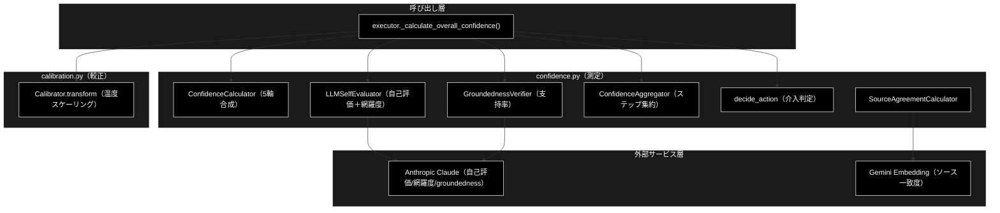
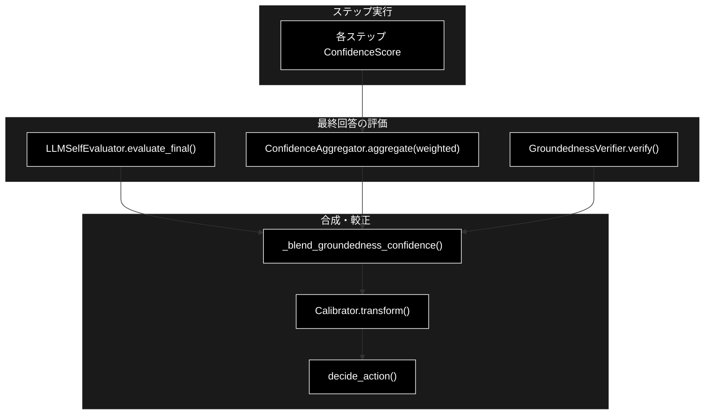

# confidence.py × calibration.py - 信頼度測定と較正 ドキュメント

**Version 1.1** | 最終更新: 2026-07-23

`grace/` のコアである信頼度測定を、`confidence.py`（多軸の信頼度算出・根拠妥当性検証）と
`calibration.py`（温度スケーリングによる事後較正）の 2 モジュールにまたがって整理した資料。
**処理順・処理内容**を一望できるよう、両モジュールと呼び出し元（`executor.py`）の流れを
まとめる。各要素の IPO 詳細は既存の個別ドキュメント（`grace/docs/confidence.md` /
`grace/docs/calibration.md`）に委ね、本書はアーキテクチャ＋データフロー＋要点に徹する。

技術スタック: LLM = Anthropic Claude（既定 `claude-sonnet-4-6`／評価は軽量
`claude-haiku-4-5-20251001`）、Embedding = Gemini（`gemini-embedding-001`）。

---

## 目次

1. [概要](#概要)
2. [全体アーキテクチャ](#1-全体アーキテクチャ)
3. [信頼度測定の処理順（executor 起点）](#2-信頼度測定の処理順executor-起点)
4. [confidence.py の構成要素](#3-confidencepy-の構成要素)
5. [calibration.py の構成要素](#4-calibrationpy-の構成要素)
6. [設定・しきい値](#5-設定しきい値)
7. [データフロー図](#6-データフロー図)
8. [使用例](#7-使用例)
9. [関連ドキュメント](#8-関連ドキュメント)
10. [変更履歴](#9-変更履歴)

---

## 概要

GRACE の信頼度測定は「**多軸の統計＋LLM 自己評価で素点を作り（confidence）→ 根拠妥当性
（groundedness）を主成分にブレンドし → 温度スケーリングで較正（calibration）→ 単一の
`overall_confidence` に落として介入レベルを決める**」という段階構成になっている。

- **`confidence.py`**: 信頼度の「測定」。検索品質・ソース一致度・LLM 自己評価・ツール成功率・
  クエリ網羅度の 5 軸を合成する `ConfidenceCalculator`、最終回答の各主張が引用ソースに支持
  されるかを LLM 判定する `GroundednessVerifier`（S1 の中核）、複数ステップの集約
  `ConfidenceAggregator`、介入レベル判定 `decide_action` などを提供する。
- **`calibration.py`**: 信頼度の「較正」。自己申告 confidence と実正解率のズレ（ECE）を
  温度スケーリング `p' = sigmoid(logit(p)/T)` で縮小する。`T` は (confidence, 正誤) の
  二値 NLL 最小化で推定し、`config/calibration.json` に保存／読込する。

### 主な責務

- 検索品質・ソース一致度・LLM 自己評価・ツール成功率・クエリ網羅度の 5 軸合成（`ConfidenceCalculator`）
- 最終回答の根拠妥当性（支持率 support_rate）の LLM 検証（`GroundednessVerifier`）
- 複数ソース間の意味的一致度（`SourceAgreementCalculator`・Gemini Embedding）
- 複数ステップ信頼度の集約（`ConfidenceAggregator`）と介入レベル決定（`decide_action`）
- confidence の事後較正（温度スケーリング）と較正パラメータの永続化（`calibration.py`）

### 各責務対応のモジュール

| # | 責務 | 対応モジュール | 説明 |
|---|------|--------------|------|
| 1 | 5 軸信頼度の合成 | `grace/confidence.py`（`ConfidenceCalculator`） | 検索品質＋ツール＋ソース一致＋自己評価＋網羅度 |
| 2 | 根拠妥当性検証 | `grace/confidence.py`（`GroundednessVerifier`） | 各主張の supported/contradicted/neutral を LLM 判定 |
| 3 | ステップ集約・介入判定 | `grace/confidence.py`（`ConfidenceAggregator` / `decide_action`） | weighted 集約 → SILENT/NOTIFY/CONFIRM/ESCALATE |
| 4 | 事後較正 | `grace/calibration.py`（`Calibrator`） | 温度スケーリング・ECE 縮小・JSON 永続化 |
| 5 | 全体合成の統括 | `grace/executor.py`（`_calculate_overall_confidence` / `_blend_groundedness_confidence`） | groundedness ブレンド → 較正の順に適用 |

### 主要機能一覧

| 機能 | 説明 |
|------|------|
| `ConfidenceFactors` / `ConfidenceScore` | 信頼度の入力要素／出力（score・breakdown・penalties・level） |
| `ConfidenceCalculator.calculate()` | 5 軸から素点を合成（検索ステップ/非検索で分岐） |
| `ConfidenceCalculator.decide_action()` | しきい値で `InterventionLevel` を決定 |
| `LLMSelfEvaluator.evaluate_final()` | 自己評価＋網羅度を 1 回の LLM 呼び出しで取得 |
| `GroundednessVerifier.verify()` | 支持率・矛盾有無・検証可否を返す（S1 中核） |
| `SourceAgreementCalculator.calculate()` | 複数回答の意味的一致度（Gemini Embedding） |
| `ConfidenceAggregator.aggregate()` | mean / min / weighted でステップ集約 |
| `Calibrator.transform()` / `fit()` / `save()` / `load()` | 温度較正の適用・推定・永続化 |
| `fit_temperature()` / `expected_calibration_error()` | NLL 最小の T 推定・ECE 算出 |

---

## 1. 全体アーキテクチャ



---

## 2. 信頼度測定の処理順（executor 起点）

`grace/executor.py::_calculate_overall_confidence(state)` が全体の統括点。以下の順で
`confidence.py` の各要素と `calibration.py` を呼び出す。

| 順 | 処理 | 実装 | 内容 |
|:--:|------|------|------|
| 0 | 較正器ロード（起動時 1 回） | `Calibrator.load(calibration_path)` | `config/calibration.json` が無ければ恒等（T=1.0） |
| 1 | ステップ信頼度収集 | `ConfidenceCalculator.calculate()` | 各ステップの `ConfidenceScore`（検索品質・ツール等） |
| 2 | 最終回答の特定 | executor | 最後の `reasoning`/`run_legacy_agent` の成功出力 |
| 3 | 明確化(ask_user)判定 | executor | 最終回答なし＋`ask_user` あり → 低信頼固定（`clarification_confidence`=0.3） |
| 4 | 最終回答の自己評価＋網羅度 | `LLMSelfEvaluator.evaluate_final()` | 1 回の LLM 呼び出しで `self_eval_score` / `coverage_score` |
| 5 | 補助スコア集約 | `ConfidenceAggregator.aggregate(method="weighted")` | 検索ステップ等を含む「補助」集約値 |
| 6 | groundedness ブレンド | `_blend_groundedness_confidence()` → `GroundednessVerifier.verify()` | 支持率を主成分に合成（下記） |
| 7 | 較正適用 | `Calibrator.transform()` | 温度スケーリング（T≠1 のときログ出力） |
| 8 | 介入レベル決定 | `decide_action()` | しきい値で SILENT/NOTIFY/CONFIRM/ESCALATE |

### 手順 6 の合成ロジック（`_blend_groundedness_confidence`）

```
support_rate = supported / (supported + contradicted)   # neutral は分母外（判定不能）
decided      = supported + contradicted
```

- **検証成立（verified かつ decided>0）**:
  `answer_conf = weighted( support_rate×0.6, self_eval×0.25, coverage×0.15 )`
  さらに `contradiction` があれば `answer_conf = min(answer_conf, 0.3)`（過信検出で強く減点）。
  最終 `= (1 - 0.2)×answer_conf + 0.2×aggregated`（検索ベース集約は補助 0.2）。
- **未検証 or 判定不能（ソース無し／LLM 失敗／decided=0）**:
  従来ブレンド `weighted( self_eval×0.5, coverage×0.3, aggregated×0.2 )` へフォールバック。
  ソース皆無なら `×0.85`（過信抑制）。support_rate=0 を罰点に使わない
  （全クエリが不当に CONFIRM/ESCALATE に落ちるのを防ぐ）。

### 手順 8 の介入レベル（`decide_action` / `ConfidenceThresholds`）

| 条件 | InterventionLevel | 意味 |
|------|-------------------|------|
| `score ≥ 0.9`（silent） | `SILENT` | 自動進行 |
| `score ≥ 0.7`（notify） | `NOTIFY` | ステータス表示しつつ進行 |
| `score ≥ 0.4`（confirm） | `CONFIRM` | ユーザー確認を推奨 |
| それ未満 | `ESCALATE` | 追加情報要求（ユーザー入力） |

---

## 3. confidence.py の構成要素

> IPO 詳細は `grace/docs/confidence.md` を参照。ここでは処理内容の要点のみ。

### 3.1 データモデル

| 要素 | 種別 | 要点 |
|------|------|------|
| `ConfidenceFactors` | dataclass | 5 軸の入力（検索件数/スコア・source_agreement・llm_self_confidence・groundedness・tool_success_rate・query_coverage・is_search_step 等） |
| `ConfidenceScore` | dataclass | `score`／`breakdown`／`penalties_applied`／`reason`。`level` プロパティは high(≥0.9)/medium(≥0.7)/low(≥0.4)/very_low |
| `InterventionLevel` | Enum | SILENT / NOTIFY / CONFIRM / ESCALATE |
| `ActionDecision` | dataclass | `level`・`confidence_score`・`should_proceed`/`needs_confirmation`/`needs_user_input` |

### 3.2 ConfidenceCalculator（5 軸合成）

- **検索ステップ（is_search_step）**: 素点＝検索品質。ツール成功率が 1.0 未満なら乗算で減点。
- **非検索ステップ**: 有効な軸だけを内蔵重みで加重平均
  （検索品質 0.6・ツール成功 0.4・source_agreement 0.2〈source_count>1 時〉・
  llm_self_eval 0.3〈>0.6 時〉・query_coverage 0.1〈>0.1 時〉）を有効重み合計で正規化。
- **`_apply_penalties`**: 検索0件（×0.5）・ツール失敗（×(0.8+0.2×成功率)）・ソース0件（×0.7、
  検索ヒットあり/自己評価≥0.8 は免除）。
- `_calc_search_quality`: max≥0.6 はそのまま採用、未満は `max×0.7+avg×0.3−分散罰(≤0.15)`。
- `llm_calculate`: 軽量モデル（`light_model`）で `evaluate_with_factors` を用いた LLM 版素点。
  検索ステップで `search_max_score>0.7` は LLM が下げ過ぎないよう検索スコアを優先。

> 📝 **注意**: `ConfidenceCalculator._validate_weights()` は `config.confidence.weights`
> （合計 1.0）を検証するが、`calculate()` 本体は上記の**内蔵重み**で合成する。config の
> weights は将来拡張・検証用の位置づけ。

### 3.3 LLMSelfEvaluator（自己評価）

| メソッド | 出力 | LLM 呼び出し |
|---------|------|:--:|
| `evaluate()` | 確信度 float（0-1） | 1 回（数値のみ） |
| `evaluate_final()` | `FinalEvaluationResult`（self_eval＋coverage＋reason） | 1 回（JSON・旧2回を統合） |
| `evaluate_with_factors()` | `{score, reason}` | 1 回（Factors 要約） |

失敗時は 0.5 or `search_max_score` にフォールバック。温度 0.0、`max_output_tokens` は
512〜1024（thinking 系で本文が空になるのを防ぐ）。

### 3.4 GroundednessVerifier（S1 中核・支持率）

- 各主張を supported / contradicted / neutral に LLM 判定（自前知識禁止・情報源のみ根拠）。
  FAQ/Q&A 形式の A 部分も通常本文として根拠に扱う。
- `GroundednessResult`: `support_rate`（supported/decided）・`supported`・`contradicted`・
  `total`・`has_contradiction`・`verified`。
- ソース無し／空回答／LLM 失敗は `verified=False`（未検証）で返し、評価を止めない。

### 3.5 その他

- **`SourceAgreementCalculator`**: 複数回答を Gemini Embedding 化し、ペア間コサイン類似度の
  平均で一致度を算出（2 件未満は 1.0、失敗時 0.5）。
- **`ConfidenceAggregator`**: `mean`/`min`/`weighted`（後段ほど重い）で集約。
  `aggregate_with_critical_check` は 1 つでも critical 未満（<0.3）なら ×0.7。
- **ファクトリ**: `create_confidence_calculator` / `create_llm_evaluator` /
  `create_source_agreement_calculator` / `create_query_coverage_calculator` /
  `create_confidence_aggregator` / `create_groundedness_verifier`。

---

## 4. calibration.py の構成要素

> IPO 詳細は `grace/docs/calibration.md` を参照。

温度スケーリング `p' = sigmoid(logit(p)/T)`。T>1 は自信過剰を緩和、T<1 は自信不足を補正、
T=1 は恒等。

| 関数/クラス | 役割 |
|------------|------|
| `apply_temperature(p, T)` | confidence に温度 T を適用（T≤0 は 1.0 扱い） |
| `fit_temperature(confidences, correctness)` | 二値 NLL 最小の T を 1 次元 2 段探索（粗→細）で推定。退化（全問正/全問誤/0件）は T=1.0 |
| `expected_calibration_error(...)` | 等幅ビン ECE（`eval/metrics.py` と整合） |
| `Calibrator` | `temperature` を保持。`transform`/`is_identity`/`save`/`load`/`fit`。`load` は不在時 T=1.0 |

- **推定→保存**: `Calibrator.fit(confidences, correctness).save(path)` で `config/calibration.json`
  へ `{"method":"temperature_scaling","temperature":T}` を書き出す。
- **実行時適用**: executor が起動時に `Calibrator.load()` し、手順 7 で `transform()` を適用。
- scipy 非依存（純 Python の 1 次元探索）でユニットテスト可能。

---

## 5. 設定・しきい値

`config.ConfidenceConfig`（既定値）:

| キー | 既定 | 用途 |
|-----|------|------|
| `thresholds.silent / notify / confirm` | 0.9 / 0.7 / 0.4 | 介入レベル境界 |
| `weights.*` | search 0.25 / source 0.20 / self 0.25 / tool 0.15 / coverage 0.15 | 検証用（合計 1.0） |
| `groundedness_enabled` | True | groundedness ブレンドの有効化 |
| `groundedness_weight / self_eval_weight / coverage_weight` | 0.6 / 0.25 / 0.15 | 検証成立時の answer_conf 重み |
| `search_aux_weight` | 0.2 | 検索ベース集約（補助）の重み |
| `clarification_confidence` | 0.3 | ask_user 計画時の低信頼固定値 |
| `calibration_path` | `config/calibration.json` | 較正パラメータ保存先 |

モデル: `config.llm.model`（既定 `claude-sonnet-4-6`）／評価は `config.llm.light_model`
（`claude-haiku-4-5-20251001`）／`config.embedding.model`（`gemini-embedding-001`）。

---

## 6. データフロー図



---

## 7. 使用例

### 7.1 根拠妥当性を主成分にした信頼度（測定＋較正の最小例）

```python
from grace.confidence import create_groundedness_verifier
from grace.calibration import Calibrator

verifier = create_groundedness_verifier(config)
gres = verifier.verify(query, answer, sources)   # support_rate / has_contradiction / verified

# executor 相当の合成（簡略）
answer_conf = 0.6 * gres.support_rate + 0.25 * self_eval + 0.15 * coverage
if gres.has_contradiction:
    answer_conf = min(answer_conf, 0.3)
overall = 0.8 * answer_conf + 0.2 * aggregated

# 較正（config/calibration.json の T を適用）
calibrated = Calibrator.load("config/calibration.json").transform(overall)
```

### 7.2 較正パラメータの推定と保存（オフライン）

```python
from grace.calibration import Calibrator, expected_calibration_error

# (confidence, 正誤) の評価ログから温度 T を推定
calib = Calibrator.fit(confidences, correctness)
print("ECE before:", expected_calibration_error(confidences, correctness))
calib.save("config/calibration.json")   # 実行時に executor が load して適用
```

---

## 8. 関連ドキュメント

| ドキュメント | 内容 |
|---|---|
| `grace/docs/confidence.md` | `confidence.py` の IPO 詳細（各クラス/関数） |
| `grace/docs/calibration.md` | `calibration.py` の IPO 詳細 |
| `grace/docs/executor.md` | `_calculate_overall_confidence` を含む実行エンジン |
| `backend/docs/confidence_flow_grace_vs_backend.md` | grace/ と backend/app/ の信頼度判定フロー比較 |

---

## 9. 変更履歴

| バージョン | 変更内容 |
|-----------|---------|
| 1.0 | 初版作成（confidence.py × calibration.py の処理順・処理内容を横断的にまとめたサマリ） |
| 1.1 | grace_v2 実コードに突き合わせて検証（ブレンド重み 0.6/0.25/0.15・補助 0.2・矛盾時 min(・,0.3)・しきい値 0.9/0.7/0.4 が実装と一致することを確認）。関連ドキュメント参照パスを `grace/doc/` → `grace/docs/` に訂正 |
