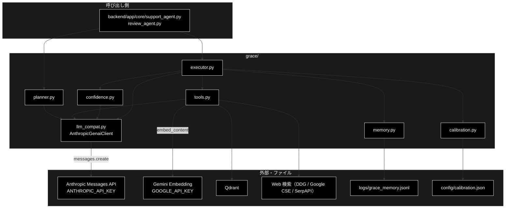
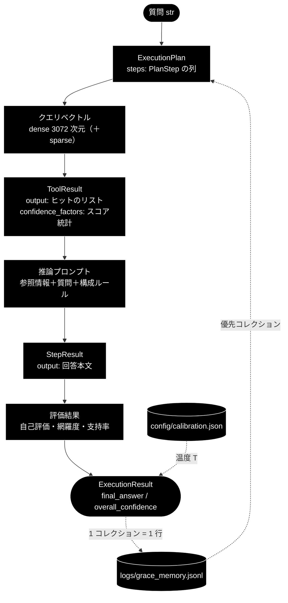

# grace_data_flow.md - grace/ データフロー

**Version 4.0** | 最終更新: 2026-10-10

GRACE を 1 クエリ動かしたときに、**どんなデータがどこからどこへ渡り、どこに残るか**をまとめる。
外部 API（Anthropic・Gemini Embedding・Qdrant・Web）に渡るもの、プロンプトの所在、
実行メモリ（`logs/grace_memory.jsonl`）と較正ファイル（`config/calibration.json`）の形式を扱う。
処理の順番と分岐は [`grace_process_flow.md`](./grace_process_flow.md)、ディレクトリ全体の入口は [`README_grace.md`](./README_grace.md)。

---

## 目次

- [概要](#概要)
- [1. データの流れ全体](#1-データの流れ全体)
- [2. データ項目と形式](#2-データ項目と形式)
- [3. 変換の詳細](#3-変換の詳細)
  - [3.1 外部 API の発行部](#31-外部-api-の発行部)
  - [3.2 既定の質問で発行される API の順番](#32-既定の質問で発行される-api-の順番)
  - [3.3 実行メモリの蓄積と読み戻し](#33-実行メモリの蓄積と読み戻し)
  - [3.4 プロンプトの所在](#34-プロンプトの所在)
- [4. 保存先・命名・上書き](#4-保存先命名上書き)
- [5. 関連ドキュメント](#5-関連ドキュメント)
- [6. 変更履歴](#6-変更履歴)

---

## 概要

grace の LLM 呼び出しは、すべて genai 形式の `client.models.generate_content(...)` で書かれており、
`grace/llm_compat.py` が Anthropic の `messages.create(...)` へ変換して発行する。検索の Embedding だけは Gemini を使う。
grace がディスクへ書くのは実行メモリ（追記）と、オフラインで作る較正ファイル（上書き）の 2 つだけである。

### 主な責務

- 計画・推論・評価のプロンプトを組み立て、Anthropic Claude へ送る
- 検索クエリを Gemini Embedding でベクトル化し、Qdrant を検索する
- ツールの結果を `ToolResult` → `StepResult` → `ExecutionResult` の形へまとめる
- 実行の実績を JSONL に追記し、次の計画で読み戻す
- 較正パラメータを JSON に保存し、起動時に読む

### 各責務対応のモジュール

| # | 責務 | 対応モジュール | 説明 |
|---|------|--------------|------|
| 1 | LLM 呼び出しの変換と発行 | `grace/llm_compat.py` | `_AnthropicModels.generate_content` → `anthropic.Anthropic().messages.create(**kwargs)` |
| 2 | ベクトル化と検索 | `grace/tools.py` / `qdrant_client_wrapper.py` | `RAGSearchTool._embed_query_once` → `embed_query`（Gemini `embed_content`）→ Qdrant |
| 3 | 結果の型 | `grace/schemas.py` / `grace/tools.py` | `ToolResult`（ツール）→ `StepResult` / `ExecutionResult`（Pydantic） |
| 4 | 実行メモリ | `grace/memory.py` | `ExecutionMemory.record_many`（書く）/ `best_collection`（読む） |
| 5 | 較正ファイル | `grace/calibration.py` | `Calibrator.save` / `Calibrator.load` |

### アーキテクチャ構成図



**データフロー**:

1. 質問（`str`）が `ExecutionPlan`（JSON 互換の Pydantic）になる。LLM で計画するときは JSON Schema 付きで Anthropic へ送る
2. `rag_search` はクエリを 1 回だけベクトル化し、コレクションを順に検索して `ToolResult.output`（ヒットのリスト）と `confidence_factors`（スコアの統計）を返す
3. 推論・評価のプロンプトが Anthropic へ送られ、`StepResult` と `ExecutionResult` にまとまる
4. 使ったコレクションと成否が JSONL に 1 行ずつ追記され、次の計画で読み戻される

---

## 1. データの流れ全体



---

## 2. データ項目と形式

| データ | 形式（主な項目） | 作る側 | 使う側 | 置き場所 |
|---|---|---|---|---|
| `ExecutionPlan` | Pydantic。`original_query` / `complexity` / `estimated_steps` / `requires_confirmation` / `steps` / `success_criteria` / `created_at` / `plan_id` | `planner.py` | `executor.py` / `replan.py` | メモリ上 |
| `PlanStep` | `step_id` / `action`（`rag_search` / `web_search` / `reasoning` / `ask_user` / `code_execute`）/ `description` / `query` / `collection` / `depends_on` / `expected_output` / `dynamic` / `fallback` / `timeout_seconds` | `planner.py`（動的挿入は `executor.py`） | `executor.py` | メモリ上 |
| `ToolResult` | dataclass。`success` / `output` / `confidence_factors` / `error` / `execution_time_ms` | `tools.py` の各ツール | `executor.py` | メモリ上 |
| `rag_search` の `output` | リスト。1 件 = `{"score": float, "collection": str, "payload": {"question", "answer", "source", ...}}` | `RAGSearchTool` | `executor.py`・`ReasoningTool`・GRACE-Review の ② | メモリ上 |
| `rag_search` の `confidence_factors` | 辞書。`result_count` / `avg_score` / `max_score` / `min_score` / `score_variance`（正準キー）と旧キー `top_score` / `score_spread`、使ったコレクション `used_collection` | `RAGSearchTool` | `executor._build_confidence_factors`・実行メモリ | メモリ上 |
| `StepResult` | Pydantic。`step_id` / `status`（`success` / `failed`）/ `output` / `confidence` / `sources`（表示用の識別子）/ `source_texts`（根拠検証用の本文）/ `error` / `execution_time_ms` / `token_usage` / `created_at` | `executor._execute_step` | `executor.py`・呼び出し側 | メモリ上 |
| `ConfidenceScore` | dataclass。`score` / `factors`（`ConfidenceFactors`）/ `breakdown` / `penalties_applied` / `reason` | `confidence.py` | `executor.py`（`step_confidence_scores`） | メモリ上 |
| `GroundednessResult` | dataclass。`support_rate` / `supported` / `contradicted` / `total` / `has_contradiction` / `verified` / `reason` / `claims`（主張ごとの判定） | `GroundednessVerifier.verify` | `executor.py`・GRACE-Support ③・GRACE-Review ④ | メモリ上（同じ入力の結果は 4 件までキャッシュ） |
| `ExecutionResult` | Pydantic。`plan_id` / `original_query` / `final_answer` / `step_results` / `overall_confidence` / `overall_status` / `replan_count` / `total_execution_time_ms` / `total_token_usage` / `total_cost_usd` / `rag_max_score` / `rag_search_count` / `web_search_used` / `created_at` | `executor._create_execution_result` | 呼び出し側 | メモリ上 |
| 実行メモリの 1 行 | JSON。`{"query", "keywords", "collection", "success", "confidence", "timestamp"}` | `ExecutionMemory.record` | `ExecutionMemory.collection_priors` / `best_collection` | `logs/grace_memory.jsonl`（`memory.path`） |
| 較正ファイル | JSON。`{"method": "temperature_scaling", "temperature": T}` | `Calibrator.save` | `Calibrator.load`（executor の起動時） | `config/calibration.json`（`confidence.calibration_path`） |
| LLM への要求 | `messages.create` の引数。`model` / `max_tokens` / `messages=[{"role": "user", "content": プロンプト}]` / `system`（JSON を求めるときだけ）/ `thinking` または `output_config` / `temperature`（送れるモデルだけ） | `llm_compat.py` | Anthropic | — |

---

## 3. 変換の詳細

### 3.1 外部 API の発行部

| API | プロバイダ | 発行場所（実コード） | 渡すもの | 鍵 |
|---|---|---|---|---|
| LLM テキスト生成 | Anthropic Claude | `grace/llm_compat.py::_AnthropicModels.generate_content` → `messages.create(**kwargs)` | プロンプト 1 本（user メッセージ）と、JSON を求めるときのシステム指示 | `ANTHROPIC_API_KEY` |
| Embedding | Gemini `gemini-embedding-001`（3072 次元） | `qdrant_client_wrapper.py::embed_query` → `helper/helper_embedding.py` の `embed_content` | 検索クエリの文字列 | `GOOGLE_API_KEY` |
| ベクトル検索 | Qdrant（DB） | `agent_tools.py` / `qdrant_client_wrapper.py` 経由 | クエリベクトル（dense ＋ 取れれば sparse）・コレクション名 | — |
| Web 検索 | DDG / Google CSE / SerpAPI | `grace/tools.py::WebSearchTool` | 検索クエリ | 選んだ backend による |

`generate_content(model, contents, config)` から `messages.create` の引数への変換（`grace/llm_compat.py`）:

| genai 側（`config` のキー） | Anthropic 側 | 変換の規則 |
|---|---|---|
| `contents` | `messages=[{"role": "user", "content": ...}]` | 文字列でなければ `str()` |
| `response_mime_type="application/json"` / `response_schema` | `system` | 「厳密な JSON ジェネレーター」の指示と、`response_schema` の JSON Schema を付ける。返答は `_strip_to_json` でコードフェンスや前後の文を落とす |
| `max_output_tokens` | `max_tokens` | 未指定は 2048 |
| `thinking_budget_tokens` | `thinking` | 指定があるときだけ思考を有効にする（`adaptive` か `enabled`＋`budget_tokens`。モデル世代による）。無いときは `{"type": "disabled"}`。思考を無効化できないモデル（既定の `claude-sonnet-5-5`）は `thinking` を送らず `output_config={"effort": "low"}`、`max_tokens` を 4096 以上にする |
| `temperature` | `temperature` | 思考が無効で、かつ温度を受け付けるモデルのときだけ送る |
| — | 停止理由の確認 | `stop_reason="refusal"` は `LLMRefusalError`。JSON を求めた呼び出しが `max_tokens` で切れたら上限を倍にして 1 回だけ再試行し、だめなら `LLMTruncatedError` |

> 📝 モデル世代ごとの送り方（温度・思考の可否）は `config.py::ModelConfig` の 3 つの表で決まる。詳細は [`llm_compat.md`](./llm_compat.md)。

`rag_search` は**クエリを 1 回だけベクトル化**して（`RAGSearchTool._embed_query_once`）、許可されたコレクションを順に検索する
（コレクションが 2 つ以上のとき。1 つなら下位が都度ベクトル化する）。一次しきい値に届くコレクションがあればそこで採用し、
無ければいちばんスコアの高いコレクションを保留して、`executor.reasoning_min_rag_score`（0.64）以上なら採用する。
それも下回れば 0 件で返し、Web 検索へ委ねる。

### 3.2 既定の質問で発行される API の順番

「住民票の写しの取り方は？」（ルールベースで `rag_search → reasoning` の 2 ステップになる典型例）を、
Anthropic と `rag_search` をスタブにして 1 回実行し、`messages.create` の呼び出しを記録した（2026-10-10）。

| 順 | 段 | 発行 API | モデル | 用途（プロンプトの所在は §3.4） |
|:--:|---|---|---|---|
| 1 | ① Plan | （発行なし） | — | ルールベースの計画。LLM は使わない |
| 2 | ② `rag_search` | Gemini `embed_content` → Qdrant | `gemini-embedding-001` | クエリのベクトル化と検索（今回の記録ではスタブ） |
| 3 | ② `rag_search` の信頼度 | Anthropic（JSON） | `claude-haiku-5-5` | ステップ信頼度（`LLMSelfEvaluator.evaluate_with_factors`） |
| 4 | ② RAG の適合性 | Anthropic（テキスト） | `claude-haiku-5-5` | 検索結果が質問に答える根拠として使えるか（`Executor._evaluate_rag_relevance`。スコアが 0.64 以上のときだけ） |
| 5 | ② `reasoning` | Anthropic（テキスト） | `claude-sonnet-5-5` | 回答の生成（`ReasoningTool`） |
| 6 | ③ 最終評価 | Anthropic（JSON） | `claude-sonnet-5-5` | 自己評価＋網羅度（`LLMSelfEvaluator.evaluate_final`）。5 の直後に先行実行 |
| 7 | ③ 根拠検証 | Anthropic（JSON） | `claude-sonnet-5-5` | 主張ごとの supported / contradicted / neutral（`GroundednessVerifier.verify`）。5 の直後に先行実行 |
| 8 | ② `reasoning` の信頼度 | Anthropic（JSON） | `claude-haiku-5-5` | ステップ信頼度（3 と同じ） |

> 📝 6・7 は回答ができた時点で別スレッドで始まり、8 と重なる（`Executor._prefetch_final_evaluation`）。記録の順番は前後しうる。
> RAG のスコアが 0.64 未満なら 4 の代わりに Web 検索が入り（`WebSearchTool`）、その信頼度の評価が 1 回増える。
> 複雑な質問・Web 検索の指示がある質問では、1 の代わりに計画生成（`claude-sonnet-5-5`・JSON）が 1 回発行される。
> GRACE-Support は、このあと ④' 情報なし判定などの判定系（`backend/app/core/gates.py`）を軽量モデルで呼ぶ（grace の外）。

### 3.3 実行メモリの蓄積と読み戻し

**executor が書き、planner が読む**一方通行の学習ループ。旧 `grace_core.md` §4 を実装と突き合わせて移した。

**書く（`executor.py::Executor._record_memory`）**

| # | 条件 | 動き |
|:--:|---|---|
| 1 | メモリが無効（`memory.enabled=false`） | 記録しない |
| 2 | 使った RAG コレクションが無い（Web 検索だけ・ask_user だけ） | 記録しない（RAG を使っていないので学習の対象外） |
| 3 | それ以外 | 計画どおりのステップ（**動的に挿入したステップは除く**）がすべて `success` で、かつ最終回答があれば `success=true`。**失敗も `success=false` として記録する** |

使ったコレクションは、`rag_search` が成功するたびに `ToolResult.confidence_factors["used_collection"]` から
`ExecutionState.used_collections` に重複なく追記される。`ExecutionMemory.record_many` はコレクションごとに 1 行ずつ JSONL へ追記する
（書き込みは best-effort。失敗しても警告だけで実行は止めない）。

> ⚠️ **3 で動的なステップを除く理由（回帰修正）。** RAG のスコアが足りないと `web_search` / `ask_user` が動的に挿入される。
> 以前は全ステップを集計していたため、**Web 検索が落ちただけで `success=false`** になり、正しく答えられた RAG コレクションに
> 「失敗」が刻まれて planner の優先順位を毒していた（実測 2026-08-29）。除外するのは `state.dynamic_steps`（実際に挿入して実行した id）と
> `PlanStep.dynamic`（ステップ側の印）の**両方**を足したもの（片方だけでは漏れる）。

**キーワードの抽出（`memory.py::extract_keywords`）**: 英数字 2 文字以上の連続、または漢字・かな・カナ 2 文字以上の連続を拾う。
形態素解析はしないので、日本語は区切り（空白・記号・英数）までが丸ごと 1 語になる。

```python
extract_keywords("Python の歴史を教えて")
# → ['python', 'の歴史を教えて']
```

格納される 1 行の例:

```json
{"query": "Python の歴史を教えて", "keywords": ["python", "の歴史を教えて"], "collection": "wikipedia_ja", "success": true, "confidence": 0.85, "timestamp": 1750000000.0}
```

**読む（`planner.py::Planner._prioritized_collection` → `memory.py::ExecutionMemory.best_collection`）**

| 段 | 場合分け | 結果 |
|---|---|---|
| planner | メモリが無効 | `None`（全コレクションを検索） |
| `collection_priors` | 質問のキーワードと 1 つでも一致する過去の行がある | その行だけで集計する |
| `collection_priors` | 一致する行が 0 件 | **全部の行で集計する**（全体の傾向で代用） |
| `best_collection` | 件数 ≥ `memory.min_count`（3）かつ スコア ≥ `memory.min_score`（0.6） | そのコレクション名（計画の `rag_search` がそのコレクションに絞られる） |
| `best_collection` | それ以外・除外対象のコレクション | `None`（`qdrant.excluded_collections` に当たるものは返さない） |

スコアは `(成功数 + 1) / (件数 + 2) × 平均信頼度`（Laplace 平滑化）。「API の◯◯」を 3 回聞いて 3 回とも `saas_api_anthropic` が当たり、
信頼度が 0.85 / 0.88 / 0.80 だったとき、4 回目の質問「API のエラーコード一覧」では
`count=3`・スコア `(3+1)/(3+2) × 0.843 ≈ 0.675` で条件を満たし、`saas_api_anthropic` に絞って検索する（3 回目までは件数不足で全検索）。

> ⚠️ **`qdrant.excluded_collections` に当たるコレクションは、実績があっても選ばれない**（既定で `wikipedia` / `cc_news` / `fineweb` /
> `livedoor` / `japanese_text` を部分一致で除外）。除外対象が首位なら次点を採る（`best_collection(exclude=...)`）。

### 3.4 プロンプトの所在

プロンプトの**全文は各モジュールの文書**に置く（同じ文を 2 か所に持たない）。ここには所在と、どの呼び出しで使うかだけを書く。

| プロンプト | 定義（ファイル::シンボル） | 使う呼び出し | 全文の所在 |
|---|---|---|---|
| 計画生成 | `planner.py::PLAN_GENERATION_PROMPT`（`Planner._build_plan_prompt` が利用可能なコレクション・リプランの補足・JSON の念押しを足す） | LLM 計画（複雑な質問） | [`planner.md`](./planner.md) |
| 複雑度推定 | `planner.py::COMPLEXITY_ESTIMATION_PROMPT` | LLM で複雑度を推定する経路 | [`planner.md`](./planner.md) |
| 推論（回答の生成） | `tools.py::ReasoningTool._build_prompt` | `reasoning` ステップ | [`tools.md`](./tools.md) |
| 自己評価＋網羅度 | `confidence.py::LLMSelfEvaluator.FINAL_EVAL_PROMPT` | 最終評価（`evaluate_final`） | [`confidence.md`](./confidence.md) |
| 確信度（単独） | `confidence.py::LLMSelfEvaluator.EVAL_PROMPT` | `evaluate()` | [`confidence.md`](./confidence.md) |
| ステップ信頼度 | `confidence.py::LLMSelfEvaluator.evaluate_with_factors` | 各ステップの信頼度（`llm_calculate`） | [`confidence.md`](./confidence.md) |
| 網羅度（単独） | `confidence.py::QueryCoverageCalculator.COVERAGE_PROMPT` | `QueryCoverageCalculator.calculate()` | [`confidence.md`](./confidence.md) |
| 根拠検証 | `confidence.py::GroundednessVerifier.PROMPT` | 根拠検証（`verify`） | [`confidence.md`](./confidence.md) |
| RAG の適合性 | `executor.py::Executor._evaluate_rag_relevance` | RAG のスコアが十分なときの判定 | [`executor.md`](./executor.md) |
| ReAct の次の 1 手 | `executor.py::Executor.REACT_PROMPT` | ReAct ループ（`_decide_next_action`） | [`executor.md`](./executor.md) |
| JSON を求めるときのシステム指示 | `llm_compat.py::_AnthropicModels.generate_content` | JSON を求める全呼び出し | [`llm_compat.md`](./llm_compat.md) |

---

## 4. 保存先・命名・上書き

| データ | 保存先（設定キー） | 書き方 | 消すとどうなるか |
|---|---|---|---|
| 実行メモリ | `logs/grace_memory.jsonl`（`memory.path`） | **追記**（1 実行 × 使ったコレクション数の行）。ディレクトリが無ければ作る | 学習した優先順位が消え、全コレクションの検索に戻るだけ |
| 較正ファイル | `config/calibration.json`（`confidence.calibration_path`） | `Calibrator.save` で**上書き**。executor は起動時（`Executor.__init__`）に読む | 恒等変換（T=1.0）に戻る |
| Qdrant のコレクション | Qdrant（`qdrant.url`） | grace は**読むだけ**（登録は `qa_qdrant/`） | — |

> ⚠️ 実行メモリはプロセスをまたいで効く。誤って採用されたコレクションが `success` として記録されると、以後の計画がそこへ絞られる
> （`planner._prioritized_collection` が `qdrant.excluded_collections` を見て除外するのはこのため）。おかしな絞り込みが続くときは
> `logs/grace_memory.jsonl` の該当行を確認する。

---

## 5. 関連ドキュメント

| 文書 | 内容 |
|---|---|
| [`README_grace.md`](./README_grace.md) | grace/ の概要・モジュール索引・使い方 |
| [`grace_process_flow.md`](./grace_process_flow.md) | 処理の順番・分岐・介入・リプラン |
| [`llm_compat.md`](./llm_compat.md) | LLM 呼び出しの変換の IPO |
| [`memory.md`](./memory.md) / [`calibration.md`](./calibration.md) | 実行メモリ・較正の IPO |
| [`backend/docs/config_and_providers.md`](../../backend/docs/config_and_providers.md) | モデル・プロバイダの方針とモデル名の解決経路 |

---

## 6. 変更履歴

| バージョン | 日付 | 変更内容 |
|---|---|---|
| 1.0 | — | 初版作成（`grace_core_flow.md` として）。参考ドキュメント（`grace_core.md` / `grace.md`）の明示、A: 5 段階設計、B: 8 コアモジュール構成（構成図＋依存テーブル）、C: 役割サマリー、D: 最小実行サンプルの全文・実行フロー・行解説・実行方法、E: 補足説明を整備 |
| 1.1 | — | D の直後に「E. プロンプトと API 発行部」を追加（API 発行部の実コード、利用プロンプト全文＝計画生成／複雑度推定／推論／信頼度評価群、既定クエリの API 発行順フロー図）。旧 E「理解のための補足説明」を F に繰り下げ |
| 2.0 | — | 実装との突き合わせによる訂正。(1) **§D が題材にしていた `agent_example.py` はリポジトリに存在しない**（git 全履歴 0 件）ため、「本書内の解説用コード片」と明示し、実物のエントリポイント（`agent_support_example.py` / `grace/step_trace/s0_arg.py`〜`s9_render.py`）を §D.4 で案内する形へ改めた。(2) §F の `agent_rag.py` / Streamlit（本リポジトリに存在しない）参照を、`execute_plan_generator()` と FastAPI SSE の説明へ差し替え。(3) `grace/doc/`（単数形）リンクを `grace/docs/` へ是正（CLAUDE.md §9.1） |
| 3.0 | 2026-09-14 | **`grace_core_flow.md` から改称し、役割を「実行時に飛ぶ API とプロンプト」へ絞った**（2026-09-14）。旧 §A（5 段階設計）/ §C（役割サマリー）は `grace.md` と、旧 §B（モジュール構成図・依存関係テーブル）/ §D（最小実行サンプル）は `grace_core.md` と**完全重複**していたため（構成図 Mermaid 68 行と依存関係テーブルはバイト単位で一致）、それぞれの正本へ集約して本書からは削除した。旧 §F（補足説明）も `grace.md` 第3部・`grace_core.md` §1.2 の言い換えだったため削除。残した旧 §E を `1.`〜`5.` へ採番し直している。旧 §D.3 の行番号による逐行解説は、**リポジトリに存在しないコード片への行番号**だったため引き継がなかった（行番号参照は腐る。`README.md` §6） |
| 3.1 | 2026-09-24 | `a_cross_doc_md_format.md` v1.2（種別 A）に準拠（2026-09-24）。概要に主な責務・各責務対応のモジュール・アーキテクチャ構成図を追加。本文の章番号は変えていない。現在の既定モデルの記載 `claude-sonnet-4-6` を実装（`grace/config.py` の `LLMConfig.model` = `claude-sonnet-5`）に合わせて是正した（CLAUDE.md §9.3。旧既定は履歴の記述にだけ残す）。Mermaid の `classDef subgraphStyle` の欠落を補った |
| 3.2 | 2026-09-24 | 目次の §4.1 / §4.3 / §4.4 へのリンクが見出しのアンカー（①〜③ を含む）と一致せず切れていたのを修正（2026-09-24） |
| 3.3 | 2026-09-26 | 現在の Embedding の記述を `gemini-embedding-001` から `gemini-embedding-2` へ是正（2026-09-26 に変更。定義は `config.py::ModelConfig.EMBEDDING_MODEL` の 1 箇所） |
| 3.4 | 2026-09-26 | Embedding を `gemini-embedding-001` に戻したのに追随（2026-09-26。同日に一度 `gemini-embedding-2` へ変えたが、既存の Qdrant コレクションと grace_v2_local（同じ Qdrant を共用）をそのまま使うため戻した。定義は `config.py::ModelConfig.EMBEDDING_MODEL`） |
| 3.5 | 2026-10-06 | 現在の既定モデルの記載 `claude-sonnet-5` を実装（`grace/config.py` の `LLMConfig.model` / `grace/llm_compat.py` の `DEFAULT_ANTHROPIC_MODEL` = `claude-sonnet-5-5`）に合わせて是正（2026-10-06。CLAUDE.md §9.3。旧既定は履歴の記述にだけ残す） |
| 3.6 | 2026-10-08 | 軽量モデルを Haiku 4.5（`claude-haiku-4-5` / `claude-haiku-4-5-20251001`）から Claude Haiku 5.5（`claude-haiku-5-5`）へ変更したのに追随（2026-10-08） |
| 4.0 | 2026-10-10 | **`grace_runtime.md` を `grace_data_flow.md` へ改称し、データフローの文書に作り直した**（`a_cross_doc_md_format.md` §1.3）。(1) プロンプトの全文は各モジュールの文書（`planner.md` / `tools.md` / `confidence.md` / `executor.md` / `llm_compat.md`）へ移し、本書は所在だけを持つ（§3.4）。移す前に実装と突き合わせ、旧版が古かったことを確かめた: 推論プロンプトは出典の書き写し・情報源番号を書かない等の規則が増えていた、根拠検証プロンプトは FAQ の扱い・reason の字数が増えていた、計画生成プロンプトは 2026-09-29 から `SEARCH_QUERY_INSTRUCTION` を埋め込んでいない（旧版は埋め込むと書いていた）。(2) §3.2 の API の順番を、スタブで 1 回実行して `messages.create` を記録した実測に置き換えた（旧版はステップ信頼度・RAG の適合性の判定を数えておらず、モデルも書いていなかった）。(3) LLM 呼び出しの変換（§3.1）に、思考の制御・停止理由の確認を足した。(4) 旧 `grace_core.md` §4 の実行メモリの章を §3.3 へ移した。(5) データ項目と形式（§2）・保存先（§4）を新設した |
