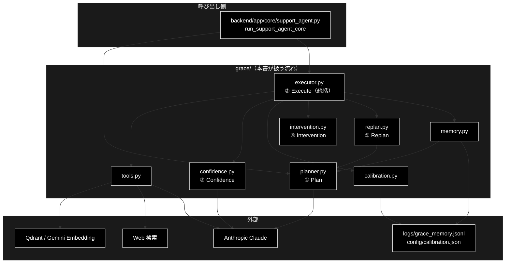
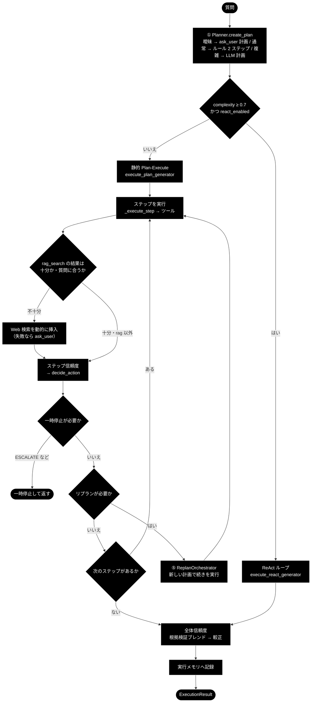
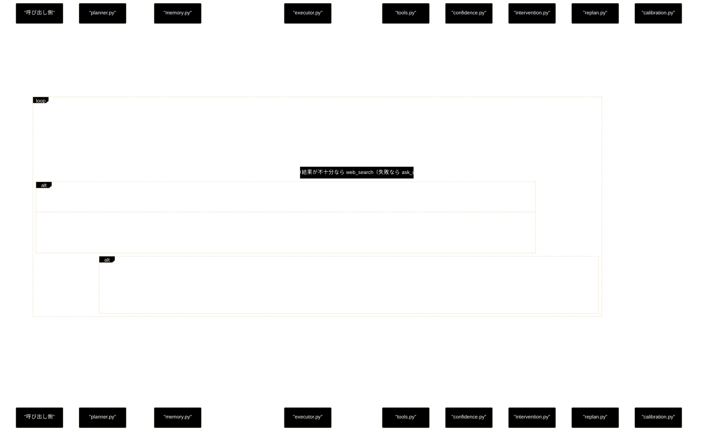

# grace_process_flow.md - grace/ 処理フロー

**Version 4.0** | 最終更新: 2026-10-10

GRACE を 1 クエリ動かしたときの**処理の流れ**（どの順で・どのモジュールが・どんな条件で分岐するか）をまとめる。
各関数の引数・戻り値は各モジュールの文書（IPO）に、外部 API に渡るデータとプロンプトの所在は
[`grace_data_flow.md`](./grace_data_flow.md) に置き、ここには書かない。ディレクトリ全体の入口は [`README_grace.md`](./README_grace.md)。

---

## 目次

- [概要](#概要)
- [1. 全体フロー](#1-全体フロー)
- [2. ステップ詳細](#2-ステップ詳細)
  - [2.1 1 クエリの処理](#21-1-クエリの処理)
  - [2.2 全体信頼度の算出](#22-全体信頼度の算出)
  - [2.3 GRACE-Support / GRACE-Review での使われ方](#23-grace-support--grace-review-での使われ方)
- [3. 分岐・例外・中断](#3-分岐例外中断)
- [4. シーケンス](#4-シーケンス)
- [5. 関連ドキュメント](#5-関連ドキュメント)
- [6. 変更履歴](#6-変更履歴)

---

## 概要

入口は `Planner.create_plan(query)`（① Plan）と `Executor.execute(plan)`（② 〜 ⑤）の 2 つ。
`execute()` の内側で、ステップの実行・動的フォールバック・ステップ信頼度・介入・リプラン・全体信頼度・較正・実行メモリへの記録が回る。

### 主な責務

- 質問から実行計画を作る
- 計画の複雑度で、静的な Plan-Execute と ReAct ループを振り分ける
- 計画のステップを順に実行し、RAG の結果に応じて Web 検索・ask_user を動的に挿入する
- ステップごとに信頼度を測り、介入レベルに応じて一時停止・通知する
- 失敗・低信頼のステップを契機に計画を作り直す
- 最終回答の根拠を検証して全体信頼度を出し、較正する
- 実行の実績を記録して、次回の計画に還元する

### 各責務対応のモジュール

| # | 責務 | 対応モジュール | 説明 |
|---|------|--------------|------|
| 1 | 計画の生成 | `grace/planner.py` | `Planner.create_plan()`。`memory.py` の優先コレクションを反映する |
| 2 | 静的パス／ReAct の振り分け | `grace/executor.py` | `Executor._dispatch_generator()`（`execute_plan()` が使う） |
| 3 | ステップの実行と動的フォールバック | `grace/executor.py` / `grace/tools.py` | `execute_plan_generator()` → `_execute_step()` → `ToolRegistry.get(...).execute()` |
| 4 | ステップ信頼度と介入 | `grace/confidence.py` / `grace/intervention.py` | `ConfidenceCalculator.llm_calculate()` → `decide_action()` → `InterventionHandler.handle()` |
| 5 | リプラン | `grace/replan.py` | `ReplanOrchestrator.handle_step_failure()` → `ReplanManager`（要否・戦略・新計画） |
| 6 | 全体信頼度と較正 | `grace/executor.py` / `grace/confidence.py` / `grace/calibration.py` | `_calculate_overall_confidence()` → `_blend_groundedness_confidence()` → `Calibrator.transform()` |
| 7 | 実績の記録 | `grace/memory.py` | `Executor._record_memory()` → `ExecutionMemory.record_many()` |

### アーキテクチャ構成図



**データフロー**:

1. 呼び出し側が質問を渡し、`planner` が `ExecutionPlan`（通常は `rag_search → reasoning` の 2 ステップ）を返す
2. `executor` がステップを順に実行し、`StepResult` とステップの `ConfidenceScore` を積み上げる。必要なら Web 検索・ask_user を差し込み、計画を作り直す
3. 最後に最終回答の根拠を検証して全体信頼度を出し、較正したうえで `ExecutionResult` を返す。使った RAG コレクションと成否は実行メモリへ書く

---

## 1. 全体フロー



> 📝 ReAct ループも内側で同じツール・同じ `decide_action`・同じ全体信頼度の算出を使う（§3.1）。
> 図を簡単にするため、ReAct の反復は 1 ブロックにまとめた。

---

## 2. ステップ詳細

### 2.1 1 クエリの処理

静的パス（`execute_plan_generator`）の 1 周。ブロッキング版 `execute_plan()` も、この同じジェネレータを最後まで回している。

| # | ステップ | 実装（ファイル::シンボル） | 入力 | 出力 | 失敗時の既定 |
|:--:|---|---|---|---|---|
| 1 | 計画を作る | `planner.py::Planner.create_plan` | 質問 | `ExecutionPlan` | LLM 計画が失敗したら、単純な 2 ステップ（`rag_search → reasoning`）のフォールバック計画にする |
| 2 | 振り分け | `executor.py::Executor._dispatch_generator` | `plan.complexity` | 静的パス or ReAct | — |
| 3 | 実行するステップを選ぶ | `execute_plan_generator` | `ExecutionState.step_statuses` | 未成功のステップ列 | 成功済みは飛ばす（再開時） |
| 4 | 実行の前提を確かめる | `_web_search_allowed` / `_check_dependencies` | ステップ | 実行する／`SKIPPED` | Web 検索が無効・依存未達なら `SKIPPED` |
| 5 | 後続の検索を先に走らせる | `_prefetch_parallel_searches` | 依存の無い後続の検索ステップ | プリフェッチ結果 | `executor.parallel_search`（既定 true）のときだけ。最大 `executor.max_parallel_steps`（既定 4）件 |
| 6 | ツールを実行する | `_execute_step` → `_run_tool_with_timeout` → `ToolRegistry.get(action).execute(**kwargs)` | ステップ・前ステップの出力 | `ToolResult` | 例外なら `fallback` のツールを試し、だめなら `failed` |
| 7 | ステップ信頼度を測る | `_llm_calculate_step_confidence` → `ConfidenceCalculator.llm_calculate` | `ConfidenceFactors` | `ConfidenceScore`（`step_confidence_scores` に保存） | LLM が失敗したらヒューリスティック（`calculate`）。検索ステップで LLM の値が 0.6 未満なら、高い方を採る |
| 8 | RAG の結果で分岐する | `execute_plan_generator`（`rag_search` の直後） | 最大スコア・関連性 | Web 検索を挿入／計画済みの Web 検索を飛ばす | §3.2 |
| 9 | 介入を判定する | `ConfidenceCalculator.decide_action` → `_should_pause_for_intervention` / `_handle_intervention_if_needed` | ステップの `ConfidenceScore` | 続行／一時停止 | §3.3 |
| 10 | ask_user に答えを反映する | `_handle_ask_user_response` | `ask_user` の結果 | 後続ステップへ渡る応答 | コールバックが無ければ何もしない |
| 11 | リプランを判定する | `_should_trigger_replan` → `ReplanOrchestrator.handle_step_failure` | `StepResult` | 新しい計画（あれば続きを実行） | §3.4 |
| 12 | 全体信頼度を出す | `_calculate_overall_confidence` | 全ステップ | `overall_confidence`（較正済み） | §2.2 |
| 13 | 実績を記録する | `_record_memory` → `ExecutionMemory.record_many` | 使ったコレクション・成否・信頼度 | JSONL へ追記 | 失敗しても実行は止めない（警告のみ） |
| 14 | 結果をまとめる | `_create_execution_result` | `ExecutionState` | `ExecutionResult` | 例外なら `overall_status="failed"`・`final_answer="実行エラー: ..."` |

`overall_status` は、キャンセルなら `cancelled`、全ステップ成功なら `success`、1 つでも成功なら `partial`、それ以外は `failed`。
`final_answer` は**最後に成功した `reasoning` ステップの出力**（`_final_answer_of`）。

> ⚠️ **ESCALATE で止まっても `overall_status` は `success` になりうる。** 実行済みのステップだけで決まるので、
> 検索の後で止まると「全ステップ成功・回答なし」になる。回答が出たかは `final_answer is not None` で見る。

### 2.2 全体信頼度の算出

`Executor._calculate_overall_confidence(state)` が統括する。旧 `confidence_calibration.md` の内容を実装と突き合わせて移した。

| 順 | 処理 | 実装 | 内容 |
|:--:|---|---|---|
| 0 | 較正器を読む（起動時に 1 回） | `Calibrator.load(config.confidence.calibration_path)` | ファイルが無ければ恒等（T=1.0） |
| 1 | ステップ信頼度を集める | `step_confidence_scores` | 各ステップの `ConfidenceScore` |
| 2 | 最終回答を特定する | `_final_answer_of` | 最後に成功した `reasoning` の出力 |
| 3 | ask_user 計画の扱い | — | 最終回答が無く `ask_user` ステップがあれば、`confidence.clarification_confidence`（0.3）に固定して終わる |
| 4 | 自己評価と網羅度 | `LLMSelfEvaluator.evaluate_final`（`_evaluate_final_answer`） | 1 回の LLM 呼び出しで `self_eval_score` / `coverage_score`。`reasoning` の直後に先行実行している |
| 5 | 補助スコアを集約する | `ConfidenceAggregator.aggregate(method="weighted")` | ステップ信頼度＋4 の 2 つ |
| 6 | 根拠検証でブレンドする | `_blend_groundedness_confidence` → `GroundednessVerifier.verify` / `damp_support_rate` | 下の式 |
| 7 | 較正する | `Calibrator.transform` | 温度スケーリング。0〜1 に丸め、小数 3 桁 |

**6 のブレンド**（`config.confidence` の既定値）:

```
support_rate = supported / (supported + contradicted)     # neutral は分母から外す
decided      = supported + contradicted

検証できた（verified かつ decided > 0）:
    rate        = damp_support_rate(gres)                  # 判定できた割合で割り引く
    answer_conf = 重み付き平均( rate×0.6, self_eval×0.25, coverage×0.15 )   # 無い項目は外して正規化
    矛盾があれば answer_conf = min(answer_conf, 0.3)
    final       = 0.8×answer_conf + 0.2×aggregated

検証できない（ソース無し・LLM 失敗・decided = 0）:
    answer_conf = 重み付き平均( self_eval×0.5, coverage×0.3, aggregated×0.2 )
    ソースが 1 つも無ければ answer_conf ×= 0.85
    final       = 0.8×answer_conf + 0.2×aggregated
```

> ⚠️ **support_rate=0 を罰点に使わない。** 判定できた主張が 0 件のときは「裏付け 0」ではなく「判定不能」とみなし、
> 従来のブレンドへ落とす。そうしないと全クエリが CONFIRM / ESCALATE に落ちる。
> `confidence.groundedness_enabled=false` か最終回答が無いときは、ブレンドせず 5 の値をそのまま使う。

> 📝 **全体信頼度には `decide_action` を掛けない。** 介入レベルの判定はステップごと（§2.1 の 9）だけで、
> 全体信頼度を回答に使うかの判断は呼び出し側（GRACE-Support の ④ 回答ゲート `backend/app/core/gates.py`）が行う。

### 2.3 GRACE-Support / GRACE-Review での使われ方

両エージェントのステップごとに、grace のどのモジュール（シンボル）が効くか。ステップの実行順の図は
[`docs/pipelines.md`](../../docs/pipelines.md) §2、ステップ内部の設計は
[`backend/docs/support_flow.md`](../../backend/docs/support_flow.md) / [`backend/docs/review_flow.md`](../../backend/docs/review_flow.md) が正本。

**GRACE-Support（基本版も同じ）** — `support_agent.py::STEP_IDS` の順。「—」は grace を使わず `backend/app/core/` の純関数だけで判定するステップ。

| 実行順 | ステップ | grace モジュール（シンボル） | 備考 |
|:--:|---|---|---|
| 1 | 0-(A) `analyze` 入力・質問分析 | `llm_compat.py`（`create_chat_client`）／`intervention.py`（`InterventionRequest`） | 複数質問の検知・再構成は `gates.py::create_question_analyzer` / `reconstruct_query` の LLM 判定。主質問の選択は `InterventionRequest` を Web の承認待ち（`backend/app/core/intervention_bridge.py`）へ渡す |
| 2 | 0-(B) `profile` 業界プロファイル適用 | `config.py`（`GraceConfig`） | `qdrant.allowed_collections` / `llm.prompt_addendum` へ注入。**基本版はスキップ** |
| 3 | ① `plan` | `planner.py`（`create_plan`）← `memory.py`（`best_collection`） | 実行メモリのコレクション事前分布を計画に反映 |
| 4 | ② `execute` | `executor.py`（`execute`）→ `tools.py`（`rag_search` / `reasoning`）・`replan.py`・`confidence.py`・`calibration.py`・`memory.py` | 全体信頼度はここで決まる（§2.2） |
| 5 | ③ `confidence` | `confidence.py`（`GroundednessVerifier.verify`） | executor の検証器を使い回す（同じ入力は再検証しない） |
| 6 | ④ `gate` 回答ゲート＋強制エスカレ＋救済 | — | `gates.py::_answer_gate` ほか（純関数） |
| 7 | ⑤ `web` Web フォールバック | `tools.py`（`web_search` / `reasoning`）・`confidence.py`（`GroundednessVerifier` / `SourceAgreementCalculator`） | 内部回答と Web 回答の一致度を相互検証 |
| 8 | ④' `no_info` 情報なし回答検知 | `llm_compat.py` | `gates.py::create_no_info_judge` の LLM 判定 |
| 9 | ⑥ `action` | `intervention.py`（`InterventionHandler.handle`） | 本人確認（`ec` のみ）→ CONFIRM → `support_actions.py` が実行 |

**GRACE-Review** — `review_agent.py::REVIEW_STEP_IDS` の順。番号は Support との対応を示す呼称なので、⑥ が ⑤ より先に来る。
② Retrieve 〜 ④' Suppress は**セグメントごとに並行して流れる**。

| 実行順 | ステップ | grace モジュール（シンボル） | 備考 |
|:--:|---|---|---|
| 1 | S1 `ruleset` ルールセット適用 | `config.py`（`GraceConfig`） | Support の 0-(B) と同じ手順 |
| 2 | ① `segment` 文書を検査単位へ分割 | — | 決定的な分割（原文オフセット保持） |
| 3 | ② `retrieve` 規程を RAG 検索 | `tools.py`（`rag_search` を**直接** `ToolRegistry.execute`） | `planner` / `executor` を通らない |
| 4 | ③ `detect` 二段判定 | `llm_compat.py` | 第 1 段はルールのキーワード、第 2 段は `review_gates.py::create_violation_detector` の LLM 判定 |
| 5 | ④ `ground` 指摘の根拠を検証 | `confidence.py`（`GroundednessVerifier.verify` / `damp_support_rate`） | Support の ③ と同じ検証器 |
| 6 | ④' `suppress` 誤検知抑止＋救済 | `llm_compat.py` | `review_gates.py::create_vacuous_judge` |
| 7 | ⑥ `web` 法改正の裏取り（既定 OFF） | `tools.py`（`web_search`） | 信頼度を下げる方向にだけ使う |
| 8 | ⑤ `severity` 重大度の確定＋強制 high | `llm_compat.py` | `review_gates.py::create_mention_classifier` |
| 9 | ⑦ `action` | `intervention.py`（`InterventionHandler.handle`） | high があれば `escalate_to_human`（承認不要）、なければ `create_ticket`（CONFIRM） |

**比較**:

| grace モジュール | 区分 | GRACE-Support | GRACE-Review |
|---|:--:|---|---|
| `planner.py` | A | ✅ ① Plan | — |
| `executor.py` | A | ✅ ② Execute（統括） | — |
| `tools.py` | A | ✅ ② の内側・⑤ Web | ✅ ② Retrieve・⑥ Web（直接呼ぶ） |
| `confidence.py` | A | ✅ ② 多軸信頼度・③ 根拠検証・⑤ 相互検証 | ✅ ④ 根拠検証（`damp_support_rate` も） |
| `calibration.py` | A | ✅ ② の内側（較正ファイルがあるとき） | — |
| `memory.py` | A | ✅ ① で読み・② で書く | — |
| `replan.py` | A | ✅ ② の内側（失敗・低信頼時） | — |
| `intervention.py` | A | ✅ 0-(A) 主質問の選択・⑥ CONFIRM | ✅ ⑦ CONFIRM |
| `config.py` | B | ✅ リクエスト単位のコピーへ注入 | ✅ 同左 |
| `llm_compat.py` | B | ✅ 判定系（質問分析・情報なし） | ✅ 判定系（違反検出・言及分類・実質性） |
| `schemas.py` | B | ✅ 計画・ステップ結果の型 | —（直接は使わない） |

> ⚠️ **共用部品を触るときは両方を壊さないこと。** `GroundednessVerifier` / `InterventionHandler` / `ToolRegistry` は
> 両エージェントの共用である（CLAUDE.md §1）。`tests/test_review_*.py` も通すこと。

---

## 3. 分岐・例外・中断

### 3.1 静的パスと ReAct ループ

`execute_plan()` は `_dispatch_generator()` で振り分ける。

| 条件 | 経路 | 中身 |
|---|---|---|
| `executor.react_enabled`（既定 true）かつ `plan.complexity ≥ executor.react_complexity_threshold`（既定 0.7） | `execute_react_generator` | Reason（`_decide_next_action` が `AgentThought` を構造化出力で返す）→ Act（ツール実行）→ Observe（`Scratchpad` に追記）→ ステップ信頼度 → `decide_action`。`finish` か `is_final` かつ回答ありで終わる。最大 `executor.react_max_iterations`（既定 8）回 |
| それ以外 | `execute_plan_generator` | §2.1 の静的パス |

> ⚠️ `execute_plan_generator()` を**直接**呼ぶと、複雑度にかかわらず静的パスになる（振り分けは `execute_plan()` の中だけ）。

### 3.2 RAG の結果による動的フォールバック

`rag_search` が成功した直後に判定する（`qdrant.rag_sufficient_score`、既定 0.64）。

| パターン | 条件 | 動き |
|---|---|---|
| (1) 十分 | 最大スコア ≥ 0.64 **かつ** LLM が「質問に合う」と判定（`_evaluate_rag_relevance`） | 計画済みの後続 `web_search` を `SKIPPED` にする |
| (2) 不足 | 最大スコア < 0.64、または関連性の判定が「合わない」 | `web_search` を動的に挿入して実行（`_execute_dynamic_web_search`） |
| (3) Web も失敗 | (2) の Web 検索が失敗 | `ask_user` を動的に挿入して実行（`_execute_dynamic_ask_user`） |
| Web 検索が無効 | `use_web=False` 等で `tools.disabled` に `web_search` | 挿入しない。ask_user も挿入せず内部 RAG の結果のまま進む。計画済みの `web_search` も `SKIPPED` |

> 📝 動的に挿入したステップは実行メモリの成否判定から除外する（Web が落ちただけで RAG コレクションに「失敗」が刻まれないように）。
> 詳しくは [`grace_data_flow.md` §3.3](./grace_data_flow.md#33-実行メモリの蓄積と読み戻し)。

### 3.3 介入（④ Intervention）

ステップごとに `ConfidenceCalculator.decide_action(score)` が介入レベルを決める（`confidence.thresholds`）。

| 条件 | レベル | executor の動き |
|---|---|---|
| score ≥ 0.9 | `SILENT` | 何もせず続行 |
| score ≥ 0.7 | `NOTIFY` | `InterventionHandler.handle()` で通知して続行 |
| score ≥ 0.4 | `CONFIRM` | `intervention.interactive`（既定 true）かつ非ブロッキング実行なら**一時停止**。ブロッキング（`execute_plan`）では止まらず、`handle()` で確認を求めて続行（`cancel` が返れば中止） |
| それ未満 | `ESCALATE` | **常に一時停止**（ブロッキングでも止まる） |

一時停止すると、`state.is_paused = True` と `state.intervention_request` を設定した状態を 1 回 yield して**ジェネレータを終える**。
再開は `Executor.resume(state)` で `is_paused` を戻し、同じ `state` を渡して `execute_plan_generator(plan, state)` を作り直す
（成功済みのステップは飛ばされる）。中止は `Executor.cancel(state)`。

### 3.4 リプラン（⑤ Replan）

| 項目 | 内容 |
|---|---|
| 発火条件（`Executor._should_trigger_replan`） | ステップが `failed` なら常に。低信頼（`StepResult.confidence < replan.confidence_threshold`、既定 0.4）は**検索ステップ（`rag_search` / `web_search`）だけ**。`ExecutionState.can_replan()`（`replan.max_replans`、既定 3）を超えたら発火しない |
| 戦略（`ReplanManager.determine_strategy`） | 上限超過 → `ABORT`／失敗したステップに `fallback` がある → `FALLBACK`／タイムアウト → `FULL`／ユーザーの指摘 → 「最初から」を含めば `FULL`、それ以外 `PARTIAL`／失敗が計画の最初の 1/3 以内 → `FULL`／それ以外 → `PARTIAL` |
| 新しい計画 | `FULL` / `PARTIAL` は `Planner.create_plan(..., context_hints=...)` で作り直す（エラーの文脈はクエリへ連結せず `context_hints` で渡す）。`FALLBACK` は失敗したステップの `action` を `fallback` へ差し替える。`SKIP` は列挙にあり `create_new_plan` も扱うが、`determine_strategy` は選ばない |
| 実行 | 新しい計画を `state.plan` に差し替え、同じ `state` で `execute_plan_generator` を呼び直す（成功済みのステップは飛ぶ）。`replan_count` を 1 つ増やす |

### 3.5 例外

| 場所 | 起きること |
|---|---|
| ツールの例外（`_execute_step`） | ステップの `fallback` に別のツールがあれば試す（Web 検索が無効なら `web_search` には落ちない）。だめなら `status="failed"`・`confidence=0.0` |
| 実行全体の例外（`execute_plan_generator`） | `overall_status="failed"`・`overall_confidence=0.0`・`final_answer="実行エラー: ..."` の `ExecutionResult` を返す（例外を外へ投げない） |
| 実行メモリの書き込み失敗 | 警告ログだけで実行は止めない |
| 較正ファイルが無い・壊れている | 恒等変換（T=1.0）で続ける |

### 3.6 主な設定値

`grace.config.GraceConfig`（`config/grace_config.yml` → 環境変数 `GRACE_` → pydantic）。値は 2026-10-10 に `get_config()` で読んだ実効値。

| 設定キー | 値 | 効く場所 |
|---|---|---|
| `llm.model` / `llm.light_model` | `claude-sonnet-5-5` / `claude-haiku-5-5` | 計画・推論・根拠検証／判定系 |
| `planner.llm_plan_complexity_threshold` | 0.7 | ① LLM 計画へ切り替える複雑度 |
| `executor.react_enabled` / `react_complexity_threshold` / `react_max_iterations` | true / 0.7 / 8 | §3.1 |
| `executor.max_parallel_steps` | 4 | 後続の検索の並列プリフェッチ |
| `qdrant.rag_sufficient_score` / `executor.reasoning_min_rag_score` | 0.64 / 0.64 | §3.2（前者は後者以下にする） |
| `confidence.thresholds` | silent 0.9 / notify 0.7 / confirm 0.4 | §3.3 |
| `confidence.groundedness_weight` / `self_eval_weight` / `coverage_weight` / `search_aux_weight` | 0.6 / 0.25 / 0.15 / 0.2 | §2.2 |
| `confidence.clarification_confidence` | 0.3 | §2.2 の 3 |
| `confidence.calibration_path` | `config/calibration.json` | §2.2 の 0 |
| `intervention.interactive` / `auto_proceed_on_timeout` / `default_timeout` | true / false / 300 秒 | §3.3 |
| `replan.max_replans` / `confidence_threshold` / `partial_replan_threshold` | 3 / 0.4 / 0.6 | §3.4 |
| `memory.enabled` / `path` / `min_count` / `min_score` | true / `logs/grace_memory.jsonl` / 3 / 0.6 | 実行メモリ |

---

## 4. シーケンス

静的パスで、検索 → 推論の 2 ステップを実行する場合。



---

## 5. 関連ドキュメント

| 文書 | 内容 |
|---|---|
| [`README_grace.md`](./README_grace.md) | grace/ の概要・設計の考え方・モジュール索引・使い方・公開 API |
| [`grace_data_flow.md`](./grace_data_flow.md) | 外部 API に渡るデータ・プロンプトの所在・実行メモリと較正ファイルの形式 |
| [`executor.md`](./executor.md) | `Executor` の IPO と使用例（処理パターン 4 通り） |
| [`confidence.md`](./confidence.md) / [`calibration.md`](./calibration.md) | 信頼度・根拠検証・較正の IPO |
| [`backend/docs/support_flow.md`](../../backend/docs/support_flow.md) | GRACE-Support の各ステップの設計（grace の外側の判定を含む） |
| [`backend/docs/review_flow.md`](../../backend/docs/review_flow.md) | GRACE-Review の各ステップの設計 |

---

## 6. 変更履歴

| バージョン | 日付 | 変更内容 |
|---|---|---|
| 1.0 | — | 初版作成（A グループ 8 モジュールの横断まとめ。先頭にモジュール・ブロック図、3 層構成図、モジュール構成図、処理シーケンス、横断設定表を整備） |
| 1.1 | — | 目次・本文の採番を整理（モジュール別サマリーのサブ番号 3.1–3.8 を本文番号と一致させ、目次を明示番号付き箇条書きに変更）。新章「4. 実行メモリが貯まるまで（planner → executor → memory）」を例データ・場合分け・黒背景シーケンス図つきで追加し、以降の章を 5〜9 に繰り下げ |
| 2.0 | — | 実装との突き合わせによる訂正。(1) **行番号参照 13 件を全廃**（`planner.py:232`→実際は 254、`executor.py:991`→1026、`executor.py:432`/`:698`→463/729、`executor.py:1891`→2164、`memory.py:147`→161、`memory.py:192`→206 と、ほぼすべてズレていた）。シンボル名参照へ置換した。(2) **§4.5 の `_record_memory` が修正前のコードのままだった**ため、現行実装（`dynamic_steps` ＋ `PlanStep.dynamic` を成否判定から除外し、`_final_answer_of()` の有無も条件に入れる）へ差し替え、回帰の経緯を注記。旧記述のままでは「全ステップ success」が条件に読めるが、それは Web 障害だけで RAG コレクションに失敗が刻まれる不具合そのものだった。(3) 文書冒頭のタイトルが旧名 `grace_a.md` のままだったのを `grace_core.md` へ是正 |
| 2.1 | 2026-09-12 | **Streamlit 残骸の除去。** Mermaid の UI ノードを `React UI ← FastAPI ← SSE` へ是正。`agent_rag.py` は存在しない（2026-09-12） |
| 3.0 | 2026-09-14 | **`grace_core_flow.md` の統合先となり、図表の正本になった**（2026-09-14）。(1) **§3.0 モジュール役割サマリー**を新設——11 モジュールの 1 行サマリ表（旧 `grace_core_flow.md` §C・旧 `grace.md` 第2部）と 5 段階×担当モジュール表（旧 `grace.md` 第3部）をここへ集約し、3 本に散っていた同じ表を 1 箇所にした。(2) **§7 使用例を最小実行サンプルへ差し替え**（旧 `grace_core_flow.md` §D.1/§D.2/§D.4）。旧 §D.3 の行番号による逐行解説は、リポジトリに存在しないコード片への行番号だったため引き継いでいない。(3) §3.5 memory.py の「個別ドキュメント: （新規・本書で初出）」を `memory.md` へのリンクへ是正。(4) 冒頭に `grace.md`（WHY）/ `grace_runtime.md`（HOW）への参照を置き、本書が WHAT を受け持つことを明示 |
| 3.1 | 2026-09-24 | 現在の既定モデルの記載 `claude-sonnet-4-6` を実装（`grace/config.py` の `LLMConfig.model` = `claude-sonnet-5`）に合わせて是正した（CLAUDE.md §9.3。旧既定は履歴の記述にだけ残す）（2026-09-24） |
| 3.2 | 2026-09-26 | 現在の Embedding の記述を `gemini-embedding-001` から `gemini-embedding-2` へ是正（2026-09-26 に変更。定義は `config.py::ModelConfig.EMBEDDING_MODEL` の 1 箇所） |
| 3.3 | 2026-09-26 | Embedding を `gemini-embedding-001` に戻したのに追随（2026-09-26。同日に一度 `gemini-embedding-2` へ変えたが、既存の Qdrant コレクションと grace_v2_local（同じ Qdrant を共用）をそのまま使うため戻した。定義は `config.py::ModelConfig.EMBEDDING_MODEL`） |
| 3.4 | 2026-10-04 | `rag_sufficient_score` の既定を 0.7 → 0.64 に追随（2026-10-04。`executor.md` v4.12）。設定表のセクション名を実体（`qdrant.`）に直した |
| 3.5 | 2026-10-06 | 現在の既定モデルの記載 `claude-sonnet-5` を実装（`grace/config.py` の `LLMConfig.model` / `grace/llm_compat.py` の `DEFAULT_ANTHROPIC_MODEL` = `claude-sonnet-5-5`）に合わせて是正（2026-10-06。CLAUDE.md §9.3。旧既定は履歴の記述にだけ残す） |
| 3.6 | 2026-10-08 | 軽量モデルを Haiku 4.5（`claude-haiku-4-5` / `claude-haiku-4-5-20251001`）から Claude Haiku 5.5（`claude-haiku-5-5`）へ変更したのに追随（2026-10-08） |
| 3.7 | 2026-10-10 | `grace/step_trace/`（`benchmark.py` を含む）を 2026-10-10 にディレクトリごと削除したのに追随し、現状を述べる記述から外した（過去の経緯の記述は残す） |
| 4.0 | 2026-10-10 | **`grace_core.md` を `grace_process_flow.md` へ改称し、処理フローの文書に作り直した**（`a_cross_doc_md_format.md` §1.3）。(1) 概要・モジュール役割サマリー・エクスポート・最小実行サンプルは `README_grace.md` へ、実行メモリの章（旧 §4）は `grace_data_flow.md` §3.3 へ移した。(2) 旧 `confidence_calibration.md` の処理順・ブレンドの式を §2.2 へ、旧 `README.md` の GRACE-Support / GRACE-Review の対応表を §2.3 へ移し、両文書を削除した。(3) 実装と突き合わせて次を是正した: `executor.max_parallel_steps` の既定は 3 ではなく 4、全体信頼度には `decide_action` を掛けない（旧 `confidence_calibration.md` の手順 8 は誤り）、介入で止まるのは ESCALATE と対話モードの CONFIRM だけ、リプランの低信頼の発火は検索ステップに限る、`determine_strategy` は `SKIP` を選ばない。(4) 分岐・例外・中断（§3）と静的パスの 14 段の表（§2.1）を新設した |
