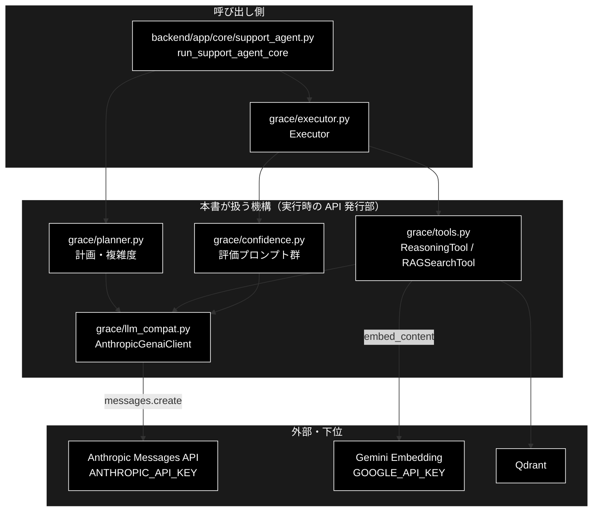
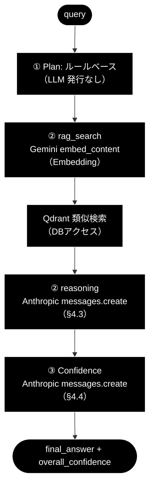

# grace_runtime.md - GRACE 実行時に発行される API とプロンプト

**Version 3.3** | 最終更新: 2026-09-26

> **参考ドキュメント**
> - [`grace/docs/grace.md`](./grace.md) — 設計思想（**なぜ**この形か。ReAct → Reflection → GRACE 5 段階の経緯）
> - [`grace/docs/grace_core.md`](./grace_core.md) — 実装アーキテクチャ（**どう**組まれているか。構成図・依存関係・モジュール別サマリー・最小実行サンプル）

---

## 目次

- [概要](#概要)
- [1. 発行される API の一覧](#1-発行される-api-の一覧)
- [2. LLM API の発行部（Anthropic）](#2-llm-api-の発行部anthropic)
- [3. Embedding API の発行部（Gemini）](#3-embedding-api-の発行部gemini)
- [4. 利用プロンプト全文](#4-利用プロンプト全文)
  - [4.1 計画生成プロンプト](#41-計画生成プロンプト①-planllm-計画経路)
  - [4.2 複雑度推定プロンプト](#42-複雑度推定プロンプトllm-複雑度を使う経路)
  - [4.3 推論プロンプト](#43-推論プロンプト②-execute-の-reasoning-ステップほぼ必ず発行)
  - [4.4 信頼度評価プロンプト群](#44-信頼度評価プロンプト群③-confidence複数発行)
- [5. 既定クエリで実際に飛ぶ API](#5-既定クエリで実際に飛ぶ-api)
- [変更履歴](#変更履歴)

---

## 概要

本書は GRACE を 1 クエリ動かしたときに、**内部で実際にどの API が発行され、どんなプロンプトが送られるか**を実コードとともに示す「実行時リファレンス（HOW）」である。

GRACE 本体は google-genai 形式の `client.models.generate_content(...)` のまま書かれており、`grace/llm_compat.py` がそれを Anthropic の `messages.create(...)` に変換している点が要となる。

> 📝 **技術スタック**: LLM 用途はすべて **Anthropic Claude**（既定 `claude-sonnet-5`、軽量 `claude-haiku-4-5-20251001`、鍵 `ANTHROPIC_API_KEY`）。検索の Embedding のみ **Gemini** `gemini-embedding-2`（3072 次元、鍵 `GOOGLE_API_KEY`）を継続利用する。

実行の入口は Web API（`uvicorn backend.app.main:app` → `run_support_agent_core`）。CLI（`agent_support_example.py`）と S0〜S9 のステップ別トレース（`grace/step_trace/s*.py`）は 2026-09-19 に削除した。最小実行サンプルとその解説は [`grace_core.md` §7](./grace_core.md#7-使用例最小実行サンプル) にある。

### 主な責務

- GRACE 本体の genai 形式の呼び出しを Anthropic Messages API へ変換して発行する
- 計画生成と複雑度推定のプロンプトを組み立てて発行する
- 推論（reasoning）のプロンプトを組み立てて発行する
- 信頼度評価のプロンプト群（自己評価・網羅度・根拠検証）を発行する
- 検索クエリを Gemini Embedding でベクトル化して Qdrant を検索する

### 各責務対応のモジュール

| # | 責務 | 対応モジュール | 説明 |
|---|------|--------------|------|
| 1 | genai 形式 → Anthropic の変換 | `grace/llm_compat.py` | `create_chat_client()` → `AnthropicGenaiClient`（§2） |
| 2 | 計画生成・複雑度推定 | `grace/planner.py` | `Planner.create_plan()` / `estimate_complexity_with_llm()`（§4.1・§4.2） |
| 3 | 推論 | `grace/tools.py` | `ReasoningTool._build_prompt()` → `execute()`（§4.3） |
| 4 | 信頼度評価 | `grace/confidence.py` | `LLMSelfEvaluator` / `QueryCoverageCalculator` / `GroundednessVerifier`（§4.4） |
| 5 | 検索のベクトル化 | `grace/tools.py` / `agent_tools.py` | `RAGSearchTool` が Gemini Embedding でクエリをベクトル化して Qdrant を検索（§3） |

### アーキテクチャ構成図



**データフロー**:

1. コアが ① Plan を呼ぶと、`Planner` が計画生成（と必要なら複雑度推定）のプロンプトを発行する
2. ② Execute では RAG 検索が Gemini Embedding → Qdrant を叩き、推論ツールが回答生成のプロンプトを発行する
3. ③ Confidence で評価プロンプト群が発行される
4. LLM 呼び出しはすべて `llm_compat.py` が Anthropic の `messages.create(...)` へ変換する

---

## 1. 発行される API の一覧

| API | プロバイダ | 発行場所（実コード） | 用途 | 鍵 |
|---|---|---|---|---|
| **LLM テキスト生成** | Anthropic Claude | `grace/llm_compat.py` `messages.create(**kwargs)` | 計画生成・推論・信頼度評価 | `ANTHROPIC_API_KEY` |
| **Embedding** | Gemini | `helper/helper_embedding.py` `embed_content(**kwargs)` | RAG 検索クエリのベクトル化 | `GOOGLE_API_KEY` |
| **ベクトル検索** | Qdrant（DB） | `qdrant_client_wrapper` 経由 | 類似チャンク取得（LLM ではない） | - |

## 2. LLM API の発行部（Anthropic）

GRACE 内のすべての LLM 呼び出しは、最終的にこの 1 箇所（`messages.create`）に集約される。

```python
# grace/llm_compat.py（_AnthropicModels.generate_content）
def generate_content(self, model=None, contents=None, config=None, **_kwargs):
    cfg = _extract_config(config)                 # temperature / max_output_tokens / json 指定を取り出す
    prompt = contents if isinstance(contents, str) else str(contents)

    # JSON 出力要求（計画生成など）なら、厳密 JSON を強制するシステム指示を付与
    want_json = bool(cfg.get("response_mime_type") == "application/json"
                     or cfg.get("response_schema") is not None)
    system_parts = []
    if want_json:
        system_parts.append(
            "あなたは厳密な JSON ジェネレーターです。"
            "出力は有効な JSON オブジェクト 1 個のみとし、"
            "Markdown のコードブロックや説明文を一切含めないでください。"
        )
        hint = _schema_hint(cfg.get("response_schema"))   # Pydantic の JSON Schema
        if hint:
            system_parts.append(f"出力は次の JSON Schema に厳密に従ってください:\n{hint}")
    system_prompt = "\n\n".join(system_parts) if system_parts else None

    max_tokens = cfg.get("max_output_tokens") or 2048     # Anthropic は max_tokens 必須
    kwargs = {
        "model": model_name,                              # 既定 claude-sonnet-5
        "max_tokens": int(max_tokens),
        "messages": [{"role": "user", "content": prompt}],
    }
    if system_prompt:           kwargs["system"] = system_prompt
    if temperature is not None: kwargs["temperature"] = float(temperature)

    message = self._get_client().messages.create(**kwargs)   # ★ここが実際の Anthropic API 発行
```

**解説**:
- `generate_content(model, contents, config)`（genai 形式）→ `anthropic.Anthropic().messages.create(model, max_tokens, messages, system, temperature)` に変換される。
- クライアントは遅延生成で、鍵は環境変数 `ANTHROPIC_API_KEY` から解決する。
- JSON を要求する呼び出し（＝計画生成）では、上記の「厳密な JSON ジェネレーター」システム指示と Pydantic スキーマを自動付与し、戻り値から `_strip_to_json()` で純粋な JSON 本体だけを取り出す。

クライアント生成はプロバイダで分岐する。

```python
# grace/llm_compat.py（create_chat_client）
provider = (config.llm.provider or "anthropic").lower()
if provider in {"gemini", "google", "google-genai", "genai"}:
    from google import genai
    return genai.Client()                  # Embedding 用など
return AnthropicGenaiClient(default_model=model)   # ← 既定はこちら（Anthropic）
```

## 3. Embedding API の発行部（Gemini）

RAG 検索（`rag_search`）でクエリをベクトル化する際に Gemini Embedding が発行される。LLM が Anthropic でも、**検索の Embedding だけは Gemini を継続利用**する（プロジェクトの恒久ルール）。

```python
# helper/helper_embedding.py（embed_text）
def embed_text(self, text, task_type=None):
    config = {"output_dimensionality": self._dims}        # 3072 次元
    kwargs = {"model": self.model,                         # gemini-embedding-2
              "contents": text,
              "config": config}
    response = self.client.models.embed_content(**kwargs)  # ★ここが実際の Gemini API 発行
    return response.embeddings[0].values
```

得たベクトルで Qdrant を類似検索し、上位チャンクを `reasoning` プロンプトの【参照情報】に渡す。

## 4. 利用プロンプト全文

GRACE を 1 クエリ動かしたときに使われるプロンプトの**全文**を以下に示す（プレースホルダ `{...}` は実行時に埋め込まれる）。

### 4.1 計画生成プロンプト（① Plan・LLM 計画経路）

`PLAN_GENERATION_PROMPT`（`grace/planner.py`）。末尾の `{SEARCH_QUERY_INSTRUCTION}` は別ファイルの定数が展開される（後掲）。

```text
あなたは計画策定の専門家です。ユーザーの質問を分析し、回答を生成するための実行計画を作成してください。

【利用可能なアクション】
- rag_search: ベクトルDB（Qdrant）から関連情報を検索（社内ドキュメント・FAQ向け）
- web_search: Web検索で最新情報や一般的な情報を取得（最新ニュース・外部情報向け）
- reasoning: 収集した情報を分析・統合して回答を生成
- ask_user: ユーザーに追加情報や確認を求める

【利用可能なコレクション (rag_search用)】
{available_collections}

【コレクション選択のルール (重要)】
- `rag_search` の `collection` 引数は、原則として指定しないでください（`null` または省略）。
   * 特定のコレクション（例: wikipedia_ja）に限定せず、利用可能なすべてのコレクションから網羅的に検索を行うためです。
   * システム側で自動的に最適なコレクション順序で検索を実行します。
- 例外: ユーザーが明示的に「livedoorニュースから検索して」のように指定した場合のみ、そのコレクション名を指定してください。

【検索クエリの作成ルール】
- `rag_search` の `query` 引数は、ユーザーの質問文を極力そのまま使用してください。
   * 単語の羅列（例: "金色夜叉 尾崎紅葉"）に変換せず、自然言語の文脈
   （例:"〜の構成者は誰ですか？"）を維持することで、ベクトル検索の精度が向上します。

【計画作成のルール (厳守)】
1. 検索アクション（rag_search）は、可能な限り「1つのステップ」にまとめてください。
    * 質問を分解して複数の検索ステップを作らないでください。
2. `rag_search` の `query` は、ユーザーの元の質問文を「完全一致でコピー」してください。
    * 要約、キーワード化、分割は一切禁止です。
    * 悪い例: "金色夜叉 構成者"
    * 良い例: "『金色夜叉:尾崎紅葉不如帰:徳富蘆花』の構成者は誰ですか？"
3. 依存関係を正しく設定してください（depends_onは先行ステップのIDのみ）。
4. 失敗時の代替手段（fallback）を検討してください。
5. 最後のステップは必ず "reasoning" で回答を生成してください
6. rag_search と web_search の使い分け:
    * 計画には web_search ステップを含めないでください
    * web_search は、rag_search の結果が不十分な場合に executor が自動的に実行します
    * 計画は常に rag_search → reasoning の2ステップ構成としてください
    * rag_search の fallback には "web_search" を指定してください
    * 例外: ユーザーが明示的に「最新ニュースを検索して」等と指示した場合のみ、
      web_search 単体のステップを計画に含めてよい

{SEARCH_QUERY_INSTRUCTION}

【計画の複雑度(complexity)の目安】
- 0.0-0.3: 単純な質問（1-2ステップ）
- 0.4-0.6: 中程度の質問（2-3ステップ）
- 0.7-1.0: 複雑な質問（4ステップ以上）

【requires_confirmationをtrueにする条件】
- 質問が曖昧で複数の解釈が可能な場合
- 実行に時間がかかる可能性がある場合
- 外部リソースへのアクセスが必要な場合

ユーザーの質問: {query}

JSON形式で実行計画を出力してください。
```

埋め込まれる `SEARCH_QUERY_INSTRUCTION`（`services/prompts.py`）の全文:

```text
**重要: 検索クエリ作成のルール（最高精度を出すためのガイドライン）**
- 検索クエリは、質問文から「いつ」「誰」「何」などの具体的な要素を抽出し、それらをスペースで区切ったキーワードのリストとして作成してください。
- 助詞や助動詞（〜の、〜は、〜ですか？）は極力省き、重要な名詞と動詞のみを残してください。
- ユーザーの質問に含まれる具体的な文脈（「初めて」「受賞」など）を決して省略しないでください。

**良い例 (検索スコア 0.8333 を達成したクエリ):**
質問: 「浦沢直樹が初めて受賞したのはいつ、何の賞ですか？」
クエリ: 「浦沢直樹 初めて受賞 いつ 何の賞」

**悪い例:**
- 「浦沢直樹 初受賞」（要素が削られすぎてマッチング精度が低下）
- 「浦沢直樹が初めて受賞したのはいつですか？」（助詞が多く検索ノイズになる）
```

このプロンプトを送る発行部（JSON 強制つき）:

```python
# grace/planner.py（_generate_plan_with_retry）
config = {
    "response_mime_type": "application/json",   # ← JSON 強制（llm_compat が system 指示＋スキーマを付与）
    "response_schema": ExecutionPlan,           # Pydantic スキーマ
    "temperature": self.config.llm.temperature,
}
response = self.client.models.generate_content(
    model=self.model_name, contents=prompt, config=config,
)
```

> ⚠️ **重要**: 既定クエリ「日本の再生可能エネルギー政策の最新動向を教えて」のように、複雑度が閾値（0.7）未満かつ Web 検索マーカー（"最新ニュース" 等）を含まない質問では、planner は **LLM を使わずルールベースで 2 ステップ計画**（`rag_search → reasoning`）を組む。この場合 §4.1 の計画生成プロンプトは**発行されない**（LLM 計画経路に入ったときのみ発行）。

### 4.2 複雑度推定プロンプト（LLM 複雑度を使う経路）

`COMPLEXITY_ESTIMATION_PROMPT`（`grace/planner.py`）。既定の複雑度推定はキーワードベースのヒューリスティック（LLM 不使用）で、このプロンプトは LLM 複雑度推定を呼ぶ経路でのみ発行される。

```text
以下の質問の複雑度を0.0から1.0の数値で評価してください。

評価基準:
- 0.0-0.2: 非常に単純（事実確認、定義の質問）
- 0.3-0.4: 単純（1つのトピックについての説明）
- 0.5-0.6: 中程度（比較、分析が必要）
- 0.7-0.8: 複雑（複数のソースからの情報統合が必要）
- 0.9-1.0: 非常に複雑（専門知識、多段階の推論が必要）

質問: {query}

数値のみを回答してください（例: 0.5）
```

### 4.3 推論プロンプト（② Execute の reasoning ステップ・ほぼ必ず発行）

`ReasoningTool._build_prompt()`（`grace/tools.py`）が「システム指示＋【参照情報】＋【補足コンテキスト】＋【ユーザーの質問】＋【回答の構成ルール】」を連結する。リテラル部分の全文は次の通り（【参照情報】は RAG 結果から動的に生成）。

```text
あなたは社内ドキュメント検索システムと連携した「ハイブリッド・ナレッジ・エージェント」です。
提供された【参照情報】を元に、ユーザーの質問に対して正確で誠実な回答を生成してください。

### 【参照情報】
--- 情報源 {i} (信頼度: {score}, コレクション: {collection}) ---
Q: {question}
A: {answer}
出典: {source}
（RAG 検索でヒットした各チャンクを上記フォーマットで列挙。Q/A が無い場合は content 先頭1000字）

### 【補足コンテキスト】
{context}            ← 他ステップの出力がある場合のみ

### 【ユーザーの質問】
{query}

### 【回答の構成ルール（最重要）】
1. **正確性と誠実さ**: 参照情報にある事実のみを述べてください。情報がない場合は「提供された情報源には見当たりませんでした」と正直に回答してください。
2. **判明した事実を優先**: 質問に対する直接的な回答が見つかった場合は、それを最初に簡潔に述べてください。
3. **出典の明示**: 回答の根拠となった情報がある場合、「社内ナレッジ（出典ファイル名）によると...」の形式で出典を明示してください。
4. **丁寧な日本語**: です・ます調で、読みやすく構造化（箇条書き等）して回答してください。
5. **捏造禁止**: あなた自身の事前知識で情報を補完したり、勝手な推測で回答を作成したりしないでください。

上記のルールに従い、プロフェッショナルな回答を生成してください。
```

このプロンプトを送る発行部:

```python
# grace/tools.py（ReasoningTool.execute）
prompt = self._build_prompt(query, context, sources)
response = self.client.models.generate_content(
    model=self.model_name, contents=prompt,
    config={"temperature": self.config.llm.temperature,
            "max_output_tokens": self.config.llm.max_tokens},
)
answer = response.text
```

### 4.4 信頼度評価プロンプト群（③ Confidence・複数発行）

`executor.execute()` は最終回答後、信頼度を LLM で採点する（`grace/confidence.py`）。いずれも §2 と同じ `generate_content → messages.create` 経路で Anthropic に発行される。実際に使われる全文を示す。

**(1) 最終評価（確信度＋網羅度）`LLMSelfEvaluator.FINAL_EVAL_PROMPT`** — `evaluate_final()` で 1 回にまとめて評価:

```text
以下の【質問】に対する【回答】を2つの観点で評価し、JSON形式で出力してください。

【観点1: 確信度 (self_eval_score)】
- 正確性: 回答は提供された情報源に基づいているか？捏造はないか？
- 適切性: 質問に直接的かつ明確に答えているか？
- スタイル: 丁寧で読みやすい日本語（です・ます調）か？
スコア目安: 1.0=完全に正確・適切 / 0.6=やや確信あり / 0.4=不確実 / 0.0=不適切

【観点2: 網羅度 (coverage_score)】
- 質問のすべての要素をカバーしているか？
スコア目安: 1.0=すべての要素に回答 / 0.6=主要な要素に回答 / 0.2=ほとんど回答できていない

質問: {query}
回答: {answer}
使用した情報源: {sources}
```

**(2) 単一確信度評価 `LLMSelfEvaluator.EVAL_PROMPT`** — `evaluate()`（個別評価）で使用:

```text
以下の基準に基づいて、回答の確信度を0.0から1.0の数値で評価してください。

【評価基準】
1. 正確性 (Accuracy):
   - 回答は提供された情報源（検索結果）に基づいているか？
   - 情報源にない情報を捏造していないか？
2. 適切性 (Relevance):
   - ユーザーの質問に直接的かつ明確に答えているか？
   - 質問の意図を正しく理解しているか？
3. スタイル (Style):
   - 親しみやすく、丁寧な日本語（です・ます調）か？
   - 読みやすい構成か？

【スコアの目安】
- 1.0: 完全に正確で、適切かつスタイルも完璧（複数の信頼できる情報源で確認済み）
- 0.8: ほぼ確実（信頼できる情報源あり、回答も適切）
- 0.6: やや確信あり（関連情報はあるが、完全ではない、またはスタイルに改善の余地あり）
- 0.4: 不確実（情報が限定的、または質問への回答として不十分）
- 0.2: 推測に近い（根拠が弱い）
- 0.0: 全く分からない、または不適切な回答

質問: {query}
回答: {answer}
使用した情報源: {sources}

確信度（0.0-1.0の数値のみ回答）:
```

**(3) クエリ網羅度 `QueryCoverageCalculator.COVERAGE_PROMPT`**:

```text
以下の質問に対する回答が、質問のすべての要素をカバーしているか評価してください。

質問: {query}
回答: {answer}

網羅度（0.0-1.0の数値のみ回答）:
- 1.0: すべての質問要素に完全に回答
- 0.8: ほぼすべての要素に回答
- 0.6: 主要な要素に回答
- 0.4: 一部の要素のみに回答
- 0.2: ほとんど回答できていない
- 0.0: 全く回答できていない

数値のみ回答:
```

**(4) 根拠妥当性（groundedness）`GroundednessVerifier.PROMPT`** — 回答の各主張が引用ソースに支持されるかを判定（S1 中核）:

```text
あなたは厳密なファクトチェッカーです。
【回答】を短い主張（claim）に分解し、各主張が【情報源】によって
支持されるか判定してください。判定は次の3値のみです。

- supported   : 情報源の記述から主張が読み取れる（含意される）
- contradicted: 情報源と主張が矛盾する
- neutral     : 情報源に関連記述がなく判断できない

あなた自身の事前知識は使わず、提示された【情報源】のみを根拠にしてください。

# 質問
{query}

# 回答
{answer}

# 情報源
{sources}
```

## 5. 既定クエリで実際に飛ぶ API

「日本の再生可能エネルギー政策の最新動向を教えて」（ルールベース計画になる典型例）の場合、発行される API は次の順になる。



| 順 | フェーズ | 発行 API | 使うプロンプト |
|---|---|---|---|
| 1 | ① Plan | （LLM 発行なし＝ルールベース） | - |
| 2 | ② Execute / rag_search | Gemini `embed_content` → Qdrant 検索 | （プロンプトなし・ベクトル化） |
| 3 | ② Execute / reasoning | Anthropic `messages.create` | §4.3 推論プロンプト |
| 4 | ③ Confidence | Anthropic `messages.create`（複数） | §4.4（最終評価・groundedness 等） |

> 複雑な質問・Web 検索マーカー付きの質問では、これに加えて **§4.1 計画生成プロンプト**が Anthropic に 1 回発行される（LLM 計画経路）。

---

---

## 変更履歴

| バージョン | 変更内容 |
|-----------|---------|
| 3.3 | 現在の Embedding の記述を `gemini-embedding-001` から `gemini-embedding-2` へ是正（2026-09-26 に変更。定義は `config.py::ModelConfig.EMBEDDING_MODEL` の 1 箇所） |
| 3.2 | 目次の §4.1 / §4.3 / §4.4 へのリンクが見出しのアンカー（①〜③ を含む）と一致せず切れていたのを修正（2026-09-24） |
| 3.1 | `a_cross_doc_md_format.md` v1.2（種別 A）に準拠（2026-09-24）。概要に主な責務・各責務対応のモジュール・アーキテクチャ構成図を追加。本文の章番号は変えていない。現在の既定モデルの記載 `claude-sonnet-4-6` を実装（`grace/config.py` の `LLMConfig.model` = `claude-sonnet-5`）に合わせて是正した（CLAUDE.md §9.3。旧既定は履歴の記述にだけ残す）。Mermaid の `classDef subgraphStyle` の欠落を補った |
| 3.0 | **`grace_core_flow.md` から改称し、役割を「実行時に飛ぶ API とプロンプト」へ絞った**（2026-09-14）。旧 §A（5 段階設計）/ §C（役割サマリー）は `grace.md` と、旧 §B（モジュール構成図・依存関係テーブル）/ §D（最小実行サンプル）は `grace_core.md` と**完全重複**していたため（構成図 Mermaid 68 行と依存関係テーブルはバイト単位で一致）、それぞれの正本へ集約して本書からは削除した。旧 §F（補足説明）も `grace.md` 第3部・`grace_core.md` §1.2 の言い換えだったため削除。残した旧 §E を `1.`〜`5.` へ採番し直している。旧 §D.3 の行番号による逐行解説は、**リポジトリに存在しないコード片への行番号**だったため引き継がなかった（行番号参照は腐る。`README.md` §6） |
| 2.0 | 実装との突き合わせによる訂正。(1) **§D が題材にしていた `agent_example.py` はリポジトリに存在しない**（git 全履歴 0 件）ため、「本書内の解説用コード片」と明示し、実物のエントリポイント（`agent_support_example.py` / `grace/step_trace/s0_arg.py`〜`s9_render.py`）を §D.4 で案内する形へ改めた。(2) §F の `agent_rag.py` / Streamlit（本リポジトリに存在しない）参照を、`execute_plan_generator()` と FastAPI SSE の説明へ差し替え。(3) `grace/doc/`（単数形）リンクを `grace/docs/` へ是正（CLAUDE.md §9.1） |
| 1.1 | D の直後に「E. プロンプトと API 発行部」を追加（API 発行部の実コード、利用プロンプト全文＝計画生成／複雑度推定／推論／信頼度評価群、既定クエリの API 発行順フロー図）。旧 E「理解のための補足説明」を F に繰り下げ |
| 1.0 | 初版作成（`grace_core_flow.md` として）。参考ドキュメント（`grace_core.md` / `grace.md`）の明示、A: 5 段階設計、B: 8 コアモジュール構成（構成図＋依存テーブル）、C: 役割サマリー、D: 最小実行サンプルの全文・実行フロー・行解説・実行方法、E: 補足説明を整備 |
