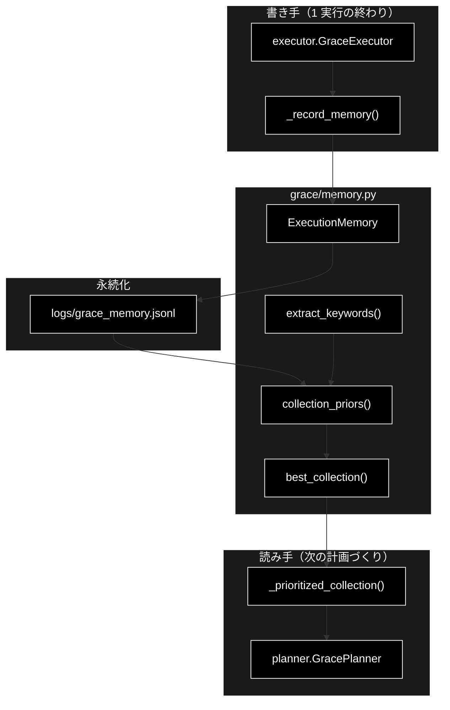
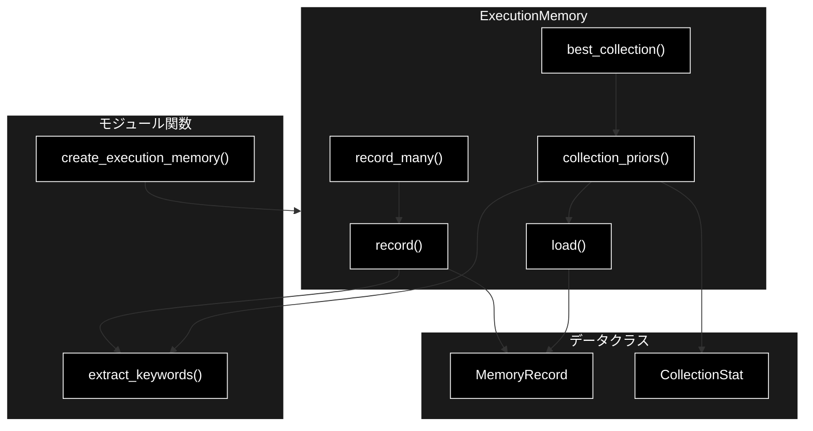
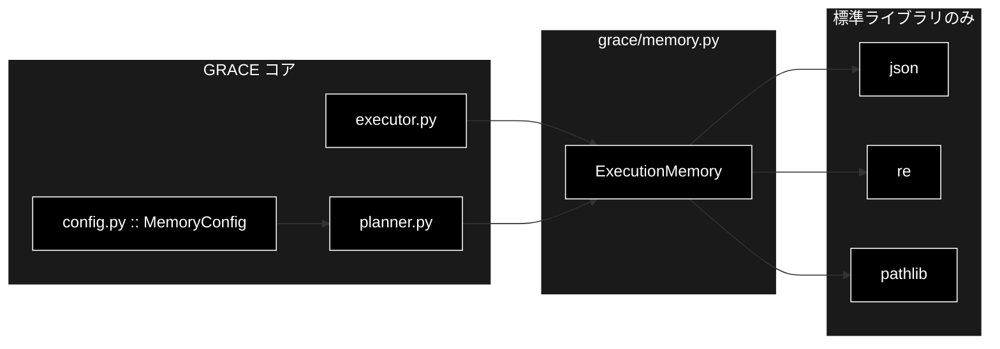

# memory.py - GRACE 実行メモリ層（P4） ドキュメント

**Version 1.0** | 最終更新: 2026-09-04

> **参考ドキュメント**
> - [`grace/docs/grace_core.md`](./grace_core.md) — コアモジュール群の横断アーキテクチャ（§4 に「実行メモリが貯まるまで」の実例あり）
> - [`grace/docs/planner.md`](./planner.md) — 本モジュールの唯一の読み手（`_prioritized_collection()`）
> - [`grace/docs/executor.md`](./executor.md) — 本モジュールへの唯一の書き手（`_record_memory()`）

---

## 目次

- [概要](#概要)
- [1. アーキテクチャ構成図](#1-アーキテクチャ構成図)
- [2. モジュール構成図](#2-モジュール構成図)
- [3. クラス・関数一覧表](#3-クラス関数一覧表)
- [4. クラス・関数 IPO 詳細](#4-クラス関数-ipo-詳細)
- [5. 設定・定数](#5-設定定数)
- [6. 使用例](#6-使用例)
- [7. 落とし穴](#7-落とし穴)
- [8. 変更履歴](#8-変更履歴)
- [付録: 依存関係図](#付録-依存関係図)

---

## 概要

`grace/memory.py` は、実行ログから **「(質問キーワード, 当たったコレクション, 成否, confidence)」**
を JSONL に蓄積し、Planner のコレクション優先順位に反映する層である。

「同じ種類の質問では、過去に当たったコレクションを先に見る」という**それだけの機構**で、
LLM も外部サービスも使わない。**外部依存なし・決定的**なので、そのまま単体テストできる。

### 主な責務

- 実行 1 回分のレコード（質問・キーワード・コレクション・成否・確信度）を JSONL へ追記する
- JSONL を読み込み、壊れた行を飛ばして残りを活かす
- コレクションごとに `success_rate`（Laplace 平滑化）× `mean_confidence` を集計し、score 降順で返す
- 十分な実績があるコレクションを 1 つだけ選ぶ（無ければ `None` ＝ 全コレクション検索）
- 除外対象コレクションを**飛ばして次点を採る**

### 各責務対応のモジュール

| # | 責務 | 対応する要素 |
|---|------|------------|
| 1 | キーワード抽出 | `extract_keywords()` |
| 2 | 1 レコードの表現と JSON 変換 | `MemoryRecord` / `to_dict()` / `from_dict()` |
| 3 | 集計単位の表現とスコア算出 | `CollectionStat` / `success_rate` / `score()` |
| 4 | 書き込み | `ExecutionMemory.record()` / `record_many()` |
| 5 | 読み込み（破損耐性つき） | `ExecutionMemory.load()` |
| 6 | 事前分布の算出 | `ExecutionMemory.collection_priors()` |
| 7 | 採用判定（除外の考慮を含む） | `ExecutionMemory.best_collection()` |
| 8 | 生成 | `create_execution_memory()` |

### 主要機能一覧

| 機能 | 説明 |
|------|------|
| `DEFAULT_MEMORY_PATH` | 既定の JSONL パス（`logs/grace_memory.jsonl`） |
| `extract_keywords()` | 形態素解析に依存しない軽量キーワード抽出（決定的） |
| `MemoryRecord` | 1 実行レコードのデータクラス |
| `CollectionStat` | コレクション単位の集計結果（件数・成功数・平均確信度） |
| `ExecutionMemory` | 蓄積と集計の本体 |
| `create_execution_memory()` | `ExecutionMemory` のファクトリ |

---

## 1. アーキテクチャ構成図

### 1.1 システム全体での位置づけ



### 1.2 データフロー

| 段階 | 入力 | 処理 | 出力 |
|---|---|---|---|
| 書き込み | `state.plan.original_query` / `state.used_collections` / 成否 / `overall_confidence` | `record_many()` → コレクションごとに `record()` | JSONL への追記（1 コレクション 1 行） |
| 読み込み | JSONL | `load()`（壊れた行はスキップ） | `list[MemoryRecord]` |
| 集計 | レコード列 ＋ 質問（任意） | キーワード overlap で絞る → コレクション別に集計 → `score()` 降順 | `list[CollectionStat]` |
| 採用 | `CollectionStat` 列 ＋ `min_count` / `min_score` / `exclude` | 条件を満たす先頭を返す | `Optional[str]` |

---

## 2. モジュール構成図

### 2.1 内部構成



### 2.2 依存関係テーブル

| 依存先 | 用途 |
|---|---|
| `json`（標準） | JSONL の読み書き |
| `logging`（標準） | 書き込み失敗・破損行のスキップを警告として残す |
| `re`（標準） | キーワード抽出の正規表現 |
| `time`（標準） | `timestamp` の既定値 |
| `dataclasses` / `pathlib` / `typing`（標準） | データクラス・パス・型 |

> ✅ **サードパーティ依存も GRACE 内部への依存も無い。** LLM・Qdrant・API キーのいずれも不要で、
> `ExecutionMemory(path=tmp_path)` を渡すだけで単体テストできる。

---

## 3. クラス・関数一覧表

### 3.1 クラス一覧

| クラス | 種別 | 説明 |
|---|---|---|
| `MemoryRecord` | dataclass | 1 実行レコード（query / keywords / collection / success / confidence / timestamp） |
| `CollectionStat` | dataclass | コレクション単位の集計（collection / count / success_count / mean_confidence） |
| `ExecutionMemory` | class | 蓄積と集計の本体 |

### 3.2 関数一覧

| 関数・メソッド | 分類 | 説明 |
|---|---|---|
| `extract_keywords(text, top_n=8)` | モジュール関数 | 決定的なキーワード抽出 |
| `create_execution_memory(path=DEFAULT_MEMORY_PATH)` | モジュール関数 | `ExecutionMemory` の生成 |
| `MemoryRecord.to_dict()` | メソッド | JSON 化できる `dict` を返す |
| `MemoryRecord.from_dict(d)` | クラスメソッド | `dict` から復元（欠損キーは既定値） |
| `CollectionStat.success_rate` | プロパティ | `success_count / count`（count=0 なら 0.0） |
| `CollectionStat.score(alpha=1.0, beta=1.0)` | メソッド | Laplace 平滑化した成功率 × 平均確信度 |
| `ExecutionMemory.record(...)` | メソッド | 1 レコードを追記（best-effort） |
| `ExecutionMemory.record_many(...)` | メソッド | 複数コレクションをまとめて追記（重複は 1 回） |
| `ExecutionMemory.load()` | メソッド | JSONL を読む（破損行はスキップ） |
| `ExecutionMemory.collection_priors(...)` | メソッド | 事前分布を score 降順で返す |
| `ExecutionMemory.best_collection(...)` | メソッド | 採用するコレクションを 1 つ返す（無ければ `None`） |

---

## 4. クラス・関数 IPO 詳細

### 4.1 `extract_keywords()`

軽量なキーワード抽出。**形態素解析はしない。**

```python
def extract_keywords(text: str, top_n: int = 8) -> list[str]
```

| パラメータ | 型 | 既定 | 説明 |
|---|---|---|---|
| `text` | `str` | — | 抽出元の文字列。空なら `[]` |
| `top_n` | `int` | `8` | 返すキーワードの上限 |

| | 内容 |
|---|---|
| **Input** | 任意の文字列 |
| **Process** | 正規表現 `[A-Za-z0-9]{2,}` または `[一-鿿゠-ヿ぀-ゟ]{2,}` にマッチする連続を先頭から拾い、小文字化して**重複を除きながら**最大 `top_n` 件まで集める |
| **Output** | `list[str]`（出現順・小文字・重複なし） |

**戻り値例**

```python
extract_keywords("Python の歴史を教えて")
# → ["python", "の歴史を教えて"]
```

> ⚠️ **日本語は細かく分かれない。** 上の例のとおり、区切り（スペース・記号・英数）が来るまでの
> 日本語の連続が丸ごと 1 キーワードになる。したがってキーワード一致が効くのは
> **英語・カタカナ語・型番など「独立した語」が共通している質問どうし**に限られる。

### 4.2 `MemoryRecord`

```python
@dataclass
class MemoryRecord:
    query: str
    keywords: list[str]
    collection: Optional[str]
    success: bool
    confidence: float
    timestamp: float = field(default_factory=time.time)
```

| メソッド | 説明 |
|---|---|
| `to_dict()` | 上記 6 フィールドをそのまま `dict` にする |
| `from_dict(d)` | 欠損キーを既定値（`""` / `[]` / `None` / `False` / `0.0`）で埋めて復元する。型変換（`bool()` / `float()`）も行うので、手編集で崩れた値もそれなりに読める |

### 4.3 `CollectionStat`

```python
@dataclass
class CollectionStat:
    collection: str
    count: int
    success_count: int
    mean_confidence: float
```

#### `success_rate`（プロパティ）

`success_count / count`。`count == 0` のときは `0.0`（ゼロ除算しない）。

#### `score(alpha=1.0, beta=1.0)`

```python
def score(self, alpha: float = 1.0, beta: float = 1.0) -> float
```

| | 内容 |
|---|---|
| **Input** | 平滑化パラメータ `alpha` / `beta` |
| **Process** | `smoothed_sr = (success_count + alpha) / (count + alpha + beta)` を計算し、`mean_confidence` を掛ける |
| **Output** | `float` |

**なぜ平滑化するのか**: 1 件だけ成功したコレクションの `success_rate` は 1.0 になる。
生の成功率で並べると**実績 1 件が実績 20 件を追い抜く**。Laplace 平滑化はこれを抑え、
件数が増えるほど生の成功率へ近づく。

**計算例**（`count=3, success_count=3, mean_confidence≈0.843`）:

```
smoothed_sr = (3 + 1) / (3 + 1 + 1) = 0.8
score       = 0.8 × 0.843 ≈ 0.674
```

### 4.4 `ExecutionMemory.record()`

```python
def record(self, query: str, collection: Optional[str], success: bool,
           confidence: float, keywords: Optional[list[str]] = None) -> None
```

| | 内容 |
|---|---|
| **Input** | 質問文・コレクション名・成否・確信度（`keywords` 省略時は `extract_keywords(query)`） |
| **Process** | `MemoryRecord` を作り、親ディレクトリを `mkdir(parents=True, exist_ok=True)` してから JSONL へ 1 行追記 |
| **Output** | `None` |

> ⚠️ **書き込みは best-effort。** 例外は `try/except` で握って `logger.warning` を出すだけで、
> **実行は止めない。** メモリはあくまで補助であり、書けないことを理由にユーザーの質問を
> 失敗させる理由が無い。

### 4.5 `ExecutionMemory.record_many()`

```python
def record_many(self, query: str, collections: list[Optional[str]], success: bool,
                confidence: float, keywords: Optional[list[str]] = None) -> None
```

| | 内容 |
|---|---|
| **Input** | 1 実行で使ったコレクションのリスト |
| **Process** | キーワードを**一度だけ**抽出して使い回し、`seen` で重複を除きながら `record()` を呼ぶ |
| **Output** | `None`（JSONL に「使ったコレクション数」行が追記される） |

### 4.6 `ExecutionMemory.load()`

```python
def load(self) -> list[MemoryRecord]
```

| | 内容 |
|---|---|
| **Input** | なし（`self.path`） |
| **Process** | ファイルが無ければ `[]`。1 行ずつ `json.loads` → `MemoryRecord.from_dict`。**行単位で `try/except`** し、壊れた行だけ飛ばす。`OSError` は警告して `[]` 相当で返す |
| **Output** | `list[MemoryRecord]` |

> ⚠️ **`try` が `for` 全体を囲んでいた頃は、1 行目以外の破損でそれ以降が丸ごと失われていた。**
> JSONL は追記専用なので、マージコンフリクトのマーカー混入・書き込み中断・手編集ミスで
> 壊れた行が混ざりうる。現在は破損行数を `logger.warning` に出したうえで残りを活かす。

### 4.7 `ExecutionMemory.collection_priors()`

```python
def collection_priors(self, query: Optional[str] = None,
                      min_keyword_overlap: int = 1) -> list[CollectionStat]
```

| パラメータ | 型 | 既定 | 説明 |
|---|---|---|---|
| `query` | `Optional[str]` | `None` | 指定するとキーワードが overlap するレコードだけを対象にする |
| `min_keyword_overlap` | `int` | `1` | overlap とみなすキーワード共通数の下限 |

| | 内容 |
|---|---|
| **Input** | JSONL の全レコード ＋ 質問（任意） |
| **Process** | ① `load()`。空なら `[]` ② `query` 指定時はキーワード overlap でフィルタ。**0 件なら全レコードへフォールバック** ③ `collection` が `None` のレコードは常に除外 ④ コレクション別に件数・成功数・確信度合計を集計 ⑤ `score()` 降順でソート |
| **Output** | `list[CollectionStat]` |

> ⚠️ **overlap 0 件のときのフォールバックが、誤学習を広く効かせてしまう入口になる。**
> 「天気」の質問で誤採用されたコレクションが全体集計の首位に居ると、
> キーワードがまったく重ならない質問（例:「住民票の写しの取り方は？」）でも
> そのコレクションが返る。対策は `best_collection(exclude=...)` 側にある（§4.8）。

### 4.8 `ExecutionMemory.best_collection()`

```python
def best_collection(self, query: Optional[str] = None,
                    min_count: int = 3, min_score: float = 0.6,
                    exclude: Optional[Callable[[str], bool]] = None) -> Optional[str]
```

| パラメータ | 型 | 既定 | 説明 |
|---|---|---|---|
| `query` | `Optional[str]` | `None` | `collection_priors()` へそのまま渡す |
| `min_count` | `int` | `3` | この件数未満の実績は採用しない |
| `min_score` | `float` | `0.6` | `score()` の下限 |
| `exclude` | `Optional[Callable[[str], bool]]` | `None` | `True` を返したコレクションを候補から外す述語 |

| | 内容 |
|---|---|
| **Input** | 上記 |
| **Process** | `collection_priors(query=query)` を score 降順で走査し、`count < min_count` / `score() < min_score` / `exclude(...) is True` のいずれかに当たる要素は **`continue` で飛ばす**。最初に全条件を満たしたコレクション名を返す |
| **Output** | `Optional[str]`（該当なしは `None` ＝ 全コレクション検索） |

> ⚠️ **除外対象は「飛ばして次点を採る」。諦めて `None` を返さない。**
>
> 除外対象に当たった時点で `None` を返す実装にすると、**メモリ機構そのものが事実上死ぬ**。
> 誤学習されたコレクションが首位に居座る限り毎回 `None`（＝全コレクション検索）になるからだ。
> `collection_priors` は score 降順なので、除外分を読み飛ばせば正当な次点を拾える。
>
> この設計のおかげで、**古い誤学習レコードを消さなくても無害になる**
> （ログファイルの削除は不可逆なので、運用者に強いたくない）。

### 4.9 `create_execution_memory()`

```python
def create_execution_memory(path: str = DEFAULT_MEMORY_PATH) -> ExecutionMemory
```

`ExecutionMemory(path=path)` を返すだけのファクトリ。

---

## 5. 設定・定数

### 5.1 モジュール定数

| 定数 | 値 | 説明 |
|---|---|---|
| `DEFAULT_MEMORY_PATH` | `"logs/grace_memory.jsonl"` | 既定の JSONL パス |
| `_KEYWORD_RE` | `[A-Za-z0-9]{2,}\|[一-鿿゠-ヿ぀-ゟ]{2,}` | キーワード抽出の正規表現（非公開） |

### 5.2 `config.MemoryConfig`

採用条件は `grace/config.py` の `MemoryConfig` が持ち、Planner が `best_collection()` へ渡す。

| フィールド | 既定 | 説明 |
|---|---|---|
| `enabled` | `True` | `False` なら Planner/Executor がメモリを持たない（＝機構ごと無効） |
| `path` | `"logs/grace_memory.jsonl"` | JSONL の保存先 |
| `min_count` | `3` | `best_collection()` の採用に必要な実績件数 |
| `min_score` | `0.6` | `best_collection()` の採用に必要なスコア |

> 📝 `min_count=3` は「最初の数回は手探り、貯まってきたら絞る」ための下限。
> 実績が薄いコレクションへ早まって固定しないためにある。

---

## 6. 使用例

### 6.1 単体で使う

```python
from grace.memory import create_execution_memory

memory = create_execution_memory("logs/grace_memory.jsonl")

# 1 実行分を記録
memory.record_many(
    query="Python の歴史を教えて",
    collections=["wikipedia_ja"],
    success=True,
    confidence=0.85,
)

# 事前分布を見る
for stat in memory.collection_priors(query="Python の内包表記とは"):
    print(f"{stat.collection}: count={stat.count} score={stat.score():.3f}")

# 採用判定
best = memory.best_collection(query="Python の内包表記とは")
print(best)   # 実績が十分なら "wikipedia_ja"、足りなければ None
```

### 6.2 除外述語つきで使う（Planner の実際の呼び方）

```python
best = memory.best_collection(
    query=query,
    min_count=config.memory.min_count,
    min_score=config.memory.min_score,
    exclude=self._is_excluded,      # qdrant.excluded_collections に載っていれば True
)
```

`best_collection()` が返すのは**過去の実績からの推測**であり、運用者の明示指定ではない。
一方この戻り値は `PlanStep.collection` に入り、RAGSearchTool 側では明示指定と区別が付かないため、
`exclude` を渡さないと `qdrant.excluded_collections` を素通りしてしまう。

### 6.3 テストで使う

```python
def test_best_collection_skips_excluded(tmp_path):
    memory = create_execution_memory(str(tmp_path / "m.jsonl"))
    for _ in range(3):
        memory.record_many(query="住民票", collections=["bad", "gov_faq"],
                           success=True, confidence=0.9)

    # 除外しなければ首位が返る
    assert memory.best_collection(query="住民票") in {"bad", "gov_faq"}

    # 除外すると次点が返る（None にはならない）
    assert memory.best_collection(
        query="住民票", exclude=lambda c: c == "bad"
    ) == "gov_faq"
```

API キーも Qdrant も不要で、`tmp_path` を渡すだけで完結する。

---

## 7. 落とし穴

| 論点 | 実際の挙動 |
|---|---|
| 日本語のキーワード一致 | 形態素解析をしないため、日本語部分は丸ごと 1 語になる。**英数字・カタカナ語が共通する質問どうし**でしか overlap しない |
| overlap 0 件 | エラーにならず**全レコードの集計へフォールバック**する。無関係な質問に他分野の首位が返りうる |
| 失敗も記録される | `success=False` のレコードも貯まり、スコアを下げるのに使われる。「このコレクションはこの質問では外しやすい」も学習対象 |
| `used_collections` が空 | Executor 側で記録しない（Web のみ・`ask_user` のみの実行は学習対象外） |
| 書き込み失敗 | 警告だけ出して実行は続く。メモリが無くても GRACE は動く |
| JSONL の破損 | 壊れた行だけ飛ばす。全件は捨てない |

---

## 8. 変更履歴

| バージョン | 変更内容 |
|-----------|---------|
| 1.0 | 初版作成。実装（`grace/memory.py` 全 247 行）と突き合わせ、公開シンボル 11 件（`extract_keywords` / `MemoryRecord`＋2 メソッド / `CollectionStat`＋2 / `ExecutionMemory`＋5 / `create_execution_memory`）を IPO 形式で網羅。`best_collection(exclude=...)` の「飛ばして次点を採る」設計意図、`collection_priors` の overlap 0 件フォールバック、`load()` の行単位の破損耐性、Laplace 平滑化の理由を実コードのコメントから起こして記載 |

---

## 付録: 依存関係図


