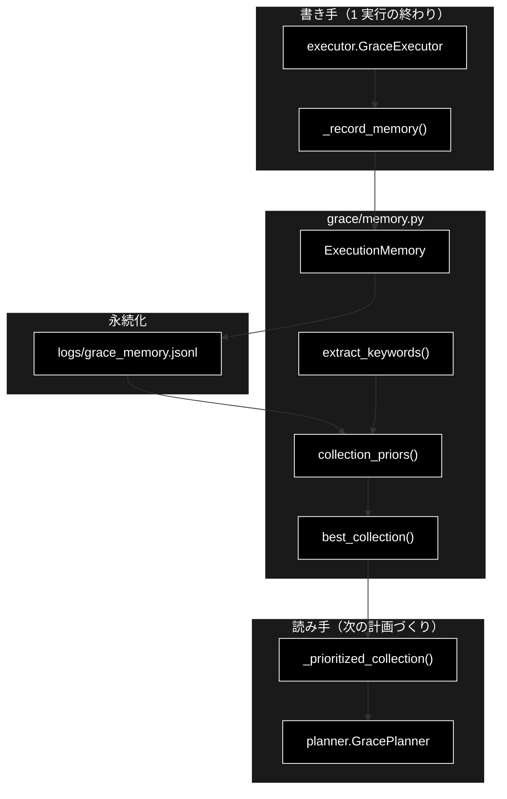
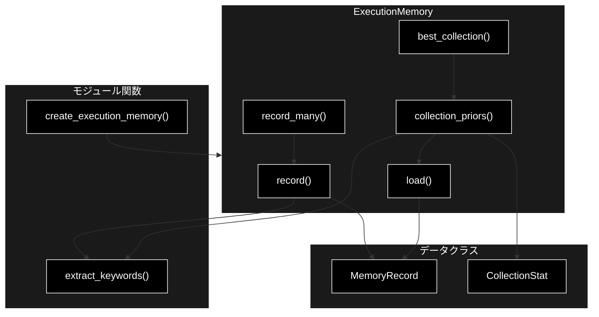
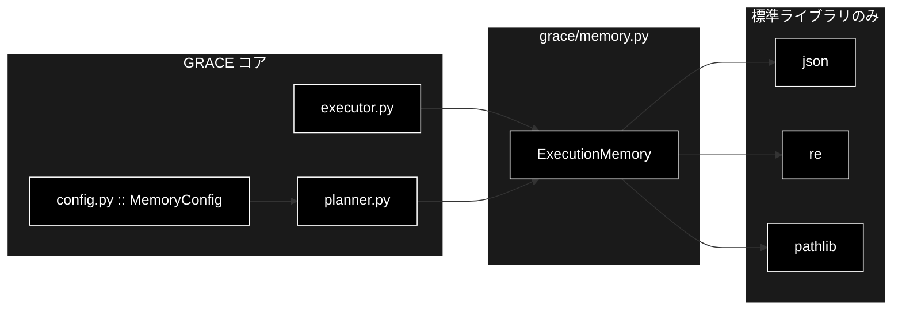

# memory.py - GRACE 実行メモリ層（P4） ドキュメント

**Version 1.3** | 最終更新: 2026-10-10

> **参考ドキュメント**
> - [`grace/docs/grace_data_flow.md`](./grace_data_flow.md) §3.3 — 実行メモリが貯まるまで（executor が書き、planner が読む流れの実例）
> - [`grace/docs/planner.md`](./planner.md) — 本モジュールの唯一の読み手（`_prioritized_collection()`）
> - [`grace/docs/executor.md`](./executor.md) — 本モジュールへの唯一の書き手（`_record_memory()`）

---

## 目次

- [概要](#概要)
- [1. アーキテクチャ構成図](#1-アーキテクチャ構成図)
- [2. モジュール構成図](#2-モジュール構成図)
- [3. クラス・関数一覧表](#3-クラス関数一覧表)
- [4. クラス・関数 IPO 詳細](#4-クラス関数-ipo-詳細)
- [5. 設定・定数](#5-設定定数)
- [6. 落とし穴](#6-落とし穴)
- [7. 変更履歴](#7-変更履歴)
- [付録: 依存関係図](#付録-依存関係図)

---

## 概要

`grace/memory.py` は、実行ログから **「(質問キーワード, 当たったコレクション, 成否, confidence)」**
を JSONL に蓄積し、Planner のコレクション優先順位に反映する層である。

「同じ種類の質問では、過去に当たったコレクションを先に見る」という**それだけの機構**で、
LLM も外部サービスも使わない。**外部依存なし・決定的**なので、そのまま単体テストできる。

### 主な責務

- 実行 1 回分のレコード（質問・キーワード・コレクション・成否・確信度）を JSONL へ追記する
- JSONL を読み込み、壊れた行を飛ばして残りを活かす
- コレクションごとに `success_rate`（Laplace 平滑化）× `mean_confidence` を集計し、score 降順で返す
- 十分な実績があるコレクションを 1 つだけ選ぶ（無ければ `None` ＝ 全コレクション検索）
- 除外対象コレクションを**飛ばして次点を採る**

### 各責務対応のモジュール

| # | 責務 | 対応モジュール | 説明 |
|---|------|--------------|------|
| 1 | JSONL への追記 | `grace/memory.py` | `ExecutionMemory.record()` / `record_many()`。レコードは `MemoryRecord`、キーワードは `extract_keywords()` |
| 2 | 破損行を飛ばした読み込み | `grace/memory.py` | `ExecutionMemory.load()` |
| 3 | コレクションごとの集計 | `grace/memory.py` | `ExecutionMemory.collection_priors()` と `CollectionStat`（`success_rate` / `score()`） |
| 4 | 実績が十分なときだけ 1 つ選ぶ | `grace/memory.py` / `grace/planner.py` | `ExecutionMemory.best_collection()`。呼び出し側は `Planner._prioritized_collection()` |
| 5 | 除外対象を飛ばして次点を採る | `grace/memory.py` | `best_collection(exclude=...)` の述語で候補から外す |

### 主要機能一覧

| 機能 | 説明 |
|------|------|
| `DEFAULT_MEMORY_PATH` | 既定の JSONL パス（`logs/grace_memory.jsonl`） |
| `extract_keywords()` | 形態素解析に依存しない軽量キーワード抽出（決定的） |
| `MemoryRecord` | 1 実行レコードのデータクラス |
| `CollectionStat` | コレクション単位の集計結果（件数・成功数・平均確信度） |
| `ExecutionMemory` | 蓄積と集計の本体 |
| `create_execution_memory()` | `ExecutionMemory` のファクトリ |

---

## 1. アーキテクチャ構成図

### 1.1 システム全体での位置づけ


```mermaid
flowchart TB
    subgraph WRITE["書き手（1 実行の終わり）"]
        EXEC["executor.GraceExecutor"]
        REC["_record_memory()"]
    end

    subgraph MEM["grace/memory.py"]
        EM["ExecutionMemory"]
        PRIORS["collection_priors()"]
        BEST["best_collection()"]
        KW["extract_keywords()"]
    end

    subgraph READ["読み手（次の計画づくり）"]
        PLANNER["planner.GracePlanner"]
        PRIO["_prioritized_collection()"]
    end

    subgraph STORE["永続化"]
        JSONL["logs/grace_memory.jsonl"]
    end

    EXEC --> REC
    REC --> EM
    EM --> JSONL
    JSONL --> PRIORS
    KW --> PRIORS
    PRIORS --> BEST
    BEST --> PRIO
    PRIO --> PLANNER
classDef default fill:#000,stroke:#fff,color:#fff
classDef subgraphStyle fill:#1a1a1a,stroke:#fff,color:#fff
class EXEC,REC,EM,PRIORS,BEST,KW,PLANNER,PRIO,JSONL default
style WRITE fill:#1a1a1a,stroke:#fff,color:#fff
style MEM fill:#1a1a1a,stroke:#fff,color:#fff
style READ fill:#1a1a1a,stroke:#fff,color:#fff
style STORE fill:#1a1a1a,stroke:#fff,color:#fff
```

### 1.2 データフロー

| 段階 | 入力 | 処理 | 出力 |
|---|---|---|---|
| 書き込み | `state.plan.original_query` / `state.used_collections` / 成否 / `overall_confidence` | `record_many()` → コレクションごとに `record()` | JSONL への追記（1 コレクション 1 行） |
| 読み込み | JSONL | `load()`（壊れた行はスキップ） | `list[MemoryRecord]` |
| 集計 | レコード列 ＋ 質問（任意） | キーワード overlap で絞る → コレクション別に集計 → `score()` 降順 | `list[CollectionStat]` |
| 採用 | `CollectionStat` 列 ＋ `min_count` / `min_score` / `exclude` | 条件を満たす先頭を返す | `Optional[str]` |

---

## 2. モジュール構成図

### 2.1 内部構成


```mermaid
flowchart TB
    subgraph FUNCS["モジュール関数"]
        EK["extract_keywords()"]
        CEM["create_execution_memory()"]
    end

    subgraph DATA["データクラス"]
        MR["MemoryRecord"]
        CS["CollectionStat"]
    end

    subgraph CLS["ExecutionMemory"]
        RECORD["record()"]
        RECMANY["record_many()"]
        LOAD["load()"]
        PRIORS2["collection_priors()"]
        BEST2["best_collection()"]
    end

    CEM --> CLS
    RECMANY --> RECORD
    RECORD --> MR
    RECORD --> EK
    LOAD --> MR
    PRIORS2 --> LOAD
    PRIORS2 --> EK
    PRIORS2 --> CS
    BEST2 --> PRIORS2
classDef default fill:#000,stroke:#fff,color:#fff
classDef subgraphStyle fill:#1a1a1a,stroke:#fff,color:#fff
class EK,CEM,MR,CS,RECORD,RECMANY,LOAD,PRIORS2,BEST2 default
style FUNCS fill:#1a1a1a,stroke:#fff,color:#fff
style DATA fill:#1a1a1a,stroke:#fff,color:#fff
style CLS fill:#1a1a1a,stroke:#fff,color:#fff
```

### 2.2 依存関係テーブル

| 依存先 | 用途 |
|---|---|
| `json`（標準） | JSONL の読み書き |
| `logging`（標準） | 書き込み失敗・破損行のスキップを警告として残す |
| `re`（標準） | キーワード抽出の正規表現 |
| `time`（標準） | `timestamp` の既定値 |
| `dataclasses` / `pathlib` / `typing`（標準） | データクラス・パス・型 |

> ✅ **サードパーティ依存も GRACE 内部への依存も無い。** LLM・Qdrant・API キーのいずれも不要で、
> `ExecutionMemory(path=tmp_path)` を渡すだけで単体テストできる。

---

## 3. クラス・関数一覧表

### 3.1 クラス一覧

| クラス | 種別 | 説明 |
|---|---|---|
| `MemoryRecord` | dataclass | 1 実行レコード（query / keywords / collection / success / confidence / timestamp） |
| `CollectionStat` | dataclass | コレクション単位の集計（collection / count / success_count / mean_confidence） |
| `ExecutionMemory` | class | 蓄積と集計の本体 |

### 3.2 関数一覧

| 関数・メソッド | 分類 | 説明 |
|---|---|---|
| `extract_keywords(text, top_n=8)` | モジュール関数 | 決定的なキーワード抽出 |
| `create_execution_memory(path=DEFAULT_MEMORY_PATH)` | モジュール関数 | `ExecutionMemory` の生成 |
| `MemoryRecord.to_dict()` | メソッド | JSON 化できる `dict` を返す |
| `MemoryRecord.from_dict(d)` | クラスメソッド | `dict` から復元（欠損キーは既定値） |
| `CollectionStat.success_rate` | プロパティ | `success_count / count`（count=0 なら 0.0） |
| `CollectionStat.score(alpha=1.0, beta=1.0)` | メソッド | Laplace 平滑化した成功率 × 平均確信度 |
| `ExecutionMemory.record(...)` | メソッド | 1 レコードを追記（best-effort） |
| `ExecutionMemory.record_many(...)` | メソッド | 複数コレクションをまとめて追記（重複は 1 回） |
| `ExecutionMemory.load()` | メソッド | JSONL を読む（破損行はスキップ） |
| `ExecutionMemory.collection_priors(...)` | メソッド | 事前分布を score 降順で返す |
| `ExecutionMemory.best_collection(...)` | メソッド | 採用するコレクションを 1 つ返す（無ければ `None`） |

---

## 4. クラス・関数 IPO 詳細

### 4.1 使用例

実行メモリは **executor が書き、planner が読む**（流れの全体は [`grace_data_flow.md` §3.3](./grace_data_flow.md#33-実行メモリの蓄積と読み戻し)）。
使い方は次の 4 通り。

| 処理パターン | 呼び方 | 向いている場面 | 例 |
|---|---|---|---|
| 記録して推奨を得る | `record` / `record_many` → `collection_priors` → `best_collection` | メモリ単体の動きを確かめる | 4.1.1 |
| 除外述語つきで推奨を得る | `best_collection(..., exclude=...)` | planner と同じ呼び方。除外対象のコレクションを飛ばして次点を採る | 4.1.2 |
| planner に使わせる | `config.memory.path` を指定して `create_planner(config)` | 貯めた実績で計画の `rag_search` を絞る | 4.1.3 |
| テストで使う | `create_execution_memory(str(tmp_path / "m.jsonl"))` | API キーも Qdrant も不要な単体テスト | 4.1.4 |

> 📝 4 本とも**そのまま実行し**、出力を確かめてある（2026-10-10。外部は使わない。ファイルは一時ディレクトリへ書いた。
> 4.1.3 は Qdrant のコレクション一覧だけをスタブにした。4.1.4 は pytest で実行した）。

#### 4.1.1 基本的なワークフロー（記録して推奨を得る）

```python
from grace.memory import create_execution_memory

memory = create_execution_memory("logs/grace_memory.jsonl")

# 1. 1 回の実行を記録する（使ったコレクションごとに 1 行。失敗も success=False で記録する）
memory.record_many(query="API のレート制限は？", collections=["saas_api_anthropic"], success=True, confidence=0.85)
print(memory.best_collection(query="API のエラーコード一覧"))   # まだ 1 件なので None

# 2. 実績を貯める
memory.record("API キーの再発行方法", "saas_api_anthropic", success=True, confidence=0.88)
memory.record("API の認証方式", "saas_api_anthropic", success=True, confidence=0.80)

# 3. キーワードが一致する実績で集計する（一致が 0 件なら全部の実績で集計する）
for stat in memory.collection_priors(query="API のエラーコード一覧"):
    print(f"{stat.collection}: count={stat.count} score={stat.score():.3f}")

# 4. 件数 >= 3 かつ スコア >= 0.6 なら、そのコレクションを推す
print(memory.best_collection(query="API のエラーコード一覧"))
```

```
# 出力例:
# None
# saas_api_anthropic: count=3 score=0.675
# saas_api_anthropic
```

> 📝 スコアは `(成功数 + 1) / (件数 + 2) × 平均信頼度`（Laplace 平滑化）。キーワードは形態素解析をしないので、
> 日本語は区切りまでが丸ごと 1 語になる（`extract_keywords("Python の歴史を教えて")` → `['python', 'の歴史を教えて']`）。
> 英語・カタカナ語・型番などの**独立した語が共通する質問どうし**でだけ、キーワードの一致が効く。

#### 4.1.2 除外述語つきで推奨を得る（planner の呼び方）

```python
from grace.memory import create_execution_memory

memory = create_execution_memory("logs/grace_memory_exclude.jsonl")
for _ in range(3):
    memory.record_many(query="住民票の写しの取り方", collections=["wikipedia_ja_5per", "gov_faq"],
                       success=True, confidence=0.9)

excluded = ["wikipedia"]   # config.qdrant.excluded_collections と同じ「部分一致」

print(memory.best_collection(query="住民票の写しの取り方"))
print(memory.best_collection(
    query="住民票の写しの取り方",
    min_count=3,
    min_score=0.6,
    exclude=lambda c: any(k in c for k in excluded),   # Planner._is_excluded と同じ判定
))
```

```
# 出力例:
# wikipedia_ja_5per
# gov_faq
```

> ⚠️ **除外対象は「飛ばして次点を採る」**（None を返さない）。`best_collection()` の戻り値は計画の `PlanStep.collection` に入り、
> `RAGSearchTool` から見ると運用者の明示指定と区別が付かないので、`exclude` を渡さないと `qdrant.excluded_collections` を素通りする
> （実測 2026-08-17: 天気の質問で誤採用されたコレクションが首位に居座り、無関係な質問でもそこが選ばれた）。

#### 4.1.3 planner に使わせる

```python
import copy

from grace.config import get_config
from grace.memory import create_execution_memory
from grace.planner import create_planner

config = copy.deepcopy(get_config())
config.memory.path = "logs/grace_memory_planner.jsonl"   # 試すときは本番の logs/grace_memory.jsonl と分ける

# 1. executor の代わりに実績を書き込む
memory = create_execution_memory(config.memory.path)
for q in ["API のレート制限は？", "API キーの再発行方法", "API の認証方式"]:
    memory.record(q, "saas_api_anthropic", success=True, confidence=0.85)

# 2. planner は計画を作るときにメモリへ相談し、rag_search の collection を絞る
plan = create_planner(config).create_plan("API のエラーコード一覧")
print([(s.action, s.collection) for s in plan.steps])
```

```
# 出力例:
# [('rag_search', 'saas_api_anthropic'), ('reasoning', None)]
```

> ⚠️ **`qdrant.excluded_collections`（既定で `wikipedia` / `cc_news` / `fineweb` / `livedoor` / `japanese_text` を部分一致で除外）に当たるコレクションは、
> 実績があっても選ばれない**（4.1.2）。上の例を `wikipedia_ja` で試すと `collection` は `None` のままになる。
>
> 📝 `config.memory.enabled = False` にすると planner も executor もメモリを使わない（読みも書きもしない）。

#### 4.1.4 テストで使う

```python
from grace.memory import create_execution_memory


def test_best_collection_skips_excluded(tmp_path):
    memory = create_execution_memory(str(tmp_path / "m.jsonl"))
    for _ in range(3):
        memory.record_many(query="住民票", collections=["bad", "gov_faq"], success=True, confidence=0.9)

    # 除外しなければ首位が返る
    assert memory.best_collection(query="住民票") in {"bad", "gov_faq"}

    # 除外すると次点が返る（None にはならない）
    assert memory.best_collection(query="住民票", exclude=lambda c: c == "bad") == "gov_faq"
```

API キーも Qdrant も不要で、pytest の `tmp_path` を渡すだけで完結する。

---

### 4.2 `extract_keywords()`

軽量なキーワード抽出。**形態素解析はしない。**

```python
def extract_keywords(text: str, top_n: int = 8) -> list[str]
```

| パラメータ | 型 | 既定 | 説明 |
|---|---|---|---|
| `text` | `str` | — | 抽出元の文字列。空なら `[]` |
| `top_n` | `int` | `8` | 返すキーワードの上限 |

| | 内容 |
|---|---|
| **Input** | 任意の文字列 |
| **Process** | 正規表現 `[A-Za-z0-9]{2,}` または `[一-鿿゠-ヿ぀-ゟ]{2,}` にマッチする連続を先頭から拾い、小文字化して**重複を除きながら**最大 `top_n` 件まで集める |
| **Output** | `list[str]`（出現順・小文字・重複なし） |

**戻り値例**

```python
extract_keywords("Python の歴史を教えて")
# → ["python", "の歴史を教えて"]
```

> ⚠️ **日本語は細かく分かれない。** 上の例のとおり、区切り（スペース・記号・英数）が来るまでの
> 日本語の連続が丸ごと 1 キーワードになる。したがってキーワード一致が効くのは
> **英語・カタカナ語・型番など「独立した語」が共通している質問どうし**に限られる。

### 4.3 `MemoryRecord`

```python
@dataclass
class MemoryRecord:
    query: str
    keywords: list[str]
    collection: Optional[str]
    success: bool
    confidence: float
    timestamp: float = field(default_factory=time.time)
```

| メソッド | 説明 |
|---|---|
| `to_dict()` | 上記 6 フィールドをそのまま `dict` にする |
| `from_dict(d)` | 欠損キーを既定値（`""` / `[]` / `None` / `False` / `0.0`）で埋めて復元する。型変換（`bool()` / `float()`）も行うので、手編集で崩れた値もそれなりに読める |

### 4.4 `CollectionStat`

```python
@dataclass
class CollectionStat:
    collection: str
    count: int
    success_count: int
    mean_confidence: float
```

#### `success_rate`（プロパティ）

`success_count / count`。`count == 0` のときは `0.0`（ゼロ除算しない）。

#### `score(alpha=1.0, beta=1.0)`

```python
def score(self, alpha: float = 1.0, beta: float = 1.0) -> float
```

| | 内容 |
|---|---|
| **Input** | 平滑化パラメータ `alpha` / `beta` |
| **Process** | `smoothed_sr = (success_count + alpha) / (count + alpha + beta)` を計算し、`mean_confidence` を掛ける |
| **Output** | `float` |

**なぜ平滑化するのか**: 1 件だけ成功したコレクションの `success_rate` は 1.0 になる。
生の成功率で並べると**実績 1 件が実績 20 件を追い抜く**。Laplace 平滑化はこれを抑え、
件数が増えるほど生の成功率へ近づく。

**計算例**（`count=3, success_count=3, mean_confidence≈0.843`）:

```
smoothed_sr = (3 + 1) / (3 + 1 + 1) = 0.8
score       = 0.8 × 0.843 ≈ 0.674
```

### 4.5 `ExecutionMemory.record()`

```python
def record(self, query: str, collection: Optional[str], success: bool,
           confidence: float, keywords: Optional[list[str]] = None) -> None
```

| | 内容 |
|---|---|
| **Input** | 質問文・コレクション名・成否・確信度（`keywords` 省略時は `extract_keywords(query)`） |
| **Process** | `MemoryRecord` を作り、親ディレクトリを `mkdir(parents=True, exist_ok=True)` してから JSONL へ 1 行追記 |
| **Output** | `None` |

> ⚠️ **書き込みは best-effort。** 例外は `try/except` で握って `logger.warning` を出すだけで、
> **実行は止めない。** メモリはあくまで補助であり、書けないことを理由にユーザーの質問を
> 失敗させる理由が無い。

### 4.6 `ExecutionMemory.record_many()`

```python
def record_many(self, query: str, collections: list[Optional[str]], success: bool,
                confidence: float, keywords: Optional[list[str]] = None) -> None
```

| | 内容 |
|---|---|
| **Input** | 1 実行で使ったコレクションのリスト |
| **Process** | キーワードを**一度だけ**抽出して使い回し、`seen` で重複を除きながら `record()` を呼ぶ |
| **Output** | `None`（JSONL に「使ったコレクション数」行が追記される） |

### 4.7 `ExecutionMemory.load()`

```python
def load(self) -> list[MemoryRecord]
```

| | 内容 |
|---|---|
| **Input** | なし（`self.path`） |
| **Process** | ファイルが無ければ `[]`。1 行ずつ `json.loads` → `MemoryRecord.from_dict`。**行単位で `try/except`** し、壊れた行だけ飛ばす。`OSError` は警告して `[]` 相当で返す |
| **Output** | `list[MemoryRecord]` |

> ⚠️ **`try` が `for` 全体を囲んでいた頃は、1 行目以外の破損でそれ以降が丸ごと失われていた。**
> JSONL は追記専用なので、マージコンフリクトのマーカー混入・書き込み中断・手編集ミスで
> 壊れた行が混ざりうる。現在は破損行数を `logger.warning` に出したうえで残りを活かす。

### 4.8 `ExecutionMemory.collection_priors()`

```python
def collection_priors(self, query: Optional[str] = None,
                      min_keyword_overlap: int = 1) -> list[CollectionStat]
```

| パラメータ | 型 | 既定 | 説明 |
|---|---|---|---|
| `query` | `Optional[str]` | `None` | 指定するとキーワードが overlap するレコードだけを対象にする |
| `min_keyword_overlap` | `int` | `1` | overlap とみなすキーワード共通数の下限 |

| | 内容 |
|---|---|
| **Input** | JSONL の全レコード ＋ 質問（任意） |
| **Process** | ① `load()`。空なら `[]` ② `query` 指定時はキーワード overlap でフィルタ。**0 件なら全レコードへフォールバック** ③ `collection` が `None` のレコードは常に除外 ④ コレクション別に件数・成功数・確信度合計を集計 ⑤ `score()` 降順でソート |
| **Output** | `list[CollectionStat]` |

> ⚠️ **overlap 0 件のときのフォールバックが、誤学習を広く効かせてしまう入口になる。**
> 「天気」の質問で誤採用されたコレクションが全体集計の首位に居ると、
> キーワードがまったく重ならない質問（例:「住民票の写しの取り方は？」）でも
> そのコレクションが返る。対策は `best_collection(exclude=...)` 側にある（§4.9）。

### 4.9 `ExecutionMemory.best_collection()`

```python
def best_collection(self, query: Optional[str] = None,
                    min_count: int = 3, min_score: float = 0.6,
                    exclude: Optional[Callable[[str], bool]] = None) -> Optional[str]
```

| パラメータ | 型 | 既定 | 説明 |
|---|---|---|---|
| `query` | `Optional[str]` | `None` | `collection_priors()` へそのまま渡す |
| `min_count` | `int` | `3` | この件数未満の実績は採用しない |
| `min_score` | `float` | `0.6` | `score()` の下限 |
| `exclude` | `Optional[Callable[[str], bool]]` | `None` | `True` を返したコレクションを候補から外す述語 |

| | 内容 |
|---|---|
| **Input** | 上記 |
| **Process** | `collection_priors(query=query)` を score 降順で走査し、`count < min_count` / `score() < min_score` / `exclude(...) is True` のいずれかに当たる要素は **`continue` で飛ばす**。最初に全条件を満たしたコレクション名を返す |
| **Output** | `Optional[str]`（該当なしは `None` ＝ 全コレクション検索） |

> ⚠️ **除外対象は「飛ばして次点を採る」。諦めて `None` を返さない。**
>
> 除外対象に当たった時点で `None` を返す実装にすると、**メモリ機構そのものが事実上死ぬ**。
> 誤学習されたコレクションが首位に居座る限り毎回 `None`（＝全コレクション検索）になるからだ。
> `collection_priors` は score 降順なので、除外分を読み飛ばせば正当な次点を拾える。
>
> この設計のおかげで、**古い誤学習レコードを消さなくても無害になる**
> （ログファイルの削除は不可逆なので、運用者に強いたくない）。

### 4.10 `create_execution_memory()`

```python
def create_execution_memory(path: str = DEFAULT_MEMORY_PATH) -> ExecutionMemory
```

`ExecutionMemory(path=path)` を返すだけのファクトリ。

---

## 5. 設定・定数

### 5.1 モジュール定数

| 定数 | 値 | 説明 |
|---|---|---|
| `DEFAULT_MEMORY_PATH` | `"logs/grace_memory.jsonl"` | 既定の JSONL パス |
| `_KEYWORD_RE` | `[A-Za-z0-9]{2,}\|[一-鿿゠-ヿ぀-ゟ]{2,}` | キーワード抽出の正規表現（非公開） |

### 5.2 `config.MemoryConfig`

採用条件は `grace/config.py` の `MemoryConfig` が持ち、Planner が `best_collection()` へ渡す。

| フィールド | 既定 | 説明 |
|---|---|---|
| `enabled` | `True` | `False` なら Planner/Executor がメモリを持たない（＝機構ごと無効） |
| `path` | `"logs/grace_memory.jsonl"` | JSONL の保存先 |
| `min_count` | `3` | `best_collection()` の採用に必要な実績件数 |
| `min_score` | `0.6` | `best_collection()` の採用に必要なスコア |

> 📝 `min_count=3` は「最初の数回は手探り、貯まってきたら絞る」ための下限。
> 実績が薄いコレクションへ早まって固定しないためにある。

---

## 6. 落とし穴

| 論点 | 実際の挙動 |
|---|---|
| 日本語のキーワード一致 | 形態素解析をしないため、日本語部分は丸ごと 1 語になる。**英数字・カタカナ語が共通する質問どうし**でしか overlap しない |
| overlap 0 件 | エラーにならず**全レコードの集計へフォールバック**する。無関係な質問に他分野の首位が返りうる |
| 失敗も記録される | `success=False` のレコードも貯まり、スコアを下げるのに使われる。「このコレクションはこの質問では外しやすい」も学習対象 |
| `used_collections` が空 | Executor 側で記録しない（Web のみ・`ask_user` のみの実行は学習対象外） |
| 書き込み失敗 | 警告だけ出して実行は続く。メモリが無くても GRACE は動く |
| JSONL の破損 | 壊れた行だけ飛ばす。全件は捨てない |

---

## 7. 変更履歴

| バージョン | 日付 | 変更内容 |
|---|---|---|
| 1.0 | — | 初版作成。実装（`grace/memory.py` 全 247 行）と突き合わせ、公開シンボル 11 件（`extract_keywords` / `MemoryRecord`＋2 メソッド / `CollectionStat`＋2 / `ExecutionMemory`＋5 / `create_execution_memory`）を IPO 形式で網羅。`best_collection(exclude=...)` の「飛ばして次点を採る」設計意図、`collection_priors` の overlap 0 件フォールバック、`load()` の行単位の破損耐性、Laplace 平滑化の理由を実コードのコメントから起こして記載 |
| 1.1 | 2026-09-14 | 使用例を「## 6. 使用例」から IPO 詳細セクション冒頭の `4.1 使用例` へ移動（フォーマット仕様 v1.6 §6.1）。これに伴い既存の `### 4.N` を 1 つずつ繰り下げ、章番号を 落とし穴 → `## 6.` / 変更履歴 → `## 7.` へ繰り上げ（2026-09-14）。あわせて `best_collection` の注記の内部参照を §4.8 → §4.9 へ是正 |
| 1.2 | 2026-09-24 | 概要の「各責務対応のモジュール」を主な責務と 1:1 に揃えた（基本フォーマット §2.4。2026-09-24）（「対応する要素」2 列・8 行を、基本フォーマットの 4 列・5 行へ置き換えた） |
| 1.3 | 2026-10-10 | §4.1 使用例を処理パターン 4 通り（記録して推奨を得る・除外述語つき・planner に使わせる・テストで使う）に書き直し、実行して出力を確かめた（テストの例は pytest で実行）。旧 4.1.2 は単独で動かない断片だった。例のコレクションを `wikipedia_ja` から `saas_api_anthropic` に替えた（`wikipedia` は既定の `qdrant.excluded_collections` に当たり、planner が選ばないため）。参考ドキュメントのリンクを `grace_data_flow.md` §3.3 へ |

---

## 付録: 依存関係図


```mermaid
flowchart LR
    subgraph GRACE["GRACE コア"]
        PLANNER2["planner.py"]
        EXECUTOR2["executor.py"]
        CONFIG2["config.py :: MemoryConfig"]
    end

    subgraph THIS["grace/memory.py"]
        API["ExecutionMemory"]
    end

    subgraph STD["標準ライブラリのみ"]
        JSON2["json"]
        RE2["re"]
        PATH2["pathlib"]
    end

    EXECUTOR2 --> API
    PLANNER2 --> API
    CONFIG2 --> PLANNER2
    API --> JSON2
    API --> RE2
    API --> PATH2
classDef default fill:#000,stroke:#fff,color:#fff
classDef subgraphStyle fill:#1a1a1a,stroke:#fff,color:#fff
class PLANNER2,EXECUTOR2,CONFIG2,API,JSON2,RE2,PATH2 default
style GRACE fill:#1a1a1a,stroke:#fff,color:#fff
style THIS fill:#1a1a1a,stroke:#fff,color:#fff
style STD fill:#1a1a1a,stroke:#fff,color:#fff
```
