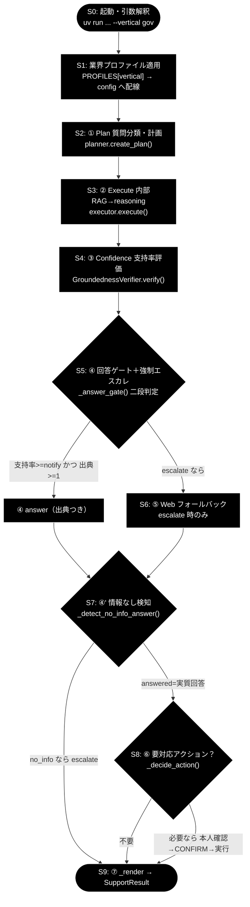

# step_trace ドキュメント索引

**Version 1.1** | 最終更新: 2026-07-10

`grace/step_trace/` のトレース用スタブ群（`agent_support_example.py` の `run_support_agent()` を
S0〜S9 の 1 ステップずつに分解し、**IN → Process → OUT** を標準出力に示すツール）の
モジュールドキュメント一覧。各 doc は「概要 / 責務 / 1. アーキテクチャ構成図（回答判定フロー） /
1.1 ソース構成図 / 2. 回答ポリシー（groundedness ゲート） / 7. プログラム構成（実装済み関数 ＋ IPO 詳細） /
7.6 クラス・関数 IPO 詳細 / 8. CLI 仕様 / 依存関係 / 変更履歴」で統一されている。

## 全体フロー（S0〜S9 の位置づけ）



## ステップ対応表

「実行要件」は実データでトレースする場合に必要な環境。**どのステップも鍵・Qdrant なしで動き**、
その場合は代表サンプルで IN/Process/OUT の構造だけを示す（LLM 分岐はスキップ）。

| ステップ | モジュール | ドキュメント | フロー図ノード | 役割 | 実行要件（実データ時） |
|---------|-----------|------------|--------------|------|--------------------|
| S0 | `s0_arg.py` | [s0_arg.md](./s0_arg.md) | `Q` | 起動・引数解釈（argparse → args / identity） | なし |
| S1 | `s1_profile.py` | [s1_profile.md](./s1_profile.md) | `PROF` | 業界プロファイル適用（gov/saas/ec を config へ配線） | なし |
| S2 | `s2_plan.py` | [s2_plan.md](./s2_plan.md) | `CLS` | ① Plan（質問分類・計画） | `ANTHROPIC_API_KEY` |
| S3 | `s3_execute.py` | [s3_execute.md](./s3_execute.md) | `RAG` | ② Execute（内部 RAG → reasoning） | `ANTHROPIC_API_KEY` ＋ Qdrant（コレクション登録済み） |
| S4 | `s4_confidence.py` | [s4_confidence.md](./s4_confidence.md) | `GND` | ③ Confidence（支持率評価） | `ANTHROPIC_API_KEY`（Qdrant 不要） |
| S5 | `s5_gate.py` | [s5_gate.md](./s5_gate.md) | `GATE` | ④ 回答ゲート＋強制エスカレ（二段判定） | なし（意図分類の第 2 段のみ鍵） |
| S6 | `s6_web.py` | [s6_web.md](./s6_web.md) | `WEB` | ⑤ Web フォールバック（escalate 時のみ） | なし（⑤ 進入時の web_search は Web バックエンド設定に依存） |
| S7 | `s7_no_info.py` | [s7_no_info.md](./s7_no_info.md) | `NOINFO` | ④' 情報なし回答検知 | なし（第 2 段の実質回答判定のみ鍵） |
| S8 | `s8_action.py` | [s8_action.md](./s8_action.md) | `ACT` | ⑥ Action（本人確認→CONFIRM→実行） | なし（既定 dry-run。意図分類のみ鍵） |
| S9 | `s9_render.py` | [s9_render.md](./s9_render.md) | `OUT` | ⑦ 応答整形（SupportResult） | なし |

## 共通事項

- 各スタブは**実コード（`grace` / `agent_support_example`）をそのまま呼ぶ**。`ANTHROPIC_API_KEY` /
  Qdrant があれば本物のデータでトレースし、無ければ代表サンプルで IN/Process/OUT の構造だけを示す。
- 共有ヘルパ `_trace.py`（`banner` / `ipo` / `have_key` / `note_no_key` / `quiet_logs`）を全 sN が使用。
  `quiet_logs()` が実行基盤・`httpx` の INFO ログを抑制する（`GRACE_TRACE_VERBOSE=1` で従来通り表示）。
- **CLI は S0〜S9 で共通の書式**（`--vertical {gov,saas,ec}` ＋ 位置引数 `query`）。同じコマンドの
  `sN` だけを差し替えて、各ステップの入出力を順に追える:
  ```bash
  uv run python grace/step_trace/s1_profile.py --vertical gov "住民票の写しの取り方は？"
  uv run python grace/step_trace/s7_no_info.py --vertical ec            # 候補句あり→第2段判定の例
  uv run python grace/step_trace/s9_render.py  --vertical ec "返品したい"
  ```
  ステップ固有の補助引数もある（S5 `--support-rate`、S6 `--decision/--force-escalate/--no-web`、
  S7 `--answer/--web-only`、S8 `--decision` 等。詳細は各 doc の「8. CLI 仕様」）。
  なお S7 の `--vertical` は業界別サンプル（query/answer 既定値）の切り替え、S9 の `query` は
  表示用（整形処理は SupportResult のみに依存）で、検知・整形ロジック自体は業界共通。

## 関連ドキュメント

- 設計書: [`../../doc/agent_support_example.md`](../../doc/agent_support_example.md)
- 1 コマンド実行トレース: [`../../doc/agent_support_example_flow.md`](../../doc/agent_support_example_flow.md)
- 業界特化の全体設計: [`../../doc/agent_support_verticals.md`](../../doc/agent_support_verticals.md)

## 変更履歴

| バージョン | 変更内容 |
|-----------|---------|
| 1.1 | 全体フロー図（S0〜S9 の位置づけ）とステップ別の実行要件列を追加。S0/S7/S9 の改修（共通 CLI 書式への統一・S0 の IN/Process/OUT 表示と identity dict 化・S9 の業界別代表例）と S3 の失敗時ヒント表示を反映（2026-07-10） |
| 1.0 | 初版。S0〜S9 の 10 モジュール doc と本索引を作成（2026-07-09） |
