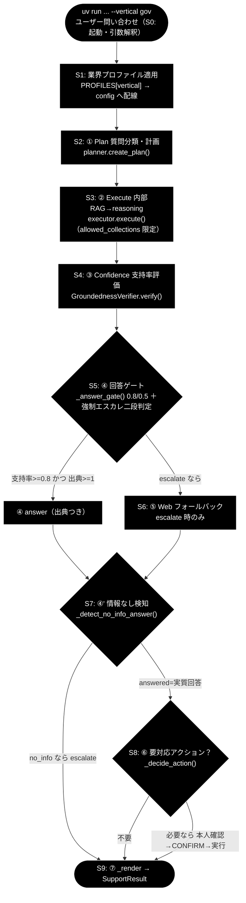
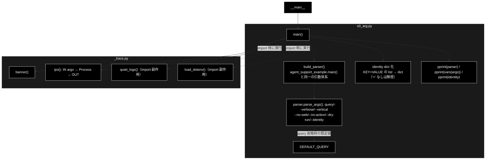

# s0_arg.py - S0. 起動・引数解釈（argparse 入口スタブ） ドキュメント
**Version 1.2** | 最終更新: 2026-07-10

## 目次
- [概要](#概要)
- [責務](#責務)
- [1. アーキテクチャ構成図（回答判定フロー）](#1-アーキテクチャ構成図回答判定フロー)
  - [1.1 ソース構成図（本モジュールの呼び出し構造）](#11-ソース構成図本モジュールの呼び出し構造)
- [2. 回答ポリシー（groundedness ゲート）](#2-回答ポリシーgroundedness-ゲート)
- [7. プログラム構成（実装済み関数 ＋ IPO 詳細）](#7-プログラム構成実装済み関数--ipo-詳細)
  - [7.6 クラス・関数 IPO 詳細](#76-クラス関数-ipo-詳細)
- [8. CLI 仕様](#8-cli-仕様)
- [依存関係](#依存関係)
- [変更履歴](#変更履歴)

## 概要

`s0_arg.py` は、GRACE-Support のトレース用スタブ群（`grace/step_trace/s0_arg.py` 〜 `s9_*.py`）の
**入口**であり、`agent_support_example.py` の `main()` のうち **「S0＝起動・引数解釈」だけ**を
取り出したスタブである（モジュール docstring にもこの S0 の位置づけを明記している）。
実際の回答生成（RAG・reasoning・支持率評価・ゲート判定など）は行わず、`argparse` が
コマンドライン引数からどのような `args`（`Namespace`）を組み立てるか、および
`--identity KEY=VALUE`（複数指定可）が `run_support_agent()` へ渡る前にどう **dict 化**
されるかを、他の `sN` と同じ `_trace.banner()` / `_trace.ipo()` の
**IN → Process → OUT** 体裁で標準出力に示すことに特化している。

- パーサ構築は `build_parser()` 関数に分離されており、`agent_support_example.main()` と
  **同一の引数体系**を返す。`main()` はこれを使って `parse_args()` し、`--identity` の
  dict 化（`main()` と同じ後処理）まで行う。
- 各 `sN_*.py` は先頭で `_trace` を import し、その **import 時の副作用**として
  `quiet_logs()`（実行基盤（`grace.config` / `httpx` 等）の初期化 INFO ログを WARNING へ
  引き上げ）と `load_dotenv()`（`.env` 読み込み）が実行される。`s0_arg.py` も同様で、
  従来あった明示的な `quiet_logs()` 呼び出しと独自の `load_dotenv()` ブロックは
  重複のため削除された。
- ログ抑制を無効化して従来どおり INFO を見たいときは、環境変数 `GRACE_TRACE_VERBOSE=1` を
  設定する（`_trace.quiet_logs()` が先頭で return し、抑制をスキップする）。
- **s0 自体は LLM を一切呼ばない。** 後続ステップが用いる LLM は Anthropic Claude
  （既定 `claude-sonnet-4-6`、軽量 `claude-haiku-4-5-20251001`、鍵 `ANTHROPIC_API_KEY`）、
  Embedding は Gemini `gemini-embedding-001`（3072 次元、鍵 `GOOGLE_API_KEY`）だが、
  s0 の責務は引数解釈のみで、これらの鍵が無くても動作する。

## 責務

- `build_parser()` で `argparse.ArgumentParser` を構築し、位置引数 `query` と各オプション
  （`--verbose` / `--vertical` / `--no-web` / `--no-action` / `--dry-run` / `--identity`）を
  `agent_support_example.main()` と同一の引数体系として定義する。
- `--identity KEY=VALUE`（`append`・list）を `main()` 内で **dict へ変換**する
  （`agent_support_example.main()` と同じ後処理。`"="` を含まない指定は黙って無視される）。
  この `identity` が `run_support_agent(identity=...)` へ渡る形である。
- 他の `sN` と同様に `_trace.banner()` / `_trace.ipo()` で
  **IN（`argv=sys.argv[1:]`）→ Process（パーサ構築→`parse_args()`→identity dict 化）→
  OUT（`vars(args)` と `identity`）** のトレースを表示する。
- 解釈結果（`parser` / `vars(args)` / `identity`）を `pprint` で表示し、後続ステップへ渡る
  `Namespace` と identity dict の形を確認できるようにする。
- `_trace` の **import 時の副作用**として、`quiet_logs()` による実行基盤 INFO ログの抑制
  （`GRACE_TRACE_VERBOSE=1` で復帰）と `load_dotenv()` による `.env` 読み込み
  （`python-dotenv` 未導入でも継続）が適用される（s0 側での明示呼び出し・独自ブロックは廃止）。

## 1. アーキテクチャ構成図（回答判定フロー）



**本モジュールの位置づけ**: `s0_arg.py` は上図の起点 `Q（uv run 起動）` に対応する。
すなわち S0＝ユーザーが `uv run` でコマンドを起動した直後の「起動・引数解釈」だけを担い、
以降の `PROF`（S1）以降のステップは行わない。s0 の出力（`args`）が後続フローの入力となる。

### 1.1 ソース構成図（本モジュールの呼び出し構造）

上図が S0〜S9 全体の共通フローであるのに対し、本節は `grace/step_trace/s0_arg.py`
**そのもの**の呼び出し構造を示す。s0 は `from _trace import banner, ipo` の **import 時の
副作用**として `quiet_logs()` と `load_dotenv()` が適用され、`main()` では
`build_parser()` で `args` を組み立て、`--identity` を dict 化し、`banner()` / `ipo()` の
トレースと `pprint` 表示を行うだけで、`grace` 本体や LLM は一切呼ばない。



> `QL`（`quiet_logs()`）と `ENV`（`load_dotenv()`）は `_trace` モジュール import 時点で
> 実行されるトップレベル副作用であり、`main()` の実行フローとは厳密には独立している
> （図では点線＋「import 時に実行」ラベルで表現）。s0 側に明示的な `quiet_logs()` 呼び出しや
> 独自の `load_dotenv()` ブロックは無い（v1.2 で重複を解消）。`main()` 本体が能動的に呼ぶのは
> `build_parser()`・`parse_args()`・identity dict 化・`banner()`/`ipo()`・`pprint` のみ。

## 2. 回答ポリシー（groundedness ゲート）

`GroundednessVerifier` の支持率(support_rate)と出典数で分岐する。gov プロファイルのしきい値は
`notify_th=0.8 / confirm_th=0.5`（業種で最も厳格）。

| 状態 | 条件 | decision | 振る舞い |
|------|------|----------|---------|
| 自信あり | verified かつ 出典≥1 かつ 支持率≥notify_th（gov=0.8） | `answer` | 出典つきで自動回答 |
| 要注意 | confirm_th≤支持率<notify_th（gov=0.5〜0.8） | `answer`（warning=True） | 「未確認の注意書き」つきで回答 |
| わからない | 支持率<confirm_th または 出典0／verified=False | `escalate` | Web フォールバック→なお不足なら有人エスカレ |

> 設計意図: 「根拠のない断定を構造的に出さない」。支持率が低い＝出典で裏付けられない回答は自動的に“わからない”へ倒す。強制エスカレ（S5）・情報なし検知（S7）は二段判定で追加の安全弁を成す。

> **s0 の位置づけ（注記）**: s0 自体はこの groundedness ゲートには関与しない。ここでは全体像として
> ポリシーを掲載しているが、s0 は上表の判定へ入る**前段の入口**（引数解釈）であり、支持率・出典・
> decision といったゲート判定は S4〜S5 以降のステップが担う。

## 7. プログラム構成（実装済み関数 ＋ IPO 詳細）

| 種別 | 名前 | 概要 |
|------|------|------|
| 定数 | `DEFAULT_QUERY` | 位置引数 `query` 省略時の既定質問（`"パスワードを忘れました"`） |
| 関数 | `build_parser()` | `agent_support_example.main()` と同一の引数体系の `ArgumentParser` を構築して返す |
| 関数 | `main()` | `build_parser()` → `parse_args()` → `--identity` の dict 化を行い、`banner()`/`ipo()` で IN/Process/OUT を表示したうえで `parser` / `vars(args)` / `identity` を `pprint` 表示する |

### 7.6 クラス・関数 IPO 詳細

#### `build_parser()`

**概要**: `agent_support_example.main()` と**同一の引数体系**の `argparse.ArgumentParser` を
構築して返す。パーサ定義だけを関数に分離したもので、引数の解釈（`parse_args()`）や表示は
行わない。

**シグネチャ**:
```python
def build_parser() -> argparse.ArgumentParser
```

**定義する引数（argparse 引数）**:

| 引数 | 型・action | 既定 | 説明 |
|------|-----------|------|------|
| `query` | 位置引数（`nargs="?"`, str） | `DEFAULT_QUERY`（`"パスワードを忘れました"`） | 問い合わせ内容（省略時は既定の質問を使用） |
| `-v`, `--verbose` | `store_true`（bool） | `False` | 支持率の内訳（supported/total/矛盾）など詳細を表示する |
| `--vertical` | `choices=["gov","saas","ec"]` | `None` | 業界プロファイルを適用（gov=自治体 / saas / ec） |
| `--no-web` | `store_false`（dest=`use_web`） | `use_web=True` | Web フォールバックを無効化する（内部RAGのみ） |
| `--no-action` | `store_false`（dest=`do_action`） | `do_action=True` | アクション（v3）を無効化する |
| `--dry-run` | `BooleanOptionalAction`（dest=`dry_run`） | `True` | アクションを実行せずログのみ（既定 ON。`--no-dry-run` で実連携/擬似実行） |
| `--identity` | `append`（`metavar="KEY=VALUE"`） | `None` | 本人確認の識別子（例: `--identity order_id=1001`。`--no-dry-run` 時に `SUPPORT_IDENTITY_FILE` の台帳と照合） |

**IPO テーブル**:

| 段 | 内容 |
|----|------|
| **Input** | なし（引数なし） |
| **Process** | `argparse.ArgumentParser(description=...)` を生成し、上表の 7 引数（`query` / `-v,--verbose` / `--vertical` / `--no-web` / `--no-action` / `--dry-run` / `--identity`）を `add_argument()` で定義 |
| **Output** | 構築済みの `argparse.ArgumentParser`（`agent_support_example.main()` と同一の引数体系） |

**戻り値例**:
```python
ArgumentParser(prog='s0_arg.py', usage=None,
               description='GRACE-Support: 内部RAG＋出典／Web裏取り・相互検証／アクション＋HITL／業界特化(--vertical)',
               ...)
```

**使用例**:
```python
parser = build_parser()
args = parser.parse_args()
```

#### `main()`

**概要**: `build_parser()` でパーサを構築して `argv` を解釈し、後続 `sN` と同じ引数体系の
`Namespace` を作る。さらに `agent_support_example.main()` と同じ後処理として
`--identity KEY=VALUE`（list）を dict へ変換し（`"="` を含まない指定は黙って無視）、
`_trace.banner()` / `_trace.ipo()` で **IN → Process → OUT** を表示したうえで、
`parser` / `vars(args)` / `identity` を `pprint` で表示する。LLM 呼び出しや RAG は行わない。

**シグネチャ**:
```python
def main() -> None
```

**パラメータ（argparse 引数）**: `build_parser()` の定義表を参照（同一）。

**IPO テーブル**:

| 段 | 内容 |
|----|------|
| **Input** | `argv`＝`sys.argv[1:]`（コマンドライン引数。例: `["--vertical", "ec", "返品したい", "--identity", "order_id=1001"]`） |
| **Process** | `build_parser()` でパーサ構築 → `parser.parse_args()` で `argv` を解釈 → `args.identity`（list）を `dict(pair.split("=", 1) for pair in args.identity if "=" in pair)` で dict 化（未指定なら `identity=None`、`"="` を含まない指定は無視）。`_trace` import の副作用で `quiet_logs()` 適用済み（`GRACE_TRACE_VERBOSE=1` で INFO 復帰） |
| **Output** | 標準出力に `banner()` 見出しと `ipo()`（IN=`argv` / Process=構築→解釈→dict 化 / OUT=`vars(args)` と `identity`）を表示し、続けて `parser` / `vars(args)` / `identity` を `pprint` 表示。戻り値は `None` |

**出力例**（`--vertical ec "返品したい" --identity order_id=1001` 実行時のイメージ）:
```text
============================================================
S0. 起動・引数解釈（argparse → args / identity）
============================================================
IN     : argv=['--vertical', 'ec', '返品したい', '--identity', 'order_id=1001']
Process: build_parser() で main() と同一の引数体系を構築 → parser.parse_args()
         --identity KEY=VALUE（append）を dict へ変換（'=' を含まない指定は無視）
         この args / identity が run_support_agent(query, verbose, use_web, ...) の入力になる
OUT    : vars(args) と identity（下記に pprint 表示）

parser=:
ArgumentParser(prog='s0_arg.py', ...)
args=:
{'do_action': True,
 'dry_run': True,
 'identity': ['order_id=1001'],
 'query': '返品したい',
 'use_web': True,
 'verbose': False,
 'vertical': 'ec'}
identity=:
{'order_id': '1001'}
```

**使用例**:
```bash
uv run python grace/step_trace/s0_arg.py --vertical gov "住民票の写しの取り方は？"
uv run python grace/step_trace/s0_arg.py --vertical ec "返品したい" --identity order_id=1001
```

## 8. CLI 仕様

| 引数 | 型・action | 既定 | 説明 |
|------|-----------|------|------|
| `query` | 位置引数（`nargs="?"`） | `DEFAULT_QUERY`（`"パスワードを忘れました"`） | 問い合わせ内容 |
| `-v`, `--verbose` | `store_true` | `False` | 詳細（支持率の内訳など）を表示 |
| `--vertical {gov,saas,ec}` | `choices` | `None` | 業界プロファイルを適用 |
| `--no-web` | `store_false`（`use_web`） | `use_web=True` | Web フォールバックを無効化 |
| `--no-action` | `store_false`（`do_action`） | `do_action=True` | アクション（v3）を無効化 |
| `--dry-run` / `--no-dry-run` | `BooleanOptionalAction`（`dry_run`） | `True` | 既定は dry-run。`--no-dry-run` で実連携/擬似実行 |
| `--identity KEY=VALUE` | `append` | `None` | 本人確認の識別子（複数指定可） |

> 引数体系は v1.1 から変更なし。出力には `parser` / `vars(args)` に加えて、
> `--identity` を dict 化した `identity`（例: `--identity order_id=1001` →
> `{'order_id': '1001'}`、未指定なら `None`）の pprint 表示、および
> `banner()` / `ipo()` による IN/Process/OUT トレースが含まれる。

**実行例（uv run）**:
```bash
# gov（自治体）
uv run python grace/step_trace/s0_arg.py --vertical gov "住民票の写しの取り方は？"

# saas（Web フォールバック無効）
uv run python grace/step_trace/s0_arg.py --vertical saas "APIのレート制限は？" --no-web

# ec（本人確認の識別子つき）
uv run python grace/step_trace/s0_arg.py --vertical ec "返品したい" --identity order_id=1001
```

## 依存関係

| 種別 | 対象 | 用途 |
|------|------|------|
| 内部 | `_trace`（`grace/step_trace/_trace.py`） | `banner()` / `ipo()` による IN/Process/OUT トレース表示。import 時の副作用として `quiet_logs()`（実行基盤 INFO ログ抑制。`GRACE_TRACE_VERBOSE=1` で復帰）と `load_dotenv()`（`.env` 読み込み）が適用される |
| 標準ライブラリ | `argparse` | 引数パーサの構築（`build_parser()`）・解釈 |
| 標準ライブラリ | `pprint` | `parser` / `vars(args)` / `identity` の整形表示 |
| 標準ライブラリ | `sys` | `sys.argv[1:]` を IN トレース（`ipo()`）に表示 |
| 標準ライブラリ | `typing`（`Dict` / `Optional`） | `identity: Optional[Dict[str, str]]` の型ヒント |
| 外部（任意） | `python-dotenv`（`load_dotenv`） | `.env` からの環境変数読み込み（**`_trace` 経由**の import 副作用。未導入でも継続） |

## 変更履歴

| バージョン | 日付 | 変更内容 |
|-----------|------|---------|
| 1.2 | 2026-07-10 | ソース改修（トレース強化）を反映: `banner()`/`ipo()` による IN（`argv`）/Process/OUT 表示の追加、`--identity KEY=VALUE` の dict 化と `identity` の pprint 表示の追加、パーサ構築の `build_parser()` 分離（§7/§7.6 に IPO 詳細を追加）、明示的 `quiet_logs()` 呼び出し・独自 `load_dotenv()` ブロックの削除（`_trace` import 副作用へ一本化）、モジュール docstring 追加。§1.1 ソース構成図・依存関係表を更新 |
| 1.1 | 2026-07-09 | 「1.1 ソース構成図」（本モジュールの呼び出し構造の Mermaid）を追加 |
| 1.0 | 2026-07-09 | 初版。`s0_arg.py`（S0＝起動・引数解釈スタブ）の概要・責務・共通フロー図・回答ポリシー・`main()` の IPO 詳細・CLI 仕様・依存関係を実装（`argparse` 引数定義・`quiet_logs()`・`DEFAULT_QUERY`）と突合して記述 |
