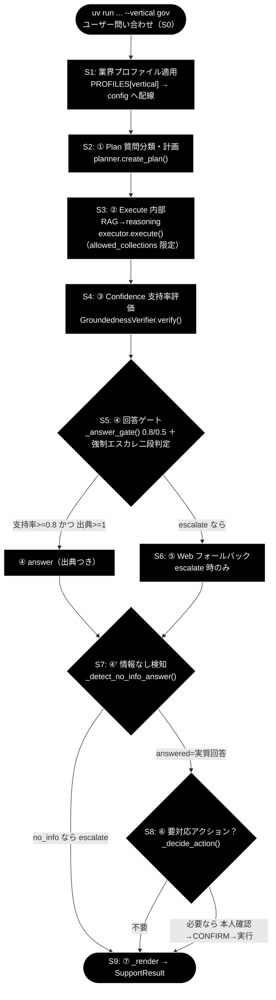
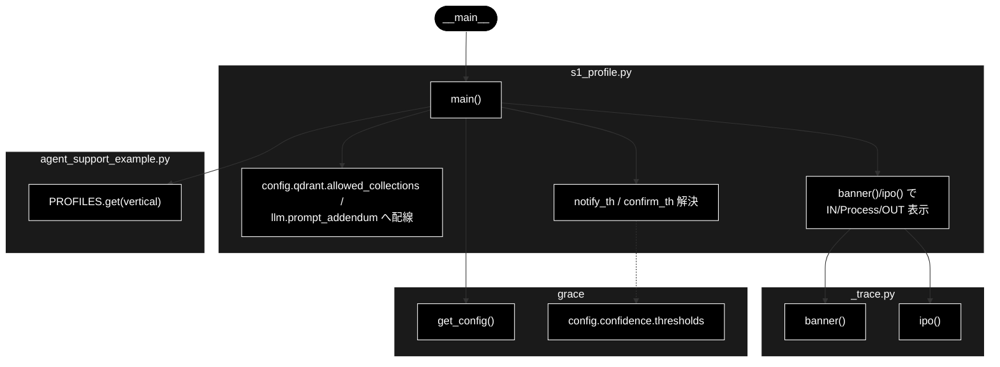

# s1_profile.py - S1 業界プロファイル適用トレース ドキュメント

**Version 1.1** | 最終更新: 2026-07-09

---

## 目次

1. [概要](#概要)
2. [責務](#責務)
3. [1. アーキテクチャ構成図（回答判定フロー）](#1-アーキテクチャ構成図回答判定フロー)
4. [1.1 ソース構成図（本モジュールの呼び出し構造）](#11-ソース構成図本モジュールの呼び出し構造)
5. [2. 回答ポリシー（groundedness ゲート）](#2-回答ポリシーgroundedness-ゲート)
5. [7. プログラム構成（実装済み関数 ＋ IPO 詳細）](#7-プログラム構成実装済み関数--ipo-詳細)
6. [5. 設定・定数](#5-設定定数)
7. [8. CLI 仕様](#8-cli-仕様)
8. [依存関係](#依存関係)
9. [変更履歴](#変更履歴)

---

## 概要

`grace/step_trace/s1_profile.py` は、`agent_support_example.py` の `run_support_agent()` の冒頭で
行われる **「業界プロファイル解決 → コア config への配線」** の 1 ステップだけを取り出した
**S1 トレース用スタブ**です。`PROFILES[vertical]` から `VerticalProfile` を選び、検索スコープ
（`config.qdrant.allowed_collections`）・業界方針（`config.llm.prompt_addendum`）・しきい値
（notify / confirm）を config に書き込む様子を、**IN → Process → OUT** の 3 段で標準出力に示します。

このステップは **LLM を呼びません**。意図分類器（`create_intent_classifier`）・情報なし判定器
（`create_no_info_judge`）は後続ステップ（S5/S7）で候補一致時にのみ発火する部品であり、
S1 の時点では「用意されるだけ」です。したがって `ANTHROPIC_API_KEY` 無しでも動作します。

> スタック表記: LLM = **Anthropic Claude**（既定 `claude-sonnet-4-6` / 軽量 `claude-haiku-4-5-20251001`、
> 鍵 `ANTHROPIC_API_KEY`）、Embedding = **Gemini** `gemini-embedding-001`（3072次元、鍵 `GOOGLE_API_KEY`）。
> **本モジュール（S1）はいずれも呼ばない**（LLM 未使用・Embedding 未使用）。

---

## 責務

- **PROFILES の解決**: `--vertical`（gov / saas / ec）から `ase.PROFILES.get(vertical)` で
  `VerticalProfile` を取得する（未指定なら `None` ＝共通挙動）。
- **検索スコープの配線**: `config.qdrant.allowed_collections` にプロファイルの `collections` を
  書き込む（後続 S3 の RAG 検索がこのスコープに限定される）。`tools` は config 参照を保持するため、
  S1 での代入が実行時（S3）に効く。
- **業界方針の配線**: `config.llm.prompt_addendum` にプロファイルの `prompt_addendum` を書き込む
  （後続 S3 の reasoning 生成へ注入される方針文）。
- **しきい値の解決**: `notify_th` / `confirm_th` をプロファイル値で解決し、`None`（saas / ec）なら
  `config.confidence.thresholds` の既定（notify=0.7 / confirm=0.4）へフォールバックする。
- **LLM 未使用**: 本ステップでは Anthropic Claude を呼ばない。分類器・判定器は生成されるだけで発火しない。

---

## 1. アーキテクチャ構成図（回答判定フロー）

`agent_support_example.py` の S0〜S9 全体フローにおける本モジュールの位置づけを示します。
**本モジュール ＝ 図の `PROF`（S1）に対応**します。



---

### 1.1 ソース構成図（本モジュールの呼び出し構造）

`grace/step_trace/s1_profile.py` そのものの呼び出し構造を、モジュール別に示します。前掲の共通フロー図が
S0〜S9 全体での位置づけを示すのに対し、本図は **`s1_profile.py` の `main()` が実際に触れる関数・属性**
だけを描いたものです。`main()` は `get_config()` で共通設定を取得し、`PROFILES.get(vertical)` で
プロファイルを解決した上で、`config.qdrant.allowed_collections` / `config.llm.prompt_addendum` へ配線し、
`notify_th` / `confirm_th` を解決します。表示は `_trace.py` の `banner()` / `ipo()` を用います。
**本モジュール（S1）は LLM を呼びません**（分類器・判定器は用意のみで未発火）。



---

## 2. 回答ポリシー（groundedness ゲート）

S1 は業種別の **しきい値 `notify_th` / `confirm_th`** を config に確定させ、後続 S3〜S8 の振る舞いを
規定します。gov のしきい値は `notify_th=0.8 / confirm_th=0.5`（3 業種で最も厳格）です。

| 状態 | 条件 | decision | 振る舞い |
|------|------|----------|---------|
| 自信あり | verified かつ 出典≥1 かつ 支持率≥notify_th（gov=0.8） | `answer` | 出典つきで自動回答 |
| 要注意 | confirm_th≤支持率<notify_th（gov=0.5〜0.8） | `answer`（warning=True） | 「未確認の注意書き」つきで回答 |
| わからない | 支持率<confirm_th または 出典0／verified=False | `escalate` | Web フォールバック→なお不足なら有人 |

> 設計意図: 根拠のない断定を構造的に出さない。S1 が業種別のしきい値・検索スコープ・方針を config に
> 確定し、後続 S3〜S8 の振る舞いを規定する。

---

## 7. プログラム構成（実装済み関数 ＋ IPO 詳細）

### 関数一覧

| 関数名 | 概要 |
|-------|------|
| `main()` | CLI エントリポイント。引数を解釈し、プロファイル解決 → config 配線 → しきい値解決を行い、IN/Process/OUT と端末出力を表示する |

### 7.6 クラス・関数 IPO 詳細

#### `main`

**概要**: S1「業界プロファイル適用」のトレース本体。`argparse` で `query` / `--vertical` を受け、
`get_config()` で共通設定を取得し、`ase.PROFILES.get(vertical)` でプロファイルを解決して
`config.qdrant.allowed_collections` / `config.llm.prompt_addendum` へ配線し、`notify_th` / `confirm_th`
を解決する。LLM は呼ばない。

```python
def main() -> None
```

| パラメータ | 型 | デフォルト | 説明 |
|-----------|-----|-----------|------|
| `query`（位置引数） | str | `ase.DEFAULT_QUERY`（`"パスワードを忘れました"`） | 問い合わせ本文。S1 では表示のみで未使用（後続 S2 以降で使う） |
| `--vertical` | str | `None` | 業界プロファイル。`gov` / `saas` / `ec` から選択。未指定は共通挙動 |

| 項目 | 内容 |
|------|------|
| **Input** | `--vertical`（`gov` / `saas` / `ec` / None）、`query`（位置引数・S1 では表示のみ） |
| **Process** | 1. `get_config()` で共通設定を取得（planner/executor/verifier/intervention もここで生成）<br>2. `th = config.confidence.thresholds` を取得<br>3. `profile = ase.PROFILES.get(vertical)`（未指定なら None）<br>4. `notify_th` / `confirm_th` をプロファイル値で解決（`None` なら `th.notify` / `th.confirm` へフォールバック）<br>5. `config.qdrant.allowed_collections = list(profile.collections)`（None なら `[]`）<br>6. `config.llm.prompt_addendum = profile.prompt_addendum`（None なら `""`）<br>7. `create_intent_classifier` / `create_no_info_judge` は用意のみ（この時点では未発火・LLM 未呼び出し） |
| **Output** | 標準出力（戻り値なし・`None`）。`profile` / `config.qdrant.allowed_collections` / `config.llm.prompt_addendum` / `notify_th` / `confirm_th` を IN/Process/OUT で表示し、続けて `run_support_agent` と同じ体裁の端末出力（業界名・検索スコープ・しきい値・本人確認・方針）を表示 |

**戻り値例**（`--vertical gov` 実行時の標準出力・抜粋）:
```text
============================================================
S1. 業界プロファイル適用（--vertical gov）
============================================================
IN     : vertical='gov'
Process: get_config() で共通設定を取得（planner/executor/verifier/intervention もここで生成）
         PROFILES.get(vertical) で VerticalProfile を解決
         config.qdrant.allowed_collections / config.llm.prompt_addendum へ配線
         notify_th / confirm_th をプロファイル値（無ければ config 既定）で解決
         create_intent_classifier / create_no_info_judge は用意のみ（この時点では未発火）
OUT    : profile = VerticalProfile(name='自治体', ...)
         config.qdrant.allowed_collections = ['gov_faq_anthropic', 'gov_laws_anthropic', 'wikipedia_ja']
         config.llm.prompt_addendum        = '条例・公式案内に基づき、断定を避け、該当ページ・担当課を明示。個人情報は尋ねない。'
         notify_th=0.8 / confirm_th=0.5

============================================================
業界プロファイル: 自治体（--vertical gov）
============================================================
  検索スコープ: gov_faq_anthropic, gov_laws_anthropic, wikipedia_ja（未登録コレクションは自動的に無視）
  しきい値: notify=0.8 / confirm=0.5 / 本人確認=False
  方針(reasoningへ注入): 条例・公式案内に基づき、断定を避け、該当ページ・担当課を明示。個人情報は尋ねない。
```

```python
# 使用例（CLI から）
# uv run python grace/step_trace/s1_profile.py --vertical gov "住民票の写しの取り方は？"
#   → gov プロファイルが config に配線され、notify=0.8 / confirm=0.5 が表示される

# uv run python grace/step_trace/s1_profile.py --vertical saas "APIのレート制限は？"
#   → saas は notify_th/confirm_th=None のため config 既定 notify=0.7 / confirm=0.4 が使われる
```

---

## 5. 設定・定数

本モジュールは定数を定義せず、`agent_support_example.PROFILES` の `VerticalProfile` を参照します。
gov / saas / ec の各プロファイルの実値は以下のとおりです（`agent_support_example.py` の `PROFILES` と一致）。

| 項目 | gov（自治体） | saas（SaaS） | ec（EC） |
|------|--------------|--------------|----------|
| `name` | `自治体` | `SaaS` | `EC` |
| `collections` | `gov_faq_anthropic`, `gov_laws_anthropic`, `wikipedia_ja` | `saas_docs_anthropic`, `saas_api_anthropic` | `ec_policy_anthropic`, `ec_faq_anthropic` |
| `escalate_keywords` | 法的, 訴訟, 減免, 個別, 例外, 不服 | 障害, ダウン, 落ち, 課金, 請求, 情報漏, セキュリティ | 決済, 返金, 破損, クレーム, 不良品 |
| `action_map` | 申請→send_reply, 手続→send_reply, 様式→send_reply | エラー→create_ticket, 不具合→create_ticket, バグ→create_ticket | 返品→create_ticket, 交換→create_ticket, キャンセル→create_ticket, 解約→create_ticket |
| `require_identity` | `False` | `False` | `True`（注文情報の操作は本人確認必須） |
| `notify_th` | `0.8` | `None`（→ config 既定 `0.7`） | `None`（→ config 既定 `0.7`） |
| `confirm_th` | `0.5` | `None`（→ config 既定 `0.4`） | `None`（→ config 既定 `0.4`） |
| `prompt_addendum` | 条例・公式案内に基づき、断定を避け、該当ページ・担当課を明示。個人情報は尋ねない。 | 製品バージョンを明示し、再現手順と公式ドキュメント URL を添える。 | 注文情報の照会・変更は本人確認必須。返品・交換は規定の版に基づいて回答。 |

> `notify_th` / `confirm_th` が `None`（saas / ec）のときは `config.confidence.thresholds` の既定値
> （`notify=0.7` / `confirm=0.4`）が適用されます。

---

## 8. CLI 仕様

### 引数

| 引数 | 種別 | 必須 | デフォルト | 説明 |
|------|------|:----:|-----------|------|
| `query` | 位置引数 | ⚪ | `ase.DEFAULT_QUERY`（`"パスワードを忘れました"`） | 問い合わせ本文（S1 では表示のみ・未使用） |
| `--vertical` | オプション | ⚪ | `None` | 業界プロファイル。`gov` / `saas` / `ec` から選択 |

### 実行例

```bash
# 自治体（gov）: notify=0.8 / confirm=0.5、本人確認なし
uv run python grace/step_trace/s1_profile.py --vertical gov "住民票の写しの取り方は？"

# SaaS（saas）: notify_th/confirm_th=None → config 既定 0.7 / 0.4
uv run python grace/step_trace/s1_profile.py --vertical saas "APIのレート制限は？"

# EC（ec）: 本人確認あり（require_identity=True）
uv run python grace/step_trace/s1_profile.py --vertical ec "返品したい"
```

---

## 依存関係

### 内部モジュール

| モジュール | 用途 |
|-----------|------|
| `_trace` | トレース共通ヘルパ（`banner` / `ipo` / `quiet_logs`）。import 時に `quiet_logs()` を適用し初期化 INFO を抑制 |
| `agent_support_example`（`ase`） | `PROFILES`（`VerticalProfile` 定義）・`DEFAULT_QUERY` の参照元 |
| `grace`（`get_config`） | 共通設定の取得。`config.confidence.thresholds` / `config.qdrant.allowed_collections` / `config.llm.prompt_addendum` を保持 |

### 外部ライブラリ

| ライブラリ | 用途 |
|-----------|------|
| `argparse` | CLI 引数（`query` / `--vertical`）の解釈 |

> LLM（Anthropic Claude）・Embedding（Gemini）は **本モジュールでは呼び出さない**。

---

## 変更履歴

| バージョン | 変更内容 |
|-----------|---------|
| 1.0 | 初版作成（2026-07-09） |
| 1.1 | 「1.1 ソース構成図」（本モジュールの呼び出し構造の Mermaid）を追加 |
