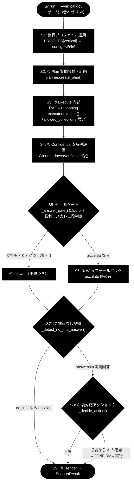
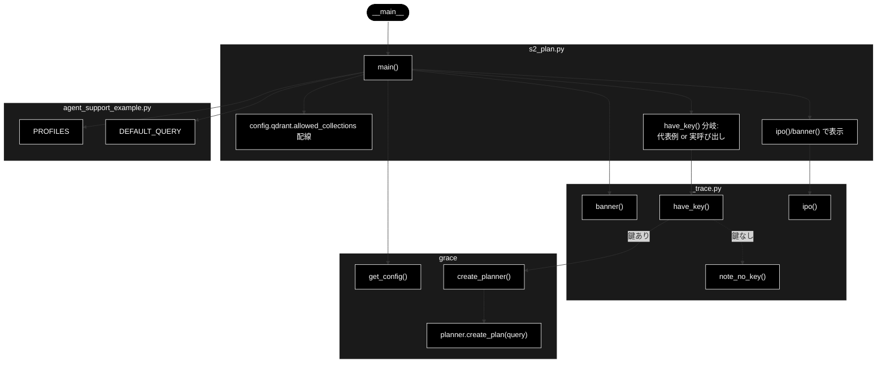

# s2_plan.py - S2. ① Plan（質問分類・計画）トレースドキュメント

**Version 1.1** | 最終更新: 2026-07-09

---

## 目次

- [概要](#概要)
- [責務](#責務)
- [1. アーキテクチャ構成図（回答判定フロー）](#1-アーキテクチャ構成図回答判定フロー)
  - [1.1 ソース構成図（本モジュールの呼び出し構造）](#11-ソース構成図本モジュールの呼び出し構造)
- [2. 回答ポリシー（groundedness ゲート）](#2-回答ポリシーgroundedness-ゲート)
- [7. プログラム構成（実装済み関数 ＋ IPO 詳細）](#7-プログラム構成実装済み関数--ipo-詳細)
  - [7.6 クラス・関数 IPO 詳細](#76-クラス関数-ipo-詳細)
- [8. CLI 仕様](#8-cli-仕様)
- [依存関係](#依存関係)
- [変更履歴](#変更履歴)

---

## 概要

`s2_plan.py` は、GRACE-Support の自律エージェント（`agent_support_example.py` の `run_support_agent()`）を
S0〜S9 に分解したトレース用スタブ群のうち、**S2. ① Plan**（質問分類・計画）だけを取り出したモジュールである。

本モジュールは `plan = planner.create_plan(query)` の 1 行を **IN → Process → OUT** の 3 段で標準出力に示し、
LLM（Anthropic Claude、既定 `claude-sonnet-4-6`）がクエリの複雑度を推定し、
`rag_search`（必要なら `reasoning`）ステップからなる `ExecutionPlan` を生成する様子を可視化する。

- `ANTHROPIC_API_KEY` があれば実際に `Planner.create_plan()` を呼び、本物の `ExecutionPlan` を表示する。
- 鍵が無い場合は `agent_support_example_flow.md` の gov 代表例（2 ステップ / `complexity=0.35`）で OUT の構造だけを示す。
- Embedding は Gemini `gemini-embedding-001`（3072 次元、`GOOGLE_API_KEY`）を用いるが、S2（計画生成）自体は Embedding を必要としない。

---

## 責務

- S2 の入力（`query`）と S1 相当の配線（`config.qdrant.allowed_collections` へのプロファイル反映）を受け取り、`Planner` を生成する。
- `create_planner(config)` → `planner.create_plan(query)` を実行し、生成された `ExecutionPlan` を IPO 形式で表示する。
- `ExecutionPlan`（`original_query` / `complexity` / `estimated_steps` / `steps`）と各 `PlanStep`（`step_id` / `action` / `collection` / `depends_on`）の実フィールドを整形出力する。
- `ANTHROPIC_API_KEY` 未設定時は代表サンプル（2 ステップ / `complexity=0.35`）で構造のみ提示し、実 LLM 呼び出しをスキップする。

---

## 1. アーキテクチャ構成図（回答判定フロー）

GRACE-Support 全体の回答判定フローを以下に示す。**本モジュール＝`CLS`（S2）に対応する。**



本モジュール（`s2_plan.py`）は上図の **`CLS`（S2: ① Plan 質問分類・計画）** に対応する。
S2 で生成される `ExecutionPlan` が、後続 S3（② Execute）の `rag_search`／`reasoning` ステップ構成を決定する。

---

### 1.1 ソース構成図（本モジュールの呼び出し構造）

`s2_plan.py` そのものの呼び出し構造を以下に示す。`main()` を起点に、`_trace.py`（見出し・IPO 整形・鍵有無判定）、
`grace`（設定取得・Planner 生成・計画生成）、`agent_support_example.py`（`PROFILES` / `DEFAULT_QUERY`）へ配線する。
`have_key()` が真（`ANTHROPIC_API_KEY` あり）なら `create_planner()` → `planner.create_plan(query)` を実呼び出しし、
偽（鍵なし）なら `note_no_key()` で代表例（gov 2 ステップ / `complexity=0.35`）の構造のみを提示する。



---

## 2. 回答ポリシー（groundedness ゲート）

gov のしきい値は `notify_th=0.8 / confirm_th=0.5`。

| 状態 | 条件 | decision | 振る舞い |
|------|------|----------|---------|
| 自信あり | verified かつ 出典≥1 かつ 支持率≥notify_th（gov=0.8） | `answer` | 出典つきで自動回答 |
| 要注意 | confirm_th≤支持率<notify_th（gov=0.5〜0.8） | `answer`（warning=True） | 「未確認の注意書き」つきで回答 |
| わからない | 支持率<confirm_th または 出典0／verified=False | `escalate` | Web フォールバック→なお不足なら有人 |

> 設計意図: 根拠のない断定を構造的に出さない。S2 の計画が S3 の RAG/reasoning ステップ構成を決める。

---

## 7. プログラム構成（実装済み関数 ＋ IPO 詳細）

| 関数 | 種別 | 説明 |
|------|------|------|
| `main()` | エントリポイント | 引数解釈 → S1 相当の配線 → `create_planner` → `planner.create_plan` → `ExecutionPlan` を IPO 表示 |

補助（インポート）:

| 名称 | インポート元 | 用途 |
|------|-------------|------|
| `banner` / `ipo` / `have_key` / `note_no_key` | `_trace` | 見出し・IPO 整形・鍵有無判定・鍵なし注記 |
| `agent_support_example`（別名 `ase`） | リポジトリ直下 | `DEFAULT_QUERY` / `PROFILES` の参照 |
| `create_planner` / `get_config` | `grace` | Planner 生成・GRACE 設定取得 |

### 7.6 クラス・関数 IPO 詳細

#### `main()`

**概要**: S2 の単一ステップ（`planner.create_plan(query)`）を取り出し、IN → Process → OUT の 3 段でトレース表示するエントリポイント。

**シグネチャ**:

```python
def main() -> None
```

**パラメータ（CLI 引数）**:

| 引数 | 種類 | 既定値 | 説明 |
|------|------|--------|------|
| `query` | 位置引数（省略可） | `ase.DEFAULT_QUERY` | 計画対象のユーザー問い合わせ |
| `--vertical` | オプション | `None` | 業界プロファイル選択（`gov` / `saas` / `ec`）。指定時は `PROFILES[vertical].collections` を `config.qdrant.allowed_collections` へ配線 |

**IPO テーブル**:

| 区分 | 内容 |
|------|------|
| **Input** | `query`（ユーザー問い合わせ）。`--vertical` 指定時は `PROFILES[vertical]` を `config.qdrant.allowed_collections` へ反映 |
| **Process** | `get_config()` で設定取得 → `--vertical` を `allowed_collections` へ配線 → `create_planner(config)` で `Planner` を生成 → `planner.create_plan(query)` で `ExecutionPlan` を生成 |
| **Output** | `ExecutionPlan`（`original_query` / `complexity` / `estimated_steps` / `steps=[PlanStep(...)]`）を IPO 整形表示し、末尾に `[plan] N ステップ (complexity=…)` を出力 |

**戻り値**: `None`（標準出力へトレースを表示）。

**戻り値例（`ANTHROPIC_API_KEY` あり）**:

```text
IN     : query='住民票の写しの取り方は？', allowed_collections=['gov_faq_anthropic', 'gov_laws_anthropic', 'wikipedia_ja']
Process: Planner.create_plan(query) … LLM が複雑度を推定し rag_search/reasoning 計画を生成
OUT    : plan = ExecutionPlan(
           original_query='住民票の写しの取り方は？',
           complexity=0.35, estimated_steps=2,
           steps=[
             PlanStep(step_id=1, action='rag_search', collection=None, depends_on=[])
             PlanStep(step_id=2, action='reasoning', collection=None, depends_on=[1])
           ])

  [plan] 2 ステップ (complexity=0.35)
```

`ANTHROPIC_API_KEY` が無い場合は `note_no_key("planner.create_plan")` を出力し、
実 LLM 呼び出しをスキップして、`agent_support_example_flow.md` の gov 代表例
（**2 ステップ / `complexity=0.35`**）で OUT の構造だけを提示する。

**使用例**:

```bash
uv run python grace/step_trace/s2_plan.py --vertical gov "住民票の写しの取り方は？"
```

---

## 8. CLI 仕様

### 引数

| 引数 | 必須 | 既定値 | 説明 |
|------|------|--------|------|
| `query` | 任意 | `agent_support_example.DEFAULT_QUERY` | 計画対象の問い合わせ文 |
| `--vertical` | 任意 | `None` | `gov` / `saas` / `ec` のいずれか。プロファイルの `collections` を検索スコープへ配線 |

### 実行例（uv run）

```bash
# gov（自治体）
uv run python grace/step_trace/s2_plan.py --vertical gov "住民票の写しの取り方は？"

# saas（SaaS サポート）
uv run python grace/step_trace/s2_plan.py --vertical saas "SSO設定の手順を教えて"

# ec（EC サポート）
uv run python grace/step_trace/s2_plan.py --vertical ec "注文のキャンセル方法は？"
```

---

## 依存関係

| 依存 | 種別 | 用途 |
|------|------|------|
| `_trace`（`grace/step_trace/_trace.py`） | 内部（同ディレクトリ） | `banner` / `ipo` / `have_key` / `note_no_key`。ログ抑制・`.env` 読み込み・repo root の import パス追加 |
| `agent_support_example`（リポジトリ直下） | 内部 | `DEFAULT_QUERY` / `PROFILES`（業界プロファイル定義） |
| `grace.planner`（`create_planner` / `Planner.create_plan`） | 内部 | 計画生成本体。`ExecutionPlan` / `PlanStep`（`grace.schemas`）を返す |
| `grace.get_config` | 内部 | GRACE 設定（`config.qdrant.allowed_collections` など） |

- LLM: Anthropic Claude（既定 `claude-sonnet-4-6`、軽量 `claude-haiku-4-5-20251001`、鍵 `ANTHROPIC_API_KEY`）。
- Embedding: Gemini `gemini-embedding-001`（3072 次元、鍵 `GOOGLE_API_KEY`）。S2 では未使用。

---

## 変更履歴

| 版 | 日付 | 内容 |
|----|------|------|
| 1.0 | 2026-07-09 | 初版作成（`s2_plan.py` の S2. ① Plan トレースを IPO・CLI・フロー図で文書化） |
| 1.1 | 「1.1 ソース構成図」（本モジュールの呼び出し構造の Mermaid）を追加 |
