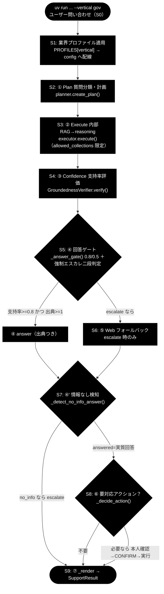
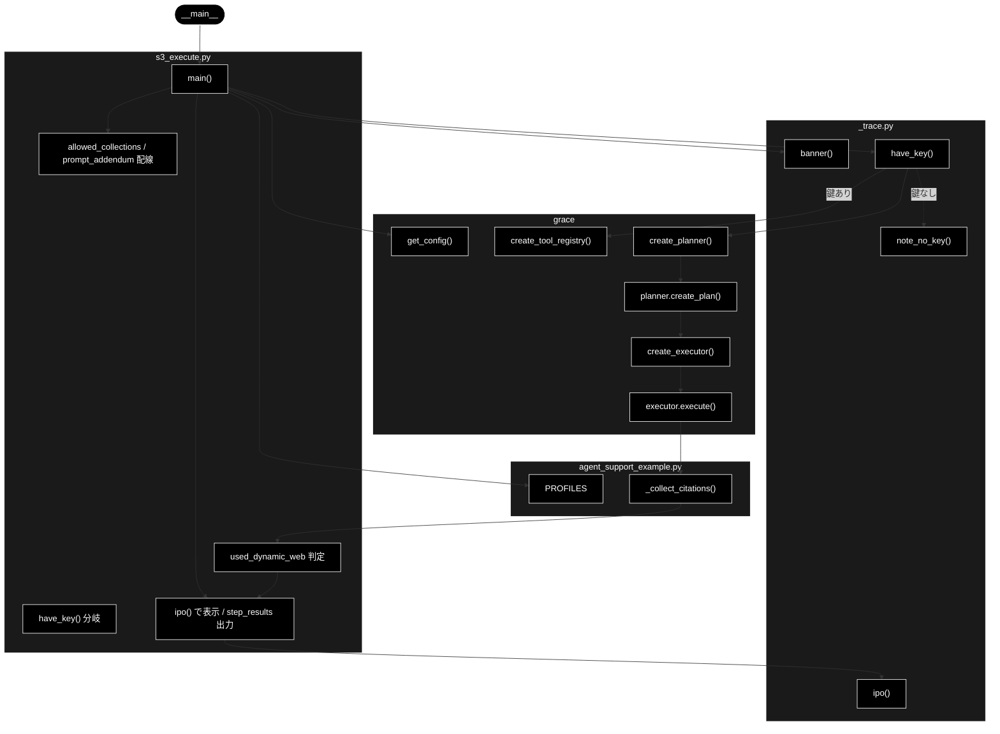

# s3_execute.py - S3. ② Execute（内部 RAG → reasoning）トレースドキュメント

**Version 1.3** | 最終更新: 2026-07-10

---

## 目次

- [概要](#概要)
- [責務](#責務)
- [1. アーキテクチャ構成図（回答判定フロー）](#1-アーキテクチャ構成図回答判定フロー)
  - [1.1 ソース構成図（本モジュールの呼び出し構造）](#11-ソース構成図本モジュールの呼び出し構造)
- [2. 回答ポリシー（groundedness ゲート）](#2-回答ポリシーgroundedness-ゲート)
- [7. プログラム構成（実装済み関数 ＋ IPO 詳細）](#7-プログラム構成実装済み関数--ipo-詳細)
  - [7.6 クラス・関数 IPO 詳細](#76-クラス関数-ipo-詳細)
- [8. CLI 仕様](#8-cli-仕様)
- [依存関係](#依存関係)
- [変更履歴](#変更履歴)

---

## 概要

`s3_execute.py` は、GRACE-Support の自律エージェント（`agent_support_example.py` の `run_support_agent()`）を
S0〜S9 に分解したトレース用スタブ群のうち、**S3. ② Execute**（内部 RAG → reasoning）だけを取り出したモジュールである。

本モジュールは `result = executor.execute(plan)` と、出典のラベル付け
`internal_citations = ase._collect_citations(result.step_results)` を **IN → Process → OUT** の 3 段で標準出力に示し、
以下の一連の動きを可視化する。

- `RAGSearchTool` が Qdrant を `config.qdrant.allowed_collections` で**限定検索**する（`_apply_allowed_collections`）。
- RAG スコアが不足すると（`config.qdrant.rag_sufficient_score` 未満）、`executor` が `web_search` を**動的挿入**する。
- `ReasoningTool._build_prompt()` が `config.llm.prompt_addendum`（業界プロファイルの方針）を**注入**して回答を生成する。
- `_collect_citations()` が各ステップの `sources` を URL は `[Web]`、それ以外は `[社内]` とラベル付けする。

環境依存の扱い:

- `ANTHROPIC_API_KEY` があり、かつ Qdrant が起動・コレクション登録済みであれば実際に `Executor.execute()` を呼び、本物の `ExecutionResult` を表示する。
- 鍵が無い場合は `note_no_key("executor.execute")` を出力し、実呼び出しをスキップして `agent_support_example_flow.md` の gov 代表例で OUT の構造だけを示す。
- 鍵はあるが Qdrant 未起動・鍵不正などで実呼び出しに失敗した場合は、`agent_support_example.main()` と同じヒント（Qdrant の起動コマンドと `.env` の確認）を stderr に表示して `sys.exit(1)` する（生のスタックトレースは出さない）。
- LLM は Anthropic Claude（既定 `claude-sonnet-4-6`、軽量 `claude-haiku-4-5-20251001`）、Embedding は Gemini `gemini-embedding-001`（3072 次元、`GOOGLE_API_KEY`）を用いる。実 RAG 検索には Qdrant 起動＋各コレクション登録が要る。

---

## 責務

- S3 の入力（S2 が生成した `plan`）と S1 相当の配線（`config.qdrant.allowed_collections`／`config.llm.prompt_addendum` へのプロファイル反映）を受け取り、`ToolRegistry` / `Planner` / `Executor` を生成する。

> **前提（重要）**: `s2_plan.py` を先に実行したり、その出力を受け渡したりする**必要はない**。
> 各 `sN_*.py` スタブは自己完結で、ステップ間のファイル・標準出力の受け渡しは行わない。
> 本スタブは内部で `create_planner(config)` → `planner.create_plan(args.query)` を呼び、
> **S2 相当の `plan` を自前で再生成**してから `executor.execute(plan)` に渡す。
> IPO の IN に書かれた「plan（②の計画）」は、本体 `run_support_agent()` のフロー上で
> S3 が受け取る**論理的な入力**を示す表記である（S1 相当の config 配線も同様に内部で再現する）。
- `executor.execute(plan)` を実行し、`ExecutionResult`（`final_answer` / `step_results` / `overall_confidence`）を IPO 形式で表示する。
- `ase._collect_citations(result.step_results)` で出典を `[社内]`／`[Web]` にラベル付けし、`used_dynamic_web`（`[Web]` ラベルの有無）を判定する。
- 各 `StepResult`（`step_id` / `status` / `sources`）を `step{id}: {status} (sources=N)` 形式で列挙し、動的 Web 検索が使われた場合は `[web]` の注記を出力する。
- `ANTHROPIC_API_KEY` 未設定時は代表サンプル（gov 例）で構造のみ提示し、実 LLM／Qdrant 呼び出しをスキップする。

---

## 1. アーキテクチャ構成図（回答判定フロー）

GRACE-Support 全体の回答判定フローを以下に示す。**本モジュール＝`RAG`（S3）に対応する。**



本モジュール（`s3_execute.py`）は上図の **`RAG`（S3: ② Execute 内部RAG→reasoning）** に対応する。
S2 が生成した `ExecutionPlan` を入力に取り、`RAGSearchTool`（限定検索）→（スコア不足なら `web_search` 動的挿入）→ `ReasoningTool`（`prompt_addendum` 注入）で `internal_answer` と `internal_citations` を生成する。
ここで付けた出典（`[社内]`／`[Web]`）が、後続 S4（③ Confidence）の支持率評価の入力になる。

---

### 1.1 ソース構成図（本モジュールの呼び出し構造）

前節の共通フロー図が GRACE-Support **全体**の位置づけ（本モジュール＝`RAG`/S3）を示すのに対し、
本節は `grace/step_trace/s3_execute.py` **そのもの**の呼び出し構造（実コードの `main()` が何を呼ぶか）を示す。
`main()` は `get_config()` で設定を取り、`ase.PROFILES[vertical]` を `config.qdrant.allowed_collections` /
`config.llm.prompt_addendum` へ配線したうえで、`have_key()` の結果に応じて分岐する。
鍵ありなら `create_tool_registry` / `create_planner` / `create_executor` を生成して
`planner.create_plan()` → `executor.execute()` → `ase._collect_citations()` を実行し、
`used_dynamic_web`（`[Web]` ラベルの有無）を判定して `ipo()` で表示する。
鍵なしなら `note_no_key()` を出力し、実呼び出しをスキップして代表例の構造だけを `ipo()` で示す。



- `s3_execute.py`: `main()` が引数解釈・配線・分岐・出力を統括する唯一の関数。
- `_trace.py`: `banner`（見出し）／`have_key`（鍵有無）／`ipo`（IN/Process/OUT 整形）／`note_no_key`（鍵なし注記）。
- `grace`: `get_config` / `create_tool_registry` / `create_planner` / `create_executor` と、`planner.create_plan` / `executor.execute`。
- `agent_support_example.py`: `PROFILES`（業界プロファイル）と `_collect_citations`（`[社内]`／`[Web]` ラベル付け）。

---

## 2. 回答ポリシー（groundedness ゲート）

gov のしきい値は `notify_th=0.8 / confirm_th=0.5`。

| 状態 | 条件 | decision | 振る舞い |
|------|------|----------|---------|
| 自信あり | verified かつ 出典≥1 かつ 支持率≥notify_th（gov=0.8） | `answer` | 出典つきで自動回答 |
| 要注意 | confirm_th≤支持率<notify_th（gov=0.5〜0.8） | `answer`（warning=True） | 「未確認の注意書き」つきで回答 |
| わからない | 支持率<confirm_th または 出典0／verified=False | `escalate` | Web フォールバック→なお不足なら有人 |

> 設計意図: 根拠のない断定を構造的に出さない。S3 の出典（`[社内]`／`[Web]`）が S4 の支持率評価の入力になる。

---

## 7. プログラム構成（実装済み関数 ＋ IPO 詳細）

| 関数 | 種別 | 説明 |
|------|------|------|
| `main()` | エントリポイント | 引数解釈 → S1 相当の配線 → `create_tool_registry` / `create_planner` / `create_executor` → `planner.create_plan` → `executor.execute` → `_collect_citations` → `ExecutionResult` を IPO 表示 |

補助（インポート）:

| 名称 | インポート元 | 用途 |
|------|-------------|------|
| `banner` / `ipo` / `have_key` / `note_no_key` | `_trace` | 見出し・IPO 整形・鍵有無判定・鍵なし注記 |
| `agent_support_example`（別名 `ase`） | リポジトリ直下 | `DEFAULT_QUERY` / `PROFILES` / `_collect_citations` の参照 |
| `create_tool_registry` / `create_planner` / `create_executor` / `get_config` | `grace` | ツールレジストリ・Planner・Executor 生成、GRACE 設定取得 |

### 7.6 クラス・関数 IPO 詳細

#### `main()`

**概要**: S3 の中核（`executor.execute(plan)` ＋ `_collect_citations`）を取り出し、IN → Process → OUT の 3 段でトレース表示するエントリポイント。RAG 限定検索・Web 動的挿入・`prompt_addendum` 注入・出典ラベル付けの様子を可視化する。

**シグネチャ**:

```python
def main() -> None
```

**パラメータ（CLI 引数）**:

| 引数 | 種類 | 既定値 | 説明 |
|------|------|--------|------|
| `query` | 位置引数（省略可） | `ase.DEFAULT_QUERY` | 実行対象のユーザー問い合わせ |
| `--vertical` | オプション | `None` | 業界プロファイル選択（`gov` / `saas` / `ec`）。指定時は `PROFILES[vertical].collections` を `config.qdrant.allowed_collections` へ、`PROFILES[vertical].prompt_addendum` を `config.llm.prompt_addendum` へ配線 |

**IPO テーブル**:

| 区分 | 内容 |
|------|------|
| **Input** | S2 が生成した `plan`、`config.qdrant.allowed_collections`（`--vertical` のプロファイル `collections`）、`config.llm.prompt_addendum`（プロファイルの業務方針） |
| **Process** | `executor.execute(plan)` → `RAGSearchTool` が `allowed_collections` で Qdrant を限定検索 →（RAG スコアが `rag_sufficient_score` 未満なら `web_search` を動的挿入）→ `ReasoningTool._build_prompt()` が `prompt_addendum` を注入して回答生成 → `ase._collect_citations()` で `[社内]`／`[Web]` ラベルを付与 |
| **Output** | `internal_answer`（`result.final_answer`）、`internal_citations`（`[社内]`／`[Web]` ラベル付き出典リスト）、`used_dynamic_web`（`[Web]` ラベルの有無）、`step_results`（各 `StepResult` の `status` / `sources` 件数） |

**戻り値**: `None`（標準出力へトレースを表示）。

**戻り値例（`ANTHROPIC_API_KEY` あり・Qdrant 稼働）**:

```text
IN     : plan（②の計画）, config.qdrant.allowed_collections, config.llm.prompt_addendum
Process: executor.execute(plan) → RAG 限定検索 →（不足なら web_search 動的挿入）→ reasoning 生成
OUT    : result.overall_confidence=0.82
           step1: success (sources=3)
           step2: success (sources=0)
         internal_answer[:60]='住民票の写しは、お住まいの市区町村の窓口（市民課等）または…'
         internal_citations=['[社内] gov_faq_anthropic/住民票.md', ...]
         used_dynamic_web=False

  step1: success (sources=3)
  step2: success (sources=0)
```

> 上記は代表例であり、`internal_citations` の具体値・`overall_confidence` は実データ（登録済みコレクションの中身）に依存する。実 RAG 検索を行うには Qdrant を起動し、各コレクション（例: `gov_faq_anthropic` / `gov_laws_anthropic` / `wikipedia_ja`）を登録しておく必要がある。

`ANTHROPIC_API_KEY` が無い場合は `note_no_key("executor.execute")` を出力し、
実 LLM／Qdrant 呼び出しをスキップして、`agent_support_example_flow.md` の gov 代表例
（`used_dynamic_web=False`＝内部ナレッジだけで回答）で OUT の構造だけを提示する。

**使用例**:

```bash
uv run python grace/step_trace/s3_execute.py --vertical gov "住民票の写しの取り方は？"
```

---

## 8. CLI 仕様

### 引数

| 引数 | 必須 | 既定値 | 説明 |
|------|------|--------|------|
| `query` | 任意 | `agent_support_example.DEFAULT_QUERY` | 実行対象の問い合わせ文 |
| `--vertical` | 任意 | `None` | `gov` / `saas` / `ec` のいずれか。プロファイルの `collections` を検索スコープへ、`prompt_addendum` を reasoning の方針へ配線 |

### 実行例（uv run）

```bash
# gov（自治体）
uv run python grace/step_trace/s3_execute.py --vertical gov "住民票の写しの取り方は？"

# saas（SaaS サポート）
uv run python grace/step_trace/s3_execute.py --vertical saas "Webhookの設定方法は？"

# ec（EC サポート）
uv run python grace/step_trace/s3_execute.py --vertical ec "注文のキャンセル方法は？"
```

> 注記: 上記の実 RAG 検索を成立させるには **Qdrant を起動し、各コレクションを登録**しておく必要がある（例: `gov_faq_anthropic` / `saas_docs_anthropic` / `ec_policy_anthropic`）。未登録の場合でも `_apply_allowed_collections` は制限を素通りさせ、`ANTHROPIC_API_KEY` 未設定時は代表サンプルで OUT の構造だけを表示する。

---

## 依存関係

| 依存 | 種別 | 用途 |
|------|------|------|
| `_trace`（`grace/step_trace/_trace.py`） | 内部（同ディレクトリ） | `banner` / `ipo` / `have_key` / `note_no_key`。ログ抑制・`.env` 読み込み・repo root の import パス追加 |
| `agent_support_example`（リポジトリ直下） | 内部 | `DEFAULT_QUERY` / `PROFILES`（業界プロファイル定義）／ `_collect_citations`（出典ラベル付け） |
| `grace.executor`（`create_executor` / `Executor.execute`） | 内部 | 計画実行本体。RAG 限定検索・Web 動的挿入・reasoning 生成を統括し `ExecutionResult` を返す |
| `grace.tools`（`create_tool_registry` / `RAGSearchTool` / `ReasoningTool`） | 内部 | RAG 限定検索（`_apply_allowed_collections`）・`prompt_addendum` 注入（`_build_prompt`） |
| `grace.planner`（`create_planner` / `Planner.create_plan`） | 内部 | S2 相当の計画生成（S3 の入力 `plan` を用意） |
| `grace.get_config` | 内部 | GRACE 設定（`config.qdrant.allowed_collections`／`config.llm.prompt_addendum` など） |

- LLM: Anthropic Claude（既定 `claude-sonnet-4-6`、軽量 `claude-haiku-4-5-20251001`、鍵 `ANTHROPIC_API_KEY`）。
- Embedding: Gemini `gemini-embedding-001`（3072 次元、鍵 `GOOGLE_API_KEY`）。RAG 検索のベクトル化に使用。

---

## 変更履歴

| 版 | 日付 | 内容 |
|----|------|------|
| 1.0 | 2026-07-09 | 初版作成（`s3_execute.py` の S3. ② Execute トレースを IPO・CLI・フロー図で文書化） |
| 1.1 | 2026-07-09 | 「1.1 ソース構成図」（本モジュールの呼び出し構造の Mermaid）を追加 |
| 1.2 | 2026-07-10 | 実呼び出し失敗時に `main()` と同じヒント（Qdrant 起動・`.env` 確認）を表示して終了するエラーハンドリングを追加 |
| 1.3 | 2026-07-10 | 前提の明確化: `s2_plan.py` の事前実行・出力受け渡しは不要（スタブが内部で `planner.create_plan()` を呼び S2 相当の plan を自前再生成する）ことを「責務」に注記 |
