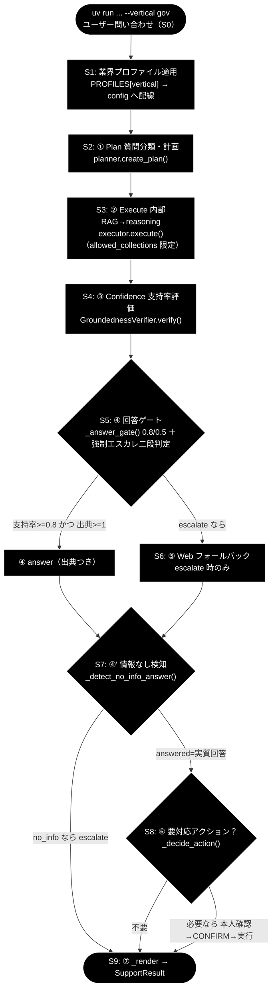
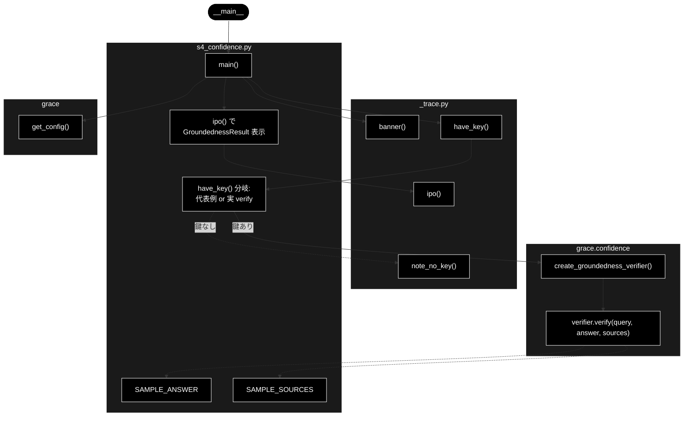

# s4_confidence.py - S4. ③ Confidence（支持率評価）トレースドキュメント

**Version 1.1** | 最終更新: 2026-07-09

---

## 目次

- [概要](#概要)
- [責務](#責務)
- [1. アーキテクチャ構成図（回答判定フロー）](#1-アーキテクチャ構成図回答判定フロー)
  - [1.1 ソース構成図（本モジュールの呼び出し構造）](#11-ソース構成図本モジュールの呼び出し構造)
- [2. 回答ポリシー（groundedness ゲート）](#2-回答ポリシーgroundedness-ゲート)
- [7. プログラム構成（実装済み関数 ＋ IPO 詳細）](#7-プログラム構成実装済み関数--ipo-詳細)
  - [7.6 クラス・関数 IPO 詳細](#76-クラス関数-ipo-詳細)
- [8. CLI 仕様](#8-cli-仕様)
- [依存関係](#依存関係)
- [変更履歴](#変更履歴)

---

## 概要

`s4_confidence.py` は、GRACE-Support の自律エージェント（`agent_support_example.py` の `run_support_agent()`）を
S0〜S9 に分解したトレース用スタブ群のうち、**S4. ③ Confidence**（支持率評価）だけを取り出したモジュールである。

本モジュールは `gres = verifier.verify(query, answer, sources)` を **IN → Process → OUT** の 3 段で標準出力に示し、
以下の一連の動きを可視化する。

- `create_groundedness_verifier(config)` が `GroundednessVerifier` を生成する。
- `GroundednessVerifier.verify()` が回答を短い主張（claim）に分解し、各主張を出典に照らして
  **supported / contradicted / neutral** の 3 値で判定する。
- 支持率 `support_rate = supported / (supported + contradicted)` を集計し、`GroundednessResult` として返す
  （`neutral` は分母にも分子にも含めない＝判定対象は supported+contradicted）。

環境依存の扱い:

- `ANTHROPIC_API_KEY` があれば、代表サンプル（`SAMPLE_ANSWER` / `SAMPLE_SOURCES`）を用いて実際に
  `verifier.verify()` を呼び、本物の `GroundednessResult` を表示する。**Qdrant は不要**（answer と sources を
  スタブが直接与えるため、実 RAG 検索を介さず S4 単体を回せる）。
- 鍵が無い場合は `note_no_key("verifier.verify")` を出力し、実呼び出しをスキップして
  `agent_support_example_flow.md` の gov 代表例（`support_rate=0.86, supported=3, contradicted=0, total=4`）で
  OUT の構造だけを示す。
- LLM は Anthropic Claude（既定 `claude-sonnet-4-6`、軽量 `claude-haiku-4-5-20251001`、鍵 `ANTHROPIC_API_KEY`）。
  Embedding は Gemini `gemini-embedding-001`（3072 次元、鍵 `GOOGLE_API_KEY`）だが、S4 の支持率判定は
  LLM の entailment 判定のみで、本モジュールでは Embedding も Qdrant も使わない。

---

## 責務

- S4 の入力（S3 が生成した `internal_answer` に相当する `SAMPLE_ANSWER`、出典本文に相当する `SAMPLE_SOURCES`）と
  `query` を受け取り、`get_config()` で GRACE 設定を取得する。
- `create_groundedness_verifier(config)` で `GroundednessVerifier` を生成し、`verifier.verify(query, answer, sources)` を
  実行して `GroundednessResult`（`support_rate` / `supported` / `contradicted` / `total` / `has_contradiction` / `verified`）を
  IPO 形式で表示する。
- 支持率と判定可能主張数・出典数を `[groundedness] 支持率=… / 出典数=…` 形式で端末に注記する。
- 出典が無い／LLM 失敗時は `verified=False`（支持率 0）となることを示し、S5 の回答ゲートで“わからない”へ倒れる根拠を明示する。
- `ANTHROPIC_API_KEY` 未設定時は代表サンプル（gov 例、支持率 0.86）で構造のみ提示し、実 LLM 呼び出しをスキップする。

---

## 1. アーキテクチャ構成図（回答判定フロー）

GRACE-Support 全体の回答判定フローを以下に示す。**本モジュール＝`GND`（S4）に対応する。**



本モジュール（`s4_confidence.py`）は上図の **`GND`（S4: ③ Confidence 支持率評価）** に対応する。
S3 が生成した `internal_answer` と出典（`internal_citations`）を入力に取り、`GroundednessVerifier.verify()` で
回答を主張に分解し、各主張を出典に照らして 3 値判定し、支持率（`support_rate`）を集計する。
ここで得た `support_rate` / `verified` / 出典数が、後続 S5（④ 回答ゲート `_answer_gate()`）の主入力となり、
自動回答するか／エスカレするかを分岐させる。

### 1.1 ソース構成図（本モジュールの呼び出し構造）

上図が GRACE-Support 全体の共通フローであるのに対し、本節は **`s4_confidence.py` 単体の呼び出し構造**を示す。
`main()` は `_trace.py` のヘルパ（`banner` / `have_key` / `ipo` / `note_no_key`）で整形しつつ、`grace.get_config()` で
設定を取得し、`grace.confidence.create_groundedness_verifier()` で `GroundednessVerifier` を生成する。鍵があれば
代表サンプル（`SAMPLE_ANSWER` / `SAMPLE_SOURCES`）を渡して `verifier.verify(query, answer, sources)` を実呼び出しし、
鍵が無ければ `note_no_key()` 経由で構造だけを提示する。いずれの分岐でも結果は `ipo()` で `GroundednessResult` として表示する。



> `create_groundedness_verifier` は `grace.confidence` から、`banner` / `have_key` / `ipo` / `note_no_key` は
> `_trace` から、`get_config` は `grace` から import する。`SAMPLE_ANSWER` / `SAMPLE_SOURCES` はモジュール定数で、
> 鍵あり分岐でのみ `verifier.verify()` の引数として渡される（Qdrant 非依存）。

---

## 2. 回答ポリシー（groundedness ゲート）

gov のしきい値は `notify_th=0.8 / confirm_th=0.5`。S4 が算出する**支持率が S5 ゲートの主入力**である。

| 状態 | 条件 | decision | 振る舞い |
|------|------|----------|---------|
| 自信あり | verified かつ 出典≥1 かつ 支持率≥notify_th（gov=0.8） | `answer` | 出典つきで自動回答 |
| 要注意 | confirm_th≤支持率<notify_th（gov=0.5〜0.8） | `answer`（warning=True） | 「未確認の注意書き」つきで回答 |
| わからない | 支持率<confirm_th または 出典0／verified=False | `escalate` | Web フォールバック→なお不足なら有人 |

> 設計意図: 根拠のない断定を構造的に出さない。S4 の支持率が低い＝出典で裏付けられない回答は S5 で自動的に“わからない”へ倒す。

---

## 7. プログラム構成（実装済み関数 ＋ IPO 詳細）

| 関数 | 種別 | 説明 |
|------|------|------|
| `main()` | エントリポイント | 引数解釈 → `get_config` → `create_groundedness_verifier` → `verifier.verify(query, SAMPLE_ANSWER, SAMPLE_SOURCES)` → `GroundednessResult` を IPO 表示。鍵が無ければ代表サンプルで構造のみ提示 |

補助（インポート）:

| 名称 | インポート元 | 用途 |
|------|-------------|------|
| `banner` / `ipo` / `have_key` / `note_no_key` | `_trace` | 見出し・IPO 整形・鍵有無判定・鍵なし注記 |
| `get_config` | `grace` | GRACE 設定（`config.llm.model` など）の取得 |
| `create_groundedness_verifier` | `grace.confidence` | `GroundednessVerifier` の生成ファクトリ |

定数:

| 定数 | 型 | 説明 |
|------|----|------|
| `SAMPLE_ANSWER` | `str` | 内部 RAG が回答できた gov ケースの代表回答文（住民票の写しの取得方法）。実 Qdrant を使わず S4 単体を回すためのスタブ入力 |
| `SAMPLE_SOURCES` | `List[str]` | 上記回答の裏付けとなる出典本文（FAQ の Q&A 形式 1 件）。`verify()` の `sources` 引数へ渡す |

### 7.6 クラス・関数 IPO 詳細

#### `main()`

**概要**: S4 の中核（`verifier.verify(query, answer, sources)`）を取り出し、IN → Process → OUT の 3 段でトレース表示するエントリポイント。回答を主張に分解 → 3 値判定 → 支持率集計という groundedness 検証の様子を、Qdrant 非依存の代表サンプルで可視化する。

**シグネチャ**:

```python
def main() -> None
```

**パラメータ（CLI 引数）**:

| 引数 | 種類 | 既定値 | 説明 |
|------|------|--------|------|
| `query` | 位置引数（省略可） | `"住民票の写しの取り方は？"` | 支持率判定の対象となるユーザー問い合わせ文 |
| `--vertical` | オプション | `None` | 業界プロファイル選択（`gov` / `saas` / `ec`）。実行文脈のラベル用（S4 の判定は `query` / `SAMPLE_ANSWER` / `SAMPLE_SOURCES` に対して行う） |

**IPO テーブル**:

| 区分 | 内容 |
|------|------|
| **Input** | `query`（CLI 引数）、`SAMPLE_ANSWER`（内部回答の代表文）、`SAMPLE_SOURCES`（出典本文/識別子のリスト） |
| **Process** | `create_groundedness_verifier(config)` で `GroundednessVerifier` を生成 → `verifier.verify(query, answer, sources)` が回答を主張（claim）に分解 → 各主張を出典に照らして supported / contradicted / neutral に 3 値判定 → 支持率 `supported/(supported+contradicted)` を集計 |
| **Output** | `gres = GroundednessResult`（`support_rate` / `supported` / `contradicted` / `total` / `has_contradiction` / `verified`）。端末に `[groundedness] 支持率=… / 出典数=…` を注記 |

**戻り値**: `None`（標準出力へトレースを表示）。

**戻り値例（`ANTHROPIC_API_KEY` あり・実 verify、Qdrant 不要）**:

```text
IN     : query='住民票の写しの取り方は？', answer=SAMPLE_ANSWER, sources=1 件
Process: GroundednessVerifier.verify(...) が主張分解→3値判定→支持率を集計
OUT    : gres = GroundednessResult(
             support_rate=0.86, supported=3, contradicted=0, total=4,
             has_contradiction=False, verified=True)

  [groundedness] 支持率=0.86（判定可能 3/4 主張） / 出典数=1
```

> 上記は代表例であり、`support_rate` や各主張数（`supported` / `contradicted` / `total`）は LLM の判定に依存する。
> 出典が無い（`sources=None`）／LLM 失敗時は `GroundednessResult(0.0, 0, 0, 0, False, False, ...)`（`verified=False`）となり、
> S5 の回答ゲートで“わからない”（`escalate`）へ倒れる。

`ANTHROPIC_API_KEY` が無い場合は `note_no_key("verifier.verify")` を出力し、実 LLM 呼び出しをスキップして、
`agent_support_example_flow.md` の gov 代表例（`support_rate=0.86, supported=3, contradicted=0, total=4,
has_contradiction=False, verified=True`）で OUT の構造だけを提示する。

**使用例**:

```bash
uv run python grace/step_trace/s4_confidence.py --vertical gov "住民票の写しの取り方は？"
```

---

## 8. CLI 仕様

### 引数

| 引数 | 必須 | 既定値 | 説明 |
|------|------|--------|------|
| `query` | 任意 | `"住民票の写しの取り方は？"` | 支持率判定の対象となる問い合わせ文 |
| `--vertical` | 任意 | `None` | `gov` / `saas` / `ec` のいずれか。実行文脈のラベル用 |

### 実行例（uv run）

```bash
# gov（自治体）
uv run python grace/step_trace/s4_confidence.py --vertical gov "住民票の写しの取り方は？"

# saas（SaaS サポート）
uv run python grace/step_trace/s4_confidence.py --vertical saas "APIのレート制限は？"

# ec（EC サポート）
uv run python grace/step_trace/s4_confidence.py --vertical ec "返品したい"
```

> 注記: S4 は代表サンプル（`SAMPLE_ANSWER` / `SAMPLE_SOURCES`）を用いるため **Qdrant 不要**で単体実行できる。
> `ANTHROPIC_API_KEY` があれば実 `verify()` を、無ければ代表例（支持率 0.86）で OUT の構造だけを表示する。

---

## 依存関係

| 依存 | 種別 | 用途 |
|------|------|------|
| `_trace`（`grace/step_trace/_trace.py`） | 内部（同ディレクトリ） | `banner` / `ipo` / `have_key` / `note_no_key`。ログ抑制・`.env` 読み込み・repo root の import パス追加 |
| `grace.get_config` | 内部 | GRACE 設定（`config.llm.model` など）の取得 |
| `grace.confidence`（`create_groundedness_verifier` / `GroundednessVerifier.verify` / `GroundednessResult`） | 内部 | groundedness 検証本体。回答の主張分解・3 値判定・支持率集計を行い `GroundednessResult` を返す |

- LLM: Anthropic Claude（既定 `claude-sonnet-4-6`、軽量 `claude-haiku-4-5-20251001`、鍵 `ANTHROPIC_API_KEY`）。主張の entailment 判定に使用。
- Embedding: Gemini `gemini-embedding-001`（3072 次元、鍵 `GOOGLE_API_KEY`）。S4 の支持率判定では未使用（RAG 検索側の依存）。
- Qdrant: **不要**（`SAMPLE_ANSWER` / `SAMPLE_SOURCES` により S4 単体を実行できる）。

---

## 変更履歴

| 版 | 日付 | 内容 |
|----|------|------|
| 1.0 | 2026-07-09 | 初版作成（`s4_confidence.py` の S4. ③ Confidence トレースを IPO・CLI・フロー図で文書化） |
| 1.1 | 「1.1 ソース構成図」（本モジュールの呼び出し構造の Mermaid）を追加 |
