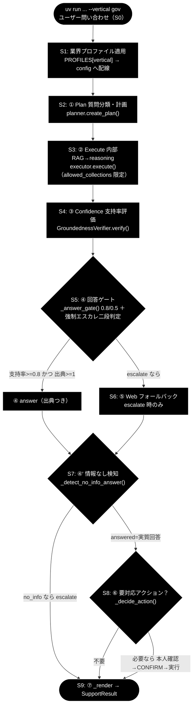
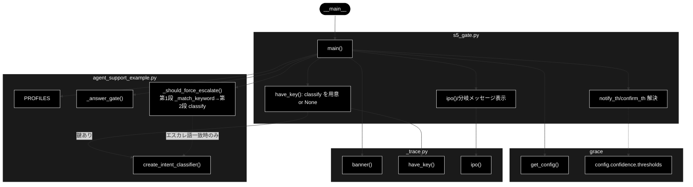

# s5_gate.py - S5 ④回答ゲート＋強制エスカレ（二段判定）トレース ドキュメント

**Version 1.1** | 最終更新: 2026-07-09

---

## 目次

1. [概要](#概要)
2. [責務](#責務)
3. [1. アーキテクチャ構成図（回答判定フロー）](#1-アーキテクチャ構成図回答判定フロー)
4. [1.1 ソース構成図（本モジュールの呼び出し構造）](#11-ソース構成図本モジュールの呼び出し構造)
5. [2. 回答ポリシー（groundedness ゲート）](#2-回答ポリシーgroundedness-ゲート)
5. [7. プログラム構成（実装済み関数 ＋ IPO 詳細）](#7-プログラム構成実装済み関数--ipo-詳細)
6. [8. CLI 仕様](#8-cli-仕様)
7. [依存関係](#依存関係)
8. [変更履歴](#変更履歴)

---

## 概要

`grace/step_trace/s5_gate.py` は、GRACE-Support の本処理 `agent_support_example.run_support_agent()` から
**S5 ④回答ゲート＋強制エスカレ（二段判定）** の 1 ステップだけを取り出したトレース用スタブである。
`_answer_gate()`（支持率・出典数 → answer/escalate）、`_should_force_escalate()`（エスカレ語 × 意図分類の二段判定）、
`_should_rescue_unaffirmed()`（出典付き・矛盾なし回答の救済）の実関数を **agent_support_example から直接呼び**、
入力・処理・出力を IN → Process → OUT の 3 段で標準出力に示す。

判定ロジックは純関数中心で、gov 代表例（「住民票の写しの取り方は？」）では **意図分類 LLM は呼ばれない**。
これは第 1 段の候補検出（`_match_keyword` によるエスカレ語照合）で不一致となり、第 2 段（意図分類）をスキップする
設計のため（追加コスト 0）。意図分類が要る分岐（例: gov「固定資産税の減免を個別に判断してほしい」）でのみ、
`ANTHROPIC_API_KEY` があれば軽量モデル `claude-haiku-4-5-20251001` による実分類を行う（鍵が無ければ `classify=None` の
安全側で示す）。

- **LLM**: Anthropic Claude。意図分類器（第 2 段）は軽量モデル `claude-haiku-4-5-20251001`（`INTENT_MODEL`）を使う。鍵は `ANTHROPIC_API_KEY`。
- **Embedding**: 検索用途は Gemini `gemini-embedding-001`（3072次元、鍵 `GOOGLE_API_KEY`）。本ステップ自体は Embedding を直接呼ばない（③ Confidence までで算出済みの支持率を入力に使う）。

---

## 責務

- ③ Confidence の**支持率**・**出典数**・**verified** と、業界プロファイルの
  `notify_th` / `confirm_th` を入力に、`_answer_gate()` で `answer` / `escalate` を第 1 段判定する。
- `_should_force_escalate()` で **強制エスカレの二段判定**を行う。第 1 段は
  `_match_keyword(escalate_keywords)` の候補検出、第 2 段は意図分類。`request` / `incident` は
  有人へ倒し、`question`（FAQ 質問）は誤検知として抑止する。
- gov 代表例では意図分類が呼ばれないこと（第 1 段不一致 → 第 2 段スキップ）を可視化する。
- `_should_rescue_unaffirmed()` の位置づけ（decision が escalate でないため今回は不発）を示す。

---

## 1. アーキテクチャ構成図（回答判定フロー）

本モジュールは、GRACE-Support 全体フローのうち **`GATE`（S5）** に対応する。



---

### 1.1 ソース構成図（本モジュールの呼び出し構造）

上記の共通フロー図（S0〜S9 全体）とは別に、本節では **`grace/step_trace/s5_gate.py` そのものの呼び出し構造**
（`main()` が実際に import して呼ぶモジュール・関数）を示す。`main()` は共通ヘルパ `_trace`（`banner`/`have_key`/`ipo`）、
設定 `grace.get_config()`、本処理 `agent_support_example`（`PROFILES`/`create_intent_classifier`/`_answer_gate`/
`_should_force_escalate`）を呼び出す。意図分類器（`create_intent_classifier`）は `have_key()` が真のときだけ生成され、
第 2 段の `classify` は `_should_force_escalate` 内でエスカレ語が一致したときにのみ発火する（追加コスト 0 の設計）。



---

## 2. 回答ポリシー（groundedness ゲート）

S5 は本ポリシー（根拠のない断定を構造的に出さない groundedness ゲート）の**実装点**である。
gov プロファイルのしきい値は `notify_th=0.8 / confirm_th=0.5`（config 既定は `notify=0.7 / confirm=0.4`。
プロファイル未指定時はこの既定を使う）。

| 状態 | 条件 | decision | 振る舞い |
|------|------|----------|---------|
| 自信あり | verified かつ 出典≥1 かつ 支持率≥notify_th（gov=0.8） | `answer` | 出典つきで自動回答 |
| 要注意 | confirm_th≤支持率<notify_th（gov=0.5〜0.8） | `answer`（warning=True） | 「未確認の注意書き」つきで回答 |
| わからない | 支持率<confirm_th または 出典0／verified=False | `escalate` | Web フォールバック→なお不足なら有人 |

**強制エスカレ二段判定**は上記ゲートの後段に重なる:

- **第 1 段**: `_match_keyword(query, escalate_keywords)` でエスカレ語候補を検出（部分一致・最初の一致語を返す）。不一致なら第 2 段はスキップし、意図分類 LLM は呼ばれない（追加コスト 0）。
- **第 2 段**: 候補一致時のみ意図分類器（`claude-haiku-4-5-20251001`）を実行。`request` / `incident` は `escalate`（法的／決済等の要対応クエリを有人へ倒す）、`question`（FAQ 質問）は誤検知として抑止し通常フローを継続する。分類器が無い／分類失敗（`None`）の場合は安全側＝従来どおり強制エスカレする。

> 設計意図: 根拠のない断定を構造的に出さない。加えて強制エスカレ二段判定で、支持率が高くても法的/決済等の要対応クエリは有人へ倒す（誤検知は意図分類で抑止）。

---

## 7. プログラム構成（実装済み関数 ＋ IPO 詳細）

### 関数一覧

| 関数 | 定義元 | 役割 |
|------|--------|------|
| `main()` | `s5_gate.py`（本モジュール） | S5 のトレース実行エントリ。config 解決 → 回答ゲート → 強制エスカレ二段判定 → IPO 出力 |
| `_answer_gate(support_rate, verified, citation_count, notify_th, confirm_th)` | **`agent_support_example`** | 支持率・出典数から `(decision, warning)` を返す純関数（第 1 段） |
| `_should_force_escalate(query, profile, classify)` | **`agent_support_example`** | エスカレ語 × 意図分類の二段判定。`(forced, matched_keyword, intent)` を返す |
| `_should_rescue_unaffirmed(...)` | **`agent_support_example`** | 出典付き・非「情報なし」・矛盾なし回答を escalate から救うか判定 |
| `create_intent_classifier(config)` | **`agent_support_example`** | 意図分類器（第 2 段）を返す。`have_key()` が真のときだけ生成 |

> `_answer_gate` / `_should_force_escalate` / `_should_rescue_unaffirmed` / `create_intent_classifier` は
> いずれも **`agent_support_example` 由来**であり、本モジュールはこれらを import して呼び出すだけである。

### 7.6 クラス・関数 IPO 詳細

#### `main()`

**概要**: S5 のトレースエントリ。`get_config()` でしきい値とプロファイルを解決し、代表例に合わせた入力
（内部 RAG が answer 可能・`verified=True`・出典 3 件）に対して `_answer_gate()`（第 1 段）と
`_should_force_escalate()`（第 2 段）を実行し、IN/Process/OUT を標準出力へ示す。エスカレ語の有無に応じて、
検知（強制エスカレ）／候補一致だが誤検知抑止（FAQ 質問）／エスカレ語なし（意図分類未実行）の 3 分岐を出力する。

**シグネチャ**:

```python
def main() -> None
```

**パラメータ表**（CLI 引数として受け取る）:

| 引数 | 型 | 既定 | 説明 |
|------|----|------|------|
| `query` | `str`（位置・省略可） | `"住民票の写しの取り方は？"` | 問い合わせ本文。エスカレ語照合と意図分類の入力 |
| `--vertical` | `str`（`gov`/`saas`/`ec`） | `None` | 業界プロファイル。`PROFILES[vertical]` から `notify_th`/`confirm_th`/`escalate_keywords` を配線 |
| `--support-rate` | `float` | `0.86` | ③ Confidence の支持率（既定 0.86＝gov 代表例） |

**IPO テーブル**:

| 区分 | 内容 |
|------|------|
| **Input** | `support_rate`（`--support-rate`、既定 0.86）、`verified=True`、`citation_count=3`、`notify_th`／`confirm_th`（プロファイル値。gov=0.8/0.5、未指定時は config 既定 0.7/0.4）、`query`、`profile`（`PROFILES.get(vertical)`） |
| **Process** | ① `_answer_gate(support_rate, verified, citation_count, notify_th, confirm_th)` で `(decision, warning)` を判定（第 1 段）。<br>② `_should_force_escalate(query, profile, classify)` で二段判定。第 1 段 `_match_keyword(escalate_keywords)` で候補検出、一致時のみ第 2 段 `classify`（意図分類）を実行。`request`/`incident` → `forced=True`、`question` → 誤検知抑止。<br>③ `forced` が真なら `decision, warning = "escalate", False` に上書き。<br>④ `_should_rescue_unaffirmed` は decision が escalate でないため今回は不発（救済不要）。 |
| **Output** | `(decision, warning)`、`forced_escalate`（=`forced`）、`matched_kw`、`intent`。末尾に分岐メッセージ（強制エスカレ検知／誤検知抑止／エスカレ語なし・意図分類未実行）を print |

**戻り値例**（gov 代表例 `--support-rate 0.86`、query=「住民票の写しの取り方は？」）:

```
IN     : support_rate=0.86, verified=True, citation_count=3, notify_th=0.8, confirm_th=0.5
         query='住民票の写しの取り方は？', profile=gov
Process: _answer_gate(...) が 支持率≥notify かつ 出典≥1 → answer を判定
         _should_force_escalate(query, profile, classify): 第1段 _match_keyword で候補検出、
           一致時のみ classify（意図分類）。question は誤検知抑止、request/incident は強制エスカレ
         _should_rescue_unaffirmed は decision!='escalate' のため今回は不発（救済不要）
OUT    : (decision, warning) = ('answer', False)
         forced_escalate=False, matched_kw=None, intent=None

  [gate] エスカレ語なし → 意図分類 LLM は未実行（追加コスト 0）
```

**使用例**:

- **gov 強制エスカレ**: `--vertical gov "固定資産税の減免を個別に判断してほしい"` は
  エスカレ語「減免」「個別」が第 1 段で一致し、第 2 段の意図分類が `request`/`incident` を返せば
  `forced_escalate=True` → `decision='escalate'`（法的判断は有人対応へ）。
- **誤検知抑止（keyword-trap）**: 同じくエスカレ語を含むが FAQ 質問である入力（例: saas「課金プランの違いを教えて」）は、
  第 1 段で「課金」が一致しても第 2 段の意図分類が `question` を返すため `forced=False`（`matched_kw` は非 None のまま）となり、
  誤検知を抑止して通常フローを継続する。

---

## 8. CLI 仕様

### 引数

| 引数 | 型 | 既定 | 説明 |
|------|----|------|------|
| `query` | 位置引数（省略可） | `"住民票の写しの取り方は？"` | 問い合わせ本文 |
| `--vertical` | `{gov, saas, ec}` | `None` | 業界プロファイル |
| `--support-rate` | `float` | `0.86` | ③ Confidence の支持率（gov 代表例＝0.86） |

### 実行例（uv run）

```bash
# gov: エスカレ語「減免」「個別」→ 意図分類 request/incident なら強制エスカレ
uv run python grace/step_trace/s5_gate.py --vertical gov "固定資産税の減免を個別に判断してほしい"

# gov: エスカレ語なし → 意図分類 LLM は未実行（answer）
uv run python grace/step_trace/s5_gate.py --vertical gov "住民票の写しの取り方は？"

# saas: エスカレ語「障害」等（escalate_keywords: 障害/ダウン/落ち/課金/請求/情報漏/セキュリティ）
uv run python grace/step_trace/s5_gate.py --vertical saas "本番環境で障害が発生している"

# ec: エスカレ語「決済」「返金」等（escalate_keywords: 決済/返金/破損/クレーム/不良品）
uv run python grace/step_trace/s5_gate.py --vertical ec "決済の返金がされない"

# 支持率を明示（confirm_th 未満なら escalate に倒れる）
uv run python grace/step_trace/s5_gate.py --vertical gov "住民票の取り方は？" --support-rate 0.6
```

意図分類（第 2 段）は `ANTHROPIC_API_KEY` があるときのみ実発火する。鍵が無い場合は `classify=None` となり、
エスカレ語一致時は安全側＝従来どおり強制エスカレする。

---

## 依存関係

| 種別 | 依存 | 用途 |
|------|------|------|
| 内部（共通ヘルパ） | `grace.step_trace._trace`（`banner` / `have_key` / `ipo`） | 見出し・鍵有無判定・IN/Process/OUT 表示 |
| 内部（本処理） | `agent_support_example`（`_answer_gate` / `_should_force_escalate` / `_should_rescue_unaffirmed` / `create_intent_classifier` / `PROFILES`） | 回答ゲート・強制エスカレ二段判定の実関数 |
| 内部（設定） | `grace`（`get_config`。`config.confidence.thresholds`） | `notify` / `confirm` の既定しきい値 |
| LLM | Anthropic Claude `claude-haiku-4-5-20251001`（`INTENT_MODEL`、意図分類器・第 2 段） | 鍵 `ANTHROPIC_API_KEY` |
| Embedding | Gemini `gemini-embedding-001`（3072次元、鍵 `GOOGLE_API_KEY`） | ③ Confidence までで使用。本ステップは直接呼ばない |

---

## 変更履歴

| 版 | 日付 | 変更内容 |
|----|------|---------|
| 1.0 | 2026-07-09 | 初版作成。S5 ④回答ゲート＋強制エスカレ二段判定トレースの IPO・CLI・フロー図を整備 |
| 1.1 | 「1.1 ソース構成図」（本モジュールの呼び出し構造の Mermaid）を追加 |
