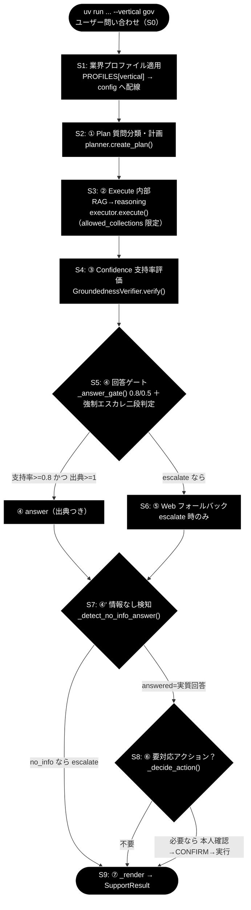
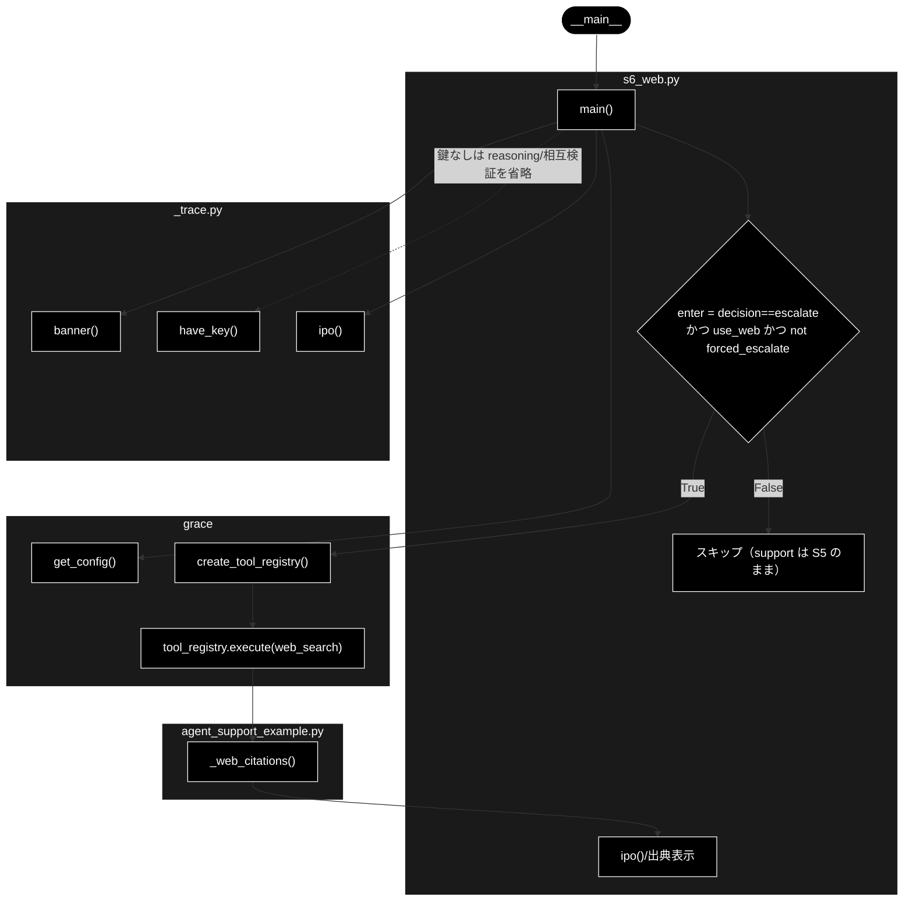

# s6_web.py - S6. ⑤ Web フォールバック トレーススタブ ドキュメント

**Version 1.1** | 最終更新: 2026-07-09

---

## 目次

1. [概要](#概要)
2. [責務](#責務)
3. [1. アーキテクチャ構成図（回答判定フロー）](#1-アーキテクチャ構成図回答判定フロー)
4. [1.1 ソース構成図（本モジュールの呼び出し構造）](#11-ソース構成図本モジュールの呼び出し構造)
5. [2. 回答ポリシー（groundedness ゲート）](#2-回答ポリシーgroundedness-ゲート)
5. [7. プログラム構成（実装済み関数 ＋ IPO 詳細）](#7-プログラム構成実装済み関数--ipo-詳細)
6. [8. CLI 仕様](#8-cli-仕様)
7. [依存関係](#依存関係)
8. [変更履歴](#変更履歴)

---

## 概要

`grace/step_trace/s6_web.py` は、`agent_support_example.py` の `run_support_agent()`
のうち **S6. ⑤ Web フォールバック** の 1 ステップだけを取り出した
トレース用スタブである。中心となるのは次の分岐条件そのものの評価である。

```python
if decision == "escalate" and use_web and not forced_escalate:
```

この条件が `True` になったとき（＝内部 RAG の裏付けが不足して `escalate` に
倒れ、かつユーザーが Web を許可し、かつエスカレ語による強制エスカレでない）に
限り、⑤ ブロック内側（`web_search` → `reasoning` → 相互検証、または executor が
同一クエリで Web 使用済みのときは内部回答の再検証のみ）に進入する。

gov 代表例（「住民票の写しの取り方は？」）は S5 までで `decision == "answer"` に
なるため、この分岐は **丸ごとスキップ**される。この「進入するか・しないか」の
条件評価自体が S6 の主眼である。escalate を強制して内側の挙動を観察するには
`--force-escalate` を、S5 の確定値を直接渡すには `--decision escalate` を用いる。

本スタブは `_trace.py` の `banner()` / `ipo()` / `have_key()` を用いて
**IN → Process → OUT** の 3 段で標準出力に構造を示す。Web 検索の実呼び出しは
バックエンド設定（DuckDuckGo / Google CSE / SerpAPI）とネットワークに依存し、
`reasoning` / 相互検証は Anthropic Claude（`ANTHROPIC_API_KEY`）を要するため、
鍵が無い環境では web_search のみを試行し、reasoning・相互検証はスキップする。

- LLM: **Anthropic Claude**（既定 `claude-sonnet-4-6`、軽量 `claude-haiku-4-5-20251001`）／鍵 `ANTHROPIC_API_KEY`
- Embedding（内部 RAG 検索）: **Gemini** `gemini-embedding-001`（3072次元）／鍵 `GOOGLE_API_KEY`

### 主要機能一覧

| 機能 | 説明 |
|------|------|
| `main()` | 引数を解釈し ⑤ 分岐条件を評価。進入時は web_search を試行し、鍵ありなら reasoning・相互検証の役割を示す |

---

## 責務

- S5 までで確定した `decision` と CLI 引数から `use_web` / `forced_escalate` を組み立て、`if decision == "escalate" and use_web and not forced_escalate:` を評価する
- 分岐に**入らない**理由（`answer` である／`--no-web`／強制エスカレ）を IN/Process/OUT で明示する（gov 代表例は `answer` のためスキップ）
- 分岐に**入る**とき、`create_tool_registry(config)` で作った `tool_registry.execute("web_search", ...)` を試行し、`agent_support_example._web_citations()` で Web 出典を組み立てて表示する
- 内側ロジックの役割（web 使用済みなら再検証のみ＝`web_reused`、未使用なら web_search→reasoning→相互検証→`_answer_gate` 再判定／`_pick_groundedness`／`_merge_citations`）を Process 欄で説明する
- 鍵の有無（`have_key()`）に応じて reasoning・相互検証をスキップし、web_search のみ試行するフォールバックを提供する

---

## 1. アーキテクチャ構成図（回答判定フロー）

本モジュールは共通フロー（S0〜S9）のうち **`WEB`（S6）** に対応する。



> 本モジュール `s6_web.py` は上図の **`WEB`（S6. ⑤ Web フォールバック）** ノードだけを
> 取り出したトレーススタブである。S5（`GATE`）で `escalate` になった経路のみが
> `WEB` に流れ、その後 S7（`NOINFO`）へ合流する。

---

### 1.1 ソース構成図（本モジュールの呼び出し構造）

`grace/step_trace/s6_web.py` そのものの呼び出し構造を示す。`main()` は
`get_config()` で設定を得たあと、`enter = decision == "escalate" and use_web and not forced_escalate`
を評価する。`False` なら ⑤ をスキップ（`support` は S5 のまま）し、`True` のときだけ
`create_tool_registry()` → `tool_registry.execute("web_search", ...)` を試行し、
`agent_support_example._web_citations()` で出典を組み立てて表示する。`have_key()` が
`False`（`ANTHROPIC_API_KEY` 未設定）の場合は reasoning／相互検証を省略し、web_search のみ試行する。



> スタブでは `forced_escalate` を常に `False` 固定とし、`--force-escalate` は
> `decision` を `escalate` にする用途で使う（本体 `run_support_agent` では
> 強制エスカレ時に ⑤ をスキップするが、本スタブは可視化のため固定している）。

---

## 2. 回答ポリシー（groundedness ゲート）

gov のしきい値は `notify_th=0.8 / confirm_th=0.5`。S5 の `_answer_gate()` は次の
方針で `decision` を決め、`escalate` かつ 非強制のときだけ S6 の Web 裏取りに入る。

| 状態 | 条件 | decision | 振る舞い |
|------|------|----------|---------|
| 自信あり | verified かつ 出典≥1 かつ 支持率≥notify_th（gov=0.8） | `answer` | 出典つきで自動回答 |
| 要注意 | confirm_th≤支持率<notify_th（gov=0.5〜0.8） | `answer`（warning=True） | 「未確認の注意書き」つきで回答 |
| わからない | 支持率<confirm_th または 出典0／verified=False | `escalate` | Web フォールバック→なお不足なら有人 |

> 設計意図: 根拠のない断定を構造的に出さない。内部で裏付けが不足した（escalate）
> ときのみ Web で裏取りし、相互検証を経て answer 化する。強制エスカレ
> （`forced_escalate=True`、エスカレ語検知）時は安全側に倒し、Web もスキップする。

S6 の進入条件は本ポリシーを踏まえた次の 1 行である。

```python
enter = decision == "escalate" and use_web and not forced_escalate
```

- `decision == "answer"`（gov 代表例）→ 進入せず、`support` は S5 のまま
- `--no-web`（`use_web=False`）→ 進入せず
- `forced_escalate=True`（強制エスカレ）→ 進入せず（Web もスキップ）

進入した場合、内側は 2 通りに分岐する。

- **executor が同一クエリで Web 使用済み**（`used_dynamic_web` かつ内部回答あり）→
  回答を作り直さず、内部回答を Web 本文スニペットで**再検証のみ**行う
  （`web_reused=True`。重複していた web_search→reasoning の 2 周目・相互検証を省略）
- **Web 未使用**→ `web_search` → `reasoning` → 相互検証（`SourceAgreementCalculator`）
  → `_answer_gate` 再判定 → `_pick_groundedness` / `_merge_citations` で
  `SupportResult` を再構築

---

## 7. プログラム構成（実装済み関数 ＋ IPO 詳細）

| 関数 | 概要 |
|------|------|
| `main()` | 引数解釈 → ⑤ 分岐条件を評価（IN/Process/OUT 表示）→ 進入時は web_search 試行・出典表示 |

### 7.6 クラス・関数 IPO 詳細

#### `main`

**概要**: CLI 引数から `decision` / `use_web` / `forced_escalate` を組み立て、
`if decision == "escalate" and use_web and not forced_escalate:` を評価する。
進入する場合のみ `tool_registry.execute("web_search", ...)` を試行し、
`_web_citations()` で Web 出典を表示する。gov 代表例（`answer`）はスキップする。

```python
def main() -> None
```

| パラメータ | 型 | デフォルト | 説明 |
|------------|------|-----------|------|
| `query` | str（位置引数・任意） | `"住民票の写しの取り方は？"` | Web 検索に渡す問い合わせ文 |
| `--vertical` | `{gov, saas, ec}` | `None` | 業界プロファイル（このスタブでは分岐条件の可視化が主眼で config には未配線） |
| `--decision` | `{answer, escalate}` | `"answer"` | S5 までで確定した decision（既定 answer＝gov 代表例） |
| `--force-escalate` | フラグ（`store_true`） | `False` | decision=escalate を強制し、⑤ ブロックに入る様子を見る |
| `--no-web` | フラグ（`dest="use_web", store_false"`） | `use_web=True` | Web フォールバックを無効化（進入させない） |

| 項目 | 内容 |
|------|------|
| **Input** | `decision`（`--force-escalate` 指定時は `"escalate"`、否なら `--decision` 値）, `use_web`（`--no-web` で False）, `forced_escalate`（このスタブでは常に `False`） |
| **Process** | 1. `banner()` で見出し表示<br>2. `config = get_config()`<br>3. `enter = decision == "escalate" and use_web and not forced_escalate` を評価し `ipo()` で IN/Process/OUT 表示<br>4. 非進入なら「⑤ はスキップ」を出力して return<br>5. 進入時: `have_key()` が False なら reasoning/相互検証はスキップと通知<br>6. `create_tool_registry(config)` → `tool_registry.execute("web_search", query=args.query)`<br>7. 成功時は `ase._web_citations(web_output)` で出典を組み立てて列挙表示 |
| **Output** | `None`（標準出力に ⑤ 進入可否と Web 出典を表示。副作用のみ） |

**進入時の本体ロジック（`agent_support_example.py` ⑤ ブロックの対応関係）**:

| 局面 | 実装（`run_support_agent` 内） | 挙動 |
|------|------------------------------|------|
| Web 使用済み再利用 | `reuse_internal = used_dynamic_web and bool(internal_answer)` | `web_reused=True`。内部回答を本文スニペットで再検証のみ（reasoning・相互検証は省略） |
| Web 未使用 | `web_search` → `reasoning`（`tool_registry.execute("reasoning", ...)`） | 新規に Web 回答を生成 |
| 相互検証 | `agreement_calc.calculate([internal_answer, web_answer])` | 一致度 < `confirm_th` なら矛盾扱い（再利用時はスキップ） |
| 再判定 | `_answer_gate(...)` → `_pick_groundedness(gres, gres_web)` / `_merge_citations(...)` | `SupportResult` を再構築（answer なら Web 回答、否なら内部回答を採用） |

**戻り値例**:
```python
# main() は戻り値なし（None）。標準出力の例（--decision escalate 進入時・鍵なし）:
# IN     : decision='escalate', use_web=True, forced_escalate=False
# Process: `if decision == "escalate" and use_web and not forced_escalate:` を評価。...
# OUT    : ⑤ ブロックへ進入
#
#   ⑤ に進入 → web_search を試行
#   ⚠️ ANTHROPIC_API_KEY 未設定のため reasoning/相互検証はスキップ。web_search のみ試行します。
#   [web] 3 件の出典を取得
#     - [Web] 配送遅延のお知らせ（https://example.com/...）
```

```python
# 使用例（gov 代表例＝スキップ）
#   uv run python grace/step_trace/s6_web.py --vertical gov "住民票の写しの取り方は？"
# IN     : decision='answer', use_web=True, forced_escalate=False
# OUT    : 分岐に入らない（support は S5 のまま）   # gov 代表例は decision='answer'
#   ⑤ はスキップ（decision='answer' か --no-web か forced_escalate のため）
```

---

## 8. CLI 仕様

| 引数 | 種別 | デフォルト | 説明 |
|------|------|-----------|------|
| `query` | 位置引数（任意） | `"住民票の写しの取り方は？"` | Web 検索に渡す問い合わせ文 |
| `--vertical` | 選択（`gov`/`saas`/`ec`） | `None` | 業界プロファイル指定 |
| `--decision` | 選択（`answer`/`escalate`） | `answer` | S5 で確定した decision。既定 answer＝gov 代表例（スキップ） |
| `--force-escalate` | フラグ | 未指定（False） | decision=escalate を強制し ⑤ に進入させる |
| `--no-web` | フラグ | 未指定（`use_web=True`） | Web フォールバックを無効化（進入させない） |

### 実行例（uv run）

```bash
# gov: decision='answer' のため ⑤ はスキップ（進入しないことを確認）
uv run python grace/step_trace/s6_web.py --vertical gov "住民票の写しの取り方は？"

# saas: --force-escalate で escalate を強制し ⑤ ブロックへ進入
uv run python grace/step_trace/s6_web.py --vertical saas --force-escalate "最新の障害情報は？"

# ec: --decision escalate で S5 の確定値を直接渡して ⑤ ブロックへ進入
uv run python grace/step_trace/s6_web.py --vertical ec --decision escalate "最新の配送遅延情報は？"
```

> `--force-escalate` と `--decision escalate` はいずれも進入させるが、意味が異なる。
> 前者は「エスカレ語などで escalate を強制」する経路の模擬、後者は「S5 のゲートが
> 支持率不足で escalate に倒れた」確定値をそのまま渡す経路の模擬である。なお本体
> （`run_support_agent`）では `forced_escalate=True`（強制エスカレ）のとき ⑤ は
> スキップされるが、本スタブでは可視化のため `forced_escalate` を常に `False` に
> 固定し、`--force-escalate` は「decision を escalate にする」用途で使う。

---

## 依存関係

| 種別 | 依存先 | 用途 |
|------|--------|------|
| 内部（step_trace 共通） | `_trace`（`banner` / `ipo` / `have_key`） | 見出し・IN/Process/OUT 表示・`ANTHROPIC_API_KEY` 有無判定 |
| 内部（本体ロジック） | `agent_support_example`（`ase._web_citations`） | Web 検索結果から出典表示文字列を生成。⑤ 本体の `_pick_groundedness` / `_merge_citations` / `web_reused` の役割説明の参照元 |
| 内部（grace パッケージ） | `grace`（`create_tool_registry` / `get_config`） | `web_search`（＋鍵ありなら `reasoning`）ツールの生成・実行、設定取得 |
| ツール（`grace.tools`） | `WebSearchTool`（`name="web_search"`） / `ReasoningTool`（`name="reasoning"`） | Web 検索の実行と Web 回答生成（Anthropic Claude） |
| 検証（`grace.confidence`） | `SourceAgreementCalculator.calculate()` | 内部回答 × Web 回答の一致度算出（相互検証。再利用時はスキップ） |
| 標準ライブラリ | `argparse` | CLI 引数解釈 |

---

## 変更履歴

| バージョン | 日付 | 変更内容 |
|-----------|------|---------|
| 1.0 | 2026-07-09 | 初版作成（S6. ⑤ Web フォールバック トレーススタブの IPO ドキュメント化） |
| 1.1 | 2026-07-09 | 「1.1 ソース構成図」（本モジュールの呼び出し構造の Mermaid）を追加 |
