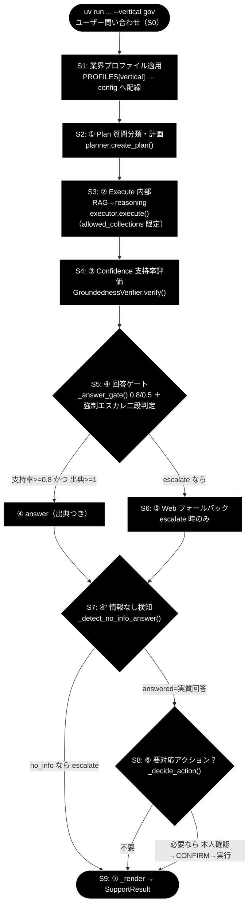
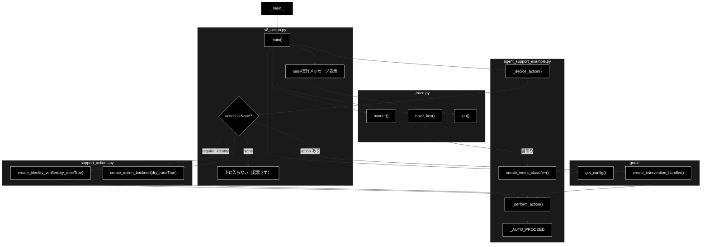
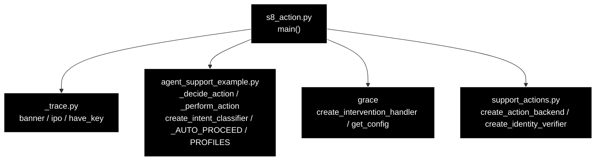

# s8_action.py - S8 ⑥ Action（本人確認 → HITL CONFIRM → ActionTool 実行）トレース ドキュメント

**Version 1.1** | 最終更新: 2026-07-09

---

## 目次

1. [概要](#概要)
2. [責務](#責務)
3. [1. アーキテクチャ構成図（回答判定フロー）](#1-アーキテクチャ構成図回答判定フロー)
   - [1.1 ソース構成図（本モジュールの呼び出し構造）](#11-ソース構成図本モジュールの呼び出し構造)
4. [2. 回答ポリシー（groundedness ゲート）](#2-回答ポリシーgroundedness-ゲート)
5. [7. プログラム構成（実装済み関数 ＋ IPO 詳細）](#7-プログラム構成実装済み関数--ipo-詳細)
6. [8. CLI 仕様](#8-cli-仕様)
7. [依存関係](#依存関係)
8. [変更履歴](#変更履歴)

---

## 概要

`grace/step_trace/s8_action.py` は、サポートエージェント本体 `agent_support_example.py`
の `run_support_agent()` から **S8. ⑥ Action** の 1 ステップだけを取り出したトレース用
スタブである。回答が確定した後に「要対応アクション（起票・返信・エスカレ）」が必要かを
`action = _decide_action(query, decision, profile, classify)` で判定し、必要な場合のみ
`_perform_action(action, handler, backend, identity_verifier, identity)` を呼んで
**本人確認 → HITL CONFIRM 承認 → ActionTool 実行（既定ドライラン）** の順を
IN → Process → OUT の 3 段で標準出力に示す。

- 既定ドライラン（`create_action_backend(dry_run=True)` / `create_identity_verifier(dry_run=True)`）
  のため副作用はない。
- gov 代表例（「住民票の写しの取り方は？」）は `action_map` に候補語なし → `action=None`
  となり ⑥ ブロックに入らない（起票せず回答のみ）。
- EC「返品したい」は `create_ticket` を検出 →（EC は `require_identity=True`）本人確認
  → CONFIRM 承認 → dry-run 実行、という別挙動を示す。

LLM は Anthropic Claude（意図分類の軽量既定 `claude-haiku-4-5-20251001`、
汎用既定 `claude-sonnet-4-6`、鍵 `ANTHROPIC_API_KEY`）、Embedding は Gemini
`gemini-embedding-001`（3072次元、鍵 `GOOGLE_API_KEY`）を用いる。本ステップは
LLM 呼び出しを意図分類（第 2 段）でのみ使い、鍵が無い場合はキーワード判定に倒す。

---

## 責務

- `_decide_action()` を実コードのまま呼び、二段判定（第 1 段 `_match_keyword` →
  第 2 段 意図分類）で `ActionRequest` か `None` を得る。
- `action` が `None` でなければ、`create_intervention_handler` の HITL ハンドラ、
  `create_action_backend(dry_run=True)` のバックエンド、（プロファイルが
  `require_identity=True` のとき）`create_identity_verifier(dry_run=True)` を組み、
  `_perform_action()` に **本人確認 → CONFIRM → backend.execute** を委譲する。
- 実行メッセージ・`identity_checked`・`backend.name` を表示し、S8 の構造だけを
  最小トレースする（応答整形 S9 や KPI 集計は行わない）。

---

## 1. アーキテクチャ構成図（回答判定フロー）

共通フロー（S0〜S9）における本モジュールの位置は **`ACT`（S8）** に対応する。



> **本モジュール ＝ `ACT`（S8）に対応**。answer 確定後の「要対応アクション？」判定と、
> 必要時の 本人確認 → CONFIRM → 実行 の段を取り出してトレースする。

---

### 1.1 ソース構成図（本モジュールの呼び出し構造）

上の共通フロー図とは別に、**`s8_action.py` そのものの関数呼び出し構造**を示す。
`main()` は `_trace`（`banner`/`have_key`/`ipo`）と `grace`（`get_config`/
`create_intervention_handler`）を土台に、`agent_support_example`（`create_intent_classifier`/
`_decide_action`/`_perform_action`/`_AUTO_PROCEED`）と `support_actions`
（`create_action_backend`/`create_identity_verifier`、いずれも `dry_run=True`）を配線する。
`_decide_action()` の結果 `action` が `None` なら ⑥ に入らず起票しない。`action` があれば
`profile.require_identity` に応じて本人確認器を組み、`_perform_action()` に
本人確認 → CONFIRM → `backend.execute` を委譲する。



> `_decide_action` が `None` を返すと ⑥ ブロックに入らず起票しない。`action` があるときのみ
> `create_intervention_handler` の HITL ハンドラ・`create_action_backend(dry_run=True)`・
> （`require_identity=True` の profile では）`create_identity_verifier(dry_run=True)` を
> `_perform_action()` に渡し、本人確認 → CONFIRM（`_AUTO_PROCEED`）→ `backend.execute` を実施する。

---

## 2. 回答ポリシー（groundedness ゲート）

S8 は回答（answer）が確定した後の **要対応アクション**を扱うステップである。回答自体は
S5 の groundedness ゲートで決まり、gov のしきい値は `notify_th=0.8 / confirm_th=0.5`。
EC プロファイルは `require_identity=True` のため、アクション実行前に本人確認が必須になる。

| 状態 | 条件 | decision | 振る舞い |
|------|------|----------|---------|
| 自信あり | verified かつ 出典≥1 かつ 支持率≥notify_th（gov=0.8） | `answer` | 出典つきで自動回答 |
| 要注意 | confirm_th≤支持率<notify_th（gov=0.5〜0.8） | `answer`（warning=True） | 「未確認の注意書き」つきで回答 |
| わからない | 支持率<confirm_th または 出典0／verified=False | `escalate` | Web フォールバック→なお不足なら有人 |

> 設計意図: 根拠のない断定を構造的に出さない。回答が確定しても要対応アクションは人間承認
> （CONFIRM）を挟み、EC 等は本人確認を必須にして誤操作を防ぐ。

---

## 7. プログラム構成（実装済み関数 ＋ IPO 詳細）

### 関数一覧

| 関数 | 定義元 | 役割 |
|------|--------|------|
| `main()` | 本モジュール `s8_action.py` | S8 トレースのエントリポイント。`_decide_action` → 必要時 `_perform_action` を実コードで呼ぶ |
| `ase._decide_action()` | 参照: `agent_support_example.py` | 二段判定でアクション（`ActionRequest` or `None`）を決める |
| `ase._perform_action()` | 参照: `agent_support_example.py` | 本人確認 → CONFIRM → `backend.execute` を実施し結果メッセージを返す |
| `ase.create_intent_classifier()` | 参照: `agent_support_example.py` | 意図分類器（軽量 Claude・第 2 段） |
| `ase._AUTO_PROCEED` | 参照: `agent_support_example.py` | HITL を自動承認する `InterventionResponse(PROCEED)` |
| `create_intervention_handler()` | 参照: `grace`（`grace.intervention`） | HITL 介入ハンドラ生成 |
| `get_config()` | 参照: `grace`（`grace.config`） | 実行設定の取得 |
| `create_action_backend()` | 参照: `support_actions.py` | 実行バックエンド生成（`dry_run=True` で `DryRunActionBackend`） |
| `create_identity_verifier()` | 参照: `support_actions.py` | 本人確認フロー生成（`dry_run=True` でデモ照合＝常に確認済み） |

> `_decide_action` / `_perform_action` / `_AUTO_PROCEED` / `create_intent_classifier` /
> `PROFILES` は **`agent_support_example` 由来**、`create_action_backend` /
> `create_identity_verifier` / `backend.name` / `backend.execute` は **`support_actions` 由来**、
> `create_intervention_handler` / `get_config` は **`grace` 由来**である。

### 7.6 クラス・関数 IPO 詳細

#### `main()`

**概要**

S8 トレースの唯一のエントリポイント。引数（`query` / `--vertical` / `--decision`）を
受け取り、プロファイルと（鍵があれば）意図分類器を用意して `_decide_action()` を実行。
`action` が `None` でなければ HITL ハンドラ・バックエンド・（必要時）本人確認器を組み、
`_perform_action()` で 本人確認 → CONFIRM → dry-run 実行 の順を IN/Process/OUT で示す。

**シグネチャ**

```python
def main() -> None
```

**パラメータ（CLI 引数）**

| 引数 | 種別 | 既定値 | 説明 |
|------|------|--------|------|
| `query` | 位置引数（任意） | `"住民票の写しの取り方は？"` | 問い合わせ本文。gov 代表例は候補語なしで `action=None` |
| `--vertical` | 選択（`gov`/`saas`/`ec`） | `None` | 業界プロファイル。未指定なら既定マッピングで判定 |
| `--decision` | 選択（`answer`/`escalate`） | `answer` | S5 の回答判定。`escalate` なら常に `escalate_to_human` を起票 |

**IPO テーブル**

| 区分 | 内容 |
|------|------|
| **Input** | `query`、`decision`（`--decision`）、`profile`（`PROFILES[--vertical]`。`profile.action_map` と `profile.require_identity` を参照）、鍵があれば `classify`（意図分類器） |
| **Process** | 1. `_decide_action()`：`decision="escalate"` なら `escalate_to_human` を返す。`answer` の場合 **第 1 段** `_match_keyword(query, profile.action_map)` で候補検出 → **第 2 段** `classify(query)` が `question` なら起票せず `None`、`request`/`incident`（または分類器なし/失敗）なら `ActionRequest` を返す<br>2. `action` があれば `_perform_action()`：`identity_verifier` 指定時は本人確認 → HITL `CONFIRM` 承認（`_AUTO_PROCEED`）→ `backend.execute()`（`dry_run=True` の `[DRY-RUN]` 実行） |
| **Output** | `action`（`ActionRequest` or `None`）。実行時は `result_msg`（例 `[DRY-RUN] 'create_ticket' を実行（ログのみ・args=...）`）、`identity_checked`（＝`require_identity`）、`backend.name`（`dry-run`）を表示 |

**戻り値例**

```text
# gov: 「住民票の写しの取り方は？」（action_map に候補語なし）
OUT    : action = None
  ⑥ に入らない（action_map に候補なし → 起票せず回答のみ）

# ec: 「返品したい」（返品→create_ticket・require_identity=True）
OUT    : action = ActionRequest(action_type='create_ticket', args={'query': '返品したい', 'matched': '返品'}, requires_confirmation=True)
  [action] 種別=create_ticket（要承認=True）
   [action] 本人確認（demo）: 確認済み — 識別子が台帳と一致しました
  [action] [DRY-RUN] 'create_ticket' を実行（ログのみ・args={'query': '返品したい', 'matched': '返品'}）
  [action] identity_checked=True / backend=dry-run
```

**使用例**

```bash
# gov 代表例: action_map に候補なし → action=None（⑥ に入らず起票せず）
uv run python grace/step_trace/s8_action.py --vertical gov "住民票の写しの取り方は？"

# ec: 「返品したい」で create_ticket → 本人確認（require_identity=True）→ CONFIRM → dry-run
uv run python grace/step_trace/s8_action.py --vertical ec "返品したい"
```

- **gov（`action=None`）**: `profile.action_map={申請,手続,様式→send_reply}` に「取り方」の
  候補語がないため第 1 段で候補なし → 第 2 段の意図分類は走らず `None`。⑥ ブロックに入らず、
  本人確認も CONFIRM も実行されない。
- **ec（`create_ticket` ＋ 本人確認）**: 「返品」が `action_map` に一致し `create_ticket` を
  起票。EC は `require_identity=True` のため `create_identity_verifier(dry_run=True)`（デモ照合＝
  常に確認済み）で本人確認 → CONFIRM 承認 → `backend.execute` を dry-run 実行し、
  `identity_checked=True` を示す。

---

## 8. CLI 仕様

### 引数

| 引数 | 種別 | 既定値 | 説明 |
|------|------|--------|------|
| `query` | 位置引数（任意） | `"住民票の写しの取り方は？"` | 問い合わせ本文 |
| `--vertical` | `gov` / `saas` / `ec` | `None` | 業界プロファイル選択 |
| `--decision` | `answer` / `escalate` | `answer` | S5 の回答判定（`escalate` は常に有人エスカレ起票） |

### 実行例（uv run）

```bash
# gov: 候補語なし → action=None（起票せず回答のみ）
uv run python grace/step_trace/s8_action.py --vertical gov "住民票の写しの取り方は？"

# saas: 「不具合」等が create_ticket に一致（require_identity=False → 本人確認なし）
uv run python grace/step_trace/s8_action.py --vertical saas "ログインエラーの不具合を調査してほしい"

# ec: 「返品したい」で create_ticket → require_identity=True で本人確認 → CONFIRM → dry-run
uv run python grace/step_trace/s8_action.py --vertical ec "返品したい"
```

- **gov**: `action_map={申請,手続,様式→send_reply}`。代表例は候補なしで `action=None`。
- **saas**: `action_map={エラー,不具合,バグ→create_ticket}`、`require_identity=False`。
  「不具合」に一致 → 本人確認なしで CONFIRM → dry-run。
- **ec**: `action_map={返品,交換,キャンセル,解約→create_ticket}`、`require_identity=True`。
  「返品したい」で本人確認が必須になる。

> `--decision escalate` を渡すと `_decide_action` は入力語に関わらず
> `ActionRequest("escalate_to_human", ...)` を返し、CONFIRM → dry-run 実行される。

---

## 依存関係



| 依存 | 用途 |
|------|------|
| `_trace`（`banner` / `ipo` / `have_key`） | 見出し・IN/Process/OUT 表示・鍵有無判定 |
| `agent_support_example`（`ase`） | `_decide_action` / `_perform_action` / `create_intent_classifier` / `_AUTO_PROCEED` / `PROFILES` |
| `grace`（`create_intervention_handler` / `get_config`） | HITL 介入ハンドラ生成・実行設定取得 |
| `support_actions`（`create_action_backend` / `create_identity_verifier`） | dry-run バックエンド・本人確認フロー生成（`backend.name` / `backend.execute`） |

---

## 変更履歴

| バージョン | 日付 | 変更内容 |
|-----------|------|---------|
| 1.0 | 2026-07-09 | 初版作成。S8 ⑥ Action トレーススタブ（`_decide_action` → `_perform_action`、本人確認 → CONFIRM → dry-run）を IPO・CLI・依存関係で記述 |
| 1.1 | 「1.1 ソース構成図」（本モジュールの呼び出し構造の Mermaid）を追加 |
