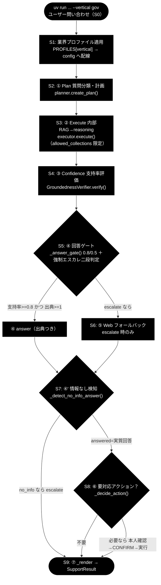
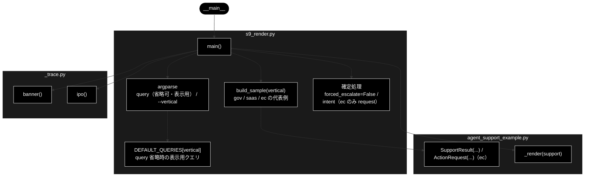
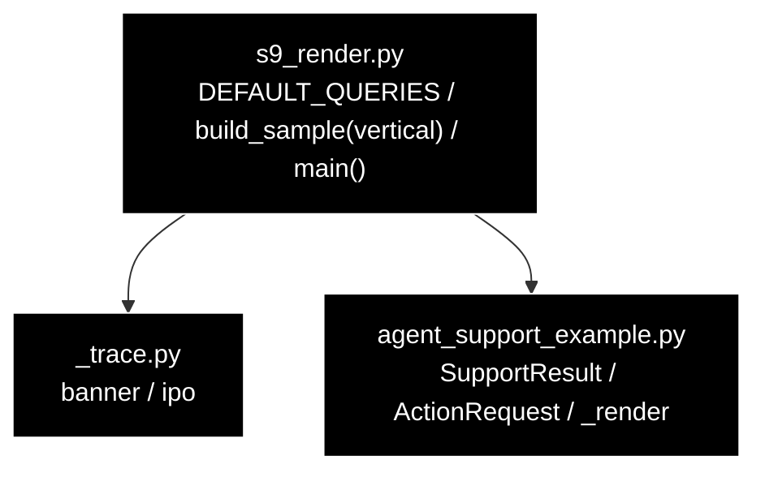

# s9_render.py - S9 ⑦ 応答整形（SupportResult 最終形 → _render 整形表示）ドキュメント

**Version 1.2** | 最終更新: 2026-07-10

---

## 目次

1. [概要](#概要)
2. [責務](#責務)
3. [1. アーキテクチャ構成図（回答判定フロー）](#1-アーキテクチャ構成図回答判定フロー)
   - [1.1 ソース構成図（本モジュールの呼び出し構造）](#11-ソース構成図本モジュールの呼び出し構造)
4. [2. 回答ポリシー（groundedness ゲート）](#2-回答ポリシーgroundedness-ゲート)
5. [7. プログラム構成（実装済み関数 ＋ IPO 詳細）](#7-プログラム構成実装済み関数--ipo-詳細)
6. [8. CLI 仕様](#8-cli-仕様)
7. [依存関係](#依存関係)
8. [変更履歴](#変更履歴)

---

## 概要

`grace/step_trace/s9_render.py` は、サポートエージェント本体 `agent_support_example.py`
の `run_support_agent()` から **S9. ⑦ 応答整形** の 1 ステップだけを取り出したトレース用
スタブである。各ステップ（S3〜S8）で少しずつ埋まった同一 `SupportResult` の**最終形**を、
`--vertical {gov, saas, ec}`（既定 gov）で選んだ業界別代表例の値で `build_sample(vertical)`
により組み立て、`support.forced_escalate` / `support.intent` を確定したうえで
`ase._render(support)` に渡し、**回答本文 ＋ 出典一覧 ＋ 根拠メタ行**を整形表示する。

- 他の sN スタブと**共通の CLI 書式**（省略可能な位置引数 `query` ＋ `--vertical`）で実行できる。
  `query` は**表示用**であり（banner 直後に `❓ 問い合わせ: <query>（--vertical <v> の代表例）`
  として表示）、整形処理は `build_sample(vertical)` が返す `SupportResult` のみに依存する。
  `query` 省略時はモジュール定数 `DEFAULT_QUERIES[vertical]` を表示する。
  LLM（Anthropic Claude）も Qdrant も呼ばず、鍵が無くても動作する（純粋な整形トレース）。
- `_render` / `SupportResult` / `ActionRequest` は本モジュールではなく `agent_support_example.py`
  由来である。本スタブは「最終形の組み立て」と「確定処理（`forced_escalate` / `intent`）」だけを
  担い、整形処理そのものは実コード `ase._render` をそのまま呼ぶ。
- 整形処理（`_render`）自体は全業界**共通**で、`build_sample(vertical)` が返す値だけが変わる：
  - **gov（既定）**: flow.md §3 の代表例（住民票）。内部 RAG のみで answer・出典 2 件
    （groundedness=0.86 / overall_confidence=0.78）
  - **saas**: API レート制限の回答。内部 RAG のみ・config 既定しきい値（notify=0.7）帯の例
    （groundedness=0.75 / overall_confidence=0.72）
  - **ec**: 返品規定の回答 ＋ ⑥ Action（`create_ticket`, dry-run）・本人確認済みの例
    （groundedness=0.82 / overall_confidence=0.76）。【アクション】行と intent=request が
    根拠メタに乗る様子を見る

技術スタックは、LLM = Anthropic Claude（汎用既定 `claude-sonnet-4-6`、意図分類の軽量既定
`claude-haiku-4-5-20251001`、鍵 `ANTHROPIC_API_KEY`）、Embedding = Gemini
`gemini-embedding-001`（3072次元、鍵 `GOOGLE_API_KEY`）である。ただし **S9 は応答整形のみ
で LLM・Qdrant を一切使用しない**（上流 S1〜S8 の成果物である `SupportResult` を受けて表示する
だけ）。

---

## 責務

- `--vertical {gov, saas, ec}`（既定 gov）と省略可能な位置引数 `query`（表示用）を argparse で
  受け取り、`query` 省略時は `DEFAULT_QUERIES[vertical]` を表示する（他の sN スタブと共通の
  CLI 書式）。banner 直後に `❓ 問い合わせ: <query>（--vertical <v> の代表例）` を表示する。
- `build_sample(vertical)` で業界別の代表 `ase.SupportResult` を組み立てる（gov は flow.md §3
  「データの積み上がり（SupportResult 最終形）」に一致。`answer` / `citations` /
  `groundedness` / `groundedness_decided` / `decision` / `warning` / `used_web` / `vertical` /
  `overall_confidence`、ec はさらに `action` / `action_result` / `identity_checked`）。
- `run_support_agent()` の末尾と同じ確定処理を再現する：`support.forced_escalate = False`
  （エスカレ語なし）、`support.intent = "request" if vertical == "ec" else None`
  （gov / saas の FAQ 質問は意図分類器が未発火。ec は action_map「返品」→二段判定で
  意図分類が走った代表例）。
- `ase._render(support)` を実コードのまま呼び、`decision` に応じて回答本文＋出典一覧＋
  根拠メタ行（支持率 / 全体信頼度 / decision / web / vertical / intent 等）を整形表示する
  （ec では【アクション】行も表示される）。
- IN → Process → OUT の 3 段で処理構造を標準出力に示す（LLM・Qdrant は使わない）。

---

## 1. アーキテクチャ構成図（回答判定フロー）

共通フロー（S0〜S9）における本モジュールの位置は **`OUT`（S9）** に対応する。



> **本モジュール ＝ `OUT`（S9）に対応**。S3〜S8 で積み上がった `SupportResult` の最終形を受け、
> `forced_escalate` / `intent` を確定してから `_render` で回答本文＋出典＋根拠メタを表示する
> 「出口」のステップを取り出してトレースする。

### 1.1 ソース構成図（本モジュールの呼び出し構造）

上の共通フロー図が S0〜S9 全体の位置づけを示すのに対し、ここでは **`s9_render.py`
そのもの**の呼び出し構造を示す。`main()` は argparse で位置引数 `query`（省略可・表示用）と
`--vertical {gov, saas, ec}`（既定 gov）を受け取り、`query` 省略時はモジュール定数
`DEFAULT_QUERIES[vertical]` を表示に使う。`build_sample(vertical)` で業界別代表の
`SupportResult` を組み立て、`support.forced_escalate=False` /
`support.intent`（ec のみ `"request"`、それ以外は `None`）を確定したうえで、
`banner()` / `ipo()`（`_trace.py`）で見出し・IPO を表示し、最後に
`agent_support_example._render(support)` で回答本文＋出典＋根拠メタ行を整形表示する。
`SupportResult` / `ActionRequest` / `_render` は `agent_support_example.py` 由来で、
LLM・Qdrant は使用しない。



> `main()` は argparse（`query` / `--vertical` の解析）→ `banner()`（見出し）→ 問い合わせ表示
> （`❓ 問い合わせ: <query>（--vertical <v> の代表例）`）→ `build_sample(vertical)`（最終形
> `SupportResult` の組み立て）→ 確定処理（`forced_escalate` / `intent`）→ `ipo()`
> （IN/Process/OUT 表示）→ `_render(support)`（整形表示）の順に呼ぶ。本モジュールで定義される
> のは `DEFAULT_QUERIES` / `build_sample()` / `main()` のみで、`banner` / `ipo` は `_trace`、
> `SupportResult` / `ActionRequest` / `_render` は `agent_support_example` 由来。

---

## 2. 回答ポリシー（groundedness ゲート）

回答するか有人にエスカレするかは S5 の groundedness ゲートで決まり、gov のしきい値は
`notify_th=0.8 / confirm_th=0.5`（saas / ec は config 既定しきい値。notify=0.7 帯）。
S9 はその確定した `decision` に応じて、回答本文＋根拠メタを表示するステップである
（gov / saas / ec いずれの代表例も `decision="answer"`）。

| 状態 | 条件 | decision | 振る舞い |
|------|------|----------|---------|
| 自信あり | verified かつ 出典≥1 かつ 支持率≥notify_th（gov=0.8） | `answer` | 出典つきで自動回答 |
| 要注意 | confirm_th≤支持率<notify_th（gov=0.5〜0.8） | `answer`（warning=True） | 「未確認の注意書き」つきで回答 |
| わからない | 支持率<confirm_th または 出典0／verified=False | `escalate` | Web フォールバック→なお不足なら有人 |

> 設計意図: 根拠のない断定を構造的に出さない。S9 は根拠メタ（支持率・decision・web・vertical 等）
> を必ず併記し、回答の裏付け状態を可視化する。`decision="answer"` なら本文＋出典を、
> `escalate` なら「有人対応へエスカレーション」を表示する。

---

## 7. プログラム構成（実装済み関数 ＋ IPO 詳細）

### 構成要素一覧

| 要素 | 定義元 | 役割 |
|------|--------|------|
| `DEFAULT_QUERIES` | 本モジュール `s9_render.py` | 業界別の代表クエリを持つモジュール定数 dict（`{"gov": "住民票の写しの取り方は？", "saas": "APIのレート制限は？", "ec": "返品したい"}`）。`query` 省略時の表示用 |
| `build_sample(vertical)` | 本モジュール `s9_render.py` | 業界別（gov / saas / ec）の代表 `ase.SupportResult`（最終形）を組み立てて返す。gov（既定）は flow.md §3 の代表例に一致 |
| `main()` | 本モジュール `s9_render.py` | S9 トレースのエントリポイント。argparse（`query` / `--vertical`）→ `build_sample(vertical)` → 確定処理 → `ase._render` で整形表示 |
| `ase._render()` | 参照: `agent_support_example.py` | `decision` に応じて回答本文＋出典一覧＋（action があれば）【アクション】行＋根拠メタ行を整形表示する |
| `ase.SupportResult` | 参照: `agent_support_example.py` | サポート回答の結果を保持する dataclass（S9 が最終形を渡す型） |
| `ase.ActionRequest` | 参照: `agent_support_example.py` | 副作用のある操作要求の dataclass。ec 代表例の `action`（`create_ticket`）に使用 |
| `banner()` / `ipo()` | 参照: `grace/step_trace/_trace.py` | 見出し表示・IN/Process/OUT の 3 段表示 |

> `_render` / `SupportResult` / `ActionRequest` は **`agent_support_example`（`ase`）由来**であり、
> 本モジュールはそれらを import して使うだけである。`banner` / `ipo` は **`_trace` 由来**。
> `DEFAULT_QUERIES` / `build_sample` / `main` のみが本モジュールで定義される。

### 7.6 クラス・関数 IPO 詳細

#### `build_sample(vertical)`

**概要**

S3〜S8 を経た `ase.SupportResult` 最終形の**業界別代表例**を組み立てて返す。gov（既定）は
flow.md §3「データの積み上がり（SupportResult 最終形）」の代表例と一致し、saas は API
レート制限の回答例、ec は返品規定の回答＋⑥ Action（`create_ticket`, dry-run）を通った例を
返す。S3〜S8 が段階的に埋めた各フィールドを、各業界の最終値でまとめて設定した「完成品」を
用意する（LLM・Qdrant 不要）。

**シグネチャ**

```python
def build_sample(vertical: str = "gov") -> "ase.SupportResult"
```

**パラメータ**

| パラメータ | 型 | 既定値 | 説明 |
|-----------|-----|--------|------|
| `vertical` | `str` | `"gov"` | 業界プロファイル名（`"gov"` / `"saas"` / `"ec"`）。`"saas"` / `"ec"` 以外はすべて gov 代表例にフォールバック |

**IPO テーブル**

| 区分 | 内容 |
|------|------|
| **Input** | `vertical`（業界名。各業界の代表値は関数内部に固定で持つ） |
| **Process** | `vertical` で分岐して `ase.SupportResult(...)` を生成。<br>**gov（既定）**: `answer`（住民票の取り方）、`citations`（`gov_faq_anthropic` 2 件）、`groundedness=0.86`、`groundedness_decided=3`、`overall_confidence=0.78`<br>**saas**: `answer`（API レート制限）、`citations`（`saas_api_anthropic/rate_limit.md` / `saas_docs_anthropic/plans.md`）、`groundedness=0.75`、`groundedness_decided=3`、`overall_confidence=0.72`<br>**ec**: `answer`（返品規定）、`citations`（`ec_policy_anthropic/返品規定.md` / `ec_faq_anthropic/返品手続き.md`）、`groundedness=0.82`、`groundedness_decided=4`、`overall_confidence=0.76`、さらに `action=ActionRequest(action_type="create_ticket", args={"query": "返品したい", "matched": "返品"}, requires_confirmation=True)`、`action_result="[DRY-RUN] 'create_ticket' を実行（ログのみ・args=…）"`、`identity_checked=True`<br>共通: `decision="answer"`、`warning=False`、`used_web=False`、`vertical=<業界名>` |
| **Output** | `ase.SupportResult`: S9 が受け取る最終形（業界別代表例）。未指定フィールドは dataclass 既定値（gov / saas では `action=None` / `identity_checked=False`、全業界で `intent=None` / `forced_escalate=False` のまま `main()` の確定処理に渡る） |

**戻り値例**

```python
# build_sample()（gov 既定）
SupportResult(
    answer="住民票の写しは、お住まいの市区町村の窓口（市民課等）またはコンビニ交付・郵送で請求できます。…",
    citations=[
        "[社内] gov_faq_anthropic/住民票.md",
        "[社内] gov_faq_anthropic/窓口案内.md",
    ],
    groundedness=0.86,
    groundedness_decided=3,
    decision="answer",
    warning=False,
    used_web=False,
    vertical="gov",
    overall_confidence=0.78,
)

# build_sample("ec")（⑥ Action を通った例）
SupportResult(
    answer="返品は商品到着後 30 日以内に承ります。未開封・未使用が条件です。…",
    citations=[
        "[社内] ec_policy_anthropic/返品規定.md",
        "[社内] ec_faq_anthropic/返品手続き.md",
    ],
    groundedness=0.82,
    groundedness_decided=4,
    decision="answer",
    warning=False,
    used_web=False,
    vertical="ec",
    overall_confidence=0.76,
    # args / action_result は _decide_action と dry-run バックエンドの実出力形式に合わせる
    action=ActionRequest(action_type="create_ticket",
                         args={"query": "返品したい", "matched": "返品"},
                         requires_confirmation=True),
    action_result="[DRY-RUN] 'create_ticket' を実行"
                  "（ログのみ・args={'query': '返品したい', 'matched': '返品'}）",
    identity_checked=True,
)
```

**使用例**

```python
# 使用例
import agent_support_example as ase
from s9_render import build_sample

support = build_sample()          # gov（既定）
print(support.decision, support.vertical, support.groundedness)
# 出力: answer gov 0.86

support_ec = build_sample("ec")   # ⑥ Action（create_ticket, dry-run）を通った例
print(support_ec.action.action_type, support_ec.identity_checked)
# 出力: create_ticket True
```

#### `main()`

**概要**

S9 トレースの唯一のエントリポイント。argparse で省略可能な位置引数 `query`（**表示用**）と
`--vertical {gov, saas, ec}`（既定 gov）を受け取り、`query` 省略時は
`DEFAULT_QUERIES[vertical]` を表示に使う（他の sN スタブと共通の CLI 書式）。
`build_sample(args.vertical)` で最終形の `SupportResult` を得たあと、`run_support_agent()`
末尾と同じ確定処理（`forced_escalate=False` / `intent="request" if vertical == "ec" else None`）
を施し、`ipo(...)` で IN/Process/OUT を示してから `ase._render(support)` で端末に整形表示する。
整形処理は `SupportResult` のみに依存し、`query` は banner 直後の表示にしか使わない。

**シグネチャ**

```python
def main() -> None
```

**パラメータ（CLI 引数）**

`query`（位置引数・省略可）と `--vertical`（下記「8. CLI 仕様」参照）。

**IPO テーブル**

| 区分 | 内容 |
|------|------|
| **Input** | CLI 引数 `query` / `--vertical`、および `build_sample(vertical)` が返す業界別代表 `SupportResult`（S3〜S8 の積み上がりを再現した最終形） |
| **Process** | 1. argparse で `query`（省略可）と `--vertical`（`gov` / `saas` / `ec`、既定 `gov`）を解析。`query` 省略時は `DEFAULT_QUERIES[args.vertical]` を採用<br>2. `banner("S9. ⑦ 応答整形（_render → SupportResult 返却）")`<br>3. `❓ 問い合わせ: <query>（--vertical <v> の代表例）` を表示<br>4. `support = build_sample(args.vertical)`<br>5. 確定処理：`support.forced_escalate = False`（エスカレ語なし）、`support.intent = "request" if args.vertical == "ec" else None`（gov / saas の FAQ 質問は意図分類器が未発火。ec は action_map「返品」→二段判定で意図分類が走った代表例）<br>6. `ipo(...)` で IN/Process/OUT を表示（OUT 行に `decision` / `groundedness` / `vertical` / `intent` を含む）<br>7. `ase._render(support)`：`decision="answer"` なので回答本文 → 出典一覧 →（ec では【アクション】行 →）根拠メタ行（支持率 / 全体信頼度 / decision / web / vertical / intent）を整形表示 |
| **Output** | `None`（戻り値なし）。標準出力に問い合わせ表示＋IN/Process/OUT ＋ `_render` の整形表示を出す。本スタブは表示のみで、実本体の `run_support_agent()` はこの後 `return support` する |

**戻り値例**

```text
（--vertical gov・query 省略時）
============================================================
S9. ⑦ 応答整形（_render → SupportResult 返却）
============================================================
❓ 問い合わせ: 住民票の写しの取り方は？（--vertical gov の代表例）
IN     : support（S3〜S8 で確定した SupportResult）
Process: support.forced_escalate / support.intent を確定した後、
         _render(support) が回答本文＋出典一覧＋根拠メタ行を整形表示し、
         run_support_agent() が support を return
OUT    : decision='answer', groundedness=0.86, vertical='gov', intent=None
         端末表示（下記）＋ 呼び出し元へ SupportResult を返却

============================================================
応答
============================================================
住民票の写しは、お住まいの市区町村の窓口（市民課等）または…（本文）

【出典】
  [1] [社内] gov_faq_anthropic/住民票.md
  [2] [社内] gov_faq_anthropic/窓口案内.md

[根拠] 支持率(groundedness)=0.86 / 全体信頼度=0.78 / decision=answer / web=不使用 / vertical=gov
```

```text
（--vertical ec 時。【アクション】行と intent=request が乗る）
============================================================
S9. ⑦ 応答整形（_render → SupportResult 返却）
============================================================
❓ 問い合わせ: 返品したい（--vertical ec の代表例）
IN     : support（S3〜S8 で確定した SupportResult）
Process: support.forced_escalate / support.intent を確定した後、
         _render(support) が回答本文＋出典一覧＋根拠メタ行を整形表示し、
         run_support_agent() が support を return
OUT    : decision='answer', groundedness=0.82, vertical='ec', intent='request'
         端末表示（下記）＋ 呼び出し元へ SupportResult を返却

============================================================
応答
============================================================
返品は商品到着後 30 日以内に承ります。未開封・未使用が条件です。…（本文）

【出典】
  [1] [社内] ec_policy_anthropic/返品規定.md
  [2] [社内] ec_faq_anthropic/返品手続き.md

【アクション】種別=create_ticket / 結果=[DRY-RUN] 'create_ticket' を実行（ログのみ・args={'query': '返品したい', 'matched': '返品'}）

[根拠] 支持率(groundedness)=0.82 / 全体信頼度=0.76 / decision=answer / web=不使用 / vertical=ec / intent=request
```

**使用例**

```bash
# 使用例: --vertical で業界別代表例（SupportResult 最終形）を切り替えて整形表示
uv run python grace/step_trace/s9_render.py --vertical gov "住民票の写しの取り方は？"
uv run python grace/step_trace/s9_render.py --vertical ec "返品したい"
uv run python grace/step_trace/s9_render.py            # query 省略時は DEFAULT_QUERIES["gov"] を表示
```

#### SupportResult 最終形（各フィールド）

`build_sample(vertical)` が返し、S9 が受け取る `ase.SupportResult` の最終形。値は業界別代表例、
「埋めたステップ」は上流トレースでの充填元を示す（本スタブでは `build_sample()` が一括設定）。

| フィールド | 型 | gov（既定） | saas | ec | 埋めたステップ |
|---|---|---|---|---|---|
| `answer` | `Optional[str]` | 住民票の取り方の回答本文 | API レート制限の回答本文 | 返品規定の回答本文 | S3（② Execute） |
| `citations` | `List[str]` | `gov_faq_anthropic/住民票.md`・`同/窓口案内.md`（各 `[社内]`） | `saas_api_anthropic/rate_limit.md`・`saas_docs_anthropic/plans.md`（各 `[社内]`） | `ec_policy_anthropic/返品規定.md`・`ec_faq_anthropic/返品手続き.md`（各 `[社内]`） | S3（`_collect_citations`） |
| `groundedness` | `float` | `0.86` | `0.75` | `0.82` | S4（③ Confidence） |
| `groundedness_decided` | `int` | `3` | `3` | `4` | S4 |
| `decision` | `Decision` | `"answer"` | `"answer"` | `"answer"` | S5（④ ゲート） |
| `warning` | `bool` | `False` | `False` | `False` | S5 |
| `used_web` | `bool` | `False` | `False` | `False` | S3/S6 |
| `web_reused` | `bool` | `False`（既定値） | `False`（既定値） | `False`（既定値） | S6（未発火） |
| `action` | `Optional[ActionRequest]` | `None`（既定値） | `None`（既定値） | `ActionRequest(action_type="create_ticket", args={"query": "返品したい", "matched": "返品"}, requires_confirmation=True)` | S8（⑥ Action。ec のみ発火） |
| `action_result` | `Optional[str]` | `None`（既定値） | `None`（既定値） | `"[DRY-RUN] 'create_ticket' を実行（ログのみ・args=…）"` | S8（ec のみ） |
| `vertical` | `Optional[str]` | `"gov"` | `"saas"` | `"ec"` | S1 |
| `intent` | `Optional[Intent]` | `None`（分類器未発火） | `None`（分類器未発火） | `"request"`（action_map「返品」→二段判定で分類） | S9 確定処理 |
| `forced_escalate` | `bool` | `False` | `False` | `False` | S9 確定処理 |
| `identity_checked` | `bool` | `False`（既定値） | `False`（既定値） | `True`（本人確認済み） | S8 |
| `no_info_detected` | `bool` | `False`（既定値） | `False`（既定値） | `False`（既定値） | S7 |
| `overall_confidence` | `float` | `0.78` | `0.72` | `0.76` | S3（executor 由来） |

> `web_reused` / `no_info_detected` は全業界とも `build_sample()` では明示設定せず、dataclass
> 既定値（`False`）のまま S9 に届く。`action` / `action_result` / `identity_checked` は
> **ec のみ** `build_sample("ec")` が明示設定し（⑥ Action を通った例）、gov / saas は既定値の
> まま。`intent` / `forced_escalate` のみ `main()` の確定処理で明示的に上書きする
> （`intent` は ec のみ `"request"`）。

---

## 8. CLI 仕様

### 引数

| 引数 | 種別 | 既定値 | 説明 |
|------|------|--------|------|
| `query` | 位置引数（省略可） | `None`（省略時は `DEFAULT_QUERIES[vertical]` を表示） | 問い合わせ文。**表示用**（banner 直後の `❓ 問い合わせ:` 行にのみ使用）。整形処理は `SupportResult` のみに依存する |
| `--vertical` | オプション | `gov` | 表示する代表例（`SupportResult` 最終形）を切り替える。選択肢: `gov` / `saas` / `ec` |

> 他の sN スタブ（S1〜S8）と**共通の CLI 書式**。表示対象は `build_sample(vertical)` が返す
> 業界別代表の `SupportResult` で、`query` を変えても整形結果は変わらない。

### 実行例（uv run）

```bash
# 業界別代表例の SupportResult 最終形を _render で整形表示（LLM・Qdrant 不要）
uv run python grace/step_trace/s9_render.py --vertical gov "住民票の写しの取り方は？"
uv run python grace/step_trace/s9_render.py --vertical saas "APIのレート制限は？"
uv run python grace/step_trace/s9_render.py --vertical ec "返品したい"

# query を省略すると DEFAULT_QUERIES[vertical] が表示される（--vertical 省略時は gov）
uv run python grace/step_trace/s9_render.py
```

> **ec の表示**: ⑥ Action（`create_ticket`, dry-run・本人確認済み）を通った例のため、
> 出典一覧の後に `【アクション】種別=create_ticket / 結果=[DRY-RUN] 'create_ticket' を実行（ログのみ・args={'query': '返品したい', 'matched': '返品'}）`
> が表示され、根拠メタ行に `intent=request` が乗る。gov / saas は【アクション】行なし・
> `intent` 表示なし（`None`）である。

---

## 依存関係



| 依存 | 用途 |
|------|------|
| `argparse`（標準ライブラリ） | CLI 引数 `query`（省略可・表示用）/ `--vertical` の解析 |
| `_trace`（`banner` / `ipo`） | 見出し表示・IN/Process/OUT の 3 段表示 |
| `agent_support_example`（`ase`） | `SupportResult`（最終形の型）・`ActionRequest`（ec 代表例の action）・`_render`（回答本文＋出典＋【アクション】行＋根拠メタ行の整形表示）を提供 |

> 本ステップは **LLM（Anthropic Claude）・Qdrant を一切使用しない**。`build_sample(vertical)` が
> 業界別の固定 `SupportResult` を返すため、`ANTHROPIC_API_KEY` / `GOOGLE_API_KEY` が無くても
> 動作する。

---

## 変更履歴

| バージョン | 日付 | 変更内容 |
|-----------|------|---------|
| 1.0 | 2026-07-09 | 初版作成。S9 ⑦ 応答整形トレーススタブ（`build_sample()` で gov 代表 `SupportResult` 最終形を組み立て → `forced_escalate` / `intent` 確定 → `ase._render` で回答本文＋出典＋根拠メタ行を整形表示）を IPO・CLI・依存関係・SupportResult 最終形フィールド表で記述 |
| 1.1 | 2026-07-10 | 「1.1 ソース構成図（本モジュールの呼び出し構造）」を追加。`s9_render.py` の実際の呼び出し構造（`__main__` → `main()` → `banner`/`build_sample`→`SupportResult`/`forced_escalate`・`intent` 確定/`ipo`/`_render`）をモジュール別サブグラフの Mermaid で図示 |
| 1.2 | 2026-07-10 | `--vertical {gov, saas, ec}`（既定 gov）による業界別代表例の切り替えと、省略可能な位置引数 `query`（表示用。省略時は `DEFAULT_QUERIES[vertical]`）を追加し、他の sN スタブと共通の CLI 書式に対応。`build_sample(vertical)` 化（saas: API レート制限の例、ec: 返品規定＋⑥ Action `create_ticket`（dry-run）・`identity_checked=True`・intent=request の例）、`DEFAULT_QUERIES` 定数と banner 直後の `❓ 問い合わせ:` 行の追加を反映（§概要・§1.1・§7・§7.6・§8・依存関係を更新） |
