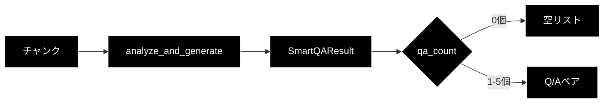
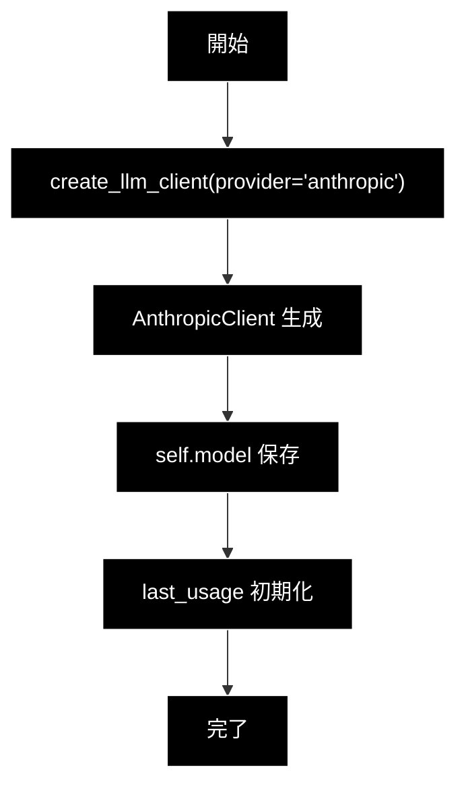
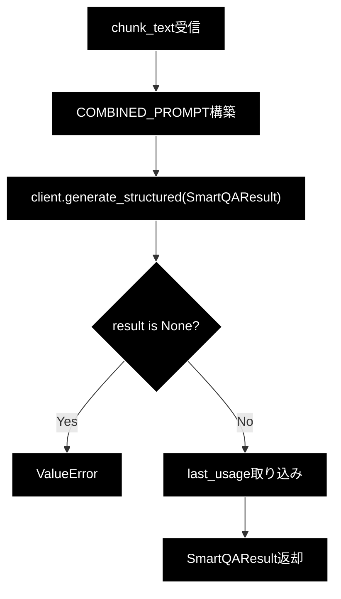
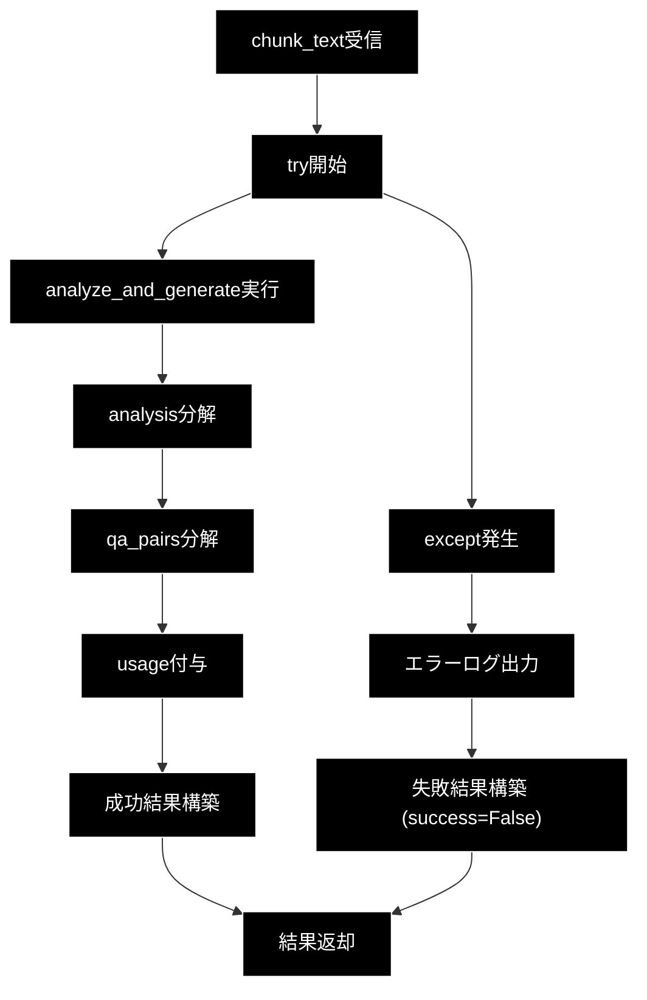
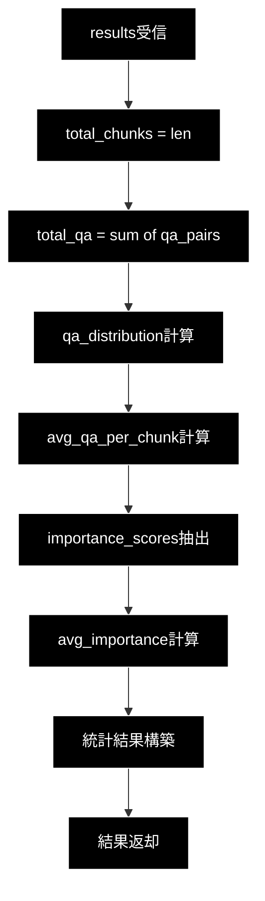

# smart_qa_generator.py 完全ガイド（v3.0）

> **最終更新**: 2026-06-21（LLM を Anthropic Claude へ統一。分析＋生成を構造化出力1回に統合する v3.0 実装へ追従）

## 概要

`qa_generation/smart_qa_generator.py` は、**コンテンツを考慮したインテリジェントQ/A生成システム**です。従来の固定数Q/A生成方式と異なり、Anthropic Claude によるチャンク分析を行い、各チャンクの情報密度・重要度・複雑さに応じて最適なQ/A数を動的に決定します。

v3.0 では、旧来の「分析（`analyze_chunk`）＋生成（`generate_qa_pairs`）」の2段階方式を廃止し、`analyze_and_generate()` による**構造化出力（`response_schema=SmartQAResult`）1回呼び出し**に統合しました。これにより LLM 呼び出しコストを半減し、Markdownフェンス手剥がし＋`json.loads` の脆弱なパースを排除しています。

---

## 目次

1. [SmartQAGeneratorの優位性](#smartqageneratorの優位性)
2. [アーキテクチャ](#アーキテクチャ)
3. [クラス・関数一覧](#クラス関数一覧)
4. [IPO詳細（Input/Process/Output）](#ipo詳細inputprocessoutput)
5. [使用方法](#使用方法)
6. [判断基準とQ/A数決定ロジック](#判断基準とqa数決定ロジック)
7. [エラーハンドリング](#エラーハンドリング)
8. [設定・パラメータ](#設定パラメータ)

---

## SmartQAGeneratorの優位性

### 従来方式との比較

| 観点 | 従来方式 | SmartQAGenerator |
|-----|---------|------------------|
| **Q/A数決定** | 固定（例: 3個/チャンク） | 動的（0〜5個/チャンク） |
| **コンテンツ考慮** | なし | 情報密度・重要度・複雑さを分析 |
| **メタ情報処理** | 無駄なQ/Aを生成 | 0個（スキップ） |
| **高密度情報** | 情報損失の可能性 | 4〜5個で網羅的にカバー |
| **品質** | 均一（低〜中） | コンテンツに最適化（高） |

### 主な優位性

#### 1. コンテンツ適応型Q/A数決定

```
従来: すべてのチャンク → 固定3個のQ/A
Smart: チャンク分析 → 0〜5個の最適なQ/A数
```

- **メタ情報チャンク**（「詳細は付録参照」など）→ **0個**（無駄を排除）
- **単純な事実**（「製品は赤色です」）→ **1個**
- **標準的な説明**（複数の関連情報）→ **2〜3個**
- **高密度技術情報**（API仕様、暗号化詳細）→ **4〜5個**

#### 2. 重要トピックの明示化

分析フェーズで抽出された `key_topics` を生成フェーズに渡すことで、重要な情報を優先的にQ/A化します。

```python
# 分析結果例
{
    'qa_count': 4,
    'key_topics': ['暗号化方式', '鍵長', 'ブロックサイズ', '利用モード'],
    'importance_score': 0.9,
    'complexity': 'high'
}
```

#### 3. 構造化出力1回による品質向上



- **1回呼び出し**: 分析（qa_count 決定）とQ/A生成を `response_schema=SmartQAResult` で同時取得
- **温度**: 0.2（安定した判断と自然な生成を両立）
- 旧 v2.x の「分析フェーズ＋生成フェーズ」2段階呼び出しは廃止（コスト半減）

#### 4. エラーハンドリング

構造化出力に失敗した場合は例外を捕捉し、`process_chunk()` が `success=False`
（`qa_pairs=[]`）を返します。呼び出し側はそのチャンクをスキップできます。
旧 v2.x にあった文字数ベースのフォールバック数推定は廃止されています。

#### 5. 統計分析機能

処理結果の品質を数値で把握できます。

```python
{
    'total_chunks': 100,
    'total_qa_pairs': 245,
    'avg_qa_per_chunk': 2.45,
    'avg_importance_score': 0.72,
    'qa_distribution': {0: 5, 1: 15, 2: 30, 3: 35, 4: 12, 5: 3}
}
```

---

## アーキテクチャ

### 全体構成

```
┌─────────────────────────────────────────────────────────────┐
│                   smart_qa_generator.py                     │
├─────────────────────────────────────────────────────────────┤
│                                                             │
│  ┌─────────────────────────────────────────────────────┐    │
│  │              SmartQAGenerator クラス                 │    │
│  ├─────────────────────────────────────────────────────┤    │
│  │  __init__()             # 初期化・統一クライアント設定  │    │
│  │  analyze_and_generate() # 分析＋生成（構造化出力1回）   │    │
│  │  process_chunk()        # 一括処理（メイン）           │   │
│  └─────────────────────────────────────────────────────┘   │
│                                                            │
│  ┌─────────────────────────────────────────────────────┐   │
│  │           ユーティリティ関数                           │   │
│  ├─────────────────────────────────────────────────────┤   │
│  │  analyze_qa_statistics()  # 統計分析                  │   │
│  └─────────────────────────────────────────────────────┘    │
│                                                             │
└─────────────────────────────────────────────────────────────┘
                              │
                              ▼
┌─────────────────────────────────────────────────────────────┐
│            統一 LLM クライアント（helper_llm）                │
│  └─ create_llm_client("anthropic") → AnthropicClient        │
│     └─ generate_structured()  # Anthropic Messages API       │
│                               # response_schema=SmartQAResult │
└─────────────────────────────────────────────────────────────┘
```

### 処理フロー

```mermaid
graph TB
    subgraph Input
        A[チャンクテキスト]
    end

    subgraph "SmartQAGenerator.process_chunk()"
        B[analyze_and_generate]
        C[SmartQAResult]
        D{qa_count}
        E[空リスト]
    end

    subgraph Output
        F[Q/Aペアリスト]
        G[分析結果]
    end

    A --> B
    B --> C
    C --> D
    D -->|0| E
    D -->|1-5| F
    C --> G
    E --> G
classDef default fill:#000,stroke:#fff,color:#fff
classDef subgraphStyle fill:#1a1a1a,stroke:#fff,color:#fff
class A,B,C,D,E,F,G default
style Input fill:#1a1a1a,stroke:#fff,color:#fff
style "SmartQAGenerator.process_chunk()" fill:#1a1a1a,stroke:#fff,color:#fff
style Output fill:#1a1a1a,stroke:#fff,color:#fff
```

---

## クラス・関数一覧

### クラス一覧

| クラス名 | 機能概要 |
|---------|---------|
| `SmartQAGenerator` | コンテンツを考慮したインテリジェントQ/A生成を行うメインクラス。チャンク分析とQ/A生成の両機能を提供。 |

### メソッド一覧（SmartQAGenerator）

| メソッド名 | 可視性 | 機能概要 |
|-----------|:-----:|---------|
| `__init__` | public | インスタンス初期化。統一 LLM クライアント（Anthropic Claude）の設定。 |
| `analyze_and_generate` | public | チャンク分析とQ/A生成を構造化出力1回（`response_schema=SmartQAResult`）で実行。 |
| `process_chunk` | public | `analyze_and_generate` をラップし、dict 形式（analysis/qa_pairs/usage/success）で返すメインメソッド。 |

### ユーティリティ関数一覧

| 関数名 | 機能概要 |
|-------|---------|
| `analyze_qa_statistics` | 複数チャンクの処理結果を統計分析し、Q/A数分布・平均重要度などを算出。 |

---

## IPO詳細（Input/Process/Output）

### SmartQAGenerator.\_\_init\_\_()

#### IPO

| 区分 | 内容 |
|-----|------|
| **Input** | `model`: str（使用するClaudeモデル、デフォルト: "claude-sonnet-4-6"）<br>`api_key`: Optional[str]（未使用。統一クライアントが環境変数 `ANTHROPIC_API_KEY` からキーを解決） |
| **Process** | 1. `create_llm_client(provider="anthropic", default_model=model)` で統一クライアント生成<br>2. モデル名・`last_usage` の初期化 |
| **Output** | SmartQAGeneratorインスタンス |

#### プロセスフロー



---

### SmartQAGenerator.analyze_and_generate()

#### IPO

| 区分 | 内容 |
|-----|------|
| **Input** | `chunk_text`: str（分析・生成対象のチャンクテキスト） |
| **Process** | 1. `COMBINED_PROMPT` 構築（分析基準＋生成ガイドライン）<br>2. `client.generate_structured(response_schema=SmartQAResult, temperature=0.2, max_output_tokens=4096)` を1回呼び出し<br>3. `None` の場合は `ValueError`<br>4. クライアントの `last_usage`（input/output tokens）を取り込み |
| **Output** | `SmartQAResult`（qa_count, key_topics, importance_score, complexity, reasoning, qa_pairs） |

#### プロセスフロー



#### 出力構造（SmartQAResult）

```python
{
    'qa_count': int,           # 生成すべきQ/A数（0-5）
    'key_topics': List[str],   # 主要トピック
    'importance_score': float, # 重要度（0.0-1.0）
    'complexity': str,         # 複雑さ（low/medium/high）
    'reasoning': str,          # 判断理由
    'qa_pairs': List[SmartQAPair]  # {question, answer, topic} のリスト（qa_count 件）
}
```

---

### SmartQAGenerator.process_chunk()

#### IPO

| 区分 | 内容 |
|-----|------|
| **Input** | `chunk_text`: str（チャンクテキスト） |
| **Process** | 1. `analyze_and_generate()` 実行（構造化出力1回）<br>2. `SmartQAResult` を analysis dict と qa_pairs list に分解<br>3. `last_usage`（トークン使用量）を付与<br>4. 例外時は `success=False` で失敗結果返却 |
| **Output** | `Dict`: {analysis, qa_pairs, usage, success} |

#### プロセスフロー



#### 出力構造

```python
{
    'analysis': Dict,        # SmartQAResult の分析部（qa_count等）
    'qa_pairs': List[Dict],  # 生成されたQ/A [{question, answer, topic}, ...]
    'usage': Dict[str, int], # トークン使用量 {input_tokens, output_tokens}
    'success': bool          # 処理成功フラグ
}
```

---

### analyze_qa_statistics()

#### IPO

| 区分 | 内容 |
|-----|------|
| **Input** | `results`: List[Dict]（process_chunk()の結果リスト） |
| **Process** | 1. 総チャンク数カウント<br>2. 総Q/A数カウント<br>3. Q/A数分布計算<br>4. 平均Q/A数計算<br>5. 平均重要度計算 |
| **Output** | `Dict`: {total_chunks, total_qa_pairs, avg_qa_per_chunk, avg_importance_score, qa_distribution} |

#### プロセスフロー



#### 出力構造

```python
{
    'total_chunks': int,           # 総チャンク数
    'total_qa_pairs': int,         # 総Q/A数
    'avg_qa_per_chunk': float,     # 平均Q/A数/チャンク
    'avg_importance_score': float, # 平均重要度
    'qa_distribution': Dict[int, int]  # Q/A数分布 {0: 5, 1: 15, ...}
}
```

---

## 使用方法

### 基本的な使用例

```python
from qa_generation.smart_qa_generator import SmartQAGenerator

# 初期化（既定で Anthropic Claude を使用）
generator = SmartQAGenerator(model="claude-sonnet-4-6")

# 単一チャンク処理
result = generator.process_chunk(chunk_text)

if result['success']:
    print(f"分析結果: {result['analysis']}")
    print(f"生成Q/A数: {len(result['qa_pairs'])}")
    for qa in result['qa_pairs']:
        print(f"Q: {qa['question']}")
        print(f"A: {qa['answer']}")
```

### 複数チャンクの一括処理

```python
from qa_generation.smart_qa_generator import SmartQAGenerator, analyze_qa_statistics

generator = SmartQAGenerator()

# 複数チャンク処理
results = []
for chunk in chunks:
    result = generator.process_chunk(chunk['text'])
    results.append(result)

# 統計分析
stats = analyze_qa_statistics(results)
print(f"総Q/A数: {stats['total_qa_pairs']}")
print(f"平均Q/A数/チャンク: {stats['avg_qa_per_chunk']:.2f}")
```

### 分析結果（SmartQAResult）を直接取得する場合

```python
# analyze_and_generate は SmartQAResult を直接返す（分析＋生成を1回で実行）
result = generator.analyze_and_generate(chunk_text)
print(f"推奨Q/A数: {result.qa_count}")
print(f"主要トピック: {result.key_topics}")
for qa in result.qa_pairs:
    print(f"Q: {qa.question} / A: {qa.answer}")
```

> v3.0 では分析専用メソッド（`analyze_chunk`）・生成専用メソッド（`generate_qa_pairs`）は
> 廃止され、`analyze_and_generate()` の1回呼び出しに統合されています。

---

## 判断基準とQ/A数決定ロジック

### Q/A数の判断基準

| Q/A数 | 判断基準 | 例 |
|:-----:|---------|---|
| **0** | 補足情報のみ、メタ情報、意味のない繰り返し | 「詳細は付録参照」「ページ番号: 42」 |
| **1** | 単純な事実の記述（1つの情報のみ） | 「この製品は赤色です。」 |
| **2** | 関連する2つの事実 | 「製品は赤色で、サイズはMです。」 |
| **3** | 複数の関連情報、標準的な説明パラグラフ | 一般的な製品説明、概要説明 |
| **4-5** | 高密度な技術情報、複数の独立したポイント、警告・注意事項 | API仕様、暗号化詳細、安全上の注意 |

### 分析プロンプトの観点

1. **情報密度**: チャンクに含まれる独立した情報・事実の数
2. **重要度**: 情報の重要性（critical/high/medium/low）
3. **複雑さ**: 説明に必要な詳細度（low/medium/high）
4. **独立性**: 各情報が他の文脈なしで理解可能か

---

## エラーハンドリング

### 失敗時の挙動

構造化出力（`generate_structured`）が失敗、または結果が `None` の場合、
`analyze_and_generate()` は `ValueError` を送出します。`process_chunk()` は
これを捕捉してエラーログを出力し、`success=False` の結果を返します。
旧 v2.x にあった文字数ベースのフォールバック数推定は廃止されています。

### エラー時の戻り値（process_chunk）

```python
{
    'analysis': {},
    'qa_pairs': [],
    'usage'   : {"input_tokens": 0, "output_tokens": 0},
    'success' : False
}
```

---

## 設定・パラメータ

### 初期化パラメータ

| パラメータ | 型 | デフォルト | 説明 |
|----------|---|----------|------|
| `model` | str | "claude-sonnet-4-6" | 使用するClaudeモデル |
| `api_key` | Optional[str] | None | 未使用。統一クライアントが環境変数 `ANTHROPIC_API_KEY` からキーを解決 |

### 内部設定値

| 項目 | 値 | 用途 |
|-----|---|------|
| temperature | 0.2 | 分析・生成の両立（構造化出力1回） |
| max_output_tokens | 4096 | 構造化出力の最大トークン |
| Q/A数上限 | 5 | 最大Q/A数 |
| Q/A数下限 | 0 | 最小Q/A数（スキップ） |
| importance_score上限 | 1.0 | 最大重要度 |
| importance_score下限 | 0.0 | 最小重要度 |

### LLM クライアント

| 項目 | 値 |
|-----|---|
| プロバイダー | `anthropic`（`create_llm_client("anthropic")`） |
| クライアント | `AnthropicClient`（helper/helper_llm.py） |
| API | Anthropic Messages API（`generate_structured` 経由の構造化出力） |
| APIキー | `ANTHROPIC_API_KEY` |

---

## 関連モジュール

| モジュール | 関係 |
|-----------|------|
| `qa_generation/pipeline.py` | SmartQAGeneratorを使用してQ/A生成を実行 |
| `qa_generation/evaluation.py` | 生成されたQ/Aのカバレッジを分析 |
| `qa_generation/models.py` | Q/Aペアのデータモデル定義 |
| `celery_tasks.py` | 並列処理時にSmartQAGeneratorを呼び出し |

---

**作成日**: 2025-01-27
**最終更新**: 2026-06-21（LLM を Anthropic Claude へ統一。v3.0 構造化出力1回方式へ追従）
**対象ファイル**: `qa_generation/smart_qa_generator.py`
**バージョン**: v3.0
