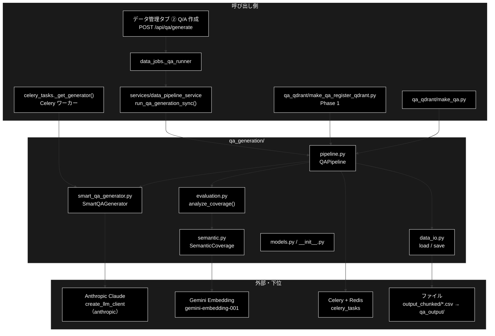
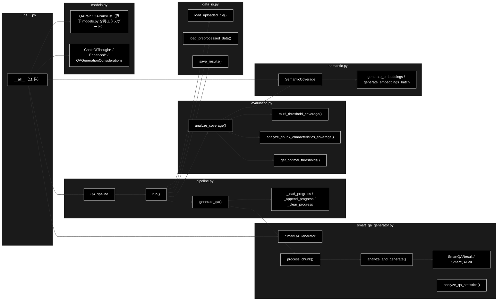
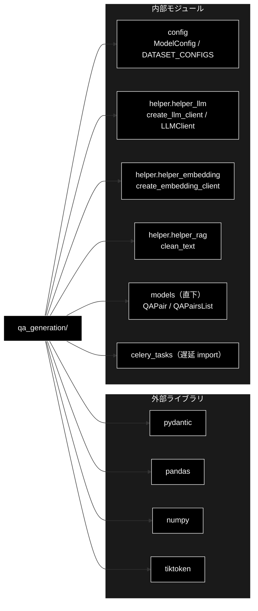

# qa_generation/ - Q/A 生成パッケージ（データ準備 ②）ドキュメント

**Version 2.2** | 最終更新: 2026-10-10

> 📎 **姉妹版**: [`docs/README.md`](../../docs/README.md)（直下・配置の境界） /
> [`grace/docs/README.md`](../../grace/docs/README.md) /
> [`backend/docs/README.md`](../../backend/docs/README.md) /
> [`chunking/docs/README.md`](../../chunking/docs/README.md) /
> [`qa_qdrant/docs/README.md`](../../qa_qdrant/docs/README.md) /
> [`services/docs/README.md`](../../services/docs/README.md)

> 📌 **データ準備 3 工程のうち ② にあたるパッケージ。**
> ① チャンク化は [`chunking/`](../../chunking/docs/README.md)、③ Qdrant 登録は [`qa_qdrant/`](../../qa_qdrant/docs/README.md)。
> 運用手順の入口は [`README_DATA.md`](../../README_DATA.md)。

> ⚠️ **本リポジトリは Anthropic 版。** LLM は `claude-sonnet-5-5`（`config.py::ModelConfig.DEFAULT_MODEL`・
> `create_llm_client("anthropic")`）、Embedding のみ Gemini `gemini-embedding-001`（3072 次元・
> `config.py::ModelConfig.EMBEDDING_MODEL`）。姉妹リポジトリ `grace_v2_local` は Ollama 版で、
> **プロバイダ表記はあちらと逆**である。「Anthropic と書いてあるから誤記」ではない（CLAUDE.md §3）。

---

## 目次

1. [概要](#概要)
2. [アーキテクチャ構成図](#1-アーキテクチャ構成図)
3. [モジュール構成図](#2-モジュール構成図)
4. [ドキュメント索引（重点解説）](#3-ドキュメント索引重点解説)
5. [棚卸しと残タスク（重点解説）](#4-棚卸しと残タスク重点解説)
6. [クラス・関数一覧表](#5-クラス関数一覧表)
7. [クラス・関数 IPO詳細](#6-クラス関数-ipo詳細)
8. [設定・定数](#7-設定定数)
9. [テスト](#8-テスト)
10. [エクスポート](#9-エクスポート)
11. [変更履歴](#10-変更履歴)
12. [付録: 依存関係図](#付録-依存関係図)

---

## 概要

`qa_generation/` は、① チャンク化で作ったチャンク済み CSV を読み、**チャンク 1 件ごとに LLM の構造化出力 1 回で
Q/A ペアを生成**し、生成した Q/A がチャンクをどれだけ網羅しているか（カバレージ）を Embedding で測って、
結果を `qa_output/` へ保存するパッケージである。データ管理タブの「② Q/A 作成」と CLI
（`qa_qdrant/make_qa_register_qdrant.py` の Phase 1 / `qa_qdrant/make_qa.py`）は、どちらも
**同じ `QAPipeline.run()`** を呼ぶので結果は変わらない。

本書はパッケージ全体の IPO 概要と、`qa_generation/docs/` の**棚卸し索引**を兼ねる。
個々のクラス・関数の全メソッドの詳細は各 `<module>.md`（§3.2）が持つ。

### 主な責務

- チャンク済み CSV（または事前定義データセット）を読み込み、生成の入力となるチャンクのリストへ変換する
- チャンク 1 件ごとに、LLM の構造化出力 1 回で「何問作るか（0〜5）」の判断と Q/A の生成を同時に行う
- 生成全体を制御する（同期／Celery 並列の切り替え・チャンク単位の逐次保存と中断からの再開）
- 生成した Q/A がチャンクをどれだけ網羅しているかを、Embedding のコサイン類似度で測る
- 多段階の閾値・チャンク特性（長さ・位置）別にカバレージを集計する
- 生成結果とカバレージを 4 ファイル（Q/A の JSON・CSV、カバレージ、サマリー）として保存する
- Q/A 生成で使う Pydantic モデルを定義し、パッケージの公開 API として再エクスポートする

### 各責務対応のモジュール

| # | 責務 | 対応モジュール | 説明 |
|---|------|--------------|------|
| 1 | チャンク済み CSV の読み込みとチャンク化済みリストへの変換 | `data_io.py` | `load_uploaded_file()` / `load_preprocessed_data()` が DataFrame を返し、`pipeline.py` の `QAPipeline._load_chunks_from_csv()` が本文列・ID 列を検出して `{id, text, type, tokens, dataset_type}` のリストにする |
| 2 | チャンク 1 件 = LLM 呼び出し 1 回での Q/A 数判断と生成 | `smart_qa_generator.py` | `SmartQAGenerator.process_chunk()` が `generate_structured(response_schema=SmartQAResult)` を 1 回呼ぶ |
| 3 | 生成全体の制御（同期／Celery・逐次保存・再開） | `pipeline.py` | `QAPipeline.run()` が読み込み → 変換 → 生成 → カバレージ → 保存を通す。途中経過は `qa_progress_<種別>.jsonl` へ追記 |
| 4 | Embedding によるカバレージ測定 | `semantic.py` | `SemanticCoverage` が Gemini Embedding で埋め込みを作り、L2 正規化してコサイン類似度を出す |
| 5 | 多段階閾値・チャンク特性別の集計 | `evaluation.py` | `analyze_coverage()` が類似度行列を作り、strict / standard / lenient と長さ別・位置別に集計する |
| 6 | 結果 4 ファイルの保存 | `data_io.py` | `save_results()` が `qa_pairs_*.json` / `qa_pairs_*.csv` / `coverage_*.json` / `summary_*.json` を書く |
| 7 | Pydantic モデルの定義と公開 API の再エクスポート | `models.py` / `__init__.py` | `QAPair` / `QAPairsList` は直下 `models.py` の正本を再エクスポート。`__init__.py` が 11 件を `__all__` に並べる |

### 主要機能一覧

| 機能 | 説明 |
|------|------|
| `QAPipeline` | Q/A 生成パイプライン（Web / CLI 共通の実体・チャンク済み CSV 専用） |
| `QAPipeline.run()` | 読み込み → チャンク変換 → Q/A 生成 → カバレージ → 保存を 1 回で実行するメイン API |
| `QAPipeline.generate_qa()` | 逐次保存ファイルから再開しつつ、同期または Celery で Q/A を生成する |
| `SmartQAGenerator` | 構造化出力 1 回でチャンクを分析し Q/A を生成するクラス |
| `SmartQAGenerator.process_chunk()` | 1 チャンクを処理し `{analysis, qa_pairs, usage, success}` を返す（例外を投げない） |
| `analyze_qa_statistics()` | `process_chunk()` の結果リストから件数・平均・分布を集計する |
| `SemanticCoverage` | Embedding によるカバレージ測定（埋め込み生成・コサイン類似度） |
| `analyze_coverage()` | Q/A のカバレージを多段階閾値・チャンク特性別に分析する |
| `load_uploaded_file()` | CSV / TXT / JSON / JSONL を読み、本文列 `Combined_Text` を補う |
| `load_preprocessed_data()` | `DATASET_CONFIGS` の事前定義データセットを読む |
| `save_results()` | 結果 4 ファイルを保存し、パスの辞書を返す |

---

## 1. アーキテクチャ構成図

### 1.1 システム全体構成



> Celery 経路では、`QAPipeline` はタスクを投げて結果を集めるだけで、Q/A を作るのは**ワーカー側の
> `SmartQAGenerator`**（`celery_tasks._get_generator()` がモデル名ごとにプロセス内キャッシュする）である。

### 1.2 データフロー

1. 呼び出し側が `QAPipeline(input_file=... または dataset_name=..., model=...)` を作る（両方の同時指定・両方なしは `ValueError`）
2. `load_data()` がチャンク済み CSV を DataFrame で読む（`.csv` 以外は `ValueError`。`max_docs` で先頭から切り詰め）
3. `_load_chunks_from_csv()` が本文列（`text_column` 指定 → 無ければ `text` → `Combined_Text` → `content` → `chunk_text`）と ID 列を検出してチャンクのリストにする
4. `generate_qa()` が `qa_progress_<種別>.jsonl` を読み、処理済みチャンクを飛ばして残りだけを生成する
   - 同期: `SmartQAGenerator.process_chunk()` をチャンクごとに呼ぶ（LLM 1 回）
   - Celery: `submit_unified_qa_generation()` でタスクを投げ、`collect_results()` で集める
   - どちらもチャンク 1 件の結果が出るたびに JSONL へ追記する（`qa_count=0` も記録して再処理を防ぐ）
5. `evaluate_coverage()` が `analyze_coverage()` を呼び、チャンクと Q/A を Embedding してカバレージを出す（`analyze_coverage=False` か Q/A 0 件なら 0 のダミーを使う）
6. `save()` が `save_results()` で 4 ファイルを `output_dir` に書き、成功後に逐次保存ファイルを削除する
7. `{saved_files, qa_count, coverage_results, success}` を返す（途中の例外はログを出して再送出する）

---

## 2. モジュール構成図

### 2.1 内部モジュール構成



> `data_io` と `celery_tasks` は `pipeline.py` の**関数内で遅延 import** する。モジュール先頭で import すると、
> `import qa_generation` だけで Celery 一式（実測 +117 モジュール）が読み込まれていたため（§4.1 の 1）。

### 2.2 外部依存関係

| ライブラリ | 用途 |
|-----------|------|
| `pydantic` | 構造化出力スキーマ（`SmartQAResult`）と Q/A モデル |
| `pandas` | CSV / JSON / JSONL の読み込み、結果 CSV の書き出し |
| `numpy` | 埋め込み行列・コサイン類似度の行列演算 |
| `tiktoken` | `cl100k_base` によるトークン数の概算（チャンク特性の長さ分類・セマンティック分割） |
| `celery`（間接） | `use_celery=True` のときだけ `celery_tasks` 経由で読み込む |

### 2.3 内部依存モジュール

| モジュール | 用途 |
|-----------|------|
| `config` | `ModelConfig.DEFAULT_MODEL`（生成の既定モデル）/ `ModelConfig.EMBEDDING_MODEL` / `DATASET_CONFIGS` |
| `helper.helper_llm` | `create_llm_client("anthropic")`・`LLMClient`（構造化出力 `generate_structured`） |
| `helper.helper_embedding` | `create_embedding_client("gemini")`・`get_embedding_dimensions()` |
| `helper.helper_rag` | `clean_text()`（`load_uploaded_file()` の本文整形） |
| `models`（直下） | `QAPair` / `QAPairsList` の正本 |
| `celery_tasks` | `check_celery_workers()` / `submit_unified_qa_generation()` / `collect_results()`（遅延 import） |

---

## 3. ドキュメント索引（重点解説）

新しく文書を書く／直す前に、まずここを見る。

### 3.1 目的別の入口

| やりたいこと | 読む文書 |
|---|---|
| **パイプライン全体の流れを知る** | [`pipeline.md`](pipeline.md) |
| **Q/A をどう生成しているか** | [`smart_qa_generator.md`](smart_qa_generator.md) |
| **カバレージをどう測るか** | [`semantic.md`](semantic.md) / [`evaluation.md`](evaluation.md) |
| **入力 CSV の読み方・出力ファイルの仕様を知る** | [`data_io.md`](data_io.md) |
| **Q/A のスキーマ（Pydantic）を知る** | [`models.md`](models.md) |
| **パッケージの公開 API・import 副作用を知る** | [`__init__.md`](__init__.md) |
| **CLI から動かす** | [`../../qa_qdrant/docs/01_install.md`](../../qa_qdrant/docs/01_install.md) §6 / [`../../qa_qdrant/docs/make_qa_register_qdrant.md`](../../qa_qdrant/docs/make_qa_register_qdrant.md) |
| **Celery で並列に動かす** | [`../../qa_qdrant/docs/celery_quick_start.md`](../../qa_qdrant/docs/celery_quick_start.md) |
| **Web（データ管理タブ）から動かす** | [`../../backend/docs/data_pipeline.md`](../../backend/docs/data_pipeline.md) |

### 3.2 文書一覧

> 行数・Ver は **2026-10-08 の実測値**（`pipeline` 行のみ 2026-10-09 に再実測）（`wc -l` と各文書のヘッダー）。
> 7 文書はすべて IPO 形式（`a_class_method_md_format.md` 準拠。使用例は IPO 詳細の冒頭）。
> 本書は v2.0 から同じ IPO 形式（パッケージ全体の概要＋索引）。

| 文書 | 対象実装 | 実装行数 | 文書行数 | Ver | 重要度 |
|---|---|---:|---:|---|:--:|
| [`pipeline.md`](pipeline.md) | `pipeline.py` — `QAPipeline`（Web / CLI 共通の実体） | 555 | 812 | 1.7 | ★★★ |
| [`smart_qa_generator.md`](smart_qa_generator.md) | `smart_qa_generator.py` — `SmartQAGenerator`（構造化出力 1 回） | 301 | 573 | 1.3 | ★★★ |
| [`semantic.md`](semantic.md) | `semantic.py` — `SemanticCoverage`（Embedding によるカバレージ） | 543 | 780 | 1.3 | ★★☆ |
| [`evaluation.md`](evaluation.md) | `evaluation.py` — `analyze_coverage()` ほか | 316 | 822 | 1.3 | ★★☆ |
| [`data_io.md`](data_io.md) | `data_io.py` — 入力 CSV の読み込みと結果 4 ファイルの保存 | 168 | 484 | 1.4 | ★★☆ |
| [`models.md`](models.md) | `models.py` — Pydantic モデル 8 クラス（`QAPair` / `QAPairsList` は直下 `models.py` から再エクスポート） | 149 | 423 | 1.5 | ★☆☆ |
| [`__init__.md`](__init__.md) | `__init__.py` — 公開 API（再エクスポート 11 件） | 65 | 303 | 1.6 | ★☆☆ |

### 3.3 実装カバレッジ

`qa_generation/*.py` は **7 件**（`__init__.py` を含む）、対応する `<module>.md` も **7 件**で 1:1 に揃っている
（2026-09-24 に欠落 3 件 `data_io` / `models` / `__init__` を作成。2026-10-08 に再確認）。

> 3 件は姉妹リポジトリ `grace_v2_local` の同名文書を構成の参考にしたが、**本リポジトリの実装を読み直して書き起こした**。
> `data_io.py` は本リポジトリ側だけ `"nan"` 混入を修正した（§4.1 の 5）ので、両リポジトリで**同一ではない**。
> 移植するときは `diff -u` で差分だけを取ること（CLAUDE.md §5）。

### 3.4 書き分けの約束

| 置き場所 | 書くもの | 書かないもの |
|---|---|---|
| `<module>.md` | IPO（入出力・副作用・使用例） | 運用手順（`qa_qdrant/docs/01_install.md` へリンク） |
| 本書（`README.md`） | パッケージ全体の IPO 概要・文書索引・棚卸し・テスト一覧 | 1 モジュールの全メソッドの詳細（各 `<module>.md` へ） |
| `qa_qdrant/docs/` | CLI の実行手順・環境構築・Celery の起動 | `qa_generation/` 内部の実装 |
| `backend/docs/` | Web（データ管理タブ）からの呼び出し経路 | `qa_generation/` 内部の実装 |
| 直下 `docs/` | 2 領域以上にまたがる横断文書 | 1 モジュールの IPO |

> IPO 形式の仕様は `.claude/skills/grace-agent-docs/a_class_method_md_format.md`。
> **重複禁止ルールと正本の一覧は [`docs/README.md`](../../docs/README.md) が持つ。**

---

## 4. 棚卸しと残タスク（重点解説）

### 4.1 棚卸しで分かったこと

1〜5 は 2026-09-24、6・7 は 2026-10-08 に実装を読んで確認した。いずれも**機能上の不具合ではない**が、誤解や無駄を生む。**7 件とも対処済み。**

| # | 内容 | 根拠（実測） | 扱い |
|---|---|---|---|
| 1 | ~~`import qa_generation` が Celery を連れてくる~~ | `pipeline.py` がモジュール先頭で `from celery_tasks import …` していたため、`qa_generation` 配下のどのモジュールを import しても Celery 一式が読み込まれ、**+117 モジュール**になっていた（詳細は [`__init__.md`](__init__.md) §3） | ✅ 修正済み（2026-09-24） |
| 2 | ~~`QAPair` が 3 箇所に別定義で存在する~~ | 直下 `models.py`／`qa_generation/models.py`／`helper/helper_rag_qa.py`。取り違えると `difficulty="hard"` などが**エラーも出ずに消える** | ✅ **一本化**（2026-09-25）。定義は直下 `models.py` の 1 つだけ（[`models.md`](models.md) §3） |
| 3 | ~~死んだ引数 `provider="anthropic"`~~ | `QAPipeline._generate_with_celery()` が渡すが、受け側（`celery_tasks.py`）は使っていなかった | ✅ 受け側ごと削除（2026-09-25） |
| 4 | ~~`smart_qa_generator.md` の既定モデルが旧既定のまま~~ | 実装は `ModelConfig.DEFAULT_MODEL` を参照する | ✅ 是正済み（以後、既定は直書きせず `ModelConfig.DEFAULT_MODEL` を参照。`test_qa_default_model.py` が検査） |
| 5 | ~~`load_uploaded_file()` で、空セルが文字列 `"nan"` として残る~~ | `clean_text(str(x))` と先に `str()` をかけていたため、欠損判定に届かなかった（[`data_io.md`](data_io.md) §8 の 7） | ✅ 修正済み（2026-09-24） |
| 6 | ~~`celery_config.py` を**スクリプトとして実行**すると、削除済みの `qa_generation.generation` の import を試して `❌` を出す~~ | `celery_config.py` の `if __name__ == '__main__':` 内。ワーカー起動時の確認（`configure_worker_process`）は 2026-10-03 に `smart_qa_generator` へ直してあったが、`__main__` 側が取り残されていた | ✅ 修正済み（2026-10-09）。回帰は `test_celery_worker_init.py`（3 件・修正前は 1 件 fail） |
| 7 | ~~`QAPipeline` の引数 `client` / `batch_chunks` / `concurrency` は**受け取るが処理に効かない**~~ | `client` は `self.client` に保存するだけで参照ゼロ。`batch_chunks` は同期でも Celery（`submit_unified_qa_generation(chunks, config, model)` に渡らない）でも使われず、画面には「1 回の生成で渡すチャンク数」として出ていた。`concurrency` はログに出すだけで、実際の並列数は Celery ワーカーの `-c` で決まる | ✅ 対処済み（2026-10-09）。`client` / `batch_chunks` を `QAPipeline`・`run_qa_generation_sync`・API（`QaGenerationRequest` / `QaGenerationParams`）・画面（`DataJobPanel` の入力欄）・CLI（`--batch-chunks`）から**削除**。`concurrency` は起動コマンドとログの表示用として残し、各所の説明を「実際の並列数はワーカーの `-c`」へ直した |

> 姉妹リポジトリ `grace_v2_local` では 1・3 を 2026-09-21 に解消済み。本リポジトリでも同じ方法・同じ判断で解消した。

### 4.2 残タスク

| # | 内容 | 優先 |
|---|---|:--:|
| 1 | ~~`data_io.md` / `models.md` / `__init__.md` を作成する（§3.3）~~ | ✅ **完了**（2026-09-24） |
| 2 | ~~`pipeline.py` の `celery_tasks` import を遅延 import にする（§4.1 の 1）~~ | ✅ **完了**（2026-09-24）。回帰は `test_qa_generation_import_side_effects.py` |
| 3 | ~~`QAPair` の 3 重定義を解消する（§4.1 の 2）~~ | ✅ **完了**（2026-09-25）。直下 `models.py` へ一本化。回帰は `test_qa_pair_definitions.py` |
| 4 | ~~死んだ `provider` 引数を外す（§4.1 の 3）~~ | ✅ **完了**（2026-09-25） |
| 5 | ~~`load_uploaded_file()` の `"nan"` 混入を直す（§4.1 の 5）~~ | ✅ **完了**（2026-09-24）。回帰は `test_data_io_missing_text.py` |
| 6 | ~~`celery_config.py` の `__main__` の import 確認を `qa_generation.smart_qa_generator` へ直す（§4.1 の 6）~~ | ✅ **完了**（2026-10-09） |
| 7 | ~~`QAPipeline` の効かない引数（`client` / `batch_chunks` / `concurrency`）を処理する（§4.1 の 7）~~ | ✅ **完了**（2026-10-09）。`client` / `batch_chunks` は削除、`concurrency` は表示用と明記 |
| 8 | ~~`QAPipeline.run()` / `SmartQAGenerator.process_chunk()` / `analyze_coverage()` に直接のテストを足す~~ | ✅ **完了**（2026-10-09）。`test_qa_generation_core.py`（12 件） |

**残タスク 0 件**（2026-10-09）。

---

## 5. クラス・関数一覧表

### 5.1 クラス一覧

#### QAPipeline（`pipeline.py`）

| メソッド | 概要 |
|---------|------|
| `__init__(dataset_name, input_file, model, output_dir, max_docs, text_column)` | 入力の排他検証・設定ロード・`SmartQAGenerator` の生成 |
| `run(use_celery, celery_workers, concurrency, analyze_coverage, coverage_threshold)` | 全工程を実行するメイン API |
| `load_data()` | チャンク済み CSV（または事前定義データセット）を DataFrame で読む |
| `generate_qa(chunks, use_celery, celery_workers, concurrency)` | 再開処理を挟んで同期／Celery で生成する |
| `evaluate_coverage(chunks, qa_pairs, threshold)` | `analyze_coverage()` を呼ぶ |
| `save(qa_pairs, coverage_results)` | `save_results()` を呼ぶ |
| `_validate_inputs()` / `_load_config()` | `dataset_name` と `input_file` の排他検証、設定辞書の作成 |
| `_load_chunks_from_csv(df)` | 本文列・ID 列を検出してチャンクのリストにする |
| `_progress_path()` / `_load_progress()` / `_append_progress()` / `_clear_progress()` | 逐次保存（`qa_progress_<種別>.jsonl`） |
| `_generate_sync(chunks)` / `_generate_with_celery(chunks, workers, concurrency)` | 同期生成／Celery 生成 |

#### SmartQAGenerator（`smart_qa_generator.py`）

| メソッド | 概要 |
|---------|------|
| `__init__(model, api_key)` | 統一 LLM クライアント（Anthropic）を作る。`api_key` は未使用 |
| `analyze_and_generate(chunk_text)` | 構造化出力 1 回で `SmartQAResult` を得る（失敗は例外） |
| `process_chunk(chunk_text)` | `analyze_and_generate()` を包み、辞書で返す（失敗は `success=False`） |

#### SemanticCoverage（`semantic.py`）

| メソッド | 概要 |
|---------|------|
| `__init__(embedding_model)` | Gemini Embedding クライアントと tiktoken を用意する |
| `generate_embeddings(doc_chunks)` / `generate_embedding(text)` / `generate_embeddings_batch(texts, batch_size)` | 埋め込みを作り L2 正規化する |
| `cosine_similarity(doc_emb, qa_emb)` | コサイン類似度（正規化済みなら内積） |
| `create_semantic_chunks(document, ...)` | 文書のセマンティック分割（本パイプラインでは未使用。`helper_rag_qa.py` が使う） |

#### Pydantic モデル

| クラス | 定義場所 | 概要 |
|---------|------|------|
| `SmartQAPair` / `SmartQAResult` | `smart_qa_generator.py` | 構造化出力のスキーマ（`qa_count` 0〜5・`qa_pairs` ほか） |
| `QAPair` / `QAPairsList` | 直下 `models.py`（`models.py` が再エクスポート） | Q/A 1 件・リスト |
| `ChainOfThoughtAnalysis` / `ChainOfThoughtQAPair` / `ChainOfThoughtResponse` | `models.py` | Chain-of-Thought 用 |
| `EnhancedQAPair` / `EnhancedQAPairsList` | `models.py` | 質問・回答だけの簡易版 |
| `QAGenerationConsiderations` | `models.py` | 生成前のチェックリスト（文書特性・品質基準など） |

### 5.2 関数一覧（カテゴリ別）

#### 入出力（`data_io.py`）

| 関数名 | 概要 |
|-------|------|
| `load_uploaded_file(file_path)` | CSV / TXT / JSON / JSONL を読み、`Combined_Text` を補って空行を除く |
| `load_preprocessed_data(dataset_type)` | `DATASET_CONFIGS` のファイルを読む（無ければ `<名前>_*<拡張子>` の最新を自動選択） |
| `save_results(qa_pairs, coverage_results, dataset_type, output_dir)` | 4 ファイルを保存 |
| `_is_missing(value)` | スカラーの欠損判定（None / NaN / pd.NA） |

#### カバレージ評価（`evaluation.py`）

| 関数名 | 概要 |
|-------|------|
| `analyze_coverage(chunks, qa_pairs, dataset_type, custom_threshold)` | カバレージ分析のメイン関数 |
| `get_optimal_thresholds(dataset_type)` | 閾値 `{strict: 0.8, standard: 0.7, lenient: 0.6}`（`dataset_type` は未使用） |
| `multi_threshold_coverage(coverage_matrix, chunks, qa_pairs, thresholds)` | 閾値ごとのカバー数・未カバー一覧 |
| `analyze_chunk_characteristics_coverage(chunks, coverage_matrix, qa_pairs, threshold)` | 長さ別（short / medium / long）・位置別（beginning / middle / end）の集計とインサイト |

#### 統計（`smart_qa_generator.py`）

| 関数名 | 概要 |
|-------|------|
| `analyze_qa_statistics(results)` | `process_chunk()` の結果リストの件数・平均・分布 |

---

## 6. クラス・関数 IPO詳細

### 6.1 使用例

#### 6.1.1 基本的なワークフロー

```python
from qa_generation import QAPipeline

# 1. チャンク済み CSV を指定してパイプラインを作る（model 省略時は ModelConfig.DEFAULT_MODEL）
pipeline = QAPipeline(
    input_file="output_chunked/cc_news_1per_chunks.csv",
    output_dir="qa_output/pipeline",
    max_docs=10,
)

# 2. 同期で実行（カバレージ分析つき）
result = pipeline.run(use_celery=False, analyze_coverage=True)

# 3. 結果を確認
print(f"Q/A 数: {result['qa_count']}")
print(f"カバレージ: {result['coverage_results']['coverage_rate']:.1%}")
print(result["saved_files"]["qa_csv"])

# 出力例:
# Q/A 数: 27
# カバレージ: 90.0%
# qa_output/pipeline/qa_pairs_cc_news_1per_chunks_20261008_101500.csv
```

#### 6.1.2 1 チャンクだけ生成して中身を見る

```python
from qa_generation import SmartQAGenerator
from qa_generation.smart_qa_generator import analyze_qa_statistics

# 1. 生成器を作る（ANTHROPIC_API_KEY が必要）
generator = SmartQAGenerator()

# 2. チャンク 1 件を処理（LLM 呼び出し 1 回）
result = generator.process_chunk("この製品は赤色で、サイズはMサイズです。価格は3,000円で、送料無料です。")

# 3. 分析結果と Q/A を確認
print(result["success"], result["analysis"]["qa_count"])
for qa in result["qa_pairs"]:
    print(qa["topic"], qa["question"], qa["answer"])

# 4. 複数チャンクの統計
print(analyze_qa_statistics([result]))

# 出力例:
# True 2
# 価格 この製品の価格はいくらですか？ 3,000円で、送料は無料です。
# 色・サイズ この製品の色とサイズは何ですか？ 赤色で、Mサイズです。
# {'total_chunks': 1, 'total_qa_pairs': 2, 'avg_qa_per_chunk': 2.0, ...}
```

#### 6.1.3 Celery 並列で実行し、中断したら再開する

```python
from qa_generation import QAPipeline

# 前提: Redis とワーカーを起動済み（./start_celery.sh。手順は qa_qdrant/docs/celery_quick_start.md）
pipeline = QAPipeline(input_file="output_chunked/cc_news_1per_chunks.csv")

# 1 回目が途中で落ちても、qa_output/pipeline/qa_progress_cc_news_1per_chunks.jsonl に
# 処理済みチャンクの結果が残る。同じ引数で再実行すると、そのチャンクは飛ばして続きから生成する。
result = pipeline.run(use_celery=True, celery_workers=1)

# 最終保存が成功すると逐次保存ファイルは削除される
```

> ⚠️ ワーカーが立っていないときに `use_celery=True` で呼ぶと `RuntimeError("Celery workers are not running")` になる。

### 6.2 QAPipeline クラス

チャンク済み CSV から Q/A を生成するパイプライン。Web（`run_qa_generation_sync`）と CLI の共通の実体。
全メソッドの詳細は [`pipeline.md`](pipeline.md)。

#### コンストラクタ: `__init__`

**概要**: 入力の排他を検証し、設定辞書を作り、`SmartQAGenerator` を生成する。

```python
QAPipeline(
    dataset_name: Optional[str] = None,
    input_file: Optional[str] = None,
    model: str = ModelConfig.DEFAULT_MODEL,
    output_dir: str = "qa_output/pipeline",
    max_docs: Optional[int] = None,
    text_column: Optional[str] = None,
)
```

| パラメータ | 型 | デフォルト | 説明 |
|------------|------|-----------|------|
| `dataset_name` | Optional[str] | None | 事前定義データセット名（`DATASET_CONFIGS` のキー）。`input_file` と排他 |
| `input_file` | Optional[str] | None | チャンク済み CSV のパス。`dataset_name` と排他 |
| `model` | str | `ModelConfig.DEFAULT_MODEL` | 生成に使う LLM（現在 `claude-sonnet-5-5`） |
| `output_dir` | str | `"qa_output/pipeline"` | 結果と逐次保存ファイルの出力先 |
| `max_docs` | Optional[int] | None | 処理する最大チャンク数（`input_file` のときだけ効く） |
| `text_column` | Optional[str] | None | 本文列名。指定時はその列だけを使い、無ければ `ValueError` |

| 項目 | 内容 |
|------|------|
| **Input** | `dataset_name`, `input_file`, `model`, `output_dir`, `max_docs`, `text_column` |
| **Process** | 1. `_validate_inputs()`: `dataset_name` / `input_file` がちょうど 1 つでなければ `ValueError`<br>2. `_load_config()`: ファイルなら `{name, text_column: "text", lang: "ja", qa_per_chunk: 3, type: <ファイル名の stem>}`、データセットなら `DATASET_CONFIGS` をコピーし `type` が無ければデータセット名を補う（未知の名前は `ValueError`）<br>3. `SmartQAGenerator(model=model)` を生成 |
| **Output** | `QAPipeline` インスタンス |

**戻り値例**:
```python
pipeline.config
# {"name": "ローカルファイル (cc_news_1per_chunks)", "text_column": "text", "title_column": None,
#  "lang": "ja", "qa_per_chunk": 3, "type": "cc_news_1per_chunks"}
```

```python
# 使用例
pipeline = QAPipeline(input_file="output_chunked/cc_news_1per_chunks.csv", text_column="text")
print(pipeline.config["type"])
# cc_news_1per_chunks
```

#### メソッド: `run`

**概要**: 読み込み → チャンク変換 → Q/A 生成 → カバレージ → 保存を通して実行する。

```python
def run(self,
        use_celery: bool = False,
        celery_workers: int = 1,
        concurrency: int = 8,
        analyze_coverage: bool = True,
        coverage_threshold: Optional[float] = None) -> Dict
```

| パラメータ | 型 | デフォルト | 説明 |
|------------|------|-----------|------|
| `use_celery` | bool | False | Celery 並列で生成するか |
| `celery_workers` | int | 1 | 起動しているべきワーカー数（**確認用**） |
| `concurrency` | int | 8 | ログ表示用（§4.1 の 7）。実際の並列数は Celery ワーカー起動時の `-c` |
| `analyze_coverage` | bool | True | カバレージ分析を行うか |
| `coverage_threshold` | Optional[float] | None | standard 閾値の上書き（None なら 0.7） |

| 項目 | 内容 |
|------|------|
| **Input** | `use_celery`, `celery_workers`, `concurrency`, `analyze_coverage`, `coverage_threshold` |
| **Process** | 1. `load_data()` → `_load_chunks_from_csv()`（チャンク 0 件なら `RuntimeError`）<br>2. `generate_qa()`（逐次保存から再開）<br>3. `analyze_coverage` かつ Q/A が 1 件以上なら `evaluate_coverage()`、それ以外は `coverage_rate=0` のダミー<br>4. `save()` → `_clear_progress()`<br>5. 例外はログを出して再送出 |
| **Output** | `Dict`: `{saved_files, qa_count, coverage_results, success}` |

**戻り値例**:
```python
{
    "saved_files": {
        "qa_json": "qa_output/pipeline/qa_pairs_cc_news_1per_chunks_20261008_101500.json",
        "qa_csv": "qa_output/pipeline/qa_pairs_cc_news_1per_chunks_20261008_101500.csv",
        "coverage": "qa_output/pipeline/coverage_cc_news_1per_chunks_20261008_101500.json",
        "summary": "qa_output/pipeline/summary_cc_news_1per_chunks_20261008_101500.json",
    },
    "qa_count": 27,
    "coverage_results": {"coverage_rate": 0.9, "covered_chunks": 9, "total_chunks": 10, "...": "..."},
    "success": True,
}
```

```python
# 使用例
result = QAPipeline(input_file="output_chunked/cc_news_1per_chunks.csv").run(analyze_coverage=False)
print(result["coverage_results"]["coverage_rate"])
# 0
```

#### メソッド: `generate_qa`

**概要**: 逐次保存ファイルから処理済みチャンクを復元し、残りだけを同期または Celery で生成する。

```python
def generate_qa(self, chunks: List[Dict],
                use_celery: bool = False,
                celery_workers: int = 1,
                concurrency: int = 8) -> List[Dict]
```

| パラメータ | 型 | デフォルト | 説明 |
|------------|------|-----------|------|
| `chunks` | List[Dict] | - | `_load_chunks_from_csv()` が作ったチャンク |
| `use_celery` | bool | False | Celery を使うか |
| `celery_workers` | int | 1 | ワーカー数の確認用 |
| `concurrency` | int | 8 | ログ表示用 |

| 項目 | 内容 |
|------|------|
| **Input** | `chunks`, `use_celery`, `celery_workers`, `concurrency` |
| **Process** | 1. `_load_progress()` で `qa_progress_<種別>.jsonl` を読む（壊れた行は飛ばす）<br>2. 処理済みチャンクを除き、復元した Q/A を `prior_pairs` に入れる<br>3. 残りが 0 件なら `prior_pairs` を返す<br>4. `_generate_with_celery()` または `_generate_sync()` で生成し、チャンクごとに `_append_progress()`<br>5. `prior_pairs + new_pairs` を返す |
| **Output** | `List[Dict]`: Q/A のリスト（同期では `{question, answer, chunk_id, topic, dataset_type}`） |

**戻り値例**:
```python
[
    {"question": "この製品の価格はいくらですか？", "answer": "3,000円で、送料は無料です。",
     "chunk_id": "cc_news_1per_chunks_chunk_0", "topic": "価格", "dataset_type": "cc_news_1per_chunks"},
]
```

```python
# 使用例
chunks = pipeline._load_chunks_from_csv(pipeline.load_data())
qa_pairs = pipeline.generate_qa(chunks)
print(len(qa_pairs))
# 27
```

### 6.3 SmartQAGenerator クラス

チャンク 1 件につき LLM の構造化出力を 1 回だけ呼び、Q/A 数の判断と生成を同時に行う。
全メソッドの詳細は [`smart_qa_generator.md`](smart_qa_generator.md)。

#### コンストラクタ: `__init__`

**概要**: 統一 LLM クライアント（Anthropic）を作り、トークン使用量の入れ物を初期化する。

```python
SmartQAGenerator(model: str = ModelConfig.DEFAULT_MODEL, api_key: Optional[str] = None)
```

| パラメータ | 型 | デフォルト | 説明 |
|------------|------|-----------|------|
| `model` | str | `ModelConfig.DEFAULT_MODEL` | 生成に使う Claude モデル |
| `api_key` | Optional[str] | None | 未使用（クライアントが `ANTHROPIC_API_KEY` を環境変数から解決する） |

| 項目 | 内容 |
|------|------|
| **Input** | `model`, `api_key` |
| **Process** | `create_llm_client(provider="anthropic", default_model=model)` を作り、`last_usage = {input_tokens: 0, output_tokens: 0}` を用意する |
| **Output** | `SmartQAGenerator` インスタンス |

**戻り値例**:
```python
generator.model       # "claude-sonnet-5-5"
generator.last_usage  # {"input_tokens": 0, "output_tokens": 0}
```

```python
# 使用例
generator = SmartQAGenerator(model="claude-haiku-5-5")
print(generator.model)
# claude-haiku-5-5
```

#### メソッド: `process_chunk`

**概要**: 1 チャンクを分析・生成し、辞書で返す。失敗しても例外を投げず `success=False` を返す。

```python
def process_chunk(self, chunk_text: str) -> Dict
```

| パラメータ | 型 | デフォルト | 説明 |
|------------|------|-----------|------|
| `chunk_text` | str | - | チャンク本文 |

| 項目 | 内容 |
|------|------|
| **Input** | `chunk_text: str` |
| **Process** | 1. `analyze_and_generate()` が `COMBINED_PROMPT` を整形し `generate_structured(response_schema=SmartQAResult, max_output_tokens=4096, temperature=0.2)` を 1 回呼ぶ（`temperature` は `NO_TEMPERATURE_MODELS` なら `helper_llm` が送らない）<br>2. 結果が None なら `ValueError`<br>3. クライアントの `last_usage` を取り込む<br>4. `analysis`（`qa_count` / `key_topics` / `importance_score` / `complexity` / `reasoning`）と `qa_pairs`（`question` / `answer` / `topic`）へ詰め替える<br>5. 例外時は空の結果と `success=False` |
| **Output** | `Dict`: `{analysis, qa_pairs, usage, success}` |

**戻り値例**:
```python
{
    "analysis": {"qa_count": 2, "key_topics": ["価格", "仕様"], "importance_score": 0.6,
                 "complexity": "low", "reasoning": "価格と仕様の 2 つの事実を含むため"},
    "qa_pairs": [
        {"question": "この製品の価格はいくらですか？", "answer": "3,000円で、送料は無料です。", "topic": "価格"},
        {"question": "この製品の色とサイズは何ですか？", "answer": "赤色で、Mサイズです。", "topic": "色・サイズ"},
    ],
    "usage": {"input_tokens": 512, "output_tokens": 180},
    "success": True,
}
```

```python
# 使用例
result = generator.process_chunk("詳細については付録Aを参照してください。")
print(result["analysis"]["qa_count"], result["qa_pairs"])
# 0 []
```

### 6.4 入出力関数（data_io.py）

全関数の詳細は [`data_io.md`](data_io.md)。

#### `load_uploaded_file`

**概要**: CSV / TXT / JSON / JSONL を DataFrame で読み、本文列 `Combined_Text` を補って空行を除く。

```python
def load_uploaded_file(file_path: str) -> pd.DataFrame
```

| パラメータ | 型 | デフォルト | 説明 |
|------------|------|-----------|------|
| `file_path` | str | - | 入力ファイルのパス |

| 項目 | 内容 |
|------|------|
| **Input** | `file_path: str` |
| **Process** | 1. 存在しなければ `FileNotFoundError`<br>2. 拡張子で読み分け（TXT は 1 行 = 1 行、JSON はリストまたはオブジェクト、それ以外は `ValueError`）<br>3. `Combined_Text` が無ければ `text` → `content` → `body` → `document` → `answer` → `question` の最初の列を `clean_text()` で整形して作る（どれも無ければ全列連結）。欠損は `"nan"` にせず空文字<br>4. `Combined_Text` が空白だけの行を除き、index を振り直す |
| **Output** | `pd.DataFrame`: 元の列 + `Combined_Text` |

**戻り値例**:
```python
#    text                     Combined_Text
# 0  この製品は赤色です。      この製品は赤色です。
```

```python
# 使用例
df = load_uploaded_file("output_chunked/cc_news_1per_chunks.csv")
print(len(df), "Combined_Text" in df.columns)
# 120 True
```

#### `save_results`

**概要**: 生成結果とカバレージを 4 ファイルに保存し、パスの辞書を返す。

```python
def save_results(
    qa_pairs: List[Dict],
    coverage_results: Dict,
    dataset_type: str,
    output_dir: str = "qa_output/a02",
) -> Dict[str, str]
```

| パラメータ | 型 | デフォルト | 説明 |
|------------|------|-----------|------|
| `qa_pairs` | List[Dict] | - | 生成した Q/A |
| `coverage_results` | Dict | - | `analyze_coverage()` の結果 |
| `dataset_type` | str | - | ファイル名に入る種別 |
| `output_dir` | str | `"qa_output/a02"` | 出力先（`QAPipeline.save()` は `self.output_dir` を渡す） |

| 項目 | 内容 |
|------|------|
| **Input** | `qa_pairs`, `coverage_results`, `dataset_type`, `output_dir` |
| **Process** | 1. 出力先を作り、`YYYYmmdd_HHMMSS` のタイムスタンプを決める<br>2. `qa_pairs_<種別>_<日時>.json` / `.csv` を書く<br>3. `coverage_<種別>_<日時>.json` を書く（`uncovered_chunks` は `chunk_id` / `similarity` / `gap` / `text_preview`（先頭 200 字）へ縮める）<br>4. `summary_<種別>_<日時>.json` を書く |
| **Output** | `Dict[str, str]`: `{qa_json, qa_csv, coverage, summary}` |

**戻り値例**:
```python
{
    "qa_json": "qa_output/pipeline/qa_pairs_cc_news_1per_chunks_20261008_101500.json",
    "qa_csv": "qa_output/pipeline/qa_pairs_cc_news_1per_chunks_20261008_101500.csv",
    "coverage": "qa_output/pipeline/coverage_cc_news_1per_chunks_20261008_101500.json",
    "summary": "qa_output/pipeline/summary_cc_news_1per_chunks_20261008_101500.json",
}
```

```python
# 使用例
paths = save_results(qa_pairs, coverage, "cc_news_1per_chunks", "qa_output/pipeline")
print(paths["summary"])
# qa_output/pipeline/summary_cc_news_1per_chunks_20261008_101500.json
```

### 6.5 カバレージ評価関数（evaluation.py）

全関数の詳細は [`evaluation.md`](evaluation.md)、Embedding の扱いは [`semantic.md`](semantic.md)。

#### `analyze_coverage`

**概要**: チャンクと Q/A を Embedding し、類似度行列から多段階・特性別のカバレージを出す。

```python
def analyze_coverage(chunks: List[Dict], qa_pairs: List[Dict], dataset_type: str = "wikipedia_ja",
                     custom_threshold: Optional[float] = None) -> Dict
```

| パラメータ | 型 | デフォルト | 説明 |
|------------|------|-----------|------|
| `chunks` | List[Dict] | - | チャンク（`text` を使う） |
| `qa_pairs` | List[Dict] | - | Q/A（`question` + `answer` を連結して埋め込む） |
| `dataset_type` | str | `"wikipedia_ja"` | 結果に記録する種別（閾値には影響しない） |
| `custom_threshold` | Optional[float] | None | standard 閾値の上書き |

| 項目 | 内容 |
|------|------|
| **Input** | `chunks`, `qa_pairs`, `dataset_type`, `custom_threshold` |
| **Process** | 1. `SemanticCoverage` でチャンクと Q/A を埋め込む（L2 正規化済み。Q/A は `batch_size=2048` を渡す）<br>2. Q/A の埋め込みが 0 件なら `coverage_rate=0.0` の結果を返す<br>3. 行列積で類似度行列を作り `[-1, 1]` にクリップ（失敗時は 1 対ずつ計算）<br>4. 各チャンクの最大類似度が standard 閾値以上ならカバー済み<br>5. `multi_threshold_coverage()`（0.8 / 0.7 / 0.6）と `analyze_chunk_characteristics_coverage()` を足す |
| **Output** | `Dict`: `{coverage_rate, covered_chunks, total_chunks, uncovered_chunks, max_similarities, threshold, multi_threshold, chunk_analysis, dataset_type, optimal_thresholds}` |

**戻り値例**:
```python
{
    "coverage_rate": 0.9,
    "covered_chunks": 9,
    "total_chunks": 10,
    "uncovered_chunks": [{"chunk": {"id": "c_7", "text": "..."}, "similarity": 0.64, "gap": 0.06}],
    "threshold": 0.7,
    "multi_threshold": {"strict": {"coverage_rate": 0.6, "...": "..."}, "standard": {"...": "..."}, "lenient": {"...": "..."}},
    "chunk_analysis": {"by_length": {"...": "..."}, "by_position": {"...": "..."}, "summary": {"insights": []}},
    "dataset_type": "cc_news_1per_chunks",
    "optimal_thresholds": {"strict": 0.8, "standard": 0.7, "lenient": 0.6},
}
```

```python
# 使用例（GOOGLE_API_KEY が必要）
from qa_generation.evaluation import analyze_coverage
cov = analyze_coverage(chunks, qa_pairs, "cc_news_1per_chunks", custom_threshold=0.65)
print(f"{cov['coverage_rate']:.1%}")
# 93.3%
```

---

## 7. 設定・定数

| 項目 | 値 | 定義場所 | 備考 |
|---|---|---|---|
| 生成の既定モデル | `claude-sonnet-5-5` | `config.py::ModelConfig.DEFAULT_MODEL` | `QAPipeline` / `SmartQAGenerator` とも直書きせず参照する（`test_qa_default_model.py`）。チャンキングの既定（`ModelConfig.CHUNKING_MODEL`）とは別 |
| Embedding モデル | `gemini-embedding-001`（3072 次元） | `config.py::ModelConfig.EMBEDDING_MODEL` | `SemanticCoverage` の既定 |
| 1 チャンクの Q/A 数 | 0〜5 | `SmartQAResult.qa_count`（`ge=0, le=5`） | 0 = 補足・メタ情報のみ、3 = 標準 |
| 構造化出力の上限 | `max_output_tokens=4096`、`temperature=0.2` | `SmartQAGenerator.analyze_and_generate()` | `temperature` は `NO_TEMPERATURE_MODELS` では送られない |
| カバレージ閾値 | strict 0.8 / standard 0.7 / lenient 0.6 | `evaluation.get_optimal_thresholds()` | データセット別の値は廃止（統一値） |
| 本文列の検出順 | `text` → `Combined_Text` → `content` → `chunk_text` | `QAPipeline._load_chunks_from_csv()` | `text_column` 指定時はその列だけ |
| ID 列の検出順 | `chunk_id` → `id` → `chunk_idx` | 同上 | 無ければ `<種別>_chunk_<行番号>` |
| チャンク特性の長さ区分 | short < 100 ≦ medium < 200 ≦ long（トークン） | `analyze_chunk_characteristics_coverage()` | `tiktoken` の `cl100k_base` で数える |
| Celery の結果収集タイムアウト | `min(max(タスク数 × 10, 600), 1800)` 秒 | `QAPipeline._generate_with_celery()` | 10〜30 分 |
| 逐次保存ファイル | `<output_dir>/qa_progress_<種別>.jsonl` | `QAPipeline._progress_path()` | 1 行 = `{chunk_id, qa_pairs}`。最終保存の成功後に削除 |
| 出力ファイル | `qa_pairs_<種別>_<日時>.json` / `.csv`、`coverage_<種別>_<日時>.json`、`summary_<種別>_<日時>.json` | `data_io.save_results()` | `<種別>` は `config["type"]`（ファイルなら stem、データセットなら名前） |

---

## 8. テスト

`qa_generation/` に関わるテストは次の 11 ファイル（2026-10-09、`tests` を grep して確認。件数は実行して数えた値）。
いずれも実 API キー・Qdrant 不要。

| テストファイル | 件数 | 関わり方 |
|---|---:|---|
| `tests/test_qa_generation_core.py` | 12 | **中核 3 つを直接実行する。** `QAPipeline.run()`（生成 → 4 ファイル保存 → 逐次保存ファイルの削除・途中経過からの再開・失敗チャンクは記録しない・カバレージ閾値の受け渡し・CSV 以外の拒否・削除した `client` / `batch_chunks` を受け付けないこと）、`SmartQAGenerator.process_chunk()`（構造化結果の詰め替え・例外と空応答で `success=False`）、`analyze_coverage()`（standard 閾値でのカバー判定・多段階閾値・`custom_threshold`・Q/A 0 件）。LLM・Embedding・tiktoken は偽物へ差し替える |
| `tests/test_qa_pair_definitions.py` | 6 | `qa_generation.QAPair` / `QAPairsList` が直下 `models.py` の正本そのものであること・別定義を書き戻していないこと（§4.1 の 2） |
| `tests/test_qa_generation_import_side_effects.py` | 3 | `import qa_generation.data_io` で Celery が載らないこと・Celery は必要時に読めること・`helper/` 配下に裸 import が無いこと（§4.1 の 1） |
| `tests/test_qa_pipeline_text_column.py` | 6 | `QAPipeline(text_column=...)` が指定列を優先すること・指定列が無ければ `ValueError`・未指定なら従来の検出順のままであること、`make_qa_register_qdrant.py --text-column` が `QAPipeline` へ渡ること |
| `tests/test_qa_pipeline_dataset_type.py` | 6 | `QAPipeline(dataset_name=...)` の種別（`config["type"]`）がデータセット名になること。以前は一律 `unknown` で、途中経過ファイルとチャンク ID がデータセット間で共有されていた |
| `tests/test_data_io_missing_text.py` | 3 | `load_uploaded_file()` が欠損セルを `"nan"` にしないこと（§4.1 の 5） |
| `tests/test_qa_default_model.py` | 9 | `QAPipeline` / `SmartQAGenerator` を含む Q/A 生成の既定モデルが `ModelConfig.DEFAULT_MODEL` を指すこと |
| `tests/test_model_table_coverage.py` | 5 | 各所の既定モデルが料金表・上限表に登録されていること（既定値はテスト内で手で列挙） |
| `tests/test_data_jobs.py` | 44 | データ管理タブのジョブ（API から `batch_chunks` が消えたことの検査を含む）。`run_qa_generation_sync` を**スタブへ差し替える**ので `QAPipeline` 自体は実行されない |
| `tests/test_celery_worker_init.py` | 3 | ワーカー起動時と `python celery_config.py`（`__main__`）の import 確認が `qa_generation.smart_qa_generator` を見ること（削除済みの `qa_generation.generation` を見ない。§4.1 の 6） |
| `tests/test_qa_qdrant_package_init.py` | 2 | `import qa_qdrant` で `qa_generation` が読み込まれないこと |

> 📝 2026-10-08 までは `QAPipeline.run()`（Web / CLI 共通の実体）・`process_chunk()`・`analyze_coverage()` に直接のテストが無かった。
> 2026-10-09 に `test_qa_generation_core.py` を足して解消した（残タスク 8）。実 LLM・実 Embedding での確認は `tests/e2e/` の範囲外。

---

## 9. エクスポート

`qa_generation/__init__.py` でエクスポートされる要素（11 件。詳細は [`__init__.md`](__init__.md)）:

```python
__all__ = [
    # Models
    "QAPair",
    "QAPairsList",
    "ChainOfThoughtAnalysis",
    "ChainOfThoughtQAPair",
    "ChainOfThoughtResponse",
    "EnhancedQAPair",
    "EnhancedQAPairsList",
    "QAGenerationConsiderations",
    # Semantic coverage
    "SemanticCoverage",
    # Smart QA Generator
    "SmartQAGenerator",
    # Pipeline
    "QAPipeline",
]
```

> `data_io` / `evaluation` の関数と `analyze_qa_statistics()` は再エクスポートされない。
> `from qa_generation.data_io import save_results` のようにモジュールから import する。

---

## 10. 変更履歴

| バージョン | 日付 | 変更内容 |
|---|---|---|
| 1.0 | 2026-09-24 | 新規作成。`qa_generation/docs/` には棚卸し索引が無かった。文書一覧（行数・Ver は実測）・実装カバレッジ（**文書の欠落 3 件**）・棚卸しで分かったこと 4 件・残タスク 4 件・テストの有無を記載。あわせて `smart_qa_generator.md` の既定モデルの記述を実装へ合わせた（v1.2） |
| 1.1 | 2026-09-24 | 残タスク 1 を完了（`data_io.md` / `models.md` / `__init__.md` を新規作成し、実装 7 件との 1:1 対応が揃った）。§4 の 1 のモジュール数を「+1,505」（`import qa_generation` の総数）から Celery 由来の差分「+117」へ訂正。文書化の過程で見つけた `load_uploaded_file()` の `"nan"` 混入を §4 の 5・残タスク 5 に登録 |
| 1.2 | 2026-09-24 | 残タスク 5 を完了（`load_uploaded_file()` の `"nan"` 混入を修正）。§2 の `data_io` 行（実装 168 行・文書 v1.1）、§3 の「両リポジトリで同一」の注記、§7 のテスト一覧を更新 |
| 1.3 | 2026-09-24 | 残タスク 2 を完了（`qa_generation` の import で Celery が読み込まれる副作用を、`pipeline.py` の遅延 import 化で解消）。§4 の 1、§6、§7 のテスト一覧を更新 |
| 1.4 | 2026-09-25 | 残タスク 3・4 を完了し、**残タスク 0 件**。3 は「統合しない」で決着（docstring の相互参照＋`test_qa_pair_definitions.py` 4 件）、4 は死んだ `provider` 引数を受け側ごと削除。§4 の 2・3、§6、§7 を更新 |
| 1.5 | 2026-09-25 | 残タスク 3 の決着を「統合しない」から**「直下 `models.py` へ一本化」**へ変更（`qa_generation/models.py` の `QAPair` 別定義を削除）。§2・§4 の 2・§6 の 3・§7 を更新 |
| 1.6 | 2026-09-25 | `helper/helper_rag_qa.py` の旧 `QAPair` も削除し、`QAPair` の定義は直下 `models.py` の 1 つだけになった。§4 の 2・§6 の 3・§7 を更新 |
| 1.7 | 2026-09-25 | §2 の `__init__.md` 行を更新（`qa_qdrant/__init__.py` の整理を §4 に記録） |
| 1.8 | 2026-09-25 | `QAPairsList` も直下 `models.py` の定義（`QAPairsResponse` の別名）へ一本化。`qa_generation/models.py` と `helper/helper_rag_qa.py` の同名クラスを削除し、`test_qa_pair_definitions.py` に 2 件を追加（計 6 件）。§2 の行数・版を更新 |
| 1.9 | 2026-09-25 | `chunking/docs/` / `qa_qdrant/docs/` / `services/docs/` に棚卸し索引を新設したのにあわせ、姉妹版リンクと冒頭の ①・③ からリンクを張った |
| 1.10 | 2026-09-25 | `QAPipeline` に `text_column` 引数を追加したのに追随。§2 の `pipeline.md` 行（実装 565 行・文書 811 行・v1.4）と §7 のテスト一覧（`test_qa_pipeline_text_column.py`）を更新 |
| 1.11 | 2026-09-26 | `pipeline.md` v1.5（`--dataset` の種別の補完）に追随して §2 の行数・Ver を更新 |
| 1.12 | 2026-09-26 | 現在の Embedding の記述を `gemini-embedding-001` から `gemini-embedding-2` へ是正（2026-09-26 に変更。定義は `config.py::ModelConfig.EMBEDDING_MODEL` の 1 箇所）。あわせて `semantic.md` v1.2 / `evaluation.md` v1.2 の行数・Ver と、PR #216 で変わった `semantic.py` の実装行数（543）を再実測 |
| 1.13 | 2026-09-26 | Embedding を `gemini-embedding-001` に戻したのに追随（2026-09-26。同日に一度 `gemini-embedding-2` へ変えたが、既存の Qdrant コレクションと grace_v2_local（同じ Qdrant を共用）をそのまま使うため戻した。定義は `config.py::ModelConfig.EMBEDDING_MODEL`）。同じ改訂の 2 文書の行数・Ver を再実測 |
| 1.14 | 2026-10-08 | 冒頭の注記の既定 LLM を `claude-sonnet-5` → 現在の既定 `claude-sonnet-5-5`（`config.py::ModelConfig.DEFAULT_MODEL`）へ是正 |
| 2.0 | 2026-10-08 | **`a_class_method_md_format.md`（IPO 形式）で全面改訂。** 概要に主な責務 7 件・各責務対応のモジュール・主要機能一覧を新設し、3 層のアーキテクチャ構成図＋データフロー、モジュール構成図、クラス・関数一覧表、IPO 詳細（冒頭の使用例 3 本＋`QAPipeline` / `SmartQAGenerator` / `load_uploaded_file` / `save_results` / `analyze_coverage`）、設定・定数、エクスポート、付録の依存関係図を追加。旧 §1〜§6 の索引（目的別の入口・一覧・カバレッジ・書き分け）は §3、棚卸しと残タスクは §4 へ移した。§3.2 の行数・Ver を再実測（`smart_qa_generator.py` 301 行、`pipeline.md` 813 行 v1.6、`smart_qa_generator.md` 573 行 v1.3、`data_io.md` 483 行 v1.3）。§8 のテストを 6 → 10 ファイルへ更新し件数を実測（`test_qa_pipeline_dataset_type.py` / `test_qa_default_model.py` / `test_celery_worker_init.py` / `test_qa_qdrant_package_init.py` を追加）。棚卸しに 2 件を追加（6: `celery_config.py` の `__main__` が削除済みの `qa_generation.generation` を見ている、7: `QAPipeline` の `client` / `batch_chunks` / `concurrency` が処理に効かない）、残タスク 6〜8 を登録 |
| 2.1 | 2026-10-09 | **残タスク 6〜8 を完了し、残タスク 0 件。** 6: `celery_config.py` の `__main__` の import 確認を `qa_generation.smart_qa_generator` へ直した（`test_celery_worker_init.py` に 1 件追加・修正前は fail）。7: `QAPipeline` の効かない引数のうち `client` / `batch_chunks` を、`QAPipeline`・`run_qa_generation_sync`・API・画面・CLI（`--batch-chunks`）から削除し、`concurrency` は表示用と明記（§5・§6.2 のシグネチャと引数表を更新）。8: `test_qa_generation_core.py`（12 件）を追加。§3.2 の `pipeline` 行と §8 のテスト一覧（11 ファイル）を再実測 |
| 2.2 | 2026-10-10 | テストの所在を `backend/tests/` からリポジトリ直下の `tests/` へ移したのに追随（パス・コマンド・import の表記） |

> v1.x の変更履歴にある節番号（§2〜§7）は旧構成のもの。v2.0 では §2 → §3.2、§3 → §3.3、§4 → §4.1、§5 → §3.4、§6 → §4.2、§7 → §8 に対応する。

---

## 付録: 依存関係図


