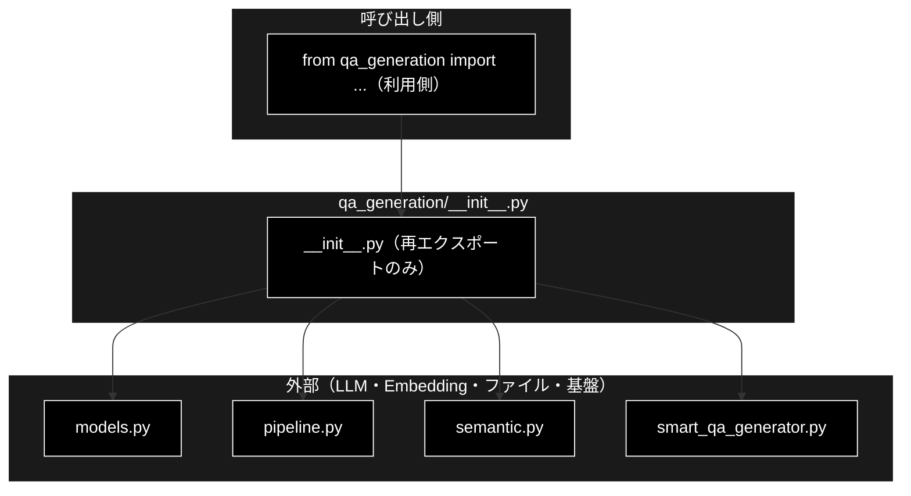
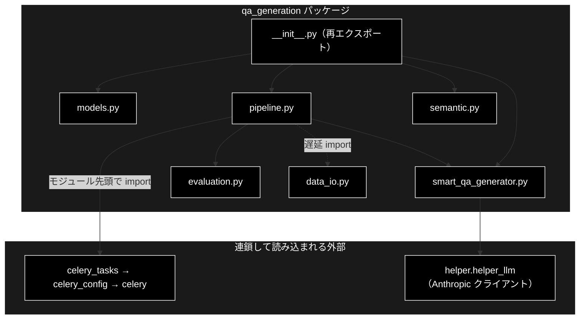

# \_\_init\_\_.py - qa_generation パッケージ公開 API ドキュメント

**Version 1.0** | 最終更新: 2026-09-24

---

## 目次

1. [概要](#概要)
2. [アーキテクチャ構成図](#1-アーキテクチャ構成図)
3. [モジュール構成図](#2-モジュール構成図)
4. [⚠️ import 副作用の実測](#3-️-import-副作用の実測)
5. [`qa_qdrant/__init__.py` との違い](#4-qa_qdrant__init__py-との違い)
6. [エクスポート](#5-エクスポート)
7. [使用例](#6-使用例)
8. [注意点](#7-注意点)
9. [関連モジュール](#8-関連モジュール)
10. [変更履歴](#9-変更履歴)

---

## 概要

`qa_generation/__init__.py` は、**`qa_generation` パッケージの公開 API を定義する再エクスポート専用モジュール**です。自前のロジックは持たず、4 つのサブモジュールから 11 シンボルを取り込んで `__all__` に並べます。

⚠️ **この再エクスポートには重い import 副作用がある。** `pipeline.py` が `celery_tasks` をモジュールレベルで import しているため、パッケージ内の**どのモジュールを import しても** Celery が読み込まれる（[実測](#3-️-import-副作用の実測)）。対処は [`README.md`](README.md) §6 の残タスク 2。

### 主な責務

- モジュール構成をパッケージ docstring として示す
- データモデル 8 クラスを再エクスポートする
- `QAPipeline` / `SemanticCoverage` / `SmartQAGenerator` を再エクスポートする
- `__all__` で公開範囲を明示する

### 各責務対応のモジュール

| # | 責務 | 対応モジュール | 説明 |
|---|---|---|---|
| 1 | モジュール構成をパッケージ docstring として示す | モジュール docstring | サブモジュール 6 件の役割を列挙 |
| 2 | データモデル 8 クラスを再エクスポートする | `from .models import ...` | `QAPair` ほか 8 クラス |
| 3 | `QAPipeline` / `SemanticCoverage` / `SmartQAGenerator` を再エクスポートする | `from .pipeline / .semantic / .smart_qa_generator import ...` | 各 1 クラス |
| 4 | `__all__` で公開範囲を明示する | `__all__` | 11 シンボル |

### 主要機能一覧

| 区分 | 再エクスポートするシンボル | 由来 |
|---|---|---|
| Models | `QAPair` / `QAPairsList` / `ChainOfThoughtAnalysis` / `ChainOfThoughtQAPair` / `ChainOfThoughtResponse` / `EnhancedQAPair` / `EnhancedQAPairsList` / `QAGenerationConsiderations` | `qa_generation/models.py` |
| Pipeline | `QAPipeline` | `qa_generation/pipeline.py` |
| Semantic Coverage | `SemanticCoverage` | `qa_generation/semantic.py` |
| Smart QA Generator | `SmartQAGenerator` | `qa_generation/smart_qa_generator.py` |

---

## 1. アーキテクチャ構成図

### 1.1 システム全体構成



### 1.2 データフロー

1. 利用側が `from qa_generation import QAPipeline` のようにパッケージから import する
2. `__init__.py` が 4 つのサブモジュールを import し、11 シンボルを名前空間へ載せる
3. ⚠️ `pipeline.py` がモジュール先頭で `celery_tasks` を import するため、**この時点で Celery 一式が読み込まれる**（§3）

---

## 2. モジュール構成図

docstring が示すモジュール構成（実体と一致している）。

| モジュール | 役割 | 文書 |
|---|---|---|
| `models.py` | Pydantic データモデル | [`models.md`](./models.md) |
| `semantic.py` | セマンティック分析・カバレッジ | [`semantic.md`](./semantic.md) |
| `smart_qa_generator.py` | チャンク単位の Q/A 生成 | [`smart_qa_generator.md`](./smart_qa_generator.md) |
| `evaluation.py` | Q/A 評価 | [`evaluation.md`](./evaluation.md) |
| `pipeline.py` | 生成パイプライン | [`pipeline.md`](./pipeline.md) |
| `data_io.py` | データ入出力 | [`data_io.md`](./data_io.md) |

> 📌 **`evaluation` と `data_io` は再エクスポートされない。** docstring には 6 モジュールが
> 並ぶが、`__all__` に載るのは 4 モジュール由来の 11 シンボルだけである。
> `analyze_coverage()` や `load_uploaded_file()` はフルパスで import する。



破線は `QAPipeline.load_data()` / `save()` の中で行う遅延 import を表す。
`celery_tasks` だけは実線（モジュール先頭の import）で、これが §3 の副作用の原因である。

---

## 3. ⚠️ import 副作用の実測

**パッケージ内のどのモジュールを import しても `__init__.py` が先に実行される。**
`data_io`（pandas とファイル I/O しか使わないモジュール）で測った値（2026-09-24）。

| 測定 | ロード済みモジュール数 | Celery |
|---|---:|:--:|
| `data_io.py` が実際に必要とする依存だけ（`pandas` / `config` / `helper.helper_rag`） | 1,616 | 読まれない |
| `import qa_generation.data_io` | **1,733（+117）** | **読まれる** |

余計に読み込まれるトップレベルモジュール:

```
amqp, billiard, celery, celery_config, celery_tasks, cffi,
kombu, resource, shelve, tzlocal, vine
```

経路は `__init__.py` → `pipeline.py` → `celery_tasks` → `celery_config` → `celery` 本体である。
`celery_config` は import 時にログを出すため、**`qa_generation` を触るだけで
Celery のログ（`✅ celery_tasks.pyのインポート成功` など）が出る**。

> 📌 測定は `uv run --no-sync python -c ...` を**別プロセスで 1 回ずつ**実行した実測値。
> 所要時間はどちらも 2.5〜2.8 秒で、この測り方では差が見えなかった（ディスクキャッシュの状態で動く）。
> モジュール数の差は安定する。

### 3.1 対処案（未実施）

`pipeline.py` の `celery_tasks` import を、実際に使う `_generate_with_celery()` の中へ移す。
3 シンボル（`check_celery_workers` / `collect_results` / `submit_unified_qa_generation`）は
このメソッドでしか使っていないので、**Celery を使う経路の動作は変わらない**。
`data_io` / `evaluation` と同じ遅延 import の方針に揃う形である。

姉妹リポジトリ `grace_v2_local` はこの対処を 2026-09-21 に済ませ、回帰テスト
（`backend/tests/qa_generation/test_import_side_effects.py`）で固定している。

### 3.2 対処するときの落とし穴: 隠れた import 順序依存

`celery_tasks.py` は import 時に **`helper/` ディレクトリを `sys.path` へ挿入**している。
`helper/helper_rag_qa.py` はパッケージ名なしの裸 import
（`from helper_embedding import ...` / `from helper_llm import ...`）で書かれており、
**`celery_tasks` が先に読まれていることに依存している可能性が高い**。

`grace_v2_local` では、遅延 import 化で `celery_tasks` が自動で読まれなくなった途端に
`ModuleNotFoundError: No module named 'helper_embedding'` が露見した。
**遅延 import 化するときは、`helper_rag_qa.py` の import を `helper.helper_embedding` /
`helper.helper_llm` へ直すのとセットで行うこと。**

> ⚠️ 本リポジトリのこの環境では `helper.helper_rag_qa` 自体が `spacy` 未導入で import できず、
> 依存を直接は確認できていない（上の記述は裸 import と `sys.path` 挿入のコードを読んだ判断）。

---

## 4. `qa_qdrant/__init__.py` との違い

姉妹パッケージ `qa_qdrant` の `__init__.py` も似た問題を抱えるが、中身の性質が違うので同じ扱いにはできない。

| 観点 | `qa_qdrant/__init__.py` | `qa_generation/__init__.py`（本モジュール） |
|---|---|---|
| 中身 | `make_qa.py` の**陳腐化したコピー 236 行**（`main()` まで含む。`make_qa.py` は 265 行） | 再エクスポート 65 行 |
| 公開 API | **誰も使っていない**（`from qa_qdrant import` の参照ゼロ・2026-09-24 grep） | `__all__` に 11 件。パッケージの公開 API そのもの |
| いつ実行されるか | `from qa_qdrant.register_to_qdrant import ...`（データ管理タブの ③ Qdrant 登録）のたびに | `qa_generation` 配下の import のたびに |
| 取りうる対処 | docstring のみに置き換えられる（`grace_v2_local` は 2026-09-21 に実施） | **空にはできない**（消すと公開 API が消える）。§3.1 の遅延 import で副作用だけを消す |

---

## 5. エクスポート

> 本モジュールは自前のクラス・関数を持たない（再エクスポート専用）ため、「クラス・関数一覧表」と「IPO 詳細」は置かず、本章と §6 の使用例で代える。

| # | シンボル | 由来モジュール | 種別 |
|---:|---|---|---|
| 1 | `QAPair` | `models` | Pydantic モデル |
| 2 | `QAPairsList` | `models` | Pydantic モデル |
| 3 | `ChainOfThoughtAnalysis` | `models` | Pydantic モデル |
| 4 | `ChainOfThoughtQAPair` | `models` | Pydantic モデル |
| 5 | `ChainOfThoughtResponse` | `models` | Pydantic モデル |
| 6 | `EnhancedQAPair` | `models` | Pydantic モデル |
| 7 | `EnhancedQAPairsList` | `models` | Pydantic モデル |
| 8 | `QAGenerationConsiderations` | `models` | Pydantic モデル |
| 9 | `SemanticCoverage` | `semantic` | クラス |
| 10 | `SmartQAGenerator` | `smart_qa_generator` | クラス |
| 11 | `QAPipeline` | `pipeline` | クラス |

`__all__` の並びは「Models → Semantic coverage → Smart QA Generator → Pipeline」で、
import 文の並び（Models → Pipeline → Semantic → Smart）とは順序が違うが、
内容は 11 件で一致している。

---

## 6. 使用例

### 6.1 パッケージ経由（公開 API）

```python
from qa_generation import QAPipeline, SmartQAGenerator, SemanticCoverage, QAPair

pipeline = QAPipeline(input_file="output_chunked/cc_news_1per_chunks.csv")
```

### 6.2 再エクスポートされていないものはフルパスで

```python
from qa_generation.data_io import load_uploaded_file, save_results
from qa_generation.evaluation import analyze_coverage
```

### 6.3 Celery が読み込まれるかどうか

**読み込まれる**（2026-09-24 時点）。`qa_generation.data_io` のように Celery と無関係な
サブモジュールだけを import しても、`__init__.py` → `pipeline.py` 経由で Celery 一式が載る（§3）。
`QAPipeline.run(use_celery=False)` で使う場合も同じである。

---

## 7. 注意点

| # | 内容 |
|---|---|
| 1 | **`__init__.py` が公開 API を決めている。** 中身を空にすると `from qa_generation import QAPipeline` が壊れる |
| 2 | ⚠️ **import 副作用で Celery が読み込まれる**（§3・+117 モジュール）。直すときは §3.2 の import 順序依存も同時に直す |
| 3 | **`evaluation` / `data_io` は再エクスポートされない。** docstring の 6 モジュールと `__all__` の 4 モジュールを混同しない |
| 4 | **`QAPair` は直下の `models.py` にも別定義がある。** `from qa_generation import QAPair` と `from models import QAPair` は別クラス（[`models.md`](./models.md)） |
| 5 | **循環 import には今のところなっていない。** サブモジュール側は `qa_generation.xxx` をフルパスで import しており、`from . import` を使っていない |

---

## 8. 関連モジュール

| モジュール | 関係 |
|---|---|
| [`models.md`](./models.md) | 再エクスポートするモデル 8 件の定義元 |
| [`pipeline.md`](./pipeline.md) | `QAPipeline` の定義元。`celery_tasks` を読み込む張本人 |
| [`semantic.md`](./semantic.md) | `SemanticCoverage` の定義元 |
| [`smart_qa_generator.md`](./smart_qa_generator.md) | `SmartQAGenerator` の定義元 |
| [`data_io.md`](./data_io.md) | 再エクスポートされない入出力モジュール |
| `celery_config.py` / `celery_tasks.py` | import 副作用の到達先 |

---

## 9. 変更履歴

| Version | 日付 | 内容 |
|---|---|---|
| 1.0 | 2026-09-24 | 初版作成。再エクスポート 11 件を実装（65 行）から起こし、**import 副作用を実測**（`data_io` の依存だけ 1,616 → パッケージ経由 1,733・+117 モジュール、Celery 一式が載る）して記録した。対処案（遅延 import）と、対処時に露見しうる `helper_rag_qa.py` の import 順序依存、`qa_qdrant/__init__.py`（236 行の陳腐化コピー）との違いを整理した。索引 `qa_generation/docs/README.md` §6 の残タスク 1（文書欠落）に対応。再エクスポート専用で IPO 対象を持たないため、一覧表・IPO 詳細の代わりに「エクスポート」「使用例」章を置いた |
