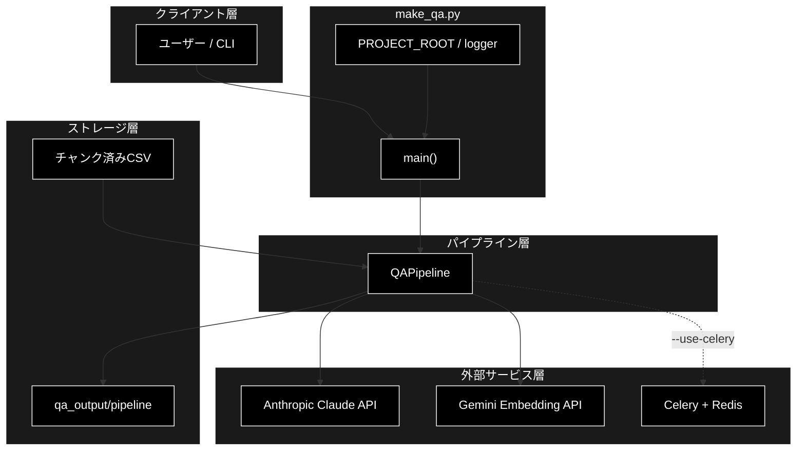
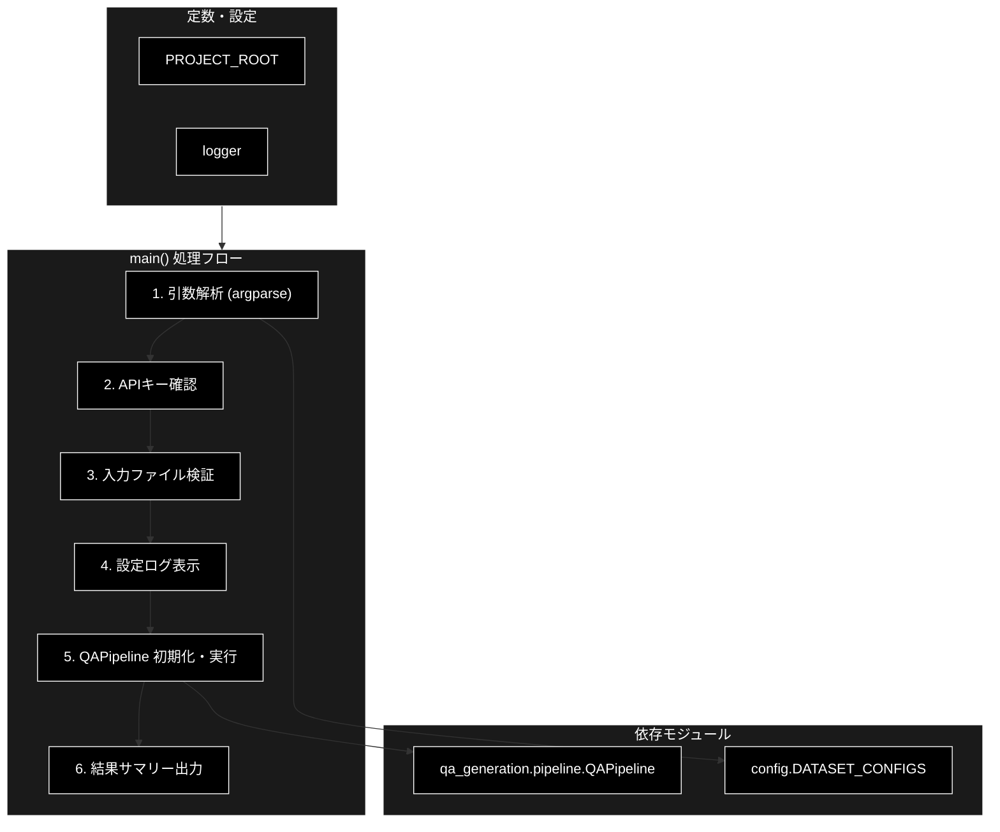
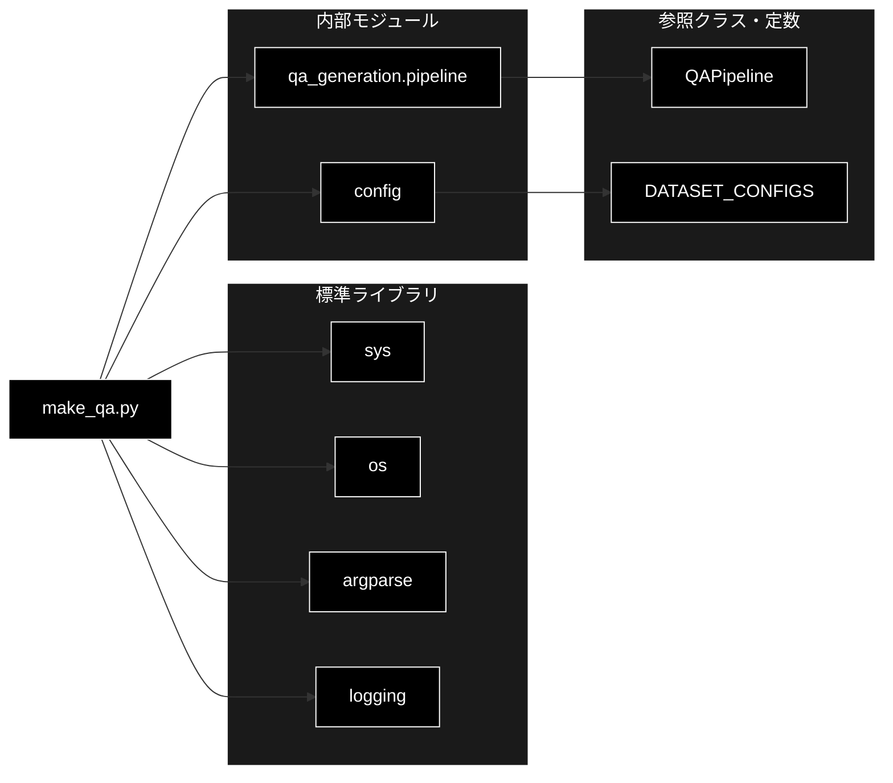

# make_qa.py - Q/Aペア生成 CLIエントリーポイント ドキュメント

**Version 3.1** | 最終更新: 2026-06-17

---

## 目次

1. [概要](#概要)
2. [1. アーキテクチャ構成図](#1-アーキテクチャ構成図)
3. [2. モジュール構成図](#2-モジュール構成図)
4. [3. クラス・関数一覧表](#3-クラス関数一覧表)
5. [4. クラス・関数 IPO詳細](#4-クラス関数-ipo詳細)
6. [5. 設定・定数](#5-設定定数)
7. [6. 使用例](#6-使用例)
8. [7. エクスポート](#7-エクスポート)
9. [8. 変更履歴](#8-変更履歴)
10. [付録: 依存関係図](#付録-依存関係図)

---

## 概要

`make_qa.py` は、チャンク済みCSVファイル（または事前定義データセット）からQ/Aペアを自動生成するCLIエントリーポイント。引数解析・環境変数/入力ファイル検証ののち、`qa_generation.pipeline.QAPipeline` を初期化・実行し、結果サマリーをログ出力する。

> 📝 **注意**: 本モジュールは **Q/A生成のみ** を担う。生成済みQ/AのQdrantベクトルDBへの登録は別モジュール（`qa_qdrant/register_to_qdrant.py` および `qa_qdrant/make_qa_register_qdrant.py`）が担当する。

### 主な責務

- CLI引数の解析・検証（入力ソース・モデル・並列処理・カバレージ等）
- 環境変数 `GOOGLE_API_KEY` の存在確認
- 入力ファイルの存在・形式（`.csv` 限定）検証
- `QAPipeline` の初期化と `pipeline.run()` の実行制御
- 実行結果サマリー（生成ファイルパス・Q/A数・カバレージ率）のログ出力

### 各責務対応のモジュール

| # | 責務 | 対応モジュール | 説明 |
|---|------|--------------|------|
| 1 | CLI引数の解析・検証 | `make_qa.py` | `argparse` で入力ソース・モデル・並列処理・カバレージ引数を定義 |
| 2 | 環境変数チェック | `make_qa.py` | `GOOGLE_API_KEY` 未設定時は `sys.exit(1)` |
| 3 | 入力ファイル検証 | `make_qa.py` | ファイル存在 + 拡張子 `.csv` を確認 |
| 4 | Q/A生成パイプライン制御 | `qa_generation.pipeline.QAPipeline` | チャンクCSVを読み込みLLMでQ/A生成 |
| 5 | 実行サマリー出力 | `make_qa.py` | 結果ファイル・Q/A数・カバレージ率をログ出力 |

### 主要機能一覧

| 機能 | 説明 |
|------|------|
| `main()` | CLIエントリーポイント関数。引数解析・検証・パイプライン実行・結果出力を一括して行う |
| `PROJECT_ROOT` | プロジェクトルートの絶対パス（デフォルト出力先の基準） |
| `logger` | モジュール用ロガー（`logging.getLogger(__name__)`） |

### 前提条件

- 入力CSVは事前にチャンク化済みであること（`chunking.csv_text_to_chunks_text_csv` 等で生成）
- `GOOGLE_API_KEY` 環境変数が設定されていること

### 技術スタック

| 役割 | プロバイダー / モデル |
|------|----------------------|
| LLM（Q/A生成・Agent応答） | Anthropic Claude（`claude-sonnet-4-6`） — APIキー `ANTHROPIC_API_KEY` |
| Embedding（Qdrant登録・検索） | Gemini `gemini-embedding-001`（3072次元）— APIキー `GOOGLE_API_KEY` |
| 本モジュールで使う `--model` 既定値 | `gemini-2.5-flash`（`QAPipeline` 経由のLLM呼び出しに渡される値） |

---

## 1. アーキテクチャ構成図

### 1.1 システム全体構成



### 1.2 データフロー

1. ユーザーがCLI引数を指定して `python qa_qdrant/make_qa.py ...` を実行
2. `main()` が引数を解析し、`GOOGLE_API_KEY` と入力ファイルを検証
3. `QAPipeline` を初期化（`dataset_name`, `input_file`, `model`, `output_dir`, `max_docs`）
4. `pipeline.run()` を実行（`use_celery`, `concurrency`, `batch_chunks`, `analyze_coverage`, `coverage_threshold` 等を渡す）
5. パイプラインがCSVを読み込み、LLM APIを呼び出してQ/Aペアを生成・保存
6. 結果サマリーをログ出力して終了

---

## 2. モジュール構成図

### 2.1 内部モジュール構成



### 2.2 外部依存関係

| ライブラリ | バージョン | 用途 |
|-----------|-----------|------|
| `argparse` | 標準 | CLI引数解析 |
| `logging` | 標準 | ログ出力 |
| `os` | 標準 | 環境変数・パス操作 |
| `sys` | 標準 | パス追加・終了コード制御 |

### 2.3 内部依存モジュール

| モジュール | 用途 |
|-----------|------|
| `qa_generation.pipeline.QAPipeline` | Q/A生成パイプラインクラス |
| `config.DATASET_CONFIGS` | 事前定義データセット名 → 設定辞書 |

---

## 3. クラス・関数一覧表

### 3.1 クラス一覧

本モジュールにクラス定義はありません。

### 3.2 関数一覧（カテゴリ別）

#### エントリーポイント

| 関数名 | 概要 |
|--------|------|
| `main()` | CLIエントリーポイント。引数解析・検証・`QAPipeline` 実行・結果出力 |

### 3.3 定数一覧

| 名称 | 概要 |
|------|------|
| `PROJECT_ROOT` | `make_qa.py` から見たプロジェクトルートの絶対パス |
| `logger` | モジュール用ロガー |

### 3.4 `main()` 内部構成

`main()` は単一関数ですが、内部は以下の6ブロックで構成されます。

| # | 処理ブロック | 概要 | 行範囲 |
|:-:|-------------|------|:------:|
| 1 | 引数解析 | `argparse` で5カテゴリの引数を定義し `parse_args()` で解析 | 60-170 |
| 2 | APIキー確認 | `GOOGLE_API_KEY` 未設定なら `sys.exit(1)` | 175-177 |
| 3 | 入力ファイル検証 | ファイル存在確認・`.csv` 拡張子チェック | 182-192 |
| 4 | 設定ログ表示 | 入力ソース・モデル・出力先・生成モード・並列設定をログ表示 | 197-217 |
| 5 | パイプライン実行 | `QAPipeline` を初期化し `pipeline.run()` を呼び出す | 219-241 |
| 6 | 結果サマリー出力 | サマリーファイル・Q/A CSV・件数・カバレージ率をログ出力 | 246-261 |

### 3.5 引数定義カテゴリ（ブロック1 詳細）

| # | カテゴリ | 引数数 | 含まれる引数 |
|:-:|---------|:------:|-------------|
| 1 | 入力ソース（排他的必須） | 2 | `--dataset`, `--input-file` |
| 2 | 共通パラメータ | 3 | `--model`, `--output`, `--max-docs` |
| 3 | カバレージ分析 | 2 | `--analyze-coverage`, `--coverage-threshold` |
| 4 | Q/A生成 | 1 | `--batch-chunks` |
| 5 | Celery並列処理 | 3 | `--use-celery`, `-c`/`--concurrency`, `--celery-workers` |
| | **合計** | **11** | |

---

## 4. クラス・関数 IPO詳細

### 4.1 エントリーポイント関数

#### `main`

**概要**: CLI引数を解析し、`QAPipeline` を初期化・実行するエントリーポイント関数。環境変数・入力ファイルの検証、設定ログ出力、結果サマリー出力、例外ハンドリングまでを含む。

```python
def main() -> None
```

| パラメータ | 型 | デフォルト | 説明 |
|------------|------|-----------|------|
| - | - | - | 引数なし（CLI引数は `sys.argv` 経由で取得） |

| 項目 | 内容 |
|------|------|
| **Input** | CLI引数（`sys.argv`）: `--dataset` or `--input-file`（排他必須）, `--model`, `--output`, `--max-docs`, `--analyze-coverage`, `--coverage-threshold`, `--batch-chunks`, `--use-celery`, `-c/--concurrency`, `--celery-workers` |
| **Process** | 1. `argparse.ArgumentParser` で引数定義し `parse_args()` で解析<br>2. `GOOGLE_API_KEY` 環境変数を確認（未設定なら `sys.exit(1)`）<br>3. `--input-file` 指定時はファイル存在 + `.csv` 拡張子を検証<br>4. 入力ソース・モデル・出力先・並列設定をログ出力<br>5. `QAPipeline(dataset_name, input_file, model, output_dir, max_docs)` を初期化<br>6. `pipeline.run(use_celery, celery_workers, concurrency, batch_chunks, analyze_coverage, coverage_threshold)` を実行<br>7. サマリーファイルパス・Q/A CSVパス・生成Q/A数・カバレージ率をログ出力<br>8. 例外発生時は `traceback.print_exc()` 後 `sys.exit(1)` |
| **Output** | `None`（標準出力へのログのみ。Q/AファイルやサマリーJSONの出力は `QAPipeline` が担当） |

**終了コード**:

| コード | 条件 |
|--------|------|
| `0` | 正常終了 |
| `1` | `GOOGLE_API_KEY` 未設定 / 入力ファイル不在 / `.csv` 以外の入力 / 実行時例外 |

**戻り値例**:

```python
# 標準出力に出力されるサマリーログ（例）
# ============================================================
# ✅ Make QA 完了
# ============================================================
# サマリーファイル: /.../qa_output/pipeline/summary_20260617_xxxxx.json
# Q/A CSVファイル: /.../qa_output/pipeline/qa_pairs_20260617_xxxxx.csv
# 生成Q/A数: 1234
# カバレージ率: 87.5%
# ============================================================
```

```python
# 使用例（コマンドライン）
# $ python qa_qdrant/make_qa.py \
#       --input-file output_chunked/data_chunks.csv \
#       --use-celery \
#       -c 8 \
#       --analyze-coverage
```

---

## 5. 設定・定数

### 5.1 `PROJECT_ROOT`

プロジェクトルートディレクトリの絶対パス。デフォルト出力ディレクトリ（`{PROJECT_ROOT}/qa_output/pipeline`）の基準として使用される。

```python
PROJECT_ROOT = os.path.dirname(os.path.dirname(os.path.abspath(__file__)))
```

| 定数名 | 値 | 説明 |
|--------|------|------|
| `PROJECT_ROOT` | `make_qa.py` の2階層上のディレクトリ | デフォルト出力パスの基準 |

### 5.2 CLI引数のデフォルト値

| 引数 | デフォルト値 | 説明 |
|------|-------------|------|
| `--model` | `gemini-2.5-flash` | 使用するLLMモデル名（`QAPipeline` に渡される） |
| `--output` | `{PROJECT_ROOT}/qa_output/pipeline` | 出力ディレクトリ |
| `--max-docs` | `None` | 処理する最大チャンク数（無制限） |
| `--analyze-coverage` | `False` | カバレージ分析を実行するフラグ |
| `--coverage-threshold` | `None` | カバレージ判定の類似度閾値 |
| `--batch-chunks` | `3` | 1回のAPI呼び出しで処理するチャンク数（1-5） |
| `--use-celery` | `False` | Celery 非同期並列処理を使用するフラグ |
| `-c`, `--concurrency` | `8` | 並列タスク数（`start_celery.sh -c` と同値を推奨） |
| `--celery-workers` | `1` | （非推奨）ワーカープロセス数チェック用 |

> ⚠️ **非推奨**: `--celery-workers` は非推奨。並列度は `-c/--concurrency` を使用してください。

### 5.3 CLI引数仕様

#### 入力ソース（排他的・必須）

| 引数 | 型 | 説明 |
|------|------|------|
| `--dataset` | str | 事前定義データセット名（`DATASET_CONFIGS` のキー） |
| `--input-file` | str | チャンク済みCSVファイルのパス |

> 📝 **注意**: `--dataset` と `--input-file` は排他的（`argparse.add_mutually_exclusive_group(required=True)`）。いずれか一方を必ず指定。

#### Q/A生成パラメータ

| 引数 | 型 | デフォルト | 説明 |
|------|------|-----------|------|
| `--batch-chunks` | int | `3` | 1回のAPIで処理するチャンク数（choices: 1-5） |

> 📝 **注意**: v3.0 以降、Q/A生成は `SmartQAGenerator`（構造化出力1回）に一本化されており、`--use-smart-generation` / `--no-smart-generation` などのフラグは廃止されています。

---

## 6. 使用例

### 6.1 基本ワークフロー（同期処理）

```bash
# チャンク済みCSVからQ/A生成（Celery不使用）
python qa_qdrant/make_qa.py \
    --input-file output_chunked/data_chunks.csv \
    --analyze-coverage
```

### 6.2 Celery 並列処理

```bash
# 1) Celeryワーカーを起動（別ターミナル）
./start_celery.sh -c 8

# 2) Celery 並列でQ/A生成
python qa_qdrant/make_qa.py \
    --input-file output_chunked/data_chunks.csv \
    --use-celery \
    -c 8 \
    --analyze-coverage
```

### 6.3 事前定義データセットを使用

```bash
python qa_qdrant/make_qa.py \
    --dataset wikipedia_ja \
    --use-celery \
    -c 4
```

### 6.4 処理チャンク数を制限（テスト用）

```bash
python qa_qdrant/make_qa.py \
    --input-file output_chunked/large_data.csv \
    --max-docs 100 \
    --analyze-coverage
```

### 6.5 モジュールとして実行

```bash
python -m qa_qdrant.make_qa \
    --input-file output_chunked/data_chunks.csv \
    --analyze-coverage
```

---

## 7. エクスポート

本モジュールは `__all__` を定義していません。CLIエントリーポイントとして `python qa_qdrant/make_qa.py` または `python -m qa_qdrant.make_qa` から `main()` が `__main__` ガード経由で実行されます。

```python
if __name__ == "__main__":
    main()
```

---

## 8. 変更履歴

| バージョン | 日付 | 変更内容 |
|-----------|------|---------|
| 1.0 | - | 初版作成 |
| 2.0 | - | `a_class_method_md_format.md` 仕様に準拠して全面再構成 |
| 2.1 | 2025-02-07 | 「クラス・関数一覧表」セクション追加、`main()` 内部構成・引数定義カテゴリ表を追加 |
| 3.0 | - | `pipeline.py` v3.0 対応。`--input-chunks` を `--input-file` に統一、チャンク関連引数を削除、`-c/--concurrency` を追加 |
| 3.1 | 2026-06-17 | `--use-smart-generation` / `--no-smart-generation` の廃止を反映（実装と整合）。Q/A生成は `SmartQAGenerator` 一本化を明記。技術スタック表記（Anthropic Claude + Gemini Embedding）を追加。本モジュールは Q/A生成のみで Qdrant 登録は別モジュールである旨を明記。Mermaid 図を黒背景・白文字スタイルに刷新 |

---

## 付録: 依存関係図


