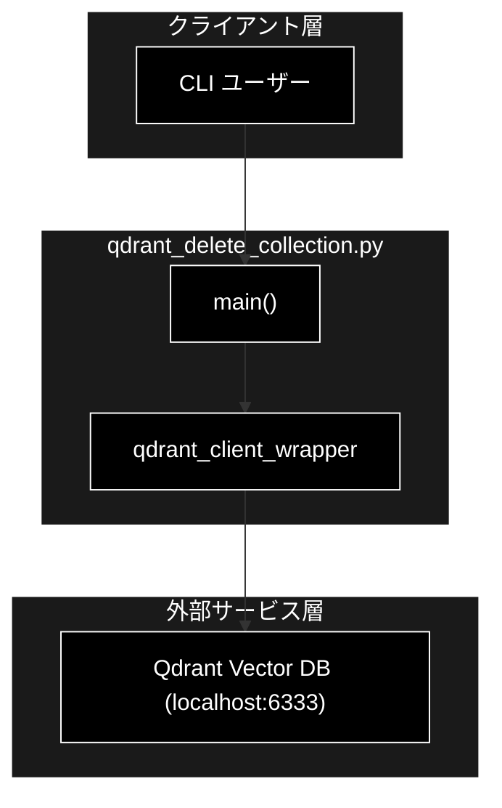
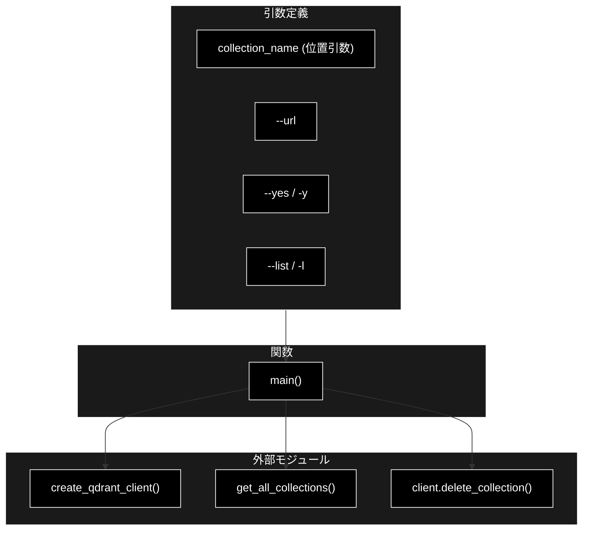
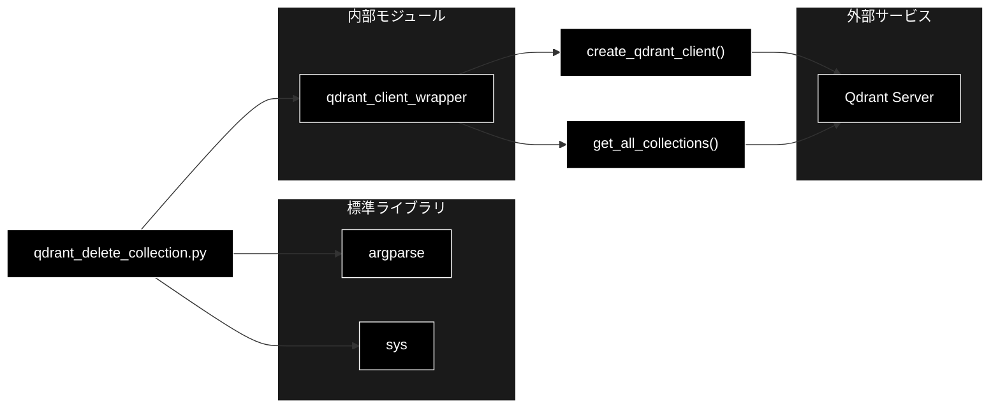

# qdrant_delete_collection.py - Qdrantコレクション削除コマンド ドキュメント

**Version 1.0** | 最終更新: 2026-06-17

---

## 目次

1. [概要](#概要)
2. [1. アーキテクチャ構成図](#1-アーキテクチャ構成図)
3. [2. モジュール構成図](#2-モジュール構成図)
4. [3. クラス・関数一覧表](#3-クラス関数一覧表)
5. [4. クラス・関数 IPO詳細](#4-クラス関数-ipo詳細)
6. [5. 設定・定数](#5-設定定数)
7. [6. 使用例](#6-使用例)
8. [7. エクスポート](#7-エクスポート)
9. [8. 変更履歴](#8-変更履歴)
10. [付録: 依存関係図](#付録-依存関係図)

---

## 概要

`qdrant_delete_collection.py` は、Qdrant ベクトルデータベース上の指定されたコレクションを削除するための管理用 CLI スクリプトです。誤削除防止のため、削除実行前に対象コレクションの存在確認と詳細情報（ポイント件数・ステータス）の表示、対話的確認プロンプトを行います。`--list` オプションでコレクション一覧表示、`--yes` で確認スキップが可能です。

> 📝 **注意**: 本コマンドは Qdrant 上のコレクションを**完全に削除する破壊的操作**を実行します。削除後の復元はできません。`--yes` フラグを使用する際は対象コレクション名を十分に確認してください。

### 主な責務

- Qdrant コレクションの一覧表示（`--list`）
- 削除対象コレクションの存在確認
- 削除前情報（ポイント件数・ステータス）の表示
- 対話的確認プロンプトによる誤削除の防止
- 指定コレクションの削除実行

### 各責務対応のモジュール

| # | 責務 | 対応モジュール | 説明 |
|---|------|--------------|------|
| 1 | Qdrant コレクションの一覧表示 | `qdrant_client_wrapper.py` | `get_all_collections()` で全コレクションを取得 |
| 2 | 削除対象コレクションの存在確認 | `qdrant_delete_collection.py` | 取得した一覧に対象名が含まれるか検査 |
| 3 | 削除前情報の表示 | `qdrant_delete_collection.py` | `points_count` / `status` を標準出力に表示 |
| 4 | 対話的確認プロンプトによる誤削除の防止 | `qdrant_delete_collection.py` | `input()` で `y/N` を取得 |
| 5 | 指定コレクションの削除実行 | `qdrant_client_wrapper.py` | `QdrantClient.delete_collection()` を呼び出し |

### 主要機能一覧

| 機能 | 説明 |
|------|------|
| `main()` | CLI エントリポイント。引数解析・一覧表示・確認・削除を実行 |

---

## 1. アーキテクチャ構成図

### 1.1 システム全体構成



### 1.2 データフロー

1. ユーザーが CLI から削除対象のコレクション名と引数を指定して起動
2. `create_qdrant_client()` で Qdrant クライアントを生成
3. `--list` 指定時は `get_all_collections()` の結果を表示して終了
4. 削除モード時は対象コレクションの存在確認 → 情報表示 → 確認プロンプト
5. ユーザー承認後、`client.delete_collection()` で削除を実行

---

## 2. モジュール構成図

### 2.1 内部モジュール構成



### 2.2 外部依存関係

| ライブラリ | バージョン | 用途 |
|-----------|-----------|------|
| `argparse` | 標準ライブラリ | CLI 引数解析 |
| `sys` | 標準ライブラリ | 終了コード制御 |

### 2.3 内部依存モジュール

| モジュール | 用途 |
|-----------|------|
| `qdrant_client_wrapper.create_qdrant_client` | Qdrant クライアント生成 |
| `qdrant_client_wrapper.get_all_collections` | コレクション一覧取得 |

---

## 3. クラス・関数一覧表

### 3.1 クラス一覧

本モジュールはクラスを定義していません。

### 3.2 関数一覧（カテゴリ別）

#### CLI エントリポイント

| 関数名 | 概要 |
|-------|------|
| `main()` | CLI 引数を解析し、一覧表示または指定コレクションの削除を実行 |

---

## 4. クラス・関数 IPO詳細

### 4.1 CLI エントリポイント関数

#### `main`

**概要**: CLI 引数を解析し、`--list` 指定時は Qdrant 上のコレクション一覧を表示、それ以外は指定されたコレクション名を確認プロンプトを経て削除する。

```python
def main() -> None
```

| パラメータ | 型 | デフォルト | 説明 |
|------------|------|-----------|------|
| （なし） | - | - | `argparse` 経由でコマンドライン引数を受け取る |

**コマンドライン引数**:

| 引数 | 型 | デフォルト | 説明 |
|------|---|-----------|------|
| `collection_name` | str (位置引数, 任意) | None | 削除するコレクション名。`--list` 使用時は不要 |
| `--url` | str | `"http://localhost:6333"` | Qdrant サーバーの URL |
| `--yes`, `-y` | flag | False | 削除確認プロンプトをスキップ |
| `--list`, `-l` | flag | False | コレクション一覧を表示して終了 |

| 項目 | 内容 |
|------|------|
| **Input** | コマンドライン引数（`collection_name`, `--url`, `--yes`, `--list`） |
| **Process** | 1. `argparse.ArgumentParser` で引数を解析<br>2. `create_qdrant_client(url=args.url)` で Qdrant クライアントを生成<br>3. `--list` 指定時: `get_all_collections()` の結果をフォーマット表示して `return`<br>4. `collection_name` 未指定時: ヘルプ表示し `sys.exit(1)`<br>5. `get_all_collections()` の結果から対象コレクションの存在を確認（無い場合は既存一覧を表示して `sys.exit(1)`）<br>6. 削除対象の `points_count` / `status` を標準出力に表示<br>7. `--yes` 未指定時: `input()` で `y/N` 確認を取得し、否定回答時は `sys.exit(0)`<br>8. `client.delete_collection(collection_name=...)` で削除を実行<br>9. 削除完了メッセージを表示 |
| **Output** | `None`（標準出力にメッセージを表示。終了コード: 成功=0、引数不足/存在しない/エラー=1） |

**戻り値例**:

```python
# --list 実行時の標準出力例
# コレクション一覧 (3件):
#   - cc_news_2per_anthropic                  points=  12,345  status=green
#   - faq_chunks_anthropic                    points=     842  status=green
#   - test_collection                         points=       0  status=green

# 削除実行時の標準出力例
# 削除対象: cc_news_2per_anthropic
#   points_count : 12,345
#   status       : green
#
# 'cc_news_2per_anthropic' を削除しますか？ [y/N]: y
# 削除完了: コレクション 'cc_news_2per_anthropic' を削除しました。
```

```python
# 使用例（Python から直接呼び出すことは想定されていないが参考）
import sys
sys.argv = ["qdrant_delete_collection.py", "--list"]
from qdrant_delete_collection import main
main()
# コレクション一覧 (N件): ... が出力される
```

---

## 5. 設定・定数

本モジュールには専用の設定辞書・定数は定義されていません。Qdrant 接続先 URL のみ CLI 引数 `--url`（デフォルト `http://localhost:6333`）で指定します。

---

## 6. 使用例

### 6.1 基本的なワークフロー（CLI）

```bash
# 1. コレクション一覧を表示して削除対象を確認
python qdrant_delete_collection.py --list

# 2. 削除対象のコレクション名を指定して削除（確認プロンプトあり）
python qdrant_delete_collection.py cc_news_2per_anthropic
# → 'cc_news_2per_anthropic' を削除しますか？ [y/N]: y

# 3. 確認をスキップして削除（バッチ処理向け）
python qdrant_delete_collection.py cc_news_2per_anthropic --yes
```

### 6.2 応用的なワークフロー

```bash
# リモート Qdrant サーバーのコレクションを削除
python qdrant_delete_collection.py my_collection \
    --url http://qdrant.example.com:6333 \
    --yes

# 一覧表示でリモートサーバーを確認
python qdrant_delete_collection.py --list --url http://qdrant.example.com:6333
```

> 📝 **注意**: `--yes` を指定するとプロンプトなしで即座に削除が実行されます。スクリプトや CI から呼び出す際は対象名の指定ミスがないことを必ず確認してください。

---

## 7. エクスポート

本モジュールは `__all__` を定義していません（**未定義**）。CLI 用スクリプトのため、`main()` 関数を直接 import して利用することは想定されていません。

---

## 8. 変更履歴

| バージョン | 変更内容 |
|-----------|---------|
| 1.0 | 初版作成（2026-06-17） |

---

## 付録: 依存関係図


