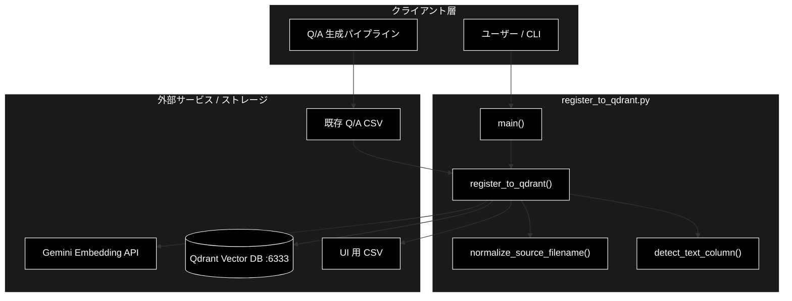
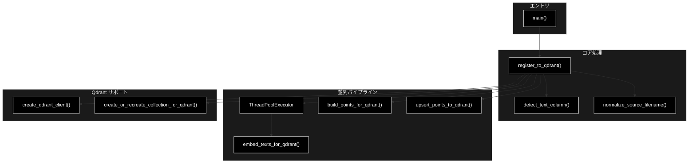
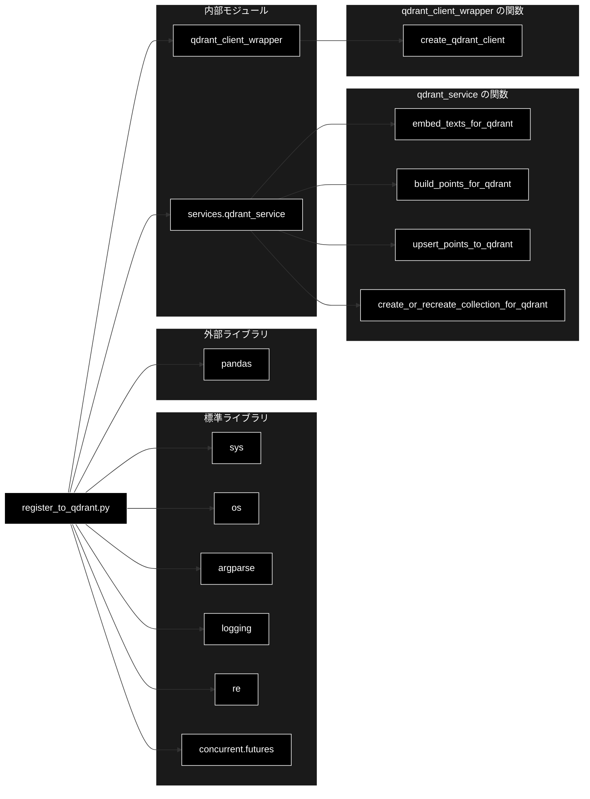

# register_to_qdrant.py - 既存Q/A CSV → Qdrant 登録 CLIツール ドキュメント

**Version 2.0** | 最終更新: 2026-06-17

---

## 目次

1. [概要](#概要)
2. [アーキテクチャ構成図](#1-アーキテクチャ構成図)
3. [モジュール構成図](#2-モジュール構成図)
4. [クラス・関数一覧表](#3-クラス関数一覧表)
5. [クラス・関数 IPO詳細](#4-クラス関数-ipo詳細)
6. [設定・定数](#5-設定定数)
7. [使用例](#6-使用例)
8. [エクスポート](#7-エクスポート)
9. [変更履歴](#8-変更履歴)
10. [付録: 依存関係図](#付録-依存関係図)

---

## 概要

`register_to_qdrant.py` は、**既存の Q/A CSV（あるいは汎用 CSV）を Embedding 生成のうえ Qdrant ベクトルデータベースに登録する**「登録専用」の統合CLIツールです。`register_csv_to_qdrant.py` と `register_qdrant.py` を統合した最終版で、Q/A 自動生成は行わず、入力 CSV からテキストを切り出し→ベクトル化→アップサートまでを単一コマンドで実行します。

> 📝 **役割の分担**: Q/A 自体の生成（LLM による質問・回答の自動生成）は本モジュールの責務外です。Q/A 生成は別モジュール（例: `make_qa.py` / `make_qa_register_qdrant.py`）が担当し、本モジュールはその出力 CSV を Qdrant に流し込む後段ステップを担当します。

### 主な責務

- 入力 CSV の読み込みとベクトル化対象テキストカラムの自動検出
- 重複テキストの除去（Embedding コスト削減・件数突合ズレ防止）
- Gemini Embedding (`gemini-embedding-001`, 3072次元) によるテキストのベクトル化（先読みパイプライン）
- Qdrant コレクションの新規作成・再作成・追記の制御
- ファイル名正規化（日時サフィックス除去）と UI 用 CSV の自動生成
- 登録後の件数突合検証

### 各責務対応のモジュール

| # | 責務 | 対応モジュール | 説明 |
|---|------|--------------|------|
| 1 | CSV読み込み・カラム検出 | `register_to_qdrant.py` | `detect_text_column()` で対象カラムを優先順位付きで判定 |
| 2 | 重複テキストの除去 | `register_to_qdrant.py` | 正規化テキストの集合で `df`/`texts` を同期して絞り込み |
| 3 | テキストの Embedding 生成 | `services.qdrant_service.embed_texts_for_qdrant` | Gemini Embedding を呼び出してベクトル化 |
| 4 | コレクション準備 | `services.qdrant_service.create_or_recreate_collection_for_qdrant` | recreate/新規/追記の3モードに対応 |
| 5 | ファイル名正規化と UI 用 CSV 出力 | `register_to_qdrant.py` | `normalize_source_filename()` と `question`/`answer` 抽出 |
| 6 | 登録後の件数突合 | `register_to_qdrant.py` | `client.get_collection().points_count` と処理件数を比較 |

### 主要機能一覧

| 機能 | 説明 |
|------|------|
| `normalize_source_filename()` | ファイル名から `_YYYYMMDD_HHMMSS` サフィックスを除去 |
| `detect_text_column()` | ベクトル化対象テキストカラムを自動検出（4段階の優先順位） |
| `register_to_qdrant()` | CSV を Qdrant に登録するメイン処理関数 |
| `main()` | CLI エントリーポイント（argparse） |

---

## 1. アーキテクチャ構成図

### 1.1 システム全体構成



### 1.2 データフロー

1. ユーザーが CLI で `--input-file`・`--collection` 等を指定して実行
2. CSV を読み込み、`detect_text_column()` でベクトル化対象テキスト列を決定
3. 重複テキストを除去し、`df` と `texts` を同期して縮約
4. Qdrant クライアントを初期化し、`--recreate` に応じてコレクションを準備
5. バッチを `ThreadPoolExecutor` で先読みしつつ Gemini Embedding を生成
6. `build_points_for_qdrant()` で `PointStruct` を構築し、`upsert_points_to_qdrant()` で投入
7. 登録後に `points_count` と処理件数を突合してログ出力
8. オプションで `question`/`answer` のみの UI 用 CSV を生成

---

## 2. モジュール構成図

### 2.1 内部モジュール構成



### 2.2 外部依存関係

| ライブラリ | 種別 | 用途 |
|-----------|------|------|
| `pandas` | サードパーティ | CSV 読み込み / DataFrame 操作 |
| `argparse` | 標準 | CLI 引数解析 |
| `logging` | 標準 | 進捗ログ出力 |
| `re` | 標準 | ファイル名の日時サフィックス除去 |
| `concurrent.futures.ThreadPoolExecutor` | 標準 | Embedding 先読み並列化 |
| `os`, `sys` | 標準 | パス解決・終了コード制御 |

### 2.3 内部依存モジュール

| モジュール | インポート要素 | 用途 |
|-----------|----------------|------|
| `services.qdrant_service` | `embed_texts_for_qdrant` | Gemini Embedding 生成 |
| `services.qdrant_service` | `build_points_for_qdrant` | `PointStruct` 構築（内容ベース ID） |
| `services.qdrant_service` | `upsert_points_to_qdrant` | バッチ単位のアップサート |
| `services.qdrant_service` | `create_or_recreate_collection_for_qdrant` | コレクション作成・再作成 |
| `qdrant_client_wrapper` | `create_qdrant_client` | Qdrant クライアントの生成 |

---

## 3. クラス・関数一覧表

本モジュールはクラスを定義しません（関数のみ）。

### 3.1 関数一覧（カテゴリ別）

#### ユーティリティ関数

| 関数名 | 概要 |
|-------|------|
| `normalize_source_filename(filename)` | ファイル名から `_YYYYMMDD_HHMMSS` サフィックスを除去 |
| `detect_text_column(df, text_col)` | ベクトル化対象テキストカラムを優先順位付きで自動検出 |

#### メイン処理関数

| 関数名 | 概要 |
|-------|------|
| `register_to_qdrant(...)` | CSV を Qdrant に登録するメイン処理（バッチ + 先読み） |
| `main()` | CLI エントリーポイント |

---

## 4. クラス・関数 IPO詳細

### 4.1 ユーティリティ関数

#### `normalize_source_filename`

**概要**: ファイル名から日時サフィックス（例: `_20251230_232641`）を除去して正規化する。

```python
def normalize_source_filename(filename: str) -> str
```

| パラメータ | 型 | デフォルト | 説明 |
|------------|------|-----------|------|
| `filename` | str | - | 元のファイル名 |

| 項目 | 内容 |
|------|------|
| **Input** | `filename: str` |
| **Process** | 正規表現 `_\d{8}_\d{6}` にマッチする部分を空文字列に置換 |
| **Output** | `str`: 正規化されたファイル名 |

**戻り値例**:
```python
"qa_pairs_fineweb_edu_ja.csv"
```

```python
# 使用例
normalized = normalize_source_filename(
    "qa_pairs_fineweb_edu_ja_20251230_123456.csv"
)
print(normalized)
# 出力: qa_pairs_fineweb_edu_ja.csv
```

---

#### `detect_text_column`

**概要**: ベクトル化対象のテキスト列を 4 段階の優先順位で自動検出する。

```python
def detect_text_column(
    df: pd.DataFrame,
    text_col: Optional[str] = None,
) -> tuple[List[str], str]
```

| パラメータ | 型 | デフォルト | 説明 |
|------------|------|-----------|------|
| `df` | pd.DataFrame | - | 入力 DataFrame |
| `text_col` | Optional[str] | `None` | 明示指定するカラム名 |

| 項目 | 内容 |
|------|------|
| **Input** | `df: pd.DataFrame`, `text_col: Optional[str] = None` |
| **Process** | 1. `text_col` 指定 → 該当列を採用<br>2. `question` + `answer` 両方あり → 改行で結合<br>3. `Combined_Text` あり → 単独採用<br>4. `text` あり → 単独採用<br>5. いずれも無ければ `ValueError` |
| **Output** | `tuple[List[str], str]`: (テキストリスト, 検出方法の説明文) |

**検出優先順位**:

| 優先度 | 条件 | 検出方法 |
|--------|------|---------|
| 1 | `--text-col` で指定 | 指定カラム |
| 2 | `question` + `answer` 列存在 | `question + "\n" + answer` |
| 3 | `Combined_Text` 列存在 | 単独列 |
| 4 | `text` 列存在 | 単独列 |

**戻り値例**:
```python
(
    ["質問1\n回答1", "質問2\n回答2"],
    "'question' + 'answer' の結合",
)
```

```python
# 使用例
import pandas as pd

df = pd.DataFrame({"question": ["Q1", "Q2"], "answer": ["A1", "A2"]})
texts, method = detect_text_column(df)
print(method)
# 出力: 'question' + 'answer' の結合
```

---

### 4.2 メイン処理関数

#### `register_to_qdrant`

**概要**: CSV を読み込み、Embedding を並列先読みしつつ Qdrant に登録するメイン処理。

```python
def register_to_qdrant(
    input_file: str,
    collection_name: str,
    recreate: bool = False,
    batch_size: int = 100,
    text_col: Optional[str] = None,
    domain: Optional[str] = None,
    max_docs: Optional[int] = None,
    provider: str = "gemini",
    normalize_filename: bool = True,
    create_ui_csv: bool = True,
    ui_output_dir: str = "qa_output",
    embed_workers: int = 2,
) -> bool
```

| パラメータ | 型 | デフォルト | 説明 |
|------------|------|-----------|------|
| `input_file` | str | - | 入力 CSV ファイルパス |
| `collection_name` | str | - | Qdrant コレクション名 |
| `recreate` | bool | `False` | 既存コレクションを削除して再作成 |
| `batch_size` | int | `100` | 1 バッチあたりの件数 |
| `text_col` | Optional[str] | `None` | ベクトル化対象カラム（None=自動検出） |
| `domain` | Optional[str] | `None` | ペイロードの `domain`（None=collection名） |
| `max_docs` | Optional[int] | `None` | 登録上限件数（None=全件） |
| `provider` | str | `"gemini"` | Embedding プロバイダー（`gemini` / `openai`） |
| `normalize_filename` | bool | `True` | ファイル名の日時サフィックス除去 |
| `create_ui_csv` | bool | `True` | `question`/`answer` 抜粋 CSV の出力 |
| `ui_output_dir` | str | `"qa_output"` | UI 用 CSV の出力先 |
| `embed_workers` | int | `2` | Embedding 先読みの並列スレッド数 |

| 項目 | 内容 |
|------|------|
| **Input** | 上記パラメータ |
| **Process** | 1. 入力ファイル存在確認<br>2. `pd.read_csv()` 読み込み + `max_docs` 適用<br>3. `detect_text_column()` でテキスト決定<br>4. 重複テキスト除去（df と texts を同期）<br>5. `create_qdrant_client()` と `create_or_recreate_collection_for_qdrant()`<br>6. `ThreadPoolExecutor` でバッチ Embedding を先読み（`lookahead = embed_workers + 1`）<br>7. `build_points_for_qdrant()` で `PointStruct` を構築<br>8. `embedding_provider` / `embedding_model` / `source` をペイロードへ追記<br>9. `upsert_points_to_qdrant()` でアップサート<br>10. `points_count` と処理件数を突合検証<br>11. UI 用 CSV 出力（`question`/`answer` がある場合のみ） |
| **Output** | `bool`: 成功 `True` / 失敗・中断 `False` |

**ペイロード構造**:

| フィールド | 説明 |
|-----------|------|
| `source` | 正規化されたファイル名 |
| `domain` | `--domain` 指定値、未指定時はコレクション名 |
| `embedding_provider` | `"gemini"` または `"openai"` |
| `embedding_model` | `gemini-embedding-001` または `text-embedding-3-small` |
| (その他) | `build_points_for_qdrant()` が CSV カラムから付与 |

```python
# 使用例
success = register_to_qdrant(
    input_file="qa_output/qa_pairs.csv",
    collection_name="qa_fineweb_edu_ja",
    recreate=True,
    batch_size=100,
    provider="gemini",
    embed_workers=2,
)
print("成功" if success else "失敗")
```

---

#### `main`

**概要**: `argparse` で CLI 引数を解析し、APIキー確認後に `register_to_qdrant()` を呼び出すエントリーポイント。

```python
def main() -> None
```

| 項目 | 内容 |
|------|------|
| **Input** | CLI 引数（`sys.argv` 経由） |
| **Process** | 1. `argparse` で必須/Qdrant/ベクトル化/データ処理/出力 5 グループの引数を解析<br>2. `provider` に応じて `GOOGLE_API_KEY` または `OPENAI_API_KEY` の存在を確認<br>3. `register_to_qdrant()` を呼び出し<br>4. 結果に応じて `sys.exit(0 or 1)` |
| **Output** | `None`（終了コードで結果を返す） |

**CLI 引数（抜粋）**:

| グループ | 引数 | 既定値 | 説明 |
|---------|------|--------|------|
| 必須 | `--input-file` | - | 入力 CSV パス |
| 必須 | `--collection` | - | コレクション名 |
| Qdrant | `--recreate` | False | 再作成 |
| Qdrant | `--batch-size` | 100 | バッチ件数 |
| Qdrant | `--embed-workers` | 2 | 並列スレッド数 |
| ベクトル化 | `--text-col` | None | 対象カラム明示 |
| ベクトル化 | `--provider` | `gemini` | `gemini` / `openai` |
| データ処理 | `--domain` | None | ペイロード `domain` |
| データ処理 | `--max-docs` | None | 最大件数 |
| 出力 | `--normalize-filename` / `--no-normalize-filename` | True | ファイル名正規化 |
| 出力 | `--create-ui-csv` / `--no-create-ui-csv` | True | UI 用 CSV 生成 |
| 出力 | `--ui-output-dir` | `qa_output` | UI 用 CSV 出力先 |

**終了コード**:

| コード | 説明 |
|--------|------|
| `0` | 正常終了 |
| `1` | エラー終了（APIキー未設定 / 登録失敗 / 中断） |

---

## 5. 設定・定数

### 5.1 ログ設定

```python
logging.basicConfig(
    level=logging.INFO,
    format='%(asctime)s - %(levelname)s - %(message)s',
)
```

| キー | 値 | 説明 |
|-----|-----|------|
| `level` | `INFO` | 進捗ログを標準出力に流す |
| `format` | `%(asctime)s - %(levelname)s - %(message)s` | タイムスタンプ付き |

### 5.2 Embedding プロバイダー対応モデル

| `provider` | モデル名 | 次元数 | 必須環境変数 |
|-----------|---------|--------|--------------|
| `gemini`（既定） | `gemini-embedding-001` | 3072 | `GOOGLE_API_KEY` |
| `openai` | `text-embedding-3-small` | 1536 | `OPENAI_API_KEY` |

### 5.3 並列パイプライン定数

| 名前 | 値 | 説明 |
|------|-----|------|
| `lookahead` | `max(1, embed_workers) + 1` | バッチ先読みの最大段数 |

---

## 6. 使用例

### 6.1 基本的なワークフロー（Q/A CSV を Qdrant に登録）

```bash
python register_to_qdrant.py \
  --input-file qa_output/qa_pairs.csv \
  --collection my_collection \
  --recreate
```

### 6.2 パイプライン出力（日時サフィックス付き）を正規化して登録

```bash
python register_to_qdrant.py \
  --input-file qa_output/pipeline/qa_pairs_fineweb_edu_ja_20251230_123456.csv \
  --collection qa_fineweb_edu_ja \
  --recreate \
  --batch-size 100 \
  --embed-workers 2 \
  --normalize-filename \
  --create-ui-csv \
  --ui-output-dir qa_output
```

### 6.3 テスト用（少量データ）

```bash
python register_to_qdrant.py \
  --input-file test_data.csv \
  --collection test_collection \
  --max-docs 10 \
  --batch-size 5
```

### 6.4 OpenAI Embedding を使用

```bash
python register_to_qdrant.py \
  --input-file qa_output/qa_pairs.csv \
  --collection my_collection_openai \
  --provider openai \
  --recreate
```

### 6.5 任意カラムをベクトル化対象に指定

```bash
python register_to_qdrant.py \
  --input-file documents.csv \
  --collection docs_collection \
  --text-col content \
  --recreate
```

### 6.6 Python から関数呼び出し

```python
from qa_qdrant.register_to_qdrant import register_to_qdrant

ok = register_to_qdrant(
    input_file="qa_output/qa_pairs.csv",
    collection_name="qa_fineweb_edu_ja",
    recreate=True,
    provider="gemini",
)
```

---

## 7. エクスポート

本モジュールは `__all__` を定義していません。公開されている主な要素は次のとおりです。

```python
# 関数
normalize_source_filename
detect_text_column
register_to_qdrant
main
```

---

## 8. 変更履歴

| バージョン | 日付 | 変更内容 |
|-----------|------|----------|
| 1.0 | 2025-01-29 | 初版作成（`register_csv_to_qdrant.py` と `register_qdrant.py` を統合） |
| 2.0 | 2026-06-17 | 実装に合わせて全面改訂。`embed_workers`（並列 Embedding 先読みパイプライン）、重複テキスト除去、登録後件数突合検証、`--embed-workers` CLI 引数を追記。フォーマット仕様 v1.5 準拠（黒背景 Mermaid・必須セクション順）に再構成。 |

---

## 付録: 依存関係図


