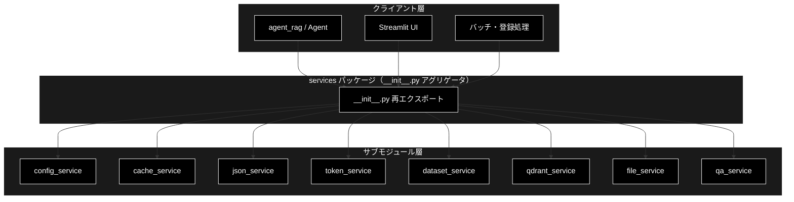
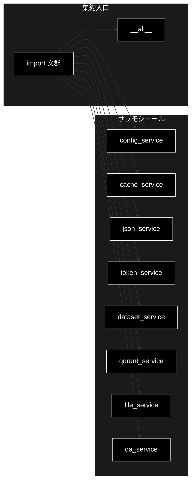
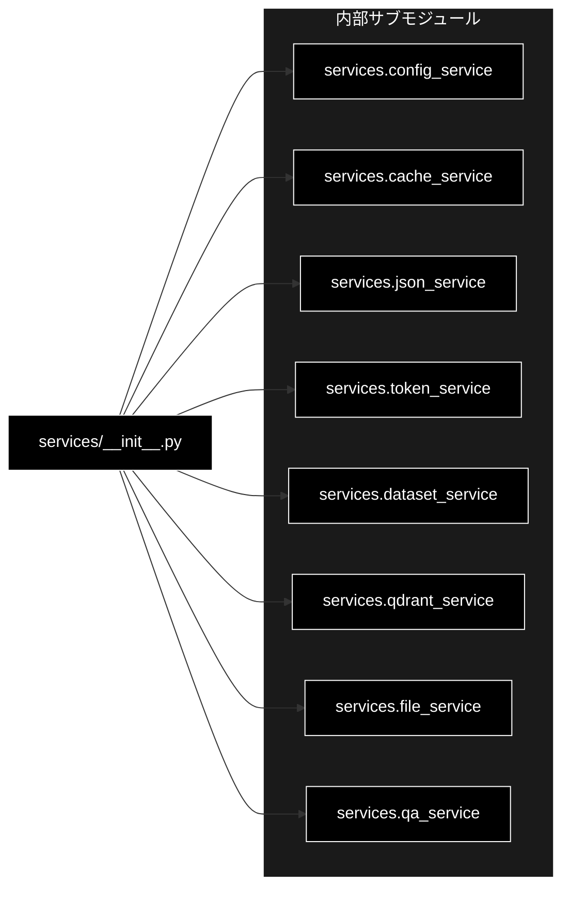

# __init__.py - services パッケージ ドキュメント

**Version 1.0** | 最終更新: 2026-06-17

---

## 目次

1. [概要](#概要)
2. [アーキテクチャ構成図](#1-アーキテクチャ構成図)
3. [モジュール構成図](#2-モジュール構成図)
4. [クラス・関数一覧表](#3-クラス関数一覧表)
5. [クラス・関数 IPO詳細](#4-クラス関数-ipo詳細)
6. [設定・定数](#5-設定定数)
7. [使用例](#6-使用例)
8. [エクスポート](#7-エクスポート)
9. [変更履歴](#8-変更履歴)
10. [付録: 依存関係図](#付録-依存関係図)

---

## 概要

`services/__init__.py` は、`services` パッケージのアグリゲータ（集約入口）です。`agent_rag.py` から分離された各ビジネスロジックのサブモジュールを取りまとめ、パッケージ利用側が `from services import ...` という単一の名前空間から全シンボルへアクセスできるように再エクスポートします。

このモジュールは **再エクスポート専用** であり、独自のクラス・関数・実行ロジックを一切定義しません。すべての実体は各サブモジュール側に存在し、本ファイルは `import` 文と `__all__` リストのみで構成されます。したがって本ドキュメントの「IPO詳細」セクションは、再エクスポートされる各シンボルとその由来サブモジュールの対応表を中心に据えます。

技術スタックとして、LLM は Anthropic Claude（`claude-sonnet-4-6`、鍵 `ANTHROPIC_API_KEY`）、Embedding は Gemini `gemini-embedding-001`（3072次元、鍵 `GOOGLE_API_KEY`）、ベクトルDB は Qdrant を用います。

### 主な責務

- 各サブモジュールの公開シンボルを単一名前空間へ集約（再エクスポート）
- `__all__` による公開APIの明示的な定義
- 設定・キャッシュ・JSON・トークン・データセット・Qdrant・ファイル・Q/A の各サービスへの統一アクセス入口の提供
- パッケージ利用側のインポート経路の簡素化

### 各責務対応のモジュール

| # | 責務 | 対応モジュール | 説明 |
|---|------|--------------|------|
| 1 | 設定管理（YAML・環境変数） | `config_service.py` | `ConfigManager`・グローバル設定・ロガーを提供 |
| 2 | メモリキャッシュ（TTL対応） | `cache_service.py` | `MemoryCache`・デコレータ `cache_result` を提供 |
| 3 | JSON処理（シリアライズ・ファイルI/O） | `json_service.py` | 安全なJSON入出力・整形ユーティリティ |
| 4 | トークン管理（カウント・コスト推定） | `token_service.py` | `TokenManager`・価格表・モデル制限を提供 |
| 5 | データセット操作（ダウンロード・前処理） | `dataset_service.py` | HF/livedoor コーパス取得・テキスト抽出 |
| 6 | Qdrant操作（CRUD・ヘルスチェック） | `qdrant_service.py` | 登録・検索・統計・コレクション管理 |
| 7 | ファイル操作（履歴読み込み・保存） | `file_service.py` | 出力履歴・サンプル質問・Q/Aプレビュー読み込み |
| 8 | Q/A生成（Anthropic Claude・サブプロセス実行） | `qa_service.py` | Q/Aペア生成とファイル保存 |

### 主要機能一覧

| 機能 | 説明 |
|------|------|
| `from services import *` | `__all__` に列挙された全シンボルを一括インポート |
| 再エクスポート（クラス） | `ConfigManager` `MemoryCache` `TokenManager` `QdrantHealthChecker` `QdrantDataFetcher` |
| 再エクスポート（関数） | 各サービスの公開関数（データセット・Qdrant・ファイル・Q/A・トークン・設定・キャッシュ・JSON） |
| 再エクスポート（定数） | `QDRANT_CONFIG` `LLM_PRICING` `EMBEDDING_PRICING` `MODEL_LIMITS` ほか |
| `__all__` | パッケージの公開APIを定義するリスト |

---

## 1. アーキテクチャ構成図

### 1.1 システム全体構成



### 1.2 データフロー

1. クライアント層が `from services import <symbol>` で公開APIを取得
2. `__init__.py` が対応するサブモジュールから実体を解決して提供
3. 実際の処理は各サブモジュール側で実行（設定・キャッシュ・Qdrant・Q/A生成など）
4. 結果がクライアント層へ返却される

---

## 2. モジュール構成図

### 2.1 内部モジュール構成



### 2.2 内部依存モジュール

| モジュール | 用途 |
|-----------|------|
| `services.config_service` | 設定管理・ロガー |
| `services.cache_service` | メモリキャッシュ |
| `services.json_service` | JSON処理 |
| `services.token_service` | トークン・コスト管理 |
| `services.dataset_service` | データセット取得・前処理 |
| `services.qdrant_service` | Qdrant操作 |
| `services.file_service` | ファイル入出力 |
| `services.qa_service` | Q/A生成 |

---

## 3. クラス・関数一覧表

本モジュールは独自のクラス・関数を **定義しません**（再エクスポート専用）。本ファイルに存在するのは `import` 文と `__all__` リストのみです。以下は再エクスポートされるシンボルのクイックリファレンスです。

### 3.1 クラス一覧（再エクスポート）

| クラス | 由来サブモジュール |
|--------|------------------|
| `ConfigManager` | `config_service` |
| `MemoryCache` | `cache_service` |
| `TokenManager` | `token_service` |
| `QdrantHealthChecker` | `qdrant_service` |
| `QdrantDataFetcher` | `qdrant_service` |

### 3.2 関数・定数一覧（カテゴリ別・再エクスポート）

#### config_service

| シンボル | 種別 |
|---------|------|
| `config` | インスタンス/オブジェクト |
| `logger` | ロガー |
| `get_config` `set_config` `reload_config` | 関数 |

#### cache_service

| シンボル | 種別 |
|---------|------|
| `cache` | インスタンス |
| `cache_result` | デコレータ |
| `get_global_cache` `init_cache_from_config` | 関数 |

#### json_service

| シンボル | 種別 |
|---------|------|
| `safe_json_serializer` `safe_json_dumps` `safe_json_loads` | 関数 |
| `load_json_file` `save_json_file` `load_json_file_or_default` `merge_json_files` | 関数 |
| `is_valid_json` `pretty_print_json` `compact_json` | 関数 |

#### token_service

| シンボル | 種別 |
|---------|------|
| `count_tokens` `estimate_tokens_simple` `truncate_text` | 関数 |
| `get_llm_pricing` `get_embedding_pricing` `get_model_limits` | 関数 |
| `DEFAULT_ENCODING` `MODEL_ENCODINGS` `LLM_PRICING` `EMBEDDING_PRICING` `MODEL_LIMITS` | 定数 |

#### dataset_service

| シンボル | 種別 |
|---------|------|
| `download_livedoor_corpus` `load_livedoor_corpus` `download_hf_dataset` | 関数 |
| `extract_text_content` `load_uploaded_file` | 関数 |

#### qdrant_service

| シンボル | 種別 |
|---------|------|
| `get_collection_stats` `get_all_collections` `delete_all_collections` | 関数 |
| `load_csv_for_qdrant` `build_inputs_for_embedding` `embed_texts_for_qdrant` | 関数 |
| `create_or_recreate_collection_for_qdrant` `build_points_for_qdrant` `upsert_points_to_qdrant` `embed_query_for_search` | 関数 |
| `QDRANT_CONFIG` `COLLECTION_EMBEDDINGS_SEARCH` `COLLECTION_CSV_MAPPING` | 定数 |

#### file_service

| シンボル | 種別 |
|---------|------|
| `load_qa_output_history` `load_preprocessed_history` `save_to_output` | 関数 |
| `load_sample_questions_from_csv` `load_source_qa_data` `load_collection_qa_preview` | 関数 |

#### qa_service

| シンボル | 種別 |
|---------|------|
| `run_advanced_qa_generation` `generate_qa_pairs` `save_qa_pairs_to_file` | 関数 |

---

## 4. クラス・関数 IPO詳細

> 📝 **注意**: `services/__init__.py` は再エクスポート専用のアグリゲータであり、**独自のクラス・関数を一切定義していません**。実行可能なロジック（IPO を持つ関数・メソッド）は存在しないため、ここでは IPO 詳細の代わりに「再エクスポートされる各シンボル → 由来サブモジュール」の完全な対応表を提示します。各シンボルの詳細仕様は、対応するサブモジュールのドキュメントを参照してください。

### 4.1 再エクスポート対応表（シンボル → 由来サブモジュール）

| シンボル | 種別 | 由来サブモジュール |
|---------|------|------------------|
| `MemoryCache` | クラス | `cache_service` |
| `cache` | オブジェクト | `cache_service` |
| `cache_result` | デコレータ | `cache_service` |
| `get_global_cache` | 関数 | `cache_service` |
| `init_cache_from_config` | 関数 | `cache_service` |
| `ConfigManager` | クラス | `config_service` |
| `config` | オブジェクト | `config_service` |
| `get_config` | 関数 | `config_service` |
| `logger` | ロガー | `config_service` |
| `reload_config` | 関数 | `config_service` |
| `set_config` | 関数 | `config_service` |
| `download_hf_dataset` | 関数 | `dataset_service` |
| `download_livedoor_corpus` | 関数 | `dataset_service` |
| `extract_text_content` | 関数 | `dataset_service` |
| `load_livedoor_corpus` | 関数 | `dataset_service` |
| `load_uploaded_file` | 関数 | `dataset_service` |
| `load_collection_qa_preview` | 関数 | `file_service` |
| `load_preprocessed_history` | 関数 | `file_service` |
| `load_qa_output_history` | 関数 | `file_service` |
| `load_sample_questions_from_csv` | 関数 | `file_service` |
| `load_source_qa_data` | 関数 | `file_service` |
| `save_to_output` | 関数 | `file_service` |
| `compact_json` | 関数 | `json_service` |
| `is_valid_json` | 関数 | `json_service` |
| `load_json_file` | 関数 | `json_service` |
| `load_json_file_or_default` | 関数 | `json_service` |
| `merge_json_files` | 関数 | `json_service` |
| `pretty_print_json` | 関数 | `json_service` |
| `safe_json_dumps` | 関数 | `json_service` |
| `safe_json_loads` | 関数 | `json_service` |
| `safe_json_serializer` | 関数 | `json_service` |
| `save_json_file` | 関数 | `json_service` |
| `generate_qa_pairs` | 関数 | `qa_service` |
| `run_advanced_qa_generation` | 関数 | `qa_service` |
| `save_qa_pairs_to_file` | 関数 | `qa_service` |
| `COLLECTION_CSV_MAPPING` | 定数 | `qdrant_service` |
| `COLLECTION_EMBEDDINGS_SEARCH` | 定数 | `qdrant_service` |
| `QDRANT_CONFIG` | 定数 | `qdrant_service` |
| `QdrantDataFetcher` | クラス | `qdrant_service` |
| `QdrantHealthChecker` | クラス | `qdrant_service` |
| `build_inputs_for_embedding` | 関数 | `qdrant_service` |
| `build_points_for_qdrant` | 関数 | `qdrant_service` |
| `create_or_recreate_collection_for_qdrant` | 関数 | `qdrant_service` |
| `delete_all_collections` | 関数 | `qdrant_service` |
| `embed_query_for_search` | 関数 | `qdrant_service` |
| `embed_texts_for_qdrant` | 関数 | `qdrant_service` |
| `get_all_collections` | 関数 | `qdrant_service` |
| `get_collection_stats` | 関数 | `qdrant_service` |
| `load_csv_for_qdrant` | 関数 | `qdrant_service` |
| `upsert_points_to_qdrant` | 関数 | `qdrant_service` |
| `DEFAULT_ENCODING` | 定数 | `token_service` |
| `EMBEDDING_PRICING` | 定数 | `token_service` |
| `LLM_PRICING` | 定数 | `token_service` |
| `MODEL_ENCODINGS` | 定数 | `token_service` |
| `MODEL_LIMITS` | 定数 | `token_service` |
| `TokenManager` | クラス | `token_service` |
| `count_tokens` | 関数 | `token_service` |
| `estimate_tokens_simple` | 関数 | `token_service` |
| `get_embedding_pricing` | 関数 | `token_service` |
| `get_llm_pricing` | 関数 | `token_service` |
| `get_model_limits` | 関数 | `token_service` |
| `truncate_text` | 関数 | `token_service` |

---

## 5. 設定・定数

`services/__init__.py` 自身は設定値・定数を **定義しません**。ただし、以下の定数を各サブモジュールから再エクスポートしており、パッケージ利用側は `from services import ...` で直接参照できます。実体・既定値の詳細は由来サブモジュールのドキュメントを参照してください。

### 5.1 再エクスポートされる定数

| 定数名 | 由来サブモジュール | 概要 |
|-------|------------------|------|
| `QDRANT_CONFIG` | `qdrant_service` | Qdrant 接続・コレクション設定 |
| `COLLECTION_EMBEDDINGS_SEARCH` | `qdrant_service` | 検索対象コレクションの埋め込み設定 |
| `COLLECTION_CSV_MAPPING` | `qdrant_service` | コレクションと CSV のマッピング |
| `DEFAULT_ENCODING` | `token_service` | 既定のトークンエンコーディング |
| `MODEL_ENCODINGS` | `token_service` | モデル別エンコーディング対応 |
| `LLM_PRICING` | `token_service` | LLM（Anthropic Claude）価格表 |
| `EMBEDDING_PRICING` | `token_service` | Embedding（Gemini）価格表 |
| `MODEL_LIMITS` | `token_service` | モデル別トークン上限 |

---

## 6. 使用例

### 6.1 基本的なワークフロー

```python
# 使用例: 集約入口から各サービスを一括インポート
from services import (
    config,
    get_config,
    TokenManager,
    QdrantHealthChecker,
    generate_qa_pairs,
)

# 1. 設定取得
value = get_config("qdrant.host", default="localhost")

# 2. トークン管理
tm = TokenManager()

# 3. Qdrant ヘルスチェック
checker = QdrantHealthChecker()

# 4. Q/A生成（Anthropic Claude: claude-sonnet-4-6）
# qa = generate_qa_pairs(...)
print(f"設定値: {value}")
```

### 6.2 応用的なワークフロー

```python
# 使用例: ワイルドカードインポート（__all__ に列挙されたシンボルのみ取得）
from services import *

# Qdrant コレクション一覧の取得とキャッシュ利用
collections = get_all_collections()
stats = get_collection_stats(collections[0]) if collections else {}
print(f"コレクション数: {len(collections)}")
```

---

## 7. エクスポート

`__init__.py` でエクスポートされる要素（`__all__` の実体・実装どおり）：

```python
__all__ = [
    # dataset_service
    "download_livedoor_corpus",
    "load_livedoor_corpus",
    "download_hf_dataset",
    "extract_text_content",
    "load_uploaded_file",
    # qdrant_service
    "QdrantHealthChecker",
    "QdrantDataFetcher",
    "get_collection_stats",
    "get_all_collections",
    "delete_all_collections",
    "load_csv_for_qdrant",
    "build_inputs_for_embedding",
    "embed_texts_for_qdrant",
    "create_or_recreate_collection_for_qdrant",
    "build_points_for_qdrant",
    "upsert_points_to_qdrant",
    "embed_query_for_search",
    "QDRANT_CONFIG",
    "COLLECTION_EMBEDDINGS_SEARCH",
    "COLLECTION_CSV_MAPPING",
    # file_service
    "load_qa_output_history",
    "load_preprocessed_history",
    "save_to_output",
    "load_sample_questions_from_csv",
    "load_source_qa_data",
    "load_collection_qa_preview",
    # qa_service
    "run_advanced_qa_generation",
    "generate_qa_pairs",
    "save_qa_pairs_to_file",
    # token_service
    "TokenManager",
    "count_tokens",
    "estimate_tokens_simple",
    "truncate_text",
    "get_llm_pricing",
    "get_embedding_pricing",
    "get_model_limits",
    "DEFAULT_ENCODING",
    "MODEL_ENCODINGS",
    "LLM_PRICING",
    "EMBEDDING_PRICING",
    "MODEL_LIMITS",
    # config_service
    "ConfigManager",
    "config",
    "logger",
    "get_config",
    "set_config",
    "reload_config",
    # cache_service
    "MemoryCache",
    "cache_result",
    "cache",
    "get_global_cache",
    "init_cache_from_config",
    # json_service
    "safe_json_serializer",
    "safe_json_dumps",
    "safe_json_loads",
    "load_json_file",
    "save_json_file",
    "load_json_file_or_default",
    "merge_json_files",
    "is_valid_json",
    "pretty_print_json",
    "compact_json",
]
```

> 📝 **注意**: `__all__` には 8 サブモジュール由来の計 62 シンボルが列挙されています。一方、`import` 文では `config_service` から `logger` も取り込まれており、`__all__` にも含まれています。`__all__` に列挙された名前のみが `from services import *` でエクスポートされます。

---

## 8. 変更履歴

| バージョン | 変更内容 |
|-----------|---------|
| 1.0 | 初版作成（2026-06-17） |

---

## 付録: 依存関係図


