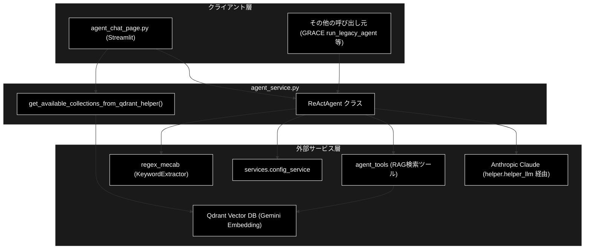
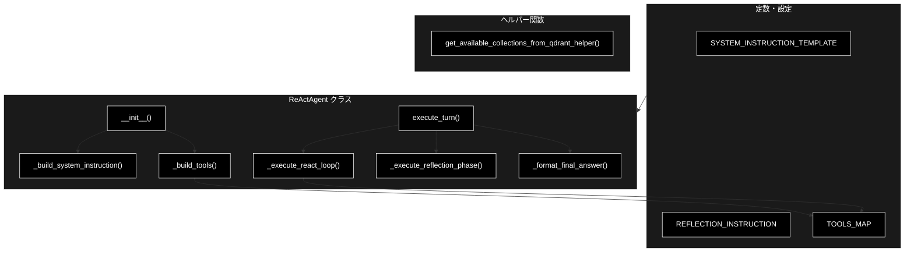
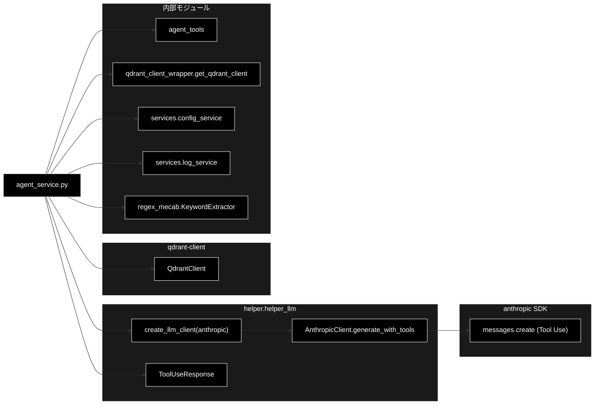

# agent_service.py - ReAct + Reflection エージェント（Anthropic Tool Use ネイティブ）ドキュメント

**Version 2.0** | 最終更新: 2026-06-21

---

## 目次

1. [概要](#概要)
2. [アーキテクチャ構成図](#1-アーキテクチャ構成図)
3. [モジュール構成図](#2-モジュール構成図)
4. [クラス・関数一覧表](#3-クラス関数一覧表)
5. [クラス・関数 IPO詳細](#4-クラス関数-ipo詳細)
6. [設定・定数](#5-設定定数)
7. [使用例](#6-使用例)
8. [エクスポート](#7-エクスポート)
9. [変更履歴](#8-変更履歴)
10. [付録: 依存関係図](#付録-依存関係図)

---

## 概要

`agent_service.py` は、Anthropic Messages API の **ネイティブ Tool Use**（`generate_with_tools()` / `stop_reason == "tool_use"`）を用いた **ReAct エージェント**（`ReActAgent`）を提供するモジュールです。ユーザーの質問に対し「Thought（思考）→ Action（ツール実行）→ Observation（観察）」のサイクルを回して RAG 検索ツールを呼び出し、回答案を作成したのち **Reflection（自己評価・推敲）** フェーズで最終回答に仕上げます。進捗はジェネレータでイベントとして逐次 `yield` され、Streamlit UI（`ui/pages/agent_chat_page.py`）がリアルタイム表示します。

> 📝 **注意（Anthropic ネイティブ）**: 本モジュールの LLM は **Anthropic Claude**（既定 `claude-sonnet-4-6`、`create_llm_client("anthropic")` 経由）です。Embedding（検索）は **Gemini**（`gemini-embedding-001`）を維持します。会話履歴は Anthropic のステートレス設計に合わせ `self._messages`（dict のリスト）で自前管理し、`execute_turn()` の先頭でリセットします。GRACE 本体（Plan→Execute 型）の現行実装は `grace/executor.py` 側にあり、本 ReAct は `run_legacy_agent` ステップから内部呼び出しされることもあります。

### 主な責務

- ReAct ループ（Thought-Action-Observation）の実行と Tool Use 呼び出し
- RAG 検索ツール（`search_rag_knowledge_base` 等）の呼び出しと結果のフィードバック
- 回答案の自己評価・推敲（Reflection フェーズ）
- 重要キーワード抽出による検索クエリの拡張
- 進捗のイベントストリーミング（ジェネレータ）と最終回答の整形
- 会話履歴（`self._messages`）の自前管理（Anthropic ステートレス設計）

### 各責務対応のモジュール

| # | 責務 | 対応モジュール | 説明 |
|---|------|--------------|------|
| 1 | ReAct ループの実行と Tool Use 呼び出し | `services/agent_service.py` | `ReActAgent._execute_react_loop()` が `generate_with_tools()` を駆動 |
| 2 | RAG 検索ツールの呼び出し・結果フィードバック | `agent_tools.py` | `search_rag_knowledge_base` / `list_rag_collections` / キャッシュ版 |
| 3 | 回答案の自己評価・推敲 | `services/agent_service.py` | `ReActAgent._execute_reflection_phase()` |
| 4 | 重要キーワード抽出によるクエリ拡張 | `regex_mecab.py` | `KeywordExtractor`（任意・MeCab優先） |
| 5 | 進捗のイベントストリーミング・最終回答整形 | `services/agent_service.py` | `execute_turn()` / `_format_final_answer()` |
| 6 | LLM クライアント生成・設定取得 | `helper/helper_llm.py`, `services/config_service.py` | `create_llm_client("anthropic")`、`get_config()` から既定モデル等を解決 |

### 主要機能一覧

| 機能 | 説明 |
|------|------|
| `ReActAgent` | Anthropic Tool Use による ReAct + Reflection エージェント |
| `ReActAgent.__init__()` | コンストラクタ（コレクション・モデル名・セッション・ハイブリッド検索の指定） |
| `ReActAgent.execute_turn()` | 1ターンを ReAct→Reflection で実行し進捗イベントを yield |
| `ReActAgent._build_system_instruction()` | 選択コレクションを埋め込んだ system プロンプトを構築 |
| `ReActAgent._build_tools()` | Anthropic Tool Use 形式（`input_schema`）のツール定義を構築 |
| `ReActAgent._execute_react_loop()` | ReAct ループ本体（思考・Tool Use 呼び出し・観察） |
| `ReActAgent._execute_reflection_phase()` | 回答案を自己評価・推敲して最終回答を返す |
| `ReActAgent._format_final_answer()` | `Answer:` / `Thought:` を除去して最終回答を整形 |
| `get_available_collections_from_qdrant_helper()` | Qdrant から利用可能なコレクション名一覧を取得 |
| `TOOLS_MAP` | ツール名 → 実体関数のディスパッチ表 |
| `SYSTEM_INSTRUCTION_TEMPLATE` | ReAct プロセスを規定するシステムプロンプト |
| `REFLECTION_INSTRUCTION` | Reflection フェーズのシステムプロンプト |

---

## 1. アーキテクチャ構成図

### 1.1 システム全体構成



### 1.2 データフロー

1. クライアント層（Streamlit UI）が `ReActAgent(selected_collections=...)` を生成し `execute_turn(user_input)` を呼ぶ。
2. ReAct ループで `generate_with_tools(messages, tools, system)` を呼び、`stop_reason == "tool_use"` なら対応ツール（`agent_tools`）を実行。
3. ツール結果（RAG 検索結果）を `tool_result` ブロックとして `self._messages` に追記し、次ループで Anthropic に再送して思考を継続。
4. `stop_reason` が `tool_use` でなくなった（`end_turn` 等）時点の回答案を取得し、Reflection フェーズ（`tools=[]`）で推敲。
5. 整形済みの最終回答を `final_answer` イベントとして返却。

---

## 2. モジュール構成図

### 2.1 内部モジュール構成



### 2.2 外部依存関係

| ライブラリ | バージョン | 用途 |
|-----------|-----------|------|
| `anthropic` | 最新 | Anthropic Messages API（`helper/helper_llm.py` の `AnthropicClient` 経由で Tool Use を利用） |
| `qdrant-client` | 1.x | コレクション一覧取得（`QdrantClient`） |

> Embedding（検索）側は Gemini（`gemini-embedding-001`）を維持しますが、それは `agent_tools` / `helper_embedding` 側の責務であり、本モジュールは LLM 生成のみを担当します。

### 2.3 内部依存モジュール

| モジュール | 用途 |
|-----------|------|
| `helper.helper_llm` | `create_llm_client("anthropic")` で `AnthropicClient` を生成。`ToolUseResponse`（`generate_with_tools()` の戻り値型） |
| `agent_tools` | RAG 検索ツール（`search_rag_knowledge_base` / `_cached` / `list_rag_collections` / `RAGToolError`） |
| `qdrant_client_wrapper` | シングルトン `get_qdrant_client()` |
| `services.config_service` | `get_config()`（モデル名・各種設定）・`logger` |
| `services.log_service` | `log_unanswered_question()`（未回答クエリの記録） |
| `regex_mecab` | `KeywordExtractor`（重要キーワード抽出・任意） |

---

## 3. クラス・関数一覧表

### 3.1 クラス一覧

#### ReActAgent

| メソッド | 概要 |
|---------|------|
| `__init__(selected_collections, model_name=None, session_id=None, use_hybrid_search=True)` | コンストラクタ。モデル解決・LLM クライアント生成・system/tools 事前構築 |
| `_build_system_instruction()` | 選択コレクションを埋め込んだ system プロンプトを構築 |
| `_build_tools()` | Anthropic Tool Use 形式（`input_schema`）のツール定義を構築 |
| `execute_turn(user_input)` | ReAct→Reflection を実行し進捗イベントを yield |
| `_execute_react_loop(user_input)` | ReAct ループ本体（思考・Tool Use 呼び出し・観察） |
| `_execute_reflection_phase(draft_answer)` | 回答案を推敲し最終回答を返す（yield 併用） |
| `_format_final_answer(raw_answer)` | `Answer:`/`Thought:`/`考え:` を除去して整形 |

### 3.2 関数一覧（カテゴリ別）

#### ヘルパー関数

| 関数名 | 概要 |
|-------|------|
| `get_available_collections_from_qdrant_helper()` | Qdrant から利用可能なコレクション名一覧を取得 |

---

## 4. クラス・関数 IPO詳細

### 4.1 ReActAgent クラス

Anthropic Tool Use を用いた ReAct + Reflection 型の対話エージェント。1インスタンス = 1セッション（`session_id`）。会話履歴は `self._messages`（dict のリスト）で自前管理する。

#### コンストラクタ: `__init__`

**概要**: 検索対象コレクション・モデル名・セッション・ハイブリッド検索フラグを受け取り、Anthropic クライアントを生成して system プロンプトと Tool Use 定義を事前構築する。

```python
ReActAgent(
    selected_collections: List[str],
    model_name: str = None,
    session_id: Optional[str] = None,
    use_hybrid_search: bool = True,
)
```

| パラメータ | 型 | デフォルト | 説明 |
|------------|------|-----------|------|
| `selected_collections` | List[str] | - | 検索対象とするコレクション名のリスト（system_instruction に埋め込む） |
| `model_name` | str | None | 使用モデル。未指定時は `get_config("models.default", "claude-sonnet-4-6")` |
| `session_id` | Optional[str] | None | セッションID。未指定時は `uuid4()` を自動採番 |
| `use_hybrid_search` | bool | True | RAG 検索で Sparse+Dense のハイブリッド検索を有効化するか |

| 項目 | 内容 |
|------|------|
| **Input** | `selected_collections: List[str]`, `model_name: str = None`, `session_id: Optional[str] = None`, `use_hybrid_search: bool = True` |
| **Process** | 1. `model_name` を解決（既定 `claude-sonnet-4-6`）<br>2. `session_id` 採番<br>3. `create_llm_client("anthropic", default_model=...)` で `self.llm` を生成<br>4. `self._messages = []` を初期化（履歴自前管理）<br>5. `_build_system_instruction()` / `_build_tools()` を事前構築<br>6. `KeywordExtractor` を初期化（失敗時は None） |
| **Output** | `ReActAgent` インスタンス |

**戻り値例**:
```python
# インスタンス属性（抜粋）
{
    "model_name": "claude-sonnet-4-6",
    "session_id": "3f0c2b1a-...",
    "use_hybrid_search": True,
    "thought_log": []
}
```

```python
# 使用例
from services.agent_service import ReActAgent

agent = ReActAgent(
    selected_collections=["cc_news_2per_anthropic", "wikipedia_ja_5per"],
    use_hybrid_search=True,
)
print(agent.session_id)
# 出力: 自動採番された UUID 文字列
```

> 📝 **MIGRATION**: 旧実装の `_setup_client()` / `_create_chat()`（Gemini の `genai.Client` / `chats.create`）は廃止しました。API キー管理は `create_llm_client("anthropic")` 内部で `ANTHROPIC_API_KEY` を参照します。

#### メソッド: `_build_system_instruction`

**概要**: 選択コレクションを文字列化し、`SYSTEM_INSTRUCTION_TEMPLATE` に埋め込んで system プロンプトを返す（Anthropic は `system=` パラメータで渡すため、チャットセッションとは切り離す）。

```python
def _build_system_instruction(self) -> str
```

| 項目 | 内容 |
|------|------|
| **Input** | なし（selfのみ） |
| **Process** | 1. `selected_collections` を `, ` 連結（空なら "(コレクションが見つかりません)"）<br>2. `SYSTEM_INSTRUCTION_TEMPLATE.format(available_collections=...)` |
| **Output** | `str`: 整形済みの system プロンプト |

```python
# 使用例（内部利用：__init__ から呼ばれる）
system = agent._build_system_instruction()
```

#### メソッド: `_build_tools`

**概要**: RAG 検索ツールを **Anthropic Tool Use 形式（`input_schema`）の dict リスト**として構築する。

```python
def _build_tools(self) -> List[Dict[str, Any]]
```

| 項目 | 内容 |
|------|------|
| **Input** | なし（selfのみ） |
| **Process** | 1. `search_rag_knowledge_base`（`query` のみ・`collection_name` は非指定＝自動選択）と `list_rag_collections` を定義<br>2. 各ツールを `{"name", "description", "input_schema"}` 形式で返す |
| **Output** | `List[Dict[str, Any]]`: Tool Use 定義のリスト |

**戻り値例**:
```python
[
  {"name": "search_rag_knowledge_base",
   "description": "社内ドキュメント（Qdrant）から関連情報をベクトル検索する。...",
   "input_schema": {"type": "object", "properties": {"query": {"type": "string"}}, "required": ["query"]}},
  {"name": "list_rag_collections",
   "description": "利用可能な Qdrant コレクションの一覧を取得する。",
   "input_schema": {"type": "object", "properties": {}, "required": []}},
]
```

> 📝 **MIGRATION**: Gemini 形式（Python 関数参照を `tools=[...]` に渡す）から、Anthropic Tool Use 形式（`parameters` → `input_schema` の dict）へ変更しました。

#### メソッド: `execute_turn`

**概要**: 1ターンを「ReAct ループ → Reflection」の順に実行し、思考・ツール呼び出し・観察・最終回答を逐次イベントとして yield するジェネレータ。

```python
def execute_turn(self, user_input: str) -> Generator[Dict[str, Any], None, None]
```

| パラメータ | 型 | デフォルト | 説明 |
|------------|------|-----------|------|
| `user_input` | str | - | ユーザーの質問文 |

| 項目 | 内容 |
|------|------|
| **Input** | `user_input: str` |
| **Process** | 1. `thought_log` と `self._messages` をリセット（Anthropic ステートレス設計）<br>2. ReAct フェーズ開始ログを yield<br>3. `_execute_react_loop()` のイベントを中継し回答案を取得<br>4. 回答案があれば `_execute_reflection_phase()` で推敲<br>5. `_format_final_answer()` で整形し `final_answer` を yield |
| **Output** | `Generator[Dict[str, Any], None, None]`: 進捗イベント（`type` で種別を判別） |

**戻り値例**:
```python
{"type": "log", "content": "🤖 **ReAct Phase Start** ..."}
{"type": "tool_call", "name": "search_rag_knowledge_base", "args": {"query": "Tech Mountain"}}
{"type": "tool_result", "content": "..."}
{"type": "final_answer", "content": "Tech Mountain は ... という事業を行っています。"}
```

```python
# 使用例
agent = ReActAgent(selected_collections=["cc_news_2per_anthropic"])
for event in agent.execute_turn("Tech Mountain はどんな事業ですか？"):
    if event["type"] == "final_answer":
        print(event["content"])
    else:
        print(f"[{event['type']}]")
```

#### メソッド: `_execute_react_loop`

**概要**: ReAct ループ本体。キーワードでクエリを拡張し、`generate_with_tools()` の `stop_reason == "tool_use"` を検出してツールを実行、`tool_result` を会話履歴に追記して思考を継続する。最大 `agent.max_turns` 回。

```python
def _execute_react_loop(self, user_input: str) -> Generator[Dict[str, Any], None, None]
```

| パラメータ | 型 | デフォルト | 説明 |
|------------|------|-----------|------|
| `user_input` | str | - | ユーザーの質問文 |

| 項目 | 内容 |
|------|------|
| **Input** | `user_input: str` |
| **Process** | 1. `KeywordExtractor` で重要語を抽出しプロンプト拡張、`self._messages` に user メッセージとして追記<br>2. `self.llm.generate_with_tools(messages, tools, system, max_tokens)` を呼び出し<br>3. `result.text`（Thought）をログ yield<br>4. `result.stop_reason != "tool_use"` なら回答案を確定し break<br>5. `result.assistant_message`（応答原本）を履歴へ追記<br>6. 各 `result.tool_calls` を `TOOLS_MAP` で実行（検索はキャッシュ版＋ハイブリッド）<br>7. 全 `tool_result`（`tool_use_id` 一致）を1件の user メッセージにまとめて追記し次ループへ。`[[NO_RAG_RESULT]]` は未回答記録 |
| **Output** | `Generator[Dict[str, Any], None, None]`: `log`/`tool_call`/`tool_result`/`final_text` イベント |

**戻り値例**:
```python
{"type": "log", "content": "🧠 **Thought:**\n..."}
{"type": "tool_call", "name": "search_rag_knowledge_base", "args": {"query": "..."}}
{"type": "tool_result", "content": "...（最大500文字に省略）..."}
{"type": "final_text", "content": "Answer: ..."}
```

> 📝 **MIGRATION**: `chat.send_message()` / `function_call` の走査をやめ、`generate_with_tools()` が返す `ToolUseResponse`（`text` / `tool_calls` / `stop_reason` / `assistant_message`）を用いる。`assistant_message` は応答 `content` をそのまま保持するため、ブロック順序・ツール ID の整合が壊れない。複数ツールの結果は **同一 user メッセージ**にまとめる（Tool Use 仕様要件）。

#### メソッド: `_execute_reflection_phase`

**概要**: 回答案を `REFLECTION_INSTRUCTION` に従って自己評価・推敲し、`Final Answer:` を抽出して最終回答文字列を返す（思考は yield）。ツールは使わない（`tools=[]`）。

```python
def _execute_reflection_phase(self, draft_answer: str) -> Generator[Dict[str, Any], None, str]
```

| パラメータ | 型 | デフォルト | 説明 |
|------------|------|-----------|------|
| `draft_answer` | str | - | ReAct フェーズで得た回答案 |

| 項目 | 内容 |
|------|------|
| **Input** | `draft_answer: str` |
| **Process** | 1. `REFLECTION_INSTRUCTION` + 回答案を `self._messages` に追記<br>2. `generate_with_tools(messages=self._messages, tools=[], system=..., model=..., max_tokens=...)` で推敲<br>3. `result.text` を `Final Answer:` で思考と回答に分割<br>4. 思考を `log` として yield、応答を履歴へ追記<br>5. 例外時は回答案をそのまま返す |
| **Output** | `Generator[..., str]`: yield は `log`/`Reflection Error`、`return` は推敲後の最終回答文字列 |

**戻り値例**:
```python
"Tech Mountain は再生可能エネルギー関連の事業を行っています。"
```

```python
# 使用例（内部利用：yield from で戻り値を受け取る）
final = yield from agent._execute_reflection_phase(draft_answer="回答案テキスト")
```

> 📝 **MIGRATION**: `tools=[]` で Tool Use を切りつつ `self._messages` を全件渡すことで、ReAct ループの検索根拠・思考を引き継いだまま推敲でき、ハルシネーション抑制という Reflection 本来の目的が機能する。

#### メソッド: `_format_final_answer`

**概要**: モデル出力から `Answer:` / `Thought:` / `考え:` の接頭辞を取り除き、ユーザー提示用の本文だけを返す。

```python
def _format_final_answer(self, raw_answer: str) -> str
```

| 項目 | 内容 |
|------|------|
| **Input** | `raw_answer: str` |
| **Process** | 1. `Answer:` を含めば以降を抽出<br>2. `Thought:` で始まれば除去<br>3. `考え:` で始まれば除去<br>4. いずれでもなければそのまま返す |
| **Output** | `str`: 整形済みの最終回答 |

```python
# 使用例
clean = agent._format_final_answer("Thought: 検索結果より\nAnswer: 〇〇です。")
print(clean)
# 出力: 〇〇です。
```

### 4.2 ヘルパー関数

#### `get_available_collections_from_qdrant_helper`

**概要**: シングルトン Qdrant クライアントを用いて、利用可能なコレクション名の一覧を返す。失敗時は空リスト。

```python
def get_available_collections_from_qdrant_helper() -> List[str]
```

| 項目 | 内容 |
|------|------|
| **Input** | なし |
| **Process** | 1. `get_qdrant_client()` でシングルトン取得<br>2. `get_collections()` を呼び出し<br>3. 各 `collection.name` を抽出<br>4. 例外時はログ出力し `[]` を返す |
| **Output** | `List[str]`: コレクション名のリスト（失敗時は空） |

**戻り値例**:
```python
["cc_news_2per_anthropic", "wikipedia_ja_5per", "fineweb_edu_ja_5per"]
```

```python
# 使用例
from services.agent_service import get_available_collections_from_qdrant_helper

cols = get_available_collections_from_qdrant_helper()
print(cols)
```

---

## 5. 設定・定数

### 5.1 TOOLS_MAP

ReAct ループでツール名から実体関数へディスパッチするための辞書。

```python
TOOLS_MAP: Dict[str, Any] = {
    'search_rag_knowledge_base': search_rag_knowledge_base,
    'list_rag_collections'     : list_rag_collections,
}
```

| キー | 値 | 説明 |
|-----|-----|------|
| `search_rag_knowledge_base` | `agent_tools.search_rag_knowledge_base` | RAG 検索（ループ内では `_cached` 版を使用） |
| `list_rag_collections` | `agent_tools.list_rag_collections` | 利用可能コレクション一覧の取得 |

### 5.2 プロンプト定数

| 定数名 | 説明 |
|-------|------|
| `SYSTEM_INSTRUCTION_TEMPLATE` | ReAct プロセス・出力フォーマット・ツール使用ルールを規定するシステムプロンプト。`{available_collections}` を埋め込む |
| `REFLECTION_INSTRUCTION` | 回答案を正確性・適切性・スタイルで自己評価し `Final Answer:` を出力させる Reflection 用プロンプト |

### 5.3 関連設定キー（`get_config` 経由）

| 設定キー | 既定 | 説明 |
|---------|------|------|
| `models.default` | `claude-sonnet-4-6` | 既定モデル（未指定時に使用） |
| `agent.max_turns` | 10 | ReAct ループの最大反復回数 |
| `agent.max_tokens` | 4096 | ReAct ループの 1 回の最大出力トークン |
| `agent.reflection_max_tokens` | 2048 | Reflection フェーズの最大出力トークン |

> 📝 **注意**: LLM は **Anthropic Claude** を使用します。API キーは `create_llm_client("anthropic")` 内部で `ANTHROPIC_API_KEY` を参照します（旧 `api.google_api_key` / `models.legacy_default` は不要）。Embedding（検索）は Gemini を維持します。

---

## 6. 使用例

### 6.1 基本的なワークフロー

```python
from services.agent_service import (
    ReActAgent,
    get_available_collections_from_qdrant_helper,
)

# 1. 利用可能コレクションを取得
collections = get_available_collections_from_qdrant_helper()

# 2. エージェント初期化（ハイブリッド検索 ON）
agent = ReActAgent(
    selected_collections=collections,
    use_hybrid_search=True,
)

# 3. ターン実行（進捗をストリーミング）
for event in agent.execute_turn("Tech Mountain はどんな事業ですか？"):
    if event["type"] == "final_answer":
        print("最終回答:", event["content"])
```

### 6.2 応用的なワークフロー（Streamlit でのイベント表示）

```python
# 特定コレクション・Dense のみ検索・セッション固定・モデル明示
agent = ReActAgent(
    selected_collections=["wikipedia_ja_5per"],
    model_name="claude-sonnet-4-6",
    session_id="user-123",
    use_hybrid_search=False,
)

for event in agent.execute_turn(user_query):
    etype = event["type"]
    if etype == "log":
        st.markdown(event["content"])
    elif etype == "tool_call":
        st.info(f"🛠️ {event['name']}({event['args']})")
    elif etype == "tool_result":
        st.code(event["content"])
    elif etype == "final_answer":
        st.success(event["content"])
```

---

## 7. エクスポート

本モジュールに `__all__` は定義されていません。外部から利用される主な要素は次のとおりです。

```python
# 明示的な __all__ は未定義（モジュール属性として公開）
# クラス
ReActAgent
# 関数
get_available_collections_from_qdrant_helper
# 定数
TOOLS_MAP
SYSTEM_INSTRUCTION_TEMPLATE
REFLECTION_INSTRUCTION
```

---

## 8. 変更履歴

| バージョン | 変更内容 |
|-----------|---------|
| 1.0 | 初版作成（2026-06-17）。Gemini ネイティブ function-calling 版の ReAct + Reflection に整合 |
| 2.0 | 2026-06-21。**Anthropic Tool Use ネイティブ**へ全面改修（`create_llm_client("anthropic")` + `generate_with_tools` / `stop_reason=="tool_use"`、会話履歴 `self._messages` 自前管理）。`_setup_client()`/`_create_chat()` 廃止、`_build_system_instruction()`/`_build_tools()` を追加。設定キー・依存関係・図を Anthropic に更新（Embedding は Gemini 維持） |

---

## 付録: 依存関係図


