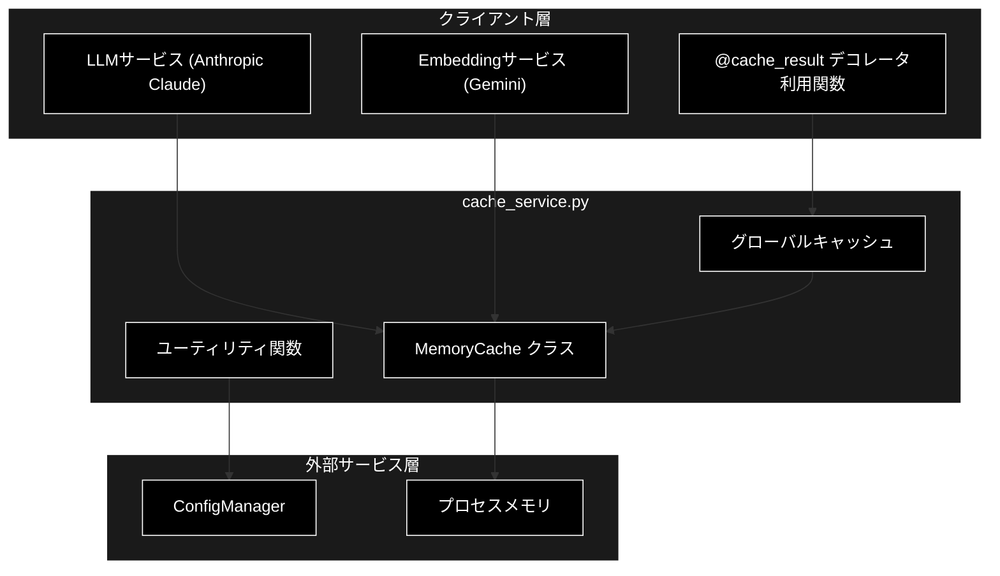
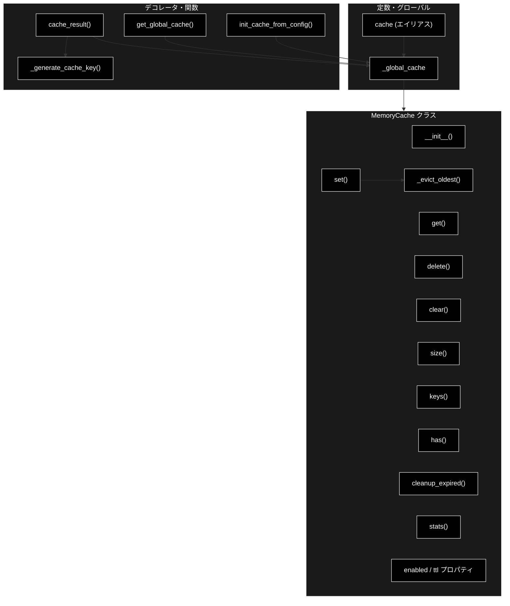
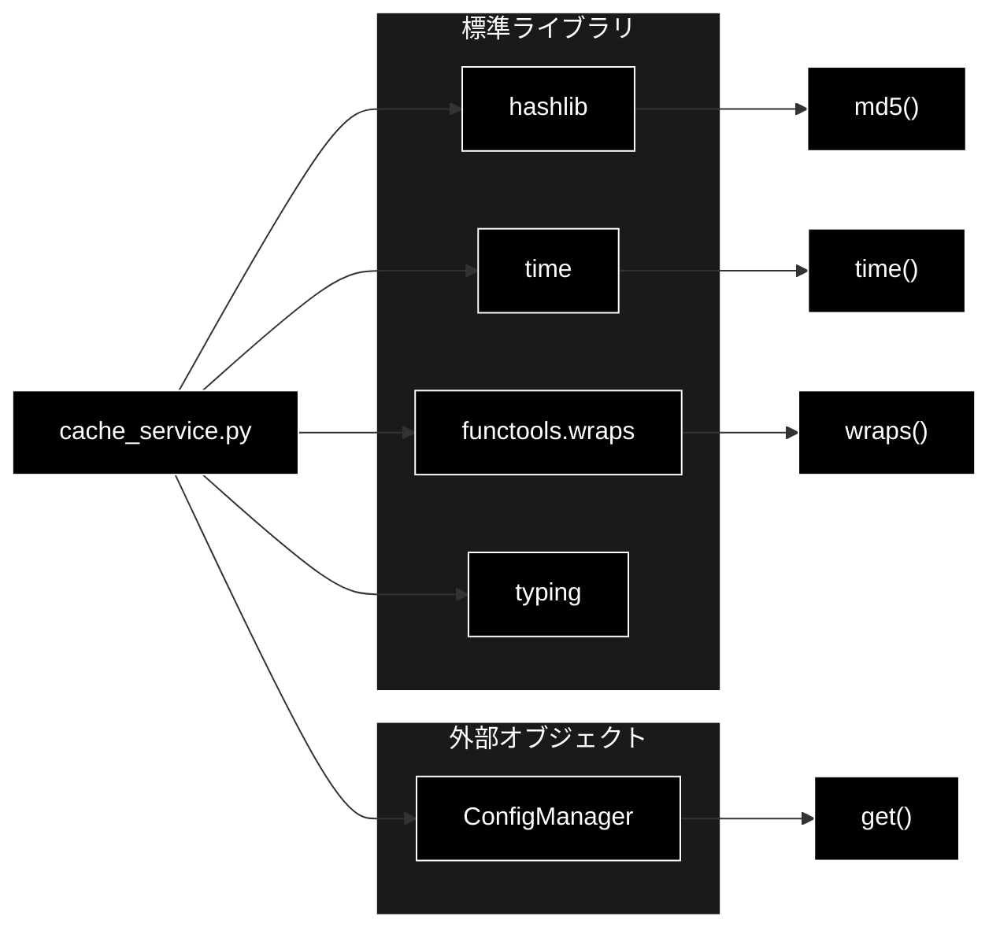

# cache_service.py - TTLベースメモリキャッシュサービス ドキュメント

**Version 1.0** | 最終更新: 2026-06-17

---

## 目次

1. [概要](#概要)
2. [アーキテクチャ構成図](#1-アーキテクチャ構成図)
3. [モジュール構成図](#2-モジュール構成図)
4. [クラス・関数一覧表](#3-クラス関数一覧表)
5. [クラス・関数 IPO詳細](#4-クラス関数-ipo詳細)
6. [設定・定数](#5-設定定数)
7. [使用例](#6-使用例)
8. [エクスポート](#7-エクスポート)
9. [変更履歴](#8-変更履歴)
10. [付録: 依存関係図](#付録-依存関係図)

---

## 概要

`cache_service.py`は、TTL（Time To Live）ベースのインメモリキャッシュを提供するサービスモジュールです。`helper_api.py::MemoryCache` から統合され、LLM（Anthropic Claude）応答や Embedding（Gemini `gemini-embedding-001`、3072次元）の計算結果など、コストの高い処理結果を一時保存して再利用するために使用されます。有効期限付きの値保存・取得、最大サイズ制限による自動退避、関数結果キャッシュ用デコレータ、グローバル共有インスタンスを備えます。

### 主な責務

- TTL付きキャッシュエントリの保存・取得・削除
- 最大サイズ超過時の最古エントリ自動退避
- 期限切れエントリの一括クリーンアップ
- 関数結果を透過的にキャッシュするデコレータの提供
- プロセス全体で共有するグローバルキャッシュの管理
- 設定値からのキャッシュパラメータ初期化

### 各責務対応のモジュール

| # | 責務 | 対応モジュール | 説明 |
|---|------|--------------|------|
| 1 | TTL付きエントリの保存・取得・削除 | `cache_service.py` | `MemoryCache` の `get`/`set`/`delete` で実現 |
| 2 | 最大サイズ超過時の自動退避 | `cache_service.py` | `MemoryCache._evict_oldest` で最古エントリを削除 |
| 3 | 期限切れエントリの一括クリーンアップ | `cache_service.py` | `MemoryCache.cleanup_expired` でまとめて削除 |
| 4 | 関数結果のキャッシュデコレータ | `cache_service.py` | `cache_result` がキー生成と保存を仲介 |
| 5 | グローバルキャッシュの管理 | `cache_service.py` | `_global_cache`・`get_global_cache` で共有 |
| 6 | 設定値からの初期化 | `cache_service.py` | `init_cache_from_config` が ConfigManager から反映 |

### 主要機能一覧

| 機能 | 説明 |
|------|------|
| `MemoryCache` | TTL・最大サイズ対応のメモリキャッシュクラス |
| `MemoryCache.__init__()` | 有効フラグ・TTL・最大サイズを指定して初期化 |
| `MemoryCache.get()` | キャッシュから値を取得（期限切れはNone） |
| `MemoryCache.set()` | キャッシュに値を設定（サイズ超過時は退避） |
| `MemoryCache.delete()` | 指定キーのエントリを削除 |
| `MemoryCache.clear()` | 全エントリをクリア |
| `MemoryCache.size()` | 現在のエントリ数を取得 |
| `MemoryCache.keys()` | 全キャッシュキーを取得 |
| `MemoryCache.has()` | キーの有効な存在を判定 |
| `MemoryCache.cleanup_expired()` | 期限切れエントリを一括削除 |
| `MemoryCache.stats()` | キャッシュ統計情報を取得 |
| `MemoryCache.enabled` | 有効/無効状態のプロパティ |
| `MemoryCache.ttl` | TTL値のプロパティ |
| `MemoryCache._evict_oldest()` | 最古エントリを退避（内部） |
| `cache_result()` | 関数結果をキャッシュするデコレータ |
| `_generate_cache_key()` | 関数名・引数からキャッシュキーを生成（内部） |
| `get_global_cache()` | グローバルキャッシュを取得 |
| `init_cache_from_config()` | 設定からグローバルキャッシュを初期化 |

---

## 1. アーキテクチャ構成図

### 1.1 システム全体構成



### 1.2 データフロー

1. クライアント層が `MemoryCache` または `@cache_result` 経由でキャッシュにアクセス
2. キーをハッシュ化して保存/参照を行う
3. TTL内であれば保存値を返却、期限切れ/未登録なら本処理を実行して保存
4. 最大サイズ超過時は最古エントリを自動退避
5. 設定値は `init_cache_from_config` で外部 ConfigManager から反映

---

## 2. モジュール構成図

### 2.1 内部モジュール構成



### 2.2 外部依存関係

| ライブラリ | バージョン | 用途 |
|-----------|-----------|------|
| `hashlib` | 標準ライブラリ | キャッシュキーのMD5ハッシュ生成 |
| `time` | 標準ライブラリ | TTL判定用のタイムスタンプ取得 |
| `functools` | 標準ライブラリ | `wraps` でデコレータのメタ情報保持 |
| `typing` | 標準ライブラリ | 型ヒント（Any/Dict/Optional） |

### 2.3 内部依存モジュール

| モジュール | 用途 |
|-----------|------|
| （なし） | 循環インポート回避のため内部モジュールへ直接依存しない（`init_cache_from_config` は ConfigManager をダックタイピングで受け取る） |

---

## 3. クラス・関数一覧表

### 3.1 クラス一覧

#### MemoryCache

| メソッド | 概要 |
|---------|------|
| `__init__(enabled, ttl, max_size)` | キャッシュ設定を指定して初期化 |
| `get(key)` | 値を取得（期限切れ/未登録はNone） |
| `set(key, value)` | 値を設定（サイズ超過時は退避） |
| `delete(key)` | 指定キーを削除 |
| `clear()` | 全エントリをクリア |
| `size()` | 現在のエントリ数を返す |
| `keys()` | 全キーをリストで返す |
| `has(key)` | 有効なキーが存在するか判定 |
| `cleanup_expired()` | 期限切れエントリを一括削除 |
| `stats()` | 統計情報を辞書で返す |
| `_evict_oldest()` | 最古エントリを削除（内部） |
| `enabled` | 有効/無効状態のプロパティ |
| `ttl` | TTL値のプロパティ |

### 3.2 関数一覧（カテゴリ別）

#### デコレータ

| 関数名 | 概要 |
|-------|------|
| `cache_result(cache, ttl)` | 関数結果をキャッシュするデコレータ |

#### ユーティリティ

| 関数名 | 概要 |
|-------|------|
| `_generate_cache_key(func_name, args, kwargs)` | キャッシュキーを生成（内部） |
| `get_global_cache()` | グローバルキャッシュを取得 |
| `init_cache_from_config(config)` | 設定からグローバルキャッシュを初期化 |

---

## 4. クラス・関数 IPO詳細

### 4.1 MemoryCache クラス

TTLと最大サイズに対応したインメモリキャッシュ。古いエントリは自動的に退避され、期限切れエントリは取得時または一括クリーンアップで削除されます。

#### コンストラクタ: `__init__`

**概要**: 有効フラグ・TTL・最大サイズを指定してキャッシュを初期化する。

```python
def __init__(self, enabled: bool = True, ttl: int = 3600, max_size: int = 100)
```

| パラメータ | 型 | デフォルト | 説明 |
|------------|------|-----------|------|
| `enabled` | bool | True | キャッシュ有効フラグ |
| `ttl` | int | 3600 | キャッシュの有効期限（秒） |
| `max_size` | int | 100 | 最大エントリ数 |

| 項目 | 内容 |
|------|------|
| **Input** | `enabled: bool = True`, `ttl: int = 3600`, `max_size: int = 100` |
| **Process** | 1. 内部ストレージ辞書を初期化<br>2. enabled/ttl/max_size を属性に保存 |
| **Output** | `MemoryCache` インスタンス |

**戻り値例**:
```python
<MemoryCache object: enabled=True, ttl=3600, max_size=100>
```

```python
# 使用例
from services.cache_service import MemoryCache

cache = MemoryCache(enabled=True, ttl=600, max_size=50)
print(cache.size())
# 0
```

#### メソッド: `get`

**概要**: キャッシュから値を取得する。未登録または期限切れの場合は None を返す。

```python
def get(self, key: str) -> Optional[Any]
```

| パラメータ | 型 | デフォルト | 説明 |
|------------|------|-----------|------|
| `key` | str | - | キャッシュキー |

| 項目 | 内容 |
|------|------|
| **Input** | `key: str` |
| **Process** | 1. 無効または未登録ならNoneを返す<br>2. タイムスタンプとTTLを比較し期限切れなら削除してNone<br>3. 有効なら保存値を返す |
| **Output** | `Optional[Any]`: 保存値、または None |

**戻り値例**:
```python
{"answer": "Anthropic Claude による応答テキスト"}
```

```python
# 使用例
cache.set("q1", {"answer": "応答"})
result = cache.get("q1")
print(result)
# {"answer": "応答"}
```

#### メソッド: `set`

**概要**: キャッシュに値を設定する。最大サイズを超えた場合は最古エントリを退避する。

```python
def set(self, key: str, value: Any) -> None
```

| パラメータ | 型 | デフォルト | 説明 |
|------------|------|-----------|------|
| `key` | str | - | キャッシュキー |
| `value` | Any | - | キャッシュする値 |

| 項目 | 内容 |
|------|------|
| **Input** | `key: str`, `value: Any` |
| **Process** | 1. 無効なら何もしない<br>2. 値とタイムスタンプを保存<br>3. サイズ超過時は `_evict_oldest()` を呼ぶ |
| **Output** | `None` |

**戻り値例**:
```python
None
```

```python
# 使用例
cache.set("emb_key", [0.12, 0.34, 0.56])  # Gemini Embedding 結果など
print(cache.size())
# 1
```

#### メソッド: `delete`

**概要**: 指定キーのエントリを削除する。

```python
def delete(self, key: str) -> bool
```

| パラメータ | 型 | デフォルト | 説明 |
|------------|------|-----------|------|
| `key` | str | - | キャッシュキー |

| 項目 | 内容 |
|------|------|
| **Input** | `key: str` |
| **Process** | 1. キーが存在すれば削除してTrue<br>2. 存在しなければFalse |
| **Output** | `bool`: 削除成功時True |

**戻り値例**:
```python
True
```

```python
# 使用例
cache.set("k", 1)
print(cache.delete("k"))   # True
print(cache.delete("none"))  # False
```

#### メソッド: `clear`

**概要**: 全エントリをクリアする。

```python
def clear(self) -> None
```

| 項目 | 内容 |
|------|------|
| **Input** | なし（selfのみ） |
| **Process** | 内部ストレージ辞書を空にする |
| **Output** | `None` |

**戻り値例**:
```python
None
```

```python
# 使用例
cache.clear()
print(cache.size())
# 0
```

#### メソッド: `size`

**概要**: 現在のエントリ数を返す。

```python
def size(self) -> int
```

| 項目 | 内容 |
|------|------|
| **Input** | なし（selfのみ） |
| **Process** | 内部ストレージの要素数を返す |
| **Output** | `int`: エントリ数 |

**戻り値例**:
```python
3
```

```python
# 使用例
print(cache.size())
# 3
```

#### メソッド: `keys`

**概要**: 全キャッシュキーをリストで返す。

```python
def keys(self) -> list
```

| 項目 | 内容 |
|------|------|
| **Input** | なし（selfのみ） |
| **Process** | 内部ストレージのキー一覧をリスト化して返す |
| **Output** | `list`: キーのリスト |

**戻り値例**:
```python
["q1", "q2", "emb_key"]
```

```python
# 使用例
print(cache.keys())
# ["q1", "q2", "emb_key"]
```

#### メソッド: `has`

**概要**: 有効期限を考慮してキーが存在するか判定する。

```python
def has(self, key: str) -> bool
```

| パラメータ | 型 | デフォルト | 説明 |
|------------|------|-----------|------|
| `key` | str | - | キャッシュキー |

| 項目 | 内容 |
|------|------|
| **Input** | `key: str` |
| **Process** | `get(key)` を呼び、結果が None でないかを判定 |
| **Output** | `bool`: 有効なキーが存在すればTrue |

**戻り値例**:
```python
True
```

```python
# 使用例
cache.set("k", 1)
print(cache.has("k"))
# True
```

#### メソッド: `cleanup_expired`

**概要**: 期限切れエントリを一括削除し、削除件数を返す。

```python
def cleanup_expired(self) -> int
```

| 項目 | 内容 |
|------|------|
| **Input** | なし（selfのみ） |
| **Process** | 1. 現在時刻を取得<br>2. TTLを超えたキーを抽出<br>3. 抽出したキーを削除して件数を返す |
| **Output** | `int`: 削除した件数 |

**戻り値例**:
```python
2
```

```python
# 使用例
removed = cache.cleanup_expired()
print(f"削除: {removed}件")
# 削除: 2件
```

#### メソッド: `stats`

**概要**: キャッシュの統計情報を辞書で返す。

```python
def stats(self) -> Dict[str, Any]
```

| 項目 | 内容 |
|------|------|
| **Input** | なし（selfのみ） |
| **Process** | enabled/size/max_size/ttl をまとめた辞書を返す |
| **Output** | `Dict[str, Any]`: `{enabled, size, max_size, ttl}` |

**戻り値例**:
```python
{
    "enabled": True,
    "size": 3,
    "max_size": 100,
    "ttl": 3600
}
```

```python
# 使用例
print(cache.stats())
# {"enabled": True, "size": 3, "max_size": 100, "ttl": 3600}
```

#### メソッド: `_evict_oldest`（内部）

**概要**: 最もタイムスタンプが古いエントリを1件削除する。`set` でサイズ超過時に呼ばれる。

```python
def _evict_oldest(self) -> None
```

| 項目 | 内容 |
|------|------|
| **Input** | なし（selfのみ） |
| **Process** | 1. ストレージが空なら何もしない<br>2. timestamp が最小のキーを特定<br>3. そのキーを削除 |
| **Output** | `None` |

**戻り値例**:
```python
None
```

```python
# 使用例（内部呼び出し）
# max_size 超過時に set() 内部から自動的に実行される
cache._evict_oldest()
```

#### プロパティ: `enabled`

**概要**: キャッシュの有効/無効状態を取得・設定する。

```python
@property
def enabled(self) -> bool

@enabled.setter
def enabled(self, value: bool) -> None
```

| パラメータ | 型 | デフォルト | 説明 |
|------------|------|-----------|------|
| `value` | bool | - | （setter）有効/無効の設定値 |

| 項目 | 内容 |
|------|------|
| **Input** | （getter）なし / （setter）`value: bool` |
| **Process** | 内部フラグ `_enabled` の取得/設定 |
| **Output** | （getter）`bool`: 有効状態 / （setter）`None` |

**戻り値例**:
```python
True
```

```python
# 使用例
cache.enabled = False
print(cache.enabled)
# False
```

#### プロパティ: `ttl`

**概要**: 現在のTTL値（秒）を取得・設定する。

```python
@property
def ttl(self) -> int

@ttl.setter
def ttl(self, value: int) -> None
```

| パラメータ | 型 | デフォルト | 説明 |
|------------|------|-----------|------|
| `value` | int | - | （setter）TTL値（秒） |

| 項目 | 内容 |
|------|------|
| **Input** | （getter）なし / （setter）`value: int` |
| **Process** | 内部値 `_ttl` の取得/設定 |
| **Output** | （getter）`int`: TTL値 / （setter）`None` |

**戻り値例**:
```python
3600
```

```python
# 使用例
cache.ttl = 600
print(cache.ttl)
# 600
```

### 4.2 デコレータ関数

#### `cache_result`

**概要**: 関数の戻り値をキャッシュするデコレータ。関数名と引数からキーを生成し、ヒット時は関数を実行せず保存値を返す。

```python
def cache_result(cache: MemoryCache = None, ttl: int = None)
```

| パラメータ | 型 | デフォルト | 説明 |
|------------|------|-----------|------|
| `cache` | MemoryCache | None | 使用するキャッシュ（省略時はグローバルキャッシュ） |
| `ttl` | int | None | このデコレータ用TTL（未使用、将来拡張用） |

| 項目 | 内容 |
|------|------|
| **Input** | `cache: MemoryCache = None`, `ttl: int = None` |
| **Process** | 1. 対象キャッシュを決定（指定なしはグローバル）<br>2. 無効なら関数をそのまま実行<br>3. キーを生成しキャッシュを参照<br>4. ヒット時は保存値を返却<br>5. ミス時は関数実行・結果保存して返却 |
| **Output** | デコレートされた関数（呼び出し時に元の戻り値型） |

**戻り値例**:
```python
# expensive_function(2, 3) の戻り値がキャッシュされる
5
```

```python
# 使用例
from services.cache_service import cache_result

@cache_result()
def expensive_function(arg1, arg2):
    return arg1 + arg2

print(expensive_function(2, 3))  # 関数実行
print(expensive_function(2, 3))  # キャッシュヒット
# 5
# 5
```

### 4.3 ユーティリティ関数

#### `_generate_cache_key`（内部）

**概要**: 関数名・位置引数・キーワード引数からMD5ハッシュのキャッシュキーを生成する。

```python
def _generate_cache_key(func_name: str, args: tuple, kwargs: dict) -> str
```

| パラメータ | 型 | デフォルト | 説明 |
|------------|------|-----------|------|
| `func_name` | str | - | 関数名 |
| `args` | tuple | - | 位置引数 |
| `kwargs` | dict | - | キーワード引数 |

| 項目 | 内容 |
|------|------|
| **Input** | `func_name: str`, `args: tuple`, `kwargs: dict` |
| **Process** | 1. 関数名・引数・ソート済みkwargsを文字列連結<br>2. MD5でハッシュ化して16進文字列を返す |
| **Output** | `str`: MD5ハッシュ文字列 |

**戻り値例**:
```python
"a8f5f167f44f4964e6c998dee827110c"
```

```python
# 使用例（内部）
key = _generate_cache_key("f", (1, 2), {"x": 3})
print(key)
# "..."（32文字の16進文字列）
```

#### `get_global_cache`

**概要**: プロセス共有のグローバルキャッシュインスタンスを取得する。

```python
def get_global_cache() -> MemoryCache
```

| 項目 | 内容 |
|------|------|
| **Input** | なし |
| **Process** | モジュールレベルの `_global_cache` を返す |
| **Output** | `MemoryCache`: グローバルキャッシュ |

**戻り値例**:
```python
<MemoryCache object: enabled=True, ttl=3600, max_size=100>
```

```python
# 使用例
from services.cache_service import get_global_cache

gc = get_global_cache()
gc.set("shared", "value")
print(gc.get("shared"))
# "value"
```

#### `init_cache_from_config`

**概要**: ConfigManager の設定値からグローバルキャッシュの有効フラグ・TTL・最大サイズを初期化する。

```python
def init_cache_from_config(config) -> None
```

| パラメータ | 型 | デフォルト | 説明 |
|------------|------|-----------|------|
| `config` | ConfigManager | - | `get(key, default)` を持つ設定オブジェクト |

| 項目 | 内容 |
|------|------|
| **Input** | `config: ConfigManager` |
| **Process** | 1. `cache.enabled` を反映<br>2. `cache.ttl` を反映<br>3. `cache.max_size` を反映 |
| **Output** | `None` |

**戻り値例**:
```python
None
```

```python
# 使用例
from services.cache_service import init_cache_from_config, get_global_cache

init_cache_from_config(config_manager)
print(get_global_cache().stats())
# {"enabled": True, "size": 0, "max_size": 100, "ttl": 3600}
```

---

## 5. 設定・定数

### 5.1 グローバルキャッシュ `_global_cache`

循環インポートを回避するため、デフォルト値で初期化されるモジュールレベルの共有インスタンスです。`init_cache_from_config()` で後から設定値を反映できます。

```python
_global_cache = MemoryCache(
    enabled=True,
    ttl=3600,
    max_size=100
)
```

| パラメータ | デフォルト値 | 説明 |
|-----|-------------|------|
| `enabled` | True | キャッシュ有効フラグ |
| `ttl` | 3600 | 有効期限（秒） |
| `max_size` | 100 | 最大エントリ数 |

### 5.2 エイリアス `cache`

後方互換性のため、`_global_cache` を指すモジュールレベルエイリアス `cache` が定義されています。

```python
cache = _global_cache
```

---

## 6. 使用例

### 6.1 基本的なワークフロー

```python
from services.cache_service import MemoryCache

# 1. キャッシュ初期化
cache = MemoryCache(enabled=True, ttl=600, max_size=50)

# 2. 値の保存（例: Anthropic Claude 応答）
cache.set("query:天気", {"answer": "晴れです"})

# 3. 値の取得
result = cache.get("query:天気")
print(result)  # {"answer": "晴れです"}

# 4. 統計確認
print(cache.stats())
# {"enabled": True, "size": 1, "max_size": 50, "ttl": 600}
```

### 6.2 応用的なワークフロー（デコレータ + グローバルキャッシュ）

```python
from services.cache_service import (
    cache_result,
    get_global_cache,
    init_cache_from_config,
)

# 設定からグローバルキャッシュを初期化
init_cache_from_config(config_manager)

# コストの高い処理（例: Gemini Embedding 計算）をキャッシュ
@cache_result()
def embed_text(text: str):
    return call_gemini_embedding(text)  # gemini-embedding-001 (3072次元)

vec1 = embed_text("こんにちは")  # 実行
vec2 = embed_text("こんにちは")  # キャッシュヒット

# 期限切れエントリの定期クリーンアップ
removed = get_global_cache().cleanup_expired()
print(f"クリーンアップ: {removed}件")
```

---

## 7. エクスポート

`__all__` は以下のとおり定義されています：

```python
__all__ = [
    # クラス
    "MemoryCache",
    # デコレータ
    "cache_result",
    # グローバルインスタンス
    "cache",
    # ユーティリティ
    "get_global_cache",
    "init_cache_from_config",
]
```

> 📝 **注意**: `_generate_cache_key` と `_global_cache` は内部用途のため `__all__` には含まれていません。

---

## 8. 変更履歴

| バージョン | 変更内容 |
|-----------|---------|
| 1.0 | 初版作成（2026-06-17） |

---

## 付録: 依存関係図


