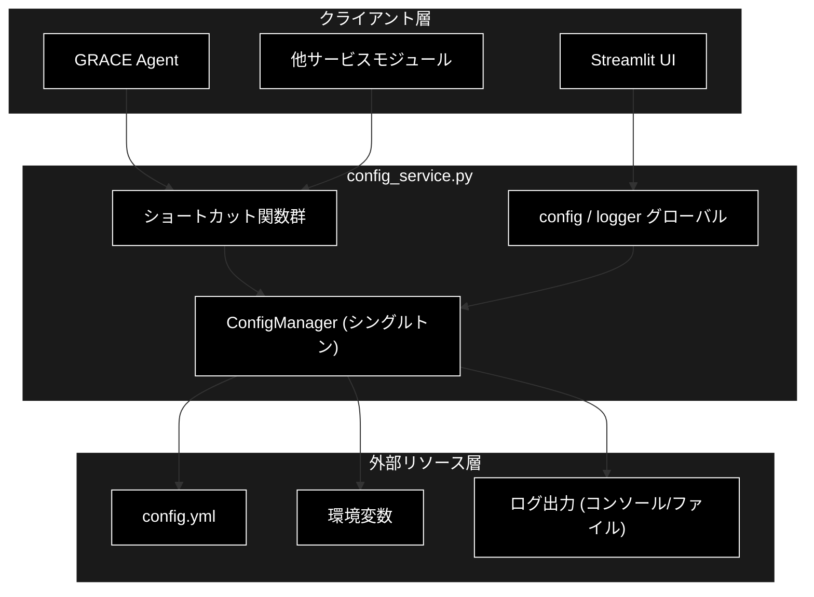
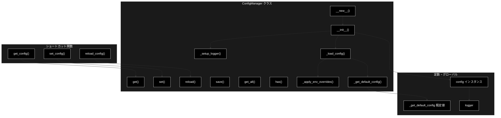
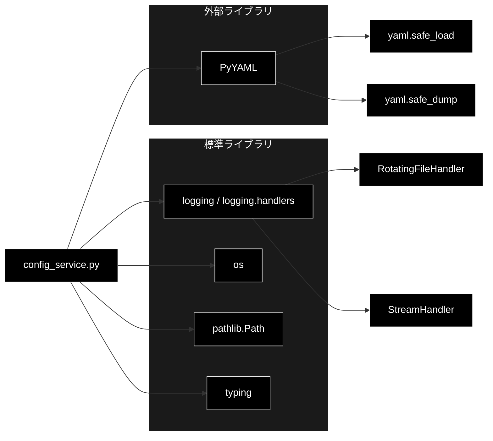

# config_service.py - 設定管理サービス ドキュメント

**Version 1.0** | 最終更新: 2026-06-17

---

## 目次

1. [概要](#概要)
2. [アーキテクチャ構成図](#1-アーキテクチャ構成図)
3. [モジュール構成図](#2-モジュール構成図)
4. [クラス・関数一覧表](#3-クラス関数一覧表)
5. [クラス・関数 IPO詳細](#4-クラス関数-ipo詳細)
6. [設定・定数](#5-設定定数)
7. [使用例](#6-使用例)
8. [エクスポート](#7-エクスポート)
9. [変更履歴](#8-変更履歴)
10. [付録: 依存関係図](#付録-依存関係図)

---

## 概要

`config_service.py`は、YAMLベースのアプリケーション設定を一元管理するサービスモジュールです。設定ファイルの読み込み、環境変数によるオーバーライド、ドット区切りキーによるキャッシュ付き設定値取得、およびロガーの初期化を担います。`ConfigManager`はシングルトンとして実装され、アプリケーション全体で単一の設定状態を共有します。

統合元: `helper_api.py::ConfigManager`

### 主な責務

- YAML設定ファイル（`config.yml`）の読み込みとフォールバック（デフォルト設定）の提供
- 環境変数（`GOOGLE_API_KEY` / `LOG_LEVEL` / `DEBUG_MODE` / `LLM_PROVIDER`）による設定オーバーライド
- ドット区切りキーによるキャッシュ付き設定値の取得・更新
- ロガー（`Gemini_helper`）の初期化とコンソール／ファイルハンドラーの設定
- 設定のファイル保存・再読み込み・全件取得などの管理操作

### 各責務対応のモジュール

| # | 責務 | 対応モジュール | 説明 |
|---|------|--------------|------|
| 1 | YAML設定の読み込みとフォールバック | `config_service.py` | `_load_config()` / `_get_default_config()` |
| 2 | 環境変数によるオーバーライド | `config_service.py` | `_apply_env_overrides()` |
| 3 | 設定値の取得・更新 | `config_service.py` | `ConfigManager.get()` / `ConfigManager.set()` |
| 4 | ロガーの初期化 | `config_service.py` | `_setup_logger()` |
| 5 | 設定の保存・再読み込み・全件取得 | `config_service.py` | `save()` / `reload()` / `get_all()` / `has()` |

### 主要機能一覧

| 機能 | 説明 |
|------|------|
| `ConfigManager` | 設定ファイルを管理するシングルトンクラス |
| `ConfigManager.__init__()` | コンストラクタ（設定ファイルパス指定・初回のみ初期化） |
| `ConfigManager.__new__()` | シングルトンインスタンス生成 |
| `ConfigManager.get()` | ドット区切りキーで設定値を取得（キャッシュ付き） |
| `ConfigManager.set()` | 設定値を更新 |
| `ConfigManager.reload()` | 設定を再読み込み |
| `ConfigManager.save()` | 設定をYAMLファイルへ保存 |
| `ConfigManager.get_all()` | 全設定をコピーで取得 |
| `ConfigManager.has()` | キーの存在確認 |
| `ConfigManager._setup_logger()` | ロガーの初期化（プライベート） |
| `ConfigManager._load_config()` | 設定ファイルの読み込み（プライベート） |
| `ConfigManager._apply_env_overrides()` | 環境変数オーバーライドの適用（プライベート） |
| `ConfigManager._get_default_config()` | デフォルト設定辞書の生成（プライベート） |
| `get_config()` | 設定値取得のショートカット関数 |
| `set_config()` | 設定値更新のショートカット関数 |
| `reload_config()` | 設定再読み込みのショートカット関数 |

---

## 1. アーキテクチャ構成図

### 1.1 システム全体構成



### 1.2 データフロー

1. クライアント層が `get_config()` / `config.get()` などで設定値を要求する
2. `ConfigManager`はキャッシュを確認し、なければ内部設定辞書をドット区切りキーで探索する
3. 初回生成時、`config.yml`を読み込み（存在しなければデフォルト設定を採用）、環境変数で上書きする
4. ロガーはコンソール／ファイルハンドラーへログを出力する
5. 取得した設定値をキャッシュに保存し、クライアントへ返却する

---

## 2. モジュール構成図

### 2.1 内部モジュール構成



### 2.2 外部依存関係

| ライブラリ | バージョン | 用途 |
|-----------|-----------|------|
| `PyYAML` | 6.x | YAML設定ファイルの読み書き（`yaml.safe_load` / `yaml.safe_dump`） |

### 2.3 標準ライブラリ依存

| モジュール | 用途 |
|-----------|------|
| `logging` / `logging.handlers` | ロガー設定、ローテーションファイルハンドラー |
| `os` | 環境変数の取得 |
| `pathlib.Path` | 設定ファイルパスの操作 |
| `typing` | 型ヒント（`Any` / `Dict`） |

---

## 3. クラス・関数一覧表

### 3.1 クラス一覧

#### ConfigManager

| メソッド | 概要 |
|---------|------|
| `__new__(config_path="config.yml")` | シングルトンインスタンスを生成 |
| `__init__(config_path="config.yml")` | 初回のみ設定読み込みとロガー初期化を実行 |
| `get(key, default=None)` | ドット区切りキーで設定値を取得（キャッシュ付き） |
| `set(key, value)` | 設定値を更新しキャッシュを破棄 |
| `reload()` | 設定を再読み込みしキャッシュをクリア |
| `save(filepath=None)` | 設定をYAMLファイルへ保存 |
| `get_all()` | 全設定辞書のコピーを取得 |
| `has(key)` | キーの存在を確認 |
| `_setup_logger()` | ロガー（`Gemini_helper`）を初期化 |
| `_load_config()` | 設定ファイルを読み込み |
| `_apply_env_overrides(config)` | 環境変数で設定をオーバーライド |
| `_get_default_config()` | デフォルト設定辞書を生成 |

### 3.2 関数一覧（カテゴリ別）

#### ショートカット関数

| 関数名 | 概要 |
|-------|------|
| `get_config(key, default=None)` | グローバル`config`から設定値を取得 |
| `set_config(key, value)` | グローバル`config`の設定値を更新 |
| `reload_config()` | グローバル`config`を再読み込み |

---

## 4. クラス・関数 IPO詳細

### 4.1 ConfigManager クラス

設定ファイルを管理するシングルトンクラス。YAML読み込み、環境変数オーバーライド、キャッシュ付き設定取得、ロガー設定を提供する。

#### メソッド: `__new__`

**概要**: シングルトンパターンでインスタンスを1つだけ生成する。

```python
def __new__(cls, config_path: str = "config.yml")
```

| パラメータ | 型 | デフォルト | 説明 |
|------------|------|-----------|------|
| `config_path` | str | "config.yml" | 設定ファイルパス（生成時は未使用） |

| 項目 | 内容 |
|------|------|
| **Input** | `config_path: str = "config.yml"` |
| **Process** | 1. クラス変数 `_instance` が None か確認<br>2. None なら新規インスタンスを生成して保持<br>3. 既存インスタンスを返却 |
| **Output** | `ConfigManager`: 単一のシングルトンインスタンス |

**戻り値例**:
```python
<config_service.ConfigManager object at 0x10a2b3c40>
```

```python
# 使用例
m1 = ConfigManager("config.yml")
m2 = ConfigManager("config.yml")
print(m1 is m2)
# True（同一インスタンス）
```

#### コンストラクタ: `__init__`

**概要**: 初回呼び出し時のみ設定ファイル読み込み・キャッシュ初期化・ロガー設定を行う。

```python
def __init__(self, config_path: str = "config.yml")
```

| パラメータ | 型 | デフォルト | 説明 |
|------------|------|-----------|------|
| `config_path` | str | "config.yml" | 設定ファイルのパス |

| 項目 | 内容 |
|------|------|
| **Input** | `config_path: str = "config.yml"` |
| **Process** | 1. `_initialized` 属性があれば即return（再初期化防止）<br>2. `config_path` を `Path` に変換<br>3. `_load_config()` で設定を読み込み<br>4. キャッシュ辞書を初期化<br>5. `_setup_logger()` でロガーを設定 |
| **Output** | `None`（インスタンスを初期化） |

**戻り値例**:
```python
None
```

```python
# 使用例
config = ConfigManager("config.yml")
print(config.config_path)
# config.yml
```

#### メソッド: `get`

**概要**: ドット区切りキーで設定値を取得する。取得結果はキャッシュされる。

```python
def get(self, key: str, default: Any = None) -> Any
```

| パラメータ | 型 | デフォルト | 説明 |
|------------|------|-----------|------|
| `key` | str | - | ドット区切りキー（例: `"api.timeout"`） |
| `default` | Any | None | 値が無い場合に返すデフォルト値 |

| 項目 | 内容 |
|------|------|
| **Input** | `key: str`, `default: Any = None` |
| **Process** | 1. キャッシュに `key` があれば返却<br>2. `key` を `.` で分割し設定辞書を順に探索<br>3. 途中で辞書でなくなれば `default` を採用<br>4. 結果をキャッシュへ保存して返却 |
| **Output** | `Any`: 設定値（無ければ `default`） |

**戻り値例**:
```python
30
```

```python
# 使用例
timeout = config.get("api.timeout", 10)
print(timeout)
# 30
```

#### メソッド: `set`

**概要**: ドット区切りキーで設定値を更新し、該当キーのキャッシュを破棄する。

```python
def set(self, key: str, value: Any) -> None
```

| パラメータ | 型 | デフォルト | 説明 |
|------------|------|-----------|------|
| `key` | str | - | ドット区切りキー |
| `value` | Any | - | 設定する値 |

| 項目 | 内容 |
|------|------|
| **Input** | `key: str`, `value: Any` |
| **Process** | 1. `key` を `.` で分割<br>2. 末尾以外のキーで辞書を `setdefault` しながら降りる<br>3. 末尾キーに `value` を代入<br>4. 該当キーのキャッシュを削除 |
| **Output** | `None`（設定を更新） |

**戻り値例**:
```python
None
```

```python
# 使用例
config.set("api.timeout", 60)
print(config.get("api.timeout"))
# 60
```

#### メソッド: `reload`

**概要**: 設定ファイルを再読み込みし、キャッシュを全クリアする。

```python
def reload(self) -> None
```

| 項目 | 内容 |
|------|------|
| **Input** | なし（selfのみ） |
| **Process** | 1. `_load_config()` で設定辞書を再構築<br>2. キャッシュ辞書をクリア |
| **Output** | `None`（設定を再読み込み） |

**戻り値例**:
```python
None
```

```python
# 使用例
config.reload()
print(config.get("models.default"))
# claude-sonnet-4-6
```

#### メソッド: `save`

**概要**: 現在の設定辞書をYAMLファイルへ保存する。

```python
def save(self, filepath: str = None) -> bool
```

| パラメータ | 型 | デフォルト | 説明 |
|------------|------|-----------|------|
| `filepath` | str | None | 保存先パス（省略時は元の `config_path`） |

| 項目 | 内容 |
|------|------|
| **Input** | `filepath: str = None` |
| **Process** | 1. `filepath` があれば `Path` 化、無ければ `config_path` を使用<br>2. UTF-8 で開き `yaml.safe_dump` で書き出し<br>3. 例外時はロガーにエラーを記録し `False` を返す |
| **Output** | `bool`: 成功時 `True`、失敗時 `False` |

**戻り値例**:
```python
True
```

```python
# 使用例
ok = config.save("config_backup.yml")
print(ok)
# True
```

#### メソッド: `get_all`

**概要**: 全設定辞書のシャローコピーを返す。

```python
def get_all(self) -> Dict[str, Any]
```

| 項目 | 内容 |
|------|------|
| **Input** | なし（selfのみ） |
| **Process** | 内部設定辞書 `_config` の `.copy()` を返却 |
| **Output** | `Dict[str, Any]`: 設定辞書のコピー |

**戻り値例**:
```python
{
    "models": {"default": "claude-sonnet-4-6", "available": [...]},
    "api": {"timeout": 30, "max_retries": 3},
    "llm": {"provider": "anthropic"}
}
```

```python
# 使用例
all_conf = config.get_all()
print(all_conf["llm"]["provider"])
# anthropic
```

#### メソッド: `has`

**概要**: 指定キーが存在するか（値が None でないか）を判定する。

```python
def has(self, key: str) -> bool
```

| パラメータ | 型 | デフォルト | 説明 |
|------------|------|-----------|------|
| `key` | str | - | ドット区切りキー |

| 項目 | 内容 |
|------|------|
| **Input** | `key: str` |
| **Process** | `get(key)` の結果が `None` でないかを判定 |
| **Output** | `bool`: 存在すれば `True` |

**戻り値例**:
```python
True
```

```python
# 使用例
print(config.has("api.timeout"))
# True
print(config.has("api.unknown"))
# False
```

#### メソッド: `_setup_logger`

**概要**: ロガー `Gemini_helper` をログ設定に従って初期化する（プライベート）。

```python
def _setup_logger(self) -> logging.Logger
```

| 項目 | 内容 |
|------|------|
| **Input** | なし（selfのみ） |
| **Process** | 1. `Gemini_helper` ロガーを取得<br>2. 既にハンドラーがあればそのまま返却<br>3. `logging` 設定からレベル・フォーマットを取得<br>4. コンソールハンドラーを追加<br>5. `file` 指定があればローテーションファイルハンドラーを追加 |
| **Output** | `logging.Logger`: 設定済みロガー |

**戻り値例**:
```python
<Logger Gemini_helper (INFO)>
```

```python
# 使用例
logger = config._setup_logger()
logger.info("初期化完了")
# 2026-06-17 ... - Gemini_helper - INFO - 初期化完了
```

#### メソッド: `_load_config`

**概要**: 設定ファイルを読み込み、環境変数オーバーライドを適用する（プライベート）。

```python
def _load_config(self) -> Dict[str, Any]
```

| 項目 | 内容 |
|------|------|
| **Input** | なし（selfのみ） |
| **Process** | 1. `config_path` が存在すれば `yaml.safe_load` で読み込み<br>2. `_apply_env_overrides()` で環境変数を適用<br>3. 読み込み失敗時はデフォルト設定を返す<br>4. ファイルが無ければデフォルト設定に環境変数を適用して返す |
| **Output** | `Dict[str, Any]`: 設定辞書 |

**戻り値例**:
```python
{
    "models": {"default": "claude-sonnet-4-6", ...},
    "llm": {"provider": "anthropic"}
}
```

```python
# 使用例
conf = config._load_config()
print(conf["models"]["default"])
# claude-sonnet-4-6
```

#### メソッド: `_apply_env_overrides`

**概要**: 環境変数の存在に応じて設定辞書を上書きする（プライベート）。

```python
def _apply_env_overrides(self, config: Dict[str, Any]) -> None
```

| パラメータ | 型 | デフォルト | 説明 |
|------------|------|-----------|------|
| `config` | Dict[str, Any] | - | 上書き対象の設定辞書 |

| 項目 | 内容 |
|------|------|
| **Input** | `config: Dict[str, Any]` |
| **Process** | 1. `GOOGLE_API_KEY` があれば `api.google_api_key` を設定<br>2. `LOG_LEVEL` があれば `logging.level` を設定<br>3. `DEBUG_MODE` があれば `experimental.debug_mode` を真偽値化して設定<br>4. `LLM_PROVIDER` があれば `llm.provider` を設定 |
| **Output** | `None`（`config` を破壊的に更新） |

**戻り値例**:
```python
None
```

```python
# 使用例
import os
os.environ["LLM_PROVIDER"] = "anthropic"
conf = {}
config._apply_env_overrides(conf)
print(conf["llm"]["provider"])
# anthropic
```

#### メソッド: `_get_default_config`

**概要**: 設定ファイルが無い／読み込み失敗時に使うデフォルト設定辞書を返す（プライベート）。

```python
def _get_default_config(self) -> Dict[str, Any]
```

| 項目 | 内容 |
|------|------|
| **Input** | なし（selfのみ） |
| **Process** | `models` / `api` / `ui` / `cache` / `logging` / `error_messages` / `experimental` / `llm` の各セクションを持つ辞書を生成 |
| **Output** | `Dict[str, Any]`: デフォルト設定辞書 |

**戻り値例**:
```python
{
    "models": {"default": "claude-sonnet-4-6", "available": ["claude-sonnet-4-6", "claude-haiku-4-5-20251001"]},
    "llm": {"provider": "anthropic"}
}
```

```python
# 使用例
defaults = config._get_default_config()
print(defaults["models"]["default"])
# claude-sonnet-4-6
```

### 4.2 ショートカット関数

#### `get_config`

**概要**: グローバル`config`インスタンスから設定値を取得するショートカット関数。

```python
def get_config(key: str, default: Any = None) -> Any
```

| パラメータ | 型 | デフォルト | 説明 |
|------------|------|-----------|------|
| `key` | str | - | ドット区切りキー |
| `default` | Any | None | デフォルト値 |

| 項目 | 内容 |
|------|------|
| **Input** | `key: str`, `default: Any = None` |
| **Process** | グローバル `config.get(key, default)` を呼び出し |
| **Output** | `Any`: 設定値 |

**戻り値例**:
```python
"anthropic"
```

```python
# 使用例
from services.config_service import get_config
provider = get_config("llm.provider", "anthropic")
print(provider)
# anthropic
```

#### `set_config`

**概要**: グローバル`config`インスタンスの設定値を更新するショートカット関数。

```python
def set_config(key: str, value: Any) -> None
```

| パラメータ | 型 | デフォルト | 説明 |
|------------|------|-----------|------|
| `key` | str | - | ドット区切りキー |
| `value` | Any | - | 設定する値 |

| 項目 | 内容 |
|------|------|
| **Input** | `key: str`, `value: Any` |
| **Process** | グローバル `config.set(key, value)` を呼び出し |
| **Output** | `None`（設定を更新） |

**戻り値例**:
```python
None
```

```python
# 使用例
from services.config_service import set_config, get_config
set_config("api.timeout", 90)
print(get_config("api.timeout"))
# 90
```

#### `reload_config`

**概要**: グローバル`config`インスタンスを再読み込みするショートカット関数。

```python
def reload_config() -> None
```

| 項目 | 内容 |
|------|------|
| **Input** | なし |
| **Process** | グローバル `config.reload()` を呼び出し |
| **Output** | `None`（設定を再読み込み） |

**戻り値例**:
```python
None
```

```python
# 使用例
from services.config_service import reload_config
reload_config()
```

---

## 5. 設定・定数

### 5.1 デフォルト設定辞書

`_get_default_config()`が返す設定辞書。`config.yml`が存在しない、または読み込みに失敗した場合に使用される。

```python
{
    "models": {
        "default": "claude-sonnet-4-6",
        "available": ["claude-sonnet-4-6", "claude-haiku-4-5-20251001"]
    },
    "api": {
        "timeout": 30,
        "max_retries": 3,
        "openai_api_key": None,
        "google_api_key": None
    },
    "ui": {
        "page_title": "RAG Q/A Generator",
        "page_icon": "🤖",
        "layout": "wide"
    },
    "cache": {
        "enabled": True,
        "ttl": 3600,
        "max_size": 100
    },
    "logging": {
        "level": "INFO",
        "format": "%(asctime)s - %(name)s - %(levelname)s - %(message)s",
        "file": None,
        "max_bytes": 10485760,
        "backup_count": 5
    },
    "error_messages": {
        "general_error": "エラーが発生しました",
        "api_key_missing": "APIキーが設定されていません",
        "network_error": "ネットワークエラーが発生しました"
    },
    "experimental": {
        "debug_mode": False,
        "performance_monitoring": True
    },
    "llm": {
        "provider": "anthropic"
    }
}
```

| キー | デフォルト値 | 説明 |
|-----|-------------|------|
| `models.default` | "claude-sonnet-4-6" | 既定のLLMモデル（Anthropic Claude） |
| `models.available` | ["claude-sonnet-4-6", "claude-haiku-4-5-20251001"] | 利用可能なモデル一覧 |
| `api.timeout` | 30 | APIタイムアウト（秒） |
| `api.max_retries` | 3 | 最大リトライ回数 |
| `api.openai_api_key` | None | OpenAI APIキー（既定では未設定） |
| `api.google_api_key` | None | Gemini Embedding 用APIキー（`GOOGLE_API_KEY` で上書き） |
| `ui.page_title` | "RAG Q/A Generator" | UIページタイトル |
| `ui.page_icon` | "🤖" | UIページアイコン |
| `ui.layout` | "wide" | UIレイアウト |
| `cache.enabled` | True | キャッシュ有効化フラグ |
| `cache.ttl` | 3600 | キャッシュ有効期間（秒） |
| `cache.max_size` | 100 | キャッシュ最大件数 |
| `logging.level` | "INFO" | ログレベル（`LOG_LEVEL` で上書き） |
| `logging.format` | "%(asctime)s - %(name)s - %(levelname)s - %(message)s" | ログフォーマット |
| `logging.file` | None | ログファイルパス（None でファイル出力なし） |
| `logging.max_bytes` | 10485760 | ログローテーションのサイズ上限（10MB） |
| `logging.backup_count` | 5 | ログバックアップ世代数 |
| `experimental.debug_mode` | False | デバッグモード（`DEBUG_MODE` で上書き） |
| `experimental.performance_monitoring` | True | パフォーマンス監視フラグ |
| `llm.provider` | "anthropic" | LLMプロバイダー（`LLM_PROVIDER` で上書き） |

### 5.2 環境変数オーバーライド

| 環境変数 | オーバーライド先キー | 説明 |
|---------|-------------------|------|
| `GOOGLE_API_KEY` | `api.google_api_key` | Gemini Embedding 用APIキー |
| `LOG_LEVEL` | `logging.level` | ログレベル |
| `DEBUG_MODE` | `experimental.debug_mode` | デバッグモード（`"true"` で有効） |
| `LLM_PROVIDER` | `llm.provider` | LLMプロバイダー |

### 5.3 グローバルインスタンス

| 名前 | 型 | 説明 |
|------|------|------|
| `config` | ConfigManager | `ConfigManager("config.yml")` のシングルトン |
| `logger` | logging.Logger | `config.logger`（`Gemini_helper` ロガー） |

> 📝 **注意**: LLMはAnthropic Claude（既定 `claude-sonnet-4-6`、鍵 `ANTHROPIC_API_KEY`）、EmbeddingはGemini（`gemini-embedding-001`、鍵 `GOOGLE_API_KEY`）を用います。

---

## 6. 使用例

### 6.1 基本的なワークフロー

```python
from services.config_service import (
    config,
    logger,
    get_config,
    set_config,
    reload_config,
)

# 1. 設定値の取得
default_model = get_config("models.default")
logger.info(f"既定モデル: {default_model}")
# 既定モデル: claude-sonnet-4-6

# 2. 設定値の更新
set_config("api.timeout", 60)
print(get_config("api.timeout"))
# 60

# 3. 全設定の取得
all_conf = config.get_all()
print(all_conf["llm"]["provider"])
# anthropic

# 4. 設定の保存と再読み込み
config.save("config.yml")
reload_config()
```

### 6.2 応用的なワークフロー（環境変数オーバーライド）

```python
import os
from services.config_service import ConfigManager

# 環境変数で設定を上書き
os.environ["LOG_LEVEL"] = "DEBUG"
os.environ["LLM_PROVIDER"] = "anthropic"

# シングルトンのため初回生成時に環境変数が反映される
config = ConfigManager("config.yml")
print(config.get("logging.level"))
# DEBUG
print(config.get("llm.provider"))
# anthropic
```

---

## 7. エクスポート

`__all__`で公開される要素：

```python
__all__ = [
    # クラス
    "ConfigManager",
    # グローバルインスタンス
    "config",
    "logger",
    # ユーティリティ関数
    "get_config",
    "set_config",
    "reload_config",
]
```

---

## 8. 変更履歴

| バージョン | 変更内容 |
|-----------|---------|
| 1.0 | 初版作成（2026-06-17） |

---

## 付録: 依存関係図


