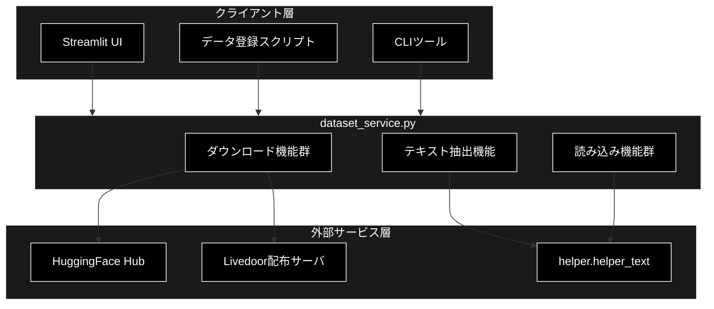
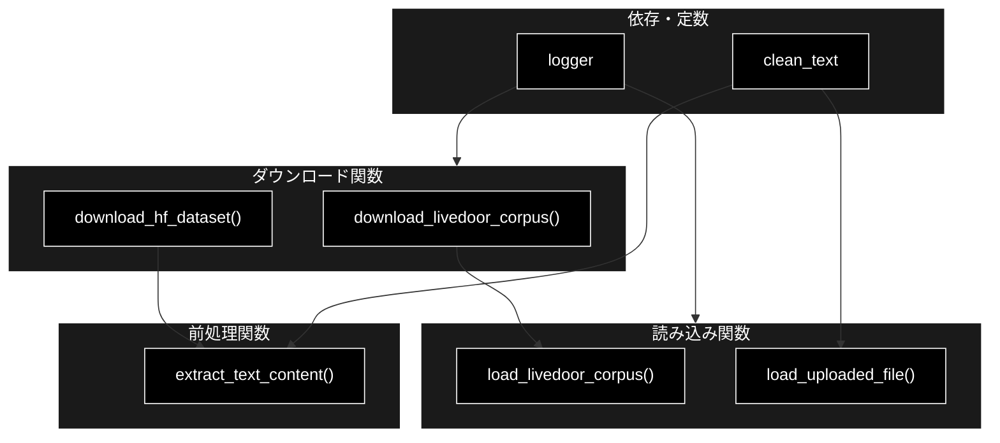
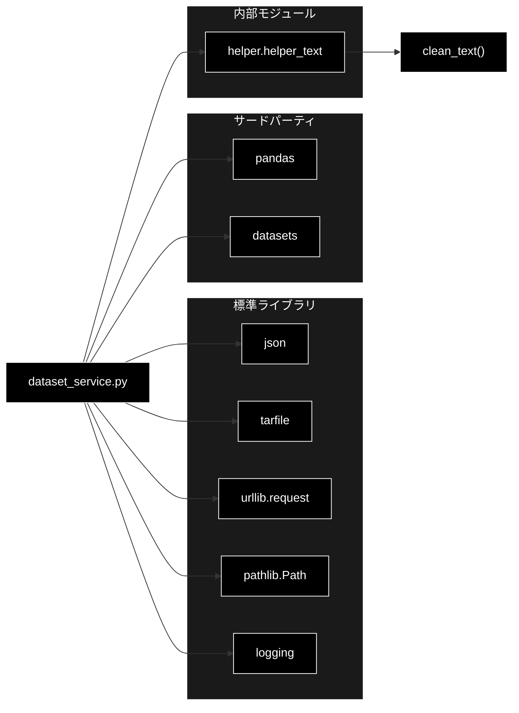

# dataset_service.py - データセット操作サービス ドキュメント

**Version 1.0** | 最終更新: 2026-06-17

---

## 目次

1. [概要](#概要)
2. [アーキテクチャ構成図](#1-アーキテクチャ構成図)
3. [モジュール構成図](#2-モジュール構成図)
4. [クラス・関数一覧表](#3-クラス関数一覧表)
5. [クラス・関数 IPO詳細](#4-クラス関数-ipo詳細)
6. [設定・定数](#5-設定定数)
7. [使用例](#6-使用例)
8. [エクスポート](#7-エクスポート)
9. [変更履歴](#8-変更履歴)
10. [付録: 依存関係図](#付録-依存関係図)

---

## 概要

`dataset_service.py`は、日本語RAG Q&Aシステムにおけるデータセットの取得・読み込み・前処理を担当するサービスモジュールです。HuggingFace公開データセットやLivedoorニュースコーパスのダウンロード、ユーザーがアップロードしたファイル（CSV/TXT/JSON/JSONL）の読み込み、そしてそれらから RAG パイプラインで共通利用する `Combined_Text` カラムを生成するテキスト抽出処理を提供します。

本モジュールはクラスを持たず、すべて関数ベースで構成されており、Streamlit UI やデータ登録スクリプトから呼び出されることを想定しています。LLM（Anthropic Claude）や Embedding（Gemini `gemini-embedding-001`、3072次元）の処理は行わず、その前段となる素データの整形のみを担います。

### 主な責務

- HuggingFaceデータセットのストリーミングダウンロード
- Livedoorニュースコーパスのダウンロードと解凍
- Livedoorコーパスのディレクトリ走査とDataFrame化
- アップロードファイル（CSV/TXT/JSON/JSONL）の読み込み
- テキストの前処理と `Combined_Text` カラムへの統合抽出

### 各責務対応のモジュール

| # | 責務 | 対応モジュール | 説明 |
|---|------|--------------|------|
| 1 | HuggingFaceデータセットのダウンロード | `dataset_service.py` | `datasets`ライブラリでストリーミング取得 |
| 2 | Livedoorコーパスのダウンロードと解凍 | `dataset_service.py` | `urllib`/`tarfile`でtar.gzを取得・展開 |
| 3 | LivedoorコーパスのDataFrame化 | `dataset_service.py` | カテゴリ別ディレクトリを走査して構造化 |
| 4 | アップロードファイルの読み込み | `dataset_service.py` | 拡張子に応じた多形式パース |
| 5 | テキスト前処理とCombined_Text抽出 | `dataset_service.py` / `helper.helper_text` | `clean_text()`で正規化し結合 |

### 主要機能一覧

| 機能 | 説明 |
|------|------|
| `download_livedoor_corpus()` | Livedoorニュースコーパスをダウンロード・解凍 |
| `load_livedoor_corpus()` | Livedoorコーパスを読み込みDataFrame化 |
| `download_hf_dataset()` | HuggingFaceからデータセットをダウンロード |
| `extract_text_content()` | DataFrameからCombined_Textを抽出 |
| `load_uploaded_file()` | アップロードファイルを読み込みDataFrame化 |

---

## 1. アーキテクチャ構成図

### 1.1 システム全体構成



### 1.2 データフロー

1. クライアント層がデータセット取得・読み込みをリクエスト
2. ダウンロード機能が外部サービス（HuggingFace / Livedoor）からデータを取得
3. 読み込み機能が取得データをpandas DataFrameへ変換
4. テキスト抽出機能が`clean_text()`で正規化し`Combined_Text`カラムを生成
5. 空テキストを除外したDataFrameをクライアント層へ返却

---

## 2. モジュール構成図

### 2.1 内部モジュール構成



### 2.2 外部依存関係

| ライブラリ | バージョン | 用途 |
|-----------|-----------|------|
| `pandas` | 2.x | DataFrame操作・データ整形 |
| `datasets` | 2.x以上 | HuggingFaceデータセットのストリーミング取得 |
| `urllib`（標準） | - | Livedoorアーカイブのダウンロード |
| `tarfile`（標準） | - | tar.gzアーカイブの解凍 |
| `json`（標準） | - | JSON/JSONLファイルのパース |
| `pathlib`（標準） | - | ファイルパス操作 |

### 2.3 内部依存モジュール

| モジュール | 用途 |
|-----------|------|
| `helper.helper_text.clean_text` | テキスト正規化（循環参照回避のため`helper_text`から直接インポート） |

---

## 3. クラス・関数一覧表

> 本モジュールにクラスは定義されていません（関数のみで構成）。

### 3.1 関数一覧（カテゴリ別）

#### ダウンロード関数

| 関数名 | 概要 |
|-------|------|
| `download_livedoor_corpus(save_dir)` | Livedoorニュースコーパスをダウンロード・解凍 |
| `download_hf_dataset(dataset_name, config_name, split, sample_size, log_callback)` | HuggingFaceからデータセットをストリーミング取得 |

#### 読み込み関数

| 関数名 | 概要 |
|-------|------|
| `load_livedoor_corpus(data_dir)` | Livedoorコーパスを走査しDataFrame化 |
| `load_uploaded_file(uploaded_file)` | アップロードファイルを読み込みDataFrame化 |

#### 前処理関数

| 関数名 | 概要 |
|-------|------|
| `extract_text_content(df, config)` | DataFrameからCombined_Textを抽出 |

---

## 4. クラス・関数 IPO詳細

### 4.1 ダウンロード関数

#### `download_livedoor_corpus`

**概要**: Livedoorニュースコーパスのtar.gzアーカイブをダウンロードし、解凍してテキストディレクトリのパスを返します。

```python
def download_livedoor_corpus(save_dir: str = "datasets") -> str
```

| パラメータ | 型 | デフォルト | 説明 |
|------------|------|-----------|------|
| `save_dir` | str | "datasets" | アーカイブと展開先の保存ディレクトリ |

| 項目 | 内容 |
|------|------|
| **Input** | `save_dir: str = "datasets"` |
| **Process** | 1. 保存ディレクトリを作成<br>2. tar.gzが未取得なら`urllib`でダウンロード<br>3. 未解凍なら`tarfile`で展開<br>4. `text`ディレクトリのパスを解決 |
| **Output** | `str`: 解凍後の`text`ディレクトリの絶対/相対パス |

**戻り値例**:
```python
"datasets/livedoor/text"
```

```python
# 使用例
from services.dataset_service import download_livedoor_corpus

text_dir = download_livedoor_corpus(save_dir="datasets")
print(f"展開先: {text_dir}")
# 展開先: datasets/livedoor/text
```

#### `download_hf_dataset`

**概要**: HuggingFace Hub から指定データセットをストリーミングで取得し、サンプル数分を pandas DataFrame に変換します。`log_callback`で進捗を通知します。

```python
def download_hf_dataset(
    dataset_name: str,
    config_name: Optional[str],
    split: str,
    sample_size: int,
    log_callback: Callable[[str], None],
) -> pd.DataFrame
```

| パラメータ | 型 | デフォルト | 説明 |
|------------|------|-----------|------|
| `dataset_name` | str | - | データセット名（例: `wikimedia/wikipedia`） |
| `config_name` | Optional[str] | - | コンフィグ名（未指定時はデフォルトを使用） |
| `split` | str | - | データ分割（例: `train`） |
| `sample_size` | int | - | 取得する最大サンプル数 |
| `log_callback` | Callable[[str], None] | - | 進捗ログを受け取るコールバック |

| 項目 | 内容 |
|------|------|
| **Input** | `dataset_name: str`, `config_name: Optional[str]`, `split: str`, `sample_size: int`, `log_callback: Callable[[str], None]` |
| **Process** | 1. データセット名に応じて分岐<br>2. `datasets.load_dataset`をstreaming=Trueで呼び出し<br>3. `sample_size`件までイテレートし収集<br>4. 進捗を`log_callback`で通知<br>5. DataFrameへ変換 |
| **Output** | `pd.DataFrame`: 取得サンプルからなるDataFrame |

**戻り値例**:
```python
#                                                text
# 0  日本の首都は東京である。東京は人口が...
# 1  富士山は日本最高峰の山であり...
```

```python
# 使用例
from services.dataset_service import download_hf_dataset

df = download_hf_dataset(
    dataset_name="wikimedia/wikipedia",
    config_name="20231101.ja",
    split="train",
    sample_size=100,
    log_callback=lambda msg: print(msg),
)
print(f"取得件数: {len(df)}")
# 取得件数: 100
```

> 📝 **注意**: 対応データセットは `wikimedia/wikipedia` / `range3/cc100-ja` / `cc_news` / `hotchpotch/fineweb-2-edu-japanese` の4種です。未対応のデータセット名を渡すと`ValueError`を送出します。

### 4.2 読み込み関数

#### `load_livedoor_corpus`

**概要**: 解凍済みLivedoorコーパスのディレクトリを走査し、カテゴリ別記事を構造化してDataFrameに変換します。

```python
def load_livedoor_corpus(data_dir: str) -> pd.DataFrame
```

| パラメータ | 型 | デフォルト | 説明 |
|------------|------|-----------|------|
| `data_dir` | str | - | コーパスの`text`ディレクトリパス |

| 項目 | 内容 |
|------|------|
| **Input** | `data_dir: str` |
| **Process** | 1. カテゴリディレクトリを走査<br>2. 各記事ファイルを読み込み<br>3. Livedoor形式（1行目URL/2行目日付/3行目タイトル/残り本文）を解析<br>4. レコードを蓄積しDataFrame化 |
| **Output** | `pd.DataFrame`: `url`/`date`/`title`/`content`/`category`カラムを持つDataFrame |

**戻り値例**:
```python
#                          url        date     title      content     category
# 0  http://news.livedoor...  2014-...  記事の見出し  本文テキスト...  it-life-hack
# 1  http://news.livedoor...  2014-...  別の見出し    本文テキスト...  sports-watch
```

```python
# 使用例
from services.dataset_service import (
    download_livedoor_corpus,
    load_livedoor_corpus,
)

text_dir = download_livedoor_corpus()
df = load_livedoor_corpus(text_dir)
print(df["category"].value_counts())
# it-life-hack    870
# sports-watch    900
# ...
```

#### `load_uploaded_file`

**概要**: Streamlitの`file_uploader`等で取得したファイルを拡張子に応じて読み込み、`Combined_Text`カラムを付与したDataFrameを返します。

```python
def load_uploaded_file(uploaded_file) -> pd.DataFrame
```

| パラメータ | 型 | デフォルト | 説明 |
|------------|------|-----------|------|
| `uploaded_file` | UploadedFile | - | `.name`と`.read()`を持つファイルオブジェクト |

| 項目 | 内容 |
|------|------|
| **Input** | `uploaded_file`（CSV/TXT/JSON/JSONL対応） |
| **Process** | 1. 拡張子を判定<br>2. 形式に応じてDataFrameへパース<br>3. `Combined_Text`が無ければ候補フィールドから生成（`clean_text`適用）<br>4. 空テキストを除外しインデックスをリセット |
| **Output** | `pd.DataFrame`: `Combined_Text`カラムを含むDataFrame |

**戻り値例**:
```python
#              text                        Combined_Text
# 0  本文サンプル1   本文サンプル1
# 1  本文サンプル2   本文サンプル2
```

```python
# 使用例
import streamlit as st
from services.dataset_service import load_uploaded_file

uploaded = st.file_uploader("ファイルを選択", type=["csv", "txt", "json", "jsonl"])
if uploaded is not None:
    df = load_uploaded_file(uploaded)
    st.dataframe(df, use_container_width=True)
```

> 📝 **注意**: 未対応の拡張子、または不正なJSON構造（リスト/オブジェクト以外）の場合は`ValueError`を送出し、その他の読み込みエラーは再送出されます。

### 4.3 前処理関数

#### `extract_text_content`

**概要**: 設定（`text_field`/`title_field`）に基づきDataFrameからテキストを抽出・結合し、`clean_text()`で正規化した`Combined_Text`カラムを生成します。

```python
def extract_text_content(df: pd.DataFrame, config: Dict[str, Any]) -> pd.DataFrame
```

| パラメータ | 型 | デフォルト | 説明 |
|------------|------|-----------|------|
| `df` | pd.DataFrame | - | 抽出対象の元DataFrame |
| `config` | Dict[str, Any] | - | `text_field`（必須）と`title_field`（任意）を含む設定 |

| 項目 | 内容 |
|------|------|
| **Input** | `df: pd.DataFrame`, `config: Dict[str, Any]` |
| **Process** | 1. `text_field`/`title_field`を取得<br>2. タイトルとテキストを結合、または単一フィールドを使用<br>3. 該当無しの場合は候補フィールド/全カラム結合でフォールバック<br>4. `clean_text`で正規化<br>5. 空テキストを除外 |
| **Output** | `pd.DataFrame`: `Combined_Text`カラムを含むDataFrame |

**戻り値例**:
```python
#       title           text                 Combined_Text
# 0  見出しA  本文テキストA  見出しA 本文テキストA
# 1  見出しB  本文テキストB  見出しB 本文テキストB
```

```python
# 使用例
from services.dataset_service import extract_text_content

config = {"text_field": "text", "title_field": "title"}
df_processed = extract_text_content(df, config)
print(df_processed["Combined_Text"].head())
# 0    見出しA 本文テキストA
# 1    見出しB 本文テキストB
```

---

## 5. 設定・定数

本モジュールにモジュールレベルの設定辞書・定数は定義されていません。

ただし、関数引数として渡される`config`辞書は以下のキーを参照します。

| キー | 必須 | 説明 |
|-----|:----:|------|
| `text_field` | ✅ | 本文テキストを格納するカラム名 |
| `title_field` | ⚪ | タイトルを格納するカラム名（存在時に本文と結合） |

`extract_text_content()`/`load_uploaded_file()`内のフォールバック探索で用いるテキスト候補フィールドは以下のとおりです。

| 関数 | 候補フィールド |
|------|--------------|
| `extract_text_content()` | `text`, `content`, `body`, `document`, `abstract` |
| `load_uploaded_file()` | `text`, `content`, `body`, `document`, `answer`, `question` |

---

## 6. 使用例

### 6.1 基本的なワークフロー（HuggingFace → 抽出）

```python
from services.dataset_service import (
    download_hf_dataset,
    extract_text_content,
)

# 1. データセットをダウンロード
df = download_hf_dataset(
    dataset_name="wikimedia/wikipedia",
    config_name="20231101.ja",
    split="train",
    sample_size=100,
    log_callback=lambda msg: print(msg),
)

# 2. テキストを抽出してCombined_Textを生成
config = {"text_field": "text", "title_field": "title"}
df_processed = extract_text_content(df, config)

# 3. 結果確認
print(f"処理完了: {len(df_processed)} 件")
```

### 6.2 応用ワークフロー（Livedoorコーパス）

```python
from services.dataset_service import (
    download_livedoor_corpus,
    load_livedoor_corpus,
)

# 1. ダウンロードと解凍
text_dir = download_livedoor_corpus(save_dir="datasets")

# 2. DataFrame化
df = load_livedoor_corpus(text_dir)

# 3. カテゴリ別件数の確認
print(df.groupby("category").size())
```

---

## 7. エクスポート

本モジュールに`__all__`は定義されていません。以下の公開関数が利用可能です。

```python
# 公開関数（モジュールレベル）
download_livedoor_corpus   # Livedoorコーパスのダウンロード・解凍
load_livedoor_corpus       # Livedoorコーパスの読み込み
download_hf_dataset        # HuggingFaceデータセットのダウンロード
extract_text_content       # テキストコンテンツの抽出
load_uploaded_file         # アップロードファイルの読み込み
```

---

## 8. 変更履歴

| バージョン | 変更内容 |
|-----------|---------|
| 1.0 | 初版作成（2026-06-17） |

---

## 付録: 依存関係図


