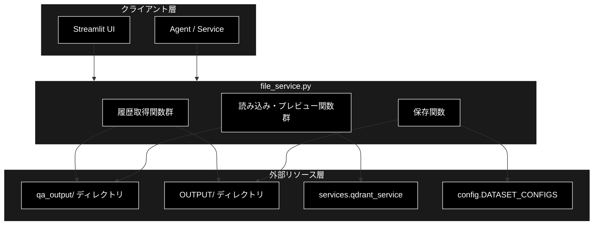
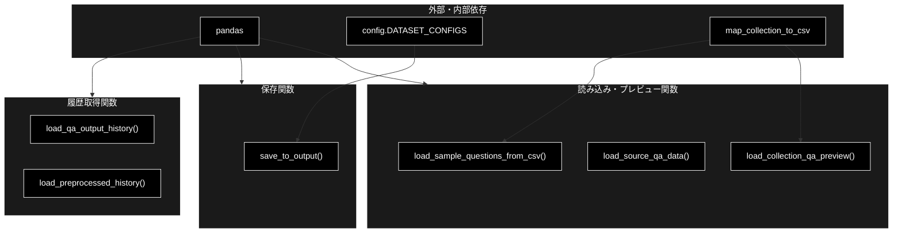
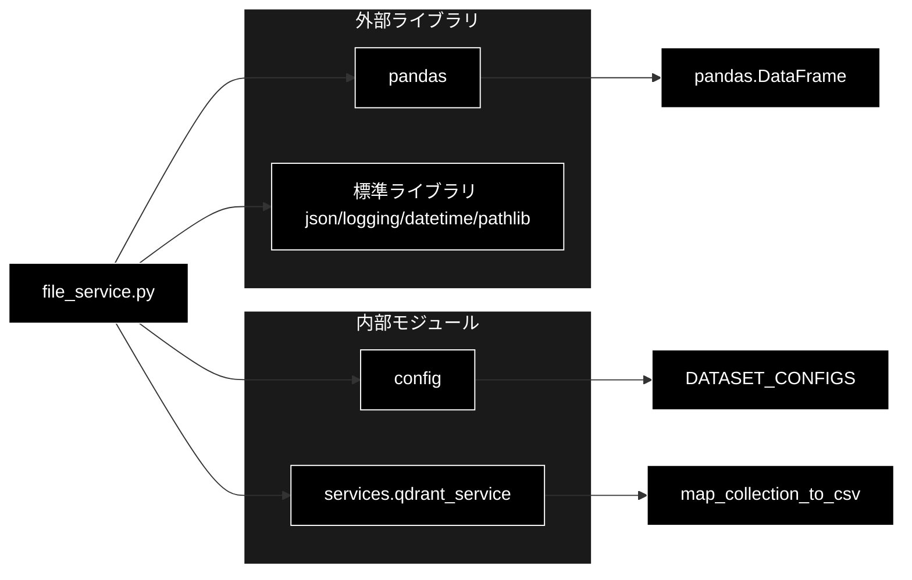

# file_service.py - ファイル操作サービス ドキュメント

**Version 1.0** | 最終更新: 2026-06-17

---

## 目次

1. [概要](#概要)
2. [アーキテクチャ構成図](#1-アーキテクチャ構成図)
3. [モジュール構成図](#2-モジュール構成図)
4. [クラス・関数一覧表](#3-クラス関数一覧表)
5. [クラス・関数 IPO詳細](#4-クラス関数-ipo詳細)
6. [設定・定数](#5-設定定数)
7. [使用例](#6-使用例)
8. [エクスポート](#7-エクスポート)
9. [変更履歴](#8-変更履歴)
10. [付録: 依存関係図](#付録-依存関係図)

---

## 概要

`file_service.py`は、ファイルの読み込み・保存・履歴管理を担当するサービスモジュールです。Q/A出力（`qa_output/`）および前処理済みデータ（`OUTPUT/`）のCSV履歴取得、DataFrameの保存（CSV・テキスト・メタデータJSON）、コレクションに対応したQ/Aサンプル・プレビューの取得を提供します。

本モジュールはクラスを持たず、すべて関数（モジュール関数）で構成されています。

### 主な責務

- Q/A出力履歴（`qa_output/*.csv`）の取得
- 前処理済みデータ履歴（`OUTPUT/preprocessed_*.csv`）の取得
- DataFrameのファイル保存（CSV・テキスト・メタデータJSON）
- コレクションに対応したQ/Aサンプル質問の読み込み
- ソース／コレシション対応CSVからのQ/Aプレビュー取得

### 各責務対応のモジュール

| # | 責務 | 対応モジュール | 説明 |
|---|------|--------------|------|
| 1 | Q/A出力履歴の取得 | `file_service.py` | `qa_output/*.csv` のファイル情報を一覧化 |
| 2 | 前処理済みデータ履歴の取得 | `file_service.py` | `OUTPUT/preprocessed_*.csv` を一覧化 |
| 3 | DataFrameのファイル保存 | `file_service.py` | CSV/TXT/JSONメタデータを `OUTPUT/` に出力 |
| 4 | サンプル質問の読み込み | `file_service.py` | コレクション名から質問例をサンプリング |
| 5 | Q/Aプレビュー取得 | `services.qdrant_service` | `map_collection_to_csv()` でCSV名を解決 |

### 主要機能一覧

| 機能 | 説明 |
|------|------|
| `load_qa_output_history()` | `qa_output/` の最新Q&Aペア CSV 一覧をDataFrameで取得 |
| `load_preprocessed_history()` | `OUTPUT/` の前処理済み CSV 一覧をDataFrameで取得 |
| `save_to_output()` | DataFrameをCSV・TXT・JSONメタデータとして保存 |
| `load_sample_questions_from_csv()` | コレクション対応CSVからランダムに質問例を取得 |
| `load_source_qa_data()` | ソースファイル名からQ/Aデータ（上位N行）を取得 |
| `load_collection_qa_preview()` | コレクション対応CSVからQ/Aプレビューを取得 |

---

## 1. アーキテクチャ構成図

### 1.1 システム全体構成



### 1.2 データフロー

1. クライアント層（Streamlit UI / Agent）が履歴取得・保存・プレビュー関数を呼び出す
2. 履歴取得関数は `qa_output/` または `OUTPUT/` をスキャンしファイル情報をDataFrame化
3. 保存関数は DataFrame を CSV・TXT・JSONメタデータとして `OUTPUT/` に書き出す
4. プレビュー関数は `services.qdrant_service.map_collection_to_csv()` でCSV名を解決し読み込む
5. 結果（DataFrame / dict / list）をクライアント層に返却

---

## 2. モジュール構成図

### 2.1 内部モジュール構成



### 2.2 外部依存関係

| ライブラリ | バージョン | 用途 |
|-----------|-----------|------|
| `pandas` | - | DataFrame操作・CSV読み書き |

### 2.3 内部依存モジュール

| モジュール | 用途 |
|-----------|------|
| `config.DATASET_CONFIGS` | データセット設定（メタデータの `name` 取得） |
| `services.qdrant_service.map_collection_to_csv` | コレクション名→CSVファイル名の解決 |

---

## 3. クラス・関数一覧表

> 本モジュールにクラスは存在しません（モジュール関数のみ）。

### 3.1 関数一覧（カテゴリ別）

#### 履歴取得関数

| 関数名 | 概要 |
|-------|------|
| `load_qa_output_history()` | `qa_output/*.csv` のファイル情報一覧をDataFrameで取得（昇順） |
| `load_preprocessed_history()` | `OUTPUT/preprocessed_*.csv` のファイル情報一覧をDataFrameで取得（降順） |

#### 保存関数

| 関数名 | 概要 |
|-------|------|
| `save_to_output(df, dataset_type)` | DataFrameをCSV・TXT・JSONメタデータとして `OUTPUT/` に保存 |

#### 読み込み・プレビュー関数

| 関数名 | 概要 |
|-------|------|
| `load_sample_questions_from_csv(collection_name, num_samples)` | コレクション対応CSVからランダムに質問例を取得 |
| `load_source_qa_data(source_filename, num_rows)` | ソースファイル名からQ/Aデータ（上位N行）を取得 |
| `load_collection_qa_preview(collection_name, num_rows)` | コレクション対応CSVからQ/Aプレビューを取得 |

---

## 4. クラス・関数 IPO詳細

### 4.1 履歴取得関数

#### `load_qa_output_history`

**概要**: `qa_output/` フォルダ内のすべてのCSVファイルを走査し、ファイル名・サイズ・作成日付の一覧をDataFrameで返します（作成日付の昇順）。

```python
def load_qa_output_history() -> pd.DataFrame
```

| パラメータ | 型 | デフォルト | 説明 |
|------------|------|-----------|------|
| なし | - | - | 引数なし |

| 項目 | 内容 |
|------|------|
| **Input** | なし |
| **Process** | 1. `qa_output/` の存在確認（無ければ空DataFrame）<br>2. `*.csv` を全取得<br>3. 各ファイルの `stat()` からサイズ・更新時刻を取得<br>4. サイズをB/KB/MB表記に整形<br>5. `_timestamp` 昇順でソートし補助列を削除 |
| **Output** | `pd.DataFrame`: 列 `ファイル名`・`ファイルサイズ`・`作成日付` |

**戻り値例**:
```python
#          ファイル名  ファイルサイズ              作成日付
# 0  a02_qa_pairs_cc_news.csv  12.3 KB  2026-06-15 10:21:03
# 1  a02_qa_pairs_faq.csv       8.0 KB  2026-06-16 09:00:11
```

```python
# 使用例
from services.file_service import load_qa_output_history

df = load_qa_output_history()
print(f"履歴件数: {len(df)}")
# 履歴件数: 2
```

#### `load_preprocessed_history`

**概要**: `OUTPUT/` フォルダ内の `preprocessed_*.csv` を走査し、データセット名を含むファイル情報一覧をDataFrameで返します（作成日付の降順）。

```python
def load_preprocessed_history() -> pd.DataFrame
```

| パラメータ | 型 | デフォルト | 説明 |
|------------|------|-----------|------|
| なし | - | - | 引数なし |

| 項目 | 内容 |
|------|------|
| **Input** | なし |
| **Process** | 1. `OUTPUT/` の存在確認（無ければ空DataFrame）<br>2. `preprocessed_*.csv` を全取得<br>3. 各ファイルの `stat()` からサイズ・更新時刻を取得<br>4. `stem` から `preprocessed_` を除いてデータセット名を抽出<br>5. `_timestamp` 降順でソートし補助列を削除 |
| **Output** | `pd.DataFrame`: 列 `ファイル名`・`データセット名`・`ファイルサイズ`・`作成日付` |

**戻り値例**:
```python
#                       ファイル名 データセット名 ファイルサイズ              作成日付
# 0  preprocessed_cc_news_20260616_090011.csv  cc_news  45.1 KB  2026-06-16 09:00:11
```

```python
# 使用例
from services.file_service import load_preprocessed_history

df = load_preprocessed_history()
print(df["データセット名"].tolist())
# ['cc_news']
```

### 4.2 保存関数

#### `save_to_output`

**概要**: DataFrameをタイムスタンプ付きでCSV・テキスト・メタデータJSONの3形式に保存し、保存先パスの辞書を返します。

```python
def save_to_output(df: pd.DataFrame, dataset_type: str) -> Dict[str, str]
```

| パラメータ | 型 | デフォルト | 説明 |
|------------|------|-----------|------|
| `df` | pd.DataFrame | - | 保存対象。`Combined_Text` 列を含む |
| `dataset_type` | str | - | データセットタイプ名（ファイル名・メタデータに使用） |

| 項目 | 内容 |
|------|------|
| **Input** | `df: pd.DataFrame`, `dataset_type: str` |
| **Process** | 1. `OUTPUT/` を作成<br>2. `preprocessed_{type}_{ts}.csv` をUTF-8-SIGで保存<br>3. `Combined_Text` 列を結合し `{type}_{ts}.txt` を保存<br>4. `DATASET_CONFIGS` から名称を取得しメタデータ作成<br>5. `metadata_{type}_{ts}.json` を保存 |
| **Output** | `Dict[str, str]`: `{csv, txt, json}` の各保存先パス |

**戻り値例**:
```python
{
    "csv": "OUTPUT/preprocessed_cc_news_20260617_101530.csv",
    "txt": "OUTPUT/cc_news_20260617_101530.txt",
    "json": "OUTPUT/metadata_cc_news_20260617_101530.json"
}
```

```python
# 使用例
import pandas as pd
from services.file_service import save_to_output

df = pd.DataFrame({"Combined_Text": ["本文1", "本文2"]})
paths = save_to_output(df, "cc_news")
print(paths["csv"])
# OUTPUT/preprocessed_cc_news_20260617_101530.csv
```

### 4.3 読み込み・プレビュー関数

#### `load_sample_questions_from_csv`

**概要**: コレクション名に対応するCSVを `qa_output/` から読み込み、`question` 列からランダムに質問例をサンプリングして返します。

```python
def load_sample_questions_from_csv(
    collection_name: str,
    num_samples: int = 3
) -> List[str]
```

| パラメータ | 型 | デフォルト | 説明 |
|------------|------|-----------|------|
| `collection_name` | str | - | コレクション名 |
| `num_samples` | int | 3 | 取得する質問数 |

| 項目 | 内容 |
|------|------|
| **Input** | `collection_name: str`, `num_samples: int = 3` |
| **Process** | 1. `map_collection_to_csv()` でCSV名を解決（無ければ空リスト）<br>2. `qa_output/` 内のパス存在確認<br>3. CSVを読み込み `question` 列の有無を確認<br>4. `min(num_samples, 件数)` 件をランダムサンプリング |
| **Output** | `List[str]`: 質問文字列のリスト（失敗時は空リスト） |

**戻り値例**:
```python
[
    "このサービスの返金ポリシーは？",
    "サポートの営業時間は？",
    "アカウント削除の方法は？"
]
```

```python
# 使用例
from services.file_service import load_sample_questions_from_csv

questions = load_sample_questions_from_csv("faq_anthropic", num_samples=2)
print(questions)
# ['このサービスの返金ポリシーは？', 'サポートの営業時間は？']
```

#### `load_source_qa_data`

**概要**: 指定したソースファイル名のCSVを `qa_output/` から読み込み、`question`・`answer` 列の上位N行をDataFrameで返します。

```python
def load_source_qa_data(
    source_filename: str,
    num_rows: int = 20
) -> Optional[pd.DataFrame]
```

| パラメータ | 型 | デフォルト | 説明 |
|------------|------|-----------|------|
| `source_filename` | str | - | ソースファイル名（例: `a02_qa_pairs_cc_news.csv`） |
| `num_rows` | int | 20 | 取得する行数 |

| 項目 | 内容 |
|------|------|
| **Input** | `source_filename: str`, `num_rows: int = 20` |
| **Process** | 1. `qa_output/` 内のパス存在確認（無ければNone）<br>2. `nrows` と `usecols=["question","answer"]` で効率読み込み<br>3. 必須列の存在確認<br>4. 成功ログを出力 |
| **Output** | `Optional[pd.DataFrame]`: `question`・`answer` 列のDataFrame、失敗時 `None` |

**戻り値例**:
```python
#                  question              answer
# 0   このサービスとは？     RAG Q&Aシステムです
# 1   料金はいくら？         無料です
```

```python
# 使用例
from services.file_service import load_source_qa_data

df = load_source_qa_data("a02_qa_pairs_cc_news.csv", num_rows=10)
if df is not None:
    print(f"{len(df)}行を取得")
# 10行を取得
```

#### `load_collection_qa_preview`

**概要**: コレクション名に対応するCSVを解決して `qa_output/` から読み込み、`question`・`answer` 列の上位N行をプレビューとして返します。

```python
def load_collection_qa_preview(
    collection_name: str,
    num_rows: int = 20
) -> Optional[pd.DataFrame]
```

| パラメータ | 型 | デフォルト | 説明 |
|------------|------|-----------|------|
| `collection_name` | str | - | コレクション名 |
| `num_rows` | int | 20 | 取得する行数 |

| 項目 | 内容 |
|------|------|
| **Input** | `collection_name: str`, `num_rows: int = 20` |
| **Process** | 1. `map_collection_to_csv()` でCSV名を解決（無ければNone）<br>2. `qa_output/` 内のパス存在確認（無ければNone）<br>3. `nrows` と `usecols=["question","answer"]` で効率読み込み<br>4. 必須列の存在確認<br>5. 成功ログを出力 |
| **Output** | `Optional[pd.DataFrame]`: `question`・`answer` 列のDataFrame、失敗時 `None` |

**戻り値例**:
```python
#                  question              answer
# 0   返金できますか？       30日以内なら可能です
# 1   解約方法は？           設定画面から行えます
```

```python
# 使用例
from services.file_service import load_collection_qa_preview

df = load_collection_qa_preview("faq_anthropic", num_rows=5)
if df is not None:
    print(df.head())
```

---

## 5. 設定・定数

本モジュール内に独自の定数・設定辞書は定義されていません。外部から `config.DATASET_CONFIGS`（`save_to_output()` でメタデータ名称取得に使用）を参照します。

| 参照 | 由来 | 用途 |
|------|------|------|
| `DATASET_CONFIGS` | `config` モジュール | データセット名（`name`）の取得 |

固定のディレクトリ名は以下のとおりです。

| ディレクトリ | 用途 |
|------|------|
| `qa_output/` | Q&AペアCSVの格納先（履歴・サンプル・プレビュー） |
| `OUTPUT/` | 前処理済みデータ・保存出力の格納先 |

---

## 6. 使用例

### 6.1 基本的なワークフロー

```python
import pandas as pd
from services.file_service import (
    save_to_output,
    load_preprocessed_history,
    load_qa_output_history,
)

# 1. 前処理済みDataFrameを保存
df = pd.DataFrame({"Combined_Text": ["本文1", "本文2"]})
paths = save_to_output(df, "cc_news")
print(f"保存: {paths['csv']}")

# 2. 前処理履歴を確認
hist = load_preprocessed_history()
print(f"前処理ファイル数: {len(hist)}")

# 3. Q/A出力履歴を確認
qa_hist = load_qa_output_history()
print(f"Q/Aファイル数: {len(qa_hist)}")
```

### 6.2 応用的なワークフロー（コレクション連携）

```python
from services.file_service import (
    load_sample_questions_from_csv,
    load_collection_qa_preview,
)

collection = "faq_anthropic"

# サンプル質問を取得（検索UIの初期表示等に利用）
samples = load_sample_questions_from_csv(collection, num_samples=3)

# Q/Aプレビューを取得
preview = load_collection_qa_preview(collection, num_rows=20)
if preview is not None:
    print(preview.head())
```

---

## 7. エクスポート

本モジュールに `__all__` は定義されていません。以下の公開関数が利用可能です。

```python
# 公開関数
load_qa_output_history
load_preprocessed_history
save_to_output
load_sample_questions_from_csv
load_source_qa_data
load_collection_qa_preview
```

---

## 8. 変更履歴

| バージョン | 変更内容 |
|-----------|---------|
| 1.0 | 初版作成（2026-06-17） |

---

## 付録: 依存関係図


