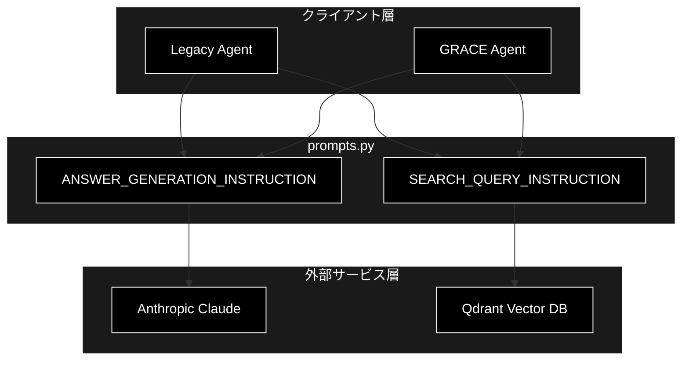
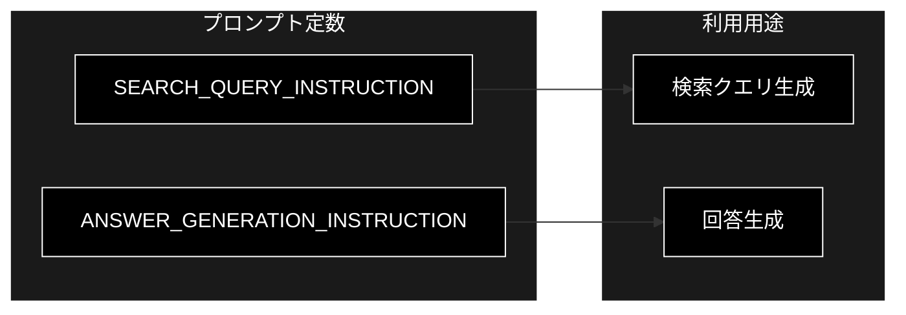
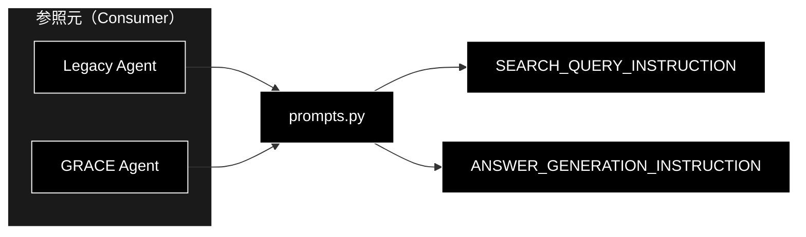

# prompts.py - プロンプト定数 ドキュメント

**Version 1.0** | 最終更新: 2026-06-17

---

## 目次

1. [概要](#概要)
2. [アーキテクチャ構成図](#1-アーキテクチャ構成図)
3. [モジュール構成図](#2-モジュール構成図)
4. [クラス・関数一覧表](#3-クラス関数一覧表)
5. [クラス・関数 IPO詳細](#4-クラス関数-ipo詳細)
6. [設定・定数](#5-設定定数)
7. [使用例](#6-使用例)
8. [エクスポート](#7-エクスポート)
9. [変更履歴](#8-変更履歴)
10. [付録: 依存関係図](#付録-依存関係図)

---

## 概要

`prompts.py` は、Legacy Agent と GRACE Agent の双方で共有されるシステム指示（プロンプト）を集約する定数専用モジュールです。検索クエリ作成のルールと回答生成のスタイルを、文字列定数として一元管理します。LLM には Anthropic Claude、Embedding には Gemini を用いる RAG システムの中で、本モジュールはプロンプトの単一情報源（Single Source of Truth）として機能します。

本モジュールには **クラス・関数は存在せず、プロンプト定数のみ** を提供します。

### 主な責務

- 検索クエリ作成に関する共通指示の提供（`SEARCH_QUERY_INSTRUCTION`）
- 回答生成に関する共通指示の提供（`ANSWER_GENERATION_INSTRUCTION`）
- Legacy Agent と GRACE Agent 間でのプロンプト共有による表記・方針の統一

### 各責務対応のモジュール

| # | 責務 | 対応モジュール | 説明 |
|---|------|--------------|------|
| 1 | 検索クエリ作成に関する共通指示の提供 | `prompts.py` | `SEARCH_QUERY_INSTRUCTION` 定数を定義 |
| 2 | 回答生成に関する共通指示の提供 | `prompts.py` | `ANSWER_GENERATION_INSTRUCTION` 定数を定義 |
| 3 | Agent 間でのプロンプト共有による統一 | `prompts.py` | 両 Agent が同一定数を import して利用 |

### 主要機能一覧

| 機能 | 説明 |
|------|------|
| `SEARCH_QUERY_INSTRUCTION` | 検索クエリ作成ルールを記述したプロンプト定数（str） |
| `ANSWER_GENERATION_INSTRUCTION` | 回答生成スタイル・ルールを記述したプロンプト定数（str） |

> 📝 **注意**: 本モジュールにクラス・関数はありません（プロンプト定数のみ）。実体は2つの文字列定数で構成されます。

---

## 1. アーキテクチャ構成図

### 1.1 システム全体構成



### 1.2 データフロー

1. Legacy Agent / GRACE Agent が本モジュールからプロンプト定数を import する
2. `SEARCH_QUERY_INSTRUCTION` を用いてユーザー質問から検索クエリを生成し、Qdrant 検索に利用する
3. `ANSWER_GENERATION_INSTRUCTION` を用いて検索結果から Anthropic Claude による回答を生成する
4. 生成された回答をクライアント層へ返却する

---

## 2. モジュール構成図

### 2.1 内部モジュール構成



### 2.2 外部依存関係

| ライブラリ | バージョン | 用途 |
|-----------|-----------|------|
| （なし） | - | 標準ライブラリ・サードパーティ依存なし（モジュールレベル import なし） |

### 2.3 内部依存モジュール

| モジュール | 用途 |
|-----------|------|
| （なし） | 他の内部モジュールへの依存なし。本モジュールは被参照側（プロンプトの供給元） |

---

## 3. クラス・関数一覧表

本モジュールにクラス・関数はありません（プロンプト定数のみ）。

クラス・関数の代わりに、公開されている定数を以下に示します。詳細は [設定・定数](#5-設定定数) を参照してください。

| 定数名 | 型 | 概要 |
|-------|-----|------|
| `SEARCH_QUERY_INSTRUCTION` | `str` | 検索クエリ作成に関する共通指示 |
| `ANSWER_GENERATION_INSTRUCTION` | `str` | 回答生成に関する共通指示 |

---

## 4. クラス・関数 IPO詳細

本モジュールにクラス・関数はありません（プロンプト定数のみ）。

そのため IPO 詳細の対象となるクラス・メソッド・関数は存在しません。本モジュールの主役は定数であり、各定数の用途・型・全文は次節 [設定・定数](#5-設定定数) で文書化します。

---

## 5. 設定・定数

### 5.1 SEARCH_QUERY_INSTRUCTION

**概要**: 検索クエリ作成に関する共通指示。ユーザーの質問文から検索に有効なキーワード列を抽出するためのルールと、良い例・悪い例を記述したプロンプト文字列です。

| 項目 | 内容 |
|------|------|
| 名前 | `SEARCH_QUERY_INSTRUCTION` |
| 型 | `str` |
| 用途 | LLM に検索クエリを生成させる際のシステム指示として使用 |
| 利用者 | Legacy Agent / GRACE Agent（検索クエリ生成フェーズ） |

**全文**:

```python
SEARCH_QUERY_INSTRUCTION = """
**重要: 検索クエリ作成のルール（最高精度を出すためのガイドライン）**
- 検索クエリは、質問文から「いつ」「誰」「何」などの具体的な要素を抽出し、それらをスペースで区切ったキーワードのリストとして作成してください。
- 助詞や助動詞（〜の、〜は、〜ですか？）は極力省き、重要な名詞と動詞のみを残してください。
- ユーザーの質問に含まれる具体的な文脈（「初めて」「受賞」など）を決して省略しないでください。

**良い例 (検索スコア 0.8333 を達成したクエリ):**
質問: 「浦沢直樹が初めて受賞したのはいつ、何の賞ですか？」
クエリ: 「浦沢直樹 初めて受賞 いつ 何の賞」

**悪い例:**
- 「浦沢直樹 初受賞」（要素が削られすぎてマッチング精度が低下）
- 「浦沢直樹が初めて受賞したのはいつですか？」（助詞が多く検索ノイズになる）
"""
```

**要点**:

| 観点 | 内容 |
|------|------|
| 抽出方針 | 「いつ」「誰」「何」などの具体要素を抽出しスペース区切りで列挙 |
| 除去対象 | 助詞・助動詞（〜の、〜は、〜ですか？） |
| 保持対象 | 重要な名詞・動詞、具体的文脈（「初めて」「受賞」など） |

### 5.2 ANSWER_GENERATION_INSTRUCTION

**概要**: 回答生成に関する共通指示。回答の文体（です・ます調）、出典明示、低スコア時の積極的活用、捏造禁止といった回答生成ルールを記述したプロンプト文字列です。

| 項目 | 内容 |
|------|------|
| 名前 | `ANSWER_GENERATION_INSTRUCTION` |
| 型 | `str` |
| 用途 | LLM に回答を生成させる際のシステム指示として使用 |
| 利用者 | Legacy Agent / GRACE Agent（回答生成フェーズ） |

**全文**:

```python
ANSWER_GENERATION_INSTRUCTION = """
**重要: 回答のスタイルとルール**
- 丁寧な日本語（です・ます調）で回答してください。
- 検索結果に基づく回答の場合、「社内ナレッジによると...」や「ソース [ファイル名] によると...」と出典を明示してください。
- 検索結果のスコアが低くても（例: 0.5程度）、内容が質問に関連していれば、その情報を積極的に使用して回答を作成してください。
- 「情報が見つかりませんでした」と即断せず、得られた断片的な情報からでも回答を試みてください。
- 提供された情報源の中には、その質問に対する回答が見つかりませんでした。」と正直に伝えてください。
- 絶対にあなたの事前学習知識で捏造してはいけません。
"""
```

**要点**:

| 観点 | 内容 |
|------|------|
| 文体 | 丁寧な日本語（です・ます調） |
| 出典明示 | 「社内ナレッジによると...」「ソース [ファイル名] によると...」 |
| 低スコア対応 | スコア 0.5 程度でも関連すれば積極活用、即断で「見つかりません」としない |
| 捏造禁止 | 事前学習知識による捏造を絶対に禁止 |

---

## 6. 使用例

### 6.1 基本的なワークフロー

```python
# 使用例
from services.prompts import (
    SEARCH_QUERY_INSTRUCTION,
    ANSWER_GENERATION_INSTRUCTION,
)

# 1. 検索クエリ生成用のシステムプロンプトを構築
query_system_prompt = SEARCH_QUERY_INSTRUCTION

# 2. 回答生成用のシステムプロンプトを構築
answer_system_prompt = ANSWER_GENERATION_INSTRUCTION

# 3. LLM 呼び出し時にシステム指示として渡す（Anthropic Claude）
print(query_system_prompt[:30])
# 出力: \n**重要: 検索クエリ作成のルール（最高精度...
```

### 6.2 応用的なワークフロー

```python
# 使用例
from services.prompts import SEARCH_QUERY_INSTRUCTION, ANSWER_GENERATION_INSTRUCTION

user_question = "浦沢直樹が初めて受賞したのはいつ、何の賞ですか？"

# 検索クエリ生成プロンプトにユーザー質問を結合
query_prompt = f"{SEARCH_QUERY_INSTRUCTION}\n\n質問: {user_question}"

# 検索結果を踏まえた回答生成プロンプトを構築
search_context = "..."  # Qdrant からの検索結果
answer_prompt = (
    f"{ANSWER_GENERATION_INSTRUCTION}\n\n"
    f"検索結果:\n{search_context}\n\n質問: {user_question}"
)
# 上記プロンプトを Anthropic Claude へ渡して回答を生成
```

---

## 7. エクスポート

本モジュールに `__all__` は定義されていません。以下の公開定数がモジュールから参照可能です。

```python
# 公開定数（__all__ は未定義）
SEARCH_QUERY_INSTRUCTION        # str: 検索クエリ作成に関する共通指示
ANSWER_GENERATION_INSTRUCTION   # str: 回答生成に関する共通指示
```

---

## 8. 変更履歴

| バージョン | 変更内容 |
|-----------|---------|
| 1.0 | 初版作成（2026-06-17） |

---

## 付録: 依存関係図



> 📝 **注意**: 本モジュールは外部ライブラリ・内部モジュールへの import 依存を持ちません（純粋なプロンプト定数の供給元）。
