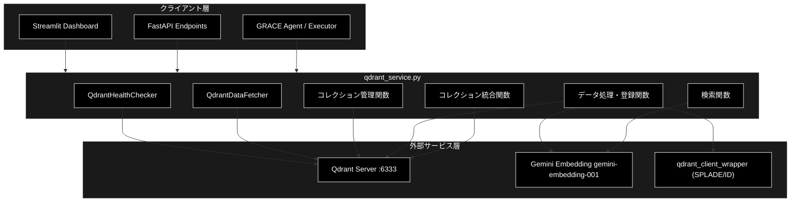
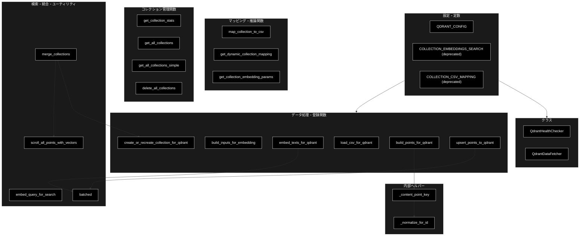
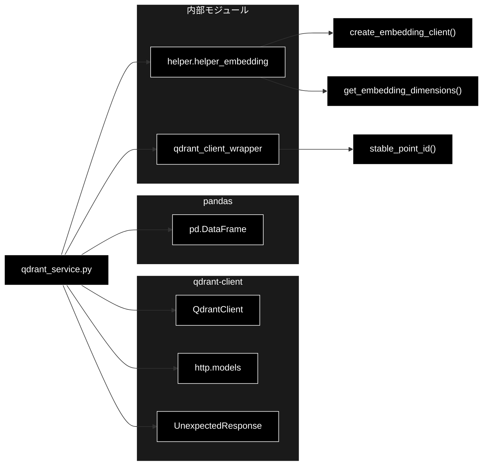

# qdrant_service.py - Qdrant操作サービス ドキュメント

**Version 2.0** | 最終更新: 2026-06-17

---

## 目次

1. [概要](#概要)
2. [アーキテクチャ構成図](#1-アーキテクチャ構成図)
3. [モジュール構成図](#2-モジュール構成図)
4. [クラス・関数一覧表](#3-クラス関数一覧表)
5. [クラス・関数 IPO詳細](#4-クラス関数-ipo詳細)
6. [設定・定数](#5-設定定数)
7. [使用例](#6-使用例)
8. [エクスポート](#7-エクスポート)
9. [変更履歴](#8-変更履歴)
10. [付録: 依存関係図](#付録-依存関係図)

---

## 概要

`qdrant_service.py`は、Qdrantベクトルデータベースとの通信・操作を一元管理するサービスモジュールです。RAG（Retrieval-Augmented Generation）システムにおけるベクトル検索の基盤を提供します。接続ヘルスチェック、データ取得、コレクション管理（CRUD）、Embedding生成・登録、検索クエリのベクトル化、複数コレクション統合までを担います。

Embeddingには Gemini `gemini-embedding-001`（3072次元、鍵 `GOOGLE_API_KEY`）をデフォルトで使用し、コレクションのベクトル次元数に応じて OpenAI 系（`text-embedding-3-small`／1536次元）へ自動フォールバックします。ハイブリッド検索向けに Sparse Vector（fastembed SPLADE、`qdrant_client_wrapper` 側で生成）を保持する Named Vectors 構造（`default` / `text-sparse`）にも対応します。本モジュールでは LLM（生成系）は原則使用しません。

### 主な責務

- Qdrantサーバーの接続状態監視（ヘルスチェック）
- コレクション・ポイントデータの取得と分析
- コレクション管理（作成・統計取得・一覧取得・削除）
- テキストのEmbedding生成とQdrantへの登録（べき等アップサート）
- 検索クエリのベクトル化（プロバイダー自動選択）
- 複数コレクションの統合

### 各責務対応のモジュール

| # | 責務 | 対応モジュール | 説明 |
|---|------|--------------|------|
| 1 | Qdrantサーバーの接続状態監視 | `qdrant_service.py` | `QdrantHealthChecker` がポート・接続を検査 |
| 2 | コレクション・ポイントデータの取得 | `qdrant_service.py` | `QdrantDataFetcher` が DataFrame/辞書で取得 |
| 3 | コレクション管理 | `qdrant_service.py` | 統計取得・一覧取得・一括削除関数群 |
| 4 | Embedding生成と登録 | `helper.helper_embedding` | Geminiクライアント生成・次元数取得 |
| 5 | 検索クエリのベクトル化 | `qdrant_service.py` | `embed_query_for_search` がプロバイダー自動選択 |
| 6 | 複数コレクションの統合 | `qdrant_service.py` | `merge_collections` が決定的IDで再登録 |
| 7 | Sparse Vector・決定的ID生成 | `qdrant_client_wrapper` | `stable_point_id` 等のラッパー |

### 主要機能一覧

| 機能 | 説明 |
|------|------|
| `QdrantHealthChecker` | Qdrant接続状態チェッククラス |
| `QdrantHealthChecker.check_port()` | ポート開放確認 |
| `QdrantHealthChecker.check_qdrant()` | Qdrant接続・統計取得 |
| `QdrantDataFetcher` | Qdrantデータ取得クラス |
| `QdrantDataFetcher.fetch_collections()` | コレクション一覧をDataFrameで取得 |
| `QdrantDataFetcher.fetch_collection_points()` | ポイントデータをDataFrameで取得 |
| `QdrantDataFetcher.fetch_collection_info()` | コレクション詳細情報取得 |
| `QdrantDataFetcher.fetch_collection_source_info()` | データソース統計取得 |
| `map_collection_to_csv()` | コレクション名からCSVファイル名を取得（非推奨） |
| `get_dynamic_collection_mapping()` | コレクションとCSVの動的マッピング生成 |
| `get_collection_embedding_params()` | 次元数からEmbeddingモデル設定を推論 |
| `batched()` | イテラブルをバッチ分割するジェネレータ |
| `get_collection_stats()` | コレクション統計情報取得 |
| `get_all_collections()` | 全コレクション基本情報取得 |
| `get_all_collections_simple()` | 全コレクション一覧取得（シンプル版） |
| `delete_all_collections()` | 全コレクション削除（除外リスト対応） |
| `load_csv_for_qdrant()` | CSV読み込み・前処理 |
| `build_inputs_for_embedding()` | Embedding用入力テキスト生成 |
| `embed_texts_for_qdrant()` | テキストのベクトル変換（Gemini） |
| `create_or_recreate_collection_for_qdrant()` | コレクション作成/再作成 |
| `build_points_for_qdrant()` | ポイント構造体生成（決定的ID） |
| `upsert_points_to_qdrant()` | ポイントのアップサート |
| `embed_query_for_search()` | 検索クエリのベクトル化 |
| `scroll_all_points_with_vectors()` | 全ポイント取得（ベクトル付き） |
| `merge_collections()` | 複数コレクションの統合 |

---

## 1. アーキテクチャ構成図

### 1.1 システム全体構成



### 1.2 データフロー

1. クライアント層からのリクエストを受信
2. `qdrant_service.py`が適切な処理（取得・登録・検索・統合）を実行
3. 登録・検索時は `helper.helper_embedding` 経由で Gemini Embedding を呼び出してベクトル生成
4. ハイブリッド検索時は `qdrant_client_wrapper` で Sparse Vector を生成
5. Qdrantサーバー（localhost:6333）との通信（CRUD・スクロール・アップサート）
6. 結果（DataFrame・辞書・ベクトル・件数）をクライアント層に返却

---

## 2. モジュール構成図

### 2.1 内部モジュール構成



### 2.2 外部依存関係

| ライブラリ | バージョン | 用途 |
|-----------|-----------|------|
| `qdrant-client` | >=1.15.1 | Qdrant Python クライアント・`models`・例外 |
| `pandas` | 2.x | DataFrame操作・欠損値処理 |

### 2.3 内部依存モジュール

| モジュール | 用途 |
|-----------|------|
| `helper.helper_embedding` | `create_embedding_client` / `get_embedding_dimensions`（Embeddingクライアント・次元数） |
| `qdrant_client_wrapper` | `stable_point_id`（決定的ポイントID生成）。Sparse Vector(SPLADE)生成もこちらが担当 |

---

## 3. クラス・関数一覧表

### 3.1 クラス一覧

#### QdrantHealthChecker

| メソッド | 概要 |
|---------|------|
| `__init__(debug_mode)` | コンストラクタ（debug_mode指定） |
| `check_port(host, port, timeout)` | ポート開放確認 |
| `check_qdrant()` | Qdrant接続・統計取得 |

#### QdrantDataFetcher

| メソッド | 概要 |
|---------|------|
| `__init__(client)` | コンストラクタ（QdrantClient指定） |
| `fetch_collections()` | コレクション一覧取得（DataFrame） |
| `fetch_collection_points(collection_name, limit)` | ポイントデータ取得（DataFrame） |
| `fetch_collection_info(collection_name)` | コレクション詳細情報取得 |
| `fetch_collection_source_info(collection_name, sample_size)` | データソース統計取得 |

### 3.2 関数一覧（カテゴリ別）

#### マッピング・推論関数

| 関数名 | 概要 |
|-------|------|
| `map_collection_to_csv(collection_name, qa_output_dir)` | コレクション名からCSVファイル名を取得（非推奨） |
| `get_dynamic_collection_mapping(client, qa_output_dir)` | コレクションとCSVの動的マッピング生成 |
| `get_collection_embedding_params(client, collection_name)` | 次元数からEmbeddingモデル設定を推論 |

#### コレクション管理関数

| 関数名 | 概要 |
|-------|------|
| `get_collection_stats(client, collection_name)` | コレクション統計情報取得 |
| `get_all_collections(client)` | 全コレクション基本情報取得 |
| `get_all_collections_simple(client)` | 全コレクション一覧取得（シンプル版） |
| `delete_all_collections(client, excluded)` | 全コレクション削除（除外リスト対応） |

#### データ処理・登録関数

| 関数名 | 概要 |
|-------|------|
| `load_csv_for_qdrant(path, required, limit)` | CSV読み込み・前処理 |
| `build_inputs_for_embedding(df, include_answer)` | Embedding用テキスト生成 |
| `embed_texts_for_qdrant(texts, model, batch_size)` | テキストのベクトル変換（Gemini） |
| `create_or_recreate_collection_for_qdrant(client, name, recreate, vector_size, use_sparse)` | コレクション作成/再作成 |
| `build_points_for_qdrant(df, vectors, domain, source_file, sparse_vectors, start_index)` | ポイント構造体生成 |
| `upsert_points_to_qdrant(client, collection, points, batch_size)` | ポイントのアップサート |

#### 内部ヘルパー関数

| 関数名 | 概要 |
|-------|------|
| `_normalize_for_id(text)` | ID算出用にテキストを正規化 |
| `_content_point_key(row, domain, source_file, fallback_index)` | 内容ベースのポイントIDキー生成 |

#### 検索関数

| 関数名 | 概要 |
|-------|------|
| `embed_query_for_search(query, model, dims)` | 検索クエリのベクトル化（プロバイダー自動選択） |

#### コレクション統合関数

| 関数名 | 概要 |
|-------|------|
| `scroll_all_points_with_vectors(client, collection_name, batch_size, progress_callback)` | 全ポイント取得（ベクトル付き） |
| `merge_collections(client, source_collections, target_collection, recreate, vector_size, progress_callback)` | 複数コレクションの統合 |

#### ユーティリティ関数

| 関数名 | 概要 |
|-------|------|
| `batched(seq, size)` | イテラブルをバッチ分割するジェネレータ |

---

## 4. クラス・関数 IPO詳細

### 4.1 QdrantHealthChecker クラス

Qdrantサーバーの接続状態を確認するクラス。

#### コンストラクタ: `__init__`

**概要**: デバッグモードを設定し、内部clientをNoneで初期化する。

```python
QdrantHealthChecker(debug_mode: bool = False)
```

| パラメータ | 型 | デフォルト | 説明 |
|------------|------|-----------|------|
| `debug_mode` | bool | False | デバッグモード（詳細なエラー出力） |

| 項目 | 内容 |
|------|------|
| **Input** | `debug_mode: bool = False` |
| **Process** | デバッグモードの保存、`self.client = None` で初期化 |
| **Output** | `QdrantHealthChecker` インスタンス |

```python
# 使用例
checker = QdrantHealthChecker(debug_mode=True)
```

#### メソッド: `check_port`

**概要**: 指定ホスト・ポートがTCP接続可能かをソケットで確認する。

```python
def check_port(self, host: str, port: int, timeout: float = 2.0) -> bool
```

| パラメータ | 型 | デフォルト | 説明 |
|------------|------|-----------|------|
| `host` | str | - | ホスト名 |
| `port` | int | - | ポート番号 |
| `timeout` | float | 2.0 | タイムアウト秒数 |

| 項目 | 内容 |
|------|------|
| **Input** | `host: str`, `port: int`, `timeout: float = 2.0` |
| **Process** | 1. ソケット生成・タイムアウト設定<br>2. `connect_ex()` で接続試行<br>3. 結果コード==0 を判定 |
| **Output** | `bool`: ポートが開いている場合True |

**戻り値例**:
```python
True
```

```python
# 使用例
checker = QdrantHealthChecker()
is_open = checker.check_port("localhost", 6333)
print(f"ポート開放状態: {is_open}")
# ポート開放状態: True
```

#### メソッド: `check_qdrant`

**概要**: ポート確認後にQdrantへ接続し、コレクション統計を取得する。

```python
def check_qdrant(self) -> Tuple[bool, str, Optional[Dict]]
```

| 項目 | 内容 |
|------|------|
| **Input** | なし（selfのみ） |
| **Process** | 1. `check_port()` でポート確認<br>2. `QdrantClient(url=..., timeout=5)` で接続<br>3. `get_collections()` で一覧取得<br>4. メトリクス（件数・名前・応答時間）を計算 |
| **Output** | `Tuple[bool, str, Optional[Dict]]`<br>- bool: 接続成功フラグ<br>- str: メッセージ<br>- Dict: `{collection_count, collections, response_time_ms}` |

**戻り値例**:
```python
(
    True,
    "Connected",
    {
        "collection_count": 3,
        "collections": ["wikipedia_ja", "cc_news", "qa_data"],
        "response_time_ms": 15.2
    }
)
```

```python
# 使用例
checker = QdrantHealthChecker(debug_mode=True)
is_connected, message, metrics = checker.check_qdrant()
if is_connected:
    print(f"接続成功: {metrics['collection_count']}個のコレクション")
else:
    print(f"接続失敗: {message}")
```

---

### 4.2 QdrantDataFetcher クラス

Qdrantからコレクション・ポイントのデータを取得するクラス。

#### コンストラクタ: `__init__`

**概要**: QdrantClientを保持する。

```python
QdrantDataFetcher(client: QdrantClient)
```

| パラメータ | 型 | デフォルト | 説明 |
|------------|------|-----------|------|
| `client` | QdrantClient | - | Qdrantクライアントインスタンス |

| 項目 | 内容 |
|------|------|
| **Input** | `client: QdrantClient` |
| **Process** | `self.client` に保存 |
| **Output** | `QdrantDataFetcher` インスタンス |

```python
# 使用例
from qdrant_client import QdrantClient
fetcher = QdrantDataFetcher(QdrantClient(url="http://localhost:6333"))
```

#### メソッド: `fetch_collections`

**概要**: 全コレクションの件数・ステータスをDataFrameで取得する。

```python
def fetch_collections(self) -> pd.DataFrame
```

| 項目 | 内容 |
|------|------|
| **Input** | なし（selfのみ） |
| **Process** | 1. `get_collections()` で一覧取得<br>2. 各コレクションの `get_collection()` で詳細取得<br>3. 失敗時は "N/A"/"Error" を設定<br>4. DataFrameに変換 |
| **Output** | `pd.DataFrame`: Collection / Vectors Count / Points Count / Indexed Vectors / Status |

**戻り値例**:
```python
#    Collection     Vectors Count  Points Count  Indexed Vectors  Status
# 0  wikipedia_ja   5000           5000          5000             green
# 1  cc_news        3000           3000          3000             green
```

```python
# 使用例
fetcher = QdrantDataFetcher(client)
df = fetcher.fetch_collections()
print(df)
```

#### メソッド: `fetch_collection_points`

**概要**: コレクションのポイントをスクロールしDataFrameで取得する。

```python
def fetch_collection_points(self, collection_name: str, limit: int = 50) -> pd.DataFrame
```

| パラメータ | 型 | デフォルト | 説明 |
|------------|------|-----------|------|
| `collection_name` | str | - | コレクション名 |
| `limit` | int | 50 | 取得する最大件数 |

| 項目 | 内容 |
|------|------|
| **Input** | `collection_name: str`, `limit: int = 50` |
| **Process** | 1. `scroll(with_payload=True, with_vectors=False)` で取得<br>2. ペイロードを列に展開<br>3. 長文(200文字超)・list/dictは切り詰め |
| **Output** | `pd.DataFrame`: ID + ペイロードの各フィールド |

**戻り値例**:
```python
#    ID       question              answer                  source
# 0  abc123   浦沢直樹の代表作は？    MONSTERや20世紀少年...  wikipedia.csv
```

```python
# 使用例
df = fetcher.fetch_collection_points("wikipedia_ja", limit=100)
print(df.head())
```

#### メソッド: `fetch_collection_info`

**概要**: コレクションの件数・ステータス・ベクトル設定を取得する。

```python
def fetch_collection_info(self, collection_name: str) -> Dict[str, Any]
```

| パラメータ | 型 | デフォルト | 説明 |
|------------|------|-----------|------|
| `collection_name` | str | - | コレクション名 |

| 項目 | 内容 |
|------|------|
| **Input** | `collection_name: str` |
| **Process** | 1. `get_collection()` で取得<br>2. 単一/Named Vectors を判定してベクトルサイズ・距離を抽出<br>3. 辞書に整形 |
| **Output** | `Dict[str, Any]`: `{vectors_count, points_count, indexed_vectors, status, config}`（エラー時 `{"error": ...}`） |

**戻り値例**:
```python
{
    "vectors_count": 1000,
    "points_count": 1000,
    "indexed_vectors": 1000,
    "status": "green",
    "config": {"vector_size": 3072, "distance": "Cosine"}
}
```

```python
# 使用例
info = fetcher.fetch_collection_info("wikipedia_ja")
print(f"ベクトル次元: {info['config']['vector_size']}")
# ベクトル次元: 3072
```

#### メソッド: `fetch_collection_source_info`

**概要**: サンプリングにより source/method/domain 別の件数を推定する。

```python
def fetch_collection_source_info(self, collection_name: str, sample_size: int = 200) -> Dict[str, Any]
```

| パラメータ | 型 | デフォルト | 説明 |
|------------|------|-----------|------|
| `collection_name` | str | - | コレクション名 |
| `sample_size` | int | 200 | サンプリングサイズ |

| 項目 | 内容 |
|------|------|
| **Input** | `collection_name: str`, `sample_size: int = 200` |
| **Process** | 1. 総件数を取得<br>2. `min(sample_size, total)` 件をスクロール<br>3. source/method/domain を集計<br>4. 比率から全体数を推定 |
| **Output** | `Dict[str, Any]`: `{total_points, sources, sample_size}`（sources内: `{sample_count, method, domain, estimated_total, percentage}`） |

**戻り値例**:
```python
{
    "total_points": 5000,
    "sources": {
        "wikipedia.csv": {
            "sample_count": 150, "method": "auto", "domain": "wikipedia",
            "estimated_total": 3750, "percentage": 75.0
        }
    },
    "sample_size": 200
}
```

```python
# 使用例
src = fetcher.fetch_collection_source_info("wikipedia_ja", sample_size=500)
for source, stats in src["sources"].items():
    print(f"{source}: 約{stats['estimated_total']}件 ({stats['percentage']:.1f}%)")
```

---

### 4.3 マッピング・推論関数

#### `map_collection_to_csv`

**概要**: コレクション名と完全一致するCSVファイルを `qa_output_dir` から探す。

> ⚠️ **非推奨**: ペイロードの`source`フィールドの使用を推奨します。

```python
def map_collection_to_csv(
    collection_name: str,
    qa_output_dir: str = "qa_output"
) -> Optional[str]
```

| パラメータ | 型 | デフォルト | 説明 |
|------------|------|-----------|------|
| `collection_name` | str | - | コレクション名 |
| `qa_output_dir` | str | "qa_output" | CSVファイルの格納ディレクトリ |

| 項目 | 内容 |
|------|------|
| **Input** | `collection_name: str`, `qa_output_dir: str = "qa_output"` |
| **Process** | `{qa_output_dir}/{collection_name}.csv` の存在を確認（完全一致のみ） |
| **Output** | `Optional[str]`: CSVファイル名（basename）。見つからない場合はNone |

**戻り値例**:
```python
"wikipedia.csv"  # 存在する場合 / None（存在しない場合）
```

```python
# 使用例
csv_file = map_collection_to_csv("wikipedia")
print(csv_file)
# wikipedia.csv
```

#### `get_dynamic_collection_mapping`

**概要**: 全コレクションを走査し、ペイロードの`source`を最優先にCSVと動的マッピングする。

```python
def get_dynamic_collection_mapping(
    client: QdrantClient,
    qa_output_dir: str = "qa_output"
) -> Dict[str, str]
```

| パラメータ | 型 | デフォルト | 説明 |
|------------|------|-----------|------|
| `client` | QdrantClient | - | Qdrantクライアント |
| `qa_output_dir` | str | "qa_output" | CSVファイルの格納ディレクトリ |

| 項目 | 内容 |
|------|------|
| **Input** | `client: QdrantClient`, `qa_output_dir: str = "qa_output"` |
| **Process** | 1. 全コレクション取得<br>2. 1件スクロールしペイロード`source`を取得（最優先）<br>3. フォールバックで完全一致CSV検索<br>4. 成否をログ・サマリー出力 |
| **Output** | `Dict[str, str]`: `{コレクション名: CSVファイル名}` |

**戻り値例**:
```python
{
    "wikipedia_ja": "wikipedia.csv",
    "cc_news": "cc_news.csv"
}
```

```python
# 使用例
mapping = get_dynamic_collection_mapping(client)
for collection, csv_file in mapping.items():
    print(f"{collection} -> {csv_file}")
```

#### `get_collection_embedding_params`

**概要**: コレクションのベクトル次元数からEmbeddingモデル設定を推論する。

```python
def get_collection_embedding_params(
    client: QdrantClient,
    collection_name: str
) -> Dict[str, Any]
```

| パラメータ | 型 | デフォルト | 説明 |
|------------|------|-----------|------|
| `client` | QdrantClient | - | Qdrantクライアント |
| `collection_name` | str | - | コレクション名 |

| 項目 | 内容 |
|------|------|
| **Input** | `client: QdrantClient`, `collection_name: str` |
| **Process** | 1. `get_collection()` でベクトル設定取得<br>2. 単一/マルチベクトルからsizeを抽出<br>3. sizeからモデルを判定（例外時はデフォルトGemini） |
| **Output** | `Dict[str, Any]`: `{"model": str, "dims": int}` |

**次元数とモデルの対応**:

| 次元数 | 推定モデル | プロバイダー |
|--------|-----------|-------------|
| 1536 | text-embedding-3-small | OpenAI |
| 3072 | gemini-embedding-001 | Gemini |
| 768 | gemini-embedding-001 | Gemini |
| その他(>0) | unknown-embedding-model | 不明 |
| デフォルト/例外 | gemini-embedding-001 (3072) | Gemini |

**戻り値例**:
```python
{"model": "gemini-embedding-001", "dims": 3072}
```

```python
# 使用例
params = get_collection_embedding_params(client, "wikipedia_ja")
print(f"モデル: {params['model']}, 次元数: {params['dims']}")
# モデル: gemini-embedding-001, 次元数: 3072
```

---

### 4.4 コレクション管理関数

#### `get_collection_stats`

**概要**: コレクションの件数・ベクトル設定・ステータスを取得する。

```python
def get_collection_stats(
    client: QdrantClient,
    collection_name: str
) -> Optional[Dict[str, Any]]
```

| パラメータ | 型 | デフォルト | 説明 |
|------------|------|-----------|------|
| `client` | QdrantClient | - | Qdrantクライアント |
| `collection_name` | str | - | コレクション名 |

| 項目 | 内容 |
|------|------|
| **Input** | `client: QdrantClient`, `collection_name: str` |
| **Process** | 1. `get_collection()` で取得<br>2. Named/Single Vectors を判定しsize・distanceを抽出<br>3. 存在しない場合はNoneを返す |
| **Output** | `Optional[Dict[str, Any]]`: `{total_points, vector_config, status}`（存在しなければNone） |

**戻り値例**:
```python
{
    "total_points": 1000,
    "vector_config": {"default": {"size": 3072, "distance": "Cosine"}},
    "status": "green"
}
```

```python
# 使用例
stats = get_collection_stats(client, "wikipedia_ja")
if stats:
    print(f"ポイント数: {stats['total_points']}")
```

#### `get_all_collections`

**概要**: 全コレクションの name/points_count/status を取得する。

```python
def get_all_collections(client: QdrantClient) -> List[Dict[str, Any]]
```

| パラメータ | 型 | デフォルト | 説明 |
|------------|------|-----------|------|
| `client` | QdrantClient | - | Qdrantクライアント |

| 項目 | 内容 |
|------|------|
| **Input** | `client: QdrantClient` |
| **Process** | 全コレクションを走査し基本情報を収集（個別失敗時はstatus="Error"） |
| **Output** | `List[Dict[str, Any]]`: `{name, points_count, status}` のリスト |

**戻り値例**:
```python
[
    {"name": "wikipedia_ja", "points_count": 5000, "status": "green"},
    {"name": "cc_news", "points_count": 3000, "status": "green"}
]
```

```python
# 使用例
for col in get_all_collections(client):
    print(f"{col['name']}: {col['points_count']}件")
```

#### `get_all_collections_simple`

**概要**: 全コレクションを vectors_count を含めシンプルに取得する。

```python
def get_all_collections_simple(client: QdrantClient) -> List[Dict[str, Any]]
```

| パラメータ | 型 | デフォルト | 説明 |
|------------|------|-----------|------|
| `client` | QdrantClient | - | Qdrantクライアント |

| 項目 | 内容 |
|------|------|
| **Input** | `client: QdrantClient` |
| **Process** | 全コレクションを走査し `name/vectors_count/points_count/status` を収集（CSVマッピングなし） |
| **Output** | `List[Dict[str, Any]]`: コレクション情報のリスト |

**戻り値例**:
```python
[
    {"name": "wikipedia_ja", "vectors_count": 5000, "points_count": 5000, "status": "green"}
]
```

```python
# 使用例
collections = get_all_collections_simple(client)
print(f"コレクション数: {len(collections)}")
```

#### `delete_all_collections`

**概要**: 除外リスト以外の全コレクションを削除する。

```python
def delete_all_collections(
    client: QdrantClient,
    excluded: List[str] = None
) -> int
```

| パラメータ | 型 | デフォルト | 説明 |
|------------|------|-----------|------|
| `client` | QdrantClient | - | Qdrantクライアント |
| `excluded` | List[str] | None | 削除対象から除外するコレクション名のリスト |

| 項目 | 内容 |
|------|------|
| **Input** | `client: QdrantClient`, `excluded: List[str] = None` |
| **Process** | 1. 全コレクション取得<br>2. 除外リストを除いた対象を抽出<br>3. 各コレクションを削除し成功数をカウント |
| **Output** | `int`: 削除されたコレクション数 |

**戻り値例**:
```python
2
```

```python
# 使用例
deleted = delete_all_collections(client, excluded=["production_data"])
print(f"{deleted}個のコレクションを削除しました")
```

---

### 4.5 データ処理・登録関数

#### `load_csv_for_qdrant`

**概要**: CSVを読み込み、列名正規化・重複削除・欠損処理・件数制限を行う。

```python
def load_csv_for_qdrant(
    path: str,
    required=("question", "answer"),
    limit: int = 0
) -> pd.DataFrame
```

| パラメータ | 型 | デフォルト | 説明 |
|------------|------|-----------|------|
| `path` | str | - | CSVファイルのパス |
| `required` | tuple | ("question", "answer") | 必須カラム |
| `limit` | int | 0 | 読み込み件数制限（0は無制限） |

| 項目 | 内容 |
|------|------|
| **Input** | `path: str`, `required=("question","answer")`, `limit: int = 0` |
| **Process** | 1. 存在確認（無ければFileNotFoundError）<br>2. CSV読込・列名マッピング<br>3. 必須カラム確認（無ければValueError）<br>4. 欠損を""で埋め・required重複削除<br>5. limit適用 |
| **Output** | `pd.DataFrame`: 前処理済みデータ |

**カラム名マッピング**:

| 元のカラム名 | マッピング後 |
|-------------|-------------|
| Question | question |
| Response | answer |
| Answer | answer |
| correct_answer | answer |

**戻り値例**:
```python
#    question              answer
# 0  浦沢直樹の代表作は？    MONSTERや20世紀少年などがあります
```

```python
# 使用例
df = load_csv_for_qdrant("qa_output/wikipedia.csv", limit=1000)
print(f"読み込み件数: {len(df)}")
```

#### `build_inputs_for_embedding`

**概要**: DataFrameからEmbedding入力テキストを生成する（answer結合の有無を選択）。

```python
def build_inputs_for_embedding(df: pd.DataFrame, include_answer: bool) -> List[str]
```

| パラメータ | 型 | デフォルト | 説明 |
|------------|------|-----------|------|
| `df` | pd.DataFrame | - | 入力データフレーム |
| `include_answer` | bool | - | True: question + "\n" + answer / False: questionのみ |

| 項目 | 内容 |
|------|------|
| **Input** | `df: pd.DataFrame`, `include_answer: bool` |
| **Process** | include_answer に応じて question(+改行+answer) を文字列リスト化 |
| **Output** | `List[str]`: Embedding用テキストのリスト |

**戻り値例**:
```python
["浦沢直樹の代表作は？\nMONSTERや20世紀少年などがあります"]
```

```python
# 使用例
texts = build_inputs_for_embedding(df, include_answer=True)
print(f"テキスト数: {len(texts)}")
```

#### `embed_texts_for_qdrant`

**概要**: テキストリストをGemini Embeddingでバッチ変換する（空文字はゼロベクトル）。

```python
def embed_texts_for_qdrant(
    texts: List[str],
    model: str = "gemini-embedding-001",
    batch_size: int = 100
) -> List[List[float]]
```

| パラメータ | 型 | デフォルト | 説明 |
|------------|------|-----------|------|
| `texts` | List[str] | - | テキストのリスト |
| `model` | str | "gemini-embedding-001" | 使用するEmbeddingモデル |
| `batch_size` | int | 100 | バッチサイズ |

| 項目 | 内容 |
|------|------|
| **Input** | `texts: List[str]`, `model: str = "gemini-embedding-001"`, `batch_size: int = 100` |
| **Process** | 1. Geminiクライアント生成・次元数(3072)取得<br>2. 空文字・空白を除外しインデックス記録<br>3. 有効テキストをバッチEmbedding<br>4. 空文字位置にゼロベクトルを挿入し再配置 |
| **Output** | `List[List[float]]`: 3072次元ベクトルのリスト（入力件数と同数） |

**戻り値例**:
```python
[
    [0.0123, -0.0456, 0.0789, ...],  # 3072次元
    [0.0234, -0.0567, 0.0891, ...]   # 3072次元
]
```

```python
# 使用例
vectors = embed_texts_for_qdrant(["浦沢直樹の代表作は？", "東京タワーの高さは？"])
print(f"ベクトル数: {len(vectors)}, 次元数: {len(vectors[0])}")
# ベクトル数: 2, 次元数: 3072
```

#### `create_or_recreate_collection_for_qdrant`

**概要**: コレクションを作成または再作成する（Hybrid Search用Sparse Vectorに対応）。

```python
def create_or_recreate_collection_for_qdrant(
    client: QdrantClient,
    name: str,
    recreate: bool,
    vector_size: int = 3072,
    use_sparse: bool = False
)
```

| パラメータ | 型 | デフォルト | 説明 |
|------------|------|-----------|------|
| `client` | QdrantClient | - | Qdrantクライアント |
| `name` | str | - | コレクション名 |
| `recreate` | bool | - | True: 既存を削除して再作成 |
| `vector_size` | int | 3072 | Dense Vectorの次元数 |
| `use_sparse` | bool | False | Hybrid Search（Sparse Vector）の有効化 |

| 項目 | 内容 |
|------|------|
| **Input** | `client`, `name: str`, `recreate: bool`, `vector_size: int = 3072`, `use_sparse: bool = False` |
| **Process** | 1. Dense Vector設定（COSINE）作成<br>2. use_sparse時は`default` Named Vector + `text-sparse` Sparse設定<br>3. recreate=True: 削除→作成 / False: 存在確認→なければ作成<br>4. `domain` にKEYWORDペイロード索引を作成 |
| **Output** | `None`（副作用: コレクション作成） |

**Hybrid Search有効時のベクトル構成**:
- `default`: Dense Vector（Gemini/OpenAI、COSINE）
- `text-sparse`: Sparse Vector（SPLADE、on_disk=False）

```python
# 使用例（基本）
create_or_recreate_collection_for_qdrant(client, name="wikipedia_qa", recreate=True, vector_size=3072)

# 使用例（Hybrid Search対応）
create_or_recreate_collection_for_qdrant(client, name="hybrid_collection", recreate=True, vector_size=3072, use_sparse=True)
```

#### `build_points_for_qdrant`

**概要**: DataFrameとベクトルからQdrantポイントを構築する。IDは内容ベースの決定的IDで再登録べき等。

```python
def build_points_for_qdrant(
    df: pd.DataFrame,
    vectors: List[List[float]],
    domain: str,
    source_file: str,
    sparse_vectors: Optional[List[models.SparseVector]] = None,
    start_index: int = 0
) -> List[models.PointStruct]
```

| パラメータ | 型 | デフォルト | 説明 |
|------------|------|-----------|------|
| `df` | pd.DataFrame | - | 元データ |
| `vectors` | List[List[float]] | - | Dense Vectorリスト |
| `domain` | str | - | ドメイン名 |
| `source_file` | str | - | ソースファイル名（basenameをsourceに格納） |
| `sparse_vectors` | Optional[List[models.SparseVector]] | None | Sparse Vectorリスト |
| `start_index` | int | 0 | 内容が空の行でのみ使うフォールバックIDの開始番号 |

| 項目 | 内容 |
|------|------|
| **Input** | `df`, `vectors`, `domain: str`, `source_file: str`, `sparse_vectors=None`, `start_index: int = 0` |
| **Process** | 1. vectors/sparse_vectors の件数整合性チェック<br>2. 各行をペイロード化（chunk_id/topic/doc_id があれば来歴として保持）<br>3. `_content_point_key` + `stable_point_id` で内容ベースの決定的ID生成<br>4. sparse_vectors有無でNamed Vectors or 単一Denseを構築 |
| **Output** | `List[models.PointStruct]`: Qdrant登録用ポイント |

**生成されるペイロード構造**:
```python
{
    "domain": "wikipedia",
    "question": "質問テキスト",
    "answer": "回答テキスト",
    "source": "wikipedia.csv",
    "created_at": "2026-06-17T12:00:00+00:00",
    "schema": "qa:v1"
}
```

```python
# 使用例
points = build_points_for_qdrant(df, vectors, domain="wikipedia", source_file="wikipedia.csv")
print(f"ポイント数: {len(points)}")
```

#### `upsert_points_to_qdrant`

**概要**: ポイントをバッチ単位でQdrantにアップサートする。

```python
def upsert_points_to_qdrant(
    client: QdrantClient,
    collection: str,
    points: List[models.PointStruct],
    batch_size: int = 128
) -> int
```

| パラメータ | 型 | デフォルト | 説明 |
|------------|------|-----------|------|
| `client` | QdrantClient | - | Qdrantクライアント |
| `collection` | str | - | コレクション名 |
| `points` | List[models.PointStruct] | - | 登録するポイントのリスト |
| `batch_size` | int | 128 | バッチサイズ |

| 項目 | 内容 |
|------|------|
| **Input** | `client`, `collection: str`, `points`, `batch_size: int = 128` |
| **Process** | `batched()` でポイントを分割し、各バッチを `client.upsert()` |
| **Output** | `int`: アップサートしたポイント数 |

**戻り値例**:
```python
1000
```

```python
# 使用例
count = upsert_points_to_qdrant(client, "wikipedia_qa", points)
print(f"{count}件のポイントを登録しました")
```

---

### 4.6 内部ヘルパー関数

#### `_normalize_for_id`

**概要**: ポイントID算出のため、空白を畳み込み前後をtrimして正規化する。

```python
def _normalize_for_id(text: Any) -> str
```

| パラメータ | 型 | デフォルト | 説明 |
|------------|------|-----------|------|
| `text` | Any | - | 正規化対象（str化される） |

| 項目 | 内容 |
|------|------|
| **Input** | `text: Any` |
| **Process** | `str(text).split()` を空白1個で連結 |
| **Output** | `str`: 正規化済みテキスト |

**戻り値例**:
```python
"浦沢直樹 の 代表作"
```

```python
# 使用例
key = _normalize_for_id("  浦沢直樹  の   代表作 ")
# "浦沢直樹 の 代表作"
```

#### `_content_point_key`

**概要**: question+answer（無ければ本文）を基に、位置非依存の決定的IDキーを生成する。

```python
def _content_point_key(row, domain: str, source_file: str, fallback_index: int) -> str
```

| パラメータ | 型 | デフォルト | 説明 |
|------------|------|-----------|------|
| `row` | namedtuple | - | DataFrameの行（itertuples） |
| `domain` | str | - | ドメイン名 |
| `source_file` | str | - | ソースファイル名 |
| `fallback_index` | int | - | 内容が空の場合の位置ベースフォールバック番号 |

| 項目 | 内容 |
|------|------|
| **Input** | `row`, `domain: str`, `source_file: str`, `fallback_index: int` |
| **Process** | 1. question/answer を正規化し `domain\|qa\|q\|a` を返す<br>2. 空なら text/Combined_Text/content を `domain\|text\|t` で代替<br>3. すべて空なら `domain-source_file-index`（べき等性なし） |
| **Output** | `str`: ポイントIDの元になる内容ベースキー |

**戻り値例**:
```python
"wikipedia|qa|浦沢直樹の代表作は？|MONSTERや20世紀少年などがあります"
```

```python
# 使用例（build_points_for_qdrant 内部で利用）
pid = stable_point_id(_content_point_key(row, "wikipedia", "wikipedia.csv", 0))
```

---

### 4.7 検索関数

#### `embed_query_for_search`

**概要**: 検索クエリをベクトル化する。次元数/モデル名でプロバイダーを自動選択する。

```python
def embed_query_for_search(
    query: str,
    model: str = "gemini-embedding-001",
    dims: Optional[int] = None
) -> List[float]
```

| パラメータ | 型 | デフォルト | 説明 |
|------------|------|-----------|------|
| `query` | str | - | 検索クエリ文字列 |
| `model` | str | "gemini-embedding-001" | Embeddingモデル名 |
| `dims` | Optional[int] | None | 次元数（プロバイダー判定に優先使用） |

| 項目 | 内容 |
|------|------|
| **Input** | `query: str`, `model: str = "gemini-embedding-001"`, `dims: Optional[int] = None` |
| **Process** | 1. dims/model からプロバイダー判定<br>2. `create_embedding_client(provider, dims)` で生成<br>3. Geminiは `task_type="retrieval_query"` を指定<br>4. `embed_text()` でベクトル生成 |
| **Output** | `List[float]`: クエリベクトル |

**プロバイダー自動選択ロジック**:

| 条件 | 選択されるプロバイダー |
|-----|---------------------|
| dims == 1536 | OpenAI |
| dims == 3072 または 768 | Gemini |
| model に "text-embedding-3"/"text-embedding-ada" を含む | OpenAI |
| model に "gemini" を含む | Gemini |
| デフォルト | Gemini |

**戻り値例**:
```python
[0.0123, -0.0456, 0.0789, ...]  # 3072次元ベクトル
```

```python
# 使用例
query_vector = embed_query_for_search("浦沢直樹の代表作は？", dims=3072)
print(f"次元数: {len(query_vector)}")
# 次元数: 3072
```

---

### 4.8 コレクション統合関数

#### `scroll_all_points_with_vectors`

**概要**: コレクションから全ポイントをベクトル付きでスクロール取得する。

```python
def scroll_all_points_with_vectors(
    client: QdrantClient,
    collection_name: str,
    batch_size: int = 100,
    progress_callback: Optional[callable] = None
) -> List[models.Record]
```

| パラメータ | 型 | デフォルト | 説明 |
|------------|------|-----------|------|
| `client` | QdrantClient | - | Qdrantクライアント |
| `collection_name` | str | - | コレクション名 |
| `batch_size` | int | 100 | 1回のスクロール件数 |
| `progress_callback` | Optional[callable] | None | `(取得済み件数, 総件数) -> None` |

| 項目 | 内容 |
|------|------|
| **Input** | `client`, `collection_name: str`, `batch_size: int = 100`, `progress_callback=None` |
| **Process** | 1. 総件数を取得<br>2. offsetを進めながら `scroll(with_vectors=True)`<br>3. 取得ごとにコールバック<br>4. next_offsetがNoneで終了 |
| **Output** | `List[models.Record]`: 全ポイントのリスト |

**戻り値例**:
```python
[Record(id="abc123", vector=[...], payload={...}), ...]
```

```python
# 使用例
def on_progress(current, total):
    print(f"進捗: {current}/{total}")

points = scroll_all_points_with_vectors(client, "wikipedia_ja", progress_callback=on_progress)
print(f"取得件数: {len(points)}")
```

#### `merge_collections`

**概要**: 複数コレクションを統合し、決定的IDで新コレクションへ再登録する。

```python
def merge_collections(
    client: QdrantClient,
    source_collections: List[str],
    target_collection: str,
    recreate: bool = True,
    vector_size: int = 3072,
    progress_callback: Optional[callable] = None
) -> Dict[str, Any]
```

| パラメータ | 型 | デフォルト | 説明 |
|------------|------|-----------|------|
| `client` | QdrantClient | - | Qdrantクライアント |
| `source_collections` | List[str] | - | 統合元コレクションのリスト |
| `target_collection` | str | - | 統合先コレクション名 |
| `recreate` | bool | True | 統合先を再作成するか |
| `vector_size` | int | 3072 | ベクトル次元数 |
| `progress_callback` | Optional[callable] | None | `(メッセージ, 現在値, 最大値) -> None` |

| 項目 | 内容 |
|------|------|
| **Input** | `client`, `source_collections`, `target_collection: str`, `recreate: bool = True`, `vector_size: int = 3072`, `progress_callback=None` |
| **Process** | 1. 統合先コレクション作成<br>2. 各ソースから `scroll_all_points_with_vectors` で取得<br>3. `_source_collection`/`_original_id` を付与しIDを決定的に再生成<br>4. バッチ(128)でアップサート<br>5. 進捗・件数を集計 |
| **Output** | `Dict[str, Any]`: `{source_collections, target_collection, points_per_collection, total_points, success, error}` |

**統合時のペイロード拡張**:
- `_source_collection`: 元のコレクション名
- `_original_id`: 元のポイントID

**戻り値例**:
```python
{
    "source_collections": ["wikipedia_ja", "cc_news"],
    "target_collection": "merged_all",
    "points_per_collection": {"wikipedia_ja": 5000, "cc_news": 3000},
    "total_points": 8000,
    "success": True,
    "error": None
}
```

```python
# 使用例
result = merge_collections(client, ["wikipedia_ja", "cc_news"], "merged_all", recreate=True)
if result["success"]:
    print(f"統合完了: {result['total_points']}件")
else:
    print(f"エラー: {result['error']}")
```

---

### 4.9 ユーティリティ関数

#### `batched`

**概要**: イテラブルを指定サイズのバッチに分割するジェネレータ。

```python
def batched(seq: Iterable, size: int)
```

| パラメータ | 型 | デフォルト | 説明 |
|------------|------|-----------|------|
| `seq` | Iterable | - | 分割対象のイテラブル |
| `size` | int | - | バッチサイズ |

| 項目 | 内容 |
|------|------|
| **Input** | `seq: Iterable`, `size: int` |
| **Process** | 要素をバッファに溜め、size到達ごとにyield。末尾の残りもyield |
| **Output** | `Generator[list]`: バッチ（リスト）を順次生成 |

**戻り値例**:
```python
# batched(range(10), 3) の出力
[0, 1, 2]
[3, 4, 5]
[6, 7, 8]
[9]
```

```python
# 使用例
for batch in batched(range(10), 3):
    print(batch)
```

---

## 5. 設定・定数

### 5.1 QDRANT_CONFIG

Qdrantサーバーの接続設定を定義する辞書。

```python
QDRANT_CONFIG = {
    "name"                 : "Qdrant",
    "host"                 : "localhost",
    "port"                 : 6333,
    "icon"                 : "🎯",
    "url"                  : "http://localhost:6333",
    "health_check_endpoint": "/collections",
    "docker_image"         : "qdrant/qdrant",
}
```

| キー | デフォルト値 | 説明 |
|-----|-------------|------|
| `name` | "Qdrant" | サービス名 |
| `host` | "localhost" | ホスト名 |
| `port` | 6333 | ポート番号 |
| `icon` | "🎯" | UI表示用アイコン |
| `url` | "http://localhost:6333" | 完全URL |
| `health_check_endpoint` | "/collections" | ヘルスチェック用エンドポイント |
| `docker_image` | "qdrant/qdrant" | Dockerイメージ名 |

### 5.2 既定値（Embedding/ベクトル）

| 項目 | 値 | 説明 |
|------|----|------|
| デフォルトEmbedding | `gemini-embedding-001`（3072次元） | 登録・検索の既定モデル（鍵 `GOOGLE_API_KEY`） |
| 距離関数 | `COSINE` | コレクション作成時のDense Vector距離 |
| Sparse Vector名 | `text-sparse` | Hybrid Search用（SPLADE、`on_disk=False`） |
| Dense Vector名（Hybrid時） | `default` | Named Vectors構成のDense側 |
| ペイロード索引 | `domain`（KEYWORD） | コレクション作成時に自動付与 |

### 5.3 非推奨の定数

以下の定数は後方互換性のために残されていますが、空辞書であり動的関数の使用を推奨します。

| 定数名 | 状態 | 代替方法 |
|-------|------|---------|
| `COLLECTION_EMBEDDINGS_SEARCH` | ⚠️ 非推奨（`{}`） | `get_collection_embedding_params()` |
| `COLLECTION_CSV_MAPPING` | ⚠️ 非推奨（`{}`） | `get_dynamic_collection_mapping()` |

---

## 6. 使用例

### 6.1 基本的なワークフロー（登録）

```python
from qdrant_client import QdrantClient
from services.qdrant_service import (
    QdrantHealthChecker,
    load_csv_for_qdrant,
    build_inputs_for_embedding,
    embed_texts_for_qdrant,
    create_or_recreate_collection_for_qdrant,
    build_points_for_qdrant,
    upsert_points_to_qdrant,
)

# 1. 接続確認
checker = QdrantHealthChecker()
is_connected, msg, metrics = checker.check_qdrant()
if not is_connected:
    raise ConnectionError(f"Qdrant接続失敗: {msg}")

# 2. クライアント作成
client = QdrantClient(url="http://localhost:6333")

# 3. CSVデータ読み込み
df = load_csv_for_qdrant("qa_output/wikipedia.csv", limit=1000)

# 4. Embedding生成（Gemini, 3072次元）
texts = build_inputs_for_embedding(df, include_answer=True)
vectors = embed_texts_for_qdrant(texts)

# 5. コレクション作成
create_or_recreate_collection_for_qdrant(client, name="wikipedia_qa", recreate=True, vector_size=3072)

# 6. ポイント構築・登録（内容ベース決定的IDでべき等）
points = build_points_for_qdrant(df, vectors, domain="wikipedia", source_file="wikipedia.csv")
count = upsert_points_to_qdrant(client, "wikipedia_qa", points)
print(f"{count}件のポイントを登録しました")
```

### 6.2 Hybrid Search（Sparse Vector）対応のワークフロー

```python
from services.qdrant_service import (
    create_or_recreate_collection_for_qdrant,
    build_points_for_qdrant,
)
# Sparse Vector（SPLADE）生成はラッパー側に実装
from qdrant_client_wrapper import embed_sparse_texts_unified

# Sparse Vectorを有効にしてコレクション作成
create_or_recreate_collection_for_qdrant(
    client, name="hybrid_collection", recreate=True, vector_size=3072, use_sparse=True
)

# Sparse Vector生成（text-sparse）
sparse_vectors = embed_sparse_texts_unified(texts)

# ポイント構築（Dense + Sparse → Named Vectors）
points = build_points_for_qdrant(
    df, dense_vectors, domain="hybrid", source_file="data.csv", sparse_vectors=sparse_vectors
)
```

### 6.3 検索クエリのベクトル化

```python
from services.qdrant_service import embed_query_for_search

# コレクション次元数からプロバイダーを自動選択
query_vector = embed_query_for_search("浦沢直樹の代表作は？", dims=3072)
hits = client.search(collection_name="wikipedia_qa", query_vector=query_vector, limit=5)
```

---

## 7. エクスポート

本モジュールには `__all__` は定義されていません。`services/__init__.py` から再エクスポートされる公開要素は以下のとおりです。

```python
# services/__init__.py での再エクスポート
from services.qdrant_service import (
    COLLECTION_CSV_MAPPING,          # 非推奨
    COLLECTION_EMBEDDINGS_SEARCH,    # 非推奨
    QDRANT_CONFIG,
    QdrantDataFetcher,
    QdrantHealthChecker,
    build_inputs_for_embedding,
    build_points_for_qdrant,
    create_or_recreate_collection_for_qdrant,
    delete_all_collections,
    embed_query_for_search,
    embed_texts_for_qdrant,
    get_all_collections,
    get_collection_stats,
    load_csv_for_qdrant,
    upsert_points_to_qdrant,
)
```

上記に加え、モジュール直接importで利用可能な公開要素:

```python
# モジュールから直接利用可能（__init__.py 未経由）
map_collection_to_csv
get_dynamic_collection_mapping
get_collection_embedding_params
get_all_collections_simple
scroll_all_points_with_vectors
merge_collections
batched
```

内部ヘルパー（公開対象外）: `_normalize_for_id`, `_content_point_key`

---

## 8. 変更履歴

| バージョン | 変更内容 |
|-----------|---------|
| 1.0 | 初版作成 |
| 1.1 | 命名規則依存廃止、動的マッピング導入 |
| 1.2 | Hybrid Search（Sparse Vector）対応 |
| 1.3 | ドキュメント改修: シグネチャ・戻り値例・使用例を追加 |
| 2.0 | フォーマット仕様v1.5準拠に全面改訂。Mermaid黒背景3層構成・モジュール構成図を追加。内部ヘルパー(`_normalize_for_id`/`_content_point_key`)・`get_all_collections_simple`・統合関数を網羅。技術スタック表記をGemini Embedding/SPLADEに統一。エクスポートを実体(`services/__init__.py`)準拠に更新。最終更新: 2026-06-17 |

---

## 付録: 依存関係図


