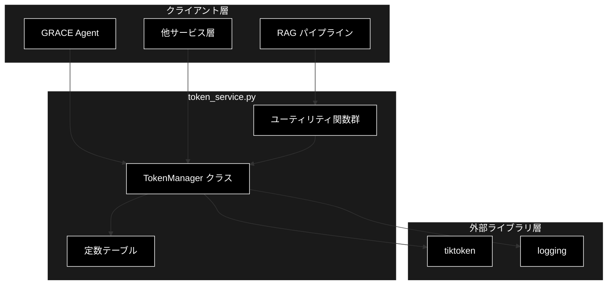
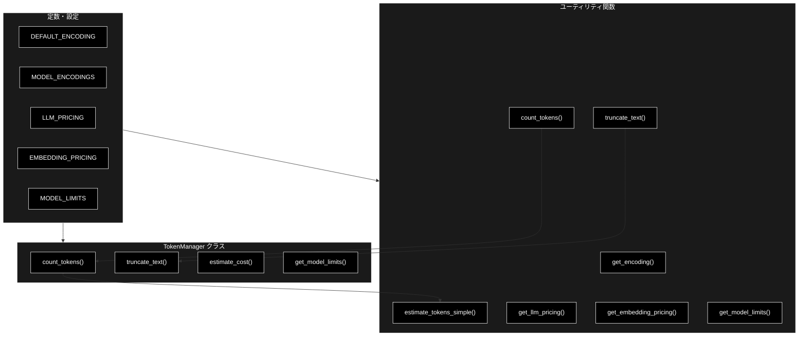
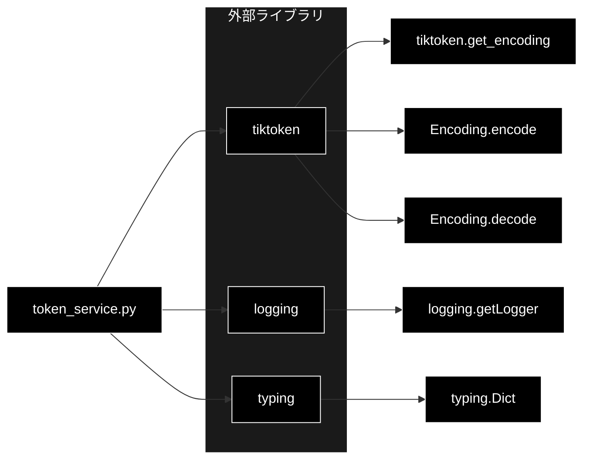

# token_service.py - トークン管理サービス ドキュメント

**Version 1.0** | 最終更新: 2026-06-17

---

## 目次

1. [概要](#概要)
2. [アーキテクチャ構成図](#1-アーキテクチャ構成図)
3. [モジュール構成図](#2-モジュール構成図)
4. [クラス・関数一覧表](#3-クラス関数一覧表)
5. [クラス・関数 IPO詳細](#4-クラス関数-ipo詳細)
6. [設定・定数](#5-設定定数)
7. [使用例](#6-使用例)
8. [エクスポート](#7-エクスポート)
9. [変更履歴](#8-変更履歴)
10. [付録: 依存関係図](#付録-依存関係図)

---

## 概要

`token_service.py`は、トークンカウント・コスト推定・テキスト切り詰めを統合的に提供するサービスモジュールです。`tiktoken`を用いたトークン数算出を中核とし、複数モデルのエンコーディング・価格・トークン制限を一元管理します。複数の旧ヘルパー（`helper_api.py::TokenManager`、`helper_rag.py::TokenManager`、`helper_text.py::count_tokens`）を統合した後継実装です。

技術スタックではLLMに **Anthropic Claude**（既定 `claude-sonnet-4-6` / 軽量 `claude-haiku-4-5-20251001`）、Embedding に **Gemini**（`gemini-embedding-001`）を採用します。本モジュールの定数表（`MODEL_ENCODINGS` / `LLM_PRICING` / `EMBEDDING_PRICING` / `MODEL_LIMITS`）には既定 LLM の Claude を先頭に定義し、Gemini / OpenAI 系のエントリは後方互換のため残置しています。

### 主な責務

- テキストのトークン数カウント（`tiktoken`ベース、失敗時は簡易推定にフォールバック）
- 指定トークン数へのテキスト切り詰め
- API使用コスト（LLM/Embedding）の推定
- モデル別エンコーディング・価格・トークン制限の管理
- 簡易トークン推定（日本語/英数字の文字種別重み付け）

### 各責務対応のモジュール

| # | 責務 | 対応モジュール | 説明 |
|---|------|--------------|------|
| 1 | テキストのトークン数カウント | `token_service.py` | `TokenManager.count_tokens` / `count_tokens` で算出 |
| 2 | 指定トークン数への切り詰め | `token_service.py` | `TokenManager.truncate_text` / `truncate_text` で実行 |
| 3 | API使用コストの推定 | `token_service.py` | `TokenManager.estimate_cost` で LLM/Embedding を計算 |
| 4 | エンコーディング・価格・制限の管理 | `token_service.py` | モジュール定数とクラス変数で一元保持 |
| 5 | 簡易トークン推定 | `token_service.py` | `estimate_tokens_simple` で文字種別に推定 |

### 主要機能一覧

| 機能 | 説明 |
|------|------|
| `TokenManager` | トークン管理クラス（統合版） |
| `TokenManager.count_tokens()` | テキストのトークン数をカウント（クラスメソッド） |
| `TokenManager.truncate_text()` | テキストを指定トークン数に切り詰め（クラスメソッド） |
| `TokenManager.estimate_cost()` | API使用コストを推定（クラスメソッド） |
| `TokenManager.get_model_limits()` | モデルのトークン制限を取得（クラスメソッド） |
| `get_encoding()` | tiktokenエンコーディングを取得 |
| `count_tokens()` | トークン数カウントの関数版ショートカット |
| `estimate_tokens_simple()` | 簡易的なトークン数推定 |
| `truncate_text()` | テキスト切り詰め（省略記号付与対応） |
| `get_llm_pricing()` | LLMモデルの価格を取得 |
| `get_embedding_pricing()` | Embeddingモデルの価格を取得 |
| `get_model_limits()` | モデルのトークン制限を取得 |

---

## 1. アーキテクチャ構成図

### 1.1 システム全体構成



### 1.2 データフロー

1. クライアント層がトークンカウント／コスト推定／切り詰めを要求
2. `TokenManager`またはユーティリティ関数が定数テーブルを参照
3. `tiktoken`でエンコード／デコードを実行
4. 失敗時は`estimate_tokens_simple`または文字数ベースのフォールバックに切替
5. トークン数・コスト・切り詰め済みテキストをクライアント層へ返却

---

## 2. モジュール構成図

### 2.1 内部モジュール構成



### 2.2 外部依存関係

| ライブラリ | バージョン | 用途 |
|-----------|-----------|------|
| `tiktoken` | - | トークンのエンコード／デコード |
| `logging` | 標準 | 警告・エラーログ出力 |
| `typing` | 標準 | 型ヒント（`Dict`） |

### 2.3 内部依存モジュール

| モジュール | 用途 |
|-----------|------|
| （なし） | 外部内部モジュールへの依存はなし（自己完結） |

---

## 3. クラス・関数一覧表

### 3.1 クラス一覧

#### TokenManager

| メソッド | 概要 |
|---------|------|
| `count_tokens(text, model=None)` | テキストのトークン数をカウント（クラスメソッド） |
| `truncate_text(text, max_tokens, model=None)` | テキストを指定トークン数に切り詰め（クラスメソッド） |
| `estimate_cost(input_tokens, output_tokens, model, is_embedding=False)` | API使用コストを推定（クラスメソッド） |
| `get_model_limits(model)` | モデルのトークン制限を取得（クラスメソッド） |

### 3.2 関数一覧（カテゴリ別）

#### トークン処理関数

| 関数名 | 概要 |
|-------|------|
| `get_encoding(encoding_name=DEFAULT_ENCODING)` | tiktokenエンコーディングを取得 |
| `count_tokens(text, model=None)` | トークン数カウントの関数版ショートカット |
| `estimate_tokens_simple(text)` | 簡易的なトークン数推定 |
| `truncate_text(text, max_tokens=1000, model=None, add_ellipsis=True)` | テキストを切り詰め（省略記号付与対応） |

#### 価格・制限取得関数

| 関数名 | 概要 |
|-------|------|
| `get_llm_pricing(model)` | LLMモデルの価格を取得 |
| `get_embedding_pricing(model)` | Embeddingモデルの価格を取得 |
| `get_model_limits(model)` | モデルのトークン制限を取得 |

---

## 4. クラス・関数 IPO詳細

### 4.1 TokenManager クラス

トークンカウント・テキスト切り詰め・コスト推定・モデル制限取得を提供する統合クラスです。すべてのメソッドはクラスメソッドであり、定数（`MODEL_ENCODINGS` / `LLM_PRICING` / `EMBEDDING_PRICING` / `MODEL_LIMITS`）をクラス変数として公開します。

#### メソッド: `count_tokens`

**概要**: テキストのトークン数をカウントするクラスメソッド。`tiktoken`での算出に失敗した場合は簡易推定にフォールバックします。

```python
@classmethod
def count_tokens(cls, text: str, model: str = None) -> int
```

| パラメータ | 型 | デフォルト | 説明 |
|------------|------|-----------|------|
| `text` | str | - | カウント対象テキスト |
| `model` | str | None | モデル名（省略時はデフォルトエンコーディング使用） |

| 項目 | 内容 |
|------|------|
| **Input** | `text: str`, `model: str = None` |
| **Process** | 1. 空文字なら0を返す<br>2. modelから`MODEL_ENCODINGS`でエンコーディング名を解決（未指定/未登録は`DEFAULT_ENCODING`）<br>3. `tiktoken`でエンコードしトークン数を取得<br>4. 例外時は警告ログを出し`estimate_tokens_simple`で推定 |
| **Output** | `int`: トークン数 |

**戻り値例**:
```python
42
```

```python
# 使用例
from services.token_service import TokenManager

n = TokenManager.count_tokens("こんにちは、世界", model="gpt-4o")
print(n)
# 出力: トークン数（整数）
```

#### メソッド: `truncate_text`

**概要**: テキストを指定トークン数まで切り詰めるクラスメソッド。失敗時は文字数ベース（`max_tokens * 2`文字）にフォールバックします。

```python
@classmethod
def truncate_text(cls, text: str, max_tokens: int, model: str = None) -> str
```

| パラメータ | 型 | デフォルト | 説明 |
|------------|------|-----------|------|
| `text` | str | - | 対象テキスト |
| `max_tokens` | int | - | 最大トークン数 |
| `model` | str | None | モデル名 |

| 項目 | 内容 |
|------|------|
| **Input** | `text: str`, `max_tokens: int`, `model: str = None` |
| **Process** | 1. 空文字なら空文字を返す<br>2. エンコーディングを解決しエンコード<br>3. トークン数が`max_tokens`以下ならそのまま返す<br>4. 超過時は先頭`max_tokens`分をデコードして返す<br>5. 例外時はエラーログを出し`max_tokens * 2`文字で切り詰め |
| **Output** | `str`: 切り詰められたテキスト |

**戻り値例**:
```python
"これは長いテキストの先頭部分"
```

```python
# 使用例
short = TokenManager.truncate_text("非常に長い文章...", max_tokens=10, model="gpt-4o")
print(short)
# 出力: 先頭10トークン相当のテキスト
```

#### メソッド: `estimate_cost`

**概要**: 入力／出力トークン数からAPI使用コスト（USD）を推定するクラスメソッド。Embeddingモデルとそれ以外で計算式を切り替えます。

```python
@classmethod
def estimate_cost(
    cls,
    input_tokens: int,
    output_tokens: int,
    model: str,
    is_embedding: bool = False
) -> float
```

| パラメータ | 型 | デフォルト | 説明 |
|------------|------|-----------|------|
| `input_tokens` | int | - | 入力トークン数 |
| `output_tokens` | int | - | 出力トークン数 |
| `model` | str | - | モデル名 |
| `is_embedding` | bool | False | Embeddingモデルかどうか |

| 項目 | 内容 |
|------|------|
| **Input** | `input_tokens: int`, `output_tokens: int`, `model: str`, `is_embedding: bool = False` |
| **Process** | 1. `is_embedding`がTrueなら`EMBEDDING_PRICING`から単価取得（未登録は0.0001）し`input_tokens/1000 * 単価`<br>2. Falseなら`LLM_PRICING`から単価取得（未登録は`{"input":0.00015,"output":0.0006}`）し入力・出力コストを合算 |
| **Output** | `float`: 推定コスト（USD） |

**戻り値例**:
```python
0.0123
```

```python
# 使用例
cost = TokenManager.estimate_cost(1000, 500, "gpt-4o")
print(f"${cost:.4f}")
# 出力: $0.0125
```

#### メソッド: `get_model_limits`

**概要**: モデルのトークン制限（最大トークン・最大出力）を取得するクラスメソッド。未登録モデルにはデフォルト値を返します。

```python
@classmethod
def get_model_limits(cls, model: str) -> Dict[str, int]
```

| パラメータ | 型 | デフォルト | 説明 |
|------------|------|-----------|------|
| `model` | str | - | モデル名 |

| 項目 | 内容 |
|------|------|
| **Input** | `model: str` |
| **Process** | `MODEL_LIMITS`から該当エントリを取得（未登録は`{"max_tokens":128000,"max_output":4096}`） |
| **Output** | `Dict[str, int]`: `{"max_tokens": int, "max_output": int}` |

**戻り値例**:
```python
{
    "max_tokens": 128000,
    "max_output": 4096
}
```

```python
# 使用例
limits = TokenManager.get_model_limits("o3")
print(limits)
# 出力: {"max_tokens": 200000, "max_output": 100000}
```

### 4.2 トークン処理関数

#### `get_encoding`

**概要**: 指定名のtiktokenエンコーディングを取得します。

```python
def get_encoding(encoding_name: str = DEFAULT_ENCODING) -> tiktoken.Encoding
```

| パラメータ | 型 | デフォルト | 説明 |
|------------|------|-----------|------|
| `encoding_name` | str | DEFAULT_ENCODING | エンコーディング名 |

| 項目 | 内容 |
|------|------|
| **Input** | `encoding_name: str = DEFAULT_ENCODING` |
| **Process** | `tiktoken.get_encoding`を呼び出してエンコーディングを返す |
| **Output** | `tiktoken.Encoding`: エンコーディングオブジェクト |

**戻り値例**:
```python
# <Encoding 'cl100k_base'>
```

```python
# 使用例
enc = get_encoding("cl100k_base")
print(len(enc.encode("hello")))
# 出力: 1
```

#### `count_tokens`

**概要**: `TokenManager.count_tokens`への関数版ショートカット。

```python
def count_tokens(text: str, model: str = None) -> int
```

| パラメータ | 型 | デフォルト | 説明 |
|------------|------|-----------|------|
| `text` | str | - | カウント対象テキスト |
| `model` | str | None | モデル名 |

| 項目 | 内容 |
|------|------|
| **Input** | `text: str`, `model: str = None` |
| **Process** | `TokenManager.count_tokens(text, model)`に委譲 |
| **Output** | `int`: トークン数 |

**戻り値例**:
```python
5
```

```python
# 使用例
from services.token_service import count_tokens

print(count_tokens("hello world"))
# 出力: 2
```

#### `estimate_tokens_simple`

**概要**: 日本語文字を約0.5トークン、英数字を約0.25トークンとして簡易推定します（`tiktoken`不要のフォールバック用途）。

```python
def estimate_tokens_simple(text: str) -> int
```

| パラメータ | 型 | デフォルト | 説明 |
|------------|------|-----------|------|
| `text` | str | - | 対象テキスト |

| 項目 | 内容 |
|------|------|
| **Input** | `text: str` |
| **Process** | 1. 空文字なら0を返す<br>2. `ord(c) > 127`の文字を日本語文字としてカウント<br>3. 残りを英数字としてカウント<br>4. `日本語*0.5 + 英数字*0.25`をintに変換<br>5. 最低1を保証 |
| **Output** | `int`: 推定トークン数（最小1） |

**戻り値例**:
```python
3
```

```python
# 使用例
print(estimate_tokens_simple("こんにちは"))
# 出力: 2（5文字 * 0.5 = 2.5 → int変換で2）
```

#### `truncate_text`

**概要**: テキストを指定トークン数で切り詰め、必要に応じて省略記号`...`を付与します。

```python
def truncate_text(
    text: str,
    max_tokens: int = 1000,
    model: str = None,
    add_ellipsis: bool = True
) -> str
```

| パラメータ | 型 | デフォルト | 説明 |
|------------|------|-----------|------|
| `text` | str | - | 対象テキスト |
| `max_tokens` | int | 1000 | 最大トークン数 |
| `model` | str | None | モデル名 |
| `add_ellipsis` | bool | True | 省略記号を追加するか |

| 項目 | 内容 |
|------|------|
| **Input** | `text: str`, `max_tokens: int = 1000`, `model: str = None`, `add_ellipsis: bool = True` |
| **Process** | 1. 空文字なら空文字を返す<br>2. `TokenManager.truncate_text`で切り詰め<br>3. `add_ellipsis`がTrueかつ実際に短縮された場合は末尾に`...`を付与 |
| **Output** | `str`: 切り詰められたテキスト |

**戻り値例**:
```python
"これは長い文章の先頭部分..."
```

```python
# 使用例
print(truncate_text("非常に長い文章...", max_tokens=5, add_ellipsis=True))
# 出力: 先頭5トークン相当 + "..."
```

### 4.3 価格・制限取得関数

#### `get_llm_pricing`

**概要**: LLMモデルの入力／出力単価を取得します。未登録モデルは0.0を返します。

```python
def get_llm_pricing(model: str) -> Dict[str, float]
```

| パラメータ | 型 | デフォルト | 説明 |
|------------|------|-----------|------|
| `model` | str | - | モデル名 |

| 項目 | 内容 |
|------|------|
| **Input** | `model: str` |
| **Process** | `LLM_PRICING`から該当エントリを取得（未登録は`{"input": 0.0, "output": 0.0}`） |
| **Output** | `Dict[str, float]`: `{"input": float, "output": float}` |

**戻り値例**:
```python
{
    "input": 0.005,
    "output": 0.015
}
```

```python
# 使用例
print(get_llm_pricing("gpt-4o"))
# 出力: {"input": 0.005, "output": 0.015}
```

#### `get_embedding_pricing`

**概要**: Embeddingモデルの単価を取得します。未登録モデルは0.0を返します。

```python
def get_embedding_pricing(model: str) -> float
```

| パラメータ | 型 | デフォルト | 説明 |
|------------|------|-----------|------|
| `model` | str | - | モデル名 |

| 項目 | 内容 |
|------|------|
| **Input** | `model: str` |
| **Process** | `EMBEDDING_PRICING`から該当単価を取得（未登録は0.0） |
| **Output** | `float`: 単価（$/1000トークン） |

**戻り値例**:
```python
0.0001
```

```python
# 使用例
print(get_embedding_pricing("gemini-embedding-001"))
# 出力: 0.0001
```

#### `get_model_limits`

**概要**: モデルのトークン制限を取得する関数版。未登録モデルは0埋めのデフォルトを返します（`TokenManager.get_model_limits`とはデフォルト値が異なる点に注意）。

```python
def get_model_limits(model: str) -> Dict[str, int]
```

| パラメータ | 型 | デフォルト | 説明 |
|------------|------|-----------|------|
| `model` | str | - | モデル名 |

| 項目 | 内容 |
|------|------|
| **Input** | `model: str` |
| **Process** | `MODEL_LIMITS`から該当エントリを取得（未登録は`{"max_tokens": 0, "max_output": 0}`） |
| **Output** | `Dict[str, int]`: `{"max_tokens": int, "max_output": int}` |

**戻り値例**:
```python
{
    "max_tokens": 1048576,
    "max_output": 8192
}
```

```python
# 使用例
print(get_model_limits("claude-sonnet-4-6"))
# 出力: {"max_tokens": 200000, "max_output": 8192}
```

---

## 5. 設定・定数

### 5.1 DEFAULT_ENCODING

デフォルトのtiktokenエンコーディング名。

```python
DEFAULT_ENCODING = "cl100k_base"
```

### 5.2 MODEL_ENCODINGS

モデル別エンコーディング対応表。本プロジェクト既定 LLM の Anthropic Claude を含む各モデルに、`tiktoken` での近似として `cl100k_base` を割り当てています（Claude 専用トークナイザは未使用）。

```python
MODEL_ENCODINGS = {
    # Anthropic Claude（本プロジェクト既定 LLM。tiktokenでは近似）
    "claude-sonnet-4-6": "cl100k_base",
    "claude-haiku-4-5-20251001": "cl100k_base",
    # OpenAI GPT-4o系
    "gpt-4o": "cl100k_base",
    "gpt-4o-mini": "cl100k_base",
    "gpt-4o-audio-preview": "cl100k_base",
    "gpt-4o-mini-audio-preview": "cl100k_base",
    # OpenAI GPT-4.1系
    "gpt-4.1": "cl100k_base",
    "gpt-4.1-mini": "cl100k_base",
    # OpenAI O系
    "o1": "cl100k_base",
    "o1-mini": "cl100k_base",
    "o3": "cl100k_base",
    "o3-mini": "cl100k_base",
    "o4": "cl100k_base",
    "o4-mini": "cl100k_base",
    # Gemini系 (後方互換・tiktokenでは近似)
    "gemini-2.0-flash": "cl100k_base",
    "gemini-2.0-pro": "cl100k_base",
    "gemini-1.5-pro-latest": "cl100k_base",
    "gemini-1.5-flash-latest": "cl100k_base",
}
```

### 5.3 LLM_PRICING

LLMモデル価格表（$/1000トークン）。本プロジェクト既定 LLM は **Anthropic Claude**。Gemini / OpenAI 系は後方互換のため残置しています。

```python
LLM_PRICING = {
    # Anthropic Claude（本プロジェクト既定 LLM）
    "claude-sonnet-4-6": {"input": 0.003, "output": 0.015},
    "claude-haiku-4-5-20251001": {"input": 0.001, "output": 0.005},
    # Gemini系（後方互換）
    "gemini-2.0-flash": {"input": 0.0001, "output": 0.0002},
    "gemini-2.0-pro": {"input": 0.002, "output": 0.004},
    "gemini-1.5-pro-latest": {"input": 0.0035, "output": 0.0105},
    "gemini-1.5-flash-latest": {"input": 0.00035, "output": 0.00105},
    # OpenAI系（後方互換）
    "gpt-4o-mini": {"input": 0.00015, "output": 0.0006},
    "gpt-4o": {"input": 0.005, "output": 0.015},
}
```

| モデル | input ($/1K) | output ($/1K) |
|--------|-------------|---------------|
| `claude-sonnet-4-6` | 0.003 | 0.015 |
| `claude-haiku-4-5-20251001` | 0.001 | 0.005 |
| `gemini-2.0-flash` | 0.0001 | 0.0002 |
| `gemini-2.0-pro` | 0.002 | 0.004 |
| `gemini-1.5-pro-latest` | 0.0035 | 0.0105 |
| `gemini-1.5-flash-latest` | 0.00035 | 0.00105 |
| `gpt-4o-mini` | 0.00015 | 0.0006 |
| `gpt-4o` | 0.005 | 0.015 |

### 5.4 EMBEDDING_PRICING

Embeddingモデル価格表（$/1000トークン）。

```python
EMBEDDING_PRICING = {
    "gemini-embedding-001": 0.0001,
    "text-embedding-3-small": 0.00002,
    "text-embedding-3-large": 0.00013,
}
```

| モデル | 単価 ($/1K) |
|--------|------------|
| `gemini-embedding-001` | 0.0001 |
| `text-embedding-3-small` | 0.00002 |
| `text-embedding-3-large` | 0.00013 |

### 5.5 MODEL_LIMITS

モデル別トークン制限表。

```python
MODEL_LIMITS = {
    # Anthropic Claude（本プロジェクト既定 LLM）
    "claude-sonnet-4-6": {"max_tokens": 200000, "max_output": 8192},
    "claude-haiku-4-5-20251001": {"max_tokens": 200000, "max_output": 8192},
    "gpt-4o": {"max_tokens": 128000, "max_output": 4096},
    "gpt-4o-mini": {"max_tokens": 128000, "max_output": 4096},
    "gpt-4.1": {"max_tokens": 128000, "max_output": 4096},
    "gpt-4.1-mini": {"max_tokens": 128000, "max_output": 4096},
    "o1": {"max_tokens": 128000, "max_output": 32768},
    "o1-mini": {"max_tokens": 128000, "max_output": 65536},
    "o3": {"max_tokens": 200000, "max_output": 100000},
    "o3-mini": {"max_tokens": 200000, "max_output": 100000},
    "o4": {"max_tokens": 256000, "max_output": 128000},
    "o4-mini": {"max_tokens": 256000, "max_output": 128000},
    "gemini-2.0-flash": {"max_tokens": 1048576, "max_output": 8192},
    "gemini-2.0-pro": {"max_tokens": 1048576, "max_output": 8192},
}
```

| モデル | max_tokens | max_output |
|--------|-----------|------------|
| `claude-sonnet-4-6` | 200000 | 8192 |
| `claude-haiku-4-5-20251001` | 200000 | 8192 |
| `gpt-4o` | 128000 | 4096 |
| `gpt-4o-mini` | 128000 | 4096 |
| `gpt-4.1` | 128000 | 4096 |
| `gpt-4.1-mini` | 128000 | 4096 |
| `o1` | 128000 | 32768 |
| `o1-mini` | 128000 | 65536 |
| `o3` | 200000 | 100000 |
| `o3-mini` | 200000 | 100000 |
| `o4` | 256000 | 128000 |
| `o4-mini` | 256000 | 128000 |
| `gemini-2.0-flash` | 1048576 | 8192 |
| `gemini-2.0-pro` | 1048576 | 8192 |

---

## 6. 使用例

### 6.1 基本的なワークフロー

```python
from services.token_service import (
    TokenManager,
    count_tokens,
    truncate_text,
    get_llm_pricing,
)

# 1. トークン数をカウント
text = "RAGシステムで使用する長い日本語の文章..."
n_tokens = count_tokens(text, model="gpt-4o")
print(f"トークン数: {n_tokens}")

# 2. プロンプト上限に合わせて切り詰め
trimmed = truncate_text(text, max_tokens=100, model="gpt-4o")

# 3. コストを推定
cost = TokenManager.estimate_cost(
    input_tokens=n_tokens,
    output_tokens=200,
    model="gpt-4o",
)
print(f"推定コスト: ${cost:.4f}")

# 4. モデル制限の確認
limits = TokenManager.get_model_limits("gpt-4o")
print(f"最大トークン: {limits['max_tokens']}")
```

### 6.2 応用ワークフロー（Embeddingコスト計算）

```python
from services.token_service import TokenManager, count_tokens

# Embedding対象テキストのトークン数を集計
chunks = ["チャンク1...", "チャンク2...", "チャンク3..."]
total_tokens = sum(count_tokens(c) for c in chunks)

# Embeddingコストを推定（output_tokensは0）
embed_cost = TokenManager.estimate_cost(
    input_tokens=total_tokens,
    output_tokens=0,
    model="gemini-embedding-001",
    is_embedding=True,
)
print(f"Embedding推定コスト: ${embed_cost:.6f}")
```

---

## 7. エクスポート

`__all__`の内容：

```python
__all__ = [
    # クラス
    "TokenManager",
    # 定数
    "DEFAULT_ENCODING",
    "MODEL_ENCODINGS",
    "LLM_PRICING",
    "EMBEDDING_PRICING",
    "MODEL_LIMITS",
    # 関数
    "get_encoding",
    "count_tokens",
    "estimate_tokens_simple",
    "truncate_text",
    "get_llm_pricing",
    "get_embedding_pricing",
    "get_model_limits",
]
```

---

## 8. 変更履歴

| バージョン | 変更内容 |
|-----------|---------|
| 1.0 | 初版作成（2026-06-17） |

---

## 付録: 依存関係図


