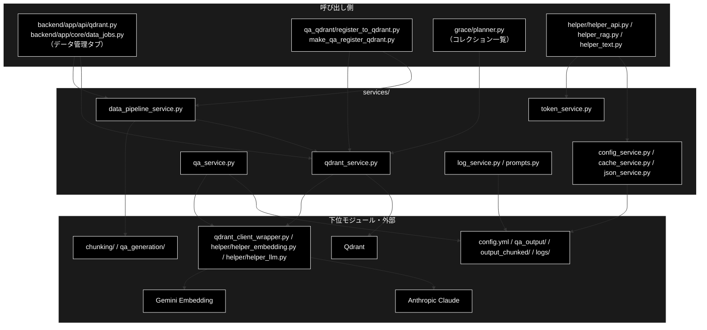

# README_services.md - services/ ディレクトリ概要

**Version 2.0** | 最終更新: 2026-10-10

`services/` パッケージの入口となる文書。ディレクトリの役割・モジュール索引・組み合わせ方・公開 API・既知の制約をまとめる。
文書を新しく書く／直す前に、まずここを見る。

> ⚠️ **本リポジトリは Anthropic 版。** 姉妹リポジトリ `grace_v2_local`（Ollama 版）にも同じ構成の `services/` があるが、
> `qa_service` が作る LLM クライアント・`config_service` の既定値・`token_service` の単価表・`prompts.py` の使われ方（local は計画生成プロンプトに埋め込む）が違う。
> 文書をコピーで持ち込まないこと（CLAUDE.md §5）。

---

## 目次

- [概要](#概要)
  - [主な責務](#主な責務)
  - [各責務対応のモジュール](#各責務対応のモジュール)
  - [アーキテクチャ構成図](#アーキテクチャ構成図)
- [1. モジュール一覧（索引）](#1-モジュール一覧索引)
- [2. 使い方（代表的なワークフロー）](#2-使い方代表的なワークフロー)
- [3. 公開 API（__init__.py）](#3-公開-api__init__py)
- [4. 処理フロー・データフロー](#4-処理フローデータフロー)
- [5. 既知の制約・残課題](#5-既知の制約残課題)
- [6. 変更履歴](#6-変更履歴)

---

## 概要

`services/` は、画面（`backend/app/`）・CLI（`qa_qdrant/`）・`grace/`・`helper/` から使う**共通の部品**を集めたパッケージである。
中心は **Qdrant の操作**（`qdrant_service`）と、データ管理タブ・CLI が同じ処理を呼ぶための**薄い層**（`data_pipeline_service`）で、
ほかは設定・キャッシュ・JSON・トークン数・ログ・プロンプト定数の小さな部品である。GRACE-Support / GRACE-Review の推論の本体はここには無い（`grace/`）。

### 主な責務

- 直下 `config.yml` を読む設定マネージャとロガーを提供する
- 関数の結果などをプロセス内のメモリにキャッシュする
- JSON を例外にせず安全に読み書きする
- トークン数を数え、LLM・Embedding のコストと上限を見積もる
- Qdrant の死活確認・登録・確認・統合・削除を行う
- データ管理タブと CLI から、チャンク化・Q/A 生成・コレクション操作を同じ関数で呼べるようにする
- 1 チャンクから Q/A を作って保存する
- 未回答質問ログを読む・消す
- 検索クエリ・回答生成の共通プロンプトを定数で持つ

### 各責務対応のモジュール

| # | 責務 | 対応モジュール | 説明 |
|---|------|--------------|------|
| 1 | 設定とロガー | `config_service.py` | `ConfigManager`（シングルトン）・`config`・`logger`・`get_config()`。直下 `config.yml` を読む（`grace/config.py` とは別物） |
| 2 | メモリキャッシュ | `cache_service.py` | `MemoryCache`（TTL・件数上限）・`@cache_result`・グローバルキャッシュ |
| 3 | JSON の入出力 | `json_service.py` | `safe_json_dumps` / `safe_json_loads` / `save_json_file` / `load_json_file` ほか。失敗は `None` や既定値で返す |
| 4 | トークン数とコスト | `token_service.py` | `TokenManager`・`count_tokens`（tiktoken `cl100k_base` の近似）・単価表・上限表 |
| 5 | Qdrant の操作 | `qdrant_service.py` | `QdrantHealthChecker`・`QdrantDataFetcher`・登録の 6 関数・`merge_collections` ほか |
| 6 | データ準備の Web 向けの層 | `data_pipeline_service.py` | 入力パスの検証・`run_chunking_sync`・`run_qa_generation_sync`・`delete_collection`・DataFrame の JSON 化 |
| 7 | 1 チャンクの Q/A 生成 | `qa_service.py` | `generate_qa_pairs`（Anthropic Claude の構造化出力）・`save_qa_pairs_to_file` |
| 8 | 未回答質問ログ | `log_service.py` | `load_unanswered_logs` / `clear_unanswered_logs`（書き込み関数は 2026-10-10 に削除） |
| 9 | 共通プロンプト | `prompts.py` | `SEARCH_QUERY_INSTRUCTION` / `ANSWER_GENERATION_INSTRUCTION`（2026-10-10 時点で本リポジトリのコードからの参照は無い） |

### アーキテクチャ構成図



**データフロー**:

1. データ管理タブのジョブ（`data_jobs.py`）は、`data_pipeline_service` で入力パスを検証し、チャンク化（`chunking/`）・Q/A 生成（`qa_generation/`）を同期で呼ぶ
2. Q/A の CSV は `qdrant_service` の登録関数で Gemini Embedding（3072 次元）に変え、Qdrant へ upsert する（CLI も同じ関数）
3. 画面のコレクション一覧・中身・削除は `qdrant_service` / `data_pipeline_service` を通り、DataFrame は JSON にできる形へ直して返す
4. 設定・キャッシュ・JSON・トークン数は `helper/` から部品として使われる

---

## 1. モジュール一覧（索引）

`services/*.py`（`__init__.py` を除く 9 モジュール）。処理フロー・データフローの別文書は置かない（理由は §4）。

| モジュール | 文書 | 種別 | 行数 | Ver | 概要 |
|---|---|---|---:|---|---|
| `qdrant_service.py` | [`qdrant_service.md`](./qdrant_service.md) | E | 1702 | 2.5 | Qdrant の死活確認・登録・確認・統合・削除 |
| `data_pipeline_service.py` | [`data_pipeline_service.md`](./data_pipeline_service.md) | E | 656 | 1.5 | データ管理タブと CLI の共通の層（パス検証・同期化・JSON 化） |
| `config_service.py` | [`config_service.md`](./config_service.md) | E | 977 | 1.9 | 直下 `config.yml` の設定マネージャとロガー |
| `token_service.py` | [`token_service.md`](./token_service.md) | E | 946 | 1.7 | トークン数・コスト・上限の見積もり |
| `json_service.py` | [`json_service.md`](./json_service.md) | E | 764 | 1.2 | 例外を出さない JSON の入出力 |
| `cache_service.py` | [`cache_service.md`](./cache_service.md) | E | 962 | 1.4 | TTL 付きのメモリキャッシュ |
| `qa_service.py` | [`qa_service.md`](./qa_service.md) | E | 554 | 1.4 | 1 チャンクの Q/A 生成と保存 |
| `log_service.py` | [`log_service.md`](./log_service.md) | E | 435 | 1.5 | 未回答質問ログを読む・消す |
| `prompts.py` | [`prompts.md`](./prompts.md) | E | 356 | 1.2 | 共通プロンプト定数 |
| ~~`agent_service.py`~~ | [`archive/agent_service.md`](./archive/agent_service.md) | — | — | — | **2026-10-10 に削除**（Legacy ReAct。文書は凍結） |

> 行数・Ver は `wc -l` と各文書の Version ヘッダーの実測値（2026-10-10）。

**依存関係**（`services/*.py` の import を AST で解析。2026-10-10 実測）: `services/` の中のモジュールどうしは**互いに import しない**
（`data_pipeline_service` が `qdrant_service` を使うのは呼び出し側の `backend/app/api/qdrant.py` で、モジュールの中ではない）。外への依存は次のとおり。

| モジュール | 依存先（`services/` の外） |
|---|---|
| `qdrant_service` | `config`（`ModelConfig`）・`helper.helper_embedding`・`qdrant_client_wrapper`・`qdrant_client`・`pandas` |
| `data_pipeline_service` | `chunking.*` / `qa_generation.pipeline`（関数の中で遅延 import）・`qdrant_client` |
| `qa_service` | `config`・`helper.helper_llm`・`models`・`pandas` |
| `token_service` | `config`（`ModelConfig.EMBEDDING_PRICING`）・`tiktoken` |
| `config_service` / `log_service` | `yaml` / `pandas` |
| `cache_service` / `json_service` / `prompts` | なし（標準ライブラリだけ） |

---

## 2. 使い方（代表的なワークフロー）

各モジュール単体の使い方は、それぞれの文書の **§4.1 使用例**（処理パターンごとの例）にある。ここには**モジュールを組み合わせる**流れだけを置く。

| 使い方 | 組み合わせ | 向いている場面 | 例 |
|---|---|---|---|
| Q/A の CSV を登録して確かめる | `data_pipeline_service.resolve_input_file` → `qdrant_service` の登録 6 関数 → `data_pipeline_service.dataframe_to_records` | データ管理タブ「③ Qdrant 登録」「④ コレクション管理」と同じ流れをスクリプトで行う | 2.1 |
| 補助の部品を組み合わせる | `token_service` ＋ `cache_service` ＋ `json_service` | 入力ファイルのトークン数とコストを見積もって保存する | 2.2 |
| import のしかた | `from services import X` ／ `from services.<module> import X` | どちらでも `services/__init__.py` が動く（§2.3） | 2.3 |

> 📝 2.1〜2.3 は**別プロセスでそのまま実行し**、出力を確かめてある（2026-10-10。2.1 は本物の Qdrant〔docker-compose〕と、Gemini Embedding のスタブ〔決定的なベクトル〕を使い、
> カレントは一時ディレクトリ。2.2 は tiktoken の符号表をダウンロードできない環境で実行したので、トークン数は簡易推定の値）。

### 2.1 Q/A の CSV を登録して確かめる

```python
from pathlib import Path

import pandas as pd
from qdrant_client import QdrantClient

from services.data_pipeline_service import (
    collection_columns,
    collection_exists,
    dataframe_to_records,
    delete_collection,
    resolve_input_file,
)
from services.qdrant_service import (
    QdrantDataFetcher,
    build_inputs_for_embedding,
    build_points_for_qdrant,
    create_or_recreate_collection_for_qdrant,
    embed_texts_for_qdrant,
    load_csv_for_qdrant,
    upsert_points_to_qdrant,
)

# 用意: Q/A 生成の出力（qa_output/ 直下の CSV）
Path("qa_output").mkdir(exist_ok=True)
pd.DataFrame({"question": ["住民票の写しはどこで取れますか？", "印鑑登録に必要なものは？"],
              "answer": ["市民課の窓口かコンビニで取れます。", "本人確認書類と登録する印鑑です。"],
              "chunk_id": ["c-1", "c-2"]}).to_csv("qa_output/gov_faq.csv", index=False)

# 1. 画面から渡る 'ディレクトリ/ファイル名' を検証して実パスへ
path = resolve_input_file("qa_output/gov_faq.csv")

# 2. 登録（CLI の register_to_qdrant.py と同じ順番）
client = QdrantClient(url="http://localhost:6333")
name = "doc_example_readme"
df = load_csv_for_qdrant(str(path))
vectors = embed_texts_for_qdrant(build_inputs_for_embedding(df, include_answer=True))
create_or_recreate_collection_for_qdrant(client, name, recreate=True, vector_size=3072)
print(upsert_points_to_qdrant(client, name, build_points_for_qdrant(df, vectors, domain="gov", source_file=str(path))))

# 3. 画面に返す形で中身を確かめる（DataFrame → list[dict]）
records = dataframe_to_records(QdrantDataFetcher(client).fetch_collection_points(name, limit=10))
print(collection_columns(records)[:6], sorted(r["chunk_id"] for r in records))

# 4. 片付け（Web では HITL CONFIRM を経てから消す）
delete_collection(client, name)
print(collection_exists(client, name))
```

```
# 出力例:
# 2
# ['ID', 'domain', 'question', 'answer', 'source', 'created_at'] ['c-1', 'c-2']
# False
```

> 📝 payload の `source` はファイル名（パスなし）、`chunk_id` / `topic` / `doc_id` は CSV にあれば残る。列の並びは `build_points_for_qdrant` が payload を作る順。
> ⚠️ Qdrant は grace_v2_local と共用なので、試すときは本番と重ならないコレクション名を使う（`recreate=True` は同名を消して作り直す）。

### 2.2 補助の部品を組み合わせる（トークン数の見積もりを保存する）

```python
import tempfile
from pathlib import Path

from config import ModelConfig
from services.cache_service import MemoryCache, cache_result
from services.json_service import load_json_file, save_json_file
from services.token_service import TokenManager, count_tokens

cache = MemoryCache(ttl=600)


@cache_result(cache=cache)            # 同じ文書を何度見積もっても数え直さない
def estimate(text: str) -> dict:
    tokens = count_tokens(text, model=ModelConfig.DEFAULT_MODEL)
    return {
        "tokens": tokens,
        "llm_usd": round(TokenManager.estimate_cost(tokens, 500, ModelConfig.DEFAULT_MODEL), 6),
        "embedding_usd": round(TokenManager.estimate_cost(tokens, 0, ModelConfig.EMBEDDING_MODEL, is_embedding=True), 8),
    }


docs = {"gov_faq": "住民票の写しは市民課の窓口で請求できます。" * 10, "ec_policy": "返品は到着後 8 日以内に受け付けます。" * 5}
report = {name: estimate(text) for name, text in docs.items()}
estimate(docs["gov_faq"])              # 2 回目はキャッシュから
out = Path(tempfile.mkdtemp()) / "estimate.json"
print(save_json_file(report, str(out)), cache.size())
print(load_json_file(str(out))["gov_faq"])
```

```
# 出力例（符号表が使えない環境。トークン数は簡易推定）:
# True 2
# {'tokens': 105, 'llm_usd': 0.00521, 'embedding_usd': 1.05e-05}
```

### 2.3 import のしかた

```python
import sys

from services.token_service import count_tokens   # noqa: F401  サブモジュールを直接 import しても…

# …パッケージの services/__init__.py が先に実行され、再エクスポート元の 6 モジュールがすべて読み込まれる
print(sorted(m for m in sys.modules if m.startswith("services.")))
```

```
# 出力例:
# ['services.cache_service', 'services.config_service', 'services.json_service', 'services.qa_service', 'services.qdrant_service', 'services.token_service']
```

> ⚠️ **`services` を import すると、`config_service` がカレントの `config.yml` を読み**（無ければ「設定ファイルが見つかりません」と表示して既定値で動く）、
> `qdrant_service` が `qdrant_client_wrapper`・`helper_embedding` を、`qa_service` が `helper_llm` を読み込む。`data_pipeline_service` / `log_service` / `prompts` は
> 再エクスポートされないので `from services.<module> import ...` で使う。

---

## 3. 公開 API（__init__.py）

`services/__init__.py` の `__all__`（**50 件**。`__version__` は無い）。`from services import ...` で使える。定義は各モジュールにあり、`__init__.py` は import と `__all__` だけを持つ。

| 名前 | 定義元 | 用途 |
|---|---|---|
| `QdrantHealthChecker` / `QdrantDataFetcher` / `get_collection_stats` / `get_all_collections` / `delete_all_collections` / `load_csv_for_qdrant` / `build_inputs_for_embedding` / `embed_texts_for_qdrant` / `create_or_recreate_collection_for_qdrant` / `build_points_for_qdrant` / `upsert_points_to_qdrant` / `embed_query_for_search` / `QDRANT_CONFIG` / `COLLECTION_EMBEDDINGS_SEARCH` / `COLLECTION_CSV_MAPPING` | `qdrant_service.py` | Qdrant の死活確認・確認・登録・削除（15） |
| `generate_qa_pairs` / `save_qa_pairs_to_file` | `qa_service.py` | 1 チャンクの Q/A 生成と保存（2） |
| `TokenManager` / `count_tokens` / `estimate_tokens_simple` / `truncate_text` / `get_llm_pricing` / `get_embedding_pricing` / `get_model_limits` / `DEFAULT_ENCODING` / `MODEL_ENCODINGS` / `LLM_PRICING` / `EMBEDDING_PRICING` / `MODEL_LIMITS` | `token_service.py` | トークン数・単価・上限（12） |
| `ConfigManager` / `config` / `logger` / `get_config` / `set_config` / `reload_config` | `config_service.py` | 直下 `config.yml` の設定とロガー（6） |
| `MemoryCache` / `cache_result` / `cache` / `get_global_cache` / `init_cache_from_config` | `cache_service.py` | メモリキャッシュ（5） |
| `safe_json_serializer` / `safe_json_dumps` / `safe_json_loads` / `load_json_file` / `save_json_file` / `load_json_file_or_default` / `merge_json_files` / `is_valid_json` / `pretty_print_json` / `compact_json` | `json_service.py` | JSON の入出力（10） |

> 📝 **再エクスポートされていないもの**は各モジュールから直接 import する: `data_pipeline_service` の全部・`log_service` の全部・`prompts` の定数、
> `qdrant_service` の `map_collection_to_csv` / `get_dynamic_collection_mapping` / `get_collection_embedding_params` / `batched` /
> `scroll_all_points_with_vectors` / `merge_collections` / `get_all_collections_simple`、`token_service.get_encoding`。
>
> ⚠️ `get_config` は `grace.config.get_config`（GRACE の設定オブジェクトを返す）と**名前が同じで中身が別**。`from services import *` と `from grace import *` を
> 同じファイルで使わない。

---

## 4. 処理フロー・データフロー

**`services_process_flow.md` / `services_data_flow.md` は置かない。** `services/` のモジュールは互いに呼び合わず、多段の処理は呼び出し側にあるため。

| 流れ | 正本 | 要約 |
|---|---|---|
| データ準備（チャンク化 → Q/A 生成 → Qdrant 登録 → コレクション管理） | [`backend/docs/data_pipeline.md`](../../backend/docs/data_pipeline.md) | データ管理タブのジョブ（`data_jobs.py`）が `data_pipeline_service` と `qdrant_service` を順に呼ぶ。CLI は `qa_qdrant/make_qa_register_qdrant.py` が同じ関数を呼ぶ |
| Qdrant への登録の順番 | [`qdrant_service.md` §4.1.2](./qdrant_service.md#412-qa-の-csv-を登録する) | CSV → 埋め込みの入力 → Gemini Embedding → コレクション → ポイント（内容から決まる ID）→ upsert |

`services/` が読み書きするファイル・DB:

| データ | 場所 | 読み書きするモジュール | 書き方 |
|---|---|---|---|
| 設定 | 直下 `config.yml`（カレントからの相対） | `config_service` | 読むだけ（`save()` を呼ぶと上書き） |
| Q/A の CSV / JSON | `qa_output/qa_pairs_<dataset>_<日時>.csv` / `.json` | `qa_service.save_qa_pairs_to_file` | 新規（日時つき） |
| チャンク化の途中経過 | `./checkpoints/<job_id>/` | `data_pipeline_service.run_chunking_sync`（`CheckpointManager`） | ステップごとに保存。`job_id` を渡すと再開 |
| 未回答質問ログ | `logs/unanswered_questions.csv` | `log_service` | 読む・ヘッダーだけに作り直す |
| ベクトル | Qdrant（`http://localhost:6333`。grace_v2_local と共用） | `qdrant_service` / `data_pipeline_service` | upsert・作り直し・削除 |

---

## 5. 既知の制約・残課題

| # | 内容 | 状態 |
|---|---|---|
| 1 | qdrant-client 1.19.1（`requirements-test.txt` の `>=1.15` で入る版）では `CollectionInfo.vectors_count` が無く、`QdrantDataFetcher.fetch_collections` / `fetch_collection_info`・`get_all_collections_simple` が件数を返せない（Error の行・`{"error": ...}`）。`backend/app/api/qdrant.py` のコレクション詳細が `fetch_collection_info` を使う | 2026-10-10 に確認。コードは未修正（`qdrant_service.md` §4.1.3） |
| 2 | `data_pipeline_service.delete_collection` は、コレクションが無くても `True` を返す（docstring は False と書いている） | 実装どおり。呼び出し側は先に `collection_exists` を見ている（`data_pipeline_service.md` §4.1.4） |
| 3 | `config_service.ConfigManager.get` は無いキーの既定値も `None` もキャッシュするので、既定値や `has` の結果が呼ぶ順番で変わる | 実装どおり（`config_service.md` §4.1.1） |
| 4 | `token_service` は最初の呼び出しで tiktoken の符号表をインターネットから取る。取れないと簡易推定に切り替わる | 実装どおり（`token_service.md` §4.1.1） |
| 5 | `qa_service` の 2 関数・`prompts.py` の 2 定数・`COLLECTION_EMBEDDINGS_SEARCH` / `COLLECTION_CSV_MAPPING`（空の辞書・非推奨）は、本リポジトリのコードから使われていない | 再エクスポートだけが残っている |

### 5.1 文書を保守するときの約束

| 置き場所 | 書くもの | 書かないもの |
|---|---|---|
| `<module>.md` | IPO（入出力・副作用・使用例） | 運用手順・他モジュールの仕様 |
| 本書 | 概要・索引・組み合わせ方・公開 API（`__init__.py`） | 各モジュールの IPO（リンクで参照） |
| `backend/docs/` | `backend/app/**` 側からの呼び出し方・データ準備の流れ | `services/` 内部の実装 |
| 直下 `docs/` | 2 領域以上にまたがる横断文書 | 1 モジュールの IPO |

> IPO 形式の仕様は `.claude/skills/grace-agent-docs/a_class_method_md_format.md`、本書は `a_cross_doc_md_format.md` §1.2。
> 重複禁止ルールと正本の一覧は [`docs/README.md`](../../docs/README.md) §4 が持つ。公開シンボルの網羅とリンクの確認は
> [`grace/docs/README_grace.md` §5.1](../../grace/docs/README_grace.md#51-文書を保守するときの約束) のスクリプトを対象パスだけ差し替えて使う。

**テスト**（2026-10-10 に `pytest --collect-only` で数えた値。記憶で書かないこと）:

| テストファイル | 件数 | 対象 |
|---|---:|---|
| `tests/test_qdrant_service.py` | 19 | `qdrant_service` |
| `tests/test_config_service.py` | 7 | `config_service`（既定値が `ModelConfig` と一致すること・既定プロバイダが Anthropic であること） |
| `tests/test_json_service.py` | 6 | `json_service` |
| `tests/test_token_service.py` | 6 | `token_service`（既定モデルが単価・上限表に載っていること） |
| `tests/test_cache_service.py` | 4 | `cache_service` |
| `tests/test_log_service.py` | 2 | `log_service` |
| `tests/test_qa_service.py` | 2 | `qa_service`（LLM クライアントが Anthropic で作られること） |
| `tests/test_data_pipeline.py` | 30 | `data_pipeline_service`・`qdrant_service` |
| `tests/test_data_jobs.py` | 44 | データ管理タブのジョブ全体（`data_pipeline_service` / `qdrant_service` 経由・**間接**） |
| `tests/test_model_selection.py` | 30 | モデル解決の 5 経路。うち 1 件が `config_service` の読む直下 `config.yml` |
| `tests/integration/test_qdrant_live.py` | 12 | 本物の Qdrant での `qdrant_service`（Qdrant が無ければ skip） |

```bash
uv run --no-sync pytest tests/test_*_service.py tests/test_data_pipeline.py -q
```

> 📌 上の `test_*_service.py` 7 本と `test_data_pipeline.py`（52 件）は 2026-09-25 に姉妹リポジトリ `grace_v2_local` の `tests/services/` から、
> 実装の差分を見て移植した（`config` / `token` は期待値を `config.ModelConfig` から引く形へ、`qa` は Anthropic で生成されることの検査を足した）。
> 本リポジトリの `tests/` はサブディレクトリを切らない。

---

## 6. 変更履歴

| バージョン | 日付 | 変更内容 |
|---|---|---|
| 1.0 | 2026-09-25 | 新規作成。`services/docs/` には棚卸し索引が無かった（姉妹リポジトリ `grace_v2_local` にはある）。本リポジトリの実ファイルから、文書一覧・実装カバレッジ・テスト件数（実測）・残タスクを記載。`ReActAgent` の呼び出し元を grep し、`grace/executor.py` の `run_legacy_agent` 分岐が残っていること（プランナは提示しない）を §4 に記録した |
| 1.1 | 2026-09-25 | 姉妹リポジトリから `services/` の単体テスト 8 ファイル・52 件を移植したのにあわせ、§6 のテスト件数と §7 の残タスクを更新 |
| 1.2 | 2026-09-26 | Embedding を `gemini-embedding-2` へ変えたのに追随して 6 文書（`__init__` / `agent_service` / `cache_service` / `config_service` / `qdrant_service` / `token_service`）の行数・Ver を再実測。実装行数も PR #216 で変わった `qdrant_service.py`（1104）/ `token_service.py`（351）を更新 |
| 1.3 | 2026-09-26 | Embedding を `gemini-embedding-001` に戻したのに追随して 6 文書の行数・Ver を再実測（実装行数は変化なし） |
| 1.4 | 2026-10-10 | `grace/step_trace/`（`benchmark.py` を含む）を 2026-10-10 にディレクトリごと削除したのに追随し、現状を述べる記述から外した（過去の経緯の記述は残す）。`agent_service.md` の行数・版を実測へ（623 行・v2.7。v2.6 までの更新が索引に反映されていなかった分を含む） |
| 1.5 | 2026-10-10 | Legacy ReAct 経路（`services/agent_service.py`・`agent_parallel_search.py`・`agent_cache.py`・`executor._execute_legacy_agent_step`・`run_legacy_agent` アクション）を 2026-10-10 に削除したのに追随 |
| 1.6 | 2026-10-10 | §4 の「呼び出し元が無くなったもの（コードは残している）」を「続けて削除したもの」へ書き換え（`log_unanswered_question()` / `generate_with_tools()` ほか）。`log_service` の行数・版とテスト件数（3 → 2）を実測値へ更新 |
| 1.7 | 2026-10-10 | テストの所在を `backend/tests/` からリポジトリ直下の `tests/` へ移したのに追随（パス・コマンド・import の表記） |
| 1.8 | 2026-10-10 | `grace/docs/` の構成整理（`README.md` → `README_grace.md`、`grace.md` / `grace_core.md` / `grace_runtime.md` / `confidence_calibration.md` を `README_grace.md` / `grace_process_flow.md` / `grace_data_flow.md` へ統合）に合わせてリンクを直した |
| 2.0 | 2026-10-10 | **`README.md` を `README_services.md` へ改称し、ディレクトリ概要に作り直した**（`a_cross_doc_md_format.md` §1.2 の構成）。(1) `__init__.md`（パッケージの構造・再エクスポート対応表）を §3 公開 API と概要へ統合し、`__init__.md` を削除した（`__all__` は 50 件。旧 `__init__.md` §6 の「計 62 シンボル」は誤り）。(2) 旧 §1 目的別の入口・§2 一覧・§3 実装カバレッジを §1 モジュール一覧へ、旧 §5 書き分けの約束・§6 テスト件数を §5.1 へまとめた（テスト件数は再実測。`test_data_jobs.py` 43 → 44、`tests/integration/test_qdrant_live.py` 12 件を追加）。旧 §4 の `agent_service.py` 削除の経緯は §1 の行と `archive/agent_service.md` に残した。(3) 処理フロー・データフローの別文書を置かない理由と、読み書きするファイル・DB の表を §4 に置いた。(4) §2 使い方にモジュールを組み合わせる例 3 本を新設し、本物の Qdrant とスタブの Embedding で実行して出力を確かめた。(5) 9 モジュールの §4.1 使用例を書き直す中で見つかった実装の制約（qdrant-client 1.19 の `vectors_count`・`delete_collection` の戻り値・`ConfigManager.get` のキャッシュ・tiktoken の符号表）を §5 に記録した |
