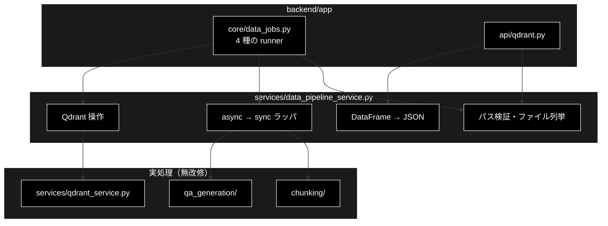
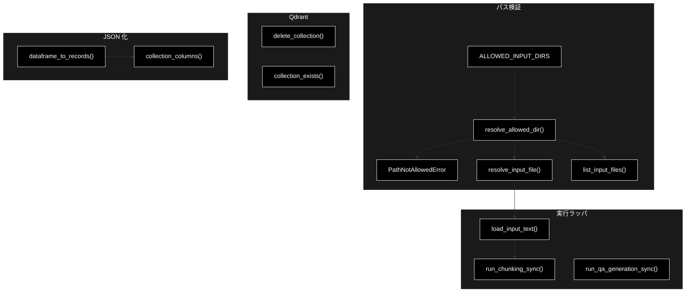
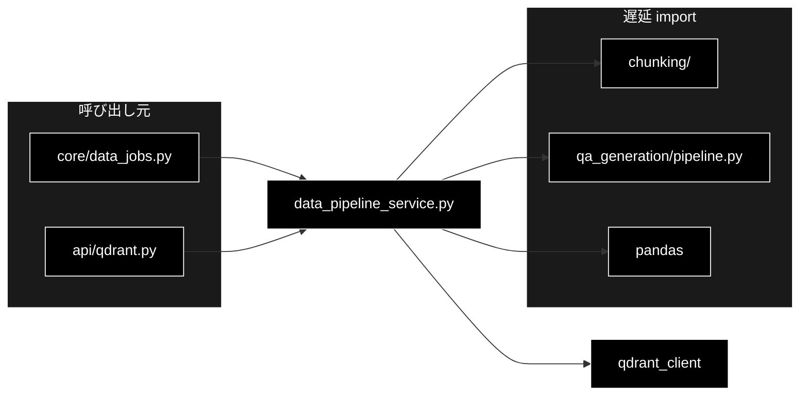

# data_pipeline_service.py - データ準備パイプラインの Web 向けラッパ層 ドキュメント

**Version 1.0** | 最終更新: 2026-09-12

---

## 目次

1. [概要](#概要)
2. [アーキテクチャ構成図](#1-アーキテクチャ構成図)
3. [モジュール構成図](#2-モジュール構成図)
4. [クラス・関数一覧表](#3-クラス関数一覧表)
5. [クラス・関数 IPO詳細](#4-クラス関数-ipo詳細)
6. [設定・定数](#5-設定定数)
7. [使用例](#6-使用例)
8. [エクスポート](#7-エクスポート)
9. [変更履歴](#8-変更履歴)
10. [付録: 依存関係図](#付録-依存関係図)

---

## 概要

`services/data_pipeline_service.py` は、CLI スクリプトに埋め込まれていたデータ準備処理を
**Web API から呼べる関数として切り出す層**である。実処理は `chunking/` `qa_generation/`
`qa_qdrant/` `services/qdrant_service.py` が持ち続け、**既存モジュールの中身は一切変更していない。**

呼び出し元は `backend/app/core/data_jobs.py` の 4 つの runner
（`chunking` / `qa` / `register` / `delete`）と `backend/app/api/qdrant.py`。
設計全体は [`backend/docs/data_pipeline.md`](../../backend/docs/data_pipeline.md) を参照。

### 主な責務

- CLI の `main()` に直書きされていた処理を**関数**として提供する
- pandas DataFrame を返す既存 API を、JSON 化できる素の `dict` / `list` へ変換する
- async なチャンキング処理を、同期のジョブ runner から呼べるようにラップする
- 入力ファイルのブラウズを、**許可ディレクトリ内に限定**して提供する

### 各責務対応のモジュール

| # | 責務 | 対応モジュール | 説明 |
|---|------|--------------|------|
| 1 | パス検証 | 本モジュール | ホワイトリスト ＋ `resolve()` の二段で基点の外を弾く |
| 2 | async → sync | 本モジュール | `chunks_all_async()` を `asyncio.run()` で包む |
| 3 | Q/A 生成の呼び出し | `qa_generation/pipeline.py` | `QAPipeline.run()` へ引数を詰め替えるだけ |
| 4 | Qdrant 操作 | `services/qdrant_service.py` | 一覧・削除の薄いラッパ |
| 5 | JSON 化 | 本モジュール | DataFrame の NaN を `None` へ寄せる |

### 主要機能一覧

| 機能 | 説明 |
|------|------|
| `ALLOWED_INPUT_DIRS` | 参照を許可する 4 ディレクトリ（backend / フロントと 1:1） |
| `PathNotAllowedError` | 許可外パスを指した |
| `resolve_allowed_dir()` | ディレクトリ名 → 絶対パス（検証つき） |
| `list_input_files()` | 入力ファイル候補の列挙（更新日時の降順） |
| `resolve_input_file()` | `dir/name` → 実パス |
| `delete_collection()` | コレクションを 1 つ削除（例外を投げず `bool`） |
| `collection_exists()` | 存在確認（削除前チェック用） |
| `dataframe_to_records()` | DataFrame → `list[dict]`（NaN → `None`） |
| `collection_columns()` | レコード列から出現順に列名を抽出 |
| `run_chunking_sync()` | `chunks_all_async()` の同期ラッパ |
| `run_qa_generation_sync()` | `QAPipeline.run()` の同期ラッパ |
| `load_input_text()` | CSV / テキストの読み込み |

---

## 1. アーキテクチャ構成図

### 1.1 システム全体構成



### 1.2 データフロー

1. 画面がディレクトリを選ぶ → `list_input_files()` が候補を `dir/name` 形式で返す
2. ジョブ起動時、runner が `resolve_input_file()` で実パスへ戻す（許可外は例外）
3. チャンク化は `load_input_text()` → `run_chunking_sync()`
4. Q/A 生成は `run_qa_generation_sync()`（`QAPipeline` へ委譲）
5. 参照系は `dataframe_to_records()` / `collection_columns()` で JSON 化して返す

---

## 2. モジュール構成図

### 2.1 内部モジュール構成



### 2.2 外部依存関係

| ライブラリ | 用途 |
|-----------|------|
| `qdrant-client` | `QdrantClient` の型・削除・一覧 |
| `pandas`（遅延 import） | DataFrame の NaN 処理 |

### 2.3 内部依存モジュール

| モジュール | 用途 | import のしかた |
|-----------|------|---|
| `chunking.checkpoint_manager` / `chunking.csv_text_to_chunks_text_csv` | チャンク化本体 | **関数内で遅延 import** |
| `qa_generation.pipeline.QAPipeline` | Q/A 生成本体 | **関数内で遅延 import** |

> 📝 **遅延 import は意図的。** `chunking` は tqdm / LLM SDK、`qa_generation` は
> celery / LLM クライアントを引き込む。コレクション一覧のようにこれらを通らない
> 経路へ import コストを払わせないため、モジュール先頭では読まない。

---

## 3. クラス・関数一覧表

### 3.1 クラス一覧

#### PathNotAllowedError

`ValueError` のサブクラス。許可ディレクトリの外を指すパスが渡されたことを表す。
API 層はこれを 400 / error イベントへ変換する。

### 3.2 関数一覧（カテゴリ別）

#### パス検証・ファイルブラウズ

| 関数名 | 概要 |
|-------|------|
| `resolve_allowed_dir(dir_name, base)` | 許可ディレクトリ名を絶対パスへ解決する |
| `list_input_files(dir_name, base, suffixes)` | 入力ファイル候補を更新日時の降順で列挙する |
| `resolve_input_file(rel_path, base)` | `dir/name` を実パスへ戻す |

#### Qdrant コレクション操作

| 関数名 | 概要 |
|-------|------|
| `delete_collection(client, collection_name)` | コレクションを 1 つ削除する（`bool` を返す） |
| `collection_exists(client, collection_name)` | 存在確認 |

#### JSON 化

| 関数名 | 概要 |
|-------|------|
| `dataframe_to_records(df)` | DataFrame → `list[dict]`（NaN → `None`） |
| `collection_columns(records)` | 出現順に列名を抽出する |

#### 実行ラッパ

| 関数名 | 概要 |
|-------|------|
| `run_chunking_sync(...)` | `chunks_all_async()` を `asyncio.run()` で包む |
| `run_qa_generation_sync(...)` | `QAPipeline.run()` へ引数を詰め替える |
| `load_input_text(path, ...)` | CSV / テキストを読み込む |

---

## 4. クラス・関数 IPO詳細

### 4.1 パス検証

#### `resolve_allowed_dir`

**概要**: 許可ディレクトリ名を絶対パスへ解決する。

```python
def resolve_allowed_dir(dir_name: str, base: Optional[Path] = None) -> Path
```

| 項目 | 内容 |
|------|------|
| **Input** | `dir_name`（`ALLOWED_INPUT_DIRS` のいずれか）、`base`（基点。既定はカレント） |
| **Process** | ① ホワイトリスト照合<br>② `resolve()` した結果が基点配下にあることを確認 |
| **Output** | 絶対パス（`Path`）。違反時は `PathNotAllowedError` |

> ⚠️ **ホワイトリスト照合だけでは足りない。** `OUTPUT/../..` のような値に備え、
> `resolve()` 後の位置も確かめる二段構えにしてある。

#### `list_input_files`

**概要**: 許可ディレクトリ内の入力ファイル候補を列挙する。

```python
def list_input_files(
    dir_name: str,
    base: Optional[Path] = None,
    suffixes: tuple[str, ...] = (".csv", ".txt"),
) -> List[Dict[str, Any]]
```

| 項目 | 内容 |
|------|------|
| **Input** | `dir_name`、`base`、`suffixes`（既定は `.csv` / `.txt`） |
| **Process** | ① `resolve_allowed_dir()` で解決<br>② `iterdir()` でファイルのみ走査<br>③ 更新日時の降順にソート |
| **Output** | `[{"name", "path", "size", "modified", "suffix"}, ...]`。ディレクトリが無ければ空リスト |

**戻り値例**:

```python
[
    {"name": "cc_news_chunks.csv", "path": "output_chunked/cc_news_chunks.csv",
     "size": 20480, "modified": 1757635200.0, "suffix": ".csv"},
]
```

> ⚠️ **`iterdir()` は再帰しない。** サブディレクトリのファイルは列挙されないため、
> ジョブの出力先を入れ子にすると**次の工程の選択肢に出てこない**。
> `QaGenerationParams.output_dir` の既定を `qa_output/pipeline` ではなく
> `qa_output` 直下にしてあるのはこのためである。

> 📝 `path` は `dir/name` 形式に限定し、**絶対パスは返さない**。
> 画面へリポジトリの実パスを出さないための決まりごと。

#### `resolve_input_file`

**概要**: `list_input_files()` が返した `dir/name` を実パスへ戻す。

```python
def resolve_input_file(rel_path: str, base: Optional[Path] = None) -> Path
```

| 項目 | 内容 |
|------|------|
| **Input** | `rel_path`（`dir/name` 形式）、`base` |
| **Process** | ① `/` で 2 分割できるか検証<br>② ファイル名側に区切りが混ざっていないか検証<br>③ ディレクトリをホワイトリスト照合<br>④ `resolve()` 後に基点配下か検証<br>⑤ 実ファイルの存在確認 |
| **Output** | 絶対パス（`Path`）。違反は `PathNotAllowedError`、不在は `FileNotFoundError` |

### 4.2 実行ラッパ

#### `run_chunking_sync`

**概要**: `chunks_all_async()` を同期呼び出しできるようにラップする。

```python
def run_chunking_sync(
    text: str, *, model: str, max_workers: int, block_size: int,
    output_file: str, dataset_type: str,
    source_file: Optional[str] = None, job_id: Optional[str] = None,
) -> List[str]
```

| 項目 | 内容 |
|------|------|
| **Input** | 入力テキスト、モデル、並列数、ブロックサイズ、出力先、再開用 `job_id` |
| **Process** | ① `CheckpointManager` を用意（`job_id` があれば再開）<br>② `asyncio.run(chunks_all_async(...))` |
| **Output** | チャンク文字列のリスト（CSV の書き出しは `chunks_all_async()` 側が行う） |

> ⚠️ **`asyncio.run()` は「実行中のイベントループが無いこと」を要求する。**
> FastAPI の async ハンドラから直接呼ぶと
> `RuntimeError: asyncio.run() cannot be called from a running event loop` になる。
> **必ずジョブのワーカースレッド側から呼ぶこと。**

#### `run_qa_generation_sync`

**概要**: チャンク済み CSV から Q/A ペアを生成する（`QAPipeline` の同期ラッパー）。

```python
def run_qa_generation_sync(
    input_file: str, *, model: str, output_dir: str,
    max_docs: Optional[int] = None, use_celery: bool = False,
    concurrency: int = 8, batch_chunks: int = 3,
    analyze_coverage: bool = True,
) -> Dict[str, Any]
```

| 項目 | 内容 |
|------|------|
| **Input** | チャンク済み CSV のパス、モデル（Anthropic Claude）、出力先、最大チャンク数、Celery 設定、カバレージ分析の有無 |
| **Process** | ① `QAPipeline` を生成<br>② `run()` へ引数を詰め替えて呼ぶ（**パイプライン本体は無改修**） |
| **Output** | `QAPipeline.run()` の戻り値そのまま |

**戻り値例**:

```python
{
    "success": True,
    "qa_count": 42,
    "coverage_results": {"coverage_rate": 0.83, "covered_chunks": 10, "total_chunks": 12},
    "saved_files": {"qa_csv": "qa_output/qa_pairs_x_20260912_010203.csv",
                    "qa_json": "qa_output/qa_pairs_x_20260912_010203.json"},
}
```

> 📝 **`run_chunking_sync()` と違い `asyncio.run()` は挟まない。**
> `QAPipeline.run()` は同期関数で、並列化は Celery か `ThreadPoolExecutor` の中に閉じている。

> ⚠️ **Celery ワーカーが立っていないときに `use_celery=True` を渡すと例外を投げる**
> （`check_celery_workers` が失敗する）。呼び出し側で握って error イベントへ変換すること。
> ワーカーの起動は `./start_celery.sh restart -c 8`。

> 📝 `celery_workers=1` を固定で渡しているが、これは**ワーカー数のチェック用**であって
> 並列度ではない。実際の並列数は `concurrency` が決める。

### 4.3 JSON 化

#### `dataframe_to_records`

**概要**: pandas DataFrame を JSON 化できる `list[dict]` へ変換する。

```python
def dataframe_to_records(df: Any) -> List[Dict[str, Any]]
```

| 項目 | 内容 |
|------|------|
| **Input** | DataFrame（`None` / 空も可） |
| **Process** | ① `None`・空を早期 return<br>② `astype(object).where(pd.notnull(df), None)` で NaN を `None` へ |
| **Output** | `list[dict]`。変換に失敗したらログを出して空リスト |

> ⚠️ **NaN を残すと JSON が壊れる。** `json.dumps` は `NaN` という**不正なトークン**を
> 出力するため、フロントの `JSON.parse` が失敗する。

---

## 5. 設定・定数

### `ALLOWED_INPUT_DIRS`

```python
ALLOWED_INPUT_DIRS: tuple[str, ...] = (
    "OUTPUT",          # 生データ（チャンク化の入力）
    "output_chunked",  # チャンク化の出力（Q/A 生成の入力）
    "qa_output",       # Q/A 生成の出力（Qdrant 登録の入力）
    "datasets",        # ダウンロードしたデータセット
)
```

**ここに無いディレクトリは参照させない。** パイプラインの流れ順に並んでおり、
フロントの `INPUT_DIRS`（`frontend/src/state/dataParams.ts`）と **1:1** で対応する。
片方だけ足すと画面に出ないか 400 になるので、**必ず両方に足す**。

---

## 6. 使用例

### 6.1 基本的なワークフロー（ファイル選択 → チャンク化）

```python
from services.data_pipeline_service import (
    list_input_files,
    load_input_text,
    resolve_input_file,
    run_chunking_sync,
)

# 画面に出す候補
files = list_input_files("OUTPUT")
print(files[0]["path"])          # 'OUTPUT/cc_news_1per.csv'

# ジョブ側（ワーカースレッド）
path = resolve_input_file("OUTPUT/cc_news_1per.csv")
text = load_input_text(path, text_column=None, max_rows=20)
chunks = run_chunking_sync(
    text,
    model="claude-haiku-4-5",
    max_workers=8,
    block_size=1000,
    output_file="output_chunked/cc_news_1per_chunks.csv",
    dataset_type="cc_news_1per",
)
print(len(chunks))
```

### 6.2 応用ワークフロー（チャンク済み CSV → Q/A 生成）

```python
from services.data_pipeline_service import run_qa_generation_sync

result = run_qa_generation_sync(
    "output_chunked/cc_news_1per_chunks.csv",
    model="claude-sonnet-4-6",
    output_dir="qa_output",      # ← 入れ子にしない（§4.1 の list_input_files 参照）
    max_docs=50,
    analyze_coverage=True,
)

if result.get("qa_count"):
    print(result["saved_files"]["qa_csv"])   # そのまま Qdrant 登録の入力になる
```

---

## 7. エクスポート

`__all__` の定義は無い。公開要素は以下のとおり。

```python
# 定数・例外
ALLOWED_INPUT_DIRS, PathNotAllowedError

# パス検証・ファイルブラウズ
resolve_allowed_dir, list_input_files, resolve_input_file

# Qdrant
delete_collection, collection_exists

# JSON 化
dataframe_to_records, collection_columns

# 実行ラッパ
run_chunking_sync, run_qa_generation_sync, load_input_text
```

---

## 8. 変更履歴

| バージョン | 変更内容 |
|-----------|---------|
| 1.0 | 初版作成。`services/docs/` で唯一欠けていた本モジュールを IPO 形式で記述。`run_qa_generation_sync()`（2026-09-12 追加）を含む（2026-09-12） |

---

## 付録: 依存関係図


